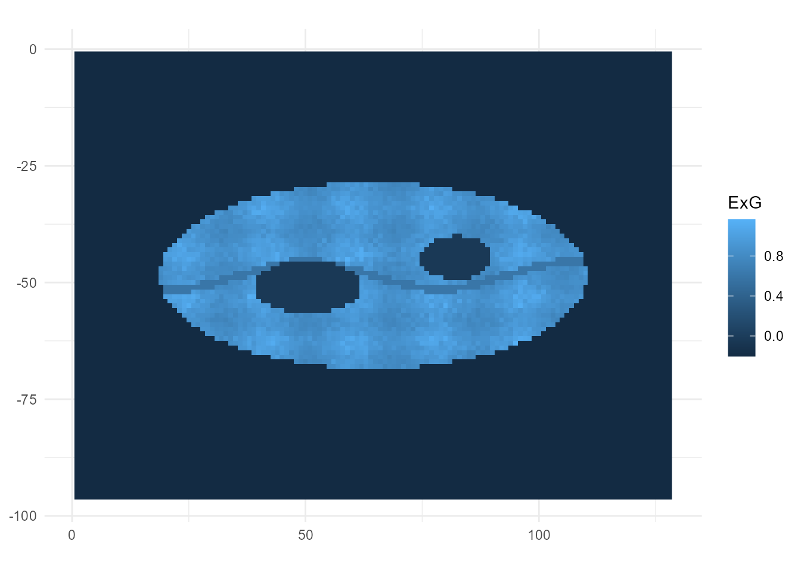
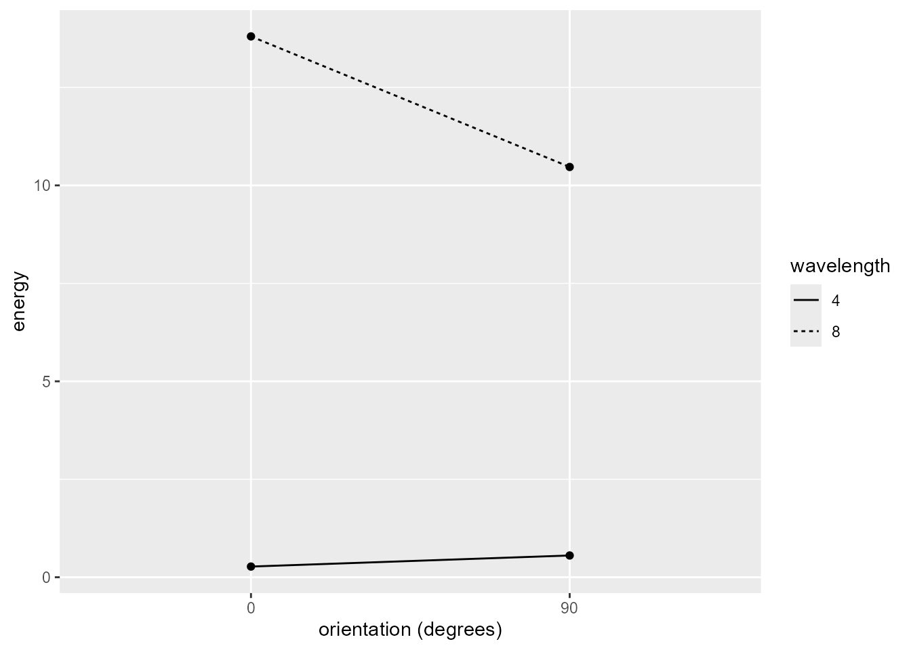
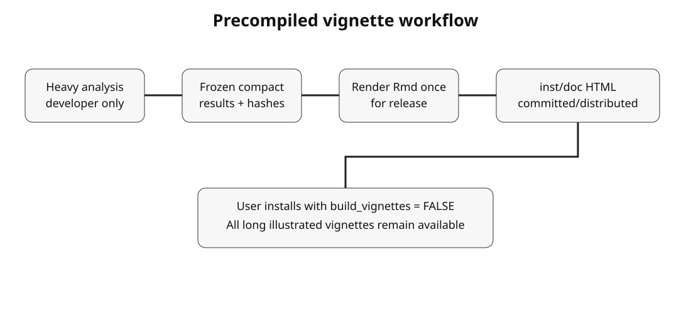
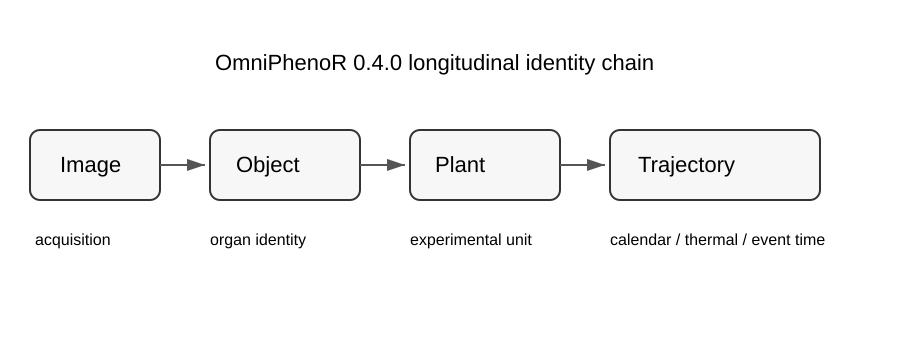
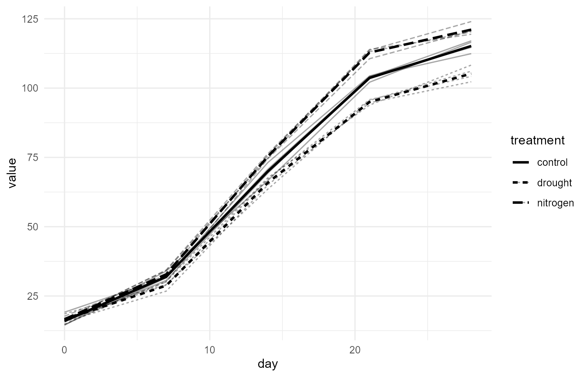
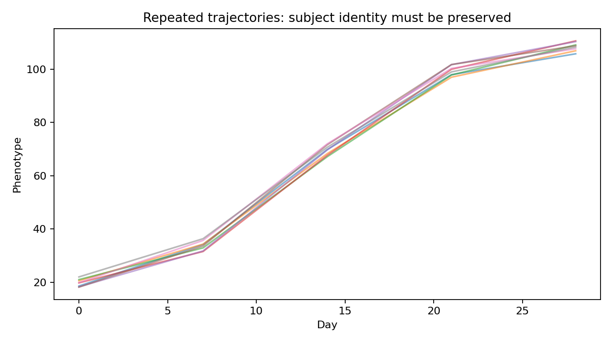
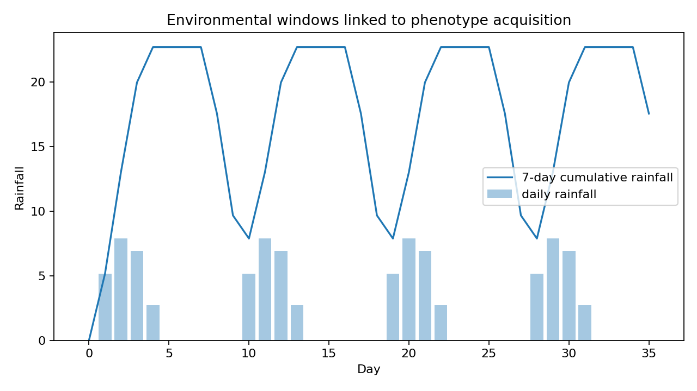

# OmniPhenoR: From RGB Leaf Images to Multiscale Digital Phenotyping

## OmniPhenoR: From RGB Leaf Images to Multiscale Digital Phenotyping

**Additional instructional vignette**\
**Package:** `OmniPhenoR`\
**Version targeted:** `0.1.0`\
**Format:** long-form R Markdown source with executable teaching
examples\
**Purpose:** a practical starting point for students, researchers,
reviewers, and analysts who need to move from an RGB plant image to
auditable phenotypic traits without losing experimental identity,
image-processing settings, or scientific interpretation.

> This tutorial deliberately follows the long, progressive instructional
> format used as the reference vignette for this package family. The
> examples use frozen synthetic teaching images generated by
> [`pheno_data()`](https://wep69.github.io/OmniPhenoR/reference/pheno_data.md).
> They are designed to expose algorithms, assumptions, and failure
> modes. They are not field evidence and must not be reported as
> biological results.

------------------------------------------------------------------------

### 1. Why this tutorial exists

Digital plant phenotyping is deceptively easy to demonstrate and
surprisingly difficult to conduct well. A photograph can be converted
into a number in a few lines of code, but a scientifically defensible
phenotype requires more than a successful function call. The analyst has
to know what the experimental unit is, how the image was acquired,
whether the color channels are calibrated, which pixels belong to the
plant, what a particular index actually means, whether a texture
descriptor is sensitive to rotation or scale, and whether the extracted
number can still be linked to the correct plot, plant, organ, date, and
treatment.

`OmniPhenoR` version 0.1.0 is organized around that chain of reasoning.
It is an R-first integrator. The package does not try to replace
established projects such as `pliman` for plant-image analysis ([Olivoto
2022](#ref-Olivoto2022)) or `FIELDimageR` for orthomosaic workflows
([Matias et al. 2020](#ref-Matias2020)). Instead, it provides a unified
public grammar for common phenotyping capabilities, explicit metadata
and provenance, deterministic native methods for core tasks, and
optional backends when a specialized engine adds scientific value.

The central rule of this tutorial is:

**Acquire and identify first. Calibrate when calibration is available.
Segment before measuring. Record every numerical definition. Treat
texture parameters as part of the phenotype. Validate the extraction
before interpreting biology.**

The tutorial starts with a single leaf image and gradually moves toward
disease severity, multiscale texture, spatial linkage, quality control,
workflow orchestration, and reproducible reporting.

------------------------------------------------------------------------

### 2. Learning objectives

After working through this tutorial, the reader should be able to:

1.  create an auditable phenotyping project and inspect available
    computational capabilities;
2.  distinguish pixel values from biological traits and preserve
    identifiers across processing stages;
3.  calibrate physical scale and understand the limits of simple RGB
    reference calibration;
4.  compute and interpret a broad catalog of visible-band RGB indices;
5.  recognize that the same index name can hide different formulas and
    avoid silent definition changes;
6.  segment plant tissue using transparent threshold rules and inspect
    the mask before measurement;
7.  extract area, perimeter, shape, and calibrated physical dimensions
    from connected objects;
8.  quantify disease severity from explicit leaf and lesion masks and
    understand why explicit masks are a validation reference;
9.  distinguish first-order, co-occurrence, run-length, local-pattern,
    gradient, filter-bank, wavelet, texture-energy, and Fourier
    descriptors;
10. choose gray-level quantization, distance, angle, wavelength, and
    scale parameters deliberately;
11. use
    [`pheno_texture()`](https://wep69.github.io/OmniPhenoR/reference/pheno_texture.md)
    to combine complementary descriptors without pretending that all
    texture methods answer the same question;
12. inspect image quality before accepting a phenotype;
13. link traits to `sf` geometries and extract raster summaries with
    `terra` while preserving experimental identifiers;
14. run inspectable workflows instead of opaque pipelines;
15. execute frozen validation checks and interpret validation as a
    scientific task rather than a software checkbox;
16. create figures, audit records, and report skeletons that separate
    numeric results from presentation;
17. understand what version 0.1.0 intentionally does not automate and
    when an optional backend should be preferred;
18. navigate the 32 implementation blocks without having to learn every
    function at once.

------------------------------------------------------------------------

### 3. The package in one map

#### 3.1 Instructional stages

| Blocks | Instructional stage | Main functions |
|:---|:---|:---|
| 1-3 | Project, capabilities, teaching data | [`pheno_project()`](https://wep69.github.io/OmniPhenoR/reference/pheno_project.md), [`pheno_capabilities()`](https://wep69.github.io/OmniPhenoR/reference/pheno_capabilities.md), [`pheno_blocks()`](https://wep69.github.io/OmniPhenoR/reference/pheno_blocks.md), [`pheno_data()`](https://wep69.github.io/OmniPhenoR/reference/pheno_data.md) |
| 4-6 | Input and calibration | [`pheno_read()`](https://wep69.github.io/OmniPhenoR/reference/pheno_read.md), [`pheno_calibrate_scale()`](https://wep69.github.io/OmniPhenoR/reference/pheno_calibrate_scale.md), [`pheno_calibrate_rgb()`](https://wep69.github.io/OmniPhenoR/reference/pheno_calibrate_rgb.md) |
| 7-8 | Expanded RGB indices | [`pheno_rgb_catalog()`](https://wep69.github.io/OmniPhenoR/reference/pheno_rgb_catalog.md), [`pheno_rgb_indices()`](https://wep69.github.io/OmniPhenoR/reference/pheno_rgb_indices.md), [`pheno_rgb_summary()`](https://wep69.github.io/OmniPhenoR/reference/pheno_rgb_summary.md) |
| 9-10 | Classical segmentation | [`pheno_segment()`](https://wep69.github.io/OmniPhenoR/reference/pheno_segment.md) |
| 11 | Morphometry | [`pheno_morphology()`](https://wep69.github.io/OmniPhenoR/reference/pheno_morphology.md) |
| 12 | Phytopathometry | [`pheno_disease()`](https://wep69.github.io/OmniPhenoR/reference/pheno_disease.md) |
| 13-22 | Texture and frequency domain | [`pheno_first_order()`](https://wep69.github.io/OmniPhenoR/reference/pheno_first_order.md), [`pheno_glcm()`](https://wep69.github.io/OmniPhenoR/reference/pheno_glcm.md), [`pheno_glrlm()`](https://wep69.github.io/OmniPhenoR/reference/pheno_glrlm.md), [`pheno_lbp()`](https://wep69.github.io/OmniPhenoR/reference/pheno_lbp.md), [`pheno_hog()`](https://wep69.github.io/OmniPhenoR/reference/pheno_hog.md), [`pheno_gabor()`](https://wep69.github.io/OmniPhenoR/reference/pheno_gabor.md), [`pheno_dwt()`](https://wep69.github.io/OmniPhenoR/reference/pheno_dwt.md), [`pheno_laws()`](https://wep69.github.io/OmniPhenoR/reference/pheno_laws.md), [`pheno_fft_texture()`](https://wep69.github.io/OmniPhenoR/reference/pheno_fft_texture.md), [`pheno_texture()`](https://wep69.github.io/OmniPhenoR/reference/pheno_texture.md) |
| 23-25 | QC, validation, provenance | [`pheno_qc()`](https://wep69.github.io/OmniPhenoR/reference/pheno_qc.md), [`pheno_validate()`](https://wep69.github.io/OmniPhenoR/reference/pheno_validate.md), [`pheno_audit()`](https://wep69.github.io/OmniPhenoR/reference/pheno_audit.md) |
| 26-27 | Spatial linkage | [`pheno_spatial_extract()`](https://wep69.github.io/OmniPhenoR/reference/pheno_spatial_extract.md), [`pheno_spatialize()`](https://wep69.github.io/OmniPhenoR/reference/pheno_spatialize.md) |
| 28-29 | Workflow orchestration | [`pheno_workflow()`](https://wep69.github.io/OmniPhenoR/reference/pheno_workflow.md), [`pheno_pipeline()`](https://wep69.github.io/OmniPhenoR/reference/pheno_pipeline.md) |
| 30-31 | Communication | [`pheno_plot()`](https://wep69.github.io/OmniPhenoR/reference/pheno_plot.md), [`pheno_report()`](https://wep69.github.io/OmniPhenoR/reference/pheno_report.md) |
| 32 | Reference verification | metadata ledger and `references.bib` |

The progression is deliberate. A texture algorithm should not be the
first thing applied to an image whose scale, color representation, and
plant mask are unknown. Likewise, a beautifully rendered map should not
be treated as evidence that traits were joined to the correct
experimental units.

#### 3.2 Inspect the package programmatically

``` r

pheno_capabilities()
#> # A tibble: 40 × 5
#>    capability     engine            package     available status   
#>    <chr>          <chr>             <chr>       <lgl>     <chr>    
#>  1 rgb_indices    native            NA          TRUE      available
#>  2 segmentation   native/torch      NA          TRUE      available
#>  3 morphology     native            NA          TRUE      available
#>  4 texture        native            NA          TRUE      available
#>  5 plant_image    pliman            pliman      TRUE      available
#>  6 orthomosaic    FIELDimageR       FIELDimageR TRUE      available
#>  7 spatial_vector sf/terra          terra       TRUE      available
#>  8 gabor          native/OpenImageR OpenImageR  TRUE      available
#>  9 wavelet        native/waveslim   waveslim    TRUE      available
#> 10 deep_learning  torch             torch       TRUE      available
#> # ℹ 30 more rows
pheno_blocks()
#> # A tibble: 240 × 5
#>    block module              primary_function      introduced status     
#>    <int> <chr>               <chr>                 <chr>      <chr>      
#>  1     1 Project object      pheno_project         0.1.0      implemented
#>  2     2 Capability registry pheno_capabilities    0.1.0      implemented
#>  3     3 Teaching data       pheno_data            0.1.0      implemented
#>  4     4 Image ingestion     pheno_read            0.1.0      implemented
#>  5     5 Scale calibration   pheno_calibrate_scale 0.1.0      implemented
#>  6     6 RGB calibration     pheno_calibrate_rgb   0.1.0      implemented
#>  7     7 RGB index catalog   pheno_rgb_catalog     0.1.0      implemented
#>  8     8 RGB index engine    pheno_rgb_indices     0.1.0      implemented
#>  9     9 Index segmentation  pheno_segment         0.1.0      implemented
#> 10    10 Otsu segmentation   pheno_segment         0.1.0      implemented
#> # ℹ 230 more rows
pheno_blocks("RGB|texture")
#> # A tibble: 13 × 5
#>    block module                      primary_function         introduced status 
#>    <int> <chr>                       <chr>                    <chr>      <chr>  
#>  1     6 RGB calibration             pheno_calibrate_rgb      0.1.0      implem…
#>  2     7 RGB index catalog           pheno_rgb_catalog        0.1.0      implem…
#>  3     8 RGB index engine            pheno_rgb_indices        0.1.0      implem…
#>  4    13 First-order texture         pheno_first_order        0.1.0      implem…
#>  5    20 Laws texture energy         pheno_laws               0.1.0      implem…
#>  6    21 FFT texture                 pheno_fft_texture        0.1.0      implem…
#>  7    22 Unified texture engine      pheno_texture            0.1.0      implem…
#>  8    67 RGB numerical validation    pheno_rgb_validate       0.2.0      implem…
#>  9    68 RGB grouped comparison      pheno_rgb_compare        0.2.0      implem…
#> 10    69 RGB correlation diagnostics pheno_rgb_cor            0.2.0      implem…
#> 11    70 RGB target ranking          pheno_rgb_rank           0.2.0      implem…
#> 12    71 Texture grid mapping        pheno_texture_grid       0.2.0      implem…
#> 13    72 Multiscale texture analysis pheno_texture_multiscale 0.2.0      implem…
```

**Interpretation.** Availability and validation are different ideas.
[`pheno_capabilities()`](https://wep69.github.io/OmniPhenoR/reference/pheno_capabilities.md)
tells you whether a backend package is installed in the current R
library. It does not claim that every optional path has been benchmarked
on every image type. The audit record and validation evidence should
state what was actually executed.

------------------------------------------------------------------------

### 4. Teaching objects used in this tutorial

Version 0.1.0 ships deterministic teaching objects rather than
pretending that synthetic images are real agronomic observations.

``` r

img <- pheno_data("leaf_rgb")
gray <- pheno_data("leaf_gray")
truth_leaf <- pheno_data("leaf_mask")
truth_lesion <- pheno_data("lesion_mask")
canopy <- pheno_data("canopy_rgb")

c(
  image_height = dim(img)[1],
  image_width = dim(img)[2],
  leaf_fraction = mean(truth_leaf),
  lesion_fraction_of_leaf = sum(truth_lesion) / sum(truth_leaf)
)
#>            image_height             image_width           leaf_fraction 
#>               96.000000              128.000000                0.233724 
#> lesion_fraction_of_leaf 
#>                0.110376
```

| Teaching object | Intended use | What is known by construction |
|:---|:---|:---|
| `leaf_rgb` | leaf segmentation, RGB indices, disease, texture | RGB channels, green leaf ellipse, veins, brown lesions, contrasting background |
| `leaf_gray` | texture methods | deterministic grayscale transformation of `leaf_rgb` |
| `leaf_mask` | segmentation ground truth | exact synthetic leaf foreground |
| `lesion_mask` | disease ground truth | exact synthetic lesion pixels inside the leaf |
| `canopy_rgb` | repeated green objects on soil | simple canopy-like objects for segmentation teaching |

The synthetic truth masks are especially useful because they let us test
the extraction algorithm without confusing biological variability with
software correctness.

## Part I. Core project and acquisition logic

### 5. Start with the biological identity, not the image file

An image has a file name. A phenotype needs an identity.

``` r

design <- data.frame(
  plot_id = sprintf("P%02d", 1:6),
  treatment = rep(c("control", "stress"), each = 3),
  block = rep(1:3, times = 2)
)

project <- pheno_project(
  study = "soybean_water_stress_2026",
  metadata = list(
    sensor = "RGB",
    acquisition = "controlled bench",
    operator = "teaching example"
  ),
  design = design
)

project
#> <pheno_project> soybean_water_stress_2026 
#>   design rows: 6 
#>   metadata: 3 fields
#>   results: 0 objects
```

#### 5.1 Why this matters

The processing output should eventually be able to answer questions such
as:

- Which study produced this image?
- Which plot and plant does it represent?
- Which organ was measured?
- Was the image acquired before or after treatment application?
- Which segmentation rule generated the mask?
- Which version of the RGB index definition was used?
- Which texture distance, direction, quantization, and scale were used?

If those answers are reconstructed from memory after the analysis,
reproducibility is already compromised.

------------------------------------------------------------------------

### 6. Image ingestion is not calibration

[`pheno_read()`](https://wep69.github.io/OmniPhenoR/reference/pheno_read.md)
can read photographic images through `magick` and spatial rasters
through `terra` when the optional packages are installed. Reading bytes
correctly does not establish physical scale or radiometric
comparability.

``` r

# The built-in teaching image is already an in-memory RGB array.
str(img)
#>  num [1:96, 1:128, 1:3] 0.86 0.86 0.86 0.86 0.86 0.86 0.86 0.86 0.86 0.86 ...
#>  - attr(*, "dimnames")=List of 3
#>   ..$ : NULL
#>   ..$ : NULL
#>   ..$ : chr [1:3] "R" "G" "B"
range(img)
#> [1] 0.07691469 0.86000000
```

A production acquisition protocol should document at least camera or
sensor, focal configuration where relevant, illumination, white balance
behavior, image format, compression, working distance for close-range
images, reference target, spatial resolution, acquisition time, and any
transformation performed before the file reached R.

#### Interpretation

Two images can both be valid 8-bit JPEG files and still be
scientifically incomparable because automatic exposure or white balance
changed between acquisitions. OmniPhenoR therefore keeps image reading
separate from calibration and quality control.

------------------------------------------------------------------------

### 7. Physical scale calibration

If a known ruler segment or calibration object spans 200 pixels and
represents 50 mm, then each pixel represents 0.25 mm.

``` r

scale_mm <- pheno_calibrate_scale(
  pixel_distance = 200,
  known_distance = 50,
  unit = "mm"
)

scale_mm
#> $units_per_pixel
#> [1] 0.25
#> 
#> $pixels_per_unit
#> [1] 4
#> 
#> $unit
#> [1] "mm"
#> 
#> $pixel_distance
#> [1] 200
#> 
#> $known_distance
#> [1] 50
#> 
#> attr(,"class")
#> [1] "pheno_scale"
```

The two reciprocal quantities are useful:

``` r

scale_mm$units_per_pixel
#> [1] 0.25
scale_mm$pixels_per_unit
#> [1] 4
```

A binary mask can then be reported both in pixel units and physical
units.

``` r

shape_scaled <- pheno_morphology(truth_leaf, scale = scale_mm)
shape_scaled[, c("area_px", "perimeter_px", "area", "perimeter")]
#> # A tibble: 1 × 4
#>   area_px perimeter_px  area perimeter
#>     <int>        <int> <dbl>     <dbl>
#> 1    2872          264  180.        66
```

#### Interpretation

Area scales with the square of the pixel-to-length conversion. A 1%
error in linear scale can propagate differently into area and length
traits. Calibration uncertainty should therefore be treated as a
scientific source of uncertainty in high-precision studies, not just as
a display preference.

------------------------------------------------------------------------

### 8. Simple RGB reference calibration

Version 0.1.0 provides a transparent channel-wise gain correction when
an observed reference patch and desired target values are known.

``` r

calibrated <- pheno_calibrate_rgb(
  img,
  observed = c(R = 0.80, G = 0.76, B = 0.74),
  target = c(R = 0.90, G = 0.90, B = 0.90),
  clip = c(0, 1)
)

dim(calibrated)
#> [1]  96 128   3
```

This operation is intentionally simple. It is useful for teaching and
controlled use cases where multiplicative channel correction is
defensible. It is not a substitute for a full radiometric model,
camera-response characterization, reflectance-panel workflow, or
illumination model.

## Part II. RGB indices as explicit numerical definitions

### 9. Why RGB indices require a registry

Visible-band vegetation indices are attractive because they transform
three channels into interpretable contrasts. They are also dangerous
when formula names are treated as universally standardized. Historical
work on crop and weed discrimination developed normalized chromatic
coordinates and excess-green formulations ([Woebbecke et al.
1995](#ref-Woebbecke1995)), while later work established visible
normalized differences and atmospheric-resistance concepts ([Gitelson et
al. 2002](#ref-Gitelson2002)). TGI was derived as a visible-band
chlorophyll-sensitive index ([Hunt et al. 2013](#ref-Hunt2013)).
Agricultural image-processing studies expanded the family further
([Guijarro et al. 2011](#ref-Guijarro2011); [Meyer et al.
2004](#ref-Meyer2004)).

`OmniPhenoR` therefore treats the formula definition as part of the
phenotype.

``` r

cat_rgb <- pheno_rgb_catalog()
cat_rgb
#> # A tibble: 59 × 7
#>    index family formula                 scaling canonical alias_of reference_key
#>    <chr> <chr>  <chr>                   <chr>   <lgl>     <chr>    <chr>        
#>  1 R     basic  R                       native  TRUE      NA       NA           
#>  2 G     basic  G                       native  TRUE      NA       NA           
#>  3 B     basic  B                       native  TRUE      NA       NA           
#>  4 r     basic  R/(R+G+B)               invari… TRUE      NA       NA           
#>  5 g     basic  G/(R+G+B)               invari… TRUE      NA       NA           
#>  6 b     basic  B/(R+G+B)               invari… TRUE      NA       NA           
#>  7 INT   basic  (R+G+B)/3               native  TRUE      NA       NA           
#>  8 LUMA  basic  0.2126R+0.7152G+0.0722B unit    TRUE      NA       NA           
#>  9 Grey  basic  0.2898r+0.5870g+0.1140b invari… TRUE      NA       NA           
#> 10 BI    basic  sqrt((R^2+G^2+B^2)/3)   native  TRUE      NA       NA           
#> # ℹ 49 more rows
```

``` r

as.data.frame(table(cat_rgb$family))
#>              Var1 Freq
#> 1           basic   13
#> 2 color-composite    8
#> 3      difference    6
#> 4           ratio    6
#> 5      vegetation   26
```

Version 0.1.0 exposes **59 named RGB/color descriptors**, organized as
basic channels and color coordinates, channel differences, channel
ratios, vegetation-oriented transforms, and composite color indices.

------------------------------------------------------------------------

### 10. The NGRDI naming problem is handled explicitly

A common two-channel visible normalized difference is

``` math
\mathrm{NGRDI} = \frac{G-R}{G+R}.
```

Some software and applied articles have used a three-channel denominator
under a similar or identical label. OmniPhenoR does not silently choose
one according to backend. It exposes:

- `NGRDI = (G-R)/(G+R)`;
- `GRVI` as an alias of the same canonical two-channel form;
- `NGRDI3 = (G-R)/(R+G+B)` for the three-channel alternative.

``` r

pix <- data.frame(R = 0.20, G = 0.60, B = 0.10)
pheno_rgb_indices(
  pix,
  c("NGRDI", "GRVI", "NGRDI3")
)
#> # A tibble: 1 × 3
#>   NGRDI  GRVI NGRDI3
#>   <dbl> <dbl>  <dbl>
#> 1   0.5   0.5  0.444
```

#### Interpretation

A numerical definition should survive a software change. If a manuscript
states only “NGRDI was calculated” without giving the formula or a
versioned software reference, reproducibility may be insufficient.
OmniPhenoR’s explicit `NGRDI3` naming is designed to prevent that
ambiguity.

------------------------------------------------------------------------

### 11. Normalized chromatic coordinates

``` r

coords <- pheno_rgb_indices(
  img,
  c("r", "g", "b")
)

summary(as.vector(coords[, , "r"] + coords[, , "g"] + coords[, , "b"]))
#>    Min. 1st Qu.  Median    Mean 3rd Qu.    Max. 
#>       1       1       1       1       1       1
```

For finite nonblack pixels, $`r + g + b`$ is approximately one by
construction. These coordinates reduce sensitivity to overall intensity
but do not magically remove all illumination effects, spectral
differences among cameras, clipping, shadows, or color-processing
effects.

------------------------------------------------------------------------

### 12. Core greenness indices

``` r

green_stack <- pheno_rgb_indices(
  img,
  c("ExG", "NGRDI", "GLI", "VARI", "RGBVI", "MGRVI", "TGI")
)

dim(green_stack)
#> [1]  96 128   7
```

Summarize only the known leaf region:

``` r

pheno_rgb_summary(
  img,
  indices = c("ExG", "NGRDI", "GLI", "VARI", "RGBVI", "MGRVI", "TGI"),
  mask = truth_leaf
)
#> # A tibble: 7 × 7
#>   index     n   mean     sd median     q05    q95
#>   <chr> <int>  <dbl>  <dbl>  <dbl>   <dbl>  <dbl>
#> 1 ExG    2872  0.781  0.306  0.873 -0.0440  1.03 
#> 2 NGRDI  2872  0.435  0.257  0.513 -0.266   0.634
#> 3 GLI    2872  0.478  0.187  0.538 -0.0333  0.615
#> 4 VARI   2872  0.554  0.317  0.650 -0.313   0.799
#> 5 RGBVI  2872  0.761  0.214  0.835  0.167   0.893
#> 6 MGRVI  2872  0.668  0.416  0.812 -0.497   0.904
#> 7 TGI    2872 34.6   11.5   39.1    2.85   39.6
```

#### 12.1 ExG

The excess-green family originates from the idea that green vegetation
should have a green chromatic component larger than red and blue
components. The widely used `2g-r-b` form is directly connected to early
machine-vision work ([Woebbecke et al. 1995](#ref-Woebbecke1995)).

#### 12.2 NGRDI / GRVI

A normalized green-red contrast places the difference on a relative
scale when the denominator is positive. It is often more comparable
across overall brightness levels than a raw `G-R` difference, but camera
processing and shadow remain relevant.

#### 12.3 GLI

`GLI = (2G-R-B)/(2G+R+B)` extends the green contrast to both non-green
channels.

#### 12.4 VARI

`VARI = (G-R)/(G+R-B)` was developed for visible-range
vegetation-fraction estimation and designed to reduce some atmospheric
influence ([Gitelson et al. 2002](#ref-Gitelson2002)). It is not
automatically the best segmentation index for every close-range image.

#### 12.5 RGBVI and MGRVI

Squared-channel formulations increase nonlinear contrast. Their stronger
mathematical transformation also means that noise, clipping, and
calibration differences can propagate differently than in linear ratios.

#### 12.6 TGI

TGI uses the geometry of visible reflectance around
chlorophyll-sensitive wavelengths and has an explicit canopy-chlorophyll
motivation ([Hunt et al. 2013](#ref-Hunt2013)). In an ordinary camera,
channel spectral response functions are broad; interpreting a
camera-derived TGI as laboratory chlorophyll concentration requires
calibration evidence.

------------------------------------------------------------------------

### 13. Difference and ratio families

Raw differences can be useful in controlled illumination because their
sign is intuitive.

``` r

pheno_rgb_indices(
  data.frame(R = c(40, 80), G = c(120, 95), B = c(30, 60)),
  c("GRD", "RGD", "GBD", "RBD"),
  scale = "byte"
)
#> # A tibble: 2 × 4
#>     GRD   RGD   GBD   RBD
#>   <dbl> <dbl> <dbl> <dbl>
#> 1    80   -80    90    10
#> 2    15   -15    35    20
```

Ratios can emphasize relative channel dominance:

``` r

pheno_rgb_indices(
  data.frame(R = c(40, 80), G = c(120, 95), B = c(30, 60)),
  c("GRRI", "GBRI", "RGRI", "BRRI"),
  scale = "byte"
)
#> # A tibble: 2 × 4
#>    GRRI  GBRI  RGRI  BRRI
#>   <dbl> <dbl> <dbl> <dbl>
#> 1  3     4    0.333  0.75
#> 2  1.19  1.58 0.842  0.75
```

#### Interpretation

Ratios become unstable when the denominator approaches zero. OmniPhenoR
returns `NA` rather than allowing infinite values to propagate silently.
The denominator tolerance is a numerical safeguard, not a substitute for
inspecting sensor clipping and invalid pixels.

------------------------------------------------------------------------

### 14. Scale-dependent historical indices

Some historical formulas contain additive constants or coefficients that
assume a particular channel scale. OmniPhenoR internally distinguishes
unit-scaled and byte-scaled formulas where possible.

``` r

a <- pheno_rgb_indices(
  data.frame(R = 0.20, G = 0.60, B = 0.10),
  c("CIVE", "TGI", "MxEG"),
  scale = "unit"
)

b <- pheno_rgb_indices(
  data.frame(R = 51, G = 153, B = 25.5),
  c("CIVE", "TGI", "MxEG"),
  scale = "byte"
)

rbind(unit_input = a, byte_input = b)
#> # A tibble: 2 × 3
#>    CIVE   TGI  MxEG
#> * <dbl> <dbl> <dbl>
#> 1 -73.0    44  140.
#> 2 -73.0    44  140.
```

The central lesson is not that all historical indices become perfectly
interchangeable after scaling. It is that software must expose its
scaling rule so that the analyst knows what number was calculated.

------------------------------------------------------------------------

### 15. Do not select an RGB index only because it gives the desired biological result

A defensible selection process can use:

1.  image-acquisition physics;
2.  separation of annotated foreground and background pixels;
3.  stability across lighting conditions or acquisition dates;
4.  segmentation metrics against ground truth;
5.  sensitivity analysis across plausible thresholds;
6.  independent validation images.

It should not use the downstream treatment p-value as the main
optimization target. That practice would leak biological inference
backward into image preprocessing and can exaggerate evidence.

## Part III. Segmentation and morphometry

### 16. Segment the leaf with a transparent rule

``` r

leaf_mask <- pheno_segment(
  img,
  index = "ExG",
  threshold = "otsu",
  direction = "above",
  min_size = 50
)

leaf_mask
#> <pheno_mask> 96 x 128 
#>   foreground pixels: 2872 ( 23.37 %)
#>   index: ExG  threshold: -0.045772 
#>   engine: native
```

Because this synthetic image has a known truth mask, we can compare
directly.

``` r

intersection <- sum(leaf_mask & truth_leaf)
union <- sum(leaf_mask | truth_leaf)

iou <- intersection / union
dice <- 2 * intersection / (sum(leaf_mask) + sum(truth_leaf))

c(IoU = iou, Dice = dice)
#>  IoU Dice 
#>    1    1
```

#### Interpretation

In a real study, the truth mask would come from expert annotation or an
independently validated procedure. A threshold that works on one
photograph is not evidence that it generalizes to a new date, camera,
genotype, soil background, disease stage, or light environment.

------------------------------------------------------------------------

### 17. Otsu thresholding is a candidate rule, not a universal truth

Otsu thresholding searches for a partition that maximizes between-class
separation in the score histogram. It is attractive when plant and
background produce a useful bimodal distribution. It can fail when the
background is heterogeneous, when leaves occupy a very small fraction of
the image, when shadows create an extra population, or when disease
tissue has color similar to soil.

Compare a data-driven threshold with two nearby declared thresholds:

``` r

m_otsu <- pheno_segment(img, "ExG", "otsu", min_size = 50)

thr0 <- attr(m_otsu, "threshold")
m_low <- pheno_segment(img, "ExG", thr0 - 0.05, min_size = 50)
m_high <- pheno_segment(img, "ExG", thr0 + 0.05, min_size = 50)

c(
  low = mean(m_low),
  otsu = mean(m_otsu),
  high = mean(m_high)
)
#>       low      otsu      high 
#> 0.2337240 0.2337240 0.2079264
```

#### Interpretation

The difference among these fractions is processing sensitivity. If area,
disease severity, or treatment conclusions change materially across a
narrow range of defensible thresholds, that sensitivity belongs in the
scientific report. The proper response is not to choose the threshold
that creates the strongest downstream contrast.

------------------------------------------------------------------------

### 18. Connected components and minimum object size

Small isolated components may represent dust, labels, weeds, sensor
artifacts, or genuine biological structures. `min_size` is therefore not
simply a cleaning knob.

``` r

canopy_mask <- pheno_segment(
  canopy,
  index = "ExG",
  threshold = "otsu",
  min_size = 20
)

canopy_shapes <- pheno_morphology(canopy_mask)
head(canopy_shapes)
#> # A tibble: 6 × 13
#>   object_id area_px perimeter_px centroid_x centroid_y bbox_width_px
#>       <int>   <int>        <int>      <dbl>      <dbl>         <dbl>
#> 1         1     197           68         18         18            19
#> 2         2     197           68         42         18            19
#> 3         3     197           68         66         18            19
#> 4         4     197           68         90         18            19
#> 5         5     197           68        114         18            19
#> 6         6     197           68        138         18            19
#> # ℹ 7 more variables: bbox_height_px <dbl>, equivalent_diameter_px <dbl>,
#> #   circularity <dbl>, aspect_ratio <dbl>, eccentricity <dbl>,
#> #   major_axis_px <dbl>, minor_axis_px <dbl>
```

If small seedlings are the target phenotype, aggressive filtering can
remove the biological signal. Minimum-size decisions should be stated in
pixel or physical units and justified by the acquisition resolution.

------------------------------------------------------------------------

### 19. Morphometric traits

``` r

leaf_traits <- pheno_morphology(leaf_mask)
leaf_traits
#> # A tibble: 1 × 13
#>   object_id area_px perimeter_px centroid_x centroid_y bbox_width_px
#>       <int>   <int>        <int>      <dbl>      <dbl>         <dbl>
#> 1         1    2872          264       64.5       48.5            92
#> # ℹ 7 more variables: bbox_height_px <dbl>, equivalent_diameter_px <dbl>,
#> #   circularity <dbl>, aspect_ratio <dbl>, eccentricity <dbl>,
#> #   major_axis_px <dbl>, minor_axis_px <dbl>
```

The current native implementation includes:

- area;
- perimeter;
- centroid;
- bounding-box width and height;
- equivalent diameter;
- circularity;
- aspect ratio;
- ellipse-based eccentricity;
- approximate major and minor axes.

#### 19.1 Circularity

``` math
C = \frac{4\pi A}{P^2}.
```

Circularity decreases as the boundary becomes elongated or irregular. It
is sensitive to pixel resolution and boundary discretization. Comparing
circularity across studies with different spatial resolution requires
care.

#### 19.2 Eccentricity

The implementation estimates eccentricity from the covariance of
foreground pixel coordinates. It summarizes elongation, not botanical
identity. Similar eccentricity values can arise from very different leaf
outlines.

#### 19.3 Bounding dimensions and major axes

Bounding-box dimensions depend on image orientation. Ellipse-based major
and minor axes are less tied to the horizontal image axis, but they
still summarize rather than reproduce the complete leaf contour. A
landmark or outline morphometric study should use a specialized
geometric-morphometrics backend rather than assuming that a few scalar
shape traits capture all morphology.

------------------------------------------------------------------------

### 20. Known geometry as a validation device

A 10 by 10 square has area 100 pixels and a four-neighbour edge
perimeter of 40 pixel units.

``` r

square <- matrix(FALSE, 20, 20)
square[6:15, 6:15] <- TRUE
pheno_morphology(square, connectivity = 4)[, c("area_px", "perimeter_px")]
#> # A tibble: 1 × 2
#>   area_px perimeter_px
#>     <int>        <int>
#> 1     100           40
```

Synthetic geometry tests are not biologically exciting, but they are
scientifically valuable because expected answers are exact. They isolate
numerical correctness from image-acquisition uncertainty.

## Part IV. Disease severity and leaf health

### 21. Explicit masks are the cleanest validation reference

When both the leaf and lesion masks are known, disease severity is
simply the lesion area divided by leaf area.

``` r

disease_truth <- pheno_disease(
  leaf_mask = truth_leaf,
  lesion_mask = truth_lesion
)

disease_truth$summary
#> # A tibble: 1 × 4
#>   leaf_area_px lesion_area_px healthy_area_px severity_percent
#>          <int>          <int>           <int>            <dbl>
#> 1         2872            317            2555             11.0
```

This explicit pathway is the benchmark against which image-based lesion
classification should be assessed. `pliman` provides a mature
plant-image and disease-severity ecosystem in R ([Olivoto
2022](#ref-Olivoto2022)); OmniPhenoR’s native 0.1.0 pathway is
intentionally simple and auditable.

------------------------------------------------------------------------

### 22. Image-derived lesion masks

A color index can be used to create a candidate lesion score inside the
leaf. Version 0.1.0 keeps the threshold rule visible.

``` r

disease_est <- pheno_disease(
  x = img,
  leaf_mask = leaf_mask,
  lesion_index = "ExR",
  lesion_threshold = 0.15,
  lesion_direction = "above"
)

disease_est$summary
#> # A tibble: 1 × 4
#>   leaf_area_px lesion_area_px healthy_area_px severity_percent
#>          <int>          <int>           <int>            <dbl>
#> 1         2872            317            2555             11.0
```

#### Interpretation

A mismatch between image-derived severity and truth can arise from
leaf-mask error, lesion-color overlap with healthy tissue, threshold
choice, veins or senescence being misclassified, compression artifacts,
and illumination. It is rarely helpful to call every mismatch “model
error” without identifying the processing stage that produced it.

In a real fitopathometry study, report agreement with annotated severity
on independent images and include images spanning the relevant symptom
range. A calibration set containing only clear necrotic lesions on
uniformly green leaves is unlikely to validate performance on chlorosis,
halos, mixed symptoms, or senescence.

------------------------------------------------------------------------

### 23. A known 20% severity test

``` r

leaf100 <- matrix(TRUE, 10, 10)
lesion20 <- matrix(FALSE, 10, 10)
lesion20[1:2, ] <- TRUE

pheno_disease(
  leaf_mask = leaf100,
  lesion_mask = lesion20
)$summary
#> # A tibble: 1 × 4
#>   leaf_area_px lesion_area_px healthy_area_px severity_percent
#>          <int>          <int>           <int>            <dbl>
#> 1          100             20              80               20
```

This is one of the frozen validation checks returned by
[`pheno_validate()`](https://wep69.github.io/OmniPhenoR/reference/pheno_validate.md).

## Part V. Texture as a hierarchy of questions

### 24. Texture is not one variable

Texture describes spatial organization of image intensity or color.
Different descriptor families encode different aspects of that
organization. Version 0.1.0 intentionally provides multiple families
rather than presenting one “texture index” as universally sufficient.

| Family | Main question | Core function |
|:---|:---|:---|
| First order | How are gray values distributed, ignoring adjacency? | [`pheno_first_order()`](https://wep69.github.io/OmniPhenoR/reference/pheno_first_order.md) |
| GLCM / Haralick | How often do pairs of gray levels occur at a distance and direction? | [`pheno_glcm()`](https://wep69.github.io/OmniPhenoR/reference/pheno_glcm.md) |
| GLRLM | How long are runs of similar gray levels in a direction? | [`pheno_glrlm()`](https://wep69.github.io/OmniPhenoR/reference/pheno_glrlm.md) |
| LBP | What local binary neighborhood patterns occur? | [`pheno_lbp()`](https://wep69.github.io/OmniPhenoR/reference/pheno_lbp.md) |
| HOG | How is gradient orientation distributed? | [`pheno_hog()`](https://wep69.github.io/OmniPhenoR/reference/pheno_hog.md) |
| Gabor | How strongly does oriented band-pass texture respond at selected wavelengths? | [`pheno_gabor()`](https://wep69.github.io/OmniPhenoR/reference/pheno_gabor.md) |
| DWT | How is detail energy partitioned by scale and orientation? | [`pheno_dwt()`](https://wep69.github.io/OmniPhenoR/reference/pheno_dwt.md) |
| Laws | How strongly do edge, spot, wave, and ripple masks respond? | [`pheno_laws()`](https://wep69.github.io/OmniPhenoR/reference/pheno_laws.md) |
| FFT | How is global power distributed over spatial frequency? | [`pheno_fft_texture()`](https://wep69.github.io/OmniPhenoR/reference/pheno_fft_texture.md) |

Classical co-occurrence texture features trace to Haralick and
colleagues ([Haralick et al. 1973](#ref-Haralick1973)). Run-length
descriptors were formalized by Galloway ([Galloway
1975](#ref-Galloway1975)). LBP provides a different local-pattern view
([Ojala et al. 2002](#ref-Ojala2002)). HOG summarizes local gradient
orientation ([Dalal and Triggs 2005](#ref-Dalal2005)). Gabor’s
time-frequency localization idea is foundational to oriented filtering
([Gabor 1946](#ref-Gabor1946)). Wavelet multiresolution theory provides
localized scale decomposition ([Mallat 1989](#ref-Mallat1989)), and Laws
masks provide computationally compact texture-energy descriptors ([Laws
1980](#ref-Laws1980)).

------------------------------------------------------------------------

### 25. First-order texture: distribution without arrangement

``` r

first_all <- pheno_first_order(gray)
first_leaf <- pheno_first_order(gray, mask = truth_leaf, bins = 32)

first_all
#> # A tibble: 1 × 18
#>       n   min   q05   q25 median   q75   q95   max  mean     sd variance    cv
#>   <int> <dbl> <dbl> <dbl>  <dbl> <dbl> <dbl> <dbl> <dbl>  <dbl>    <dbl> <dbl>
#> 1 12288 0.322 0.422 0.670  0.670 0.670 0.670 0.670 0.617 0.0980  0.00960 0.159
#> # ℹ 6 more variables: skewness <dbl>, kurtosis_excess <dbl>, entropy <dbl>,
#> #   uniformity <dbl>, iqr <dbl>, mad <dbl>
first_leaf
#> # A tibble: 1 × 18
#>       n   min   q05   q25 median   q75   q95   max  mean     sd variance    cv
#>   <int> <dbl> <dbl> <dbl>  <dbl> <dbl> <dbl> <dbl> <dbl>  <dbl>    <dbl> <dbl>
#> 1  2872 0.322 0.322 0.428  0.456 0.480 0.508 0.539 0.446 0.0521  0.00271 0.117
#> # ℹ 6 more variables: skewness <dbl>, kurtosis_excess <dbl>, entropy <dbl>,
#> #   uniformity <dbl>, iqr <dbl>, mad <dbl>
```

First-order entropy tells us how spread the histogram is, not where
intensities occur. A shuffled image has the same first-order histogram
as the original image but a different spatial texture.

Demonstrate that idea:

``` r

set.seed(260823)
shuffled <- matrix(sample(as.vector(gray)), nrow(gray), ncol(gray))

rbind(
  original = pheno_first_order(gray)[, c("mean", "sd", "entropy")],
  shuffled = pheno_first_order(shuffled)[, c("mean", "sd", "entropy")]
)
#> # A tibble: 2 × 3
#>    mean     sd entropy
#> * <dbl>  <dbl>   <dbl>
#> 1 0.617 0.0980    1.26
#> 2 0.617 0.0980    1.26
```

#### Interpretation

If the biological phenomenon is local lesion roughness, vein
organization, or mosaic pattern, a first-order histogram alone is
structurally insufficient even if it correlates with treatment in one
dataset. A distribution summary and a spatial descriptor answer
different questions.

------------------------------------------------------------------------

### 26. GLCM and Haralick-style descriptors

``` r

glcm_leaf <- pheno_glcm(
  gray,
  levels = 16,
  distances = c(1, 2),
  angles = c(0, 45, 90, 135),
  mask = truth_leaf
)

glcm_leaf
#> # A tibble: 8 × 12
#>   distance angle contrast dissimilarity homogeneity    ASM energy entropy
#>      <dbl> <dbl>    <dbl>         <dbl>       <dbl>  <dbl>  <dbl>   <dbl>
#> 1        1     0     1.44         0.737       0.689 0.0537  0.232    3.19
#> 2        1    45     2.56         0.965       0.640 0.0476  0.218    3.36
#> 3        1    90     2.35         0.923       0.648 0.0490  0.221    3.32
#> 4        1   135     2.61         0.981       0.636 0.0475  0.218    3.37
#> 5        2     0     2.34         0.963       0.628 0.0461  0.215    3.36
#> 6        2    45     4.60         1.43        0.526 0.0363  0.191    3.60
#> 7        2    90     4.00         1.30        0.552 0.0395  0.199    3.52
#> 8        2   135     4.48         1.43        0.519 0.0361  0.190    3.60
#> # ℹ 4 more variables: correlation <dbl>, max_probability <dbl>, mean_i <dbl>,
#> #   variance_i <dbl>
```

#### 26.1 Parameters are part of the phenotype

A GLCM feature is not fully specified by saying “contrast” or “entropy”.
It also depends on:

- gray-level quantization;
- pixel distance;
- direction;
- whether the matrix is symmetric;
- the region of interest;
- any interpolation or resizing applied before analysis.

Compare quantization choices:

``` r

g8 <- pheno_glcm(gray, levels = 8, distances = 1, angles = 0, mask = truth_leaf)
g32 <- pheno_glcm(gray, levels = 32, distances = 1, angles = 0, mask = truth_leaf)

rbind(levels8 = g8, levels32 = g32)
#> # A tibble: 2 × 12
#>   distance angle contrast dissimilarity homogeneity    ASM energy entropy
#> *    <dbl> <dbl>    <dbl>         <dbl>       <dbl>  <dbl>  <dbl>   <dbl>
#> 1        1     0    0.461         0.373       0.822 0.142   0.377    2.25
#> 2        1     0    5.36          1.45        0.526 0.0241  0.155    4.27
#> # ℹ 4 more variables: correlation <dbl>, max_probability <dbl>, mean_i <dbl>,
#> #   variance_i <dbl>
```

#### 26.2 Direction matters

If veins or lesions have directional organization, 0°, 45°, 90°, and
135° can differ. Averaging directions may create a useful
rotation-tolerant summary but also removes biologically meaningful
anisotropy.

#### 26.3 Distance changes the scale being interrogated

A one-pixel displacement asks about immediate neighborhood structure.
Larger distances ask whether gray-level relationships persist across
wider spatial separations. Because a pixel corresponds to a physical
length only after scale calibration, comparisons across cameras or
resized images should report the physical meaning of the chosen distance
whenever possible.

------------------------------------------------------------------------

### 27. GLCM validation with a checkerboard

A constant image should have zero contrast. An alternating checkerboard
should have strong neighbor contrast at horizontal distance one.

``` r

constant <- matrix(0, 16, 16)
checker <- outer(1:16, 1:16, function(i, j) (i + j) %% 2)

rbind(
  constant = pheno_glcm(constant, levels = 2, angles = 0),
  checker = pheno_glcm(checker, levels = 2, angles = 0)
)
#> # A tibble: 2 × 12
#>   distance angle contrast dissimilarity homogeneity   ASM energy entropy
#> *    <int> <dbl>    <dbl>         <dbl>       <dbl> <dbl>  <dbl>   <dbl>
#> 1        1     0        0             0         1     1    1       0    
#> 2        1     0        1             1         0.5   0.5  0.707   0.693
#> # ℹ 4 more variables: correlation <dbl>, max_probability <dbl>, mean_i <dbl>,
#> #   variance_i <dbl>
```

This kind of test is more informative for algorithm verification than
simply checking whether a function returns a number.

------------------------------------------------------------------------

### 28. GLRLM: run lengths rather than pairs

``` r

runs <- pheno_glrlm(
  gray,
  levels = 16,
  angles = c(0, 45, 90, 135),
  mask = truth_leaf
)

runs
#> # A tibble: 4 × 9
#>   angle  runs   SRE   LRE   GLN   RLN    RP   LGRE  HGRE
#>   <dbl> <dbl> <dbl> <dbl> <dbl> <dbl> <dbl>  <dbl> <dbl>
#> 1     0  1560 0.688  7.57  293.  687. 0.543 0.0370  49.6
#> 2    45  1705 0.693  4.54  300.  768. 0.594 0.0493  48.6
#> 3    90  1704 0.689  4.69  300.  766. 0.593 0.0461  48.6
#> 4   135  1729 0.703  4.43  299.  800. 0.602 0.0497  48.7
```

The descriptors include short-run emphasis, long-run emphasis,
gray-level non-uniformity, run-length non-uniformity, run percentage,
and low/high gray-level emphasis.

#### Interpretation

GLRLM can distinguish textures that have similar pairwise co-occurrence
but different persistence of homogeneous runs. Directional long runs may
correspond to elongated veins, streaks, scanning artifacts, or
structured disease symptoms. The interpretation must remain tied to
acquisition geometry.

------------------------------------------------------------------------

### 29. LBP: local neighborhood micro-patterns

``` r

lbp_leaf <- pheno_lbp(
  gray,
  rotation_invariant = FALSE,
  mask = truth_leaf
)

lbp_leaf$summary
#> # A tibble: 1 × 5
#>       n entropy uniformity uniform_pattern_probability dominant_code
#>   <int>   <dbl>      <dbl>                       <dbl>         <int>
#> 1  2612    4.40     0.0530                       0.713           255
head(lbp_leaf$histogram)
#> # A tibble: 6 × 3
#>    code count probability
#>   <int> <int>       <dbl>
#> 1     0   160     0.0613 
#> 2     1    27     0.0103 
#> 3     2    26     0.00995
#> 4     3    18     0.00689
#> 5     4    40     0.0153 
#> 6     5    10     0.00383
```

A rotation-invariant version can be requested:

``` r

pheno_lbp(
  gray,
  rotation_invariant = TRUE,
  mask = truth_leaf
)$summary
#> # A tibble: 1 × 5
#>       n entropy uniformity uniform_pattern_probability dominant_code
#>   <int>   <dbl>      <dbl>                       <dbl>         <int>
#> 1  2612    2.95     0.0826                       0.713           255
```

LBP is computationally attractive and robust to monotonic gray-level
changes in its classical formulation ([Ojala et al.
2002](#ref-Ojala2002)). The version implemented in 0.1.0 uses the eight
immediate neighbors at radius one. More general `(P,R)` neighborhoods
are a planned extension rather than being silently approximated.

------------------------------------------------------------------------

### 30. HOG: gradient orientation

``` r

hog_leaf <- pheno_hog(
  gray,
  bins = 9,
  signed = FALSE,
  mask = truth_leaf
)

hog_leaf$summary
#> # A tibble: 1 × 4
#>   total_gradient mean_gradient orientation_entropy dominant_orientation
#>            <dbl>         <dbl>               <dbl>                <dbl>
#> 1           528.         0.184                2.05                   90
hog_leaf$histogram
#> # A tibble: 9 × 4
#>     bin angle_mid weight probability
#>   <int>     <dbl>  <dbl>       <dbl>
#> 1     1        10   29.8      0.0565
#> 2     2        30   31.6      0.0598
#> 3     3        50   61.5      0.117 
#> 4     4        70   72.6      0.138 
#> 5     5        90  140.       0.265 
#> 6     6       110   76.2      0.144 
#> 7     7       130   54.4      0.103 
#> 8     8       150   32.5      0.0615
#> 9     9       170   29.5      0.0559
```

HOG was developed for object recognition using normalized local gradient
histograms ([Dalal and Triggs 2005](#ref-Dalal2005)). OmniPhenoR 0.1.0
exposes a deliberately simpler global phenotypic orientation summary. It
should not be described as reproducing the full block-normalized
detector representation from the original object-detection pipeline.

#### Interpretation

A dominant orientation can be biologically informative for parallel
venation or lesion streaks, but it can also simply report how the leaf
was rotated in front of the camera. Standardize orientation before
interpreting direction, or explicitly analyze orientation sensitivity.

A useful teaching experiment is to rotate or transpose a directional
synthetic image and verify that the HOG histogram moves accordingly.
This makes the orientation sensitivity visible rather than treating it
as an abstract warning.

------------------------------------------------------------------------

### 31. Gabor filter banks: scale and orientation together

To keep the vignette fast, use a small crop.

``` r

small_gray <- gray[25:70, 35:95]
small_mask <- truth_leaf[25:70, 35:95]

gabor <- pheno_gabor(
  small_gray,
  wavelengths = c(4, 8),
  angles = c(0, 45, 90, 135),
  mask = small_mask
)

gabor
#> # A tibble: 8 × 7
#>   wavelength angle mean_response sd_response  energy   q90 max_response
#>        <dbl> <dbl>         <dbl>       <dbl>   <dbl> <dbl>        <dbl>
#> 1          4     0         0.309      0.421   0.272  0.652        3.57 
#> 2          4    45         0.145      0.115   0.0343 0.294        0.732
#> 3          4    90         0.324      0.671   0.555  0.855        3.74 
#> 4          4   135         0.144      0.0995  0.0305 0.289        0.593
#> 5          8     0         2.55       2.70   13.8    5.76        13.8  
#> 6          8    45         0.784      0.562   0.930  1.59         2.92 
#> 7          8    90         1.70       2.75   10.5    7.31        10.6  
#> 8          8   135         0.845      0.534   1.000  1.66         2.64
```

Gabor filters combine a sinusoidal carrier with a localized envelope.
The foundational communication-theory work of Gabor emphasized joint
localization in signal position and frequency ([Gabor
1946](#ref-Gabor1946)). In image texture, wavelength and orientation
become explicit analysis parameters.

#### Interpretation

A strong response at wavelength 8 and 90° is not a generic “texture
severity”. It is evidence that the selected region contains image
structure that aligns with that spatial scale and orientation.
Biological interpretation requires connecting those dimensions to
venation, lesion size, epidermal pattern, or another mechanism.

The `sigma` and `gamma` parameters also change the spatial envelope and
directional selectivity. A large grid of wavelengths, angles, and
envelopes can create many correlated features. For predictive work,
feature selection must occur inside the resampling scheme at the correct
biological level.

------------------------------------------------------------------------

### 32. Haar discrete wavelets: multiresolution detail

``` r

dwt <- pheno_dwt(gray, levels = 3)
dwt$summary
#> # A tibble: 9 × 6
#>   level band    energy mean_abs     sd max_abs
#>   <int> <chr>    <dbl>    <dbl>  <dbl>   <dbl>
#> 1     1 LH    0.000581  0.00624 0.0241   0.240
#> 2     1 HL    0.000287  0.00437 0.0170   0.262
#> 3     1 HH    0.000173  0.00354 0.0132   0.140
#> 4     2 LH    0.00329   0.0182  0.0574   0.371
#> 5     2 HL    0.00134   0.0124  0.0366   0.336
#> 6     2 HH    0.000647  0.00846 0.0255   0.185
#> 7     3 LH    0.0335    0.0693  0.184    0.871
#> 8     3 HL    0.0129    0.0417  0.114    0.690
#> 9     3 HH    0.00102   0.0139  0.0320   0.132
```

At each level, the image is decomposed into an approximation and
directional detail bands. Wavelet multiresolution analysis formalizes
the idea that image information can be decomposed across scale while
retaining spatial localization ([Mallat 1989](#ref-Mallat1989)).

#### 32.1 Why scale matters

Fine-level detail can emphasize small lesions, edges, or sensor noise.
Coarser levels can capture broader patterns. A disease study should not
call one level “best” only because it produces the strongest treatment
separation in the same dataset used for biological inference.

#### 32.2 Why the wavelet family matters

Version 0.1.0 implements a native Haar decomposition because its
coefficients are simple, deterministic, and easy to validate. `waveslim`
is registered as an optional backend for broader wavelet workflows. A
manuscript should state which wavelet family and boundary handling were
used because those choices alter the coefficients.

------------------------------------------------------------------------

### 33. Laws texture-energy filters

``` r

laws <- pheno_laws(
  small_gray,
  mask = small_mask
)

laws
#> # A tibble: 10 × 4
#>    filter mean_abs energy     sd
#>    <chr>     <dbl>  <dbl>  <dbl>
#>  1 L5E5      1.82  8.05   2.18  
#>  2 L5S5      0.783 1.55   0.968 
#>  3 L5W5      0.758 1.51   0.966 
#>  4 L5R5      1.53  6.80   2.11  
#>  5 E5S5      0.136 0.0370 0.136 
#>  6 E5W5      0.161 0.0527 0.164 
#>  7 E5R5      0.387 0.284  0.367 
#>  8 S5W5      0.111 0.0206 0.0907
#>  9 S5R5      0.271 0.123  0.223 
#> 10 W5R5      0.330 0.172  0.251
```

Laws filters use compact one-dimensional vectors combined into
two-dimensional masks that respond to edge, spot, wave, ripple, and
level-like patterns ([Laws 1980](#ref-Laws1980)). OmniPhenoR averages
symmetric pair orientations in the 0.1.0 summary to reduce duplicated
directional variants.

#### Bibliographic note

The metadata-verification ledger records a minor page-range discrepancy
for the 1980 SPIE paper: some databases list 376-380 and others 376-381.
The DOI, title, author, year, and volume are concordant; the package
bibliography retains 376-381 and documents the disagreement instead of
silently hiding it.

------------------------------------------------------------------------

### 34. FFT-domain texture: global frequency without localization

``` r

pheno_fft_texture(gray)
#> # A tibble: 1 × 7
#>   spectral_entropy spectral_centroid spectral_spread low_frequency_fraction
#>              <dbl>             <dbl>           <dbl>                  <dbl>
#> 1             3.51            0.0418          0.0881                  0.963
#> # ℹ 3 more variables: mid_frequency_fraction <dbl>,
#> #   high_frequency_fraction <dbl>, dominant_frequency <dbl>
```

The two-dimensional Fourier transform describes global spatial-frequency
power. Version 0.1.0 summarizes spectral entropy, radial centroid and
spread, low/mid/high-frequency power fractions, and dominant normalized
frequency.

#### Interpretation

FFT is useful when global periodicity or frequency content is of
interest. It cannot tell where a frequency occurs in the image. That is
exactly why localized Gabor and wavelet methods are complementary rather
than redundant.

For example, two leaves can have the same dominant global periodicity
but one can contain the pattern only near the margin. A global FFT
summary may look similar, while localized filters or region-specific
texture can distinguish them.

------------------------------------------------------------------------

### 35. Use the unified texture interface without pretending all methods are equivalent

``` r

texture <- pheno_texture(
  small_gray,
  methods = c(
    "first_order",
    "glcm",
    "glrlm",
    "lbp",
    "hog",
    "gabor",
    "dwt",
    "laws",
    "fft"
  ),
  mask = small_mask,
  levels = 16,
  distances = c(1, 2),
  angles = c(0, 90),
  wavelengths = c(4, 8),
  dwt_levels = 2
)

texture
#> <pheno_texture>
#>   methods: first_order, glcm, glrlm, lbp, hog, gabor, dwt, laws, fft
names(texture$results)
#> [1] "first_order" "glcm"        "glrlm"       "lbp"         "hog"        
#> [6] "gabor"       "dwt"         "laws"        "fft"
```

The value of the unified API is organizational. It records methods and
settings under a common object. It does not collapse nine mathematically
different descriptor families into a single unqualified score.

#### 35.1 A scientifically useful reduction strategy

When many descriptors are generated, consider three distinct goals
before reducing dimensions:

1.  **measurement interpretation:** retain a small prespecified set tied
    to a known biological process;
2.  **exploratory characterization:** use PCA, clustering, or
    correlation maps to describe redundancy without converting
    exploratory axes into confirmatory evidence;
3.  **prediction:** perform feature screening, tuning, and model
    selection inside resampling that respects plant, plot, genotype,
    environment, or date dependence.

The downstream statistical method does not repair leakage introduced
during feature extraction.

## Part VI. Integrated leaf workflows

### 36. Inspect a workflow before running it

``` r

pheno_workflow("leaf_area")
#> <pheno_workflow> leaf_area 
#>   steps: segment -> morphology 
#>   version: 0.2.0
pheno_workflow("leaf_health")
#> <pheno_workflow> leaf_health 
#>   steps: segment -> rgb -> disease -> texture 
#>   version: 0.2.0
pheno_workflow("leaf_texture")
#> <pheno_workflow> leaf_texture 
#>   steps: segment -> texture 
#>   version: 0.2.0
```

A workflow is a declared preset. Its steps are visible and can be
overridden. This is deliberately different from a black-box function
that silently decides how to preprocess an image.

------------------------------------------------------------------------

### 37. Leaf-area workflow

``` r

area_pipe <- pheno_pipeline(
  img,
  workflow = "leaf_area"
)

area_pipe
#> <pheno_pipeline> leaf_area 
#>   results: mask, cover_fraction, morphology
area_pipe$results$morphology
#> # A tibble: 1 × 13
#>   object_id area_px perimeter_px centroid_x centroid_y bbox_width_px
#>       <int>   <int>        <int>      <dbl>      <dbl>         <dbl>
#> 1         1    2872          264       64.5       48.5            92
#> # ℹ 7 more variables: bbox_height_px <dbl>, equivalent_diameter_px <dbl>,
#> #   circularity <dbl>, aspect_ratio <dbl>, eccentricity <dbl>,
#> #   major_axis_px <dbl>, minor_axis_px <dbl>
```

The pipeline stores the mask and settings rather than returning only the
final area.

#### Interpretation

This separation is important when a reviewer asks why the estimated area
differs from a manual reference. The analyst can inspect the
intermediate mask, threshold, and component filter instead of treating
area as an indivisible output.

------------------------------------------------------------------------

### 38. Leaf-health workflow

``` r

health_pipe <- pheno_pipeline(
  img,
  workflow = "leaf_health"
)

names(health_pipe$results)
#> [1] "rgb"            "mask"           "cover_fraction" "disease"       
#> [5] "texture"
health_pipe$results$rgb
#> , , ExG
#> 
#>             [,1]       [,2]       [,3]       [,4]       [,5]       [,6]
#>  [1,] -0.2035398 -0.2035398 -0.2035398 -0.2035398 -0.2035398 -0.2035398
#>  [2,] -0.2035398 -0.2035398 -0.2035398 -0.2035398 -0.2035398 -0.2035398
#>  [3,] -0.2035398 -0.2035398 -0.2035398 -0.2035398 -0.2035398 -0.2035398
#>  [4,] -0.2035398 -0.2035398 -0.2035398 -0.2035398 -0.2035398 -0.2035398
#>  [5,] -0.2035398 -0.2035398 -0.2035398 -0.2035398 -0.2035398 -0.2035398
#>  [6,] -0.2035398 -0.2035398 -0.2035398 -0.2035398 -0.2035398 -0.2035398
#>  [7,] -0.2035398 -0.2035398 -0.2035398 -0.2035398 -0.2035398 -0.2035398
#>  [8,] -0.2035398 -0.2035398 -0.2035398 -0.2035398 -0.2035398 -0.2035398
#>  [9,] -0.2035398 -0.2035398 -0.2035398 -0.2035398 -0.2035398 -0.2035398
#> [10,] -0.2035398 -0.2035398 -0.2035398 -0.2035398 -0.2035398 -0.2035398
#> [11,] -0.2035398 -0.2035398 -0.2035398 -0.2035398 -0.2035398 -0.2035398
#> [12,] -0.2035398 -0.2035398 -0.2035398 -0.2035398 -0.2035398 -0.2035398
#> [13,] -0.2035398 -0.2035398 -0.2035398 -0.2035398 -0.2035398 -0.2035398
#> [14,] -0.2035398 -0.2035398 -0.2035398 -0.2035398 -0.2035398 -0.2035398
#> [15,] -0.2035398 -0.2035398 -0.2035398 -0.2035398 -0.2035398 -0.2035398
#> [16,] -0.2035398 -0.2035398 -0.2035398 -0.2035398 -0.2035398 -0.2035398
#> [17,] -0.2035398 -0.2035398 -0.2035398 -0.2035398 -0.2035398 -0.2035398
#> [18,] -0.2035398 -0.2035398 -0.2035398 -0.2035398 -0.2035398 -0.2035398
#> [19,] -0.2035398 -0.2035398 -0.2035398 -0.2035398 -0.2035398 -0.2035398
#> [20,] -0.2035398 -0.2035398 -0.2035398 -0.2035398 -0.2035398 -0.2035398
#> [21,] -0.2035398 -0.2035398 -0.2035398 -0.2035398 -0.2035398 -0.2035398
#> [22,] -0.2035398 -0.2035398 -0.2035398 -0.2035398 -0.2035398 -0.2035398
#> [23,] -0.2035398 -0.2035398 -0.2035398 -0.2035398 -0.2035398 -0.2035398
#> [24,] -0.2035398 -0.2035398 -0.2035398 -0.2035398 -0.2035398 -0.2035398
#> [25,] -0.2035398 -0.2035398 -0.2035398 -0.2035398 -0.2035398 -0.2035398
#> [26,] -0.2035398 -0.2035398 -0.2035398 -0.2035398 -0.2035398 -0.2035398
#> [27,] -0.2035398 -0.2035398 -0.2035398 -0.2035398 -0.2035398 -0.2035398
#> [28,] -0.2035398 -0.2035398 -0.2035398 -0.2035398 -0.2035398 -0.2035398
#> [29,] -0.2035398 -0.2035398 -0.2035398 -0.2035398 -0.2035398 -0.2035398
#> [30,] -0.2035398 -0.2035398 -0.2035398 -0.2035398 -0.2035398 -0.2035398
#> [31,] -0.2035398 -0.2035398 -0.2035398 -0.2035398 -0.2035398 -0.2035398
#> [32,] -0.2035398 -0.2035398 -0.2035398 -0.2035398 -0.2035398 -0.2035398
#> [33,] -0.2035398 -0.2035398 -0.2035398 -0.2035398 -0.2035398 -0.2035398
#> [34,] -0.2035398 -0.2035398 -0.2035398 -0.2035398 -0.2035398 -0.2035398
#> [35,] -0.2035398 -0.2035398 -0.2035398 -0.2035398 -0.2035398 -0.2035398
#> [36,] -0.2035398 -0.2035398 -0.2035398 -0.2035398 -0.2035398 -0.2035398
#> [37,] -0.2035398 -0.2035398 -0.2035398 -0.2035398 -0.2035398 -0.2035398
#> [38,] -0.2035398 -0.2035398 -0.2035398 -0.2035398 -0.2035398 -0.2035398
#> [39,] -0.2035398 -0.2035398 -0.2035398 -0.2035398 -0.2035398 -0.2035398
#> [40,] -0.2035398 -0.2035398 -0.2035398 -0.2035398 -0.2035398 -0.2035398
#> [41,] -0.2035398 -0.2035398 -0.2035398 -0.2035398 -0.2035398 -0.2035398
#> [42,] -0.2035398 -0.2035398 -0.2035398 -0.2035398 -0.2035398 -0.2035398
#> [43,] -0.2035398 -0.2035398 -0.2035398 -0.2035398 -0.2035398 -0.2035398
#> [44,] -0.2035398 -0.2035398 -0.2035398 -0.2035398 -0.2035398 -0.2035398
#> [45,] -0.2035398 -0.2035398 -0.2035398 -0.2035398 -0.2035398 -0.2035398
#> [46,] -0.2035398 -0.2035398 -0.2035398 -0.2035398 -0.2035398 -0.2035398
#> [47,] -0.2035398 -0.2035398 -0.2035398 -0.2035398 -0.2035398 -0.2035398
#> [48,] -0.2035398 -0.2035398 -0.2035398 -0.2035398 -0.2035398 -0.2035398
#> [49,] -0.2035398 -0.2035398 -0.2035398 -0.2035398 -0.2035398 -0.2035398
#> [50,] -0.2035398 -0.2035398 -0.2035398 -0.2035398 -0.2035398 -0.2035398
#> [51,] -0.2035398 -0.2035398 -0.2035398 -0.2035398 -0.2035398 -0.2035398
#> [52,] -0.2035398 -0.2035398 -0.2035398 -0.2035398 -0.2035398 -0.2035398
#> [53,] -0.2035398 -0.2035398 -0.2035398 -0.2035398 -0.2035398 -0.2035398
#> [54,] -0.2035398 -0.2035398 -0.2035398 -0.2035398 -0.2035398 -0.2035398
#> [55,] -0.2035398 -0.2035398 -0.2035398 -0.2035398 -0.2035398 -0.2035398
#> [56,] -0.2035398 -0.2035398 -0.2035398 -0.2035398 -0.2035398 -0.2035398
#> [57,] -0.2035398 -0.2035398 -0.2035398 -0.2035398 -0.2035398 -0.2035398
#> [58,] -0.2035398 -0.2035398 -0.2035398 -0.2035398 -0.2035398 -0.2035398
#> [59,] -0.2035398 -0.2035398 -0.2035398 -0.2035398 -0.2035398 -0.2035398
#> [60,] -0.2035398 -0.2035398 -0.2035398 -0.2035398 -0.2035398 -0.2035398
#> [61,] -0.2035398 -0.2035398 -0.2035398 -0.2035398 -0.2035398 -0.2035398
#> [62,] -0.2035398 -0.2035398 -0.2035398 -0.2035398 -0.2035398 -0.2035398
#> [63,] -0.2035398 -0.2035398 -0.2035398 -0.2035398 -0.2035398 -0.2035398
#> [64,] -0.2035398 -0.2035398 -0.2035398 -0.2035398 -0.2035398 -0.2035398
#> [65,] -0.2035398 -0.2035398 -0.2035398 -0.2035398 -0.2035398 -0.2035398
#> [66,] -0.2035398 -0.2035398 -0.2035398 -0.2035398 -0.2035398 -0.2035398
#> [67,] -0.2035398 -0.2035398 -0.2035398 -0.2035398 -0.2035398 -0.2035398
#> [68,] -0.2035398 -0.2035398 -0.2035398 -0.2035398 -0.2035398 -0.2035398
#> [69,] -0.2035398 -0.2035398 -0.2035398 -0.2035398 -0.2035398 -0.2035398
#> [70,] -0.2035398 -0.2035398 -0.2035398 -0.2035398 -0.2035398 -0.2035398
#> [71,] -0.2035398 -0.2035398 -0.2035398 -0.2035398 -0.2035398 -0.2035398
#> [72,] -0.2035398 -0.2035398 -0.2035398 -0.2035398 -0.2035398 -0.2035398
#> [73,] -0.2035398 -0.2035398 -0.2035398 -0.2035398 -0.2035398 -0.2035398
#> [74,] -0.2035398 -0.2035398 -0.2035398 -0.2035398 -0.2035398 -0.2035398
#> [75,] -0.2035398 -0.2035398 -0.2035398 -0.2035398 -0.2035398 -0.2035398
#> [76,] -0.2035398 -0.2035398 -0.2035398 -0.2035398 -0.2035398 -0.2035398
#> [77,] -0.2035398 -0.2035398 -0.2035398 -0.2035398 -0.2035398 -0.2035398
#> [78,] -0.2035398 -0.2035398 -0.2035398 -0.2035398 -0.2035398 -0.2035398
#> [79,] -0.2035398 -0.2035398 -0.2035398 -0.2035398 -0.2035398 -0.2035398
#> [80,] -0.2035398 -0.2035398 -0.2035398 -0.2035398 -0.2035398 -0.2035398
#> [81,] -0.2035398 -0.2035398 -0.2035398 -0.2035398 -0.2035398 -0.2035398
#> [82,] -0.2035398 -0.2035398 -0.2035398 -0.2035398 -0.2035398 -0.2035398
#> [83,] -0.2035398 -0.2035398 -0.2035398 -0.2035398 -0.2035398 -0.2035398
#> [84,] -0.2035398 -0.2035398 -0.2035398 -0.2035398 -0.2035398 -0.2035398
#> [85,] -0.2035398 -0.2035398 -0.2035398 -0.2035398 -0.2035398 -0.2035398
#> [86,] -0.2035398 -0.2035398 -0.2035398 -0.2035398 -0.2035398 -0.2035398
#> [87,] -0.2035398 -0.2035398 -0.2035398 -0.2035398 -0.2035398 -0.2035398
#> [88,] -0.2035398 -0.2035398 -0.2035398 -0.2035398 -0.2035398 -0.2035398
#> [89,] -0.2035398 -0.2035398 -0.2035398 -0.2035398 -0.2035398 -0.2035398
#> [90,] -0.2035398 -0.2035398 -0.2035398 -0.2035398 -0.2035398 -0.2035398
#> [91,] -0.2035398 -0.2035398 -0.2035398 -0.2035398 -0.2035398 -0.2035398
#> [92,] -0.2035398 -0.2035398 -0.2035398 -0.2035398 -0.2035398 -0.2035398
#> [93,] -0.2035398 -0.2035398 -0.2035398 -0.2035398 -0.2035398 -0.2035398
#> [94,] -0.2035398 -0.2035398 -0.2035398 -0.2035398 -0.2035398 -0.2035398
#> [95,] -0.2035398 -0.2035398 -0.2035398 -0.2035398 -0.2035398 -0.2035398
#> [96,] -0.2035398 -0.2035398 -0.2035398 -0.2035398 -0.2035398 -0.2035398
#>             [,7]       [,8]       [,9]      [,10]      [,11]      [,12]
#>  [1,] -0.2035398 -0.2035398 -0.2035398 -0.2035398 -0.2035398 -0.2035398
#>  [2,] -0.2035398 -0.2035398 -0.2035398 -0.2035398 -0.2035398 -0.2035398
#>  [3,] -0.2035398 -0.2035398 -0.2035398 -0.2035398 -0.2035398 -0.2035398
#>  [4,] -0.2035398 -0.2035398 -0.2035398 -0.2035398 -0.2035398 -0.2035398
#>  [5,] -0.2035398 -0.2035398 -0.2035398 -0.2035398 -0.2035398 -0.2035398
#>  [6,] -0.2035398 -0.2035398 -0.2035398 -0.2035398 -0.2035398 -0.2035398
#>  [7,] -0.2035398 -0.2035398 -0.2035398 -0.2035398 -0.2035398 -0.2035398
#>  [8,] -0.2035398 -0.2035398 -0.2035398 -0.2035398 -0.2035398 -0.2035398
#>  [9,] -0.2035398 -0.2035398 -0.2035398 -0.2035398 -0.2035398 -0.2035398
#> [10,] -0.2035398 -0.2035398 -0.2035398 -0.2035398 -0.2035398 -0.2035398
#> [11,] -0.2035398 -0.2035398 -0.2035398 -0.2035398 -0.2035398 -0.2035398
#> [12,] -0.2035398 -0.2035398 -0.2035398 -0.2035398 -0.2035398 -0.2035398
#> [13,] -0.2035398 -0.2035398 -0.2035398 -0.2035398 -0.2035398 -0.2035398
#> [14,] -0.2035398 -0.2035398 -0.2035398 -0.2035398 -0.2035398 -0.2035398
#> [15,] -0.2035398 -0.2035398 -0.2035398 -0.2035398 -0.2035398 -0.2035398
#> [16,] -0.2035398 -0.2035398 -0.2035398 -0.2035398 -0.2035398 -0.2035398
#> [17,] -0.2035398 -0.2035398 -0.2035398 -0.2035398 -0.2035398 -0.2035398
#> [18,] -0.2035398 -0.2035398 -0.2035398 -0.2035398 -0.2035398 -0.2035398
#> [19,] -0.2035398 -0.2035398 -0.2035398 -0.2035398 -0.2035398 -0.2035398
#> [20,] -0.2035398 -0.2035398 -0.2035398 -0.2035398 -0.2035398 -0.2035398
#> [21,] -0.2035398 -0.2035398 -0.2035398 -0.2035398 -0.2035398 -0.2035398
#> [22,] -0.2035398 -0.2035398 -0.2035398 -0.2035398 -0.2035398 -0.2035398
#> [23,] -0.2035398 -0.2035398 -0.2035398 -0.2035398 -0.2035398 -0.2035398
#> [24,] -0.2035398 -0.2035398 -0.2035398 -0.2035398 -0.2035398 -0.2035398
#> [25,] -0.2035398 -0.2035398 -0.2035398 -0.2035398 -0.2035398 -0.2035398
#> [26,] -0.2035398 -0.2035398 -0.2035398 -0.2035398 -0.2035398 -0.2035398
#> [27,] -0.2035398 -0.2035398 -0.2035398 -0.2035398 -0.2035398 -0.2035398
#> [28,] -0.2035398 -0.2035398 -0.2035398 -0.2035398 -0.2035398 -0.2035398
#> [29,] -0.2035398 -0.2035398 -0.2035398 -0.2035398 -0.2035398 -0.2035398
#> [30,] -0.2035398 -0.2035398 -0.2035398 -0.2035398 -0.2035398 -0.2035398
#> [31,] -0.2035398 -0.2035398 -0.2035398 -0.2035398 -0.2035398 -0.2035398
#> [32,] -0.2035398 -0.2035398 -0.2035398 -0.2035398 -0.2035398 -0.2035398
#> [33,] -0.2035398 -0.2035398 -0.2035398 -0.2035398 -0.2035398 -0.2035398
#> [34,] -0.2035398 -0.2035398 -0.2035398 -0.2035398 -0.2035398 -0.2035398
#> [35,] -0.2035398 -0.2035398 -0.2035398 -0.2035398 -0.2035398 -0.2035398
#> [36,] -0.2035398 -0.2035398 -0.2035398 -0.2035398 -0.2035398 -0.2035398
#> [37,] -0.2035398 -0.2035398 -0.2035398 -0.2035398 -0.2035398 -0.2035398
#> [38,] -0.2035398 -0.2035398 -0.2035398 -0.2035398 -0.2035398 -0.2035398
#> [39,] -0.2035398 -0.2035398 -0.2035398 -0.2035398 -0.2035398 -0.2035398
#> [40,] -0.2035398 -0.2035398 -0.2035398 -0.2035398 -0.2035398 -0.2035398
#> [41,] -0.2035398 -0.2035398 -0.2035398 -0.2035398 -0.2035398 -0.2035398
#> [42,] -0.2035398 -0.2035398 -0.2035398 -0.2035398 -0.2035398 -0.2035398
#> [43,] -0.2035398 -0.2035398 -0.2035398 -0.2035398 -0.2035398 -0.2035398
#> [44,] -0.2035398 -0.2035398 -0.2035398 -0.2035398 -0.2035398 -0.2035398
#> [45,] -0.2035398 -0.2035398 -0.2035398 -0.2035398 -0.2035398 -0.2035398
#> [46,] -0.2035398 -0.2035398 -0.2035398 -0.2035398 -0.2035398 -0.2035398
#> [47,] -0.2035398 -0.2035398 -0.2035398 -0.2035398 -0.2035398 -0.2035398
#> [48,] -0.2035398 -0.2035398 -0.2035398 -0.2035398 -0.2035398 -0.2035398
#> [49,] -0.2035398 -0.2035398 -0.2035398 -0.2035398 -0.2035398 -0.2035398
#> [50,] -0.2035398 -0.2035398 -0.2035398 -0.2035398 -0.2035398 -0.2035398
#> [51,] -0.2035398 -0.2035398 -0.2035398 -0.2035398 -0.2035398 -0.2035398
#> [52,] -0.2035398 -0.2035398 -0.2035398 -0.2035398 -0.2035398 -0.2035398
#> [53,] -0.2035398 -0.2035398 -0.2035398 -0.2035398 -0.2035398 -0.2035398
#> [54,] -0.2035398 -0.2035398 -0.2035398 -0.2035398 -0.2035398 -0.2035398
#> [55,] -0.2035398 -0.2035398 -0.2035398 -0.2035398 -0.2035398 -0.2035398
#> [56,] -0.2035398 -0.2035398 -0.2035398 -0.2035398 -0.2035398 -0.2035398
#> [57,] -0.2035398 -0.2035398 -0.2035398 -0.2035398 -0.2035398 -0.2035398
#> [58,] -0.2035398 -0.2035398 -0.2035398 -0.2035398 -0.2035398 -0.2035398
#> [59,] -0.2035398 -0.2035398 -0.2035398 -0.2035398 -0.2035398 -0.2035398
#> [60,] -0.2035398 -0.2035398 -0.2035398 -0.2035398 -0.2035398 -0.2035398
#> [61,] -0.2035398 -0.2035398 -0.2035398 -0.2035398 -0.2035398 -0.2035398
#> [62,] -0.2035398 -0.2035398 -0.2035398 -0.2035398 -0.2035398 -0.2035398
#> [63,] -0.2035398 -0.2035398 -0.2035398 -0.2035398 -0.2035398 -0.2035398
#> [64,] -0.2035398 -0.2035398 -0.2035398 -0.2035398 -0.2035398 -0.2035398
#> [65,] -0.2035398 -0.2035398 -0.2035398 -0.2035398 -0.2035398 -0.2035398
#> [66,] -0.2035398 -0.2035398 -0.2035398 -0.2035398 -0.2035398 -0.2035398
#> [67,] -0.2035398 -0.2035398 -0.2035398 -0.2035398 -0.2035398 -0.2035398
#> [68,] -0.2035398 -0.2035398 -0.2035398 -0.2035398 -0.2035398 -0.2035398
#> [69,] -0.2035398 -0.2035398 -0.2035398 -0.2035398 -0.2035398 -0.2035398
#> [70,] -0.2035398 -0.2035398 -0.2035398 -0.2035398 -0.2035398 -0.2035398
#> [71,] -0.2035398 -0.2035398 -0.2035398 -0.2035398 -0.2035398 -0.2035398
#> [72,] -0.2035398 -0.2035398 -0.2035398 -0.2035398 -0.2035398 -0.2035398
#> [73,] -0.2035398 -0.2035398 -0.2035398 -0.2035398 -0.2035398 -0.2035398
#> [74,] -0.2035398 -0.2035398 -0.2035398 -0.2035398 -0.2035398 -0.2035398
#> [75,] -0.2035398 -0.2035398 -0.2035398 -0.2035398 -0.2035398 -0.2035398
#> [76,] -0.2035398 -0.2035398 -0.2035398 -0.2035398 -0.2035398 -0.2035398
#> [77,] -0.2035398 -0.2035398 -0.2035398 -0.2035398 -0.2035398 -0.2035398
#> [78,] -0.2035398 -0.2035398 -0.2035398 -0.2035398 -0.2035398 -0.2035398
#> [79,] -0.2035398 -0.2035398 -0.2035398 -0.2035398 -0.2035398 -0.2035398
#> [80,] -0.2035398 -0.2035398 -0.2035398 -0.2035398 -0.2035398 -0.2035398
#> [81,] -0.2035398 -0.2035398 -0.2035398 -0.2035398 -0.2035398 -0.2035398
#> [82,] -0.2035398 -0.2035398 -0.2035398 -0.2035398 -0.2035398 -0.2035398
#> [83,] -0.2035398 -0.2035398 -0.2035398 -0.2035398 -0.2035398 -0.2035398
#> [84,] -0.2035398 -0.2035398 -0.2035398 -0.2035398 -0.2035398 -0.2035398
#> [85,] -0.2035398 -0.2035398 -0.2035398 -0.2035398 -0.2035398 -0.2035398
#> [86,] -0.2035398 -0.2035398 -0.2035398 -0.2035398 -0.2035398 -0.2035398
#> [87,] -0.2035398 -0.2035398 -0.2035398 -0.2035398 -0.2035398 -0.2035398
#> [88,] -0.2035398 -0.2035398 -0.2035398 -0.2035398 -0.2035398 -0.2035398
#> [89,] -0.2035398 -0.2035398 -0.2035398 -0.2035398 -0.2035398 -0.2035398
#> [90,] -0.2035398 -0.2035398 -0.2035398 -0.2035398 -0.2035398 -0.2035398
#> [91,] -0.2035398 -0.2035398 -0.2035398 -0.2035398 -0.2035398 -0.2035398
#> [92,] -0.2035398 -0.2035398 -0.2035398 -0.2035398 -0.2035398 -0.2035398
#> [93,] -0.2035398 -0.2035398 -0.2035398 -0.2035398 -0.2035398 -0.2035398
#> [94,] -0.2035398 -0.2035398 -0.2035398 -0.2035398 -0.2035398 -0.2035398
#> [95,] -0.2035398 -0.2035398 -0.2035398 -0.2035398 -0.2035398 -0.2035398
#> [96,] -0.2035398 -0.2035398 -0.2035398 -0.2035398 -0.2035398 -0.2035398
#>            [,13]      [,14]      [,15]      [,16]      [,17]      [,18]
#>  [1,] -0.2035398 -0.2035398 -0.2035398 -0.2035398 -0.2035398 -0.2035398
#>  [2,] -0.2035398 -0.2035398 -0.2035398 -0.2035398 -0.2035398 -0.2035398
#>  [3,] -0.2035398 -0.2035398 -0.2035398 -0.2035398 -0.2035398 -0.2035398
#>  [4,] -0.2035398 -0.2035398 -0.2035398 -0.2035398 -0.2035398 -0.2035398
#>  [5,] -0.2035398 -0.2035398 -0.2035398 -0.2035398 -0.2035398 -0.2035398
#>  [6,] -0.2035398 -0.2035398 -0.2035398 -0.2035398 -0.2035398 -0.2035398
#>  [7,] -0.2035398 -0.2035398 -0.2035398 -0.2035398 -0.2035398 -0.2035398
#>  [8,] -0.2035398 -0.2035398 -0.2035398 -0.2035398 -0.2035398 -0.2035398
#>  [9,] -0.2035398 -0.2035398 -0.2035398 -0.2035398 -0.2035398 -0.2035398
#> [10,] -0.2035398 -0.2035398 -0.2035398 -0.2035398 -0.2035398 -0.2035398
#> [11,] -0.2035398 -0.2035398 -0.2035398 -0.2035398 -0.2035398 -0.2035398
#> [12,] -0.2035398 -0.2035398 -0.2035398 -0.2035398 -0.2035398 -0.2035398
#> [13,] -0.2035398 -0.2035398 -0.2035398 -0.2035398 -0.2035398 -0.2035398
#> [14,] -0.2035398 -0.2035398 -0.2035398 -0.2035398 -0.2035398 -0.2035398
#> [15,] -0.2035398 -0.2035398 -0.2035398 -0.2035398 -0.2035398 -0.2035398
#> [16,] -0.2035398 -0.2035398 -0.2035398 -0.2035398 -0.2035398 -0.2035398
#> [17,] -0.2035398 -0.2035398 -0.2035398 -0.2035398 -0.2035398 -0.2035398
#> [18,] -0.2035398 -0.2035398 -0.2035398 -0.2035398 -0.2035398 -0.2035398
#> [19,] -0.2035398 -0.2035398 -0.2035398 -0.2035398 -0.2035398 -0.2035398
#> [20,] -0.2035398 -0.2035398 -0.2035398 -0.2035398 -0.2035398 -0.2035398
#> [21,] -0.2035398 -0.2035398 -0.2035398 -0.2035398 -0.2035398 -0.2035398
#> [22,] -0.2035398 -0.2035398 -0.2035398 -0.2035398 -0.2035398 -0.2035398
#> [23,] -0.2035398 -0.2035398 -0.2035398 -0.2035398 -0.2035398 -0.2035398
#> [24,] -0.2035398 -0.2035398 -0.2035398 -0.2035398 -0.2035398 -0.2035398
#> [25,] -0.2035398 -0.2035398 -0.2035398 -0.2035398 -0.2035398 -0.2035398
#> [26,] -0.2035398 -0.2035398 -0.2035398 -0.2035398 -0.2035398 -0.2035398
#> [27,] -0.2035398 -0.2035398 -0.2035398 -0.2035398 -0.2035398 -0.2035398
#> [28,] -0.2035398 -0.2035398 -0.2035398 -0.2035398 -0.2035398 -0.2035398
#> [29,] -0.2035398 -0.2035398 -0.2035398 -0.2035398 -0.2035398 -0.2035398
#> [30,] -0.2035398 -0.2035398 -0.2035398 -0.2035398 -0.2035398 -0.2035398
#> [31,] -0.2035398 -0.2035398 -0.2035398 -0.2035398 -0.2035398 -0.2035398
#> [32,] -0.2035398 -0.2035398 -0.2035398 -0.2035398 -0.2035398 -0.2035398
#> [33,] -0.2035398 -0.2035398 -0.2035398 -0.2035398 -0.2035398 -0.2035398
#> [34,] -0.2035398 -0.2035398 -0.2035398 -0.2035398 -0.2035398 -0.2035398
#> [35,] -0.2035398 -0.2035398 -0.2035398 -0.2035398 -0.2035398 -0.2035398
#> [36,] -0.2035398 -0.2035398 -0.2035398 -0.2035398 -0.2035398 -0.2035398
#> [37,] -0.2035398 -0.2035398 -0.2035398 -0.2035398 -0.2035398 -0.2035398
#> [38,] -0.2035398 -0.2035398 -0.2035398 -0.2035398 -0.2035398 -0.2035398
#> [39,] -0.2035398 -0.2035398 -0.2035398 -0.2035398 -0.2035398 -0.2035398
#> [40,] -0.2035398 -0.2035398 -0.2035398 -0.2035398 -0.2035398 -0.2035398
#> [41,] -0.2035398 -0.2035398 -0.2035398 -0.2035398 -0.2035398 -0.2035398
#> [42,] -0.2035398 -0.2035398 -0.2035398 -0.2035398 -0.2035398 -0.2035398
#> [43,] -0.2035398 -0.2035398 -0.2035398 -0.2035398 -0.2035398 -0.2035398
#> [44,] -0.2035398 -0.2035398 -0.2035398 -0.2035398 -0.2035398 -0.2035398
#> [45,] -0.2035398 -0.2035398 -0.2035398 -0.2035398 -0.2035398 -0.2035398
#> [46,] -0.2035398 -0.2035398 -0.2035398 -0.2035398 -0.2035398 -0.2035398
#> [47,] -0.2035398 -0.2035398 -0.2035398 -0.2035398 -0.2035398 -0.2035398
#> [48,] -0.2035398 -0.2035398 -0.2035398 -0.2035398 -0.2035398 -0.2035398
#> [49,] -0.2035398 -0.2035398 -0.2035398 -0.2035398 -0.2035398 -0.2035398
#> [50,] -0.2035398 -0.2035398 -0.2035398 -0.2035398 -0.2035398 -0.2035398
#> [51,] -0.2035398 -0.2035398 -0.2035398 -0.2035398 -0.2035398 -0.2035398
#> [52,] -0.2035398 -0.2035398 -0.2035398 -0.2035398 -0.2035398 -0.2035398
#> [53,] -0.2035398 -0.2035398 -0.2035398 -0.2035398 -0.2035398 -0.2035398
#> [54,] -0.2035398 -0.2035398 -0.2035398 -0.2035398 -0.2035398 -0.2035398
#> [55,] -0.2035398 -0.2035398 -0.2035398 -0.2035398 -0.2035398 -0.2035398
#> [56,] -0.2035398 -0.2035398 -0.2035398 -0.2035398 -0.2035398 -0.2035398
#> [57,] -0.2035398 -0.2035398 -0.2035398 -0.2035398 -0.2035398 -0.2035398
#> [58,] -0.2035398 -0.2035398 -0.2035398 -0.2035398 -0.2035398 -0.2035398
#> [59,] -0.2035398 -0.2035398 -0.2035398 -0.2035398 -0.2035398 -0.2035398
#> [60,] -0.2035398 -0.2035398 -0.2035398 -0.2035398 -0.2035398 -0.2035398
#> [61,] -0.2035398 -0.2035398 -0.2035398 -0.2035398 -0.2035398 -0.2035398
#> [62,] -0.2035398 -0.2035398 -0.2035398 -0.2035398 -0.2035398 -0.2035398
#> [63,] -0.2035398 -0.2035398 -0.2035398 -0.2035398 -0.2035398 -0.2035398
#> [64,] -0.2035398 -0.2035398 -0.2035398 -0.2035398 -0.2035398 -0.2035398
#> [65,] -0.2035398 -0.2035398 -0.2035398 -0.2035398 -0.2035398 -0.2035398
#> [66,] -0.2035398 -0.2035398 -0.2035398 -0.2035398 -0.2035398 -0.2035398
#> [67,] -0.2035398 -0.2035398 -0.2035398 -0.2035398 -0.2035398 -0.2035398
#> [68,] -0.2035398 -0.2035398 -0.2035398 -0.2035398 -0.2035398 -0.2035398
#> [69,] -0.2035398 -0.2035398 -0.2035398 -0.2035398 -0.2035398 -0.2035398
#> [70,] -0.2035398 -0.2035398 -0.2035398 -0.2035398 -0.2035398 -0.2035398
#> [71,] -0.2035398 -0.2035398 -0.2035398 -0.2035398 -0.2035398 -0.2035398
#> [72,] -0.2035398 -0.2035398 -0.2035398 -0.2035398 -0.2035398 -0.2035398
#> [73,] -0.2035398 -0.2035398 -0.2035398 -0.2035398 -0.2035398 -0.2035398
#> [74,] -0.2035398 -0.2035398 -0.2035398 -0.2035398 -0.2035398 -0.2035398
#> [75,] -0.2035398 -0.2035398 -0.2035398 -0.2035398 -0.2035398 -0.2035398
#> [76,] -0.2035398 -0.2035398 -0.2035398 -0.2035398 -0.2035398 -0.2035398
#> [77,] -0.2035398 -0.2035398 -0.2035398 -0.2035398 -0.2035398 -0.2035398
#> [78,] -0.2035398 -0.2035398 -0.2035398 -0.2035398 -0.2035398 -0.2035398
#> [79,] -0.2035398 -0.2035398 -0.2035398 -0.2035398 -0.2035398 -0.2035398
#> [80,] -0.2035398 -0.2035398 -0.2035398 -0.2035398 -0.2035398 -0.2035398
#> [81,] -0.2035398 -0.2035398 -0.2035398 -0.2035398 -0.2035398 -0.2035398
#> [82,] -0.2035398 -0.2035398 -0.2035398 -0.2035398 -0.2035398 -0.2035398
#> [83,] -0.2035398 -0.2035398 -0.2035398 -0.2035398 -0.2035398 -0.2035398
#> [84,] -0.2035398 -0.2035398 -0.2035398 -0.2035398 -0.2035398 -0.2035398
#> [85,] -0.2035398 -0.2035398 -0.2035398 -0.2035398 -0.2035398 -0.2035398
#> [86,] -0.2035398 -0.2035398 -0.2035398 -0.2035398 -0.2035398 -0.2035398
#> [87,] -0.2035398 -0.2035398 -0.2035398 -0.2035398 -0.2035398 -0.2035398
#> [88,] -0.2035398 -0.2035398 -0.2035398 -0.2035398 -0.2035398 -0.2035398
#> [89,] -0.2035398 -0.2035398 -0.2035398 -0.2035398 -0.2035398 -0.2035398
#> [90,] -0.2035398 -0.2035398 -0.2035398 -0.2035398 -0.2035398 -0.2035398
#> [91,] -0.2035398 -0.2035398 -0.2035398 -0.2035398 -0.2035398 -0.2035398
#> [92,] -0.2035398 -0.2035398 -0.2035398 -0.2035398 -0.2035398 -0.2035398
#> [93,] -0.2035398 -0.2035398 -0.2035398 -0.2035398 -0.2035398 -0.2035398
#> [94,] -0.2035398 -0.2035398 -0.2035398 -0.2035398 -0.2035398 -0.2035398
#> [95,] -0.2035398 -0.2035398 -0.2035398 -0.2035398 -0.2035398 -0.2035398
#> [96,] -0.2035398 -0.2035398 -0.2035398 -0.2035398 -0.2035398 -0.2035398
#>            [,19]      [,20]      [,21]      [,22]      [,23]      [,24]
#>  [1,] -0.2035398 -0.2035398 -0.2035398 -0.2035398 -0.2035398 -0.2035398
#>  [2,] -0.2035398 -0.2035398 -0.2035398 -0.2035398 -0.2035398 -0.2035398
#>  [3,] -0.2035398 -0.2035398 -0.2035398 -0.2035398 -0.2035398 -0.2035398
#>  [4,] -0.2035398 -0.2035398 -0.2035398 -0.2035398 -0.2035398 -0.2035398
#>  [5,] -0.2035398 -0.2035398 -0.2035398 -0.2035398 -0.2035398 -0.2035398
#>  [6,] -0.2035398 -0.2035398 -0.2035398 -0.2035398 -0.2035398 -0.2035398
#>  [7,] -0.2035398 -0.2035398 -0.2035398 -0.2035398 -0.2035398 -0.2035398
#>  [8,] -0.2035398 -0.2035398 -0.2035398 -0.2035398 -0.2035398 -0.2035398
#>  [9,] -0.2035398 -0.2035398 -0.2035398 -0.2035398 -0.2035398 -0.2035398
#> [10,] -0.2035398 -0.2035398 -0.2035398 -0.2035398 -0.2035398 -0.2035398
#> [11,] -0.2035398 -0.2035398 -0.2035398 -0.2035398 -0.2035398 -0.2035398
#> [12,] -0.2035398 -0.2035398 -0.2035398 -0.2035398 -0.2035398 -0.2035398
#> [13,] -0.2035398 -0.2035398 -0.2035398 -0.2035398 -0.2035398 -0.2035398
#> [14,] -0.2035398 -0.2035398 -0.2035398 -0.2035398 -0.2035398 -0.2035398
#> [15,] -0.2035398 -0.2035398 -0.2035398 -0.2035398 -0.2035398 -0.2035398
#> [16,] -0.2035398 -0.2035398 -0.2035398 -0.2035398 -0.2035398 -0.2035398
#> [17,] -0.2035398 -0.2035398 -0.2035398 -0.2035398 -0.2035398 -0.2035398
#> [18,] -0.2035398 -0.2035398 -0.2035398 -0.2035398 -0.2035398 -0.2035398
#> [19,] -0.2035398 -0.2035398 -0.2035398 -0.2035398 -0.2035398 -0.2035398
#> [20,] -0.2035398 -0.2035398 -0.2035398 -0.2035398 -0.2035398 -0.2035398
#> [21,] -0.2035398 -0.2035398 -0.2035398 -0.2035398 -0.2035398 -0.2035398
#> [22,] -0.2035398 -0.2035398 -0.2035398 -0.2035398 -0.2035398 -0.2035398
#> [23,] -0.2035398 -0.2035398 -0.2035398 -0.2035398 -0.2035398 -0.2035398
#> [24,] -0.2035398 -0.2035398 -0.2035398 -0.2035398 -0.2035398 -0.2035398
#> [25,] -0.2035398 -0.2035398 -0.2035398 -0.2035398 -0.2035398 -0.2035398
#> [26,] -0.2035398 -0.2035398 -0.2035398 -0.2035398 -0.2035398 -0.2035398
#> [27,] -0.2035398 -0.2035398 -0.2035398 -0.2035398 -0.2035398 -0.2035398
#> [28,] -0.2035398 -0.2035398 -0.2035398 -0.2035398 -0.2035398 -0.2035398
#> [29,] -0.2035398 -0.2035398 -0.2035398 -0.2035398 -0.2035398 -0.2035398
#> [30,] -0.2035398 -0.2035398 -0.2035398 -0.2035398 -0.2035398 -0.2035398
#> [31,] -0.2035398 -0.2035398 -0.2035398 -0.2035398 -0.2035398 -0.2035398
#> [32,] -0.2035398 -0.2035398 -0.2035398 -0.2035398 -0.2035398 -0.2035398
#> [33,] -0.2035398 -0.2035398 -0.2035398 -0.2035398 -0.2035398 -0.2035398
#> [34,] -0.2035398 -0.2035398 -0.2035398 -0.2035398 -0.2035398 -0.2035398
#> [35,] -0.2035398 -0.2035398 -0.2035398 -0.2035398 -0.2035398 -0.2035398
#> [36,] -0.2035398 -0.2035398 -0.2035398 -0.2035398 -0.2035398 -0.2035398
#> [37,] -0.2035398 -0.2035398 -0.2035398 -0.2035398 -0.2035398 -0.2035398
#> [38,] -0.2035398 -0.2035398 -0.2035398 -0.2035398 -0.2035398 -0.2035398
#> [39,] -0.2035398 -0.2035398 -0.2035398 -0.2035398 -0.2035398 -0.2035398
#> [40,] -0.2035398 -0.2035398 -0.2035398 -0.2035398 -0.2035398  0.9040979
#> [41,] -0.2035398 -0.2035398 -0.2035398 -0.2035398  0.9978690  0.9729907
#> [42,] -0.2035398 -0.2035398 -0.2035398  0.9679775  1.0968545  1.0110512
#> [43,] -0.2035398 -0.2035398  0.9467611  1.0031213  1.0262298  1.0746964
#> [44,] -0.2035398  0.9899246  1.0033145  1.0183710  1.0568454  1.0303436
#> [45,] -0.2035398  0.9691963  0.9390804  1.0698354  0.9982329  1.0358791
#> [46,] -0.2035398  0.8895469  0.9033029  0.9390940  0.9501055  1.0032241
#> [47,]  0.8323137  0.8554452  0.8757819  0.9725828  0.9154118  1.0460340
#> [48,]  0.8142473  0.9164032  0.8977117  0.8942082  0.8749594  0.9190544
#> [49,]  0.7906804  0.8633393  0.8741701  0.9028561  0.9702449  0.8990139
#> [50,]  0.8365156  0.8713068  0.9240057  0.9401104  0.9626643  0.9517863
#> [51,] -0.2035398  0.6000000  0.6000000  0.6000000  0.6000000  0.6000000
#> [52,] -0.2035398  0.6000000  0.6000000  0.6000000  0.6000000  0.6000000
#> [53,] -0.2035398  1.0071706  1.0065211  1.0622800  1.0546284  1.0906337
#> [54,] -0.2035398 -0.2035398  1.0192843  1.0224620  0.9970887  1.0591965
#> [55,] -0.2035398 -0.2035398 -0.2035398  0.8920475  0.9896287  1.0674354
#> [56,] -0.2035398 -0.2035398 -0.2035398 -0.2035398  0.9387096  1.0444679
#> [57,] -0.2035398 -0.2035398 -0.2035398 -0.2035398 -0.2035398  0.9059089
#> [58,] -0.2035398 -0.2035398 -0.2035398 -0.2035398 -0.2035398 -0.2035398
#> [59,] -0.2035398 -0.2035398 -0.2035398 -0.2035398 -0.2035398 -0.2035398
#> [60,] -0.2035398 -0.2035398 -0.2035398 -0.2035398 -0.2035398 -0.2035398
#> [61,] -0.2035398 -0.2035398 -0.2035398 -0.2035398 -0.2035398 -0.2035398
#> [62,] -0.2035398 -0.2035398 -0.2035398 -0.2035398 -0.2035398 -0.2035398
#> [63,] -0.2035398 -0.2035398 -0.2035398 -0.2035398 -0.2035398 -0.2035398
#> [64,] -0.2035398 -0.2035398 -0.2035398 -0.2035398 -0.2035398 -0.2035398
#> [65,] -0.2035398 -0.2035398 -0.2035398 -0.2035398 -0.2035398 -0.2035398
#> [66,] -0.2035398 -0.2035398 -0.2035398 -0.2035398 -0.2035398 -0.2035398
#> [67,] -0.2035398 -0.2035398 -0.2035398 -0.2035398 -0.2035398 -0.2035398
#> [68,] -0.2035398 -0.2035398 -0.2035398 -0.2035398 -0.2035398 -0.2035398
#> [69,] -0.2035398 -0.2035398 -0.2035398 -0.2035398 -0.2035398 -0.2035398
#> [70,] -0.2035398 -0.2035398 -0.2035398 -0.2035398 -0.2035398 -0.2035398
#> [71,] -0.2035398 -0.2035398 -0.2035398 -0.2035398 -0.2035398 -0.2035398
#> [72,] -0.2035398 -0.2035398 -0.2035398 -0.2035398 -0.2035398 -0.2035398
#> [73,] -0.2035398 -0.2035398 -0.2035398 -0.2035398 -0.2035398 -0.2035398
#> [74,] -0.2035398 -0.2035398 -0.2035398 -0.2035398 -0.2035398 -0.2035398
#> [75,] -0.2035398 -0.2035398 -0.2035398 -0.2035398 -0.2035398 -0.2035398
#> [76,] -0.2035398 -0.2035398 -0.2035398 -0.2035398 -0.2035398 -0.2035398
#> [77,] -0.2035398 -0.2035398 -0.2035398 -0.2035398 -0.2035398 -0.2035398
#> [78,] -0.2035398 -0.2035398 -0.2035398 -0.2035398 -0.2035398 -0.2035398
#> [79,] -0.2035398 -0.2035398 -0.2035398 -0.2035398 -0.2035398 -0.2035398
#> [80,] -0.2035398 -0.2035398 -0.2035398 -0.2035398 -0.2035398 -0.2035398
#> [81,] -0.2035398 -0.2035398 -0.2035398 -0.2035398 -0.2035398 -0.2035398
#> [82,] -0.2035398 -0.2035398 -0.2035398 -0.2035398 -0.2035398 -0.2035398
#> [83,] -0.2035398 -0.2035398 -0.2035398 -0.2035398 -0.2035398 -0.2035398
#> [84,] -0.2035398 -0.2035398 -0.2035398 -0.2035398 -0.2035398 -0.2035398
#> [85,] -0.2035398 -0.2035398 -0.2035398 -0.2035398 -0.2035398 -0.2035398
#> [86,] -0.2035398 -0.2035398 -0.2035398 -0.2035398 -0.2035398 -0.2035398
#> [87,] -0.2035398 -0.2035398 -0.2035398 -0.2035398 -0.2035398 -0.2035398
#> [88,] -0.2035398 -0.2035398 -0.2035398 -0.2035398 -0.2035398 -0.2035398
#> [89,] -0.2035398 -0.2035398 -0.2035398 -0.2035398 -0.2035398 -0.2035398
#> [90,] -0.2035398 -0.2035398 -0.2035398 -0.2035398 -0.2035398 -0.2035398
#> [91,] -0.2035398 -0.2035398 -0.2035398 -0.2035398 -0.2035398 -0.2035398
#> [92,] -0.2035398 -0.2035398 -0.2035398 -0.2035398 -0.2035398 -0.2035398
#> [93,] -0.2035398 -0.2035398 -0.2035398 -0.2035398 -0.2035398 -0.2035398
#> [94,] -0.2035398 -0.2035398 -0.2035398 -0.2035398 -0.2035398 -0.2035398
#> [95,] -0.2035398 -0.2035398 -0.2035398 -0.2035398 -0.2035398 -0.2035398
#> [96,] -0.2035398 -0.2035398 -0.2035398 -0.2035398 -0.2035398 -0.2035398
#>            [,25]      [,26]      [,27]      [,28]      [,29]      [,30]
#>  [1,] -0.2035398 -0.2035398 -0.2035398 -0.2035398 -0.2035398 -0.2035398
#>  [2,] -0.2035398 -0.2035398 -0.2035398 -0.2035398 -0.2035398 -0.2035398
#>  [3,] -0.2035398 -0.2035398 -0.2035398 -0.2035398 -0.2035398 -0.2035398
#>  [4,] -0.2035398 -0.2035398 -0.2035398 -0.2035398 -0.2035398 -0.2035398
#>  [5,] -0.2035398 -0.2035398 -0.2035398 -0.2035398 -0.2035398 -0.2035398
#>  [6,] -0.2035398 -0.2035398 -0.2035398 -0.2035398 -0.2035398 -0.2035398
#>  [7,] -0.2035398 -0.2035398 -0.2035398 -0.2035398 -0.2035398 -0.2035398
#>  [8,] -0.2035398 -0.2035398 -0.2035398 -0.2035398 -0.2035398 -0.2035398
#>  [9,] -0.2035398 -0.2035398 -0.2035398 -0.2035398 -0.2035398 -0.2035398
#> [10,] -0.2035398 -0.2035398 -0.2035398 -0.2035398 -0.2035398 -0.2035398
#> [11,] -0.2035398 -0.2035398 -0.2035398 -0.2035398 -0.2035398 -0.2035398
#> [12,] -0.2035398 -0.2035398 -0.2035398 -0.2035398 -0.2035398 -0.2035398
#> [13,] -0.2035398 -0.2035398 -0.2035398 -0.2035398 -0.2035398 -0.2035398
#> [14,] -0.2035398 -0.2035398 -0.2035398 -0.2035398 -0.2035398 -0.2035398
#> [15,] -0.2035398 -0.2035398 -0.2035398 -0.2035398 -0.2035398 -0.2035398
#> [16,] -0.2035398 -0.2035398 -0.2035398 -0.2035398 -0.2035398 -0.2035398
#> [17,] -0.2035398 -0.2035398 -0.2035398 -0.2035398 -0.2035398 -0.2035398
#> [18,] -0.2035398 -0.2035398 -0.2035398 -0.2035398 -0.2035398 -0.2035398
#> [19,] -0.2035398 -0.2035398 -0.2035398 -0.2035398 -0.2035398 -0.2035398
#> [20,] -0.2035398 -0.2035398 -0.2035398 -0.2035398 -0.2035398 -0.2035398
#> [21,] -0.2035398 -0.2035398 -0.2035398 -0.2035398 -0.2035398 -0.2035398
#> [22,] -0.2035398 -0.2035398 -0.2035398 -0.2035398 -0.2035398 -0.2035398
#> [23,] -0.2035398 -0.2035398 -0.2035398 -0.2035398 -0.2035398 -0.2035398
#> [24,] -0.2035398 -0.2035398 -0.2035398 -0.2035398 -0.2035398 -0.2035398
#> [25,] -0.2035398 -0.2035398 -0.2035398 -0.2035398 -0.2035398 -0.2035398
#> [26,] -0.2035398 -0.2035398 -0.2035398 -0.2035398 -0.2035398 -0.2035398
#> [27,] -0.2035398 -0.2035398 -0.2035398 -0.2035398 -0.2035398 -0.2035398
#> [28,] -0.2035398 -0.2035398 -0.2035398 -0.2035398 -0.2035398 -0.2035398
#> [29,] -0.2035398 -0.2035398 -0.2035398 -0.2035398 -0.2035398 -0.2035398
#> [30,] -0.2035398 -0.2035398 -0.2035398 -0.2035398 -0.2035398 -0.2035398
#> [31,] -0.2035398 -0.2035398 -0.2035398 -0.2035398 -0.2035398 -0.2035398
#> [32,] -0.2035398 -0.2035398 -0.2035398 -0.2035398 -0.2035398 -0.2035398
#> [33,] -0.2035398 -0.2035398 -0.2035398 -0.2035398 -0.2035398 -0.2035398
#> [34,] -0.2035398 -0.2035398 -0.2035398 -0.2035398 -0.2035398 -0.2035398
#> [35,] -0.2035398 -0.2035398 -0.2035398 -0.2035398 -0.2035398 -0.2035398
#> [36,] -0.2035398 -0.2035398 -0.2035398 -0.2035398  0.8774707  0.9449343
#> [37,] -0.2035398 -0.2035398 -0.2035398  0.9095968  0.9318207  0.8184570
#> [38,] -0.2035398  0.8847786  0.9342697  0.8217534  0.8520625  0.8311939
#> [39,]  0.9502943  0.8887593  0.8943426  0.8730542  0.8180281  0.7987799
#> [40,]  0.8912223  1.0189269  0.8943638  0.8429779  0.8808073  0.7903453
#> [41,]  0.9718069  0.9363264  0.8760487  0.8804162  0.8581885  0.8199916
#> [42,]  0.9843845  0.9990475  0.9253229  0.9783107  0.8278498  0.8658255
#> [43,]  0.9247969  0.9356568  0.9607137  0.9749581  0.9294516  0.9175354
#> [44,]  1.0216239  1.0203882  1.0271036  0.9252618  0.8798418  0.9041729
#> [45,]  1.0943486  1.0625304  0.9803482  0.9122428  0.9053972  0.8348332
#> [46,]  0.9976108  0.9235623  0.9048949  0.9702231  0.8595262  0.8662747
#> [47,]  0.9435419  0.9304259  0.8776753  0.9024376  0.7995354  0.7934771
#> [48,]  0.9225730  0.9004277  0.9041259  0.8318520  0.8234078  0.8225885
#> [49,]  0.8582632  0.8761470  0.9119921  0.9392733  0.7881710  0.8036866
#> [50,]  0.9636045  0.9893293  0.8151569  0.6000000  0.6000000  0.6000000
#> [51,]  0.6000000  0.6000000  0.6000000  0.6000000  0.6000000  0.6000000
#> [52,]  0.6000000  0.9991666  0.9381827  0.8781671  0.9171774  0.9600541
#> [53,]  1.0626848  1.1060225  1.0433597  0.9224920  0.9240901  0.9145252
#> [54,]  1.0411148  1.0548054  0.9089622  1.0112420  0.9377594  0.9108922
#> [55,]  1.1268323  0.9776593  0.9742195  0.9251837  0.9100263  0.8021577
#> [56,]  0.9248909  0.8960847  0.9106957  0.9351539  0.8809916  0.8681558
#> [57,]  0.9153798  0.9421301  0.8587880  0.8588749  0.8519035  0.8272036
#> [58,]  0.8927883  0.8813237  0.8883904  0.8511629  0.8002369  0.7482092
#> [59,] -0.2035398  0.8840488  0.8286744  0.8782753  0.8745736  0.8067196
#> [60,] -0.2035398 -0.2035398 -0.2035398  0.9070246  0.8932104  0.8505506
#> [61,] -0.2035398 -0.2035398 -0.2035398 -0.2035398  0.8785534  0.8776816
#> [62,] -0.2035398 -0.2035398 -0.2035398 -0.2035398 -0.2035398 -0.2035398
#> [63,] -0.2035398 -0.2035398 -0.2035398 -0.2035398 -0.2035398 -0.2035398
#> [64,] -0.2035398 -0.2035398 -0.2035398 -0.2035398 -0.2035398 -0.2035398
#> [65,] -0.2035398 -0.2035398 -0.2035398 -0.2035398 -0.2035398 -0.2035398
#> [66,] -0.2035398 -0.2035398 -0.2035398 -0.2035398 -0.2035398 -0.2035398
#> [67,] -0.2035398 -0.2035398 -0.2035398 -0.2035398 -0.2035398 -0.2035398
#> [68,] -0.2035398 -0.2035398 -0.2035398 -0.2035398 -0.2035398 -0.2035398
#> [69,] -0.2035398 -0.2035398 -0.2035398 -0.2035398 -0.2035398 -0.2035398
#> [70,] -0.2035398 -0.2035398 -0.2035398 -0.2035398 -0.2035398 -0.2035398
#> [71,] -0.2035398 -0.2035398 -0.2035398 -0.2035398 -0.2035398 -0.2035398
#> [72,] -0.2035398 -0.2035398 -0.2035398 -0.2035398 -0.2035398 -0.2035398
#> [73,] -0.2035398 -0.2035398 -0.2035398 -0.2035398 -0.2035398 -0.2035398
#> [74,] -0.2035398 -0.2035398 -0.2035398 -0.2035398 -0.2035398 -0.2035398
#> [75,] -0.2035398 -0.2035398 -0.2035398 -0.2035398 -0.2035398 -0.2035398
#> [76,] -0.2035398 -0.2035398 -0.2035398 -0.2035398 -0.2035398 -0.2035398
#> [77,] -0.2035398 -0.2035398 -0.2035398 -0.2035398 -0.2035398 -0.2035398
#> [78,] -0.2035398 -0.2035398 -0.2035398 -0.2035398 -0.2035398 -0.2035398
#> [79,] -0.2035398 -0.2035398 -0.2035398 -0.2035398 -0.2035398 -0.2035398
#> [80,] -0.2035398 -0.2035398 -0.2035398 -0.2035398 -0.2035398 -0.2035398
#> [81,] -0.2035398 -0.2035398 -0.2035398 -0.2035398 -0.2035398 -0.2035398
#> [82,] -0.2035398 -0.2035398 -0.2035398 -0.2035398 -0.2035398 -0.2035398
#> [83,] -0.2035398 -0.2035398 -0.2035398 -0.2035398 -0.2035398 -0.2035398
#> [84,] -0.2035398 -0.2035398 -0.2035398 -0.2035398 -0.2035398 -0.2035398
#> [85,] -0.2035398 -0.2035398 -0.2035398 -0.2035398 -0.2035398 -0.2035398
#> [86,] -0.2035398 -0.2035398 -0.2035398 -0.2035398 -0.2035398 -0.2035398
#> [87,] -0.2035398 -0.2035398 -0.2035398 -0.2035398 -0.2035398 -0.2035398
#> [88,] -0.2035398 -0.2035398 -0.2035398 -0.2035398 -0.2035398 -0.2035398
#> [89,] -0.2035398 -0.2035398 -0.2035398 -0.2035398 -0.2035398 -0.2035398
#> [90,] -0.2035398 -0.2035398 -0.2035398 -0.2035398 -0.2035398 -0.2035398
#> [91,] -0.2035398 -0.2035398 -0.2035398 -0.2035398 -0.2035398 -0.2035398
#> [92,] -0.2035398 -0.2035398 -0.2035398 -0.2035398 -0.2035398 -0.2035398
#> [93,] -0.2035398 -0.2035398 -0.2035398 -0.2035398 -0.2035398 -0.2035398
#> [94,] -0.2035398 -0.2035398 -0.2035398 -0.2035398 -0.2035398 -0.2035398
#> [95,] -0.2035398 -0.2035398 -0.2035398 -0.2035398 -0.2035398 -0.2035398
#> [96,] -0.2035398 -0.2035398 -0.2035398 -0.2035398 -0.2035398 -0.2035398
#>            [,31]      [,32]      [,33]      [,34]      [,35]      [,36]
#>  [1,] -0.2035398 -0.2035398 -0.2035398 -0.2035398 -0.2035398 -0.2035398
#>  [2,] -0.2035398 -0.2035398 -0.2035398 -0.2035398 -0.2035398 -0.2035398
#>  [3,] -0.2035398 -0.2035398 -0.2035398 -0.2035398 -0.2035398 -0.2035398
#>  [4,] -0.2035398 -0.2035398 -0.2035398 -0.2035398 -0.2035398 -0.2035398
#>  [5,] -0.2035398 -0.2035398 -0.2035398 -0.2035398 -0.2035398 -0.2035398
#>  [6,] -0.2035398 -0.2035398 -0.2035398 -0.2035398 -0.2035398 -0.2035398
#>  [7,] -0.2035398 -0.2035398 -0.2035398 -0.2035398 -0.2035398 -0.2035398
#>  [8,] -0.2035398 -0.2035398 -0.2035398 -0.2035398 -0.2035398 -0.2035398
#>  [9,] -0.2035398 -0.2035398 -0.2035398 -0.2035398 -0.2035398 -0.2035398
#> [10,] -0.2035398 -0.2035398 -0.2035398 -0.2035398 -0.2035398 -0.2035398
#> [11,] -0.2035398 -0.2035398 -0.2035398 -0.2035398 -0.2035398 -0.2035398
#> [12,] -0.2035398 -0.2035398 -0.2035398 -0.2035398 -0.2035398 -0.2035398
#> [13,] -0.2035398 -0.2035398 -0.2035398 -0.2035398 -0.2035398 -0.2035398
#> [14,] -0.2035398 -0.2035398 -0.2035398 -0.2035398 -0.2035398 -0.2035398
#> [15,] -0.2035398 -0.2035398 -0.2035398 -0.2035398 -0.2035398 -0.2035398
#> [16,] -0.2035398 -0.2035398 -0.2035398 -0.2035398 -0.2035398 -0.2035398
#> [17,] -0.2035398 -0.2035398 -0.2035398 -0.2035398 -0.2035398 -0.2035398
#> [18,] -0.2035398 -0.2035398 -0.2035398 -0.2035398 -0.2035398 -0.2035398
#> [19,] -0.2035398 -0.2035398 -0.2035398 -0.2035398 -0.2035398 -0.2035398
#> [20,] -0.2035398 -0.2035398 -0.2035398 -0.2035398 -0.2035398 -0.2035398
#> [21,] -0.2035398 -0.2035398 -0.2035398 -0.2035398 -0.2035398 -0.2035398
#> [22,] -0.2035398 -0.2035398 -0.2035398 -0.2035398 -0.2035398 -0.2035398
#> [23,] -0.2035398 -0.2035398 -0.2035398 -0.2035398 -0.2035398 -0.2035398
#> [24,] -0.2035398 -0.2035398 -0.2035398 -0.2035398 -0.2035398 -0.2035398
#> [25,] -0.2035398 -0.2035398 -0.2035398 -0.2035398 -0.2035398 -0.2035398
#> [26,] -0.2035398 -0.2035398 -0.2035398 -0.2035398 -0.2035398 -0.2035398
#> [27,] -0.2035398 -0.2035398 -0.2035398 -0.2035398 -0.2035398 -0.2035398
#> [28,] -0.2035398 -0.2035398 -0.2035398 -0.2035398 -0.2035398 -0.2035398
#> [29,] -0.2035398 -0.2035398 -0.2035398 -0.2035398 -0.2035398 -0.2035398
#> [30,] -0.2035398 -0.2035398 -0.2035398 -0.2035398 -0.2035398 -0.2035398
#> [31,] -0.2035398 -0.2035398 -0.2035398 -0.2035398 -0.2035398 -0.2035398
#> [32,] -0.2035398 -0.2035398 -0.2035398 -0.2035398 -0.2035398 -0.2035398
#> [33,] -0.2035398 -0.2035398 -0.2035398 -0.2035398 -0.2035398  0.9061090
#> [34,] -0.2035398 -0.2035398 -0.2035398  0.8881921  0.8909238  0.9107025
#> [35,]  0.8908599  0.8984940  0.7879648  0.8094632  0.9224532  0.9563441
#> [36,]  0.8896182  0.8142198  0.8215549  0.7903902  0.8228106  0.8285685
#> [37,]  0.7929410  0.8104709  0.7957376  0.7725100  0.8821264  0.8877633
#> [38,]  0.7673019  0.8168846  0.8144158  0.8252358  0.8034268  0.8180929
#> [39,]  0.8260754  0.7453495  0.7253355  0.8309346  0.8072880  0.7861530
#> [40,]  0.7800114  0.8001167  0.7754372  0.8122062  0.8141373  0.8216355
#> [41,]  0.8272282  0.7472495  0.8168001  0.8241826  0.8239689  0.8411697
#> [42,]  0.9015388  0.8068272  0.8054625  0.8614353  0.9286063  0.8531177
#> [43,]  0.8709532  0.8838255  0.8614126  0.8618423  0.8900212  0.9701573
#> [44,]  0.8435106  0.8302068  0.9050603  0.8322547  0.8535795  0.9540745
#> [45,]  0.8853930  0.8577056  0.8315760  0.9320898  0.8139679  0.9480788
#> [46,]  0.8412399  0.7675617  0.7906448  0.8047046  0.8295023  0.8139851
#> [47,]  0.8078672  0.7997134  0.7966785  0.7869452  0.8042198  0.8543493
#> [48,]  0.7926806  0.7966888  0.8069149  0.8047231  0.6000000  0.6000000
#> [49,]  0.8529426  0.6000000  0.6000000  0.6000000  0.6000000  0.6000000
#> [50,]  0.6000000  0.6000000  0.6000000  0.8095454  0.8135423  0.7980247
#> [51,]  0.8084849  0.8224382  0.8006583  0.8087759  0.8439599  0.8784600
#> [52,]  0.8733141  0.8740530  0.8673579  0.8385748  0.8482727  0.8586970
#> [53,]  0.9009193  0.7971729  0.8885109  0.8875513  0.8997999  0.8380940
#> [54,]  0.8247339  0.7891833  0.8410814  0.9044757  0.9225965  0.9542262
#> [55,]  0.8205485  0.8473065  0.8329316  0.8754386  0.9157588  0.8860311
#> [56,]  0.8410319  0.8577396  0.7871507  0.8190197  0.8015781  0.8887314
#> [57,]  0.7505697  0.7801233  0.7917834  0.8477699  0.7759106  0.8456083
#> [58,]  0.7517038  0.7574824  0.7246648  0.7825705  0.8321085  0.8554703
#> [59,]  0.8006408  0.8092373  0.7754454  0.7576764  0.7988354  0.8627978
#> [60,]  0.8099001  0.8227013  0.8112645  0.8307703  0.8080765  0.8814544
#> [61,]  0.8355909  0.8445220  0.7833729  0.8187086  0.8437840  0.8769259
#> [62,]  0.8936937  0.8050747  0.8930068  0.8148659  0.9591110  0.8970179
#> [63,] -0.2035398 -0.2035398 -0.2035398  0.8414008  0.8720579  0.9060498
#> [64,] -0.2035398 -0.2035398 -0.2035398 -0.2035398 -0.2035398  0.9118776
#> [65,] -0.2035398 -0.2035398 -0.2035398 -0.2035398 -0.2035398 -0.2035398
#> [66,] -0.2035398 -0.2035398 -0.2035398 -0.2035398 -0.2035398 -0.2035398
#> [67,] -0.2035398 -0.2035398 -0.2035398 -0.2035398 -0.2035398 -0.2035398
#> [68,] -0.2035398 -0.2035398 -0.2035398 -0.2035398 -0.2035398 -0.2035398
#> [69,] -0.2035398 -0.2035398 -0.2035398 -0.2035398 -0.2035398 -0.2035398
#> [70,] -0.2035398 -0.2035398 -0.2035398 -0.2035398 -0.2035398 -0.2035398
#> [71,] -0.2035398 -0.2035398 -0.2035398 -0.2035398 -0.2035398 -0.2035398
#> [72,] -0.2035398 -0.2035398 -0.2035398 -0.2035398 -0.2035398 -0.2035398
#> [73,] -0.2035398 -0.2035398 -0.2035398 -0.2035398 -0.2035398 -0.2035398
#> [74,] -0.2035398 -0.2035398 -0.2035398 -0.2035398 -0.2035398 -0.2035398
#> [75,] -0.2035398 -0.2035398 -0.2035398 -0.2035398 -0.2035398 -0.2035398
#> [76,] -0.2035398 -0.2035398 -0.2035398 -0.2035398 -0.2035398 -0.2035398
#> [77,] -0.2035398 -0.2035398 -0.2035398 -0.2035398 -0.2035398 -0.2035398
#> [78,] -0.2035398 -0.2035398 -0.2035398 -0.2035398 -0.2035398 -0.2035398
#> [79,] -0.2035398 -0.2035398 -0.2035398 -0.2035398 -0.2035398 -0.2035398
#> [80,] -0.2035398 -0.2035398 -0.2035398 -0.2035398 -0.2035398 -0.2035398
#> [81,] -0.2035398 -0.2035398 -0.2035398 -0.2035398 -0.2035398 -0.2035398
#> [82,] -0.2035398 -0.2035398 -0.2035398 -0.2035398 -0.2035398 -0.2035398
#> [83,] -0.2035398 -0.2035398 -0.2035398 -0.2035398 -0.2035398 -0.2035398
#> [84,] -0.2035398 -0.2035398 -0.2035398 -0.2035398 -0.2035398 -0.2035398
#> [85,] -0.2035398 -0.2035398 -0.2035398 -0.2035398 -0.2035398 -0.2035398
#> [86,] -0.2035398 -0.2035398 -0.2035398 -0.2035398 -0.2035398 -0.2035398
#> [87,] -0.2035398 -0.2035398 -0.2035398 -0.2035398 -0.2035398 -0.2035398
#> [88,] -0.2035398 -0.2035398 -0.2035398 -0.2035398 -0.2035398 -0.2035398
#> [89,] -0.2035398 -0.2035398 -0.2035398 -0.2035398 -0.2035398 -0.2035398
#> [90,] -0.2035398 -0.2035398 -0.2035398 -0.2035398 -0.2035398 -0.2035398
#> [91,] -0.2035398 -0.2035398 -0.2035398 -0.2035398 -0.2035398 -0.2035398
#> [92,] -0.2035398 -0.2035398 -0.2035398 -0.2035398 -0.2035398 -0.2035398
#> [93,] -0.2035398 -0.2035398 -0.2035398 -0.2035398 -0.2035398 -0.2035398
#> [94,] -0.2035398 -0.2035398 -0.2035398 -0.2035398 -0.2035398 -0.2035398
#> [95,] -0.2035398 -0.2035398 -0.2035398 -0.2035398 -0.2035398 -0.2035398
#> [96,] -0.2035398 -0.2035398 -0.2035398 -0.2035398 -0.2035398 -0.2035398
#>            [,37]      [,38]      [,39]       [,40]       [,41]       [,42]
#>  [1,] -0.2035398 -0.2035398 -0.2035398 -0.20353982 -0.20353982 -0.20353982
#>  [2,] -0.2035398 -0.2035398 -0.2035398 -0.20353982 -0.20353982 -0.20353982
#>  [3,] -0.2035398 -0.2035398 -0.2035398 -0.20353982 -0.20353982 -0.20353982
#>  [4,] -0.2035398 -0.2035398 -0.2035398 -0.20353982 -0.20353982 -0.20353982
#>  [5,] -0.2035398 -0.2035398 -0.2035398 -0.20353982 -0.20353982 -0.20353982
#>  [6,] -0.2035398 -0.2035398 -0.2035398 -0.20353982 -0.20353982 -0.20353982
#>  [7,] -0.2035398 -0.2035398 -0.2035398 -0.20353982 -0.20353982 -0.20353982
#>  [8,] -0.2035398 -0.2035398 -0.2035398 -0.20353982 -0.20353982 -0.20353982
#>  [9,] -0.2035398 -0.2035398 -0.2035398 -0.20353982 -0.20353982 -0.20353982
#> [10,] -0.2035398 -0.2035398 -0.2035398 -0.20353982 -0.20353982 -0.20353982
#> [11,] -0.2035398 -0.2035398 -0.2035398 -0.20353982 -0.20353982 -0.20353982
#> [12,] -0.2035398 -0.2035398 -0.2035398 -0.20353982 -0.20353982 -0.20353982
#> [13,] -0.2035398 -0.2035398 -0.2035398 -0.20353982 -0.20353982 -0.20353982
#> [14,] -0.2035398 -0.2035398 -0.2035398 -0.20353982 -0.20353982 -0.20353982
#> [15,] -0.2035398 -0.2035398 -0.2035398 -0.20353982 -0.20353982 -0.20353982
#> [16,] -0.2035398 -0.2035398 -0.2035398 -0.20353982 -0.20353982 -0.20353982
#> [17,] -0.2035398 -0.2035398 -0.2035398 -0.20353982 -0.20353982 -0.20353982
#> [18,] -0.2035398 -0.2035398 -0.2035398 -0.20353982 -0.20353982 -0.20353982
#> [19,] -0.2035398 -0.2035398 -0.2035398 -0.20353982 -0.20353982 -0.20353982
#> [20,] -0.2035398 -0.2035398 -0.2035398 -0.20353982 -0.20353982 -0.20353982
#> [21,] -0.2035398 -0.2035398 -0.2035398 -0.20353982 -0.20353982 -0.20353982
#> [22,] -0.2035398 -0.2035398 -0.2035398 -0.20353982 -0.20353982 -0.20353982
#> [23,] -0.2035398 -0.2035398 -0.2035398 -0.20353982 -0.20353982 -0.20353982
#> [24,] -0.2035398 -0.2035398 -0.2035398 -0.20353982 -0.20353982 -0.20353982
#> [25,] -0.2035398 -0.2035398 -0.2035398 -0.20353982 -0.20353982 -0.20353982
#> [26,] -0.2035398 -0.2035398 -0.2035398 -0.20353982 -0.20353982 -0.20353982
#> [27,] -0.2035398 -0.2035398 -0.2035398 -0.20353982 -0.20353982 -0.20353982
#> [28,] -0.2035398 -0.2035398 -0.2035398 -0.20353982 -0.20353982 -0.20353982
#> [29,] -0.2035398 -0.2035398 -0.2035398 -0.20353982 -0.20353982 -0.20353982
#> [30,] -0.2035398 -0.2035398 -0.2035398 -0.20353982 -0.20353982 -0.20353982
#> [31,] -0.2035398 -0.2035398 -0.2035398 -0.20353982 -0.20353982 -0.20353982
#> [32,] -0.2035398 -0.2035398  0.9444630  1.00003764  1.00325097  0.99309810
#> [33,]  0.9028281  0.9785912  0.9389150  0.96874677  1.06613365  0.98945589
#> [34,]  0.9260093  1.0115048  1.0584799  0.98259983  1.12135873  1.04703327
#> [35,]  0.8654330  0.9507383  1.0980394  1.10665845  1.06265218  1.04122572
#> [36,]  0.9617897  0.9786230  0.9754781  0.91481867  0.96784772  1.02454467
#> [37,]  0.8736988  0.9239712  0.9229017  0.98731793  1.00086122  0.94335666
#> [38,]  0.8695656  0.8938957  0.8934294  0.89105433  0.85482997  0.93539932
#> [39,]  0.8251220  0.8385462  0.8718226  0.90193131  0.96352184  0.84256152
#> [40,]  0.8217949  0.8912019  0.9187437  0.96247771  0.85667162  0.97498118
#> [41,]  0.9037678  0.9590019  0.9926166  0.99608056  0.98419241  1.02824087
#> [42,]  0.8668722  0.9032638  0.9611675  0.99971062  0.97612778  0.99082944
#> [43,]  0.9344712  0.9292898  1.0503052  1.01712987  0.98755388  0.95719549
#> [44,]  0.9162903  0.9593061  0.9928881  1.02383417  0.98943788  0.97099036
#> [45,]  0.9062931  0.9407761  0.9666537  0.93616877  1.01068428  1.00261039
#> [46,]  0.8579958  0.8766564  0.9105321  0.96092224  1.06198577  0.60000000
#> [47,]  0.8030155  0.8588856  0.6000000  0.60000000  0.60000000  0.60000000
#> [48,]  0.6000000  0.6000000  0.6000000  0.60000000 -0.04395604 -0.04395604
#> [49,]  0.6000000  0.8557085  0.9578785 -0.04395604 -0.04395604 -0.04395604
#> [50,]  0.9248432  0.8927300  0.9751685 -0.04395604 -0.04395604 -0.04395604
#> [51,]  0.8754339  0.9293474  0.9429981 -0.04395604 -0.04395604 -0.04395604
#> [52,]  0.9413798  0.9675956  1.0024635 -0.04395604 -0.04395604 -0.04395604
#> [53,]  0.9156422  1.1458522  1.1145587 -0.04395604 -0.04395604 -0.04395604
#> [54,]  0.9376543  1.0253647  1.0085780  1.01155359 -0.04395604 -0.04395604
#> [55,]  0.8744454  1.0031816  0.9512162  0.96968054  0.97004659  0.96838290
#> [56,]  0.8270192  0.9070304  0.9393789  0.95206443  1.03124816  0.99002155
#> [57,]  0.8456004  0.8600220  0.8647908  0.96093630  1.00089132  0.91216308
#> [58,]  0.8354355  0.8397738  0.9213227  0.91261406  0.93530391  0.94907654
#> [59,]  0.8301515  0.8843877  0.8542718  0.92825949  0.89641858  0.94853730
#> [60,]  0.8472059  0.8983861  0.9209908  1.00665033  0.98351104  0.87618515
#> [61,]  0.9330843  0.8950415  0.9223730  1.03730111  0.99414615  0.95790332
#> [62,]  0.9321746  1.0226778  0.9540091  0.99955119  1.00224303  1.04089588
#> [63,]  0.9552315  1.0308168  0.9025242  0.99420723  1.01181525  1.06588594
#> [64,]  0.9233881  0.9983441  0.9395541  1.02878374  1.01349873  0.98660470
#> [65,] -0.2035398 -0.2035398  0.9436576  1.04087890  1.00034300  0.99607964
#> [66,] -0.2035398 -0.2035398 -0.2035398 -0.20353982 -0.20353982 -0.20353982
#> [67,] -0.2035398 -0.2035398 -0.2035398 -0.20353982 -0.20353982 -0.20353982
#> [68,] -0.2035398 -0.2035398 -0.2035398 -0.20353982 -0.20353982 -0.20353982
#> [69,] -0.2035398 -0.2035398 -0.2035398 -0.20353982 -0.20353982 -0.20353982
#> [70,] -0.2035398 -0.2035398 -0.2035398 -0.20353982 -0.20353982 -0.20353982
#> [71,] -0.2035398 -0.2035398 -0.2035398 -0.20353982 -0.20353982 -0.20353982
#> [72,] -0.2035398 -0.2035398 -0.2035398 -0.20353982 -0.20353982 -0.20353982
#> [73,] -0.2035398 -0.2035398 -0.2035398 -0.20353982 -0.20353982 -0.20353982
#> [74,] -0.2035398 -0.2035398 -0.2035398 -0.20353982 -0.20353982 -0.20353982
#> [75,] -0.2035398 -0.2035398 -0.2035398 -0.20353982 -0.20353982 -0.20353982
#> [76,] -0.2035398 -0.2035398 -0.2035398 -0.20353982 -0.20353982 -0.20353982
#> [77,] -0.2035398 -0.2035398 -0.2035398 -0.20353982 -0.20353982 -0.20353982
#> [78,] -0.2035398 -0.2035398 -0.2035398 -0.20353982 -0.20353982 -0.20353982
#> [79,] -0.2035398 -0.2035398 -0.2035398 -0.20353982 -0.20353982 -0.20353982
#> [80,] -0.2035398 -0.2035398 -0.2035398 -0.20353982 -0.20353982 -0.20353982
#> [81,] -0.2035398 -0.2035398 -0.2035398 -0.20353982 -0.20353982 -0.20353982
#> [82,] -0.2035398 -0.2035398 -0.2035398 -0.20353982 -0.20353982 -0.20353982
#> [83,] -0.2035398 -0.2035398 -0.2035398 -0.20353982 -0.20353982 -0.20353982
#> [84,] -0.2035398 -0.2035398 -0.2035398 -0.20353982 -0.20353982 -0.20353982
#> [85,] -0.2035398 -0.2035398 -0.2035398 -0.20353982 -0.20353982 -0.20353982
#> [86,] -0.2035398 -0.2035398 -0.2035398 -0.20353982 -0.20353982 -0.20353982
#> [87,] -0.2035398 -0.2035398 -0.2035398 -0.20353982 -0.20353982 -0.20353982
#> [88,] -0.2035398 -0.2035398 -0.2035398 -0.20353982 -0.20353982 -0.20353982
#> [89,] -0.2035398 -0.2035398 -0.2035398 -0.20353982 -0.20353982 -0.20353982
#> [90,] -0.2035398 -0.2035398 -0.2035398 -0.20353982 -0.20353982 -0.20353982
#> [91,] -0.2035398 -0.2035398 -0.2035398 -0.20353982 -0.20353982 -0.20353982
#> [92,] -0.2035398 -0.2035398 -0.2035398 -0.20353982 -0.20353982 -0.20353982
#> [93,] -0.2035398 -0.2035398 -0.2035398 -0.20353982 -0.20353982 -0.20353982
#> [94,] -0.2035398 -0.2035398 -0.2035398 -0.20353982 -0.20353982 -0.20353982
#> [95,] -0.2035398 -0.2035398 -0.2035398 -0.20353982 -0.20353982 -0.20353982
#> [96,] -0.2035398 -0.2035398 -0.2035398 -0.20353982 -0.20353982 -0.20353982
#>             [,43]       [,44]       [,45]       [,46]       [,47]       [,48]
#>  [1,] -0.20353982 -0.20353982 -0.20353982 -0.20353982 -0.20353982 -0.20353982
#>  [2,] -0.20353982 -0.20353982 -0.20353982 -0.20353982 -0.20353982 -0.20353982
#>  [3,] -0.20353982 -0.20353982 -0.20353982 -0.20353982 -0.20353982 -0.20353982
#>  [4,] -0.20353982 -0.20353982 -0.20353982 -0.20353982 -0.20353982 -0.20353982
#>  [5,] -0.20353982 -0.20353982 -0.20353982 -0.20353982 -0.20353982 -0.20353982
#>  [6,] -0.20353982 -0.20353982 -0.20353982 -0.20353982 -0.20353982 -0.20353982
#>  [7,] -0.20353982 -0.20353982 -0.20353982 -0.20353982 -0.20353982 -0.20353982
#>  [8,] -0.20353982 -0.20353982 -0.20353982 -0.20353982 -0.20353982 -0.20353982
#>  [9,] -0.20353982 -0.20353982 -0.20353982 -0.20353982 -0.20353982 -0.20353982
#> [10,] -0.20353982 -0.20353982 -0.20353982 -0.20353982 -0.20353982 -0.20353982
#> [11,] -0.20353982 -0.20353982 -0.20353982 -0.20353982 -0.20353982 -0.20353982
#> [12,] -0.20353982 -0.20353982 -0.20353982 -0.20353982 -0.20353982 -0.20353982
#> [13,] -0.20353982 -0.20353982 -0.20353982 -0.20353982 -0.20353982 -0.20353982
#> [14,] -0.20353982 -0.20353982 -0.20353982 -0.20353982 -0.20353982 -0.20353982
#> [15,] -0.20353982 -0.20353982 -0.20353982 -0.20353982 -0.20353982 -0.20353982
#> [16,] -0.20353982 -0.20353982 -0.20353982 -0.20353982 -0.20353982 -0.20353982
#> [17,] -0.20353982 -0.20353982 -0.20353982 -0.20353982 -0.20353982 -0.20353982
#> [18,] -0.20353982 -0.20353982 -0.20353982 -0.20353982 -0.20353982 -0.20353982
#> [19,] -0.20353982 -0.20353982 -0.20353982 -0.20353982 -0.20353982 -0.20353982
#> [20,] -0.20353982 -0.20353982 -0.20353982 -0.20353982 -0.20353982 -0.20353982
#> [21,] -0.20353982 -0.20353982 -0.20353982 -0.20353982 -0.20353982 -0.20353982
#> [22,] -0.20353982 -0.20353982 -0.20353982 -0.20353982 -0.20353982 -0.20353982
#> [23,] -0.20353982 -0.20353982 -0.20353982 -0.20353982 -0.20353982 -0.20353982
#> [24,] -0.20353982 -0.20353982 -0.20353982 -0.20353982 -0.20353982 -0.20353982
#> [25,] -0.20353982 -0.20353982 -0.20353982 -0.20353982 -0.20353982 -0.20353982
#> [26,] -0.20353982 -0.20353982 -0.20353982 -0.20353982 -0.20353982 -0.20353982
#> [27,] -0.20353982 -0.20353982 -0.20353982 -0.20353982 -0.20353982 -0.20353982
#> [28,] -0.20353982 -0.20353982 -0.20353982 -0.20353982 -0.20353982 -0.20353982
#> [29,] -0.20353982 -0.20353982 -0.20353982 -0.20353982 -0.20353982 -0.20353982
#> [30,] -0.20353982 -0.20353982 -0.20353982 -0.20353982 -0.20353982  0.82870681
#> [31,]  0.96728295  0.99893730  0.86296441  0.90095341  0.85128754  0.79437112
#> [32,]  0.95563456  1.04013470  0.94557952  0.90595682  0.85408535  0.88547442
#> [33,]  0.99593543  0.95841653  0.91546810  0.95887167  0.97140016  0.88554343
#> [34,]  1.02454127  1.01858669  0.95813176  0.97444328  0.91567440  0.87428599
#> [35,]  0.99537627  1.02473040  1.03050182  0.93664055  0.91037056  0.91416591
#> [36,]  1.02274387  0.91770911  0.95334827  0.91534469  0.87083032  0.88701304
#> [37,]  0.97211272  0.99224697  0.87799615  0.86777523  0.88673060  0.83157197
#> [38,]  0.98397447  0.94669349  0.90396552  0.87446531  0.86044783  0.79755800
#> [39,]  0.93365762  0.86010112  0.87079881  0.83887378  0.81103426  0.78832932
#> [40,]  0.98584669  0.91432924  0.84659361  0.80223329  0.85531404  0.81754144
#> [41,]  0.93094399  0.96401480  0.96064693  0.88605788  0.85543047  0.86042431
#> [42,]  1.04168041  0.95602373  1.01297061  0.95216974  0.87910801  0.85108073
#> [43,]  1.02149385  0.96312311  1.00138181  0.92337098  0.95621356  0.92629790
#> [44,]  1.03194315  1.11100292  0.97317730  0.96189600  0.97752708  0.92994232
#> [45,]  1.03082847  1.10472403  0.93343059  1.00851276  0.60000000  0.60000000
#> [46,]  0.60000000  0.60000000 -0.04395604 -0.04395604 -0.04395604 -0.04395604
#> [47,] -0.04395604 -0.04395604 -0.04395604 -0.04395604 -0.04395604 -0.04395604
#> [48,] -0.04395604 -0.04395604 -0.04395604 -0.04395604 -0.04395604 -0.04395604
#> [49,] -0.04395604 -0.04395604 -0.04395604 -0.04395604 -0.04395604 -0.04395604
#> [50,] -0.04395604 -0.04395604 -0.04395604 -0.04395604 -0.04395604 -0.04395604
#> [51,] -0.04395604 -0.04395604 -0.04395604 -0.04395604 -0.04395604 -0.04395604
#> [52,] -0.04395604 -0.04395604 -0.04395604 -0.04395604 -0.04395604 -0.04395604
#> [53,] -0.04395604 -0.04395604 -0.04395604 -0.04395604 -0.04395604 -0.04395604
#> [54,] -0.04395604 -0.04395604 -0.04395604 -0.04395604 -0.04395604 -0.04395604
#> [55,] -0.04395604 -0.04395604 -0.04395604 -0.04395604 -0.04395604 -0.04395604
#> [56,]  0.88745557  0.87897642  0.91591667 -0.04395604 -0.04395604 -0.04395604
#> [57,]  0.92464718  0.92816635  0.86399845  0.90922082  0.86558322  0.75089581
#> [58,]  0.90015050  0.93276513  0.83052902  0.85741455  0.81554543  0.84514135
#> [59,]  0.91516225  0.88635592  0.88660734  0.91337782  0.79297051  0.82666401
#> [60,]  0.93027438  0.92286376  0.91585972  0.87914291  0.85841041  0.82187310
#> [61,]  0.99306977  1.02357625  0.93528306  0.86152771  0.85093576  0.81029179
#> [62,]  1.08065794  1.03555137  1.01533537  1.02447768  0.91972272  0.85094885
#> [63,]  1.11810810  1.02139665  0.95893707  0.95328519  0.92361707  0.90887060
#> [64,]  1.00263272  0.94933608  1.01296002  0.95068426  0.91788612  0.89269733
#> [65,]  0.95897023  0.90803074  0.99585457  0.95650129  0.82435991  0.88027023
#> [66,]  0.94150596  1.00855999  0.86715434  0.90793758  0.89329098  0.87173842
#> [67,] -0.20353982 -0.20353982 -0.20353982 -0.20353982 -0.20353982  0.81182730
#> [68,] -0.20353982 -0.20353982 -0.20353982 -0.20353982 -0.20353982 -0.20353982
#> [69,] -0.20353982 -0.20353982 -0.20353982 -0.20353982 -0.20353982 -0.20353982
#> [70,] -0.20353982 -0.20353982 -0.20353982 -0.20353982 -0.20353982 -0.20353982
#> [71,] -0.20353982 -0.20353982 -0.20353982 -0.20353982 -0.20353982 -0.20353982
#> [72,] -0.20353982 -0.20353982 -0.20353982 -0.20353982 -0.20353982 -0.20353982
#> [73,] -0.20353982 -0.20353982 -0.20353982 -0.20353982 -0.20353982 -0.20353982
#> [74,] -0.20353982 -0.20353982 -0.20353982 -0.20353982 -0.20353982 -0.20353982
#> [75,] -0.20353982 -0.20353982 -0.20353982 -0.20353982 -0.20353982 -0.20353982
#> [76,] -0.20353982 -0.20353982 -0.20353982 -0.20353982 -0.20353982 -0.20353982
#> [77,] -0.20353982 -0.20353982 -0.20353982 -0.20353982 -0.20353982 -0.20353982
#> [78,] -0.20353982 -0.20353982 -0.20353982 -0.20353982 -0.20353982 -0.20353982
#> [79,] -0.20353982 -0.20353982 -0.20353982 -0.20353982 -0.20353982 -0.20353982
#> [80,] -0.20353982 -0.20353982 -0.20353982 -0.20353982 -0.20353982 -0.20353982
#> [81,] -0.20353982 -0.20353982 -0.20353982 -0.20353982 -0.20353982 -0.20353982
#> [82,] -0.20353982 -0.20353982 -0.20353982 -0.20353982 -0.20353982 -0.20353982
#> [83,] -0.20353982 -0.20353982 -0.20353982 -0.20353982 -0.20353982 -0.20353982
#> [84,] -0.20353982 -0.20353982 -0.20353982 -0.20353982 -0.20353982 -0.20353982
#> [85,] -0.20353982 -0.20353982 -0.20353982 -0.20353982 -0.20353982 -0.20353982
#> [86,] -0.20353982 -0.20353982 -0.20353982 -0.20353982 -0.20353982 -0.20353982
#> [87,] -0.20353982 -0.20353982 -0.20353982 -0.20353982 -0.20353982 -0.20353982
#> [88,] -0.20353982 -0.20353982 -0.20353982 -0.20353982 -0.20353982 -0.20353982
#> [89,] -0.20353982 -0.20353982 -0.20353982 -0.20353982 -0.20353982 -0.20353982
#> [90,] -0.20353982 -0.20353982 -0.20353982 -0.20353982 -0.20353982 -0.20353982
#> [91,] -0.20353982 -0.20353982 -0.20353982 -0.20353982 -0.20353982 -0.20353982
#> [92,] -0.20353982 -0.20353982 -0.20353982 -0.20353982 -0.20353982 -0.20353982
#> [93,] -0.20353982 -0.20353982 -0.20353982 -0.20353982 -0.20353982 -0.20353982
#> [94,] -0.20353982 -0.20353982 -0.20353982 -0.20353982 -0.20353982 -0.20353982
#> [95,] -0.20353982 -0.20353982 -0.20353982 -0.20353982 -0.20353982 -0.20353982
#> [96,] -0.20353982 -0.20353982 -0.20353982 -0.20353982 -0.20353982 -0.20353982
#>             [,49]       [,50]       [,51]       [,52]       [,53]       [,54]
#>  [1,] -0.20353982 -0.20353982 -0.20353982 -0.20353982 -0.20353982 -0.20353982
#>  [2,] -0.20353982 -0.20353982 -0.20353982 -0.20353982 -0.20353982 -0.20353982
#>  [3,] -0.20353982 -0.20353982 -0.20353982 -0.20353982 -0.20353982 -0.20353982
#>  [4,] -0.20353982 -0.20353982 -0.20353982 -0.20353982 -0.20353982 -0.20353982
#>  [5,] -0.20353982 -0.20353982 -0.20353982 -0.20353982 -0.20353982 -0.20353982
#>  [6,] -0.20353982 -0.20353982 -0.20353982 -0.20353982 -0.20353982 -0.20353982
#>  [7,] -0.20353982 -0.20353982 -0.20353982 -0.20353982 -0.20353982 -0.20353982
#>  [8,] -0.20353982 -0.20353982 -0.20353982 -0.20353982 -0.20353982 -0.20353982
#>  [9,] -0.20353982 -0.20353982 -0.20353982 -0.20353982 -0.20353982 -0.20353982
#> [10,] -0.20353982 -0.20353982 -0.20353982 -0.20353982 -0.20353982 -0.20353982
#> [11,] -0.20353982 -0.20353982 -0.20353982 -0.20353982 -0.20353982 -0.20353982
#> [12,] -0.20353982 -0.20353982 -0.20353982 -0.20353982 -0.20353982 -0.20353982
#> [13,] -0.20353982 -0.20353982 -0.20353982 -0.20353982 -0.20353982 -0.20353982
#> [14,] -0.20353982 -0.20353982 -0.20353982 -0.20353982 -0.20353982 -0.20353982
#> [15,] -0.20353982 -0.20353982 -0.20353982 -0.20353982 -0.20353982 -0.20353982
#> [16,] -0.20353982 -0.20353982 -0.20353982 -0.20353982 -0.20353982 -0.20353982
#> [17,] -0.20353982 -0.20353982 -0.20353982 -0.20353982 -0.20353982 -0.20353982
#> [18,] -0.20353982 -0.20353982 -0.20353982 -0.20353982 -0.20353982 -0.20353982
#> [19,] -0.20353982 -0.20353982 -0.20353982 -0.20353982 -0.20353982 -0.20353982
#> [20,] -0.20353982 -0.20353982 -0.20353982 -0.20353982 -0.20353982 -0.20353982
#> [21,] -0.20353982 -0.20353982 -0.20353982 -0.20353982 -0.20353982 -0.20353982
#> [22,] -0.20353982 -0.20353982 -0.20353982 -0.20353982 -0.20353982 -0.20353982
#> [23,] -0.20353982 -0.20353982 -0.20353982 -0.20353982 -0.20353982 -0.20353982
#> [24,] -0.20353982 -0.20353982 -0.20353982 -0.20353982 -0.20353982 -0.20353982
#> [25,] -0.20353982 -0.20353982 -0.20353982 -0.20353982 -0.20353982 -0.20353982
#> [26,] -0.20353982 -0.20353982 -0.20353982 -0.20353982 -0.20353982 -0.20353982
#> [27,] -0.20353982 -0.20353982 -0.20353982 -0.20353982 -0.20353982 -0.20353982
#> [28,] -0.20353982 -0.20353982 -0.20353982 -0.20353982 -0.20353982 -0.20353982
#> [29,] -0.20353982 -0.20353982 -0.20353982 -0.20353982 -0.20353982 -0.20353982
#> [30,]  0.78792970  0.80581432  0.73734370  0.76592657  0.84757020  0.82321811
#> [31,]  0.83412827  0.79819445  0.75810524  0.77289851  0.82771222  0.86029839
#> [32,]  0.83181254  0.85794650  0.82154969  0.84807235  0.80862007  0.80669622
#> [33,]  0.86442100  0.85393471  0.84490751  0.87661976  0.85336767  0.88321924
#> [34,]  0.85626709  0.88383652  0.85715386  0.85472198  0.85755679  0.92839221
#> [35,]  0.84716767  0.84718876  0.86582609  0.83066717  0.85136408  0.90850573
#> [36,]  0.83044543  0.81289657  0.82319179  0.77827426  0.86958593  0.89748627
#> [37,]  0.80899002  0.81771637  0.83070075  0.79231802  0.75679546  0.85133184
#> [38,]  0.76888798  0.80007988  0.75414838  0.80631796  0.77721346  0.79529651
#> [39,]  0.82827393  0.77974753  0.80349140  0.79919833  0.86507039  0.80898101
#> [40,]  0.82890128  0.79887554  0.81043160  0.81238370  0.83625224  0.82988256
#> [41,]  0.81086220  0.84889247  0.83307695  0.84594609  0.80925585  0.95546934
#> [42,]  0.81581853  0.86602894  0.84567576  0.79954187  0.92098274  0.83722730
#> [43,]  0.86961704  0.84926110  0.81608200  0.79619281  0.84474528  0.90342133
#> [44,]  0.85978816  0.88813765  0.83735593  0.79566590  0.90346947  0.92017565
#> [45,]  0.60000000  0.60000000  0.60000000  0.60000000  0.60000000  0.86257557
#> [46,] -0.04395604 -0.04395604 -0.04395604 -0.04395604 -0.04395604 -0.04395604
#> [47,] -0.04395604 -0.04395604 -0.04395604 -0.04395604 -0.04395604 -0.04395604
#> [48,] -0.04395604 -0.04395604 -0.04395604 -0.04395604 -0.04395604 -0.04395604
#> [49,] -0.04395604 -0.04395604 -0.04395604 -0.04395604 -0.04395604 -0.04395604
#> [50,] -0.04395604 -0.04395604 -0.04395604 -0.04395604 -0.04395604 -0.04395604
#> [51,] -0.04395604 -0.04395604 -0.04395604 -0.04395604 -0.04395604 -0.04395604
#> [52,] -0.04395604 -0.04395604 -0.04395604 -0.04395604 -0.04395604 -0.04395604
#> [53,] -0.04395604 -0.04395604 -0.04395604 -0.04395604 -0.04395604 -0.04395604
#> [54,] -0.04395604 -0.04395604 -0.04395604 -0.04395604 -0.04395604 -0.04395604
#> [55,] -0.04395604 -0.04395604 -0.04395604 -0.04395604 -0.04395604 -0.04395604
#> [56,] -0.04395604 -0.04395604 -0.04395604 -0.04395604 -0.04395604 -0.04395604
#> [57,]  0.81846167  0.77276239  0.76709688  0.82735043  0.85307910  0.83789871
#> [58,]  0.77835338  0.78560419  0.79334898  0.80401749  0.78553424  0.83863900
#> [59,]  0.78651199  0.76328924  0.78845299  0.76634047  0.79645739  0.85699482
#> [60,]  0.77391506  0.77589897  0.81747363  0.80412602  0.78294621  0.82064655
#> [61,]  0.82921390  0.83090541  0.86243508  0.80533935  0.81261464  0.89555674
#> [62,]  0.92374123  0.86886968  0.94011344  0.82009004  0.86079944  0.87132788
#> [63,]  0.89838236  0.83141888  0.85155808  0.91189625  0.87703880  0.90936557
#> [64,]  0.84172611  0.83045326  0.80542040  0.84460294  0.85824395  0.92745161
#> [65,]  0.82184348  0.79860371  0.79778967  0.81354273  0.84194769  0.92458701
#> [66,]  0.79671646  0.82056639  0.80758026  0.78080510  0.84412238  0.84440750
#> [67,]  0.76647879  0.72797590  0.78987599  0.77298682  0.77991093  0.81201567
#> [68,] -0.20353982 -0.20353982 -0.20353982 -0.20353982 -0.20353982 -0.20353982
#> [69,] -0.20353982 -0.20353982 -0.20353982 -0.20353982 -0.20353982 -0.20353982
#> [70,] -0.20353982 -0.20353982 -0.20353982 -0.20353982 -0.20353982 -0.20353982
#> [71,] -0.20353982 -0.20353982 -0.20353982 -0.20353982 -0.20353982 -0.20353982
#> [72,] -0.20353982 -0.20353982 -0.20353982 -0.20353982 -0.20353982 -0.20353982
#> [73,] -0.20353982 -0.20353982 -0.20353982 -0.20353982 -0.20353982 -0.20353982
#> [74,] -0.20353982 -0.20353982 -0.20353982 -0.20353982 -0.20353982 -0.20353982
#> [75,] -0.20353982 -0.20353982 -0.20353982 -0.20353982 -0.20353982 -0.20353982
#> [76,] -0.20353982 -0.20353982 -0.20353982 -0.20353982 -0.20353982 -0.20353982
#> [77,] -0.20353982 -0.20353982 -0.20353982 -0.20353982 -0.20353982 -0.20353982
#> [78,] -0.20353982 -0.20353982 -0.20353982 -0.20353982 -0.20353982 -0.20353982
#> [79,] -0.20353982 -0.20353982 -0.20353982 -0.20353982 -0.20353982 -0.20353982
#> [80,] -0.20353982 -0.20353982 -0.20353982 -0.20353982 -0.20353982 -0.20353982
#> [81,] -0.20353982 -0.20353982 -0.20353982 -0.20353982 -0.20353982 -0.20353982
#> [82,] -0.20353982 -0.20353982 -0.20353982 -0.20353982 -0.20353982 -0.20353982
#> [83,] -0.20353982 -0.20353982 -0.20353982 -0.20353982 -0.20353982 -0.20353982
#> [84,] -0.20353982 -0.20353982 -0.20353982 -0.20353982 -0.20353982 -0.20353982
#> [85,] -0.20353982 -0.20353982 -0.20353982 -0.20353982 -0.20353982 -0.20353982
#> [86,] -0.20353982 -0.20353982 -0.20353982 -0.20353982 -0.20353982 -0.20353982
#> [87,] -0.20353982 -0.20353982 -0.20353982 -0.20353982 -0.20353982 -0.20353982
#> [88,] -0.20353982 -0.20353982 -0.20353982 -0.20353982 -0.20353982 -0.20353982
#> [89,] -0.20353982 -0.20353982 -0.20353982 -0.20353982 -0.20353982 -0.20353982
#> [90,] -0.20353982 -0.20353982 -0.20353982 -0.20353982 -0.20353982 -0.20353982
#> [91,] -0.20353982 -0.20353982 -0.20353982 -0.20353982 -0.20353982 -0.20353982
#> [92,] -0.20353982 -0.20353982 -0.20353982 -0.20353982 -0.20353982 -0.20353982
#> [93,] -0.20353982 -0.20353982 -0.20353982 -0.20353982 -0.20353982 -0.20353982
#> [94,] -0.20353982 -0.20353982 -0.20353982 -0.20353982 -0.20353982 -0.20353982
#> [95,] -0.20353982 -0.20353982 -0.20353982 -0.20353982 -0.20353982 -0.20353982
#> [96,] -0.20353982 -0.20353982 -0.20353982 -0.20353982 -0.20353982 -0.20353982
#>             [,55]       [,56]       [,57]       [,58]       [,59]       [,60]
#>  [1,] -0.20353982 -0.20353982 -0.20353982 -0.20353982 -0.20353982 -0.20353982
#>  [2,] -0.20353982 -0.20353982 -0.20353982 -0.20353982 -0.20353982 -0.20353982
#>  [3,] -0.20353982 -0.20353982 -0.20353982 -0.20353982 -0.20353982 -0.20353982
#>  [4,] -0.20353982 -0.20353982 -0.20353982 -0.20353982 -0.20353982 -0.20353982
#>  [5,] -0.20353982 -0.20353982 -0.20353982 -0.20353982 -0.20353982 -0.20353982
#>  [6,] -0.20353982 -0.20353982 -0.20353982 -0.20353982 -0.20353982 -0.20353982
#>  [7,] -0.20353982 -0.20353982 -0.20353982 -0.20353982 -0.20353982 -0.20353982
#>  [8,] -0.20353982 -0.20353982 -0.20353982 -0.20353982 -0.20353982 -0.20353982
#>  [9,] -0.20353982 -0.20353982 -0.20353982 -0.20353982 -0.20353982 -0.20353982
#> [10,] -0.20353982 -0.20353982 -0.20353982 -0.20353982 -0.20353982 -0.20353982
#> [11,] -0.20353982 -0.20353982 -0.20353982 -0.20353982 -0.20353982 -0.20353982
#> [12,] -0.20353982 -0.20353982 -0.20353982 -0.20353982 -0.20353982 -0.20353982
#> [13,] -0.20353982 -0.20353982 -0.20353982 -0.20353982 -0.20353982 -0.20353982
#> [14,] -0.20353982 -0.20353982 -0.20353982 -0.20353982 -0.20353982 -0.20353982
#> [15,] -0.20353982 -0.20353982 -0.20353982 -0.20353982 -0.20353982 -0.20353982
#> [16,] -0.20353982 -0.20353982 -0.20353982 -0.20353982 -0.20353982 -0.20353982
#> [17,] -0.20353982 -0.20353982 -0.20353982 -0.20353982 -0.20353982 -0.20353982
#> [18,] -0.20353982 -0.20353982 -0.20353982 -0.20353982 -0.20353982 -0.20353982
#> [19,] -0.20353982 -0.20353982 -0.20353982 -0.20353982 -0.20353982 -0.20353982
#> [20,] -0.20353982 -0.20353982 -0.20353982 -0.20353982 -0.20353982 -0.20353982
#> [21,] -0.20353982 -0.20353982 -0.20353982 -0.20353982 -0.20353982 -0.20353982
#> [22,] -0.20353982 -0.20353982 -0.20353982 -0.20353982 -0.20353982 -0.20353982
#> [23,] -0.20353982 -0.20353982 -0.20353982 -0.20353982 -0.20353982 -0.20353982
#> [24,] -0.20353982 -0.20353982 -0.20353982 -0.20353982 -0.20353982 -0.20353982
#> [25,] -0.20353982 -0.20353982 -0.20353982 -0.20353982 -0.20353982 -0.20353982
#> [26,] -0.20353982 -0.20353982 -0.20353982 -0.20353982 -0.20353982 -0.20353982
#> [27,] -0.20353982 -0.20353982 -0.20353982 -0.20353982 -0.20353982 -0.20353982
#> [28,] -0.20353982 -0.20353982 -0.20353982 -0.20353982 -0.20353982 -0.20353982
#> [29,]  0.87774846  0.83313135  0.86102400  0.88834515  0.94195412  0.89627520
#> [30,]  0.86535338  0.82110579  0.83119006  0.89698554  0.87347904  0.96797681
#> [31,]  0.85626207  0.92678183  0.91065132  0.96308876  0.97471548  0.89807568
#> [32,]  0.89604091  1.01218736  0.93001317  1.02799333  1.02373557  0.92235761
#> [33,]  0.90892976  0.99843781  1.06019291  1.03998465  0.98180937  1.05802846
#> [34,]  0.91201530  0.91472491  0.98848440  1.03912414  1.09897863  1.02105802
#> [35,]  0.96019727  0.90532827  0.97097994  0.96630027  1.08915713  1.02521838
#> [36,]  0.87497630  0.87932475  0.85437108  1.05696185  0.96509251  1.02697473
#> [37,]  0.88208888  0.84773077  0.95415381  0.91887050  0.88327625  0.95093549
#> [38,]  0.83677329  0.91073682  0.87604905  0.89628978  0.94286895  0.93128341
#> [39,]  0.81426813  0.79731062  0.85040465  0.87476528  0.92943314  0.90958524
#> [40,]  0.78423849  0.87752751  0.92444564  0.94270437  0.89229793  0.94532725
#> [41,]  0.79345734  0.88195358  0.97575727  0.96101659  1.00195339  0.92449685
#> [42,]  0.93536288  0.93390515  0.96065248  1.02343683  1.03393021  0.95199714
#> [43,]  0.92513678  0.94774714  1.01986942  0.98521773  0.98181411  1.03891803
#> [44,]  0.88935084  0.94422210  0.98368750  1.00290850  0.96411991  0.97844107
#> [45,]  0.97062917  0.91793498  1.10172726  1.00847310  1.16556604  1.05507000
#> [46,] -0.04395604 -0.04395604  0.60000000  0.60000000  1.03181136  0.91332589
#> [47,] -0.04395604 -0.04395604 -0.04395604 -0.04395604  0.60000000  0.60000000
#> [48,] -0.04395604 -0.04395604 -0.04395604 -0.04395604 -0.04395604 -0.04395604
#> [49,] -0.04395604 -0.04395604 -0.04395604 -0.04395604 -0.04395604 -0.04395604
#> [50,] -0.04395604 -0.04395604 -0.04395604 -0.04395604 -0.04395604 -0.04395604
#> [51,] -0.04395604 -0.04395604 -0.04395604 -0.04395604 -0.04395604 -0.04395604
#> [52,] -0.04395604 -0.04395604 -0.04395604 -0.04395604 -0.04395604 -0.04395604
#> [53,] -0.04395604 -0.04395604 -0.04395604 -0.04395604 -0.04395604 -0.04395604
#> [54,] -0.04395604 -0.04395604 -0.04395604 -0.04395604 -0.04395604 -0.04395604
#> [55,] -0.04395604 -0.04395604 -0.04395604 -0.04395604  1.01091612  0.93001606
#> [56,] -0.04395604  0.93791911  0.93288956  0.97125449  0.92197986  0.99623849
#> [57,]  0.82810985  0.86708962  0.92170216  0.91857268  0.94248673  0.95488406
#> [58,]  0.80134833  0.81246302  0.82175318  0.88685489  0.91714337  0.97030533
#> [59,]  0.80687842  0.88853783  0.92386824  0.86611994  0.86316321  0.91169302
#> [60,]  0.91246145  0.83392990  0.85949679  0.97254530  0.92280022  0.95848366
#> [61,]  0.96175348  0.93698477  0.95387646  0.98092156  0.95392656  0.96616934
#> [62,]  0.95217611  0.92023927  0.94928109  0.98239123  1.06059911  1.09075751
#> [63,]  0.92089788  0.95249372  0.99366697  1.08730811  0.98930179  0.99496456
#> [64,]  0.92826929  0.96691928  0.97377614  1.00485050  1.08828166  1.04364343
#> [65,]  0.88333940  0.90259404  0.95010607  0.99249226  1.04000371  0.91935818
#> [66,]  0.85281094  0.86820406  0.89617708  0.94434520  0.89308337  0.93830852
#> [67,]  0.82830228  0.98385608  0.90920085  0.92383617  0.95972503  0.95577275
#> [68,]  0.81366852  0.82878032  0.88847831  0.95289489  0.96493682  0.91841703
#> [69,] -0.20353982 -0.20353982 -0.20353982 -0.20353982 -0.20353982 -0.20353982
#> [70,] -0.20353982 -0.20353982 -0.20353982 -0.20353982 -0.20353982 -0.20353982
#> [71,] -0.20353982 -0.20353982 -0.20353982 -0.20353982 -0.20353982 -0.20353982
#> [72,] -0.20353982 -0.20353982 -0.20353982 -0.20353982 -0.20353982 -0.20353982
#> [73,] -0.20353982 -0.20353982 -0.20353982 -0.20353982 -0.20353982 -0.20353982
#> [74,] -0.20353982 -0.20353982 -0.20353982 -0.20353982 -0.20353982 -0.20353982
#> [75,] -0.20353982 -0.20353982 -0.20353982 -0.20353982 -0.20353982 -0.20353982
#> [76,] -0.20353982 -0.20353982 -0.20353982 -0.20353982 -0.20353982 -0.20353982
#> [77,] -0.20353982 -0.20353982 -0.20353982 -0.20353982 -0.20353982 -0.20353982
#> [78,] -0.20353982 -0.20353982 -0.20353982 -0.20353982 -0.20353982 -0.20353982
#> [79,] -0.20353982 -0.20353982 -0.20353982 -0.20353982 -0.20353982 -0.20353982
#> [80,] -0.20353982 -0.20353982 -0.20353982 -0.20353982 -0.20353982 -0.20353982
#> [81,] -0.20353982 -0.20353982 -0.20353982 -0.20353982 -0.20353982 -0.20353982
#> [82,] -0.20353982 -0.20353982 -0.20353982 -0.20353982 -0.20353982 -0.20353982
#> [83,] -0.20353982 -0.20353982 -0.20353982 -0.20353982 -0.20353982 -0.20353982
#> [84,] -0.20353982 -0.20353982 -0.20353982 -0.20353982 -0.20353982 -0.20353982
#> [85,] -0.20353982 -0.20353982 -0.20353982 -0.20353982 -0.20353982 -0.20353982
#> [86,] -0.20353982 -0.20353982 -0.20353982 -0.20353982 -0.20353982 -0.20353982
#> [87,] -0.20353982 -0.20353982 -0.20353982 -0.20353982 -0.20353982 -0.20353982
#> [88,] -0.20353982 -0.20353982 -0.20353982 -0.20353982 -0.20353982 -0.20353982
#> [89,] -0.20353982 -0.20353982 -0.20353982 -0.20353982 -0.20353982 -0.20353982
#> [90,] -0.20353982 -0.20353982 -0.20353982 -0.20353982 -0.20353982 -0.20353982
#> [91,] -0.20353982 -0.20353982 -0.20353982 -0.20353982 -0.20353982 -0.20353982
#> [92,] -0.20353982 -0.20353982 -0.20353982 -0.20353982 -0.20353982 -0.20353982
#> [93,] -0.20353982 -0.20353982 -0.20353982 -0.20353982 -0.20353982 -0.20353982
#> [94,] -0.20353982 -0.20353982 -0.20353982 -0.20353982 -0.20353982 -0.20353982
#> [95,] -0.20353982 -0.20353982 -0.20353982 -0.20353982 -0.20353982 -0.20353982
#> [96,] -0.20353982 -0.20353982 -0.20353982 -0.20353982 -0.20353982 -0.20353982
#>             [,61]      [,62]      [,63]      [,64]      [,65]      [,66]
#>  [1,] -0.20353982 -0.2035398 -0.2035398 -0.2035398 -0.2035398 -0.2035398
#>  [2,] -0.20353982 -0.2035398 -0.2035398 -0.2035398 -0.2035398 -0.2035398
#>  [3,] -0.20353982 -0.2035398 -0.2035398 -0.2035398 -0.2035398 -0.2035398
#>  [4,] -0.20353982 -0.2035398 -0.2035398 -0.2035398 -0.2035398 -0.2035398
#>  [5,] -0.20353982 -0.2035398 -0.2035398 -0.2035398 -0.2035398 -0.2035398
#>  [6,] -0.20353982 -0.2035398 -0.2035398 -0.2035398 -0.2035398 -0.2035398
#>  [7,] -0.20353982 -0.2035398 -0.2035398 -0.2035398 -0.2035398 -0.2035398
#>  [8,] -0.20353982 -0.2035398 -0.2035398 -0.2035398 -0.2035398 -0.2035398
#>  [9,] -0.20353982 -0.2035398 -0.2035398 -0.2035398 -0.2035398 -0.2035398
#> [10,] -0.20353982 -0.2035398 -0.2035398 -0.2035398 -0.2035398 -0.2035398
#> [11,] -0.20353982 -0.2035398 -0.2035398 -0.2035398 -0.2035398 -0.2035398
#> [12,] -0.20353982 -0.2035398 -0.2035398 -0.2035398 -0.2035398 -0.2035398
#> [13,] -0.20353982 -0.2035398 -0.2035398 -0.2035398 -0.2035398 -0.2035398
#> [14,] -0.20353982 -0.2035398 -0.2035398 -0.2035398 -0.2035398 -0.2035398
#> [15,] -0.20353982 -0.2035398 -0.2035398 -0.2035398 -0.2035398 -0.2035398
#> [16,] -0.20353982 -0.2035398 -0.2035398 -0.2035398 -0.2035398 -0.2035398
#> [17,] -0.20353982 -0.2035398 -0.2035398 -0.2035398 -0.2035398 -0.2035398
#> [18,] -0.20353982 -0.2035398 -0.2035398 -0.2035398 -0.2035398 -0.2035398
#> [19,] -0.20353982 -0.2035398 -0.2035398 -0.2035398 -0.2035398 -0.2035398
#> [20,] -0.20353982 -0.2035398 -0.2035398 -0.2035398 -0.2035398 -0.2035398
#> [21,] -0.20353982 -0.2035398 -0.2035398 -0.2035398 -0.2035398 -0.2035398
#> [22,] -0.20353982 -0.2035398 -0.2035398 -0.2035398 -0.2035398 -0.2035398
#> [23,] -0.20353982 -0.2035398 -0.2035398 -0.2035398 -0.2035398 -0.2035398
#> [24,] -0.20353982 -0.2035398 -0.2035398 -0.2035398 -0.2035398 -0.2035398
#> [25,] -0.20353982 -0.2035398 -0.2035398 -0.2035398 -0.2035398 -0.2035398
#> [26,] -0.20353982 -0.2035398 -0.2035398 -0.2035398 -0.2035398 -0.2035398
#> [27,] -0.20353982 -0.2035398 -0.2035398 -0.2035398 -0.2035398 -0.2035398
#> [28,] -0.20353982 -0.2035398 -0.2035398 -0.2035398 -0.2035398 -0.2035398
#> [29,]  0.94585032  0.8610847  0.9686648  0.8842590  0.8532790  0.8043198
#> [30,]  0.92632797  0.9011331  0.9118267  0.7900447  0.8713371  0.7801271
#> [31,]  0.88726016  0.9220353  0.9161561  0.9000242  0.8546900  0.8689839
#> [32,]  0.99311484  0.9485641  0.9005093  0.8765950  0.8805089  0.8795835
#> [33,]  1.00290447  0.9880368  0.9907285  0.8952785  0.9139437  0.8832437
#> [34,]  0.92278514  1.0443329  0.9392671  0.8860347  0.8745598  0.8660728
#> [35,]  1.05646642  0.9834647  1.0037814  0.8881010  0.9662461  0.8901792
#> [36,]  0.97795586  1.0034270  0.9413034  0.8829926  0.8389995  0.9043157
#> [37,]  0.98169029  1.0114813  0.9244945  0.9190145  0.9171224  0.8252571
#> [38,]  0.90797902  0.8839728  0.9808507  0.9289357  0.8263536  0.8285496
#> [39,]  0.96544243  0.8948291  0.9410808  0.8834948  0.7904255  0.8230283
#> [40,]  0.94197101  0.8852836  0.8595316  0.8569902  0.8128379  0.9224816
#> [41,]  1.01235323  0.8969899  0.9261588  0.8072942  0.9203106  0.8372225
#> [42,]  1.00404983  0.9693462  0.9212716  0.9709346  0.8147825  0.9328283
#> [43,]  1.00765046  1.1276444  0.9110515  0.9682466  0.9592479  0.8873611
#> [44,]  1.08947545  1.1255920  1.0707116  1.0522865  0.9846638  0.9777771
#> [45,]  0.96137245  1.1113732  0.9353785  0.9722398  0.8723765  0.9256690
#> [46,]  0.93110647  0.9220807  0.9106585  0.9913646  0.8262803  0.8343325
#> [47,]  0.60000000  0.6000000  0.9510477  0.9214828  0.8224611  0.8422506
#> [48,]  0.60000000  0.6000000  0.6000000  0.6000000  0.6000000  0.8176778
#> [49,] -0.04395604  0.9099399  0.8930173  0.6000000  0.6000000  0.6000000
#> [50,] -0.04395604  0.9601512  0.9028623  0.9156739  0.8621377  0.7709012
#> [51,] -0.04395604  0.9872026  0.9317820  0.9256084  0.9016539  0.8418365
#> [52,] -0.04395604  0.9769457  1.0206199  0.9616842  0.9680330  0.9167832
#> [53,] -0.04395604  1.0000546  1.0018972  0.9185377  0.9546634  0.8984051
#> [54,]  1.01173853  0.9989811  0.9422069  0.9705883  0.9161789  0.9016185
#> [55,]  0.95743294  1.0078900  1.0278075  0.9862877  0.8989943  0.8749455
#> [56,]  0.96732069  0.9022416  0.9313222  0.9496931  0.9017475  0.8348896
#> [57,]  0.94709690  0.8955832  0.8988341  0.8662334  0.8434843  0.8066739
#> [58,]  0.96628069  0.8543001  0.8991428  0.7940346  0.8614485  0.8139524
#> [59,]  0.90484950  0.9121277  0.9439405  0.8505808  0.8239487  0.8580188
#> [60,]  0.92792133  0.9059061  0.8791473  0.9156066  0.9026387  0.8138738
#> [61,]  0.90486750  1.0136338  0.9371189  0.9014467  0.9114296  0.8978166
#> [62,]  1.00252184  1.0523703  1.0420661  0.9438864  0.8721742  0.8515888
#> [63,]  1.02129821  1.0570892  0.9903126  0.9255872  0.9797614  0.8917596
#> [64,]  0.99902131  1.0213691  1.0355659  0.9354559  0.9211865  0.9487902
#> [65,]  0.98371640  0.9852432  1.0258977  0.8856690  0.8735141  0.8399113
#> [66,]  0.97554663  0.9536470  0.9708765  0.8237618  0.8295446  0.8501200
#> [67,]  0.90711292  0.9023929  0.9470135  0.8789562  0.8118185  0.7879590
#> [68,]  0.88312638  0.8243640  0.9122384  0.8631226  0.8511896  0.8470090
#> [69,] -0.20353982 -0.2035398 -0.2035398 -0.2035398 -0.2035398 -0.2035398
#> [70,] -0.20353982 -0.2035398 -0.2035398 -0.2035398 -0.2035398 -0.2035398
#> [71,] -0.20353982 -0.2035398 -0.2035398 -0.2035398 -0.2035398 -0.2035398
#> [72,] -0.20353982 -0.2035398 -0.2035398 -0.2035398 -0.2035398 -0.2035398
#> [73,] -0.20353982 -0.2035398 -0.2035398 -0.2035398 -0.2035398 -0.2035398
#> [74,] -0.20353982 -0.2035398 -0.2035398 -0.2035398 -0.2035398 -0.2035398
#> [75,] -0.20353982 -0.2035398 -0.2035398 -0.2035398 -0.2035398 -0.2035398
#> [76,] -0.20353982 -0.2035398 -0.2035398 -0.2035398 -0.2035398 -0.2035398
#> [77,] -0.20353982 -0.2035398 -0.2035398 -0.2035398 -0.2035398 -0.2035398
#> [78,] -0.20353982 -0.2035398 -0.2035398 -0.2035398 -0.2035398 -0.2035398
#> [79,] -0.20353982 -0.2035398 -0.2035398 -0.2035398 -0.2035398 -0.2035398
#> [80,] -0.20353982 -0.2035398 -0.2035398 -0.2035398 -0.2035398 -0.2035398
#> [81,] -0.20353982 -0.2035398 -0.2035398 -0.2035398 -0.2035398 -0.2035398
#> [82,] -0.20353982 -0.2035398 -0.2035398 -0.2035398 -0.2035398 -0.2035398
#> [83,] -0.20353982 -0.2035398 -0.2035398 -0.2035398 -0.2035398 -0.2035398
#> [84,] -0.20353982 -0.2035398 -0.2035398 -0.2035398 -0.2035398 -0.2035398
#> [85,] -0.20353982 -0.2035398 -0.2035398 -0.2035398 -0.2035398 -0.2035398
#> [86,] -0.20353982 -0.2035398 -0.2035398 -0.2035398 -0.2035398 -0.2035398
#> [87,] -0.20353982 -0.2035398 -0.2035398 -0.2035398 -0.2035398 -0.2035398
#> [88,] -0.20353982 -0.2035398 -0.2035398 -0.2035398 -0.2035398 -0.2035398
#> [89,] -0.20353982 -0.2035398 -0.2035398 -0.2035398 -0.2035398 -0.2035398
#> [90,] -0.20353982 -0.2035398 -0.2035398 -0.2035398 -0.2035398 -0.2035398
#> [91,] -0.20353982 -0.2035398 -0.2035398 -0.2035398 -0.2035398 -0.2035398
#> [92,] -0.20353982 -0.2035398 -0.2035398 -0.2035398 -0.2035398 -0.2035398
#> [93,] -0.20353982 -0.2035398 -0.2035398 -0.2035398 -0.2035398 -0.2035398
#> [94,] -0.20353982 -0.2035398 -0.2035398 -0.2035398 -0.2035398 -0.2035398
#> [95,] -0.20353982 -0.2035398 -0.2035398 -0.2035398 -0.2035398 -0.2035398
#> [96,] -0.20353982 -0.2035398 -0.2035398 -0.2035398 -0.2035398 -0.2035398
#>            [,67]      [,68]      [,69]      [,70]      [,71]      [,72]
#>  [1,] -0.2035398 -0.2035398 -0.2035398 -0.2035398 -0.2035398 -0.2035398
#>  [2,] -0.2035398 -0.2035398 -0.2035398 -0.2035398 -0.2035398 -0.2035398
#>  [3,] -0.2035398 -0.2035398 -0.2035398 -0.2035398 -0.2035398 -0.2035398
#>  [4,] -0.2035398 -0.2035398 -0.2035398 -0.2035398 -0.2035398 -0.2035398
#>  [5,] -0.2035398 -0.2035398 -0.2035398 -0.2035398 -0.2035398 -0.2035398
#>  [6,] -0.2035398 -0.2035398 -0.2035398 -0.2035398 -0.2035398 -0.2035398
#>  [7,] -0.2035398 -0.2035398 -0.2035398 -0.2035398 -0.2035398 -0.2035398
#>  [8,] -0.2035398 -0.2035398 -0.2035398 -0.2035398 -0.2035398 -0.2035398
#>  [9,] -0.2035398 -0.2035398 -0.2035398 -0.2035398 -0.2035398 -0.2035398
#> [10,] -0.2035398 -0.2035398 -0.2035398 -0.2035398 -0.2035398 -0.2035398
#> [11,] -0.2035398 -0.2035398 -0.2035398 -0.2035398 -0.2035398 -0.2035398
#> [12,] -0.2035398 -0.2035398 -0.2035398 -0.2035398 -0.2035398 -0.2035398
#> [13,] -0.2035398 -0.2035398 -0.2035398 -0.2035398 -0.2035398 -0.2035398
#> [14,] -0.2035398 -0.2035398 -0.2035398 -0.2035398 -0.2035398 -0.2035398
#> [15,] -0.2035398 -0.2035398 -0.2035398 -0.2035398 -0.2035398 -0.2035398
#> [16,] -0.2035398 -0.2035398 -0.2035398 -0.2035398 -0.2035398 -0.2035398
#> [17,] -0.2035398 -0.2035398 -0.2035398 -0.2035398 -0.2035398 -0.2035398
#> [18,] -0.2035398 -0.2035398 -0.2035398 -0.2035398 -0.2035398 -0.2035398
#> [19,] -0.2035398 -0.2035398 -0.2035398 -0.2035398 -0.2035398 -0.2035398
#> [20,] -0.2035398 -0.2035398 -0.2035398 -0.2035398 -0.2035398 -0.2035398
#> [21,] -0.2035398 -0.2035398 -0.2035398 -0.2035398 -0.2035398 -0.2035398
#> [22,] -0.2035398 -0.2035398 -0.2035398 -0.2035398 -0.2035398 -0.2035398
#> [23,] -0.2035398 -0.2035398 -0.2035398 -0.2035398 -0.2035398 -0.2035398
#> [24,] -0.2035398 -0.2035398 -0.2035398 -0.2035398 -0.2035398 -0.2035398
#> [25,] -0.2035398 -0.2035398 -0.2035398 -0.2035398 -0.2035398 -0.2035398
#> [26,] -0.2035398 -0.2035398 -0.2035398 -0.2035398 -0.2035398 -0.2035398
#> [27,] -0.2035398 -0.2035398 -0.2035398 -0.2035398 -0.2035398 -0.2035398
#> [28,] -0.2035398 -0.2035398 -0.2035398 -0.2035398 -0.2035398 -0.2035398
#> [29,]  0.8033573  0.7673629  0.7428977  0.7540758  0.7762966  0.7695132
#> [30,]  0.7875691  0.7598029  0.7724756  0.7879285  0.7621694  0.7997949
#> [31,]  0.8168175  0.8083403  0.7864478  0.8271028  0.7964492  0.8774234
#> [32,]  0.8156925  0.8838223  0.8374039  0.8136727  0.8054679  0.8440038
#> [33,]  0.8389252  0.8552370  0.9158179  0.8939991  0.8658323  0.8636285
#> [34,]  0.9331336  0.9087756  0.8852704  0.8682686  0.8709345  0.9264136
#> [35,]  0.8438383  0.9152956  0.8673827  0.9045907  0.8539367  0.8575872
#> [36,]  0.8583935  0.8628165  0.8351794  0.8003859  0.7882507  0.8519111
#> [37,]  0.8049209  0.8507252  0.7813469  0.7972658  0.7975742  0.8393093
#> [38,]  0.7809416  0.7879207  0.7565426  0.8077502  0.7843780  0.7717070
#> [39,]  0.8041015  0.7643828  0.7266587  0.8023580  0.8045009  0.8019224
#> [40,]  0.7993594  0.8082910  0.7726750  0.7893374  0.8069594  0.8045431
#> [41,]  0.8175469  0.8076050  0.7767113  0.7768598  0.8410837  0.8944466
#> [42,]  0.8696311  0.8309363  0.8353439  0.8392397  0.8795856  0.8780699
#> [43,]  0.9092318  0.9138459  0.8839101  0.8091127  0.9620979  0.8927537
#> [44,]  0.9145410  0.8234648  0.8003061  0.8560543  0.8996587  0.8737176
#> [45,]  0.8380224  0.9306699  0.9004559  0.8585647  0.8951443  0.9013560
#> [46,]  0.8141944  0.8007655  0.7970173  0.7578991  0.8001973  0.8623148
#> [47,]  0.7525113  0.8059151  0.8505251  0.8223190  0.8674256  0.8273784
#> [48,]  0.7868958  0.7631277  0.7912465  0.7881182  0.7937662  0.7667840
#> [49,]  0.6000000  0.6000000  0.8113347  0.7640022  0.7839234  0.8378389
#> [50,]  0.6000000  0.6000000  0.6000000  0.6000000  0.6000000  0.6000000
#> [51,]  0.8944807  0.7956162  0.8159507  0.8200825  0.6000000  0.6000000
#> [52,]  0.8678553  0.8526116  0.8473547  0.8680250  0.8762085  0.8160219
#> [53,]  0.8131466  0.8732398  0.8519940  0.9040332  0.8802014  0.8509694
#> [54,]  0.8090549  0.8730773  0.8352606  0.8881608  0.8760524  0.9406967
#> [55,]  0.8417216  0.8357125  0.8432126  0.8238222  0.8510682  0.8711175
#> [56,]  0.8516509  0.7758850  0.8063472  0.7835754  0.8944565  0.8490531
#> [57,]  0.7807030  0.7852550  0.7881442  0.8521163  0.7794051  0.7735982
#> [58,]  0.7581371  0.7779287  0.7506179  0.8092716  0.8358772  0.8704193
#> [59,]  0.7879362  0.7627218  0.7519129  0.7844570  0.8136533  0.8066287
#> [60,]  0.8049085  0.7741196  0.8527449  0.7908944  0.8089672  0.8631081
#> [61,]  0.8551424  0.8604238  0.8567378  0.8133675  0.8812762  0.8628420
#> [62,]  0.9254167  0.8528407  0.8410712  0.8604311  0.9001209  0.9308704
#> [63,]  0.8559375  0.8702464  0.8856068  0.8791071  0.8886468  0.9177365
#> [64,]  0.8333352  0.8583232  0.9135667  0.8466176  0.8224704  0.8867737
#> [65,]  0.8119126  0.8333607  0.8213447  0.8172364  0.8535417  0.8551755
#> [66,]  0.8215837  0.7560254  0.8148054  0.7881150  0.8007237  0.7941405
#> [67,]  0.8262941  0.7929871  0.8055860  0.7789114  0.7684582  0.7964043
#> [68,]  0.7533677  0.8073383  0.7887694  0.7673760  0.8536294  0.7847232
#> [69,] -0.2035398 -0.2035398 -0.2035398 -0.2035398 -0.2035398 -0.2035398
#> [70,] -0.2035398 -0.2035398 -0.2035398 -0.2035398 -0.2035398 -0.2035398
#> [71,] -0.2035398 -0.2035398 -0.2035398 -0.2035398 -0.2035398 -0.2035398
#> [72,] -0.2035398 -0.2035398 -0.2035398 -0.2035398 -0.2035398 -0.2035398
#> [73,] -0.2035398 -0.2035398 -0.2035398 -0.2035398 -0.2035398 -0.2035398
#> [74,] -0.2035398 -0.2035398 -0.2035398 -0.2035398 -0.2035398 -0.2035398
#> [75,] -0.2035398 -0.2035398 -0.2035398 -0.2035398 -0.2035398 -0.2035398
#> [76,] -0.2035398 -0.2035398 -0.2035398 -0.2035398 -0.2035398 -0.2035398
#> [77,] -0.2035398 -0.2035398 -0.2035398 -0.2035398 -0.2035398 -0.2035398
#> [78,] -0.2035398 -0.2035398 -0.2035398 -0.2035398 -0.2035398 -0.2035398
#> [79,] -0.2035398 -0.2035398 -0.2035398 -0.2035398 -0.2035398 -0.2035398
#> [80,] -0.2035398 -0.2035398 -0.2035398 -0.2035398 -0.2035398 -0.2035398
#> [81,] -0.2035398 -0.2035398 -0.2035398 -0.2035398 -0.2035398 -0.2035398
#> [82,] -0.2035398 -0.2035398 -0.2035398 -0.2035398 -0.2035398 -0.2035398
#> [83,] -0.2035398 -0.2035398 -0.2035398 -0.2035398 -0.2035398 -0.2035398
#> [84,] -0.2035398 -0.2035398 -0.2035398 -0.2035398 -0.2035398 -0.2035398
#> [85,] -0.2035398 -0.2035398 -0.2035398 -0.2035398 -0.2035398 -0.2035398
#> [86,] -0.2035398 -0.2035398 -0.2035398 -0.2035398 -0.2035398 -0.2035398
#> [87,] -0.2035398 -0.2035398 -0.2035398 -0.2035398 -0.2035398 -0.2035398
#> [88,] -0.2035398 -0.2035398 -0.2035398 -0.2035398 -0.2035398 -0.2035398
#> [89,] -0.2035398 -0.2035398 -0.2035398 -0.2035398 -0.2035398 -0.2035398
#> [90,] -0.2035398 -0.2035398 -0.2035398 -0.2035398 -0.2035398 -0.2035398
#> [91,] -0.2035398 -0.2035398 -0.2035398 -0.2035398 -0.2035398 -0.2035398
#> [92,] -0.2035398 -0.2035398 -0.2035398 -0.2035398 -0.2035398 -0.2035398
#> [93,] -0.2035398 -0.2035398 -0.2035398 -0.2035398 -0.2035398 -0.2035398
#> [94,] -0.2035398 -0.2035398 -0.2035398 -0.2035398 -0.2035398 -0.2035398
#> [95,] -0.2035398 -0.2035398 -0.2035398 -0.2035398 -0.2035398 -0.2035398
#> [96,] -0.2035398 -0.2035398 -0.2035398 -0.2035398 -0.2035398 -0.2035398
#>            [,73]      [,74]       [,75]       [,76]       [,77]       [,78]
#>  [1,] -0.2035398 -0.2035398 -0.20353982 -0.20353982 -0.20353982 -0.20353982
#>  [2,] -0.2035398 -0.2035398 -0.20353982 -0.20353982 -0.20353982 -0.20353982
#>  [3,] -0.2035398 -0.2035398 -0.20353982 -0.20353982 -0.20353982 -0.20353982
#>  [4,] -0.2035398 -0.2035398 -0.20353982 -0.20353982 -0.20353982 -0.20353982
#>  [5,] -0.2035398 -0.2035398 -0.20353982 -0.20353982 -0.20353982 -0.20353982
#>  [6,] -0.2035398 -0.2035398 -0.20353982 -0.20353982 -0.20353982 -0.20353982
#>  [7,] -0.2035398 -0.2035398 -0.20353982 -0.20353982 -0.20353982 -0.20353982
#>  [8,] -0.2035398 -0.2035398 -0.20353982 -0.20353982 -0.20353982 -0.20353982
#>  [9,] -0.2035398 -0.2035398 -0.20353982 -0.20353982 -0.20353982 -0.20353982
#> [10,] -0.2035398 -0.2035398 -0.20353982 -0.20353982 -0.20353982 -0.20353982
#> [11,] -0.2035398 -0.2035398 -0.20353982 -0.20353982 -0.20353982 -0.20353982
#> [12,] -0.2035398 -0.2035398 -0.20353982 -0.20353982 -0.20353982 -0.20353982
#> [13,] -0.2035398 -0.2035398 -0.20353982 -0.20353982 -0.20353982 -0.20353982
#> [14,] -0.2035398 -0.2035398 -0.20353982 -0.20353982 -0.20353982 -0.20353982
#> [15,] -0.2035398 -0.2035398 -0.20353982 -0.20353982 -0.20353982 -0.20353982
#> [16,] -0.2035398 -0.2035398 -0.20353982 -0.20353982 -0.20353982 -0.20353982
#> [17,] -0.2035398 -0.2035398 -0.20353982 -0.20353982 -0.20353982 -0.20353982
#> [18,] -0.2035398 -0.2035398 -0.20353982 -0.20353982 -0.20353982 -0.20353982
#> [19,] -0.2035398 -0.2035398 -0.20353982 -0.20353982 -0.20353982 -0.20353982
#> [20,] -0.2035398 -0.2035398 -0.20353982 -0.20353982 -0.20353982 -0.20353982
#> [21,] -0.2035398 -0.2035398 -0.20353982 -0.20353982 -0.20353982 -0.20353982
#> [22,] -0.2035398 -0.2035398 -0.20353982 -0.20353982 -0.20353982 -0.20353982
#> [23,] -0.2035398 -0.2035398 -0.20353982 -0.20353982 -0.20353982 -0.20353982
#> [24,] -0.2035398 -0.2035398 -0.20353982 -0.20353982 -0.20353982 -0.20353982
#> [25,] -0.2035398 -0.2035398 -0.20353982 -0.20353982 -0.20353982 -0.20353982
#> [26,] -0.2035398 -0.2035398 -0.20353982 -0.20353982 -0.20353982 -0.20353982
#> [27,] -0.2035398 -0.2035398 -0.20353982 -0.20353982 -0.20353982 -0.20353982
#> [28,] -0.2035398 -0.2035398 -0.20353982 -0.20353982 -0.20353982 -0.20353982
#> [29,]  0.8224696  0.8273463 -0.20353982 -0.20353982 -0.20353982 -0.20353982
#> [30,]  0.8019490  0.8192709  0.91053039  0.94420681  1.01810787  0.90762537
#> [31,]  0.8589041  0.9136275  0.91588143  0.93455147  0.94941896  0.89384547
#> [32,]  0.9187005  0.9708564  0.93236059  1.06195437  0.92665465  1.00764648
#> [33,]  0.8810600  0.9113182  0.99003240  0.96779873  1.02501194  1.00061532
#> [34,]  1.0192394  0.9320406  1.00145111  0.94993301  1.13925821  1.04349894
#> [35,]  0.9351458  0.9290353  1.00899299  1.02626962  0.99990309  1.03999939
#> [36,]  0.9270361  0.8496704  0.87703846  1.02862225  0.94078617  1.03590724
#> [37,]  0.8360552  0.8835969  0.93777666  0.96492497  0.97049624  0.94185423
#> [38,]  0.8168293  0.8603236  0.92390158  0.97464438  0.99735868  0.95576937
#> [39,]  0.7922276  0.8453808  0.89370608  0.97966708  0.92587099  0.90095671
#> [40,]  0.8958790  0.9363835  0.94471397  0.87983546  0.93954157  0.94153473
#> [41,]  0.8961016  0.8202065  0.85542877  0.94020494  1.01193558 -0.04395604
#> [42,]  0.8652988  0.9467356  1.02210725  0.94736513 -0.04395604 -0.04395604
#> [43,]  0.9428246  0.9559704  0.96231902 -0.04395604 -0.04395604 -0.04395604
#> [44,]  0.9461126  0.9128236 -0.04395604 -0.04395604 -0.04395604 -0.04395604
#> [45,]  0.8519214  0.9099643 -0.04395604 -0.04395604 -0.04395604 -0.04395604
#> [46,]  0.8740349  0.9649632 -0.04395604 -0.04395604 -0.04395604 -0.04395604
#> [47,]  0.8777625  0.8438728  0.87879615 -0.04395604 -0.04395604 -0.04395604
#> [48,]  0.8257206  0.8047141  0.84134469  0.86753484 -0.04395604 -0.04395604
#> [49,]  0.8251739  0.8395944  0.83383589  0.88901742  0.94761424  0.94675889
#> [50,]  0.6000000  0.9013084  0.90203720  0.87838364  0.90909421  0.91741507
#> [51,]  0.6000000  0.6000000  0.60000000  0.60000000  0.60000000  0.60000000
#> [52,]  0.9321659  0.9190065  1.00696202  0.60000000  0.60000000  0.60000000
#> [53,]  0.9550336  1.0057016  0.93987568  1.04708062  1.08256437  0.99334497
#> [54,]  0.8798706  0.9709563  0.93280262  1.04365898  0.96507406  1.00956810
#> [55,]  0.9099875  0.9352029  0.96954376  0.97044569  1.08290113  0.99054540
#> [56,]  0.8843413  0.8920941  0.89933311  0.94633451  0.94946830  0.92854997
#> [57,]  0.8583930  0.8415314  0.97125504  0.83902053  0.99875592  0.92239783
#> [58,]  0.8183357  0.8799807  0.86308999  0.90319787  1.04013470  0.95360406
#> [59,]  0.8812879  0.8235178  0.86257923  0.85376534  0.92891840  0.91804678
#> [60,]  0.7875704  0.9499823  0.96065486  0.92424168  0.94404157  0.94916601
#> [61,]  0.9073502  0.9150883  0.95384769  1.00758308  0.97409559  1.02694558
#> [62,]  0.9318655  1.0234427  1.02374411  1.02379501  1.10807283  1.05464897
#> [63,]  0.9044988  0.9219007  1.06156637  1.05012019  1.07164797  1.05938608
#> [64,]  0.8845724  0.8668945  0.88624109  0.95590748  0.99763194  0.99257117
#> [65,]  0.9389810  0.9260488  0.95651856  0.98837125  0.91824683  0.99213893
#> [66,]  0.9094880  0.9202592  0.94186845  0.89421420  0.91405834  0.91534378
#> [67,]  0.8280333  0.8417497  0.88415567  0.84329299  0.93129241  0.94525073
#> [68,]  0.8094284  0.8219340 -0.20353982 -0.20353982 -0.20353982 -0.20353982
#> [69,] -0.2035398 -0.2035398 -0.20353982 -0.20353982 -0.20353982 -0.20353982
#> [70,] -0.2035398 -0.2035398 -0.20353982 -0.20353982 -0.20353982 -0.20353982
#> [71,] -0.2035398 -0.2035398 -0.20353982 -0.20353982 -0.20353982 -0.20353982
#> [72,] -0.2035398 -0.2035398 -0.20353982 -0.20353982 -0.20353982 -0.20353982
#> [73,] -0.2035398 -0.2035398 -0.20353982 -0.20353982 -0.20353982 -0.20353982
#> [74,] -0.2035398 -0.2035398 -0.20353982 -0.20353982 -0.20353982 -0.20353982
#> [75,] -0.2035398 -0.2035398 -0.20353982 -0.20353982 -0.20353982 -0.20353982
#> [76,] -0.2035398 -0.2035398 -0.20353982 -0.20353982 -0.20353982 -0.20353982
#> [77,] -0.2035398 -0.2035398 -0.20353982 -0.20353982 -0.20353982 -0.20353982
#> [78,] -0.2035398 -0.2035398 -0.20353982 -0.20353982 -0.20353982 -0.20353982
#> [79,] -0.2035398 -0.2035398 -0.20353982 -0.20353982 -0.20353982 -0.20353982
#> [80,] -0.2035398 -0.2035398 -0.20353982 -0.20353982 -0.20353982 -0.20353982
#> [81,] -0.2035398 -0.2035398 -0.20353982 -0.20353982 -0.20353982 -0.20353982
#> [82,] -0.2035398 -0.2035398 -0.20353982 -0.20353982 -0.20353982 -0.20353982
#> [83,] -0.2035398 -0.2035398 -0.20353982 -0.20353982 -0.20353982 -0.20353982
#> [84,] -0.2035398 -0.2035398 -0.20353982 -0.20353982 -0.20353982 -0.20353982
#> [85,] -0.2035398 -0.2035398 -0.20353982 -0.20353982 -0.20353982 -0.20353982
#> [86,] -0.2035398 -0.2035398 -0.20353982 -0.20353982 -0.20353982 -0.20353982
#> [87,] -0.2035398 -0.2035398 -0.20353982 -0.20353982 -0.20353982 -0.20353982
#> [88,] -0.2035398 -0.2035398 -0.20353982 -0.20353982 -0.20353982 -0.20353982
#> [89,] -0.2035398 -0.2035398 -0.20353982 -0.20353982 -0.20353982 -0.20353982
#> [90,] -0.2035398 -0.2035398 -0.20353982 -0.20353982 -0.20353982 -0.20353982
#> [91,] -0.2035398 -0.2035398 -0.20353982 -0.20353982 -0.20353982 -0.20353982
#> [92,] -0.2035398 -0.2035398 -0.20353982 -0.20353982 -0.20353982 -0.20353982
#> [93,] -0.2035398 -0.2035398 -0.20353982 -0.20353982 -0.20353982 -0.20353982
#> [94,] -0.2035398 -0.2035398 -0.20353982 -0.20353982 -0.20353982 -0.20353982
#> [95,] -0.2035398 -0.2035398 -0.20353982 -0.20353982 -0.20353982 -0.20353982
#> [96,] -0.2035398 -0.2035398 -0.20353982 -0.20353982 -0.20353982 -0.20353982
#>             [,79]       [,80]       [,81]       [,82]       [,83]       [,84]
#>  [1,] -0.20353982 -0.20353982 -0.20353982 -0.20353982 -0.20353982 -0.20353982
#>  [2,] -0.20353982 -0.20353982 -0.20353982 -0.20353982 -0.20353982 -0.20353982
#>  [3,] -0.20353982 -0.20353982 -0.20353982 -0.20353982 -0.20353982 -0.20353982
#>  [4,] -0.20353982 -0.20353982 -0.20353982 -0.20353982 -0.20353982 -0.20353982
#>  [5,] -0.20353982 -0.20353982 -0.20353982 -0.20353982 -0.20353982 -0.20353982
#>  [6,] -0.20353982 -0.20353982 -0.20353982 -0.20353982 -0.20353982 -0.20353982
#>  [7,] -0.20353982 -0.20353982 -0.20353982 -0.20353982 -0.20353982 -0.20353982
#>  [8,] -0.20353982 -0.20353982 -0.20353982 -0.20353982 -0.20353982 -0.20353982
#>  [9,] -0.20353982 -0.20353982 -0.20353982 -0.20353982 -0.20353982 -0.20353982
#> [10,] -0.20353982 -0.20353982 -0.20353982 -0.20353982 -0.20353982 -0.20353982
#> [11,] -0.20353982 -0.20353982 -0.20353982 -0.20353982 -0.20353982 -0.20353982
#> [12,] -0.20353982 -0.20353982 -0.20353982 -0.20353982 -0.20353982 -0.20353982
#> [13,] -0.20353982 -0.20353982 -0.20353982 -0.20353982 -0.20353982 -0.20353982
#> [14,] -0.20353982 -0.20353982 -0.20353982 -0.20353982 -0.20353982 -0.20353982
#> [15,] -0.20353982 -0.20353982 -0.20353982 -0.20353982 -0.20353982 -0.20353982
#> [16,] -0.20353982 -0.20353982 -0.20353982 -0.20353982 -0.20353982 -0.20353982
#> [17,] -0.20353982 -0.20353982 -0.20353982 -0.20353982 -0.20353982 -0.20353982
#> [18,] -0.20353982 -0.20353982 -0.20353982 -0.20353982 -0.20353982 -0.20353982
#> [19,] -0.20353982 -0.20353982 -0.20353982 -0.20353982 -0.20353982 -0.20353982
#> [20,] -0.20353982 -0.20353982 -0.20353982 -0.20353982 -0.20353982 -0.20353982
#> [21,] -0.20353982 -0.20353982 -0.20353982 -0.20353982 -0.20353982 -0.20353982
#> [22,] -0.20353982 -0.20353982 -0.20353982 -0.20353982 -0.20353982 -0.20353982
#> [23,] -0.20353982 -0.20353982 -0.20353982 -0.20353982 -0.20353982 -0.20353982
#> [24,] -0.20353982 -0.20353982 -0.20353982 -0.20353982 -0.20353982 -0.20353982
#> [25,] -0.20353982 -0.20353982 -0.20353982 -0.20353982 -0.20353982 -0.20353982
#> [26,] -0.20353982 -0.20353982 -0.20353982 -0.20353982 -0.20353982 -0.20353982
#> [27,] -0.20353982 -0.20353982 -0.20353982 -0.20353982 -0.20353982 -0.20353982
#> [28,] -0.20353982 -0.20353982 -0.20353982 -0.20353982 -0.20353982 -0.20353982
#> [29,] -0.20353982 -0.20353982 -0.20353982 -0.20353982 -0.20353982 -0.20353982
#> [30,]  0.93880765  0.88372156  0.89612677 -0.20353982 -0.20353982 -0.20353982
#> [31,]  0.85666034  0.99870784  0.97377412  0.85930729  0.86126553  0.81243746
#> [32,]  0.98361956  0.93906344  0.92258822  0.87239764  0.96824154  0.86803743
#> [33,]  1.03016109  0.93324338  0.91688326  0.94935695  0.91358359  0.91042126
#> [34,]  0.97282144  1.02352336  1.04686024  0.91367047  0.93016691  0.90976626
#> [35,]  1.04583652  1.02802920  0.96339809  0.96317927  0.88896951  0.94451342
#> [36,]  1.02124760  0.92125421  0.92373121  0.86786664  0.86311189  0.89864107
#> [37,]  0.94527945  1.01304158  0.93086896  0.84322979  0.85417831  0.84042978
#> [38,]  0.92297360  0.87250496  0.93796064  0.90554830  0.85389038  0.82188220
#> [39,]  0.92037302  0.91616292  0.94668276  0.92332380  0.80840153  0.80379324
#> [40,]  0.97763306  0.92783020  0.87982182 -0.04395604 -0.04395604  0.76334278
#> [41,] -0.04395604 -0.04395604 -0.04395604 -0.04395604 -0.04395604 -0.04395604
#> [42,] -0.04395604 -0.04395604 -0.04395604 -0.04395604 -0.04395604 -0.04395604
#> [43,] -0.04395604 -0.04395604 -0.04395604 -0.04395604 -0.04395604 -0.04395604
#> [44,] -0.04395604 -0.04395604 -0.04395604 -0.04395604 -0.04395604 -0.04395604
#> [45,] -0.04395604 -0.04395604 -0.04395604 -0.04395604 -0.04395604 -0.04395604
#> [46,] -0.04395604 -0.04395604 -0.04395604 -0.04395604 -0.04395604 -0.04395604
#> [47,] -0.04395604 -0.04395604 -0.04395604 -0.04395604 -0.04395604 -0.04395604
#> [48,] -0.04395604 -0.04395604 -0.04395604 -0.04395604 -0.04395604 -0.04395604
#> [49,]  0.93774736 -0.04395604 -0.04395604 -0.04395604 -0.04395604 -0.04395604
#> [50,]  0.96702638  0.94853834  0.83952394  0.91007874  0.83326076  0.87282100
#> [51,]  0.60000000  0.60000000  0.60000000  0.60000000  0.60000000  0.60000000
#> [52,]  0.60000000  0.60000000  0.60000000  0.60000000  0.93691514  0.85880694
#> [53,]  1.03736946  0.96967869  0.99037767  0.91096757  0.88962445  0.87857724
#> [54,]  0.99397424  1.02768115  0.96987813  0.87332160  1.03027196  0.87392508
#> [55,]  0.92436485  1.12745933  0.97012893  0.90231973  0.89259103  0.85582625
#> [56,]  0.99951206  0.97539259  0.87440171  0.97965525  0.87315980  0.86160454
#> [57,]  0.98286638  0.88127467  0.91903375  0.85155821  0.79173238  0.89394911
#> [58,]  0.95625626  0.84676820  0.88816552  0.81136806  0.80750702  0.83193055
#> [59,]  0.97636519  1.02233728  0.87016845  0.86189399  0.87330364  0.83611046
#> [60,]  0.99222471  0.95819186  1.00888922  0.90846202  0.85917371  0.82811851
#> [61,]  1.01328026  0.98737404  0.94059036  0.85682869  0.87663808  0.88284263
#> [62,]  1.01925272  1.11202032  0.99942638  0.94008955  0.92071345  0.88064414
#> [63,]  0.91591174  0.99547805  0.99252522  1.02625767  0.89515552  0.92026678
#> [64,]  0.94251813  0.93847898  1.01860273  0.91957623  0.95145128  0.97627173
#> [65,]  0.97423189  1.00508313  0.93355953  0.90607077  0.84323048  0.86916169
#> [66,]  1.00309697  0.96307959  0.85616864  0.83120991  0.92477399  0.83963089
#> [67,]  0.91687988  0.89792141  0.81869263 -0.20353982 -0.20353982 -0.20353982
#> [68,] -0.20353982 -0.20353982 -0.20353982 -0.20353982 -0.20353982 -0.20353982
#> [69,] -0.20353982 -0.20353982 -0.20353982 -0.20353982 -0.20353982 -0.20353982
#> [70,] -0.20353982 -0.20353982 -0.20353982 -0.20353982 -0.20353982 -0.20353982
#> [71,] -0.20353982 -0.20353982 -0.20353982 -0.20353982 -0.20353982 -0.20353982
#> [72,] -0.20353982 -0.20353982 -0.20353982 -0.20353982 -0.20353982 -0.20353982
#> [73,] -0.20353982 -0.20353982 -0.20353982 -0.20353982 -0.20353982 -0.20353982
#> [74,] -0.20353982 -0.20353982 -0.20353982 -0.20353982 -0.20353982 -0.20353982
#> [75,] -0.20353982 -0.20353982 -0.20353982 -0.20353982 -0.20353982 -0.20353982
#> [76,] -0.20353982 -0.20353982 -0.20353982 -0.20353982 -0.20353982 -0.20353982
#> [77,] -0.20353982 -0.20353982 -0.20353982 -0.20353982 -0.20353982 -0.20353982
#> [78,] -0.20353982 -0.20353982 -0.20353982 -0.20353982 -0.20353982 -0.20353982
#> [79,] -0.20353982 -0.20353982 -0.20353982 -0.20353982 -0.20353982 -0.20353982
#> [80,] -0.20353982 -0.20353982 -0.20353982 -0.20353982 -0.20353982 -0.20353982
#> [81,] -0.20353982 -0.20353982 -0.20353982 -0.20353982 -0.20353982 -0.20353982
#> [82,] -0.20353982 -0.20353982 -0.20353982 -0.20353982 -0.20353982 -0.20353982
#> [83,] -0.20353982 -0.20353982 -0.20353982 -0.20353982 -0.20353982 -0.20353982
#> [84,] -0.20353982 -0.20353982 -0.20353982 -0.20353982 -0.20353982 -0.20353982
#> [85,] -0.20353982 -0.20353982 -0.20353982 -0.20353982 -0.20353982 -0.20353982
#> [86,] -0.20353982 -0.20353982 -0.20353982 -0.20353982 -0.20353982 -0.20353982
#> [87,] -0.20353982 -0.20353982 -0.20353982 -0.20353982 -0.20353982 -0.20353982
#> [88,] -0.20353982 -0.20353982 -0.20353982 -0.20353982 -0.20353982 -0.20353982
#> [89,] -0.20353982 -0.20353982 -0.20353982 -0.20353982 -0.20353982 -0.20353982
#> [90,] -0.20353982 -0.20353982 -0.20353982 -0.20353982 -0.20353982 -0.20353982
#> [91,] -0.20353982 -0.20353982 -0.20353982 -0.20353982 -0.20353982 -0.20353982
#> [92,] -0.20353982 -0.20353982 -0.20353982 -0.20353982 -0.20353982 -0.20353982
#> [93,] -0.20353982 -0.20353982 -0.20353982 -0.20353982 -0.20353982 -0.20353982
#> [94,] -0.20353982 -0.20353982 -0.20353982 -0.20353982 -0.20353982 -0.20353982
#> [95,] -0.20353982 -0.20353982 -0.20353982 -0.20353982 -0.20353982 -0.20353982
#> [96,] -0.20353982 -0.20353982 -0.20353982 -0.20353982 -0.20353982 -0.20353982
#>             [,85]       [,86]       [,87]       [,88]       [,89]      [,90]
#>  [1,] -0.20353982 -0.20353982 -0.20353982 -0.20353982 -0.20353982 -0.2035398
#>  [2,] -0.20353982 -0.20353982 -0.20353982 -0.20353982 -0.20353982 -0.2035398
#>  [3,] -0.20353982 -0.20353982 -0.20353982 -0.20353982 -0.20353982 -0.2035398
#>  [4,] -0.20353982 -0.20353982 -0.20353982 -0.20353982 -0.20353982 -0.2035398
#>  [5,] -0.20353982 -0.20353982 -0.20353982 -0.20353982 -0.20353982 -0.2035398
#>  [6,] -0.20353982 -0.20353982 -0.20353982 -0.20353982 -0.20353982 -0.2035398
#>  [7,] -0.20353982 -0.20353982 -0.20353982 -0.20353982 -0.20353982 -0.2035398
#>  [8,] -0.20353982 -0.20353982 -0.20353982 -0.20353982 -0.20353982 -0.2035398
#>  [9,] -0.20353982 -0.20353982 -0.20353982 -0.20353982 -0.20353982 -0.2035398
#> [10,] -0.20353982 -0.20353982 -0.20353982 -0.20353982 -0.20353982 -0.2035398
#> [11,] -0.20353982 -0.20353982 -0.20353982 -0.20353982 -0.20353982 -0.2035398
#> [12,] -0.20353982 -0.20353982 -0.20353982 -0.20353982 -0.20353982 -0.2035398
#> [13,] -0.20353982 -0.20353982 -0.20353982 -0.20353982 -0.20353982 -0.2035398
#> [14,] -0.20353982 -0.20353982 -0.20353982 -0.20353982 -0.20353982 -0.2035398
#> [15,] -0.20353982 -0.20353982 -0.20353982 -0.20353982 -0.20353982 -0.2035398
#> [16,] -0.20353982 -0.20353982 -0.20353982 -0.20353982 -0.20353982 -0.2035398
#> [17,] -0.20353982 -0.20353982 -0.20353982 -0.20353982 -0.20353982 -0.2035398
#> [18,] -0.20353982 -0.20353982 -0.20353982 -0.20353982 -0.20353982 -0.2035398
#> [19,] -0.20353982 -0.20353982 -0.20353982 -0.20353982 -0.20353982 -0.2035398
#> [20,] -0.20353982 -0.20353982 -0.20353982 -0.20353982 -0.20353982 -0.2035398
#> [21,] -0.20353982 -0.20353982 -0.20353982 -0.20353982 -0.20353982 -0.2035398
#> [22,] -0.20353982 -0.20353982 -0.20353982 -0.20353982 -0.20353982 -0.2035398
#> [23,] -0.20353982 -0.20353982 -0.20353982 -0.20353982 -0.20353982 -0.2035398
#> [24,] -0.20353982 -0.20353982 -0.20353982 -0.20353982 -0.20353982 -0.2035398
#> [25,] -0.20353982 -0.20353982 -0.20353982 -0.20353982 -0.20353982 -0.2035398
#> [26,] -0.20353982 -0.20353982 -0.20353982 -0.20353982 -0.20353982 -0.2035398
#> [27,] -0.20353982 -0.20353982 -0.20353982 -0.20353982 -0.20353982 -0.2035398
#> [28,] -0.20353982 -0.20353982 -0.20353982 -0.20353982 -0.20353982 -0.2035398
#> [29,] -0.20353982 -0.20353982 -0.20353982 -0.20353982 -0.20353982 -0.2035398
#> [30,] -0.20353982 -0.20353982 -0.20353982 -0.20353982 -0.20353982 -0.2035398
#> [31,]  0.80703252  0.78904614 -0.20353982 -0.20353982 -0.20353982 -0.2035398
#> [32,]  0.86921105  0.83203613  0.86297187  0.82683804  0.84399540  0.8293214
#> [33,]  0.80638032  0.83744634  0.78626751  0.90600057  0.91467733  0.9226177
#> [34,]  0.86534750  0.88840017  0.83079026  0.83308267  0.88607641  0.9572996
#> [35,]  0.86011680  0.85303822  0.84452853  0.83314235  0.87231499  0.9360420
#> [36,]  0.83957798  0.83567257  0.82088854  0.88121721  0.80551039  0.8815745
#> [37,]  0.81927295  0.78846738  0.77889438  0.86338947  0.79496938  0.7751550
#> [38,]  0.81210447  0.75705035  0.80378935  0.75815664  0.75512399  0.8412505
#> [39,]  0.77392100  0.77268759  0.77624320  0.75214327  0.82827681  0.8034055
#> [40,]  0.79641922  0.76314410  0.75867585  0.77630761  0.78622131  0.8174623
#> [41,] -0.04395604 -0.04395604 -0.04395604  0.82627699  0.82152180  0.8044543
#> [42,] -0.04395604 -0.04395604 -0.04395604 -0.04395604  0.83650191  0.9108306
#> [43,] -0.04395604 -0.04395604 -0.04395604 -0.04395604 -0.04395604  0.9039403
#> [44,] -0.04395604 -0.04395604 -0.04395604 -0.04395604 -0.04395604  0.8752938
#> [45,] -0.04395604 -0.04395604 -0.04395604 -0.04395604 -0.04395604  0.8594496
#> [46,] -0.04395604 -0.04395604 -0.04395604 -0.04395604 -0.04395604  0.8509128
#> [47,] -0.04395604 -0.04395604 -0.04395604 -0.04395604  0.81184988  0.8120395
#> [48,] -0.04395604 -0.04395604 -0.04395604  0.81419169  0.78884656  0.7507561
#> [49,] -0.04395604  0.82061033  0.74533049  0.76390756  0.60000000  0.6000000
#> [50,]  0.60000000  0.60000000  0.60000000  0.60000000  0.60000000  0.6000000
#> [51,]  0.60000000  0.60000000  0.60000000  0.76326836  0.81762266  0.7834340
#> [52,]  0.92434656  0.88451352  0.86781660  0.80494287  0.82793917  0.8378218
#> [53,]  0.88798867  0.89328924  0.87106785  0.84359489  0.84001071  0.8977924
#> [54,]  0.95758913  0.87409355  0.81158964  0.89110638  0.88358004  0.9120154
#> [55,]  0.88258634  0.87478026  0.83452328  0.80977422  0.87709033  0.8595415
#> [56,]  0.88681054  0.82072781  0.75465017  0.82488515  0.81321107  0.8437559
#> [57,]  0.80115473  0.81794212  0.75315697  0.80573894  0.82103266  0.8074123
#> [58,]  0.74971293  0.81204615  0.82559520  0.77620381  0.77652225  0.7856693
#> [59,]  0.76867909  0.77117492  0.80220619  0.77981223  0.84376337  0.7728752
#> [60,]  0.81879639  0.78497664  0.80802648  0.81919113  0.81628962  0.8558794
#> [61,]  0.88960589  0.79940722  0.81062218  0.85782027  0.85419828  0.8479779
#> [62,]  0.88685536  0.85873798  0.86787467  0.87359010  0.87587801  0.9603751
#> [63,]  0.91486338  0.83387537  0.93007418  0.86024428  0.86730552  0.9408886
#> [64,]  0.88133658  0.91058874  0.80929428  0.87845798  0.80289250  0.9599471
#> [65,]  0.77982772  0.79078333  0.88251369  0.81808410  0.84011505  0.8953659
#> [66,]  0.78066955  0.80153729 -0.20353982 -0.20353982 -0.20353982 -0.2035398
#> [67,] -0.20353982 -0.20353982 -0.20353982 -0.20353982 -0.20353982 -0.2035398
#> [68,] -0.20353982 -0.20353982 -0.20353982 -0.20353982 -0.20353982 -0.2035398
#> [69,] -0.20353982 -0.20353982 -0.20353982 -0.20353982 -0.20353982 -0.2035398
#> [70,] -0.20353982 -0.20353982 -0.20353982 -0.20353982 -0.20353982 -0.2035398
#> [71,] -0.20353982 -0.20353982 -0.20353982 -0.20353982 -0.20353982 -0.2035398
#> [72,] -0.20353982 -0.20353982 -0.20353982 -0.20353982 -0.20353982 -0.2035398
#> [73,] -0.20353982 -0.20353982 -0.20353982 -0.20353982 -0.20353982 -0.2035398
#> [74,] -0.20353982 -0.20353982 -0.20353982 -0.20353982 -0.20353982 -0.2035398
#> [75,] -0.20353982 -0.20353982 -0.20353982 -0.20353982 -0.20353982 -0.2035398
#> [76,] -0.20353982 -0.20353982 -0.20353982 -0.20353982 -0.20353982 -0.2035398
#> [77,] -0.20353982 -0.20353982 -0.20353982 -0.20353982 -0.20353982 -0.2035398
#> [78,] -0.20353982 -0.20353982 -0.20353982 -0.20353982 -0.20353982 -0.2035398
#> [79,] -0.20353982 -0.20353982 -0.20353982 -0.20353982 -0.20353982 -0.2035398
#> [80,] -0.20353982 -0.20353982 -0.20353982 -0.20353982 -0.20353982 -0.2035398
#> [81,] -0.20353982 -0.20353982 -0.20353982 -0.20353982 -0.20353982 -0.2035398
#> [82,] -0.20353982 -0.20353982 -0.20353982 -0.20353982 -0.20353982 -0.2035398
#> [83,] -0.20353982 -0.20353982 -0.20353982 -0.20353982 -0.20353982 -0.2035398
#> [84,] -0.20353982 -0.20353982 -0.20353982 -0.20353982 -0.20353982 -0.2035398
#> [85,] -0.20353982 -0.20353982 -0.20353982 -0.20353982 -0.20353982 -0.2035398
#> [86,] -0.20353982 -0.20353982 -0.20353982 -0.20353982 -0.20353982 -0.2035398
#> [87,] -0.20353982 -0.20353982 -0.20353982 -0.20353982 -0.20353982 -0.2035398
#> [88,] -0.20353982 -0.20353982 -0.20353982 -0.20353982 -0.20353982 -0.2035398
#> [89,] -0.20353982 -0.20353982 -0.20353982 -0.20353982 -0.20353982 -0.2035398
#> [90,] -0.20353982 -0.20353982 -0.20353982 -0.20353982 -0.20353982 -0.2035398
#> [91,] -0.20353982 -0.20353982 -0.20353982 -0.20353982 -0.20353982 -0.2035398
#> [92,] -0.20353982 -0.20353982 -0.20353982 -0.20353982 -0.20353982 -0.2035398
#> [93,] -0.20353982 -0.20353982 -0.20353982 -0.20353982 -0.20353982 -0.2035398
#> [94,] -0.20353982 -0.20353982 -0.20353982 -0.20353982 -0.20353982 -0.2035398
#> [95,] -0.20353982 -0.20353982 -0.20353982 -0.20353982 -0.20353982 -0.2035398
#> [96,] -0.20353982 -0.20353982 -0.20353982 -0.20353982 -0.20353982 -0.2035398
#>            [,91]      [,92]      [,93]      [,94]      [,95]      [,96]
#>  [1,] -0.2035398 -0.2035398 -0.2035398 -0.2035398 -0.2035398 -0.2035398
#>  [2,] -0.2035398 -0.2035398 -0.2035398 -0.2035398 -0.2035398 -0.2035398
#>  [3,] -0.2035398 -0.2035398 -0.2035398 -0.2035398 -0.2035398 -0.2035398
#>  [4,] -0.2035398 -0.2035398 -0.2035398 -0.2035398 -0.2035398 -0.2035398
#>  [5,] -0.2035398 -0.2035398 -0.2035398 -0.2035398 -0.2035398 -0.2035398
#>  [6,] -0.2035398 -0.2035398 -0.2035398 -0.2035398 -0.2035398 -0.2035398
#>  [7,] -0.2035398 -0.2035398 -0.2035398 -0.2035398 -0.2035398 -0.2035398
#>  [8,] -0.2035398 -0.2035398 -0.2035398 -0.2035398 -0.2035398 -0.2035398
#>  [9,] -0.2035398 -0.2035398 -0.2035398 -0.2035398 -0.2035398 -0.2035398
#> [10,] -0.2035398 -0.2035398 -0.2035398 -0.2035398 -0.2035398 -0.2035398
#> [11,] -0.2035398 -0.2035398 -0.2035398 -0.2035398 -0.2035398 -0.2035398
#> [12,] -0.2035398 -0.2035398 -0.2035398 -0.2035398 -0.2035398 -0.2035398
#> [13,] -0.2035398 -0.2035398 -0.2035398 -0.2035398 -0.2035398 -0.2035398
#> [14,] -0.2035398 -0.2035398 -0.2035398 -0.2035398 -0.2035398 -0.2035398
#> [15,] -0.2035398 -0.2035398 -0.2035398 -0.2035398 -0.2035398 -0.2035398
#> [16,] -0.2035398 -0.2035398 -0.2035398 -0.2035398 -0.2035398 -0.2035398
#> [17,] -0.2035398 -0.2035398 -0.2035398 -0.2035398 -0.2035398 -0.2035398
#> [18,] -0.2035398 -0.2035398 -0.2035398 -0.2035398 -0.2035398 -0.2035398
#> [19,] -0.2035398 -0.2035398 -0.2035398 -0.2035398 -0.2035398 -0.2035398
#> [20,] -0.2035398 -0.2035398 -0.2035398 -0.2035398 -0.2035398 -0.2035398
#> [21,] -0.2035398 -0.2035398 -0.2035398 -0.2035398 -0.2035398 -0.2035398
#> [22,] -0.2035398 -0.2035398 -0.2035398 -0.2035398 -0.2035398 -0.2035398
#> [23,] -0.2035398 -0.2035398 -0.2035398 -0.2035398 -0.2035398 -0.2035398
#> [24,] -0.2035398 -0.2035398 -0.2035398 -0.2035398 -0.2035398 -0.2035398
#> [25,] -0.2035398 -0.2035398 -0.2035398 -0.2035398 -0.2035398 -0.2035398
#> [26,] -0.2035398 -0.2035398 -0.2035398 -0.2035398 -0.2035398 -0.2035398
#> [27,] -0.2035398 -0.2035398 -0.2035398 -0.2035398 -0.2035398 -0.2035398
#> [28,] -0.2035398 -0.2035398 -0.2035398 -0.2035398 -0.2035398 -0.2035398
#> [29,] -0.2035398 -0.2035398 -0.2035398 -0.2035398 -0.2035398 -0.2035398
#> [30,] -0.2035398 -0.2035398 -0.2035398 -0.2035398 -0.2035398 -0.2035398
#> [31,] -0.2035398 -0.2035398 -0.2035398 -0.2035398 -0.2035398 -0.2035398
#> [32,] -0.2035398 -0.2035398 -0.2035398 -0.2035398 -0.2035398 -0.2035398
#> [33,]  0.9228813  0.9981318  0.9936900 -0.2035398 -0.2035398 -0.2035398
#> [34,]  0.9008094  0.9614891  0.8993296  1.0327474  1.0915133 -0.2035398
#> [35,]  0.9144708  0.9444320  1.0131559  1.0806705  1.0703202  1.0405999
#> [36,]  0.8842269  0.9351397  0.9356980  1.0019596  0.9308231  1.0806985
#> [37,]  0.8924304  0.8554864  0.9709715  0.9808784  0.9528604  0.9373376
#> [38,]  0.8000939  0.8852839  0.8861093  0.9388935  0.9147615  0.9106413
#> [39,]  0.8299549  0.8154305  0.8781255  0.8888901  0.9399365  0.8715485
#> [40,]  0.8426652  0.9153581  0.9025153  0.8983553  0.9046426  0.9473545
#> [41,]  0.8091157  0.7937034  0.8919797  0.9981692  0.9878813  1.0407431
#> [42,]  0.9029315  0.9111325  0.9468574  0.9030353  1.0189409  1.0794827
#> [43,]  0.8940879  0.9832260  0.9365412  0.9667601  1.0362306  1.0740868
#> [44,]  0.9860079  0.9109079  0.9300922  0.9877697  1.0653540  1.0998257
#> [45,]  0.8991361  1.0478050  1.0379560  1.0312454  1.0036977  1.0234473
#> [46,]  0.8789437  0.9501323  0.9514525  0.9269413  0.9772674  1.0302284
#> [47,]  0.8112490  0.8902436  0.9385324  1.0233529  0.9786881  0.6000000
#> [48,]  0.8668523  0.6000000  0.6000000  0.6000000  0.6000000  0.6000000
#> [49,]  0.6000000  0.6000000  0.6000000  0.6000000  0.8668429  0.8977035
#> [50,]  0.8265019  0.7975811  0.8890918  0.8710814  0.9466584  1.0193825
#> [51,]  0.8778151  0.8839508  0.9141186  0.9441136  0.9999100  1.0674380
#> [52,]  0.8603749  0.9785166  0.9947972  0.9739753  0.9321721  1.0825746
#> [53,]  0.9125701  0.9482316  0.9846431  0.9612709  1.1077728  1.0365671
#> [54,]  0.8900780  0.9041027  0.9589001  0.9721281  1.0491655  1.0814637
#> [55,]  0.9785943  0.9424318  0.9944443  0.9462556  1.0608781  1.1372310
#> [56,]  0.8477713  0.8601772  0.9264318  1.0096366  0.9590886  0.8930631
#> [57,]  0.8633483  0.8271671  0.8813680  0.9169305  0.8875710  0.9271204
#> [58,]  0.8249392  0.9504956  0.8474868  0.8703929  0.9559408  0.9269690
#> [59,]  0.7944906  0.8325279  0.8956484  0.9392378  0.9636738  0.9143375
#> [60,]  0.8618743  0.9381209  0.9510358  0.8752035  0.9792386  0.9910415
#> [61,]  0.8534485  0.9305848  0.9162516  0.9009191  1.0113821  0.9697918
#> [62,]  0.9542403  0.9039501  1.0010203  0.9829418  1.0410906  1.1001582
#> [63,]  0.9755423  0.9526764  0.9662196  0.9118875  1.1576996 -0.2035398
#> [64,]  0.9184119  1.0262494  0.9758556 -0.2035398 -0.2035398 -0.2035398
#> [65,] -0.2035398 -0.2035398 -0.2035398 -0.2035398 -0.2035398 -0.2035398
#> [66,] -0.2035398 -0.2035398 -0.2035398 -0.2035398 -0.2035398 -0.2035398
#> [67,] -0.2035398 -0.2035398 -0.2035398 -0.2035398 -0.2035398 -0.2035398
#> [68,] -0.2035398 -0.2035398 -0.2035398 -0.2035398 -0.2035398 -0.2035398
#> [69,] -0.2035398 -0.2035398 -0.2035398 -0.2035398 -0.2035398 -0.2035398
#> [70,] -0.2035398 -0.2035398 -0.2035398 -0.2035398 -0.2035398 -0.2035398
#> [71,] -0.2035398 -0.2035398 -0.2035398 -0.2035398 -0.2035398 -0.2035398
#> [72,] -0.2035398 -0.2035398 -0.2035398 -0.2035398 -0.2035398 -0.2035398
#> [73,] -0.2035398 -0.2035398 -0.2035398 -0.2035398 -0.2035398 -0.2035398
#> [74,] -0.2035398 -0.2035398 -0.2035398 -0.2035398 -0.2035398 -0.2035398
#> [75,] -0.2035398 -0.2035398 -0.2035398 -0.2035398 -0.2035398 -0.2035398
#> [76,] -0.2035398 -0.2035398 -0.2035398 -0.2035398 -0.2035398 -0.2035398
#> [77,] -0.2035398 -0.2035398 -0.2035398 -0.2035398 -0.2035398 -0.2035398
#> [78,] -0.2035398 -0.2035398 -0.2035398 -0.2035398 -0.2035398 -0.2035398
#> [79,] -0.2035398 -0.2035398 -0.2035398 -0.2035398 -0.2035398 -0.2035398
#> [80,] -0.2035398 -0.2035398 -0.2035398 -0.2035398 -0.2035398 -0.2035398
#> [81,] -0.2035398 -0.2035398 -0.2035398 -0.2035398 -0.2035398 -0.2035398
#> [82,] -0.2035398 -0.2035398 -0.2035398 -0.2035398 -0.2035398 -0.2035398
#> [83,] -0.2035398 -0.2035398 -0.2035398 -0.2035398 -0.2035398 -0.2035398
#> [84,] -0.2035398 -0.2035398 -0.2035398 -0.2035398 -0.2035398 -0.2035398
#> [85,] -0.2035398 -0.2035398 -0.2035398 -0.2035398 -0.2035398 -0.2035398
#> [86,] -0.2035398 -0.2035398 -0.2035398 -0.2035398 -0.2035398 -0.2035398
#> [87,] -0.2035398 -0.2035398 -0.2035398 -0.2035398 -0.2035398 -0.2035398
#> [88,] -0.2035398 -0.2035398 -0.2035398 -0.2035398 -0.2035398 -0.2035398
#> [89,] -0.2035398 -0.2035398 -0.2035398 -0.2035398 -0.2035398 -0.2035398
#> [90,] -0.2035398 -0.2035398 -0.2035398 -0.2035398 -0.2035398 -0.2035398
#> [91,] -0.2035398 -0.2035398 -0.2035398 -0.2035398 -0.2035398 -0.2035398
#> [92,] -0.2035398 -0.2035398 -0.2035398 -0.2035398 -0.2035398 -0.2035398
#> [93,] -0.2035398 -0.2035398 -0.2035398 -0.2035398 -0.2035398 -0.2035398
#> [94,] -0.2035398 -0.2035398 -0.2035398 -0.2035398 -0.2035398 -0.2035398
#> [95,] -0.2035398 -0.2035398 -0.2035398 -0.2035398 -0.2035398 -0.2035398
#> [96,] -0.2035398 -0.2035398 -0.2035398 -0.2035398 -0.2035398 -0.2035398
#>            [,97]      [,98]      [,99]     [,100]     [,101]     [,102]
#>  [1,] -0.2035398 -0.2035398 -0.2035398 -0.2035398 -0.2035398 -0.2035398
#>  [2,] -0.2035398 -0.2035398 -0.2035398 -0.2035398 -0.2035398 -0.2035398
#>  [3,] -0.2035398 -0.2035398 -0.2035398 -0.2035398 -0.2035398 -0.2035398
#>  [4,] -0.2035398 -0.2035398 -0.2035398 -0.2035398 -0.2035398 -0.2035398
#>  [5,] -0.2035398 -0.2035398 -0.2035398 -0.2035398 -0.2035398 -0.2035398
#>  [6,] -0.2035398 -0.2035398 -0.2035398 -0.2035398 -0.2035398 -0.2035398
#>  [7,] -0.2035398 -0.2035398 -0.2035398 -0.2035398 -0.2035398 -0.2035398
#>  [8,] -0.2035398 -0.2035398 -0.2035398 -0.2035398 -0.2035398 -0.2035398
#>  [9,] -0.2035398 -0.2035398 -0.2035398 -0.2035398 -0.2035398 -0.2035398
#> [10,] -0.2035398 -0.2035398 -0.2035398 -0.2035398 -0.2035398 -0.2035398
#> [11,] -0.2035398 -0.2035398 -0.2035398 -0.2035398 -0.2035398 -0.2035398
#> [12,] -0.2035398 -0.2035398 -0.2035398 -0.2035398 -0.2035398 -0.2035398
#> [13,] -0.2035398 -0.2035398 -0.2035398 -0.2035398 -0.2035398 -0.2035398
#> [14,] -0.2035398 -0.2035398 -0.2035398 -0.2035398 -0.2035398 -0.2035398
#> [15,] -0.2035398 -0.2035398 -0.2035398 -0.2035398 -0.2035398 -0.2035398
#> [16,] -0.2035398 -0.2035398 -0.2035398 -0.2035398 -0.2035398 -0.2035398
#> [17,] -0.2035398 -0.2035398 -0.2035398 -0.2035398 -0.2035398 -0.2035398
#> [18,] -0.2035398 -0.2035398 -0.2035398 -0.2035398 -0.2035398 -0.2035398
#> [19,] -0.2035398 -0.2035398 -0.2035398 -0.2035398 -0.2035398 -0.2035398
#> [20,] -0.2035398 -0.2035398 -0.2035398 -0.2035398 -0.2035398 -0.2035398
#> [21,] -0.2035398 -0.2035398 -0.2035398 -0.2035398 -0.2035398 -0.2035398
#> [22,] -0.2035398 -0.2035398 -0.2035398 -0.2035398 -0.2035398 -0.2035398
#> [23,] -0.2035398 -0.2035398 -0.2035398 -0.2035398 -0.2035398 -0.2035398
#> [24,] -0.2035398 -0.2035398 -0.2035398 -0.2035398 -0.2035398 -0.2035398
#> [25,] -0.2035398 -0.2035398 -0.2035398 -0.2035398 -0.2035398 -0.2035398
#> [26,] -0.2035398 -0.2035398 -0.2035398 -0.2035398 -0.2035398 -0.2035398
#> [27,] -0.2035398 -0.2035398 -0.2035398 -0.2035398 -0.2035398 -0.2035398
#> [28,] -0.2035398 -0.2035398 -0.2035398 -0.2035398 -0.2035398 -0.2035398
#> [29,] -0.2035398 -0.2035398 -0.2035398 -0.2035398 -0.2035398 -0.2035398
#> [30,] -0.2035398 -0.2035398 -0.2035398 -0.2035398 -0.2035398 -0.2035398
#> [31,] -0.2035398 -0.2035398 -0.2035398 -0.2035398 -0.2035398 -0.2035398
#> [32,] -0.2035398 -0.2035398 -0.2035398 -0.2035398 -0.2035398 -0.2035398
#> [33,] -0.2035398 -0.2035398 -0.2035398 -0.2035398 -0.2035398 -0.2035398
#> [34,] -0.2035398 -0.2035398 -0.2035398 -0.2035398 -0.2035398 -0.2035398
#> [35,]  1.0144439  1.0457442 -0.2035398 -0.2035398 -0.2035398 -0.2035398
#> [36,]  1.0421122  0.9833958  1.0675454  0.8953881 -0.2035398 -0.2035398
#> [37,]  1.0805145  0.9366673  0.9084602  0.9296952  0.9227572 -0.2035398
#> [38,]  0.9758134  0.9156675  0.8552938  0.8579077  0.8391698  0.7484178
#> [39,]  0.8851400  0.9193038  0.8899235  0.8546247  0.8167448  0.8093109
#> [40,]  1.0037502  0.9111073  0.8719957  0.8729965  0.7866483  0.7849554
#> [41,]  0.9483705  0.9200111  0.8935170  0.9085217  0.8374753  0.8375906
#> [42,]  1.0506621  0.9191379  0.9792597  0.8823404  0.9469590  0.9212992
#> [43,]  0.9817880  1.0660770  1.0374941  1.0042795  0.8927596  0.9070106
#> [44,]  1.0604896  1.0853016  1.0136500  0.9720161  0.9614618  0.8695821
#> [45,]  0.9814224  0.9953778  0.9545520  0.9646222  0.9510890  0.9887473
#> [46,]  0.9221099  0.9683934  0.6000000  0.6000000  0.6000000  0.6000000
#> [47,]  0.6000000  0.6000000  0.6000000  0.6000000  0.6000000  0.8334737
#> [48,]  0.6000000  0.8809693  0.8881988  0.8683221  0.8500814  0.8248716
#> [49,]  0.9162476  0.8579880  0.9218443  0.9001406  0.8510105  0.8464054
#> [50,]  1.0604223  0.8669981  0.8949411  0.9202775  0.8477356  0.8270583
#> [51,]  0.9806653  0.9840488  0.9712478  0.8595355  0.9373998  0.9002756
#> [52,]  0.9953918  1.0504964  1.0389560  0.9653592  1.0526028  0.8796833
#> [53,]  1.0633673  1.0290991  1.0949991  1.0929306  0.9714946  0.9447535
#> [54,]  0.9467376  1.0611195  1.0566967  1.0290628  0.9663529  0.9213584
#> [55,]  1.0135755  0.9599180  0.9910526  0.9476012  0.8866822  0.9034583
#> [56,]  0.9791692  0.9433581  0.9257003  0.8527886  0.8783907  0.8562502
#> [57,]  0.9346850  0.9176243  0.8944047  0.8592027  0.8208327  0.8187672
#> [58,]  0.9456863  0.9071607  0.9209846  0.8879104  0.8609500  0.8507484
#> [59,]  0.9399473  0.8995803  0.9161104  0.8598659  0.8186567  0.8691081
#> [60,]  0.9566680  1.0204018  0.8908221  0.8819488  0.9069530 -0.2035398
#> [61,]  1.0195654  0.9727737  0.9294176  0.8856868 -0.2035398 -0.2035398
#> [62,]  1.0854456  1.0614841 -0.2035398 -0.2035398 -0.2035398 -0.2035398
#> [63,] -0.2035398 -0.2035398 -0.2035398 -0.2035398 -0.2035398 -0.2035398
#> [64,] -0.2035398 -0.2035398 -0.2035398 -0.2035398 -0.2035398 -0.2035398
#> [65,] -0.2035398 -0.2035398 -0.2035398 -0.2035398 -0.2035398 -0.2035398
#> [66,] -0.2035398 -0.2035398 -0.2035398 -0.2035398 -0.2035398 -0.2035398
#> [67,] -0.2035398 -0.2035398 -0.2035398 -0.2035398 -0.2035398 -0.2035398
#> [68,] -0.2035398 -0.2035398 -0.2035398 -0.2035398 -0.2035398 -0.2035398
#> [69,] -0.2035398 -0.2035398 -0.2035398 -0.2035398 -0.2035398 -0.2035398
#> [70,] -0.2035398 -0.2035398 -0.2035398 -0.2035398 -0.2035398 -0.2035398
#> [71,] -0.2035398 -0.2035398 -0.2035398 -0.2035398 -0.2035398 -0.2035398
#> [72,] -0.2035398 -0.2035398 -0.2035398 -0.2035398 -0.2035398 -0.2035398
#> [73,] -0.2035398 -0.2035398 -0.2035398 -0.2035398 -0.2035398 -0.2035398
#> [74,] -0.2035398 -0.2035398 -0.2035398 -0.2035398 -0.2035398 -0.2035398
#> [75,] -0.2035398 -0.2035398 -0.2035398 -0.2035398 -0.2035398 -0.2035398
#> [76,] -0.2035398 -0.2035398 -0.2035398 -0.2035398 -0.2035398 -0.2035398
#> [77,] -0.2035398 -0.2035398 -0.2035398 -0.2035398 -0.2035398 -0.2035398
#> [78,] -0.2035398 -0.2035398 -0.2035398 -0.2035398 -0.2035398 -0.2035398
#> [79,] -0.2035398 -0.2035398 -0.2035398 -0.2035398 -0.2035398 -0.2035398
#> [80,] -0.2035398 -0.2035398 -0.2035398 -0.2035398 -0.2035398 -0.2035398
#> [81,] -0.2035398 -0.2035398 -0.2035398 -0.2035398 -0.2035398 -0.2035398
#> [82,] -0.2035398 -0.2035398 -0.2035398 -0.2035398 -0.2035398 -0.2035398
#> [83,] -0.2035398 -0.2035398 -0.2035398 -0.2035398 -0.2035398 -0.2035398
#> [84,] -0.2035398 -0.2035398 -0.2035398 -0.2035398 -0.2035398 -0.2035398
#> [85,] -0.2035398 -0.2035398 -0.2035398 -0.2035398 -0.2035398 -0.2035398
#> [86,] -0.2035398 -0.2035398 -0.2035398 -0.2035398 -0.2035398 -0.2035398
#> [87,] -0.2035398 -0.2035398 -0.2035398 -0.2035398 -0.2035398 -0.2035398
#> [88,] -0.2035398 -0.2035398 -0.2035398 -0.2035398 -0.2035398 -0.2035398
#> [89,] -0.2035398 -0.2035398 -0.2035398 -0.2035398 -0.2035398 -0.2035398
#> [90,] -0.2035398 -0.2035398 -0.2035398 -0.2035398 -0.2035398 -0.2035398
#> [91,] -0.2035398 -0.2035398 -0.2035398 -0.2035398 -0.2035398 -0.2035398
#> [92,] -0.2035398 -0.2035398 -0.2035398 -0.2035398 -0.2035398 -0.2035398
#> [93,] -0.2035398 -0.2035398 -0.2035398 -0.2035398 -0.2035398 -0.2035398
#> [94,] -0.2035398 -0.2035398 -0.2035398 -0.2035398 -0.2035398 -0.2035398
#> [95,] -0.2035398 -0.2035398 -0.2035398 -0.2035398 -0.2035398 -0.2035398
#> [96,] -0.2035398 -0.2035398 -0.2035398 -0.2035398 -0.2035398 -0.2035398
#>           [,103]     [,104]     [,105]     [,106]     [,107]     [,108]
#>  [1,] -0.2035398 -0.2035398 -0.2035398 -0.2035398 -0.2035398 -0.2035398
#>  [2,] -0.2035398 -0.2035398 -0.2035398 -0.2035398 -0.2035398 -0.2035398
#>  [3,] -0.2035398 -0.2035398 -0.2035398 -0.2035398 -0.2035398 -0.2035398
#>  [4,] -0.2035398 -0.2035398 -0.2035398 -0.2035398 -0.2035398 -0.2035398
#>  [5,] -0.2035398 -0.2035398 -0.2035398 -0.2035398 -0.2035398 -0.2035398
#>  [6,] -0.2035398 -0.2035398 -0.2035398 -0.2035398 -0.2035398 -0.2035398
#>  [7,] -0.2035398 -0.2035398 -0.2035398 -0.2035398 -0.2035398 -0.2035398
#>  [8,] -0.2035398 -0.2035398 -0.2035398 -0.2035398 -0.2035398 -0.2035398
#>  [9,] -0.2035398 -0.2035398 -0.2035398 -0.2035398 -0.2035398 -0.2035398
#> [10,] -0.2035398 -0.2035398 -0.2035398 -0.2035398 -0.2035398 -0.2035398
#> [11,] -0.2035398 -0.2035398 -0.2035398 -0.2035398 -0.2035398 -0.2035398
#> [12,] -0.2035398 -0.2035398 -0.2035398 -0.2035398 -0.2035398 -0.2035398
#> [13,] -0.2035398 -0.2035398 -0.2035398 -0.2035398 -0.2035398 -0.2035398
#> [14,] -0.2035398 -0.2035398 -0.2035398 -0.2035398 -0.2035398 -0.2035398
#> [15,] -0.2035398 -0.2035398 -0.2035398 -0.2035398 -0.2035398 -0.2035398
#> [16,] -0.2035398 -0.2035398 -0.2035398 -0.2035398 -0.2035398 -0.2035398
#> [17,] -0.2035398 -0.2035398 -0.2035398 -0.2035398 -0.2035398 -0.2035398
#> [18,] -0.2035398 -0.2035398 -0.2035398 -0.2035398 -0.2035398 -0.2035398
#> [19,] -0.2035398 -0.2035398 -0.2035398 -0.2035398 -0.2035398 -0.2035398
#> [20,] -0.2035398 -0.2035398 -0.2035398 -0.2035398 -0.2035398 -0.2035398
#> [21,] -0.2035398 -0.2035398 -0.2035398 -0.2035398 -0.2035398 -0.2035398
#> [22,] -0.2035398 -0.2035398 -0.2035398 -0.2035398 -0.2035398 -0.2035398
#> [23,] -0.2035398 -0.2035398 -0.2035398 -0.2035398 -0.2035398 -0.2035398
#> [24,] -0.2035398 -0.2035398 -0.2035398 -0.2035398 -0.2035398 -0.2035398
#> [25,] -0.2035398 -0.2035398 -0.2035398 -0.2035398 -0.2035398 -0.2035398
#> [26,] -0.2035398 -0.2035398 -0.2035398 -0.2035398 -0.2035398 -0.2035398
#> [27,] -0.2035398 -0.2035398 -0.2035398 -0.2035398 -0.2035398 -0.2035398
#> [28,] -0.2035398 -0.2035398 -0.2035398 -0.2035398 -0.2035398 -0.2035398
#> [29,] -0.2035398 -0.2035398 -0.2035398 -0.2035398 -0.2035398 -0.2035398
#> [30,] -0.2035398 -0.2035398 -0.2035398 -0.2035398 -0.2035398 -0.2035398
#> [31,] -0.2035398 -0.2035398 -0.2035398 -0.2035398 -0.2035398 -0.2035398
#> [32,] -0.2035398 -0.2035398 -0.2035398 -0.2035398 -0.2035398 -0.2035398
#> [33,] -0.2035398 -0.2035398 -0.2035398 -0.2035398 -0.2035398 -0.2035398
#> [34,] -0.2035398 -0.2035398 -0.2035398 -0.2035398 -0.2035398 -0.2035398
#> [35,] -0.2035398 -0.2035398 -0.2035398 -0.2035398 -0.2035398 -0.2035398
#> [36,] -0.2035398 -0.2035398 -0.2035398 -0.2035398 -0.2035398 -0.2035398
#> [37,] -0.2035398 -0.2035398 -0.2035398 -0.2035398 -0.2035398 -0.2035398
#> [38,]  0.8173872 -0.2035398 -0.2035398 -0.2035398 -0.2035398 -0.2035398
#> [39,]  0.7844020  0.7855581 -0.2035398 -0.2035398 -0.2035398 -0.2035398
#> [40,]  0.8043438  0.8074004  0.7541623 -0.2035398 -0.2035398 -0.2035398
#> [41,]  0.8537668  0.7852607  0.8153235  0.8265968 -0.2035398 -0.2035398
#> [42,]  0.8484917  0.8370351  0.8385024  0.8579231  0.8831799 -0.2035398
#> [43,]  0.8776498  0.9016525  0.8785793  0.8556590  0.8914954  0.8859272
#> [44,]  0.8744745  0.9480536  0.8541914  0.8674369  0.8643027  0.8963691
#> [45,]  0.8836212  0.6000000  0.6000000  0.6000000  0.6000000  0.6000000
#> [46,]  0.6000000  0.6000000  0.6000000  0.6000000  0.6000000  0.6000000
#> [47,]  0.8133931  0.7929512  0.8193609  0.8315682  0.7701612  0.7860799
#> [48,]  0.7825258  0.8292531  0.7643285  0.7723752  0.7919158  0.7896125
#> [49,]  0.8324336  0.7860734  0.7881349  0.7728354  0.8325135  0.8509944
#> [50,]  0.8204666  0.8101946  0.8148267  0.8123268  0.8431452  0.8508880
#> [51,]  0.8055336  0.8191835  0.7855393  0.7968803  0.7884769  0.8364321
#> [52,]  0.8770819  0.8732286  0.8578145  0.7992464  0.8383694  0.8447683
#> [53,]  0.8776859  0.8530308  0.9137546  0.8799611  0.8831461  0.8605043
#> [54,]  0.8411845  0.9112242  0.8406677  0.8945656  0.8839298  0.9322012
#> [55,]  0.8954719  0.8636573  0.8038378  0.8176423  0.8146087 -0.2035398
#> [56,]  0.8094289  0.8788105  0.8038319  0.8370806 -0.2035398 -0.2035398
#> [57,]  0.7516345  0.8071872  0.7754623 -0.2035398 -0.2035398 -0.2035398
#> [58,]  0.7779129  0.7484426 -0.2035398 -0.2035398 -0.2035398 -0.2035398
#> [59,]  0.8488479 -0.2035398 -0.2035398 -0.2035398 -0.2035398 -0.2035398
#> [60,] -0.2035398 -0.2035398 -0.2035398 -0.2035398 -0.2035398 -0.2035398
#> [61,] -0.2035398 -0.2035398 -0.2035398 -0.2035398 -0.2035398 -0.2035398
#> [62,] -0.2035398 -0.2035398 -0.2035398 -0.2035398 -0.2035398 -0.2035398
#> [63,] -0.2035398 -0.2035398 -0.2035398 -0.2035398 -0.2035398 -0.2035398
#> [64,] -0.2035398 -0.2035398 -0.2035398 -0.2035398 -0.2035398 -0.2035398
#> [65,] -0.2035398 -0.2035398 -0.2035398 -0.2035398 -0.2035398 -0.2035398
#> [66,] -0.2035398 -0.2035398 -0.2035398 -0.2035398 -0.2035398 -0.2035398
#> [67,] -0.2035398 -0.2035398 -0.2035398 -0.2035398 -0.2035398 -0.2035398
#> [68,] -0.2035398 -0.2035398 -0.2035398 -0.2035398 -0.2035398 -0.2035398
#> [69,] -0.2035398 -0.2035398 -0.2035398 -0.2035398 -0.2035398 -0.2035398
#> [70,] -0.2035398 -0.2035398 -0.2035398 -0.2035398 -0.2035398 -0.2035398
#> [71,] -0.2035398 -0.2035398 -0.2035398 -0.2035398 -0.2035398 -0.2035398
#> [72,] -0.2035398 -0.2035398 -0.2035398 -0.2035398 -0.2035398 -0.2035398
#> [73,] -0.2035398 -0.2035398 -0.2035398 -0.2035398 -0.2035398 -0.2035398
#> [74,] -0.2035398 -0.2035398 -0.2035398 -0.2035398 -0.2035398 -0.2035398
#> [75,] -0.2035398 -0.2035398 -0.2035398 -0.2035398 -0.2035398 -0.2035398
#> [76,] -0.2035398 -0.2035398 -0.2035398 -0.2035398 -0.2035398 -0.2035398
#> [77,] -0.2035398 -0.2035398 -0.2035398 -0.2035398 -0.2035398 -0.2035398
#> [78,] -0.2035398 -0.2035398 -0.2035398 -0.2035398 -0.2035398 -0.2035398
#> [79,] -0.2035398 -0.2035398 -0.2035398 -0.2035398 -0.2035398 -0.2035398
#> [80,] -0.2035398 -0.2035398 -0.2035398 -0.2035398 -0.2035398 -0.2035398
#> [81,] -0.2035398 -0.2035398 -0.2035398 -0.2035398 -0.2035398 -0.2035398
#> [82,] -0.2035398 -0.2035398 -0.2035398 -0.2035398 -0.2035398 -0.2035398
#> [83,] -0.2035398 -0.2035398 -0.2035398 -0.2035398 -0.2035398 -0.2035398
#> [84,] -0.2035398 -0.2035398 -0.2035398 -0.2035398 -0.2035398 -0.2035398
#> [85,] -0.2035398 -0.2035398 -0.2035398 -0.2035398 -0.2035398 -0.2035398
#> [86,] -0.2035398 -0.2035398 -0.2035398 -0.2035398 -0.2035398 -0.2035398
#> [87,] -0.2035398 -0.2035398 -0.2035398 -0.2035398 -0.2035398 -0.2035398
#> [88,] -0.2035398 -0.2035398 -0.2035398 -0.2035398 -0.2035398 -0.2035398
#> [89,] -0.2035398 -0.2035398 -0.2035398 -0.2035398 -0.2035398 -0.2035398
#> [90,] -0.2035398 -0.2035398 -0.2035398 -0.2035398 -0.2035398 -0.2035398
#> [91,] -0.2035398 -0.2035398 -0.2035398 -0.2035398 -0.2035398 -0.2035398
#> [92,] -0.2035398 -0.2035398 -0.2035398 -0.2035398 -0.2035398 -0.2035398
#> [93,] -0.2035398 -0.2035398 -0.2035398 -0.2035398 -0.2035398 -0.2035398
#> [94,] -0.2035398 -0.2035398 -0.2035398 -0.2035398 -0.2035398 -0.2035398
#> [95,] -0.2035398 -0.2035398 -0.2035398 -0.2035398 -0.2035398 -0.2035398
#> [96,] -0.2035398 -0.2035398 -0.2035398 -0.2035398 -0.2035398 -0.2035398
#>           [,109]     [,110]     [,111]     [,112]     [,113]     [,114]
#>  [1,] -0.2035398 -0.2035398 -0.2035398 -0.2035398 -0.2035398 -0.2035398
#>  [2,] -0.2035398 -0.2035398 -0.2035398 -0.2035398 -0.2035398 -0.2035398
#>  [3,] -0.2035398 -0.2035398 -0.2035398 -0.2035398 -0.2035398 -0.2035398
#>  [4,] -0.2035398 -0.2035398 -0.2035398 -0.2035398 -0.2035398 -0.2035398
#>  [5,] -0.2035398 -0.2035398 -0.2035398 -0.2035398 -0.2035398 -0.2035398
#>  [6,] -0.2035398 -0.2035398 -0.2035398 -0.2035398 -0.2035398 -0.2035398
#>  [7,] -0.2035398 -0.2035398 -0.2035398 -0.2035398 -0.2035398 -0.2035398
#>  [8,] -0.2035398 -0.2035398 -0.2035398 -0.2035398 -0.2035398 -0.2035398
#>  [9,] -0.2035398 -0.2035398 -0.2035398 -0.2035398 -0.2035398 -0.2035398
#> [10,] -0.2035398 -0.2035398 -0.2035398 -0.2035398 -0.2035398 -0.2035398
#> [11,] -0.2035398 -0.2035398 -0.2035398 -0.2035398 -0.2035398 -0.2035398
#> [12,] -0.2035398 -0.2035398 -0.2035398 -0.2035398 -0.2035398 -0.2035398
#> [13,] -0.2035398 -0.2035398 -0.2035398 -0.2035398 -0.2035398 -0.2035398
#> [14,] -0.2035398 -0.2035398 -0.2035398 -0.2035398 -0.2035398 -0.2035398
#> [15,] -0.2035398 -0.2035398 -0.2035398 -0.2035398 -0.2035398 -0.2035398
#> [16,] -0.2035398 -0.2035398 -0.2035398 -0.2035398 -0.2035398 -0.2035398
#> [17,] -0.2035398 -0.2035398 -0.2035398 -0.2035398 -0.2035398 -0.2035398
#> [18,] -0.2035398 -0.2035398 -0.2035398 -0.2035398 -0.2035398 -0.2035398
#> [19,] -0.2035398 -0.2035398 -0.2035398 -0.2035398 -0.2035398 -0.2035398
#> [20,] -0.2035398 -0.2035398 -0.2035398 -0.2035398 -0.2035398 -0.2035398
#> [21,] -0.2035398 -0.2035398 -0.2035398 -0.2035398 -0.2035398 -0.2035398
#> [22,] -0.2035398 -0.2035398 -0.2035398 -0.2035398 -0.2035398 -0.2035398
#> [23,] -0.2035398 -0.2035398 -0.2035398 -0.2035398 -0.2035398 -0.2035398
#> [24,] -0.2035398 -0.2035398 -0.2035398 -0.2035398 -0.2035398 -0.2035398
#> [25,] -0.2035398 -0.2035398 -0.2035398 -0.2035398 -0.2035398 -0.2035398
#> [26,] -0.2035398 -0.2035398 -0.2035398 -0.2035398 -0.2035398 -0.2035398
#> [27,] -0.2035398 -0.2035398 -0.2035398 -0.2035398 -0.2035398 -0.2035398
#> [28,] -0.2035398 -0.2035398 -0.2035398 -0.2035398 -0.2035398 -0.2035398
#> [29,] -0.2035398 -0.2035398 -0.2035398 -0.2035398 -0.2035398 -0.2035398
#> [30,] -0.2035398 -0.2035398 -0.2035398 -0.2035398 -0.2035398 -0.2035398
#> [31,] -0.2035398 -0.2035398 -0.2035398 -0.2035398 -0.2035398 -0.2035398
#> [32,] -0.2035398 -0.2035398 -0.2035398 -0.2035398 -0.2035398 -0.2035398
#> [33,] -0.2035398 -0.2035398 -0.2035398 -0.2035398 -0.2035398 -0.2035398
#> [34,] -0.2035398 -0.2035398 -0.2035398 -0.2035398 -0.2035398 -0.2035398
#> [35,] -0.2035398 -0.2035398 -0.2035398 -0.2035398 -0.2035398 -0.2035398
#> [36,] -0.2035398 -0.2035398 -0.2035398 -0.2035398 -0.2035398 -0.2035398
#> [37,] -0.2035398 -0.2035398 -0.2035398 -0.2035398 -0.2035398 -0.2035398
#> [38,] -0.2035398 -0.2035398 -0.2035398 -0.2035398 -0.2035398 -0.2035398
#> [39,] -0.2035398 -0.2035398 -0.2035398 -0.2035398 -0.2035398 -0.2035398
#> [40,] -0.2035398 -0.2035398 -0.2035398 -0.2035398 -0.2035398 -0.2035398
#> [41,] -0.2035398 -0.2035398 -0.2035398 -0.2035398 -0.2035398 -0.2035398
#> [42,] -0.2035398 -0.2035398 -0.2035398 -0.2035398 -0.2035398 -0.2035398
#> [43,] -0.2035398 -0.2035398 -0.2035398 -0.2035398 -0.2035398 -0.2035398
#> [44,]  0.8967344 -0.2035398 -0.2035398 -0.2035398 -0.2035398 -0.2035398
#> [45,]  0.6000000 -0.2035398 -0.2035398 -0.2035398 -0.2035398 -0.2035398
#> [46,]  0.6000000 -0.2035398 -0.2035398 -0.2035398 -0.2035398 -0.2035398
#> [47,]  0.8514281  0.8919919 -0.2035398 -0.2035398 -0.2035398 -0.2035398
#> [48,]  0.8544668  0.9689592 -0.2035398 -0.2035398 -0.2035398 -0.2035398
#> [49,]  0.7964846  0.8672405 -0.2035398 -0.2035398 -0.2035398 -0.2035398
#> [50,]  0.8505013  0.8553494 -0.2035398 -0.2035398 -0.2035398 -0.2035398
#> [51,]  0.8177958 -0.2035398 -0.2035398 -0.2035398 -0.2035398 -0.2035398
#> [52,]  0.8528209 -0.2035398 -0.2035398 -0.2035398 -0.2035398 -0.2035398
#> [53,]  0.9202849 -0.2035398 -0.2035398 -0.2035398 -0.2035398 -0.2035398
#> [54,] -0.2035398 -0.2035398 -0.2035398 -0.2035398 -0.2035398 -0.2035398
#> [55,] -0.2035398 -0.2035398 -0.2035398 -0.2035398 -0.2035398 -0.2035398
#> [56,] -0.2035398 -0.2035398 -0.2035398 -0.2035398 -0.2035398 -0.2035398
#> [57,] -0.2035398 -0.2035398 -0.2035398 -0.2035398 -0.2035398 -0.2035398
#> [58,] -0.2035398 -0.2035398 -0.2035398 -0.2035398 -0.2035398 -0.2035398
#> [59,] -0.2035398 -0.2035398 -0.2035398 -0.2035398 -0.2035398 -0.2035398
#> [60,] -0.2035398 -0.2035398 -0.2035398 -0.2035398 -0.2035398 -0.2035398
#> [61,] -0.2035398 -0.2035398 -0.2035398 -0.2035398 -0.2035398 -0.2035398
#> [62,] -0.2035398 -0.2035398 -0.2035398 -0.2035398 -0.2035398 -0.2035398
#> [63,] -0.2035398 -0.2035398 -0.2035398 -0.2035398 -0.2035398 -0.2035398
#> [64,] -0.2035398 -0.2035398 -0.2035398 -0.2035398 -0.2035398 -0.2035398
#> [65,] -0.2035398 -0.2035398 -0.2035398 -0.2035398 -0.2035398 -0.2035398
#> [66,] -0.2035398 -0.2035398 -0.2035398 -0.2035398 -0.2035398 -0.2035398
#> [67,] -0.2035398 -0.2035398 -0.2035398 -0.2035398 -0.2035398 -0.2035398
#> [68,] -0.2035398 -0.2035398 -0.2035398 -0.2035398 -0.2035398 -0.2035398
#> [69,] -0.2035398 -0.2035398 -0.2035398 -0.2035398 -0.2035398 -0.2035398
#> [70,] -0.2035398 -0.2035398 -0.2035398 -0.2035398 -0.2035398 -0.2035398
#> [71,] -0.2035398 -0.2035398 -0.2035398 -0.2035398 -0.2035398 -0.2035398
#> [72,] -0.2035398 -0.2035398 -0.2035398 -0.2035398 -0.2035398 -0.2035398
#> [73,] -0.2035398 -0.2035398 -0.2035398 -0.2035398 -0.2035398 -0.2035398
#> [74,] -0.2035398 -0.2035398 -0.2035398 -0.2035398 -0.2035398 -0.2035398
#> [75,] -0.2035398 -0.2035398 -0.2035398 -0.2035398 -0.2035398 -0.2035398
#> [76,] -0.2035398 -0.2035398 -0.2035398 -0.2035398 -0.2035398 -0.2035398
#> [77,] -0.2035398 -0.2035398 -0.2035398 -0.2035398 -0.2035398 -0.2035398
#> [78,] -0.2035398 -0.2035398 -0.2035398 -0.2035398 -0.2035398 -0.2035398
#> [79,] -0.2035398 -0.2035398 -0.2035398 -0.2035398 -0.2035398 -0.2035398
#> [80,] -0.2035398 -0.2035398 -0.2035398 -0.2035398 -0.2035398 -0.2035398
#> [81,] -0.2035398 -0.2035398 -0.2035398 -0.2035398 -0.2035398 -0.2035398
#> [82,] -0.2035398 -0.2035398 -0.2035398 -0.2035398 -0.2035398 -0.2035398
#> [83,] -0.2035398 -0.2035398 -0.2035398 -0.2035398 -0.2035398 -0.2035398
#> [84,] -0.2035398 -0.2035398 -0.2035398 -0.2035398 -0.2035398 -0.2035398
#> [85,] -0.2035398 -0.2035398 -0.2035398 -0.2035398 -0.2035398 -0.2035398
#> [86,] -0.2035398 -0.2035398 -0.2035398 -0.2035398 -0.2035398 -0.2035398
#> [87,] -0.2035398 -0.2035398 -0.2035398 -0.2035398 -0.2035398 -0.2035398
#> [88,] -0.2035398 -0.2035398 -0.2035398 -0.2035398 -0.2035398 -0.2035398
#> [89,] -0.2035398 -0.2035398 -0.2035398 -0.2035398 -0.2035398 -0.2035398
#> [90,] -0.2035398 -0.2035398 -0.2035398 -0.2035398 -0.2035398 -0.2035398
#> [91,] -0.2035398 -0.2035398 -0.2035398 -0.2035398 -0.2035398 -0.2035398
#> [92,] -0.2035398 -0.2035398 -0.2035398 -0.2035398 -0.2035398 -0.2035398
#> [93,] -0.2035398 -0.2035398 -0.2035398 -0.2035398 -0.2035398 -0.2035398
#> [94,] -0.2035398 -0.2035398 -0.2035398 -0.2035398 -0.2035398 -0.2035398
#> [95,] -0.2035398 -0.2035398 -0.2035398 -0.2035398 -0.2035398 -0.2035398
#> [96,] -0.2035398 -0.2035398 -0.2035398 -0.2035398 -0.2035398 -0.2035398
#>           [,115]     [,116]     [,117]     [,118]     [,119]     [,120]
#>  [1,] -0.2035398 -0.2035398 -0.2035398 -0.2035398 -0.2035398 -0.2035398
#>  [2,] -0.2035398 -0.2035398 -0.2035398 -0.2035398 -0.2035398 -0.2035398
#>  [3,] -0.2035398 -0.2035398 -0.2035398 -0.2035398 -0.2035398 -0.2035398
#>  [4,] -0.2035398 -0.2035398 -0.2035398 -0.2035398 -0.2035398 -0.2035398
#>  [5,] -0.2035398 -0.2035398 -0.2035398 -0.2035398 -0.2035398 -0.2035398
#>  [6,] -0.2035398 -0.2035398 -0.2035398 -0.2035398 -0.2035398 -0.2035398
#>  [7,] -0.2035398 -0.2035398 -0.2035398 -0.2035398 -0.2035398 -0.2035398
#>  [8,] -0.2035398 -0.2035398 -0.2035398 -0.2035398 -0.2035398 -0.2035398
#>  [9,] -0.2035398 -0.2035398 -0.2035398 -0.2035398 -0.2035398 -0.2035398
#> [10,] -0.2035398 -0.2035398 -0.2035398 -0.2035398 -0.2035398 -0.2035398
#> [11,] -0.2035398 -0.2035398 -0.2035398 -0.2035398 -0.2035398 -0.2035398
#> [12,] -0.2035398 -0.2035398 -0.2035398 -0.2035398 -0.2035398 -0.2035398
#> [13,] -0.2035398 -0.2035398 -0.2035398 -0.2035398 -0.2035398 -0.2035398
#> [14,] -0.2035398 -0.2035398 -0.2035398 -0.2035398 -0.2035398 -0.2035398
#> [15,] -0.2035398 -0.2035398 -0.2035398 -0.2035398 -0.2035398 -0.2035398
#> [16,] -0.2035398 -0.2035398 -0.2035398 -0.2035398 -0.2035398 -0.2035398
#> [17,] -0.2035398 -0.2035398 -0.2035398 -0.2035398 -0.2035398 -0.2035398
#> [18,] -0.2035398 -0.2035398 -0.2035398 -0.2035398 -0.2035398 -0.2035398
#> [19,] -0.2035398 -0.2035398 -0.2035398 -0.2035398 -0.2035398 -0.2035398
#> [20,] -0.2035398 -0.2035398 -0.2035398 -0.2035398 -0.2035398 -0.2035398
#> [21,] -0.2035398 -0.2035398 -0.2035398 -0.2035398 -0.2035398 -0.2035398
#> [22,] -0.2035398 -0.2035398 -0.2035398 -0.2035398 -0.2035398 -0.2035398
#> [23,] -0.2035398 -0.2035398 -0.2035398 -0.2035398 -0.2035398 -0.2035398
#> [24,] -0.2035398 -0.2035398 -0.2035398 -0.2035398 -0.2035398 -0.2035398
#> [25,] -0.2035398 -0.2035398 -0.2035398 -0.2035398 -0.2035398 -0.2035398
#> [26,] -0.2035398 -0.2035398 -0.2035398 -0.2035398 -0.2035398 -0.2035398
#> [27,] -0.2035398 -0.2035398 -0.2035398 -0.2035398 -0.2035398 -0.2035398
#> [28,] -0.2035398 -0.2035398 -0.2035398 -0.2035398 -0.2035398 -0.2035398
#> [29,] -0.2035398 -0.2035398 -0.2035398 -0.2035398 -0.2035398 -0.2035398
#> [30,] -0.2035398 -0.2035398 -0.2035398 -0.2035398 -0.2035398 -0.2035398
#> [31,] -0.2035398 -0.2035398 -0.2035398 -0.2035398 -0.2035398 -0.2035398
#> [32,] -0.2035398 -0.2035398 -0.2035398 -0.2035398 -0.2035398 -0.2035398
#> [33,] -0.2035398 -0.2035398 -0.2035398 -0.2035398 -0.2035398 -0.2035398
#> [34,] -0.2035398 -0.2035398 -0.2035398 -0.2035398 -0.2035398 -0.2035398
#> [35,] -0.2035398 -0.2035398 -0.2035398 -0.2035398 -0.2035398 -0.2035398
#> [36,] -0.2035398 -0.2035398 -0.2035398 -0.2035398 -0.2035398 -0.2035398
#> [37,] -0.2035398 -0.2035398 -0.2035398 -0.2035398 -0.2035398 -0.2035398
#> [38,] -0.2035398 -0.2035398 -0.2035398 -0.2035398 -0.2035398 -0.2035398
#> [39,] -0.2035398 -0.2035398 -0.2035398 -0.2035398 -0.2035398 -0.2035398
#> [40,] -0.2035398 -0.2035398 -0.2035398 -0.2035398 -0.2035398 -0.2035398
#> [41,] -0.2035398 -0.2035398 -0.2035398 -0.2035398 -0.2035398 -0.2035398
#> [42,] -0.2035398 -0.2035398 -0.2035398 -0.2035398 -0.2035398 -0.2035398
#> [43,] -0.2035398 -0.2035398 -0.2035398 -0.2035398 -0.2035398 -0.2035398
#> [44,] -0.2035398 -0.2035398 -0.2035398 -0.2035398 -0.2035398 -0.2035398
#> [45,] -0.2035398 -0.2035398 -0.2035398 -0.2035398 -0.2035398 -0.2035398
#> [46,] -0.2035398 -0.2035398 -0.2035398 -0.2035398 -0.2035398 -0.2035398
#> [47,] -0.2035398 -0.2035398 -0.2035398 -0.2035398 -0.2035398 -0.2035398
#> [48,] -0.2035398 -0.2035398 -0.2035398 -0.2035398 -0.2035398 -0.2035398
#> [49,] -0.2035398 -0.2035398 -0.2035398 -0.2035398 -0.2035398 -0.2035398
#> [50,] -0.2035398 -0.2035398 -0.2035398 -0.2035398 -0.2035398 -0.2035398
#> [51,] -0.2035398 -0.2035398 -0.2035398 -0.2035398 -0.2035398 -0.2035398
#> [52,] -0.2035398 -0.2035398 -0.2035398 -0.2035398 -0.2035398 -0.2035398
#> [53,] -0.2035398 -0.2035398 -0.2035398 -0.2035398 -0.2035398 -0.2035398
#> [54,] -0.2035398 -0.2035398 -0.2035398 -0.2035398 -0.2035398 -0.2035398
#> [55,] -0.2035398 -0.2035398 -0.2035398 -0.2035398 -0.2035398 -0.2035398
#> [56,] -0.2035398 -0.2035398 -0.2035398 -0.2035398 -0.2035398 -0.2035398
#> [57,] -0.2035398 -0.2035398 -0.2035398 -0.2035398 -0.2035398 -0.2035398
#> [58,] -0.2035398 -0.2035398 -0.2035398 -0.2035398 -0.2035398 -0.2035398
#> [59,] -0.2035398 -0.2035398 -0.2035398 -0.2035398 -0.2035398 -0.2035398
#> [60,] -0.2035398 -0.2035398 -0.2035398 -0.2035398 -0.2035398 -0.2035398
#> [61,] -0.2035398 -0.2035398 -0.2035398 -0.2035398 -0.2035398 -0.2035398
#> [62,] -0.2035398 -0.2035398 -0.2035398 -0.2035398 -0.2035398 -0.2035398
#> [63,] -0.2035398 -0.2035398 -0.2035398 -0.2035398 -0.2035398 -0.2035398
#> [64,] -0.2035398 -0.2035398 -0.2035398 -0.2035398 -0.2035398 -0.2035398
#> [65,] -0.2035398 -0.2035398 -0.2035398 -0.2035398 -0.2035398 -0.2035398
#> [66,] -0.2035398 -0.2035398 -0.2035398 -0.2035398 -0.2035398 -0.2035398
#> [67,] -0.2035398 -0.2035398 -0.2035398 -0.2035398 -0.2035398 -0.2035398
#> [68,] -0.2035398 -0.2035398 -0.2035398 -0.2035398 -0.2035398 -0.2035398
#> [69,] -0.2035398 -0.2035398 -0.2035398 -0.2035398 -0.2035398 -0.2035398
#> [70,] -0.2035398 -0.2035398 -0.2035398 -0.2035398 -0.2035398 -0.2035398
#> [71,] -0.2035398 -0.2035398 -0.2035398 -0.2035398 -0.2035398 -0.2035398
#> [72,] -0.2035398 -0.2035398 -0.2035398 -0.2035398 -0.2035398 -0.2035398
#> [73,] -0.2035398 -0.2035398 -0.2035398 -0.2035398 -0.2035398 -0.2035398
#> [74,] -0.2035398 -0.2035398 -0.2035398 -0.2035398 -0.2035398 -0.2035398
#> [75,] -0.2035398 -0.2035398 -0.2035398 -0.2035398 -0.2035398 -0.2035398
#> [76,] -0.2035398 -0.2035398 -0.2035398 -0.2035398 -0.2035398 -0.2035398
#> [77,] -0.2035398 -0.2035398 -0.2035398 -0.2035398 -0.2035398 -0.2035398
#> [78,] -0.2035398 -0.2035398 -0.2035398 -0.2035398 -0.2035398 -0.2035398
#> [79,] -0.2035398 -0.2035398 -0.2035398 -0.2035398 -0.2035398 -0.2035398
#> [80,] -0.2035398 -0.2035398 -0.2035398 -0.2035398 -0.2035398 -0.2035398
#> [81,] -0.2035398 -0.2035398 -0.2035398 -0.2035398 -0.2035398 -0.2035398
#> [82,] -0.2035398 -0.2035398 -0.2035398 -0.2035398 -0.2035398 -0.2035398
#> [83,] -0.2035398 -0.2035398 -0.2035398 -0.2035398 -0.2035398 -0.2035398
#> [84,] -0.2035398 -0.2035398 -0.2035398 -0.2035398 -0.2035398 -0.2035398
#> [85,] -0.2035398 -0.2035398 -0.2035398 -0.2035398 -0.2035398 -0.2035398
#> [86,] -0.2035398 -0.2035398 -0.2035398 -0.2035398 -0.2035398 -0.2035398
#> [87,] -0.2035398 -0.2035398 -0.2035398 -0.2035398 -0.2035398 -0.2035398
#> [88,] -0.2035398 -0.2035398 -0.2035398 -0.2035398 -0.2035398 -0.2035398
#> [89,] -0.2035398 -0.2035398 -0.2035398 -0.2035398 -0.2035398 -0.2035398
#> [90,] -0.2035398 -0.2035398 -0.2035398 -0.2035398 -0.2035398 -0.2035398
#> [91,] -0.2035398 -0.2035398 -0.2035398 -0.2035398 -0.2035398 -0.2035398
#> [92,] -0.2035398 -0.2035398 -0.2035398 -0.2035398 -0.2035398 -0.2035398
#> [93,] -0.2035398 -0.2035398 -0.2035398 -0.2035398 -0.2035398 -0.2035398
#> [94,] -0.2035398 -0.2035398 -0.2035398 -0.2035398 -0.2035398 -0.2035398
#> [95,] -0.2035398 -0.2035398 -0.2035398 -0.2035398 -0.2035398 -0.2035398
#> [96,] -0.2035398 -0.2035398 -0.2035398 -0.2035398 -0.2035398 -0.2035398
#>           [,121]     [,122]     [,123]     [,124]     [,125]     [,126]
#>  [1,] -0.2035398 -0.2035398 -0.2035398 -0.2035398 -0.2035398 -0.2035398
#>  [2,] -0.2035398 -0.2035398 -0.2035398 -0.2035398 -0.2035398 -0.2035398
#>  [3,] -0.2035398 -0.2035398 -0.2035398 -0.2035398 -0.2035398 -0.2035398
#>  [4,] -0.2035398 -0.2035398 -0.2035398 -0.2035398 -0.2035398 -0.2035398
#>  [5,] -0.2035398 -0.2035398 -0.2035398 -0.2035398 -0.2035398 -0.2035398
#>  [6,] -0.2035398 -0.2035398 -0.2035398 -0.2035398 -0.2035398 -0.2035398
#>  [7,] -0.2035398 -0.2035398 -0.2035398 -0.2035398 -0.2035398 -0.2035398
#>  [8,] -0.2035398 -0.2035398 -0.2035398 -0.2035398 -0.2035398 -0.2035398
#>  [9,] -0.2035398 -0.2035398 -0.2035398 -0.2035398 -0.2035398 -0.2035398
#> [10,] -0.2035398 -0.2035398 -0.2035398 -0.2035398 -0.2035398 -0.2035398
#> [11,] -0.2035398 -0.2035398 -0.2035398 -0.2035398 -0.2035398 -0.2035398
#> [12,] -0.2035398 -0.2035398 -0.2035398 -0.2035398 -0.2035398 -0.2035398
#> [13,] -0.2035398 -0.2035398 -0.2035398 -0.2035398 -0.2035398 -0.2035398
#> [14,] -0.2035398 -0.2035398 -0.2035398 -0.2035398 -0.2035398 -0.2035398
#> [15,] -0.2035398 -0.2035398 -0.2035398 -0.2035398 -0.2035398 -0.2035398
#> [16,] -0.2035398 -0.2035398 -0.2035398 -0.2035398 -0.2035398 -0.2035398
#> [17,] -0.2035398 -0.2035398 -0.2035398 -0.2035398 -0.2035398 -0.2035398
#> [18,] -0.2035398 -0.2035398 -0.2035398 -0.2035398 -0.2035398 -0.2035398
#> [19,] -0.2035398 -0.2035398 -0.2035398 -0.2035398 -0.2035398 -0.2035398
#> [20,] -0.2035398 -0.2035398 -0.2035398 -0.2035398 -0.2035398 -0.2035398
#> [21,] -0.2035398 -0.2035398 -0.2035398 -0.2035398 -0.2035398 -0.2035398
#> [22,] -0.2035398 -0.2035398 -0.2035398 -0.2035398 -0.2035398 -0.2035398
#> [23,] -0.2035398 -0.2035398 -0.2035398 -0.2035398 -0.2035398 -0.2035398
#> [24,] -0.2035398 -0.2035398 -0.2035398 -0.2035398 -0.2035398 -0.2035398
#> [25,] -0.2035398 -0.2035398 -0.2035398 -0.2035398 -0.2035398 -0.2035398
#> [26,] -0.2035398 -0.2035398 -0.2035398 -0.2035398 -0.2035398 -0.2035398
#> [27,] -0.2035398 -0.2035398 -0.2035398 -0.2035398 -0.2035398 -0.2035398
#> [28,] -0.2035398 -0.2035398 -0.2035398 -0.2035398 -0.2035398 -0.2035398
#> [29,] -0.2035398 -0.2035398 -0.2035398 -0.2035398 -0.2035398 -0.2035398
#> [30,] -0.2035398 -0.2035398 -0.2035398 -0.2035398 -0.2035398 -0.2035398
#> [31,] -0.2035398 -0.2035398 -0.2035398 -0.2035398 -0.2035398 -0.2035398
#> [32,] -0.2035398 -0.2035398 -0.2035398 -0.2035398 -0.2035398 -0.2035398
#> [33,] -0.2035398 -0.2035398 -0.2035398 -0.2035398 -0.2035398 -0.2035398
#> [34,] -0.2035398 -0.2035398 -0.2035398 -0.2035398 -0.2035398 -0.2035398
#> [35,] -0.2035398 -0.2035398 -0.2035398 -0.2035398 -0.2035398 -0.2035398
#> [36,] -0.2035398 -0.2035398 -0.2035398 -0.2035398 -0.2035398 -0.2035398
#> [37,] -0.2035398 -0.2035398 -0.2035398 -0.2035398 -0.2035398 -0.2035398
#> [38,] -0.2035398 -0.2035398 -0.2035398 -0.2035398 -0.2035398 -0.2035398
#> [39,] -0.2035398 -0.2035398 -0.2035398 -0.2035398 -0.2035398 -0.2035398
#> [40,] -0.2035398 -0.2035398 -0.2035398 -0.2035398 -0.2035398 -0.2035398
#> [41,] -0.2035398 -0.2035398 -0.2035398 -0.2035398 -0.2035398 -0.2035398
#> [42,] -0.2035398 -0.2035398 -0.2035398 -0.2035398 -0.2035398 -0.2035398
#> [43,] -0.2035398 -0.2035398 -0.2035398 -0.2035398 -0.2035398 -0.2035398
#> [44,] -0.2035398 -0.2035398 -0.2035398 -0.2035398 -0.2035398 -0.2035398
#> [45,] -0.2035398 -0.2035398 -0.2035398 -0.2035398 -0.2035398 -0.2035398
#> [46,] -0.2035398 -0.2035398 -0.2035398 -0.2035398 -0.2035398 -0.2035398
#> [47,] -0.2035398 -0.2035398 -0.2035398 -0.2035398 -0.2035398 -0.2035398
#> [48,] -0.2035398 -0.2035398 -0.2035398 -0.2035398 -0.2035398 -0.2035398
#> [49,] -0.2035398 -0.2035398 -0.2035398 -0.2035398 -0.2035398 -0.2035398
#> [50,] -0.2035398 -0.2035398 -0.2035398 -0.2035398 -0.2035398 -0.2035398
#> [51,] -0.2035398 -0.2035398 -0.2035398 -0.2035398 -0.2035398 -0.2035398
#> [52,] -0.2035398 -0.2035398 -0.2035398 -0.2035398 -0.2035398 -0.2035398
#> [53,] -0.2035398 -0.2035398 -0.2035398 -0.2035398 -0.2035398 -0.2035398
#> [54,] -0.2035398 -0.2035398 -0.2035398 -0.2035398 -0.2035398 -0.2035398
#> [55,] -0.2035398 -0.2035398 -0.2035398 -0.2035398 -0.2035398 -0.2035398
#> [56,] -0.2035398 -0.2035398 -0.2035398 -0.2035398 -0.2035398 -0.2035398
#> [57,] -0.2035398 -0.2035398 -0.2035398 -0.2035398 -0.2035398 -0.2035398
#> [58,] -0.2035398 -0.2035398 -0.2035398 -0.2035398 -0.2035398 -0.2035398
#> [59,] -0.2035398 -0.2035398 -0.2035398 -0.2035398 -0.2035398 -0.2035398
#> [60,] -0.2035398 -0.2035398 -0.2035398 -0.2035398 -0.2035398 -0.2035398
#> [61,] -0.2035398 -0.2035398 -0.2035398 -0.2035398 -0.2035398 -0.2035398
#> [62,] -0.2035398 -0.2035398 -0.2035398 -0.2035398 -0.2035398 -0.2035398
#> [63,] -0.2035398 -0.2035398 -0.2035398 -0.2035398 -0.2035398 -0.2035398
#> [64,] -0.2035398 -0.2035398 -0.2035398 -0.2035398 -0.2035398 -0.2035398
#> [65,] -0.2035398 -0.2035398 -0.2035398 -0.2035398 -0.2035398 -0.2035398
#> [66,] -0.2035398 -0.2035398 -0.2035398 -0.2035398 -0.2035398 -0.2035398
#> [67,] -0.2035398 -0.2035398 -0.2035398 -0.2035398 -0.2035398 -0.2035398
#> [68,] -0.2035398 -0.2035398 -0.2035398 -0.2035398 -0.2035398 -0.2035398
#> [69,] -0.2035398 -0.2035398 -0.2035398 -0.2035398 -0.2035398 -0.2035398
#> [70,] -0.2035398 -0.2035398 -0.2035398 -0.2035398 -0.2035398 -0.2035398
#> [71,] -0.2035398 -0.2035398 -0.2035398 -0.2035398 -0.2035398 -0.2035398
#> [72,] -0.2035398 -0.2035398 -0.2035398 -0.2035398 -0.2035398 -0.2035398
#> [73,] -0.2035398 -0.2035398 -0.2035398 -0.2035398 -0.2035398 -0.2035398
#> [74,] -0.2035398 -0.2035398 -0.2035398 -0.2035398 -0.2035398 -0.2035398
#> [75,] -0.2035398 -0.2035398 -0.2035398 -0.2035398 -0.2035398 -0.2035398
#> [76,] -0.2035398 -0.2035398 -0.2035398 -0.2035398 -0.2035398 -0.2035398
#> [77,] -0.2035398 -0.2035398 -0.2035398 -0.2035398 -0.2035398 -0.2035398
#> [78,] -0.2035398 -0.2035398 -0.2035398 -0.2035398 -0.2035398 -0.2035398
#> [79,] -0.2035398 -0.2035398 -0.2035398 -0.2035398 -0.2035398 -0.2035398
#> [80,] -0.2035398 -0.2035398 -0.2035398 -0.2035398 -0.2035398 -0.2035398
#> [81,] -0.2035398 -0.2035398 -0.2035398 -0.2035398 -0.2035398 -0.2035398
#> [82,] -0.2035398 -0.2035398 -0.2035398 -0.2035398 -0.2035398 -0.2035398
#> [83,] -0.2035398 -0.2035398 -0.2035398 -0.2035398 -0.2035398 -0.2035398
#> [84,] -0.2035398 -0.2035398 -0.2035398 -0.2035398 -0.2035398 -0.2035398
#> [85,] -0.2035398 -0.2035398 -0.2035398 -0.2035398 -0.2035398 -0.2035398
#> [86,] -0.2035398 -0.2035398 -0.2035398 -0.2035398 -0.2035398 -0.2035398
#> [87,] -0.2035398 -0.2035398 -0.2035398 -0.2035398 -0.2035398 -0.2035398
#> [88,] -0.2035398 -0.2035398 -0.2035398 -0.2035398 -0.2035398 -0.2035398
#> [89,] -0.2035398 -0.2035398 -0.2035398 -0.2035398 -0.2035398 -0.2035398
#> [90,] -0.2035398 -0.2035398 -0.2035398 -0.2035398 -0.2035398 -0.2035398
#> [91,] -0.2035398 -0.2035398 -0.2035398 -0.2035398 -0.2035398 -0.2035398
#> [92,] -0.2035398 -0.2035398 -0.2035398 -0.2035398 -0.2035398 -0.2035398
#> [93,] -0.2035398 -0.2035398 -0.2035398 -0.2035398 -0.2035398 -0.2035398
#> [94,] -0.2035398 -0.2035398 -0.2035398 -0.2035398 -0.2035398 -0.2035398
#> [95,] -0.2035398 -0.2035398 -0.2035398 -0.2035398 -0.2035398 -0.2035398
#> [96,] -0.2035398 -0.2035398 -0.2035398 -0.2035398 -0.2035398 -0.2035398
#>           [,127]     [,128]
#>  [1,] -0.2035398 -0.2035398
#>  [2,] -0.2035398 -0.2035398
#>  [3,] -0.2035398 -0.2035398
#>  [4,] -0.2035398 -0.2035398
#>  [5,] -0.2035398 -0.2035398
#>  [6,] -0.2035398 -0.2035398
#>  [7,] -0.2035398 -0.2035398
#>  [8,] -0.2035398 -0.2035398
#>  [9,] -0.2035398 -0.2035398
#> [10,] -0.2035398 -0.2035398
#> [11,] -0.2035398 -0.2035398
#> [12,] -0.2035398 -0.2035398
#> [13,] -0.2035398 -0.2035398
#> [14,] -0.2035398 -0.2035398
#> [15,] -0.2035398 -0.2035398
#> [16,] -0.2035398 -0.2035398
#> [17,] -0.2035398 -0.2035398
#> [18,] -0.2035398 -0.2035398
#> [19,] -0.2035398 -0.2035398
#> [20,] -0.2035398 -0.2035398
#> [21,] -0.2035398 -0.2035398
#> [22,] -0.2035398 -0.2035398
#> [23,] -0.2035398 -0.2035398
#> [24,] -0.2035398 -0.2035398
#> [25,] -0.2035398 -0.2035398
#> [26,] -0.2035398 -0.2035398
#> [27,] -0.2035398 -0.2035398
#> [28,] -0.2035398 -0.2035398
#> [29,] -0.2035398 -0.2035398
#> [30,] -0.2035398 -0.2035398
#> [31,] -0.2035398 -0.2035398
#> [32,] -0.2035398 -0.2035398
#> [33,] -0.2035398 -0.2035398
#> [34,] -0.2035398 -0.2035398
#> [35,] -0.2035398 -0.2035398
#> [36,] -0.2035398 -0.2035398
#> [37,] -0.2035398 -0.2035398
#> [38,] -0.2035398 -0.2035398
#> [39,] -0.2035398 -0.2035398
#> [40,] -0.2035398 -0.2035398
#> [41,] -0.2035398 -0.2035398
#> [42,] -0.2035398 -0.2035398
#> [43,] -0.2035398 -0.2035398
#> [44,] -0.2035398 -0.2035398
#> [45,] -0.2035398 -0.2035398
#> [46,] -0.2035398 -0.2035398
#> [47,] -0.2035398 -0.2035398
#> [48,] -0.2035398 -0.2035398
#> [49,] -0.2035398 -0.2035398
#> [50,] -0.2035398 -0.2035398
#> [51,] -0.2035398 -0.2035398
#> [52,] -0.2035398 -0.2035398
#> [53,] -0.2035398 -0.2035398
#> [54,] -0.2035398 -0.2035398
#> [55,] -0.2035398 -0.2035398
#> [56,] -0.2035398 -0.2035398
#> [57,] -0.2035398 -0.2035398
#> [58,] -0.2035398 -0.2035398
#> [59,] -0.2035398 -0.2035398
#> [60,] -0.2035398 -0.2035398
#> [61,] -0.2035398 -0.2035398
#> [62,] -0.2035398 -0.2035398
#> [63,] -0.2035398 -0.2035398
#> [64,] -0.2035398 -0.2035398
#> [65,] -0.2035398 -0.2035398
#> [66,] -0.2035398 -0.2035398
#> [67,] -0.2035398 -0.2035398
#> [68,] -0.2035398 -0.2035398
#> [69,] -0.2035398 -0.2035398
#> [70,] -0.2035398 -0.2035398
#> [71,] -0.2035398 -0.2035398
#> [72,] -0.2035398 -0.2035398
#> [73,] -0.2035398 -0.2035398
#> [74,] -0.2035398 -0.2035398
#> [75,] -0.2035398 -0.2035398
#> [76,] -0.2035398 -0.2035398
#> [77,] -0.2035398 -0.2035398
#> [78,] -0.2035398 -0.2035398
#> [79,] -0.2035398 -0.2035398
#> [80,] -0.2035398 -0.2035398
#> [81,] -0.2035398 -0.2035398
#> [82,] -0.2035398 -0.2035398
#> [83,] -0.2035398 -0.2035398
#> [84,] -0.2035398 -0.2035398
#> [85,] -0.2035398 -0.2035398
#> [86,] -0.2035398 -0.2035398
#> [87,] -0.2035398 -0.2035398
#> [88,] -0.2035398 -0.2035398
#> [89,] -0.2035398 -0.2035398
#> [90,] -0.2035398 -0.2035398
#> [91,] -0.2035398 -0.2035398
#> [92,] -0.2035398 -0.2035398
#> [93,] -0.2035398 -0.2035398
#> [94,] -0.2035398 -0.2035398
#> [95,] -0.2035398 -0.2035398
#> [96,] -0.2035398 -0.2035398
#> 
#> , , NGRDI
#> 
#>             [,1]       [,2]       [,3]       [,4]       [,5]       [,6]
#>  [1,] -0.1780822 -0.1780822 -0.1780822 -0.1780822 -0.1780822 -0.1780822
#>  [2,] -0.1780822 -0.1780822 -0.1780822 -0.1780822 -0.1780822 -0.1780822
#>  [3,] -0.1780822 -0.1780822 -0.1780822 -0.1780822 -0.1780822 -0.1780822
#>  [4,] -0.1780822 -0.1780822 -0.1780822 -0.1780822 -0.1780822 -0.1780822
#>  [5,] -0.1780822 -0.1780822 -0.1780822 -0.1780822 -0.1780822 -0.1780822
#>  [6,] -0.1780822 -0.1780822 -0.1780822 -0.1780822 -0.1780822 -0.1780822
#>  [7,] -0.1780822 -0.1780822 -0.1780822 -0.1780822 -0.1780822 -0.1780822
#>  [8,] -0.1780822 -0.1780822 -0.1780822 -0.1780822 -0.1780822 -0.1780822
#>  [9,] -0.1780822 -0.1780822 -0.1780822 -0.1780822 -0.1780822 -0.1780822
#> [10,] -0.1780822 -0.1780822 -0.1780822 -0.1780822 -0.1780822 -0.1780822
#> [11,] -0.1780822 -0.1780822 -0.1780822 -0.1780822 -0.1780822 -0.1780822
#> [12,] -0.1780822 -0.1780822 -0.1780822 -0.1780822 -0.1780822 -0.1780822
#> [13,] -0.1780822 -0.1780822 -0.1780822 -0.1780822 -0.1780822 -0.1780822
#> [14,] -0.1780822 -0.1780822 -0.1780822 -0.1780822 -0.1780822 -0.1780822
#> [15,] -0.1780822 -0.1780822 -0.1780822 -0.1780822 -0.1780822 -0.1780822
#> [16,] -0.1780822 -0.1780822 -0.1780822 -0.1780822 -0.1780822 -0.1780822
#> [17,] -0.1780822 -0.1780822 -0.1780822 -0.1780822 -0.1780822 -0.1780822
#> [18,] -0.1780822 -0.1780822 -0.1780822 -0.1780822 -0.1780822 -0.1780822
#> [19,] -0.1780822 -0.1780822 -0.1780822 -0.1780822 -0.1780822 -0.1780822
#> [20,] -0.1780822 -0.1780822 -0.1780822 -0.1780822 -0.1780822 -0.1780822
#> [21,] -0.1780822 -0.1780822 -0.1780822 -0.1780822 -0.1780822 -0.1780822
#> [22,] -0.1780822 -0.1780822 -0.1780822 -0.1780822 -0.1780822 -0.1780822
#> [23,] -0.1780822 -0.1780822 -0.1780822 -0.1780822 -0.1780822 -0.1780822
#> [24,] -0.1780822 -0.1780822 -0.1780822 -0.1780822 -0.1780822 -0.1780822
#> [25,] -0.1780822 -0.1780822 -0.1780822 -0.1780822 -0.1780822 -0.1780822
#> [26,] -0.1780822 -0.1780822 -0.1780822 -0.1780822 -0.1780822 -0.1780822
#> [27,] -0.1780822 -0.1780822 -0.1780822 -0.1780822 -0.1780822 -0.1780822
#> [28,] -0.1780822 -0.1780822 -0.1780822 -0.1780822 -0.1780822 -0.1780822
#> [29,] -0.1780822 -0.1780822 -0.1780822 -0.1780822 -0.1780822 -0.1780822
#> [30,] -0.1780822 -0.1780822 -0.1780822 -0.1780822 -0.1780822 -0.1780822
#> [31,] -0.1780822 -0.1780822 -0.1780822 -0.1780822 -0.1780822 -0.1780822
#> [32,] -0.1780822 -0.1780822 -0.1780822 -0.1780822 -0.1780822 -0.1780822
#> [33,] -0.1780822 -0.1780822 -0.1780822 -0.1780822 -0.1780822 -0.1780822
#> [34,] -0.1780822 -0.1780822 -0.1780822 -0.1780822 -0.1780822 -0.1780822
#> [35,] -0.1780822 -0.1780822 -0.1780822 -0.1780822 -0.1780822 -0.1780822
#> [36,] -0.1780822 -0.1780822 -0.1780822 -0.1780822 -0.1780822 -0.1780822
#> [37,] -0.1780822 -0.1780822 -0.1780822 -0.1780822 -0.1780822 -0.1780822
#> [38,] -0.1780822 -0.1780822 -0.1780822 -0.1780822 -0.1780822 -0.1780822
#> [39,] -0.1780822 -0.1780822 -0.1780822 -0.1780822 -0.1780822 -0.1780822
#> [40,] -0.1780822 -0.1780822 -0.1780822 -0.1780822 -0.1780822 -0.1780822
#> [41,] -0.1780822 -0.1780822 -0.1780822 -0.1780822 -0.1780822 -0.1780822
#> [42,] -0.1780822 -0.1780822 -0.1780822 -0.1780822 -0.1780822 -0.1780822
#> [43,] -0.1780822 -0.1780822 -0.1780822 -0.1780822 -0.1780822 -0.1780822
#> [44,] -0.1780822 -0.1780822 -0.1780822 -0.1780822 -0.1780822 -0.1780822
#> [45,] -0.1780822 -0.1780822 -0.1780822 -0.1780822 -0.1780822 -0.1780822
#> [46,] -0.1780822 -0.1780822 -0.1780822 -0.1780822 -0.1780822 -0.1780822
#> [47,] -0.1780822 -0.1780822 -0.1780822 -0.1780822 -0.1780822 -0.1780822
#> [48,] -0.1780822 -0.1780822 -0.1780822 -0.1780822 -0.1780822 -0.1780822
#> [49,] -0.1780822 -0.1780822 -0.1780822 -0.1780822 -0.1780822 -0.1780822
#> [50,] -0.1780822 -0.1780822 -0.1780822 -0.1780822 -0.1780822 -0.1780822
#> [51,] -0.1780822 -0.1780822 -0.1780822 -0.1780822 -0.1780822 -0.1780822
#> [52,] -0.1780822 -0.1780822 -0.1780822 -0.1780822 -0.1780822 -0.1780822
#> [53,] -0.1780822 -0.1780822 -0.1780822 -0.1780822 -0.1780822 -0.1780822
#> [54,] -0.1780822 -0.1780822 -0.1780822 -0.1780822 -0.1780822 -0.1780822
#> [55,] -0.1780822 -0.1780822 -0.1780822 -0.1780822 -0.1780822 -0.1780822
#> [56,] -0.1780822 -0.1780822 -0.1780822 -0.1780822 -0.1780822 -0.1780822
#> [57,] -0.1780822 -0.1780822 -0.1780822 -0.1780822 -0.1780822 -0.1780822
#> [58,] -0.1780822 -0.1780822 -0.1780822 -0.1780822 -0.1780822 -0.1780822
#> [59,] -0.1780822 -0.1780822 -0.1780822 -0.1780822 -0.1780822 -0.1780822
#> [60,] -0.1780822 -0.1780822 -0.1780822 -0.1780822 -0.1780822 -0.1780822
#> [61,] -0.1780822 -0.1780822 -0.1780822 -0.1780822 -0.1780822 -0.1780822
#> [62,] -0.1780822 -0.1780822 -0.1780822 -0.1780822 -0.1780822 -0.1780822
#> [63,] -0.1780822 -0.1780822 -0.1780822 -0.1780822 -0.1780822 -0.1780822
#> [64,] -0.1780822 -0.1780822 -0.1780822 -0.1780822 -0.1780822 -0.1780822
#> [65,] -0.1780822 -0.1780822 -0.1780822 -0.1780822 -0.1780822 -0.1780822
#> [66,] -0.1780822 -0.1780822 -0.1780822 -0.1780822 -0.1780822 -0.1780822
#> [67,] -0.1780822 -0.1780822 -0.1780822 -0.1780822 -0.1780822 -0.1780822
#> [68,] -0.1780822 -0.1780822 -0.1780822 -0.1780822 -0.1780822 -0.1780822
#> [69,] -0.1780822 -0.1780822 -0.1780822 -0.1780822 -0.1780822 -0.1780822
#> [70,] -0.1780822 -0.1780822 -0.1780822 -0.1780822 -0.1780822 -0.1780822
#> [71,] -0.1780822 -0.1780822 -0.1780822 -0.1780822 -0.1780822 -0.1780822
#> [72,] -0.1780822 -0.1780822 -0.1780822 -0.1780822 -0.1780822 -0.1780822
#> [73,] -0.1780822 -0.1780822 -0.1780822 -0.1780822 -0.1780822 -0.1780822
#> [74,] -0.1780822 -0.1780822 -0.1780822 -0.1780822 -0.1780822 -0.1780822
#> [75,] -0.1780822 -0.1780822 -0.1780822 -0.1780822 -0.1780822 -0.1780822
#> [76,] -0.1780822 -0.1780822 -0.1780822 -0.1780822 -0.1780822 -0.1780822
#> [77,] -0.1780822 -0.1780822 -0.1780822 -0.1780822 -0.1780822 -0.1780822
#> [78,] -0.1780822 -0.1780822 -0.1780822 -0.1780822 -0.1780822 -0.1780822
#> [79,] -0.1780822 -0.1780822 -0.1780822 -0.1780822 -0.1780822 -0.1780822
#> [80,] -0.1780822 -0.1780822 -0.1780822 -0.1780822 -0.1780822 -0.1780822
#> [81,] -0.1780822 -0.1780822 -0.1780822 -0.1780822 -0.1780822 -0.1780822
#> [82,] -0.1780822 -0.1780822 -0.1780822 -0.1780822 -0.1780822 -0.1780822
#> [83,] -0.1780822 -0.1780822 -0.1780822 -0.1780822 -0.1780822 -0.1780822
#> [84,] -0.1780822 -0.1780822 -0.1780822 -0.1780822 -0.1780822 -0.1780822
#> [85,] -0.1780822 -0.1780822 -0.1780822 -0.1780822 -0.1780822 -0.1780822
#> [86,] -0.1780822 -0.1780822 -0.1780822 -0.1780822 -0.1780822 -0.1780822
#> [87,] -0.1780822 -0.1780822 -0.1780822 -0.1780822 -0.1780822 -0.1780822
#> [88,] -0.1780822 -0.1780822 -0.1780822 -0.1780822 -0.1780822 -0.1780822
#> [89,] -0.1780822 -0.1780822 -0.1780822 -0.1780822 -0.1780822 -0.1780822
#> [90,] -0.1780822 -0.1780822 -0.1780822 -0.1780822 -0.1780822 -0.1780822
#> [91,] -0.1780822 -0.1780822 -0.1780822 -0.1780822 -0.1780822 -0.1780822
#> [92,] -0.1780822 -0.1780822 -0.1780822 -0.1780822 -0.1780822 -0.1780822
#> [93,] -0.1780822 -0.1780822 -0.1780822 -0.1780822 -0.1780822 -0.1780822
#> [94,] -0.1780822 -0.1780822 -0.1780822 -0.1780822 -0.1780822 -0.1780822
#> [95,] -0.1780822 -0.1780822 -0.1780822 -0.1780822 -0.1780822 -0.1780822
#> [96,] -0.1780822 -0.1780822 -0.1780822 -0.1780822 -0.1780822 -0.1780822
#>             [,7]       [,8]       [,9]      [,10]      [,11]      [,12]
#>  [1,] -0.1780822 -0.1780822 -0.1780822 -0.1780822 -0.1780822 -0.1780822
#>  [2,] -0.1780822 -0.1780822 -0.1780822 -0.1780822 -0.1780822 -0.1780822
#>  [3,] -0.1780822 -0.1780822 -0.1780822 -0.1780822 -0.1780822 -0.1780822
#>  [4,] -0.1780822 -0.1780822 -0.1780822 -0.1780822 -0.1780822 -0.1780822
#>  [5,] -0.1780822 -0.1780822 -0.1780822 -0.1780822 -0.1780822 -0.1780822
#>  [6,] -0.1780822 -0.1780822 -0.1780822 -0.1780822 -0.1780822 -0.1780822
#>  [7,] -0.1780822 -0.1780822 -0.1780822 -0.1780822 -0.1780822 -0.1780822
#>  [8,] -0.1780822 -0.1780822 -0.1780822 -0.1780822 -0.1780822 -0.1780822
#>  [9,] -0.1780822 -0.1780822 -0.1780822 -0.1780822 -0.1780822 -0.1780822
#> [10,] -0.1780822 -0.1780822 -0.1780822 -0.1780822 -0.1780822 -0.1780822
#> [11,] -0.1780822 -0.1780822 -0.1780822 -0.1780822 -0.1780822 -0.1780822
#> [12,] -0.1780822 -0.1780822 -0.1780822 -0.1780822 -0.1780822 -0.1780822
#> [13,] -0.1780822 -0.1780822 -0.1780822 -0.1780822 -0.1780822 -0.1780822
#> [14,] -0.1780822 -0.1780822 -0.1780822 -0.1780822 -0.1780822 -0.1780822
#> [15,] -0.1780822 -0.1780822 -0.1780822 -0.1780822 -0.1780822 -0.1780822
#> [16,] -0.1780822 -0.1780822 -0.1780822 -0.1780822 -0.1780822 -0.1780822
#> [17,] -0.1780822 -0.1780822 -0.1780822 -0.1780822 -0.1780822 -0.1780822
#> [18,] -0.1780822 -0.1780822 -0.1780822 -0.1780822 -0.1780822 -0.1780822
#> [19,] -0.1780822 -0.1780822 -0.1780822 -0.1780822 -0.1780822 -0.1780822
#> [20,] -0.1780822 -0.1780822 -0.1780822 -0.1780822 -0.1780822 -0.1780822
#> [21,] -0.1780822 -0.1780822 -0.1780822 -0.1780822 -0.1780822 -0.1780822
#> [22,] -0.1780822 -0.1780822 -0.1780822 -0.1780822 -0.1780822 -0.1780822
#> [23,] -0.1780822 -0.1780822 -0.1780822 -0.1780822 -0.1780822 -0.1780822
#> [24,] -0.1780822 -0.1780822 -0.1780822 -0.1780822 -0.1780822 -0.1780822
#> [25,] -0.1780822 -0.1780822 -0.1780822 -0.1780822 -0.1780822 -0.1780822
#> [26,] -0.1780822 -0.1780822 -0.1780822 -0.1780822 -0.1780822 -0.1780822
#> [27,] -0.1780822 -0.1780822 -0.1780822 -0.1780822 -0.1780822 -0.1780822
#> [28,] -0.1780822 -0.1780822 -0.1780822 -0.1780822 -0.1780822 -0.1780822
#> [29,] -0.1780822 -0.1780822 -0.1780822 -0.1780822 -0.1780822 -0.1780822
#> [30,] -0.1780822 -0.1780822 -0.1780822 -0.1780822 -0.1780822 -0.1780822
#> [31,] -0.1780822 -0.1780822 -0.1780822 -0.1780822 -0.1780822 -0.1780822
#> [32,] -0.1780822 -0.1780822 -0.1780822 -0.1780822 -0.1780822 -0.1780822
#> [33,] -0.1780822 -0.1780822 -0.1780822 -0.1780822 -0.1780822 -0.1780822
#> [34,] -0.1780822 -0.1780822 -0.1780822 -0.1780822 -0.1780822 -0.1780822
#> [35,] -0.1780822 -0.1780822 -0.1780822 -0.1780822 -0.1780822 -0.1780822
#> [36,] -0.1780822 -0.1780822 -0.1780822 -0.1780822 -0.1780822 -0.1780822
#> [37,] -0.1780822 -0.1780822 -0.1780822 -0.1780822 -0.1780822 -0.1780822
#> [38,] -0.1780822 -0.1780822 -0.1780822 -0.1780822 -0.1780822 -0.1780822
#> [39,] -0.1780822 -0.1780822 -0.1780822 -0.1780822 -0.1780822 -0.1780822
#> [40,] -0.1780822 -0.1780822 -0.1780822 -0.1780822 -0.1780822 -0.1780822
#> [41,] -0.1780822 -0.1780822 -0.1780822 -0.1780822 -0.1780822 -0.1780822
#> [42,] -0.1780822 -0.1780822 -0.1780822 -0.1780822 -0.1780822 -0.1780822
#> [43,] -0.1780822 -0.1780822 -0.1780822 -0.1780822 -0.1780822 -0.1780822
#> [44,] -0.1780822 -0.1780822 -0.1780822 -0.1780822 -0.1780822 -0.1780822
#> [45,] -0.1780822 -0.1780822 -0.1780822 -0.1780822 -0.1780822 -0.1780822
#> [46,] -0.1780822 -0.1780822 -0.1780822 -0.1780822 -0.1780822 -0.1780822
#> [47,] -0.1780822 -0.1780822 -0.1780822 -0.1780822 -0.1780822 -0.1780822
#> [48,] -0.1780822 -0.1780822 -0.1780822 -0.1780822 -0.1780822 -0.1780822
#> [49,] -0.1780822 -0.1780822 -0.1780822 -0.1780822 -0.1780822 -0.1780822
#> [50,] -0.1780822 -0.1780822 -0.1780822 -0.1780822 -0.1780822 -0.1780822
#> [51,] -0.1780822 -0.1780822 -0.1780822 -0.1780822 -0.1780822 -0.1780822
#> [52,] -0.1780822 -0.1780822 -0.1780822 -0.1780822 -0.1780822 -0.1780822
#> [53,] -0.1780822 -0.1780822 -0.1780822 -0.1780822 -0.1780822 -0.1780822
#> [54,] -0.1780822 -0.1780822 -0.1780822 -0.1780822 -0.1780822 -0.1780822
#> [55,] -0.1780822 -0.1780822 -0.1780822 -0.1780822 -0.1780822 -0.1780822
#> [56,] -0.1780822 -0.1780822 -0.1780822 -0.1780822 -0.1780822 -0.1780822
#> [57,] -0.1780822 -0.1780822 -0.1780822 -0.1780822 -0.1780822 -0.1780822
#> [58,] -0.1780822 -0.1780822 -0.1780822 -0.1780822 -0.1780822 -0.1780822
#> [59,] -0.1780822 -0.1780822 -0.1780822 -0.1780822 -0.1780822 -0.1780822
#> [60,] -0.1780822 -0.1780822 -0.1780822 -0.1780822 -0.1780822 -0.1780822
#> [61,] -0.1780822 -0.1780822 -0.1780822 -0.1780822 -0.1780822 -0.1780822
#> [62,] -0.1780822 -0.1780822 -0.1780822 -0.1780822 -0.1780822 -0.1780822
#> [63,] -0.1780822 -0.1780822 -0.1780822 -0.1780822 -0.1780822 -0.1780822
#> [64,] -0.1780822 -0.1780822 -0.1780822 -0.1780822 -0.1780822 -0.1780822
#> [65,] -0.1780822 -0.1780822 -0.1780822 -0.1780822 -0.1780822 -0.1780822
#> [66,] -0.1780822 -0.1780822 -0.1780822 -0.1780822 -0.1780822 -0.1780822
#> [67,] -0.1780822 -0.1780822 -0.1780822 -0.1780822 -0.1780822 -0.1780822
#> [68,] -0.1780822 -0.1780822 -0.1780822 -0.1780822 -0.1780822 -0.1780822
#> [69,] -0.1780822 -0.1780822 -0.1780822 -0.1780822 -0.1780822 -0.1780822
#> [70,] -0.1780822 -0.1780822 -0.1780822 -0.1780822 -0.1780822 -0.1780822
#> [71,] -0.1780822 -0.1780822 -0.1780822 -0.1780822 -0.1780822 -0.1780822
#> [72,] -0.1780822 -0.1780822 -0.1780822 -0.1780822 -0.1780822 -0.1780822
#> [73,] -0.1780822 -0.1780822 -0.1780822 -0.1780822 -0.1780822 -0.1780822
#> [74,] -0.1780822 -0.1780822 -0.1780822 -0.1780822 -0.1780822 -0.1780822
#> [75,] -0.1780822 -0.1780822 -0.1780822 -0.1780822 -0.1780822 -0.1780822
#> [76,] -0.1780822 -0.1780822 -0.1780822 -0.1780822 -0.1780822 -0.1780822
#> [77,] -0.1780822 -0.1780822 -0.1780822 -0.1780822 -0.1780822 -0.1780822
#> [78,] -0.1780822 -0.1780822 -0.1780822 -0.1780822 -0.1780822 -0.1780822
#> [79,] -0.1780822 -0.1780822 -0.1780822 -0.1780822 -0.1780822 -0.1780822
#> [80,] -0.1780822 -0.1780822 -0.1780822 -0.1780822 -0.1780822 -0.1780822
#> [81,] -0.1780822 -0.1780822 -0.1780822 -0.1780822 -0.1780822 -0.1780822
#> [82,] -0.1780822 -0.1780822 -0.1780822 -0.1780822 -0.1780822 -0.1780822
#> [83,] -0.1780822 -0.1780822 -0.1780822 -0.1780822 -0.1780822 -0.1780822
#> [84,] -0.1780822 -0.1780822 -0.1780822 -0.1780822 -0.1780822 -0.1780822
#> [85,] -0.1780822 -0.1780822 -0.1780822 -0.1780822 -0.1780822 -0.1780822
#> [86,] -0.1780822 -0.1780822 -0.1780822 -0.1780822 -0.1780822 -0.1780822
#> [87,] -0.1780822 -0.1780822 -0.1780822 -0.1780822 -0.1780822 -0.1780822
#> [88,] -0.1780822 -0.1780822 -0.1780822 -0.1780822 -0.1780822 -0.1780822
#> [89,] -0.1780822 -0.1780822 -0.1780822 -0.1780822 -0.1780822 -0.1780822
#> [90,] -0.1780822 -0.1780822 -0.1780822 -0.1780822 -0.1780822 -0.1780822
#> [91,] -0.1780822 -0.1780822 -0.1780822 -0.1780822 -0.1780822 -0.1780822
#> [92,] -0.1780822 -0.1780822 -0.1780822 -0.1780822 -0.1780822 -0.1780822
#> [93,] -0.1780822 -0.1780822 -0.1780822 -0.1780822 -0.1780822 -0.1780822
#> [94,] -0.1780822 -0.1780822 -0.1780822 -0.1780822 -0.1780822 -0.1780822
#> [95,] -0.1780822 -0.1780822 -0.1780822 -0.1780822 -0.1780822 -0.1780822
#> [96,] -0.1780822 -0.1780822 -0.1780822 -0.1780822 -0.1780822 -0.1780822
#>            [,13]      [,14]      [,15]      [,16]      [,17]      [,18]
#>  [1,] -0.1780822 -0.1780822 -0.1780822 -0.1780822 -0.1780822 -0.1780822
#>  [2,] -0.1780822 -0.1780822 -0.1780822 -0.1780822 -0.1780822 -0.1780822
#>  [3,] -0.1780822 -0.1780822 -0.1780822 -0.1780822 -0.1780822 -0.1780822
#>  [4,] -0.1780822 -0.1780822 -0.1780822 -0.1780822 -0.1780822 -0.1780822
#>  [5,] -0.1780822 -0.1780822 -0.1780822 -0.1780822 -0.1780822 -0.1780822
#>  [6,] -0.1780822 -0.1780822 -0.1780822 -0.1780822 -0.1780822 -0.1780822
#>  [7,] -0.1780822 -0.1780822 -0.1780822 -0.1780822 -0.1780822 -0.1780822
#>  [8,] -0.1780822 -0.1780822 -0.1780822 -0.1780822 -0.1780822 -0.1780822
#>  [9,] -0.1780822 -0.1780822 -0.1780822 -0.1780822 -0.1780822 -0.1780822
#> [10,] -0.1780822 -0.1780822 -0.1780822 -0.1780822 -0.1780822 -0.1780822
#> [11,] -0.1780822 -0.1780822 -0.1780822 -0.1780822 -0.1780822 -0.1780822
#> [12,] -0.1780822 -0.1780822 -0.1780822 -0.1780822 -0.1780822 -0.1780822
#> [13,] -0.1780822 -0.1780822 -0.1780822 -0.1780822 -0.1780822 -0.1780822
#> [14,] -0.1780822 -0.1780822 -0.1780822 -0.1780822 -0.1780822 -0.1780822
#> [15,] -0.1780822 -0.1780822 -0.1780822 -0.1780822 -0.1780822 -0.1780822
#> [16,] -0.1780822 -0.1780822 -0.1780822 -0.1780822 -0.1780822 -0.1780822
#> [17,] -0.1780822 -0.1780822 -0.1780822 -0.1780822 -0.1780822 -0.1780822
#> [18,] -0.1780822 -0.1780822 -0.1780822 -0.1780822 -0.1780822 -0.1780822
#> [19,] -0.1780822 -0.1780822 -0.1780822 -0.1780822 -0.1780822 -0.1780822
#> [20,] -0.1780822 -0.1780822 -0.1780822 -0.1780822 -0.1780822 -0.1780822
#> [21,] -0.1780822 -0.1780822 -0.1780822 -0.1780822 -0.1780822 -0.1780822
#> [22,] -0.1780822 -0.1780822 -0.1780822 -0.1780822 -0.1780822 -0.1780822
#> [23,] -0.1780822 -0.1780822 -0.1780822 -0.1780822 -0.1780822 -0.1780822
#> [24,] -0.1780822 -0.1780822 -0.1780822 -0.1780822 -0.1780822 -0.1780822
#> [25,] -0.1780822 -0.1780822 -0.1780822 -0.1780822 -0.1780822 -0.1780822
#> [26,] -0.1780822 -0.1780822 -0.1780822 -0.1780822 -0.1780822 -0.1780822
#> [27,] -0.1780822 -0.1780822 -0.1780822 -0.1780822 -0.1780822 -0.1780822
#> [28,] -0.1780822 -0.1780822 -0.1780822 -0.1780822 -0.1780822 -0.1780822
#> [29,] -0.1780822 -0.1780822 -0.1780822 -0.1780822 -0.1780822 -0.1780822
#> [30,] -0.1780822 -0.1780822 -0.1780822 -0.1780822 -0.1780822 -0.1780822
#> [31,] -0.1780822 -0.1780822 -0.1780822 -0.1780822 -0.1780822 -0.1780822
#> [32,] -0.1780822 -0.1780822 -0.1780822 -0.1780822 -0.1780822 -0.1780822
#> [33,] -0.1780822 -0.1780822 -0.1780822 -0.1780822 -0.1780822 -0.1780822
#> [34,] -0.1780822 -0.1780822 -0.1780822 -0.1780822 -0.1780822 -0.1780822
#> [35,] -0.1780822 -0.1780822 -0.1780822 -0.1780822 -0.1780822 -0.1780822
#> [36,] -0.1780822 -0.1780822 -0.1780822 -0.1780822 -0.1780822 -0.1780822
#> [37,] -0.1780822 -0.1780822 -0.1780822 -0.1780822 -0.1780822 -0.1780822
#> [38,] -0.1780822 -0.1780822 -0.1780822 -0.1780822 -0.1780822 -0.1780822
#> [39,] -0.1780822 -0.1780822 -0.1780822 -0.1780822 -0.1780822 -0.1780822
#> [40,] -0.1780822 -0.1780822 -0.1780822 -0.1780822 -0.1780822 -0.1780822
#> [41,] -0.1780822 -0.1780822 -0.1780822 -0.1780822 -0.1780822 -0.1780822
#> [42,] -0.1780822 -0.1780822 -0.1780822 -0.1780822 -0.1780822 -0.1780822
#> [43,] -0.1780822 -0.1780822 -0.1780822 -0.1780822 -0.1780822 -0.1780822
#> [44,] -0.1780822 -0.1780822 -0.1780822 -0.1780822 -0.1780822 -0.1780822
#> [45,] -0.1780822 -0.1780822 -0.1780822 -0.1780822 -0.1780822 -0.1780822
#> [46,] -0.1780822 -0.1780822 -0.1780822 -0.1780822 -0.1780822 -0.1780822
#> [47,] -0.1780822 -0.1780822 -0.1780822 -0.1780822 -0.1780822 -0.1780822
#> [48,] -0.1780822 -0.1780822 -0.1780822 -0.1780822 -0.1780822 -0.1780822
#> [49,] -0.1780822 -0.1780822 -0.1780822 -0.1780822 -0.1780822 -0.1780822
#> [50,] -0.1780822 -0.1780822 -0.1780822 -0.1780822 -0.1780822 -0.1780822
#> [51,] -0.1780822 -0.1780822 -0.1780822 -0.1780822 -0.1780822 -0.1780822
#> [52,] -0.1780822 -0.1780822 -0.1780822 -0.1780822 -0.1780822 -0.1780822
#> [53,] -0.1780822 -0.1780822 -0.1780822 -0.1780822 -0.1780822 -0.1780822
#> [54,] -0.1780822 -0.1780822 -0.1780822 -0.1780822 -0.1780822 -0.1780822
#> [55,] -0.1780822 -0.1780822 -0.1780822 -0.1780822 -0.1780822 -0.1780822
#> [56,] -0.1780822 -0.1780822 -0.1780822 -0.1780822 -0.1780822 -0.1780822
#> [57,] -0.1780822 -0.1780822 -0.1780822 -0.1780822 -0.1780822 -0.1780822
#> [58,] -0.1780822 -0.1780822 -0.1780822 -0.1780822 -0.1780822 -0.1780822
#> [59,] -0.1780822 -0.1780822 -0.1780822 -0.1780822 -0.1780822 -0.1780822
#> [60,] -0.1780822 -0.1780822 -0.1780822 -0.1780822 -0.1780822 -0.1780822
#> [61,] -0.1780822 -0.1780822 -0.1780822 -0.1780822 -0.1780822 -0.1780822
#> [62,] -0.1780822 -0.1780822 -0.1780822 -0.1780822 -0.1780822 -0.1780822
#> [63,] -0.1780822 -0.1780822 -0.1780822 -0.1780822 -0.1780822 -0.1780822
#> [64,] -0.1780822 -0.1780822 -0.1780822 -0.1780822 -0.1780822 -0.1780822
#> [65,] -0.1780822 -0.1780822 -0.1780822 -0.1780822 -0.1780822 -0.1780822
#> [66,] -0.1780822 -0.1780822 -0.1780822 -0.1780822 -0.1780822 -0.1780822
#> [67,] -0.1780822 -0.1780822 -0.1780822 -0.1780822 -0.1780822 -0.1780822
#> [68,] -0.1780822 -0.1780822 -0.1780822 -0.1780822 -0.1780822 -0.1780822
#> [69,] -0.1780822 -0.1780822 -0.1780822 -0.1780822 -0.1780822 -0.1780822
#> [70,] -0.1780822 -0.1780822 -0.1780822 -0.1780822 -0.1780822 -0.1780822
#> [71,] -0.1780822 -0.1780822 -0.1780822 -0.1780822 -0.1780822 -0.1780822
#> [72,] -0.1780822 -0.1780822 -0.1780822 -0.1780822 -0.1780822 -0.1780822
#> [73,] -0.1780822 -0.1780822 -0.1780822 -0.1780822 -0.1780822 -0.1780822
#> [74,] -0.1780822 -0.1780822 -0.1780822 -0.1780822 -0.1780822 -0.1780822
#> [75,] -0.1780822 -0.1780822 -0.1780822 -0.1780822 -0.1780822 -0.1780822
#> [76,] -0.1780822 -0.1780822 -0.1780822 -0.1780822 -0.1780822 -0.1780822
#> [77,] -0.1780822 -0.1780822 -0.1780822 -0.1780822 -0.1780822 -0.1780822
#> [78,] -0.1780822 -0.1780822 -0.1780822 -0.1780822 -0.1780822 -0.1780822
#> [79,] -0.1780822 -0.1780822 -0.1780822 -0.1780822 -0.1780822 -0.1780822
#> [80,] -0.1780822 -0.1780822 -0.1780822 -0.1780822 -0.1780822 -0.1780822
#> [81,] -0.1780822 -0.1780822 -0.1780822 -0.1780822 -0.1780822 -0.1780822
#> [82,] -0.1780822 -0.1780822 -0.1780822 -0.1780822 -0.1780822 -0.1780822
#> [83,] -0.1780822 -0.1780822 -0.1780822 -0.1780822 -0.1780822 -0.1780822
#> [84,] -0.1780822 -0.1780822 -0.1780822 -0.1780822 -0.1780822 -0.1780822
#> [85,] -0.1780822 -0.1780822 -0.1780822 -0.1780822 -0.1780822 -0.1780822
#> [86,] -0.1780822 -0.1780822 -0.1780822 -0.1780822 -0.1780822 -0.1780822
#> [87,] -0.1780822 -0.1780822 -0.1780822 -0.1780822 -0.1780822 -0.1780822
#> [88,] -0.1780822 -0.1780822 -0.1780822 -0.1780822 -0.1780822 -0.1780822
#> [89,] -0.1780822 -0.1780822 -0.1780822 -0.1780822 -0.1780822 -0.1780822
#> [90,] -0.1780822 -0.1780822 -0.1780822 -0.1780822 -0.1780822 -0.1780822
#> [91,] -0.1780822 -0.1780822 -0.1780822 -0.1780822 -0.1780822 -0.1780822
#> [92,] -0.1780822 -0.1780822 -0.1780822 -0.1780822 -0.1780822 -0.1780822
#> [93,] -0.1780822 -0.1780822 -0.1780822 -0.1780822 -0.1780822 -0.1780822
#> [94,] -0.1780822 -0.1780822 -0.1780822 -0.1780822 -0.1780822 -0.1780822
#> [95,] -0.1780822 -0.1780822 -0.1780822 -0.1780822 -0.1780822 -0.1780822
#> [96,] -0.1780822 -0.1780822 -0.1780822 -0.1780822 -0.1780822 -0.1780822
#>            [,19]      [,20]      [,21]      [,22]      [,23]      [,24]
#>  [1,] -0.1780822 -0.1780822 -0.1780822 -0.1780822 -0.1780822 -0.1780822
#>  [2,] -0.1780822 -0.1780822 -0.1780822 -0.1780822 -0.1780822 -0.1780822
#>  [3,] -0.1780822 -0.1780822 -0.1780822 -0.1780822 -0.1780822 -0.1780822
#>  [4,] -0.1780822 -0.1780822 -0.1780822 -0.1780822 -0.1780822 -0.1780822
#>  [5,] -0.1780822 -0.1780822 -0.1780822 -0.1780822 -0.1780822 -0.1780822
#>  [6,] -0.1780822 -0.1780822 -0.1780822 -0.1780822 -0.1780822 -0.1780822
#>  [7,] -0.1780822 -0.1780822 -0.1780822 -0.1780822 -0.1780822 -0.1780822
#>  [8,] -0.1780822 -0.1780822 -0.1780822 -0.1780822 -0.1780822 -0.1780822
#>  [9,] -0.1780822 -0.1780822 -0.1780822 -0.1780822 -0.1780822 -0.1780822
#> [10,] -0.1780822 -0.1780822 -0.1780822 -0.1780822 -0.1780822 -0.1780822
#> [11,] -0.1780822 -0.1780822 -0.1780822 -0.1780822 -0.1780822 -0.1780822
#> [12,] -0.1780822 -0.1780822 -0.1780822 -0.1780822 -0.1780822 -0.1780822
#> [13,] -0.1780822 -0.1780822 -0.1780822 -0.1780822 -0.1780822 -0.1780822
#> [14,] -0.1780822 -0.1780822 -0.1780822 -0.1780822 -0.1780822 -0.1780822
#> [15,] -0.1780822 -0.1780822 -0.1780822 -0.1780822 -0.1780822 -0.1780822
#> [16,] -0.1780822 -0.1780822 -0.1780822 -0.1780822 -0.1780822 -0.1780822
#> [17,] -0.1780822 -0.1780822 -0.1780822 -0.1780822 -0.1780822 -0.1780822
#> [18,] -0.1780822 -0.1780822 -0.1780822 -0.1780822 -0.1780822 -0.1780822
#> [19,] -0.1780822 -0.1780822 -0.1780822 -0.1780822 -0.1780822 -0.1780822
#> [20,] -0.1780822 -0.1780822 -0.1780822 -0.1780822 -0.1780822 -0.1780822
#> [21,] -0.1780822 -0.1780822 -0.1780822 -0.1780822 -0.1780822 -0.1780822
#> [22,] -0.1780822 -0.1780822 -0.1780822 -0.1780822 -0.1780822 -0.1780822
#> [23,] -0.1780822 -0.1780822 -0.1780822 -0.1780822 -0.1780822 -0.1780822
#> [24,] -0.1780822 -0.1780822 -0.1780822 -0.1780822 -0.1780822 -0.1780822
#> [25,] -0.1780822 -0.1780822 -0.1780822 -0.1780822 -0.1780822 -0.1780822
#> [26,] -0.1780822 -0.1780822 -0.1780822 -0.1780822 -0.1780822 -0.1780822
#> [27,] -0.1780822 -0.1780822 -0.1780822 -0.1780822 -0.1780822 -0.1780822
#> [28,] -0.1780822 -0.1780822 -0.1780822 -0.1780822 -0.1780822 -0.1780822
#> [29,] -0.1780822 -0.1780822 -0.1780822 -0.1780822 -0.1780822 -0.1780822
#> [30,] -0.1780822 -0.1780822 -0.1780822 -0.1780822 -0.1780822 -0.1780822
#> [31,] -0.1780822 -0.1780822 -0.1780822 -0.1780822 -0.1780822 -0.1780822
#> [32,] -0.1780822 -0.1780822 -0.1780822 -0.1780822 -0.1780822 -0.1780822
#> [33,] -0.1780822 -0.1780822 -0.1780822 -0.1780822 -0.1780822 -0.1780822
#> [34,] -0.1780822 -0.1780822 -0.1780822 -0.1780822 -0.1780822 -0.1780822
#> [35,] -0.1780822 -0.1780822 -0.1780822 -0.1780822 -0.1780822 -0.1780822
#> [36,] -0.1780822 -0.1780822 -0.1780822 -0.1780822 -0.1780822 -0.1780822
#> [37,] -0.1780822 -0.1780822 -0.1780822 -0.1780822 -0.1780822 -0.1780822
#> [38,] -0.1780822 -0.1780822 -0.1780822 -0.1780822 -0.1780822 -0.1780822
#> [39,] -0.1780822 -0.1780822 -0.1780822 -0.1780822 -0.1780822 -0.1780822
#> [40,] -0.1780822 -0.1780822 -0.1780822 -0.1780822 -0.1780822  0.5361983
#> [41,] -0.1780822 -0.1780822 -0.1780822 -0.1780822  0.6084596  0.5893176
#> [42,] -0.1780822 -0.1780822 -0.1780822  0.5854578  0.6844098  0.6185935
#> [43,] -0.1780822 -0.1780822  0.5691129  0.6124980  0.6302549  0.6674374
#> [44,] -0.1780822  0.6023493  0.6126466  0.6242182  0.6537519  0.6334140
#> [45,] -0.1780822  0.5863963  0.5631919  0.6637119  0.6087393  0.6376641
#> [46,] -0.1780822  0.5249578  0.5355844  0.5632023  0.5716904  0.6125771
#> [47,]  0.4806742  0.4985857  0.5143177  0.5890036  0.5449331  0.6454580
#> [48,]  0.4666717  0.5456983  0.5312659  0.5285594  0.5136817  0.5477444
#> [49,]  0.4483890  0.5046941  0.5130714  0.5352393  0.5872037  0.5322718
#> [50,]  0.4839292  0.5108571  0.5515650  0.5639861  0.5813660  0.5729857
#> [51,] -0.1780822  0.3333333  0.3333333  0.3333333  0.3333333  0.3333333
#> [52,] -0.1780822  0.3333333  0.3333333  0.3333333  0.3333333  0.3333333
#> [53,] -0.1780822  0.6156109  0.6151117  0.6579196  0.6520515  0.6796466
#> [54,] -0.1780822 -0.1780822  0.6249198  0.6273609  0.6078595  0.6555550
#> [55,] -0.1780822 -0.1780822 -0.1780822  0.5268900  0.6021216  0.6618721
#> [56,] -0.1780822 -0.1780822 -0.1780822 -0.1780822  0.5629060  0.6442563
#> [57,] -0.1780822 -0.1780822 -0.1780822 -0.1780822 -0.1780822  0.5375968
#> [58,] -0.1780822 -0.1780822 -0.1780822 -0.1780822 -0.1780822 -0.1780822
#> [59,] -0.1780822 -0.1780822 -0.1780822 -0.1780822 -0.1780822 -0.1780822
#> [60,] -0.1780822 -0.1780822 -0.1780822 -0.1780822 -0.1780822 -0.1780822
#> [61,] -0.1780822 -0.1780822 -0.1780822 -0.1780822 -0.1780822 -0.1780822
#> [62,] -0.1780822 -0.1780822 -0.1780822 -0.1780822 -0.1780822 -0.1780822
#> [63,] -0.1780822 -0.1780822 -0.1780822 -0.1780822 -0.1780822 -0.1780822
#> [64,] -0.1780822 -0.1780822 -0.1780822 -0.1780822 -0.1780822 -0.1780822
#> [65,] -0.1780822 -0.1780822 -0.1780822 -0.1780822 -0.1780822 -0.1780822
#> [66,] -0.1780822 -0.1780822 -0.1780822 -0.1780822 -0.1780822 -0.1780822
#> [67,] -0.1780822 -0.1780822 -0.1780822 -0.1780822 -0.1780822 -0.1780822
#> [68,] -0.1780822 -0.1780822 -0.1780822 -0.1780822 -0.1780822 -0.1780822
#> [69,] -0.1780822 -0.1780822 -0.1780822 -0.1780822 -0.1780822 -0.1780822
#> [70,] -0.1780822 -0.1780822 -0.1780822 -0.1780822 -0.1780822 -0.1780822
#> [71,] -0.1780822 -0.1780822 -0.1780822 -0.1780822 -0.1780822 -0.1780822
#> [72,] -0.1780822 -0.1780822 -0.1780822 -0.1780822 -0.1780822 -0.1780822
#> [73,] -0.1780822 -0.1780822 -0.1780822 -0.1780822 -0.1780822 -0.1780822
#> [74,] -0.1780822 -0.1780822 -0.1780822 -0.1780822 -0.1780822 -0.1780822
#> [75,] -0.1780822 -0.1780822 -0.1780822 -0.1780822 -0.1780822 -0.1780822
#> [76,] -0.1780822 -0.1780822 -0.1780822 -0.1780822 -0.1780822 -0.1780822
#> [77,] -0.1780822 -0.1780822 -0.1780822 -0.1780822 -0.1780822 -0.1780822
#> [78,] -0.1780822 -0.1780822 -0.1780822 -0.1780822 -0.1780822 -0.1780822
#> [79,] -0.1780822 -0.1780822 -0.1780822 -0.1780822 -0.1780822 -0.1780822
#> [80,] -0.1780822 -0.1780822 -0.1780822 -0.1780822 -0.1780822 -0.1780822
#> [81,] -0.1780822 -0.1780822 -0.1780822 -0.1780822 -0.1780822 -0.1780822
#> [82,] -0.1780822 -0.1780822 -0.1780822 -0.1780822 -0.1780822 -0.1780822
#> [83,] -0.1780822 -0.1780822 -0.1780822 -0.1780822 -0.1780822 -0.1780822
#> [84,] -0.1780822 -0.1780822 -0.1780822 -0.1780822 -0.1780822 -0.1780822
#> [85,] -0.1780822 -0.1780822 -0.1780822 -0.1780822 -0.1780822 -0.1780822
#> [86,] -0.1780822 -0.1780822 -0.1780822 -0.1780822 -0.1780822 -0.1780822
#> [87,] -0.1780822 -0.1780822 -0.1780822 -0.1780822 -0.1780822 -0.1780822
#> [88,] -0.1780822 -0.1780822 -0.1780822 -0.1780822 -0.1780822 -0.1780822
#> [89,] -0.1780822 -0.1780822 -0.1780822 -0.1780822 -0.1780822 -0.1780822
#> [90,] -0.1780822 -0.1780822 -0.1780822 -0.1780822 -0.1780822 -0.1780822
#> [91,] -0.1780822 -0.1780822 -0.1780822 -0.1780822 -0.1780822 -0.1780822
#> [92,] -0.1780822 -0.1780822 -0.1780822 -0.1780822 -0.1780822 -0.1780822
#> [93,] -0.1780822 -0.1780822 -0.1780822 -0.1780822 -0.1780822 -0.1780822
#> [94,] -0.1780822 -0.1780822 -0.1780822 -0.1780822 -0.1780822 -0.1780822
#> [95,] -0.1780822 -0.1780822 -0.1780822 -0.1780822 -0.1780822 -0.1780822
#> [96,] -0.1780822 -0.1780822 -0.1780822 -0.1780822 -0.1780822 -0.1780822
#>            [,25]      [,26]      [,27]      [,28]      [,29]      [,30]
#>  [1,] -0.1780822 -0.1780822 -0.1780822 -0.1780822 -0.1780822 -0.1780822
#>  [2,] -0.1780822 -0.1780822 -0.1780822 -0.1780822 -0.1780822 -0.1780822
#>  [3,] -0.1780822 -0.1780822 -0.1780822 -0.1780822 -0.1780822 -0.1780822
#>  [4,] -0.1780822 -0.1780822 -0.1780822 -0.1780822 -0.1780822 -0.1780822
#>  [5,] -0.1780822 -0.1780822 -0.1780822 -0.1780822 -0.1780822 -0.1780822
#>  [6,] -0.1780822 -0.1780822 -0.1780822 -0.1780822 -0.1780822 -0.1780822
#>  [7,] -0.1780822 -0.1780822 -0.1780822 -0.1780822 -0.1780822 -0.1780822
#>  [8,] -0.1780822 -0.1780822 -0.1780822 -0.1780822 -0.1780822 -0.1780822
#>  [9,] -0.1780822 -0.1780822 -0.1780822 -0.1780822 -0.1780822 -0.1780822
#> [10,] -0.1780822 -0.1780822 -0.1780822 -0.1780822 -0.1780822 -0.1780822
#> [11,] -0.1780822 -0.1780822 -0.1780822 -0.1780822 -0.1780822 -0.1780822
#> [12,] -0.1780822 -0.1780822 -0.1780822 -0.1780822 -0.1780822 -0.1780822
#> [13,] -0.1780822 -0.1780822 -0.1780822 -0.1780822 -0.1780822 -0.1780822
#> [14,] -0.1780822 -0.1780822 -0.1780822 -0.1780822 -0.1780822 -0.1780822
#> [15,] -0.1780822 -0.1780822 -0.1780822 -0.1780822 -0.1780822 -0.1780822
#> [16,] -0.1780822 -0.1780822 -0.1780822 -0.1780822 -0.1780822 -0.1780822
#> [17,] -0.1780822 -0.1780822 -0.1780822 -0.1780822 -0.1780822 -0.1780822
#> [18,] -0.1780822 -0.1780822 -0.1780822 -0.1780822 -0.1780822 -0.1780822
#> [19,] -0.1780822 -0.1780822 -0.1780822 -0.1780822 -0.1780822 -0.1780822
#> [20,] -0.1780822 -0.1780822 -0.1780822 -0.1780822 -0.1780822 -0.1780822
#> [21,] -0.1780822 -0.1780822 -0.1780822 -0.1780822 -0.1780822 -0.1780822
#> [22,] -0.1780822 -0.1780822 -0.1780822 -0.1780822 -0.1780822 -0.1780822
#> [23,] -0.1780822 -0.1780822 -0.1780822 -0.1780822 -0.1780822 -0.1780822
#> [24,] -0.1780822 -0.1780822 -0.1780822 -0.1780822 -0.1780822 -0.1780822
#> [25,] -0.1780822 -0.1780822 -0.1780822 -0.1780822 -0.1780822 -0.1780822
#> [26,] -0.1780822 -0.1780822 -0.1780822 -0.1780822 -0.1780822 -0.1780822
#> [27,] -0.1780822 -0.1780822 -0.1780822 -0.1780822 -0.1780822 -0.1780822
#> [28,] -0.1780822 -0.1780822 -0.1780822 -0.1780822 -0.1780822 -0.1780822
#> [29,] -0.1780822 -0.1780822 -0.1780822 -0.1780822 -0.1780822 -0.1780822
#> [30,] -0.1780822 -0.1780822 -0.1780822 -0.1780822 -0.1780822 -0.1780822
#> [31,] -0.1780822 -0.1780822 -0.1780822 -0.1780822 -0.1780822 -0.1780822
#> [32,] -0.1780822 -0.1780822 -0.1780822 -0.1780822 -0.1780822 -0.1780822
#> [33,] -0.1780822 -0.1780822 -0.1780822 -0.1780822 -0.1780822 -0.1780822
#> [34,] -0.1780822 -0.1780822 -0.1780822 -0.1780822 -0.1780822 -0.1780822
#> [35,] -0.1780822 -0.1780822 -0.1780822 -0.1780822 -0.1780822 -0.1780822
#> [36,] -0.1780822 -0.1780822 -0.1780822 -0.1780822  0.5156235  0.5677048
#> [37,] -0.1780822 -0.1780822 -0.1780822  0.5404442  0.5575935  0.4699355
#> [38,] -0.1780822  0.5212728  0.5594823  0.4724908  0.4959675  0.4798066
#> [39,]  0.5718359  0.5243492  0.5286632  0.5122085  0.4696030  0.4546746
#> [40,]  0.5262524  0.6246452  0.5286796  0.4889341  0.5182030  0.4481289
#> [41,]  0.5884063  0.5610684  0.5145240  0.5179006  0.5007087  0.4711251
#> [42,]  0.5980869  0.6093657  0.5525813  0.5934128  0.4772155  0.5066175
#> [43,]  0.5521754  0.5605520  0.5798636  0.5908322  0.5557663  0.5465721
#> [44,]  0.6267171  0.6257679  0.6309260  0.5525341  0.5174566  0.5362562
#> [45,]  0.6824912  0.6581115  0.5949809  0.5424870  0.5372016  0.4826260
#> [46,]  0.6082610  0.5512229  0.5368137  0.5871869  0.5017438  0.5069649
#> [47,]  0.5666315  0.5565178  0.5157817  0.5349161  0.4552608  0.4505596
#> [48,]  0.5504596  0.5333638  0.5362199  0.4803164  0.4737731  0.4731381
#> [49,]  0.5007665  0.5145999  0.5422934  0.5633406  0.4464411  0.4584814
#> [50,]  0.5820902  0.6018913  0.4673770  0.3333333  0.3333333  0.3333333
#> [51,]  0.3333333  0.3333333  0.3333333  0.3333333  0.3333333  0.3333333
#> [52,]  0.3333333  0.6094573  0.5624998  0.5161618  0.5462959  0.5793555
#> [53,]  0.6582299  0.6914273  0.6434058  0.5503971  0.5516301  0.5442488
#> [54,]  0.6416830  0.6521873  0.5399543  0.6187402  0.5621733  0.5414443
#> [55,]  0.7073450  0.5929114  0.5902636  0.5524738  0.5407759  0.4572953
#> [56,]  0.5522479  0.5300091  0.5412926  0.5601642  0.5183455  0.5084200
#> [57,]  0.5449084  0.5655431  0.5011726  0.5012398  0.4958444  0.4767148
#> [58,]  0.5274623  0.5186022  0.5240641  0.4952712  0.4558051  0.4153916
#> [59,] -0.1780822  0.5207086  0.4778545  0.5162455  0.5133834  0.4608340
#> [60,] -0.1780822 -0.1780822 -0.1780822  0.5384583  0.5277885  0.4947972
#> [61,] -0.1780822 -0.1780822 -0.1780822 -0.1780822  0.5164605  0.5157865
#> [62,] -0.1780822 -0.1780822 -0.1780822 -0.1780822 -0.1780822 -0.1780822
#> [63,] -0.1780822 -0.1780822 -0.1780822 -0.1780822 -0.1780822 -0.1780822
#> [64,] -0.1780822 -0.1780822 -0.1780822 -0.1780822 -0.1780822 -0.1780822
#> [65,] -0.1780822 -0.1780822 -0.1780822 -0.1780822 -0.1780822 -0.1780822
#> [66,] -0.1780822 -0.1780822 -0.1780822 -0.1780822 -0.1780822 -0.1780822
#> [67,] -0.1780822 -0.1780822 -0.1780822 -0.1780822 -0.1780822 -0.1780822
#> [68,] -0.1780822 -0.1780822 -0.1780822 -0.1780822 -0.1780822 -0.1780822
#> [69,] -0.1780822 -0.1780822 -0.1780822 -0.1780822 -0.1780822 -0.1780822
#> [70,] -0.1780822 -0.1780822 -0.1780822 -0.1780822 -0.1780822 -0.1780822
#> [71,] -0.1780822 -0.1780822 -0.1780822 -0.1780822 -0.1780822 -0.1780822
#> [72,] -0.1780822 -0.1780822 -0.1780822 -0.1780822 -0.1780822 -0.1780822
#> [73,] -0.1780822 -0.1780822 -0.1780822 -0.1780822 -0.1780822 -0.1780822
#> [74,] -0.1780822 -0.1780822 -0.1780822 -0.1780822 -0.1780822 -0.1780822
#> [75,] -0.1780822 -0.1780822 -0.1780822 -0.1780822 -0.1780822 -0.1780822
#> [76,] -0.1780822 -0.1780822 -0.1780822 -0.1780822 -0.1780822 -0.1780822
#> [77,] -0.1780822 -0.1780822 -0.1780822 -0.1780822 -0.1780822 -0.1780822
#> [78,] -0.1780822 -0.1780822 -0.1780822 -0.1780822 -0.1780822 -0.1780822
#> [79,] -0.1780822 -0.1780822 -0.1780822 -0.1780822 -0.1780822 -0.1780822
#> [80,] -0.1780822 -0.1780822 -0.1780822 -0.1780822 -0.1780822 -0.1780822
#> [81,] -0.1780822 -0.1780822 -0.1780822 -0.1780822 -0.1780822 -0.1780822
#> [82,] -0.1780822 -0.1780822 -0.1780822 -0.1780822 -0.1780822 -0.1780822
#> [83,] -0.1780822 -0.1780822 -0.1780822 -0.1780822 -0.1780822 -0.1780822
#> [84,] -0.1780822 -0.1780822 -0.1780822 -0.1780822 -0.1780822 -0.1780822
#> [85,] -0.1780822 -0.1780822 -0.1780822 -0.1780822 -0.1780822 -0.1780822
#> [86,] -0.1780822 -0.1780822 -0.1780822 -0.1780822 -0.1780822 -0.1780822
#> [87,] -0.1780822 -0.1780822 -0.1780822 -0.1780822 -0.1780822 -0.1780822
#> [88,] -0.1780822 -0.1780822 -0.1780822 -0.1780822 -0.1780822 -0.1780822
#> [89,] -0.1780822 -0.1780822 -0.1780822 -0.1780822 -0.1780822 -0.1780822
#> [90,] -0.1780822 -0.1780822 -0.1780822 -0.1780822 -0.1780822 -0.1780822
#> [91,] -0.1780822 -0.1780822 -0.1780822 -0.1780822 -0.1780822 -0.1780822
#> [92,] -0.1780822 -0.1780822 -0.1780822 -0.1780822 -0.1780822 -0.1780822
#> [93,] -0.1780822 -0.1780822 -0.1780822 -0.1780822 -0.1780822 -0.1780822
#> [94,] -0.1780822 -0.1780822 -0.1780822 -0.1780822 -0.1780822 -0.1780822
#> [95,] -0.1780822 -0.1780822 -0.1780822 -0.1780822 -0.1780822 -0.1780822
#> [96,] -0.1780822 -0.1780822 -0.1780822 -0.1780822 -0.1780822 -0.1780822
#>            [,31]      [,32]      [,33]      [,34]      [,35]      [,36]
#>  [1,] -0.1780822 -0.1780822 -0.1780822 -0.1780822 -0.1780822 -0.1780822
#>  [2,] -0.1780822 -0.1780822 -0.1780822 -0.1780822 -0.1780822 -0.1780822
#>  [3,] -0.1780822 -0.1780822 -0.1780822 -0.1780822 -0.1780822 -0.1780822
#>  [4,] -0.1780822 -0.1780822 -0.1780822 -0.1780822 -0.1780822 -0.1780822
#>  [5,] -0.1780822 -0.1780822 -0.1780822 -0.1780822 -0.1780822 -0.1780822
#>  [6,] -0.1780822 -0.1780822 -0.1780822 -0.1780822 -0.1780822 -0.1780822
#>  [7,] -0.1780822 -0.1780822 -0.1780822 -0.1780822 -0.1780822 -0.1780822
#>  [8,] -0.1780822 -0.1780822 -0.1780822 -0.1780822 -0.1780822 -0.1780822
#>  [9,] -0.1780822 -0.1780822 -0.1780822 -0.1780822 -0.1780822 -0.1780822
#> [10,] -0.1780822 -0.1780822 -0.1780822 -0.1780822 -0.1780822 -0.1780822
#> [11,] -0.1780822 -0.1780822 -0.1780822 -0.1780822 -0.1780822 -0.1780822
#> [12,] -0.1780822 -0.1780822 -0.1780822 -0.1780822 -0.1780822 -0.1780822
#> [13,] -0.1780822 -0.1780822 -0.1780822 -0.1780822 -0.1780822 -0.1780822
#> [14,] -0.1780822 -0.1780822 -0.1780822 -0.1780822 -0.1780822 -0.1780822
#> [15,] -0.1780822 -0.1780822 -0.1780822 -0.1780822 -0.1780822 -0.1780822
#> [16,] -0.1780822 -0.1780822 -0.1780822 -0.1780822 -0.1780822 -0.1780822
#> [17,] -0.1780822 -0.1780822 -0.1780822 -0.1780822 -0.1780822 -0.1780822
#> [18,] -0.1780822 -0.1780822 -0.1780822 -0.1780822 -0.1780822 -0.1780822
#> [19,] -0.1780822 -0.1780822 -0.1780822 -0.1780822 -0.1780822 -0.1780822
#> [20,] -0.1780822 -0.1780822 -0.1780822 -0.1780822 -0.1780822 -0.1780822
#> [21,] -0.1780822 -0.1780822 -0.1780822 -0.1780822 -0.1780822 -0.1780822
#> [22,] -0.1780822 -0.1780822 -0.1780822 -0.1780822 -0.1780822 -0.1780822
#> [23,] -0.1780822 -0.1780822 -0.1780822 -0.1780822 -0.1780822 -0.1780822
#> [24,] -0.1780822 -0.1780822 -0.1780822 -0.1780822 -0.1780822 -0.1780822
#> [25,] -0.1780822 -0.1780822 -0.1780822 -0.1780822 -0.1780822 -0.1780822
#> [26,] -0.1780822 -0.1780822 -0.1780822 -0.1780822 -0.1780822 -0.1780822
#> [27,] -0.1780822 -0.1780822 -0.1780822 -0.1780822 -0.1780822 -0.1780822
#> [28,] -0.1780822 -0.1780822 -0.1780822 -0.1780822 -0.1780822 -0.1780822
#> [29,] -0.1780822 -0.1780822 -0.1780822 -0.1780822 -0.1780822 -0.1780822
#> [30,] -0.1780822 -0.1780822 -0.1780822 -0.1780822 -0.1780822 -0.1780822
#> [31,] -0.1780822 -0.1780822 -0.1780822 -0.1780822 -0.1780822 -0.1780822
#> [32,] -0.1780822 -0.1780822 -0.1780822 -0.1780822 -0.1780822 -0.1780822
#> [33,] -0.1780822 -0.1780822 -0.1780822 -0.1780822 -0.1780822  0.5377513
#> [34,] -0.1780822 -0.1780822 -0.1780822  0.5239109  0.5260217  0.5412978
#> [35,]  0.5259724  0.5318702  0.4462811  0.4629619  0.5503671  0.5764975
#> [36,]  0.5250128  0.4666505  0.4723369  0.4481638  0.4733102  0.4777724
#> [37,]  0.4501436  0.4637434  0.4523139  0.4342795  0.5192227  0.5235794
#> [38,]  0.4302332  0.4687165  0.4668024  0.4751898  0.4582799  0.4696532
#> [39,]  0.4758404  0.4131675  0.3975939  0.4796057  0.4612749  0.4448745
#> [40,]  0.4401058  0.4557119  0.4365533  0.4650891  0.4665865  0.4723993
#> [41,]  0.4767338  0.4146452  0.4686510  0.4743736  0.4742079  0.4875338
#> [42,]  0.5342219  0.4609175  0.4598590  0.5032210  0.5551142  0.4967843
#> [43,]  0.5105836  0.5205361  0.5032034  0.5035359  0.5253243  0.5871362
#> [44,]  0.4893467  0.4790418  0.5369415  0.4806285  0.4971417  0.5747488
#> [45,]  0.5217476  0.5003350  0.4801026  0.5578012  0.4664552  0.5701285
#> [46,]  0.4875883  0.4304351  0.4483614  0.4592711  0.4784959  0.4664684
#> [47,]  0.4617241  0.4553990  0.4530441  0.4454895  0.4588950  0.4977375
#> [48,]  0.4499415  0.4530521  0.4609855  0.4592854  0.3333333  0.3333333
#> [49,]  0.4966487  0.3333333  0.3333333  0.3333333  0.3333333  0.3333333
#> [50,]  0.3333333  0.3333333  0.3333333  0.4630257  0.4661251  0.4540886
#> [51,]  0.4622032  0.4730215  0.4561320  0.4624289  0.4896946  0.5163883
#> [52,]  0.5124094  0.5129808  0.5078028  0.4855242  0.4930338  0.5011021
#> [53,]  0.5337435  0.4534277  0.5241572  0.5234156  0.5328789  0.4851518
#> [54,]  0.4748008  0.4472269  0.4874655  0.5364900  0.5504777  0.5748657
#> [55,]  0.4715568  0.4922857  0.4811528  0.5140522  0.5452009  0.5222407
#> [56,]  0.4874272  0.5003613  0.4456491  0.4703717  0.4568457  0.5243276
#> [57,]  0.4172272  0.4401928  0.4492451  0.4926445  0.4369210  0.4909709
#> [58,]  0.4181091  0.4226017  0.3970718  0.4420930  0.4805152  0.4986051
#> [59,]  0.4561185  0.4627867  0.4365597  0.4227525  0.4547177  0.5042751
#> [60,]  0.4633007  0.4732255  0.4643588  0.4794784  0.4618865  0.5187032
#> [61,]  0.4832129  0.4901298  0.4427161  0.4701306  0.4895584  0.5152022
#> [62,]  0.5281619  0.4595581  0.5276312  0.4671514  0.5786291  0.5307300
#> [63,] -0.1780822 -0.1780822 -0.1780822  0.4877129  0.5114380  0.5377056
#> [64,] -0.1780822 -0.1780822 -0.1780822 -0.1780822 -0.1780822  0.5422050
#> [65,] -0.1780822 -0.1780822 -0.1780822 -0.1780822 -0.1780822 -0.1780822
#> [66,] -0.1780822 -0.1780822 -0.1780822 -0.1780822 -0.1780822 -0.1780822
#> [67,] -0.1780822 -0.1780822 -0.1780822 -0.1780822 -0.1780822 -0.1780822
#> [68,] -0.1780822 -0.1780822 -0.1780822 -0.1780822 -0.1780822 -0.1780822
#> [69,] -0.1780822 -0.1780822 -0.1780822 -0.1780822 -0.1780822 -0.1780822
#> [70,] -0.1780822 -0.1780822 -0.1780822 -0.1780822 -0.1780822 -0.1780822
#> [71,] -0.1780822 -0.1780822 -0.1780822 -0.1780822 -0.1780822 -0.1780822
#> [72,] -0.1780822 -0.1780822 -0.1780822 -0.1780822 -0.1780822 -0.1780822
#> [73,] -0.1780822 -0.1780822 -0.1780822 -0.1780822 -0.1780822 -0.1780822
#> [74,] -0.1780822 -0.1780822 -0.1780822 -0.1780822 -0.1780822 -0.1780822
#> [75,] -0.1780822 -0.1780822 -0.1780822 -0.1780822 -0.1780822 -0.1780822
#> [76,] -0.1780822 -0.1780822 -0.1780822 -0.1780822 -0.1780822 -0.1780822
#> [77,] -0.1780822 -0.1780822 -0.1780822 -0.1780822 -0.1780822 -0.1780822
#> [78,] -0.1780822 -0.1780822 -0.1780822 -0.1780822 -0.1780822 -0.1780822
#> [79,] -0.1780822 -0.1780822 -0.1780822 -0.1780822 -0.1780822 -0.1780822
#> [80,] -0.1780822 -0.1780822 -0.1780822 -0.1780822 -0.1780822 -0.1780822
#> [81,] -0.1780822 -0.1780822 -0.1780822 -0.1780822 -0.1780822 -0.1780822
#> [82,] -0.1780822 -0.1780822 -0.1780822 -0.1780822 -0.1780822 -0.1780822
#> [83,] -0.1780822 -0.1780822 -0.1780822 -0.1780822 -0.1780822 -0.1780822
#> [84,] -0.1780822 -0.1780822 -0.1780822 -0.1780822 -0.1780822 -0.1780822
#> [85,] -0.1780822 -0.1780822 -0.1780822 -0.1780822 -0.1780822 -0.1780822
#> [86,] -0.1780822 -0.1780822 -0.1780822 -0.1780822 -0.1780822 -0.1780822
#> [87,] -0.1780822 -0.1780822 -0.1780822 -0.1780822 -0.1780822 -0.1780822
#> [88,] -0.1780822 -0.1780822 -0.1780822 -0.1780822 -0.1780822 -0.1780822
#> [89,] -0.1780822 -0.1780822 -0.1780822 -0.1780822 -0.1780822 -0.1780822
#> [90,] -0.1780822 -0.1780822 -0.1780822 -0.1780822 -0.1780822 -0.1780822
#> [91,] -0.1780822 -0.1780822 -0.1780822 -0.1780822 -0.1780822 -0.1780822
#> [92,] -0.1780822 -0.1780822 -0.1780822 -0.1780822 -0.1780822 -0.1780822
#> [93,] -0.1780822 -0.1780822 -0.1780822 -0.1780822 -0.1780822 -0.1780822
#> [94,] -0.1780822 -0.1780822 -0.1780822 -0.1780822 -0.1780822 -0.1780822
#> [95,] -0.1780822 -0.1780822 -0.1780822 -0.1780822 -0.1780822 -0.1780822
#> [96,] -0.1780822 -0.1780822 -0.1780822 -0.1780822 -0.1780822 -0.1780822
#>            [,37]      [,38]      [,39]      [,40]      [,41]      [,42]
#>  [1,] -0.1780822 -0.1780822 -0.1780822 -0.1780822 -0.1780822 -0.1780822
#>  [2,] -0.1780822 -0.1780822 -0.1780822 -0.1780822 -0.1780822 -0.1780822
#>  [3,] -0.1780822 -0.1780822 -0.1780822 -0.1780822 -0.1780822 -0.1780822
#>  [4,] -0.1780822 -0.1780822 -0.1780822 -0.1780822 -0.1780822 -0.1780822
#>  [5,] -0.1780822 -0.1780822 -0.1780822 -0.1780822 -0.1780822 -0.1780822
#>  [6,] -0.1780822 -0.1780822 -0.1780822 -0.1780822 -0.1780822 -0.1780822
#>  [7,] -0.1780822 -0.1780822 -0.1780822 -0.1780822 -0.1780822 -0.1780822
#>  [8,] -0.1780822 -0.1780822 -0.1780822 -0.1780822 -0.1780822 -0.1780822
#>  [9,] -0.1780822 -0.1780822 -0.1780822 -0.1780822 -0.1780822 -0.1780822
#> [10,] -0.1780822 -0.1780822 -0.1780822 -0.1780822 -0.1780822 -0.1780822
#> [11,] -0.1780822 -0.1780822 -0.1780822 -0.1780822 -0.1780822 -0.1780822
#> [12,] -0.1780822 -0.1780822 -0.1780822 -0.1780822 -0.1780822 -0.1780822
#> [13,] -0.1780822 -0.1780822 -0.1780822 -0.1780822 -0.1780822 -0.1780822
#> [14,] -0.1780822 -0.1780822 -0.1780822 -0.1780822 -0.1780822 -0.1780822
#> [15,] -0.1780822 -0.1780822 -0.1780822 -0.1780822 -0.1780822 -0.1780822
#> [16,] -0.1780822 -0.1780822 -0.1780822 -0.1780822 -0.1780822 -0.1780822
#> [17,] -0.1780822 -0.1780822 -0.1780822 -0.1780822 -0.1780822 -0.1780822
#> [18,] -0.1780822 -0.1780822 -0.1780822 -0.1780822 -0.1780822 -0.1780822
#> [19,] -0.1780822 -0.1780822 -0.1780822 -0.1780822 -0.1780822 -0.1780822
#> [20,] -0.1780822 -0.1780822 -0.1780822 -0.1780822 -0.1780822 -0.1780822
#> [21,] -0.1780822 -0.1780822 -0.1780822 -0.1780822 -0.1780822 -0.1780822
#> [22,] -0.1780822 -0.1780822 -0.1780822 -0.1780822 -0.1780822 -0.1780822
#> [23,] -0.1780822 -0.1780822 -0.1780822 -0.1780822 -0.1780822 -0.1780822
#> [24,] -0.1780822 -0.1780822 -0.1780822 -0.1780822 -0.1780822 -0.1780822
#> [25,] -0.1780822 -0.1780822 -0.1780822 -0.1780822 -0.1780822 -0.1780822
#> [26,] -0.1780822 -0.1780822 -0.1780822 -0.1780822 -0.1780822 -0.1780822
#> [27,] -0.1780822 -0.1780822 -0.1780822 -0.1780822 -0.1780822 -0.1780822
#> [28,] -0.1780822 -0.1780822 -0.1780822 -0.1780822 -0.1780822 -0.1780822
#> [29,] -0.1780822 -0.1780822 -0.1780822 -0.1780822 -0.1780822 -0.1780822
#> [30,] -0.1780822 -0.1780822 -0.1780822 -0.1780822 -0.1780822 -0.1780822
#> [31,] -0.1780822 -0.1780822 -0.1780822 -0.1780822 -0.1780822 -0.1780822
#> [32,] -0.1780822 -0.1780822  0.5673415  0.6101271  0.6125977  0.6047904
#> [33,]  0.5352177  0.5936287  0.5630643  0.5860501  0.6608742  0.6019887
#> [34,]  0.5531108  0.6189421  0.6550055  0.5967137  0.7031596  0.6462248
#> [35,]  0.5063138  0.5721781  0.6853169  0.6919139  0.6582049  0.6417681
#> [36,]  0.5806924  0.5936531  0.5912325  0.5444753  0.5853579  0.6289606
#> [37,]  0.5127069  0.5515384  0.5507131  0.6003439  0.6107604  0.5664887
#> [38,]  0.5095104  0.5283180  0.5279577  0.5261226  0.4981095  0.5603534
#> [39,]  0.4751016  0.4855021  0.5112560  0.5345251  0.5820265  0.4886117
#> [40,]  0.4725230  0.5262366  0.5475046  0.5812223  0.4995348  0.5908500
#> [41,]  0.5359434  0.5785450  0.6044200  0.6070842  0.5979391  0.6317993
#> [42,]  0.5074271  0.5355542  0.5802131  0.6098757  0.5917326  0.6030453
#> [43,]  0.5596377  0.5556414  0.6487351  0.6232646  0.6005255  0.5771534
#> [44,]  0.5456111  0.5787793  0.6046288  0.6284149  0.6019748  0.5877776
#> [45,]  0.5378935  0.5644992  0.5844384  0.5609468  0.6183115  0.6121052
#> [46,]  0.5005596  0.5149938  0.5411663  0.5800242  0.6576939  0.3333333
#> [47,]  0.4579607  0.5012481  0.3333333  0.3333333  0.3333333  0.3333333
#> [48,]  0.3333333  0.3333333  0.3333333  0.3333333 -0.2658228 -0.2658228
#> [49,]  0.3333333  0.4987894  0.5776795 -0.2658228 -0.2658228 -0.2658228
#> [50,]  0.5522112  0.5274173  0.5909942 -0.2658228 -0.2658228 -0.2658228
#> [51,]  0.5140486  0.5556859  0.5662123 -0.2658228 -0.2658228 -0.2658228
#> [52,]  0.5649647  0.5851637  0.6119923 -0.2658228 -0.2658228 -0.2658228
#> [53,]  0.5451109  0.7218806  0.6979586 -0.2658228 -0.2658228 -0.2658228
#> [54,]  0.5620923  0.6295904  0.6166927  0.6189796 -0.2658228 -0.2658228
#> [55,]  0.5132842  0.6125444  0.5725463  0.5867691  0.5870510  0.5857700
#> [56,]  0.4765719  0.5384628  0.5634221  0.5732000  0.6341086  0.6024239
#> [57,]  0.4909648  0.5021274  0.5058170  0.5800350  0.6107835  0.5424254
#> [58,]  0.4830926  0.4864528  0.5494948  0.5427735  0.5602799  0.5708974
#> [59,]  0.4789990  0.5209706  0.4976776  0.5548467  0.5302670  0.5704818
#> [60,]  0.4922079  0.5317869  0.5492387  0.6152110  0.5974148  0.5146295
#> [61,]  0.5585681  0.5292032  0.5503052  0.6387557  0.6055965  0.5776987
#> [62,]  0.5578665  0.6275267  0.5746984  0.6097531  0.6118228  0.6415149
#> [63,]  0.5756403  0.6337774  0.5349830  0.6056434  0.6191807  0.6606843
#> [64,]  0.5510885  0.6088249  0.5635571  0.6322162  0.6204745  0.5997952
#> [65,] -0.1780822 -0.1780822  0.5667206  0.6415019  0.6103619  0.6070835
#> [66,] -0.1780822 -0.1780822 -0.1780822 -0.1780822 -0.1780822 -0.1780822
#> [67,] -0.1780822 -0.1780822 -0.1780822 -0.1780822 -0.1780822 -0.1780822
#> [68,] -0.1780822 -0.1780822 -0.1780822 -0.1780822 -0.1780822 -0.1780822
#> [69,] -0.1780822 -0.1780822 -0.1780822 -0.1780822 -0.1780822 -0.1780822
#> [70,] -0.1780822 -0.1780822 -0.1780822 -0.1780822 -0.1780822 -0.1780822
#> [71,] -0.1780822 -0.1780822 -0.1780822 -0.1780822 -0.1780822 -0.1780822
#> [72,] -0.1780822 -0.1780822 -0.1780822 -0.1780822 -0.1780822 -0.1780822
#> [73,] -0.1780822 -0.1780822 -0.1780822 -0.1780822 -0.1780822 -0.1780822
#> [74,] -0.1780822 -0.1780822 -0.1780822 -0.1780822 -0.1780822 -0.1780822
#> [75,] -0.1780822 -0.1780822 -0.1780822 -0.1780822 -0.1780822 -0.1780822
#> [76,] -0.1780822 -0.1780822 -0.1780822 -0.1780822 -0.1780822 -0.1780822
#> [77,] -0.1780822 -0.1780822 -0.1780822 -0.1780822 -0.1780822 -0.1780822
#> [78,] -0.1780822 -0.1780822 -0.1780822 -0.1780822 -0.1780822 -0.1780822
#> [79,] -0.1780822 -0.1780822 -0.1780822 -0.1780822 -0.1780822 -0.1780822
#> [80,] -0.1780822 -0.1780822 -0.1780822 -0.1780822 -0.1780822 -0.1780822
#> [81,] -0.1780822 -0.1780822 -0.1780822 -0.1780822 -0.1780822 -0.1780822
#> [82,] -0.1780822 -0.1780822 -0.1780822 -0.1780822 -0.1780822 -0.1780822
#> [83,] -0.1780822 -0.1780822 -0.1780822 -0.1780822 -0.1780822 -0.1780822
#> [84,] -0.1780822 -0.1780822 -0.1780822 -0.1780822 -0.1780822 -0.1780822
#> [85,] -0.1780822 -0.1780822 -0.1780822 -0.1780822 -0.1780822 -0.1780822
#> [86,] -0.1780822 -0.1780822 -0.1780822 -0.1780822 -0.1780822 -0.1780822
#> [87,] -0.1780822 -0.1780822 -0.1780822 -0.1780822 -0.1780822 -0.1780822
#> [88,] -0.1780822 -0.1780822 -0.1780822 -0.1780822 -0.1780822 -0.1780822
#> [89,] -0.1780822 -0.1780822 -0.1780822 -0.1780822 -0.1780822 -0.1780822
#> [90,] -0.1780822 -0.1780822 -0.1780822 -0.1780822 -0.1780822 -0.1780822
#> [91,] -0.1780822 -0.1780822 -0.1780822 -0.1780822 -0.1780822 -0.1780822
#> [92,] -0.1780822 -0.1780822 -0.1780822 -0.1780822 -0.1780822 -0.1780822
#> [93,] -0.1780822 -0.1780822 -0.1780822 -0.1780822 -0.1780822 -0.1780822
#> [94,] -0.1780822 -0.1780822 -0.1780822 -0.1780822 -0.1780822 -0.1780822
#> [95,] -0.1780822 -0.1780822 -0.1780822 -0.1780822 -0.1780822 -0.1780822
#> [96,] -0.1780822 -0.1780822 -0.1780822 -0.1780822 -0.1780822 -0.1780822
#>            [,43]      [,44]      [,45]      [,46]      [,47]      [,48]
#>  [1,] -0.1780822 -0.1780822 -0.1780822 -0.1780822 -0.1780822 -0.1780822
#>  [2,] -0.1780822 -0.1780822 -0.1780822 -0.1780822 -0.1780822 -0.1780822
#>  [3,] -0.1780822 -0.1780822 -0.1780822 -0.1780822 -0.1780822 -0.1780822
#>  [4,] -0.1780822 -0.1780822 -0.1780822 -0.1780822 -0.1780822 -0.1780822
#>  [5,] -0.1780822 -0.1780822 -0.1780822 -0.1780822 -0.1780822 -0.1780822
#>  [6,] -0.1780822 -0.1780822 -0.1780822 -0.1780822 -0.1780822 -0.1780822
#>  [7,] -0.1780822 -0.1780822 -0.1780822 -0.1780822 -0.1780822 -0.1780822
#>  [8,] -0.1780822 -0.1780822 -0.1780822 -0.1780822 -0.1780822 -0.1780822
#>  [9,] -0.1780822 -0.1780822 -0.1780822 -0.1780822 -0.1780822 -0.1780822
#> [10,] -0.1780822 -0.1780822 -0.1780822 -0.1780822 -0.1780822 -0.1780822
#> [11,] -0.1780822 -0.1780822 -0.1780822 -0.1780822 -0.1780822 -0.1780822
#> [12,] -0.1780822 -0.1780822 -0.1780822 -0.1780822 -0.1780822 -0.1780822
#> [13,] -0.1780822 -0.1780822 -0.1780822 -0.1780822 -0.1780822 -0.1780822
#> [14,] -0.1780822 -0.1780822 -0.1780822 -0.1780822 -0.1780822 -0.1780822
#> [15,] -0.1780822 -0.1780822 -0.1780822 -0.1780822 -0.1780822 -0.1780822
#> [16,] -0.1780822 -0.1780822 -0.1780822 -0.1780822 -0.1780822 -0.1780822
#> [17,] -0.1780822 -0.1780822 -0.1780822 -0.1780822 -0.1780822 -0.1780822
#> [18,] -0.1780822 -0.1780822 -0.1780822 -0.1780822 -0.1780822 -0.1780822
#> [19,] -0.1780822 -0.1780822 -0.1780822 -0.1780822 -0.1780822 -0.1780822
#> [20,] -0.1780822 -0.1780822 -0.1780822 -0.1780822 -0.1780822 -0.1780822
#> [21,] -0.1780822 -0.1780822 -0.1780822 -0.1780822 -0.1780822 -0.1780822
#> [22,] -0.1780822 -0.1780822 -0.1780822 -0.1780822 -0.1780822 -0.1780822
#> [23,] -0.1780822 -0.1780822 -0.1780822 -0.1780822 -0.1780822 -0.1780822
#> [24,] -0.1780822 -0.1780822 -0.1780822 -0.1780822 -0.1780822 -0.1780822
#> [25,] -0.1780822 -0.1780822 -0.1780822 -0.1780822 -0.1780822 -0.1780822
#> [26,] -0.1780822 -0.1780822 -0.1780822 -0.1780822 -0.1780822 -0.1780822
#> [27,] -0.1780822 -0.1780822 -0.1780822 -0.1780822 -0.1780822 -0.1780822
#> [28,] -0.1780822 -0.1780822 -0.1780822 -0.1780822 -0.1780822 -0.1780822
#> [29,] -0.1780822 -0.1780822 -0.1780822 -0.1780822 -0.1780822 -0.1780822
#> [30,] -0.1780822 -0.1780822 -0.1780822 -0.1780822 -0.1780822  0.4778796
#> [31,]  0.5849230  0.6092810  0.5044040  0.5337698  0.4953676  0.4512535
#> [32,]  0.5759508  0.6409307  0.5682021  0.5376338  0.4975332  0.5218105
#> [33,]  0.6069726  0.5780940  0.5449766  0.5784447  0.5880931  0.5218638
#> [34,]  0.6289580  0.6243839  0.5778747  0.5904359  0.5451358  0.5131610
#> [35,]  0.6065425  0.6291033  0.6335355  0.5613106  0.5410416  0.5439714
#> [36,]  0.6275774  0.5467062  0.5741892  0.5448813  0.5104886  0.5229997
#> [37,]  0.5886417  0.6041357  0.5160297  0.5081256  0.5227814  0.4800995
#> [38,]  0.5977714  0.5690608  0.5360961  0.5132996  0.5024569  0.4537265
#> [39,]  0.5590103  0.5021887  0.5104642  0.4857558  0.4641803  0.4465640
#> [40,]  0.5992120  0.5440975  0.4917338  0.4573539  0.4984842  0.4692257
#> [41,]  0.5569174  0.5824062  0.5798122  0.5222615  0.4985743  0.5024387
#> [42,]  0.6421170  0.5762506  0.6200686  0.5732811  0.5168893  0.4952076
#> [43,]  0.6266172  0.5817194  0.6111606  0.5510753  0.5763969  0.5533334
#> [44,]  0.6346422  0.6952382  0.5894613  0.5807743  0.5928096  0.5561448
#> [45,]  0.6337864  0.6904336  0.5588352  0.6166425  0.3333333  0.3333333
#> [46,]  0.3333333  0.3333333 -0.2658228 -0.2658228 -0.2658228 -0.2658228
#> [47,] -0.2658228 -0.2658228 -0.2658228 -0.2658228 -0.2658228 -0.2658228
#> [48,] -0.2658228 -0.2658228 -0.2658228 -0.2658228 -0.2658228 -0.2658228
#> [49,] -0.2658228 -0.2658228 -0.2658228 -0.2658228 -0.2658228 -0.2658228
#> [50,] -0.2658228 -0.2658228 -0.2658228 -0.2658228 -0.2658228 -0.2658228
#> [51,] -0.2658228 -0.2658228 -0.2658228 -0.2658228 -0.2658228 -0.2658228
#> [52,] -0.2658228 -0.2658228 -0.2658228 -0.2658228 -0.2658228 -0.2658228
#> [53,] -0.2658228 -0.2658228 -0.2658228 -0.2658228 -0.2658228 -0.2658228
#> [54,] -0.2658228 -0.2658228 -0.2658228 -0.2658228 -0.2658228 -0.2658228
#> [55,] -0.2658228 -0.2658228 -0.2658228 -0.2658228 -0.2658228 -0.2658228
#> [56,]  0.5233416  0.5167876  0.5453228 -0.2658228 -0.2658228 -0.2658228
#> [57,]  0.5520599  0.5547748  0.5052040  0.5401540  0.5064300  0.4174808
#> [58,]  0.5331497  0.5583220  0.4792915  0.5001097  0.4676783  0.4906094
#> [59,]  0.5447405  0.5224918  0.5226861  0.5433631  0.4501665  0.4762966
#> [60,]  0.5564009  0.5506839  0.5452788  0.5169163  0.5008804  0.4725835
#> [61,]  0.6047686  0.6282168  0.5602638  0.5032925  0.4950953  0.4636045
#> [62,]  0.6720055  0.6374125  0.6218858  0.6289092  0.5482601  0.4951055
#> [63,]  0.7006735  0.6265426  0.5784950  0.5741406  0.5512651  0.5398836
#> [64,]  0.6121224  0.5710974  0.6200605  0.5721364  0.5468428  0.5273921
#> [65,]  0.5785206  0.5392351  0.6069104  0.5766186  0.4745110  0.5177878
#> [66,]  0.5650619  0.6166788  0.5076454  0.5391632  0.5278508  0.5111909
#> [67,] -0.1780822 -0.1780822 -0.1780822 -0.1780822 -0.1780822  0.4647953
#> [68,] -0.1780822 -0.1780822 -0.1780822 -0.1780822 -0.1780822 -0.1780822
#> [69,] -0.1780822 -0.1780822 -0.1780822 -0.1780822 -0.1780822 -0.1780822
#> [70,] -0.1780822 -0.1780822 -0.1780822 -0.1780822 -0.1780822 -0.1780822
#> [71,] -0.1780822 -0.1780822 -0.1780822 -0.1780822 -0.1780822 -0.1780822
#> [72,] -0.1780822 -0.1780822 -0.1780822 -0.1780822 -0.1780822 -0.1780822
#> [73,] -0.1780822 -0.1780822 -0.1780822 -0.1780822 -0.1780822 -0.1780822
#> [74,] -0.1780822 -0.1780822 -0.1780822 -0.1780822 -0.1780822 -0.1780822
#> [75,] -0.1780822 -0.1780822 -0.1780822 -0.1780822 -0.1780822 -0.1780822
#> [76,] -0.1780822 -0.1780822 -0.1780822 -0.1780822 -0.1780822 -0.1780822
#> [77,] -0.1780822 -0.1780822 -0.1780822 -0.1780822 -0.1780822 -0.1780822
#> [78,] -0.1780822 -0.1780822 -0.1780822 -0.1780822 -0.1780822 -0.1780822
#> [79,] -0.1780822 -0.1780822 -0.1780822 -0.1780822 -0.1780822 -0.1780822
#> [80,] -0.1780822 -0.1780822 -0.1780822 -0.1780822 -0.1780822 -0.1780822
#> [81,] -0.1780822 -0.1780822 -0.1780822 -0.1780822 -0.1780822 -0.1780822
#> [82,] -0.1780822 -0.1780822 -0.1780822 -0.1780822 -0.1780822 -0.1780822
#> [83,] -0.1780822 -0.1780822 -0.1780822 -0.1780822 -0.1780822 -0.1780822
#> [84,] -0.1780822 -0.1780822 -0.1780822 -0.1780822 -0.1780822 -0.1780822
#> [85,] -0.1780822 -0.1780822 -0.1780822 -0.1780822 -0.1780822 -0.1780822
#> [86,] -0.1780822 -0.1780822 -0.1780822 -0.1780822 -0.1780822 -0.1780822
#> [87,] -0.1780822 -0.1780822 -0.1780822 -0.1780822 -0.1780822 -0.1780822
#> [88,] -0.1780822 -0.1780822 -0.1780822 -0.1780822 -0.1780822 -0.1780822
#> [89,] -0.1780822 -0.1780822 -0.1780822 -0.1780822 -0.1780822 -0.1780822
#> [90,] -0.1780822 -0.1780822 -0.1780822 -0.1780822 -0.1780822 -0.1780822
#> [91,] -0.1780822 -0.1780822 -0.1780822 -0.1780822 -0.1780822 -0.1780822
#> [92,] -0.1780822 -0.1780822 -0.1780822 -0.1780822 -0.1780822 -0.1780822
#> [93,] -0.1780822 -0.1780822 -0.1780822 -0.1780822 -0.1780822 -0.1780822
#> [94,] -0.1780822 -0.1780822 -0.1780822 -0.1780822 -0.1780822 -0.1780822
#> [95,] -0.1780822 -0.1780822 -0.1780822 -0.1780822 -0.1780822 -0.1780822
#> [96,] -0.1780822 -0.1780822 -0.1780822 -0.1780822 -0.1780822 -0.1780822
#>            [,49]      [,50]      [,51]      [,52]      [,53]      [,54]
#>  [1,] -0.1780822 -0.1780822 -0.1780822 -0.1780822 -0.1780822 -0.1780822
#>  [2,] -0.1780822 -0.1780822 -0.1780822 -0.1780822 -0.1780822 -0.1780822
#>  [3,] -0.1780822 -0.1780822 -0.1780822 -0.1780822 -0.1780822 -0.1780822
#>  [4,] -0.1780822 -0.1780822 -0.1780822 -0.1780822 -0.1780822 -0.1780822
#>  [5,] -0.1780822 -0.1780822 -0.1780822 -0.1780822 -0.1780822 -0.1780822
#>  [6,] -0.1780822 -0.1780822 -0.1780822 -0.1780822 -0.1780822 -0.1780822
#>  [7,] -0.1780822 -0.1780822 -0.1780822 -0.1780822 -0.1780822 -0.1780822
#>  [8,] -0.1780822 -0.1780822 -0.1780822 -0.1780822 -0.1780822 -0.1780822
#>  [9,] -0.1780822 -0.1780822 -0.1780822 -0.1780822 -0.1780822 -0.1780822
#> [10,] -0.1780822 -0.1780822 -0.1780822 -0.1780822 -0.1780822 -0.1780822
#> [11,] -0.1780822 -0.1780822 -0.1780822 -0.1780822 -0.1780822 -0.1780822
#> [12,] -0.1780822 -0.1780822 -0.1780822 -0.1780822 -0.1780822 -0.1780822
#> [13,] -0.1780822 -0.1780822 -0.1780822 -0.1780822 -0.1780822 -0.1780822
#> [14,] -0.1780822 -0.1780822 -0.1780822 -0.1780822 -0.1780822 -0.1780822
#> [15,] -0.1780822 -0.1780822 -0.1780822 -0.1780822 -0.1780822 -0.1780822
#> [16,] -0.1780822 -0.1780822 -0.1780822 -0.1780822 -0.1780822 -0.1780822
#> [17,] -0.1780822 -0.1780822 -0.1780822 -0.1780822 -0.1780822 -0.1780822
#> [18,] -0.1780822 -0.1780822 -0.1780822 -0.1780822 -0.1780822 -0.1780822
#> [19,] -0.1780822 -0.1780822 -0.1780822 -0.1780822 -0.1780822 -0.1780822
#> [20,] -0.1780822 -0.1780822 -0.1780822 -0.1780822 -0.1780822 -0.1780822
#> [21,] -0.1780822 -0.1780822 -0.1780822 -0.1780822 -0.1780822 -0.1780822
#> [22,] -0.1780822 -0.1780822 -0.1780822 -0.1780822 -0.1780822 -0.1780822
#> [23,] -0.1780822 -0.1780822 -0.1780822 -0.1780822 -0.1780822 -0.1780822
#> [24,] -0.1780822 -0.1780822 -0.1780822 -0.1780822 -0.1780822 -0.1780822
#> [25,] -0.1780822 -0.1780822 -0.1780822 -0.1780822 -0.1780822 -0.1780822
#> [26,] -0.1780822 -0.1780822 -0.1780822 -0.1780822 -0.1780822 -0.1780822
#> [27,] -0.1780822 -0.1780822 -0.1780822 -0.1780822 -0.1780822 -0.1780822
#> [28,] -0.1780822 -0.1780822 -0.1780822 -0.1780822 -0.1780822 -0.1780822
#> [29,] -0.1780822 -0.1780822 -0.1780822 -0.1780822 -0.1780822 -0.1780822
#> [30,]  0.4462538  0.4601318  0.4069396  0.4291646  0.4924899  0.4736260
#> [31,]  0.4820799  0.4542204  0.4230858  0.4345813  0.4771089  0.5023413
#> [32,]  0.4802859  0.5005214  0.4723329  0.4928787  0.4623080  0.4608159
#> [33,]  0.5055309  0.4974166  0.4904283  0.5149655  0.4969777  0.5200674
#> [34,]  0.4992218  0.5205446  0.4999080  0.4980260  0.5002198  0.5549490
#> [35,]  0.4921783  0.4921946  0.5066179  0.4793985  0.4954269  0.5396019
#> [36,]  0.4792267  0.4656244  0.4736056  0.4387568  0.5095261  0.5310918
#> [37,]  0.4625949  0.4693614  0.4794245  0.4496601  0.4220677  0.4954019
#> [38,]  0.4314656  0.4556833  0.4200098  0.4605225  0.4379329  0.4519716
#> [39,]  0.4775441  0.4399009  0.4583300  0.4549993  0.5060333  0.4625880
#> [40,]  0.4780302  0.4547488  0.4637129  0.4652267  0.4837252  0.4787906
#> [41,]  0.4640469  0.4935136  0.4812655  0.4912325  0.4628011  0.5758235
#> [42,]  0.4678900  0.5067748  0.4910231  0.4552659  0.5492325  0.4844805
#> [43,]  0.5095502  0.4937989  0.4680943  0.4526672  0.4903027  0.5356758
#> [44,]  0.5019465  0.5238688  0.4845801  0.4522583  0.5357130  0.5486097
#> [45,]  0.3333333  0.3333333  0.3333333  0.3333333  0.3333333  0.5041032
#> [46,] -0.2658228 -0.2658228 -0.2658228 -0.2658228 -0.2658228 -0.2658228
#> [47,] -0.2658228 -0.2658228 -0.2658228 -0.2658228 -0.2658228 -0.2658228
#> [48,] -0.2658228 -0.2658228 -0.2658228 -0.2658228 -0.2658228 -0.2658228
#> [49,] -0.2658228 -0.2658228 -0.2658228 -0.2658228 -0.2658228 -0.2658228
#> [50,] -0.2658228 -0.2658228 -0.2658228 -0.2658228 -0.2658228 -0.2658228
#> [51,] -0.2658228 -0.2658228 -0.2658228 -0.2658228 -0.2658228 -0.2658228
#> [52,] -0.2658228 -0.2658228 -0.2658228 -0.2658228 -0.2658228 -0.2658228
#> [53,] -0.2658228 -0.2658228 -0.2658228 -0.2658228 -0.2658228 -0.2658228
#> [54,] -0.2658228 -0.2658228 -0.2658228 -0.2658228 -0.2658228 -0.2658228
#> [55,] -0.2658228 -0.2658228 -0.2658228 -0.2658228 -0.2658228 -0.2658228
#> [56,] -0.2658228 -0.2658228 -0.2658228 -0.2658228 -0.2658228 -0.2658228
#> [57,]  0.4699391  0.4344756  0.4300739  0.4768285  0.4967544  0.4850005
#> [58,]  0.4388182  0.4444484  0.4504602  0.4587381  0.4443941  0.4855739
#> [59,]  0.4451532  0.4271151  0.4466600  0.4294862  0.4528725  0.4997849
#> [60,]  0.4353710  0.4369120  0.4691732  0.4588222  0.4423847  0.4716328
#> [61,]  0.4782725  0.4795831  0.5039945  0.4597634  0.4654058  0.5296012
#> [62,]  0.5513609  0.5089722  0.5639884  0.4712014  0.5027290  0.5108734
#> [63,]  0.5317840  0.4799809  0.4955771  0.5422194  0.5152895  0.5402657
#> [64,]  0.4879648  0.4792328  0.4598263  0.4901925  0.5007516  0.5542235
#> [65,]  0.4725606  0.4545379  0.4539063  0.4661254  0.4881364  0.5520135
#> [66,]  0.4530735  0.4715707  0.4615016  0.4407222  0.4898204  0.4900411
#> [67,]  0.4295937  0.3996493  0.4477646  0.4346499  0.4400278  0.4649413
#> [68,] -0.1780822 -0.1780822 -0.1780822 -0.1780822 -0.1780822 -0.1780822
#> [69,] -0.1780822 -0.1780822 -0.1780822 -0.1780822 -0.1780822 -0.1780822
#> [70,] -0.1780822 -0.1780822 -0.1780822 -0.1780822 -0.1780822 -0.1780822
#> [71,] -0.1780822 -0.1780822 -0.1780822 -0.1780822 -0.1780822 -0.1780822
#> [72,] -0.1780822 -0.1780822 -0.1780822 -0.1780822 -0.1780822 -0.1780822
#> [73,] -0.1780822 -0.1780822 -0.1780822 -0.1780822 -0.1780822 -0.1780822
#> [74,] -0.1780822 -0.1780822 -0.1780822 -0.1780822 -0.1780822 -0.1780822
#> [75,] -0.1780822 -0.1780822 -0.1780822 -0.1780822 -0.1780822 -0.1780822
#> [76,] -0.1780822 -0.1780822 -0.1780822 -0.1780822 -0.1780822 -0.1780822
#> [77,] -0.1780822 -0.1780822 -0.1780822 -0.1780822 -0.1780822 -0.1780822
#> [78,] -0.1780822 -0.1780822 -0.1780822 -0.1780822 -0.1780822 -0.1780822
#> [79,] -0.1780822 -0.1780822 -0.1780822 -0.1780822 -0.1780822 -0.1780822
#> [80,] -0.1780822 -0.1780822 -0.1780822 -0.1780822 -0.1780822 -0.1780822
#> [81,] -0.1780822 -0.1780822 -0.1780822 -0.1780822 -0.1780822 -0.1780822
#> [82,] -0.1780822 -0.1780822 -0.1780822 -0.1780822 -0.1780822 -0.1780822
#> [83,] -0.1780822 -0.1780822 -0.1780822 -0.1780822 -0.1780822 -0.1780822
#> [84,] -0.1780822 -0.1780822 -0.1780822 -0.1780822 -0.1780822 -0.1780822
#> [85,] -0.1780822 -0.1780822 -0.1780822 -0.1780822 -0.1780822 -0.1780822
#> [86,] -0.1780822 -0.1780822 -0.1780822 -0.1780822 -0.1780822 -0.1780822
#> [87,] -0.1780822 -0.1780822 -0.1780822 -0.1780822 -0.1780822 -0.1780822
#> [88,] -0.1780822 -0.1780822 -0.1780822 -0.1780822 -0.1780822 -0.1780822
#> [89,] -0.1780822 -0.1780822 -0.1780822 -0.1780822 -0.1780822 -0.1780822
#> [90,] -0.1780822 -0.1780822 -0.1780822 -0.1780822 -0.1780822 -0.1780822
#> [91,] -0.1780822 -0.1780822 -0.1780822 -0.1780822 -0.1780822 -0.1780822
#> [92,] -0.1780822 -0.1780822 -0.1780822 -0.1780822 -0.1780822 -0.1780822
#> [93,] -0.1780822 -0.1780822 -0.1780822 -0.1780822 -0.1780822 -0.1780822
#> [94,] -0.1780822 -0.1780822 -0.1780822 -0.1780822 -0.1780822 -0.1780822
#> [95,] -0.1780822 -0.1780822 -0.1780822 -0.1780822 -0.1780822 -0.1780822
#> [96,] -0.1780822 -0.1780822 -0.1780822 -0.1780822 -0.1780822 -0.1780822
#>            [,55]      [,56]      [,57]      [,58]      [,59]      [,60]
#>  [1,] -0.1780822 -0.1780822 -0.1780822 -0.1780822 -0.1780822 -0.1780822
#>  [2,] -0.1780822 -0.1780822 -0.1780822 -0.1780822 -0.1780822 -0.1780822
#>  [3,] -0.1780822 -0.1780822 -0.1780822 -0.1780822 -0.1780822 -0.1780822
#>  [4,] -0.1780822 -0.1780822 -0.1780822 -0.1780822 -0.1780822 -0.1780822
#>  [5,] -0.1780822 -0.1780822 -0.1780822 -0.1780822 -0.1780822 -0.1780822
#>  [6,] -0.1780822 -0.1780822 -0.1780822 -0.1780822 -0.1780822 -0.1780822
#>  [7,] -0.1780822 -0.1780822 -0.1780822 -0.1780822 -0.1780822 -0.1780822
#>  [8,] -0.1780822 -0.1780822 -0.1780822 -0.1780822 -0.1780822 -0.1780822
#>  [9,] -0.1780822 -0.1780822 -0.1780822 -0.1780822 -0.1780822 -0.1780822
#> [10,] -0.1780822 -0.1780822 -0.1780822 -0.1780822 -0.1780822 -0.1780822
#> [11,] -0.1780822 -0.1780822 -0.1780822 -0.1780822 -0.1780822 -0.1780822
#> [12,] -0.1780822 -0.1780822 -0.1780822 -0.1780822 -0.1780822 -0.1780822
#> [13,] -0.1780822 -0.1780822 -0.1780822 -0.1780822 -0.1780822 -0.1780822
#> [14,] -0.1780822 -0.1780822 -0.1780822 -0.1780822 -0.1780822 -0.1780822
#> [15,] -0.1780822 -0.1780822 -0.1780822 -0.1780822 -0.1780822 -0.1780822
#> [16,] -0.1780822 -0.1780822 -0.1780822 -0.1780822 -0.1780822 -0.1780822
#> [17,] -0.1780822 -0.1780822 -0.1780822 -0.1780822 -0.1780822 -0.1780822
#> [18,] -0.1780822 -0.1780822 -0.1780822 -0.1780822 -0.1780822 -0.1780822
#> [19,] -0.1780822 -0.1780822 -0.1780822 -0.1780822 -0.1780822 -0.1780822
#> [20,] -0.1780822 -0.1780822 -0.1780822 -0.1780822 -0.1780822 -0.1780822
#> [21,] -0.1780822 -0.1780822 -0.1780822 -0.1780822 -0.1780822 -0.1780822
#> [22,] -0.1780822 -0.1780822 -0.1780822 -0.1780822 -0.1780822 -0.1780822
#> [23,] -0.1780822 -0.1780822 -0.1780822 -0.1780822 -0.1780822 -0.1780822
#> [24,] -0.1780822 -0.1780822 -0.1780822 -0.1780822 -0.1780822 -0.1780822
#> [25,] -0.1780822 -0.1780822 -0.1780822 -0.1780822 -0.1780822 -0.1780822
#> [26,] -0.1780822 -0.1780822 -0.1780822 -0.1780822 -0.1780822 -0.1780822
#> [27,] -0.1780822 -0.1780822 -0.1780822 -0.1780822 -0.1780822 -0.1780822
#> [28,] -0.1780822 -0.1780822 -0.1780822 -0.1780822 -0.1780822 -0.1780822
#> [29,]  0.5158382  0.4813076  0.5029027  0.5240291  0.5654074  0.5301563
#> [30,]  0.5062522  0.4719888  0.4798036  0.5307050  0.5125370  0.5854573
#> [31,]  0.4992179  0.5537068  0.5412584  0.5816929  0.5906454  0.5315471
#> [32,]  0.5299753  0.6194667  0.5561994  0.6316092  0.6283392  0.5502934
#> [33,]  0.5399292  0.6088969  0.6563191  0.6408155  0.5961054  0.6546593
#> [34,]  0.5423113  0.5444029  0.6012413  0.6401550  0.6860359  0.6262824
#> [35,]  0.5794658  0.5371484  0.5877696  0.5841662  0.6785158  0.6294781
#> [36,]  0.5136948  0.5170569  0.4977544  0.6538412  0.5832361  0.6308270
#> [37,]  0.5191937  0.4926142  0.5748099  0.5476025  0.5201115  0.5723300
#> [38,]  0.4841288  0.5413244  0.5145242  0.5301675  0.5661127  0.5571792
#> [39,]  0.4666879  0.4535346  0.4946842  0.5135316  0.5557520  0.5404353
#> [40,]  0.4433881  0.5156674  0.5519044  0.5659858  0.5270835  0.5680077
#> [41,]  0.4505443  0.5190891  0.5914474  0.5800969  0.6116001  0.5519439
#> [42,]  0.5603253  0.5592012  0.5798164  0.6281097  0.6361679  0.5731481
#> [43,]  0.5524376  0.5698729  0.6253693  0.5987281  0.5961090  0.6399968
#> [44,]  0.5248063  0.5671558  0.5975506  0.6123344  0.5824871  0.5935131
#> [45,]  0.5874995  0.5468805  0.6881399  0.6166121  0.7369336  0.6523902
#> [46,] -0.2658228 -0.2658228  0.3333333  0.3333333  0.6345411  0.5433230
#> [47,] -0.2658228 -0.2658228 -0.2658228 -0.2658228  0.3333333  0.3333333
#> [48,] -0.2658228 -0.2658228 -0.2658228 -0.2658228 -0.2658228 -0.2658228
#> [49,] -0.2658228 -0.2658228 -0.2658228 -0.2658228 -0.2658228 -0.2658228
#> [50,] -0.2658228 -0.2658228 -0.2658228 -0.2658228 -0.2658228 -0.2658228
#> [51,] -0.2658228 -0.2658228 -0.2658228 -0.2658228 -0.2658228 -0.2658228
#> [52,] -0.2658228 -0.2658228 -0.2658228 -0.2658228 -0.2658228 -0.2658228
#> [53,] -0.2658228 -0.2658228 -0.2658228 -0.2658228 -0.2658228 -0.2658228
#> [54,] -0.2658228 -0.2658228 -0.2658228 -0.2658228 -0.2658228 -0.2658228
#> [55,] -0.2658228 -0.2658228 -0.2658228 -0.2658228  0.6184897  0.5562016
#> [56,] -0.2658228  0.5622965  0.5584179  0.5879810  0.5500019  0.6072056
#> [57,]  0.4774170  0.5075953  0.5497876  0.5473726  0.5658180  0.5753726
#> [58,]  0.4566674  0.4652882  0.4724906  0.5228774  0.5462696  0.5872502
#> [59,]  0.4609572  0.5241780  0.5514589  0.5068452  0.5045578  0.5420625
#> [60,]  0.5426557  0.4819263  0.5017210  0.5889748  0.5506349  0.5781458
#> [61,]  0.5806645  0.5615760  0.5745962  0.5954221  0.5746348  0.5840654
#> [62,]  0.5732860  0.5486588  0.5710551  0.5965531  0.6566306  0.6797414
#> [63,]  0.5491670  0.5735308  0.6052279  0.6770997  0.6018702  0.6062259
#> [64,]  0.5548542  0.5846429  0.5899223  0.6138274  0.6778453  0.6436236
#> [65,]  0.5201603  0.5350369  0.5716908  0.6043244  0.6408302  0.5479788
#> [66,]  0.4965468  0.5084573  0.5300805  0.5672507  0.5276904  0.5625967
#> [67,]  0.4775661  0.5976803  0.5401385  0.5514342  0.5791020  0.5760573
#> [68,]  0.4662230  0.4779365  0.5241320  0.5738399  0.5831162  0.5472525
#> [69,] -0.1780822 -0.1780822 -0.1780822 -0.1780822 -0.1780822 -0.1780822
#> [70,] -0.1780822 -0.1780822 -0.1780822 -0.1780822 -0.1780822 -0.1780822
#> [71,] -0.1780822 -0.1780822 -0.1780822 -0.1780822 -0.1780822 -0.1780822
#> [72,] -0.1780822 -0.1780822 -0.1780822 -0.1780822 -0.1780822 -0.1780822
#> [73,] -0.1780822 -0.1780822 -0.1780822 -0.1780822 -0.1780822 -0.1780822
#> [74,] -0.1780822 -0.1780822 -0.1780822 -0.1780822 -0.1780822 -0.1780822
#> [75,] -0.1780822 -0.1780822 -0.1780822 -0.1780822 -0.1780822 -0.1780822
#> [76,] -0.1780822 -0.1780822 -0.1780822 -0.1780822 -0.1780822 -0.1780822
#> [77,] -0.1780822 -0.1780822 -0.1780822 -0.1780822 -0.1780822 -0.1780822
#> [78,] -0.1780822 -0.1780822 -0.1780822 -0.1780822 -0.1780822 -0.1780822
#> [79,] -0.1780822 -0.1780822 -0.1780822 -0.1780822 -0.1780822 -0.1780822
#> [80,] -0.1780822 -0.1780822 -0.1780822 -0.1780822 -0.1780822 -0.1780822
#> [81,] -0.1780822 -0.1780822 -0.1780822 -0.1780822 -0.1780822 -0.1780822
#> [82,] -0.1780822 -0.1780822 -0.1780822 -0.1780822 -0.1780822 -0.1780822
#> [83,] -0.1780822 -0.1780822 -0.1780822 -0.1780822 -0.1780822 -0.1780822
#> [84,] -0.1780822 -0.1780822 -0.1780822 -0.1780822 -0.1780822 -0.1780822
#> [85,] -0.1780822 -0.1780822 -0.1780822 -0.1780822 -0.1780822 -0.1780822
#> [86,] -0.1780822 -0.1780822 -0.1780822 -0.1780822 -0.1780822 -0.1780822
#> [87,] -0.1780822 -0.1780822 -0.1780822 -0.1780822 -0.1780822 -0.1780822
#> [88,] -0.1780822 -0.1780822 -0.1780822 -0.1780822 -0.1780822 -0.1780822
#> [89,] -0.1780822 -0.1780822 -0.1780822 -0.1780822 -0.1780822 -0.1780822
#> [90,] -0.1780822 -0.1780822 -0.1780822 -0.1780822 -0.1780822 -0.1780822
#> [91,] -0.1780822 -0.1780822 -0.1780822 -0.1780822 -0.1780822 -0.1780822
#> [92,] -0.1780822 -0.1780822 -0.1780822 -0.1780822 -0.1780822 -0.1780822
#> [93,] -0.1780822 -0.1780822 -0.1780822 -0.1780822 -0.1780822 -0.1780822
#> [94,] -0.1780822 -0.1780822 -0.1780822 -0.1780822 -0.1780822 -0.1780822
#> [95,] -0.1780822 -0.1780822 -0.1780822 -0.1780822 -0.1780822 -0.1780822
#> [96,] -0.1780822 -0.1780822 -0.1780822 -0.1780822 -0.1780822 -0.1780822
#>            [,61]      [,62]      [,63]      [,64]      [,65]      [,66]
#>  [1,] -0.1780822 -0.1780822 -0.1780822 -0.1780822 -0.1780822 -0.1780822
#>  [2,] -0.1780822 -0.1780822 -0.1780822 -0.1780822 -0.1780822 -0.1780822
#>  [3,] -0.1780822 -0.1780822 -0.1780822 -0.1780822 -0.1780822 -0.1780822
#>  [4,] -0.1780822 -0.1780822 -0.1780822 -0.1780822 -0.1780822 -0.1780822
#>  [5,] -0.1780822 -0.1780822 -0.1780822 -0.1780822 -0.1780822 -0.1780822
#>  [6,] -0.1780822 -0.1780822 -0.1780822 -0.1780822 -0.1780822 -0.1780822
#>  [7,] -0.1780822 -0.1780822 -0.1780822 -0.1780822 -0.1780822 -0.1780822
#>  [8,] -0.1780822 -0.1780822 -0.1780822 -0.1780822 -0.1780822 -0.1780822
#>  [9,] -0.1780822 -0.1780822 -0.1780822 -0.1780822 -0.1780822 -0.1780822
#> [10,] -0.1780822 -0.1780822 -0.1780822 -0.1780822 -0.1780822 -0.1780822
#> [11,] -0.1780822 -0.1780822 -0.1780822 -0.1780822 -0.1780822 -0.1780822
#> [12,] -0.1780822 -0.1780822 -0.1780822 -0.1780822 -0.1780822 -0.1780822
#> [13,] -0.1780822 -0.1780822 -0.1780822 -0.1780822 -0.1780822 -0.1780822
#> [14,] -0.1780822 -0.1780822 -0.1780822 -0.1780822 -0.1780822 -0.1780822
#> [15,] -0.1780822 -0.1780822 -0.1780822 -0.1780822 -0.1780822 -0.1780822
#> [16,] -0.1780822 -0.1780822 -0.1780822 -0.1780822 -0.1780822 -0.1780822
#> [17,] -0.1780822 -0.1780822 -0.1780822 -0.1780822 -0.1780822 -0.1780822
#> [18,] -0.1780822 -0.1780822 -0.1780822 -0.1780822 -0.1780822 -0.1780822
#> [19,] -0.1780822 -0.1780822 -0.1780822 -0.1780822 -0.1780822 -0.1780822
#> [20,] -0.1780822 -0.1780822 -0.1780822 -0.1780822 -0.1780822 -0.1780822
#> [21,] -0.1780822 -0.1780822 -0.1780822 -0.1780822 -0.1780822 -0.1780822
#> [22,] -0.1780822 -0.1780822 -0.1780822 -0.1780822 -0.1780822 -0.1780822
#> [23,] -0.1780822 -0.1780822 -0.1780822 -0.1780822 -0.1780822 -0.1780822
#> [24,] -0.1780822 -0.1780822 -0.1780822 -0.1780822 -0.1780822 -0.1780822
#> [25,] -0.1780822 -0.1780822 -0.1780822 -0.1780822 -0.1780822 -0.1780822
#> [26,] -0.1780822 -0.1780822 -0.1780822 -0.1780822 -0.1780822 -0.1780822
#> [27,] -0.1780822 -0.1780822 -0.1780822 -0.1780822 -0.1780822 -0.1780822
#> [28,] -0.1780822 -0.1780822 -0.1780822 -0.1780822 -0.1780822 -0.1780822
#> [29,]  0.5684109  0.5029497  0.5859870  0.5208711  0.4969091  0.4589725
#> [30,]  0.5533566  0.5339087  0.5421657  0.4478956  0.5108805  0.4401957
#> [31,]  0.5231906  0.5500447  0.5455076  0.5330522  0.4980012  0.5090605
#> [32,]  0.6048032  0.5705025  0.5334269  0.5149464  0.5179723  0.5172569
#> [33,]  0.6123313  0.6008970  0.6029677  0.5293863  0.5438000  0.5200863
#> [34,]  0.5506232  0.6441526  0.5633358  0.5222436  0.5133727  0.5068087
#> [35,]  0.6534613  0.5973792  0.6130055  0.5238405  0.5841246  0.5254464
#> [36,]  0.5931397  0.6127331  0.5649058  0.5198923  0.4858531  0.5363665
#> [37,]  0.5960137  0.6189241  0.5519421  0.5477136  0.5462534  0.4752063
#> [38,]  0.5391952  0.5206499  0.5953676  0.5553683  0.4760560  0.4777577
#> [39,]  0.5835056  0.5290391  0.5647342  0.5202804  0.4481912  0.4734789
#> [40,]  0.5654205  0.5216630  0.5017480  0.4997813  0.4655789  0.5503891
#> [41,]  0.6195942  0.5307083  0.5532261  0.4612797  0.5487138  0.4844767
#> [42,]  0.6132119  0.5865117  0.5494554  0.5877347  0.4670867  0.5583707
#> [43,]  0.6159797  0.7079659  0.5415673  0.5856650  0.5787345  0.5232686
#> [44,]  0.6787596  0.7063967  0.6643834  0.6502551  0.5983018  0.5930020
#> [45,]  0.5803710  0.6955215  0.5603374  0.5887395  0.5116843  0.5528482
#> [46,]  0.5570427  0.5500797  0.5412639  0.6034570  0.4759993  0.4822381
#> [47,]  0.3333333  0.3333333  0.5724165  0.5496183  0.4730393  0.4883709
#> [48,]  0.3333333  0.3333333  0.3333333  0.3333333  0.3333333  0.4693315
#> [49,] -0.2658228  0.5407091  0.5276393  0.3333333  0.3333333  0.3333333
#> [50,] -0.2658228  0.5794303  0.5352441  0.5451354  0.5037644  0.4330297
#> [51,] -0.2658228  0.6002552  0.5575637  0.5528015  0.5343108  0.4880503
#> [52,] -0.2658228  0.5923621  0.6259458  0.5806111  0.5855006  0.5459916
#> [53,] -0.2658228  0.6101402  0.6115569  0.5473456  0.5752026  0.5318016
#> [54,]  0.6191218  0.6093147  0.5656023  0.5874680  0.5455252  0.5342835
#> [55,]  0.5773363  0.6161639  0.6314666  0.5995513  0.5322566  0.5136710
#> [56,]  0.5849520  0.5347647  0.5572090  0.5713726  0.5343831  0.4826697
#> [57,]  0.5693717  0.5296217  0.5321329  0.5069330  0.4893262  0.4607986
#> [58,]  0.5841512  0.4976994  0.5323713  0.4509923  0.5032312  0.4664431
#> [59,]  0.5367787  0.5423981  0.5669387  0.4948206  0.4741923  0.5005774
#> [60,]  0.5545858  0.5375946  0.5169197  0.5450835  0.5350714  0.4663821
#> [61,]  0.5367926  0.6205782  0.5616795  0.5341508  0.5418592  0.5313469
#> [62,]  0.6120372  0.6503194  0.6424130  0.5668970  0.5115279  0.4956008
#> [63,]  0.6264669  0.6539389  0.6026477  0.5527852  0.5945293  0.5266676
#> [64,]  0.6093456  0.6265214  0.6374236  0.5603971  0.5493897  0.5706767
#> [65,]  0.5975729  0.5987476  0.6299998  0.5219609  0.5125641  0.4865593
#> [66,]  0.5912852  0.5744194  0.5876900  0.4740474  0.4785287  0.4944639
#> [67,]  0.5385265  0.5348816  0.5693074  0.5167720  0.4647885  0.4462766
#> [68,]  0.5199957  0.4745142  0.5424836  0.5045264  0.4952918  0.4920554
#> [69,] -0.1780822 -0.1780822 -0.1780822 -0.1780822 -0.1780822 -0.1780822
#> [70,] -0.1780822 -0.1780822 -0.1780822 -0.1780822 -0.1780822 -0.1780822
#> [71,] -0.1780822 -0.1780822 -0.1780822 -0.1780822 -0.1780822 -0.1780822
#> [72,] -0.1780822 -0.1780822 -0.1780822 -0.1780822 -0.1780822 -0.1780822
#> [73,] -0.1780822 -0.1780822 -0.1780822 -0.1780822 -0.1780822 -0.1780822
#> [74,] -0.1780822 -0.1780822 -0.1780822 -0.1780822 -0.1780822 -0.1780822
#> [75,] -0.1780822 -0.1780822 -0.1780822 -0.1780822 -0.1780822 -0.1780822
#> [76,] -0.1780822 -0.1780822 -0.1780822 -0.1780822 -0.1780822 -0.1780822
#> [77,] -0.1780822 -0.1780822 -0.1780822 -0.1780822 -0.1780822 -0.1780822
#> [78,] -0.1780822 -0.1780822 -0.1780822 -0.1780822 -0.1780822 -0.1780822
#> [79,] -0.1780822 -0.1780822 -0.1780822 -0.1780822 -0.1780822 -0.1780822
#> [80,] -0.1780822 -0.1780822 -0.1780822 -0.1780822 -0.1780822 -0.1780822
#> [81,] -0.1780822 -0.1780822 -0.1780822 -0.1780822 -0.1780822 -0.1780822
#> [82,] -0.1780822 -0.1780822 -0.1780822 -0.1780822 -0.1780822 -0.1780822
#> [83,] -0.1780822 -0.1780822 -0.1780822 -0.1780822 -0.1780822 -0.1780822
#> [84,] -0.1780822 -0.1780822 -0.1780822 -0.1780822 -0.1780822 -0.1780822
#> [85,] -0.1780822 -0.1780822 -0.1780822 -0.1780822 -0.1780822 -0.1780822
#> [86,] -0.1780822 -0.1780822 -0.1780822 -0.1780822 -0.1780822 -0.1780822
#> [87,] -0.1780822 -0.1780822 -0.1780822 -0.1780822 -0.1780822 -0.1780822
#> [88,] -0.1780822 -0.1780822 -0.1780822 -0.1780822 -0.1780822 -0.1780822
#> [89,] -0.1780822 -0.1780822 -0.1780822 -0.1780822 -0.1780822 -0.1780822
#> [90,] -0.1780822 -0.1780822 -0.1780822 -0.1780822 -0.1780822 -0.1780822
#> [91,] -0.1780822 -0.1780822 -0.1780822 -0.1780822 -0.1780822 -0.1780822
#> [92,] -0.1780822 -0.1780822 -0.1780822 -0.1780822 -0.1780822 -0.1780822
#> [93,] -0.1780822 -0.1780822 -0.1780822 -0.1780822 -0.1780822 -0.1780822
#> [94,] -0.1780822 -0.1780822 -0.1780822 -0.1780822 -0.1780822 -0.1780822
#> [95,] -0.1780822 -0.1780822 -0.1780822 -0.1780822 -0.1780822 -0.1780822
#> [96,] -0.1780822 -0.1780822 -0.1780822 -0.1780822 -0.1780822 -0.1780822
#>            [,67]      [,68]      [,69]      [,70]      [,71]      [,72]
#>  [1,] -0.1780822 -0.1780822 -0.1780822 -0.1780822 -0.1780822 -0.1780822
#>  [2,] -0.1780822 -0.1780822 -0.1780822 -0.1780822 -0.1780822 -0.1780822
#>  [3,] -0.1780822 -0.1780822 -0.1780822 -0.1780822 -0.1780822 -0.1780822
#>  [4,] -0.1780822 -0.1780822 -0.1780822 -0.1780822 -0.1780822 -0.1780822
#>  [5,] -0.1780822 -0.1780822 -0.1780822 -0.1780822 -0.1780822 -0.1780822
#>  [6,] -0.1780822 -0.1780822 -0.1780822 -0.1780822 -0.1780822 -0.1780822
#>  [7,] -0.1780822 -0.1780822 -0.1780822 -0.1780822 -0.1780822 -0.1780822
#>  [8,] -0.1780822 -0.1780822 -0.1780822 -0.1780822 -0.1780822 -0.1780822
#>  [9,] -0.1780822 -0.1780822 -0.1780822 -0.1780822 -0.1780822 -0.1780822
#> [10,] -0.1780822 -0.1780822 -0.1780822 -0.1780822 -0.1780822 -0.1780822
#> [11,] -0.1780822 -0.1780822 -0.1780822 -0.1780822 -0.1780822 -0.1780822
#> [12,] -0.1780822 -0.1780822 -0.1780822 -0.1780822 -0.1780822 -0.1780822
#> [13,] -0.1780822 -0.1780822 -0.1780822 -0.1780822 -0.1780822 -0.1780822
#> [14,] -0.1780822 -0.1780822 -0.1780822 -0.1780822 -0.1780822 -0.1780822
#> [15,] -0.1780822 -0.1780822 -0.1780822 -0.1780822 -0.1780822 -0.1780822
#> [16,] -0.1780822 -0.1780822 -0.1780822 -0.1780822 -0.1780822 -0.1780822
#> [17,] -0.1780822 -0.1780822 -0.1780822 -0.1780822 -0.1780822 -0.1780822
#> [18,] -0.1780822 -0.1780822 -0.1780822 -0.1780822 -0.1780822 -0.1780822
#> [19,] -0.1780822 -0.1780822 -0.1780822 -0.1780822 -0.1780822 -0.1780822
#> [20,] -0.1780822 -0.1780822 -0.1780822 -0.1780822 -0.1780822 -0.1780822
#> [21,] -0.1780822 -0.1780822 -0.1780822 -0.1780822 -0.1780822 -0.1780822
#> [22,] -0.1780822 -0.1780822 -0.1780822 -0.1780822 -0.1780822 -0.1780822
#> [23,] -0.1780822 -0.1780822 -0.1780822 -0.1780822 -0.1780822 -0.1780822
#> [24,] -0.1780822 -0.1780822 -0.1780822 -0.1780822 -0.1780822 -0.1780822
#> [25,] -0.1780822 -0.1780822 -0.1780822 -0.1780822 -0.1780822 -0.1780822
#> [26,] -0.1780822 -0.1780822 -0.1780822 -0.1780822 -0.1780822 -0.1780822
#> [27,] -0.1780822 -0.1780822 -0.1780822 -0.1780822 -0.1780822 -0.1780822
#> [28,] -0.1780822 -0.1780822 -0.1780822 -0.1780822 -0.1780822 -0.1780822
#> [29,]  0.4582259  0.4302806  0.4112604  0.4199533  0.4372208  0.4319513
#> [30,]  0.4459739  0.4244054  0.4342528  0.4462529  0.4262447  0.4554622
#> [31,]  0.4686645  0.4620910  0.4451034  0.4766366  0.4528662  0.5155869
#> [32,]  0.4677923  0.5205335  0.4846173  0.4662263  0.4598631  0.4897285
#> [33,]  0.4857956  0.4984245  0.5452465  0.5283979  0.5066227  0.5049178
#> [34,]  0.5586061  0.5398102  0.5216528  0.5085073  0.5105692  0.5534227
#> [35,]  0.4896004  0.5448434  0.5078220  0.5365789  0.4974181  0.5002433
#> [36,]  0.5008673  0.5042896  0.4828942  0.4559207  0.4465030  0.4958503
#> [37,]  0.4594388  0.4949323  0.4411429  0.4534998  0.4537391  0.4860931
#> [38,]  0.4408282  0.4462468  0.4218711  0.4616333  0.4434965  0.4336557
#> [39,]  0.4588032  0.4279649  0.3986240  0.4574507  0.4591130  0.4571127
#> [40,]  0.4551243  0.4620528  0.4344077  0.4473465  0.4610200  0.4591458
#> [41,]  0.4692299  0.4615208  0.4375429  0.4376582  0.4874673  0.5287436
#> [42,]  0.5095611  0.4796070  0.4830217  0.4860392  0.5172585  0.5160867
#> [43,]  0.5401625  0.5437244  0.5206015  0.4626901  0.5809298  0.5274356
#> [44,]  0.5442610  0.4738172  0.4558588  0.4990571  0.5327698  0.5127214
#> [45,]  0.4850964  0.5567060  0.5333855  0.5009998  0.5292826  0.5340807
#> [46,]  0.4666307  0.4562152  0.4533069  0.4229256  0.4557744  0.5039014
#> [47,]  0.4187369  0.4602100  0.4947774  0.4729291  0.5078552  0.4768502
#> [48,]  0.4454512  0.4269895  0.4488284  0.4464002  0.4507840  0.4298308
#> [49,]  0.3333333  0.3333333  0.4644133  0.4276691  0.4431435  0.4849542
#> [50,]  0.3333333  0.3333333  0.3333333  0.3333333  0.3333333  0.3333333
#> [51,]  0.5287700  0.4522197  0.4679924  0.4711956  0.3333333  0.3333333
#> [52,]  0.5081876  0.4963925  0.4923230  0.5083188  0.5146475  0.4680477
#> [53,]  0.4658183  0.5123520  0.4959145  0.5361483  0.5177346  0.4951214
#> [54,]  0.4626452  0.5122263  0.4829571  0.5238866  0.5145268  0.5644380
#> [55,]  0.4879613  0.4833071  0.4891159  0.4740942  0.4951978  0.5107107
#> [56,]  0.4956489  0.4369011  0.4605452  0.4428733  0.5287512  0.4936380
#> [57,]  0.4406429  0.4441774  0.4464203  0.4960092  0.4396350  0.4351249
#> [58,]  0.4231106  0.4384884  0.4172647  0.4628133  0.4834348  0.5101707
#> [59,]  0.4462588  0.4266741  0.4182716  0.4435577  0.4662112  0.4607635
#> [60,]  0.4594292  0.4355298  0.4964957  0.4485551  0.4625773  0.5045152
#> [61,]  0.4983513  0.5024383  0.4995860  0.4659895  0.5185654  0.5043093
#> [62,]  0.5526536  0.4965698  0.4874576  0.5024440  0.5331268  0.5568606
#> [63,]  0.4989667  0.5100370  0.5219128  0.5168886  0.5242622  0.5467273
#> [64,]  0.4814655  0.5008129  0.5435089  0.4917524  0.4730465  0.5228147
#> [65,]  0.4648614  0.4814853  0.4721740  0.4689893  0.4971125  0.4983769
#> [66,]  0.4723592  0.4214690  0.4671045  0.4463977  0.4561828  0.4510745
#> [67,]  0.4760099  0.4501794  0.4599547  0.4392516  0.4311317  0.4528313
#> [68,]  0.4194028  0.4613139  0.4469056  0.4302908  0.4971803  0.4437644
#> [69,] -0.1780822 -0.1780822 -0.1780822 -0.1780822 -0.1780822 -0.1780822
#> [70,] -0.1780822 -0.1780822 -0.1780822 -0.1780822 -0.1780822 -0.1780822
#> [71,] -0.1780822 -0.1780822 -0.1780822 -0.1780822 -0.1780822 -0.1780822
#> [72,] -0.1780822 -0.1780822 -0.1780822 -0.1780822 -0.1780822 -0.1780822
#> [73,] -0.1780822 -0.1780822 -0.1780822 -0.1780822 -0.1780822 -0.1780822
#> [74,] -0.1780822 -0.1780822 -0.1780822 -0.1780822 -0.1780822 -0.1780822
#> [75,] -0.1780822 -0.1780822 -0.1780822 -0.1780822 -0.1780822 -0.1780822
#> [76,] -0.1780822 -0.1780822 -0.1780822 -0.1780822 -0.1780822 -0.1780822
#> [77,] -0.1780822 -0.1780822 -0.1780822 -0.1780822 -0.1780822 -0.1780822
#> [78,] -0.1780822 -0.1780822 -0.1780822 -0.1780822 -0.1780822 -0.1780822
#> [79,] -0.1780822 -0.1780822 -0.1780822 -0.1780822 -0.1780822 -0.1780822
#> [80,] -0.1780822 -0.1780822 -0.1780822 -0.1780822 -0.1780822 -0.1780822
#> [81,] -0.1780822 -0.1780822 -0.1780822 -0.1780822 -0.1780822 -0.1780822
#> [82,] -0.1780822 -0.1780822 -0.1780822 -0.1780822 -0.1780822 -0.1780822
#> [83,] -0.1780822 -0.1780822 -0.1780822 -0.1780822 -0.1780822 -0.1780822
#> [84,] -0.1780822 -0.1780822 -0.1780822 -0.1780822 -0.1780822 -0.1780822
#> [85,] -0.1780822 -0.1780822 -0.1780822 -0.1780822 -0.1780822 -0.1780822
#> [86,] -0.1780822 -0.1780822 -0.1780822 -0.1780822 -0.1780822 -0.1780822
#> [87,] -0.1780822 -0.1780822 -0.1780822 -0.1780822 -0.1780822 -0.1780822
#> [88,] -0.1780822 -0.1780822 -0.1780822 -0.1780822 -0.1780822 -0.1780822
#> [89,] -0.1780822 -0.1780822 -0.1780822 -0.1780822 -0.1780822 -0.1780822
#> [90,] -0.1780822 -0.1780822 -0.1780822 -0.1780822 -0.1780822 -0.1780822
#> [91,] -0.1780822 -0.1780822 -0.1780822 -0.1780822 -0.1780822 -0.1780822
#> [92,] -0.1780822 -0.1780822 -0.1780822 -0.1780822 -0.1780822 -0.1780822
#> [93,] -0.1780822 -0.1780822 -0.1780822 -0.1780822 -0.1780822 -0.1780822
#> [94,] -0.1780822 -0.1780822 -0.1780822 -0.1780822 -0.1780822 -0.1780822
#> [95,] -0.1780822 -0.1780822 -0.1780822 -0.1780822 -0.1780822 -0.1780822
#> [96,] -0.1780822 -0.1780822 -0.1780822 -0.1780822 -0.1780822 -0.1780822
#>            [,73]      [,74]      [,75]      [,76]      [,77]      [,78]
#>  [1,] -0.1780822 -0.1780822 -0.1780822 -0.1780822 -0.1780822 -0.1780822
#>  [2,] -0.1780822 -0.1780822 -0.1780822 -0.1780822 -0.1780822 -0.1780822
#>  [3,] -0.1780822 -0.1780822 -0.1780822 -0.1780822 -0.1780822 -0.1780822
#>  [4,] -0.1780822 -0.1780822 -0.1780822 -0.1780822 -0.1780822 -0.1780822
#>  [5,] -0.1780822 -0.1780822 -0.1780822 -0.1780822 -0.1780822 -0.1780822
#>  [6,] -0.1780822 -0.1780822 -0.1780822 -0.1780822 -0.1780822 -0.1780822
#>  [7,] -0.1780822 -0.1780822 -0.1780822 -0.1780822 -0.1780822 -0.1780822
#>  [8,] -0.1780822 -0.1780822 -0.1780822 -0.1780822 -0.1780822 -0.1780822
#>  [9,] -0.1780822 -0.1780822 -0.1780822 -0.1780822 -0.1780822 -0.1780822
#> [10,] -0.1780822 -0.1780822 -0.1780822 -0.1780822 -0.1780822 -0.1780822
#> [11,] -0.1780822 -0.1780822 -0.1780822 -0.1780822 -0.1780822 -0.1780822
#> [12,] -0.1780822 -0.1780822 -0.1780822 -0.1780822 -0.1780822 -0.1780822
#> [13,] -0.1780822 -0.1780822 -0.1780822 -0.1780822 -0.1780822 -0.1780822
#> [14,] -0.1780822 -0.1780822 -0.1780822 -0.1780822 -0.1780822 -0.1780822
#> [15,] -0.1780822 -0.1780822 -0.1780822 -0.1780822 -0.1780822 -0.1780822
#> [16,] -0.1780822 -0.1780822 -0.1780822 -0.1780822 -0.1780822 -0.1780822
#> [17,] -0.1780822 -0.1780822 -0.1780822 -0.1780822 -0.1780822 -0.1780822
#> [18,] -0.1780822 -0.1780822 -0.1780822 -0.1780822 -0.1780822 -0.1780822
#> [19,] -0.1780822 -0.1780822 -0.1780822 -0.1780822 -0.1780822 -0.1780822
#> [20,] -0.1780822 -0.1780822 -0.1780822 -0.1780822 -0.1780822 -0.1780822
#> [21,] -0.1780822 -0.1780822 -0.1780822 -0.1780822 -0.1780822 -0.1780822
#> [22,] -0.1780822 -0.1780822 -0.1780822 -0.1780822 -0.1780822 -0.1780822
#> [23,] -0.1780822 -0.1780822 -0.1780822 -0.1780822 -0.1780822 -0.1780822
#> [24,] -0.1780822 -0.1780822 -0.1780822 -0.1780822 -0.1780822 -0.1780822
#> [25,] -0.1780822 -0.1780822 -0.1780822 -0.1780822 -0.1780822 -0.1780822
#> [26,] -0.1780822 -0.1780822 -0.1780822 -0.1780822 -0.1780822 -0.1780822
#> [27,] -0.1780822 -0.1780822 -0.1780822 -0.1780822 -0.1780822 -0.1780822
#> [28,] -0.1780822 -0.1780822 -0.1780822 -0.1780822 -0.1780822 -0.1780822
#> [29,]  0.4730459  0.4768253 -0.1780822 -0.1780822 -0.1780822 -0.1780822
#> [30,]  0.4571334  0.4705665  0.5411650  0.5671440  0.6240160  0.5389221
#> [31,]  0.5012624  0.5435558  0.5452956  0.5596996  0.5711613  0.5282792
#> [32,]  0.5474713  0.5876745  0.5580100  0.6576699  0.5536086  0.6159767
#> [33,]  0.5183983  0.5417732  0.6024322  0.5853201  0.6293195  0.6105713
#> [34,]  0.6248853  0.5577632  0.6112139  0.5715575  0.7168427  0.6435127
#> [35,]  0.5601579  0.5554452  0.6170117  0.6302855  0.6100237  0.6408268
#> [36,]  0.5539029  0.4941158  0.5152892  0.6320922  0.5645070  0.6376857
#> [37,]  0.4835726  0.5203593  0.5621866  0.5831071  0.5873972  0.5653304
#> [38,]  0.4686737  0.5023608  0.5514847  0.5905907  0.6080671  0.5760547
#> [39,]  0.4495899  0.4907947  0.5281715  0.5944567  0.5530041  0.5337724
#> [40,]  0.5298502  0.5611124  0.5675350  0.5174517  0.5635475  0.5650841
#> [41,]  0.5300221  0.4712917  0.4985730  0.5640589  0.6192732 -0.2658228
#> [42,]  0.5062100  0.5690932  0.6270884  0.5695784 -0.2658228 -0.2658228
#> [43,]  0.5660785  0.5762096  0.5811001 -0.2658228 -0.2658228 -0.2658228
#> [44,]  0.5686130  0.5429353 -0.2658228 -0.2658228 -0.2658228 -0.2658228
#> [45,]  0.4958583  0.5407279 -0.2658228 -0.2658228 -0.2658228 -0.2658228
#> [46,]  0.5129668  0.5831365 -0.2658228 -0.2658228 -0.2658228 -0.2658228
#> [47,]  0.5158491  0.4896271  0.5166482 -0.2658228 -0.2658228 -0.2658228
#> [48,]  0.4755655  0.4592784  0.4876694  0.5079397 -0.2658228 -0.2658228
#> [49,]  0.4751418  0.4863139  0.4818534  0.5245486  0.5697704  0.5691112
#> [50,]  0.3333333  0.5340440  0.5346069  0.5163293  0.5400562  0.5464792
#> [51,]  0.3333333  0.3333333  0.3333333  0.3333333  0.3333333  0.3333333
#> [52,]  0.5578598  0.5477074  0.6154506  0.3333333  0.3333333  0.3333333
#> [53,]  0.5754878  0.6144817  0.5638051  0.6462611  0.6734660  0.6049802
#> [54,]  0.5174788  0.5877514  0.5583509  0.6436355  0.5832219  0.6174537
#> [55,]  0.5407459  0.5602020  0.5866638  0.5873583  0.6737240  0.6028268
#> [56,]  0.5209347  0.5269260  0.5325184  0.5687841  0.5711993  0.5550707
#> [57,]  0.5008669  0.4878140  0.5879814  0.4858694  0.6091416  0.5503244
#> [58,]  0.4698415  0.5175640  0.5045012  0.5355033  0.6409307  0.5743863
#> [59,]  0.5185745  0.4738583  0.5041060  0.4972855  0.5553549  0.5469668
#> [60,]  0.4459749  0.5715955  0.5798183  0.5517471  0.5670166  0.5709664
#> [61,]  0.5387097  0.5446834  0.5745740  0.6159280  0.5901682  0.6308046
#> [62,]  0.5576281  0.6281142  0.6283457  0.6283848  0.6929963  0.6520673
#> [63,]  0.5365079  0.5499408  0.6573723  0.6485932  0.6651011  0.6557004
#> [64,]  0.5211133  0.5074444  0.5224031  0.5761611  0.6082772  0.6043851
#> [65,]  0.5631152  0.5531413  0.5766319  0.6011543  0.5471212  0.6040526
#> [66,]  0.5403602  0.5486742  0.5653414  0.5285640  0.5438884  0.5448806
#> [67,]  0.4773577  0.4879830  0.5207912  0.4891781  0.5571861  0.5679487
#> [68,]  0.4629349  0.4726307 -0.1780822 -0.1780822 -0.1780822 -0.1780822
#> [69,] -0.1780822 -0.1780822 -0.1780822 -0.1780822 -0.1780822 -0.1780822
#> [70,] -0.1780822 -0.1780822 -0.1780822 -0.1780822 -0.1780822 -0.1780822
#> [71,] -0.1780822 -0.1780822 -0.1780822 -0.1780822 -0.1780822 -0.1780822
#> [72,] -0.1780822 -0.1780822 -0.1780822 -0.1780822 -0.1780822 -0.1780822
#> [73,] -0.1780822 -0.1780822 -0.1780822 -0.1780822 -0.1780822 -0.1780822
#> [74,] -0.1780822 -0.1780822 -0.1780822 -0.1780822 -0.1780822 -0.1780822
#> [75,] -0.1780822 -0.1780822 -0.1780822 -0.1780822 -0.1780822 -0.1780822
#> [76,] -0.1780822 -0.1780822 -0.1780822 -0.1780822 -0.1780822 -0.1780822
#> [77,] -0.1780822 -0.1780822 -0.1780822 -0.1780822 -0.1780822 -0.1780822
#> [78,] -0.1780822 -0.1780822 -0.1780822 -0.1780822 -0.1780822 -0.1780822
#> [79,] -0.1780822 -0.1780822 -0.1780822 -0.1780822 -0.1780822 -0.1780822
#> [80,] -0.1780822 -0.1780822 -0.1780822 -0.1780822 -0.1780822 -0.1780822
#> [81,] -0.1780822 -0.1780822 -0.1780822 -0.1780822 -0.1780822 -0.1780822
#> [82,] -0.1780822 -0.1780822 -0.1780822 -0.1780822 -0.1780822 -0.1780822
#> [83,] -0.1780822 -0.1780822 -0.1780822 -0.1780822 -0.1780822 -0.1780822
#> [84,] -0.1780822 -0.1780822 -0.1780822 -0.1780822 -0.1780822 -0.1780822
#> [85,] -0.1780822 -0.1780822 -0.1780822 -0.1780822 -0.1780822 -0.1780822
#> [86,] -0.1780822 -0.1780822 -0.1780822 -0.1780822 -0.1780822 -0.1780822
#> [87,] -0.1780822 -0.1780822 -0.1780822 -0.1780822 -0.1780822 -0.1780822
#> [88,] -0.1780822 -0.1780822 -0.1780822 -0.1780822 -0.1780822 -0.1780822
#> [89,] -0.1780822 -0.1780822 -0.1780822 -0.1780822 -0.1780822 -0.1780822
#> [90,] -0.1780822 -0.1780822 -0.1780822 -0.1780822 -0.1780822 -0.1780822
#> [91,] -0.1780822 -0.1780822 -0.1780822 -0.1780822 -0.1780822 -0.1780822
#> [92,] -0.1780822 -0.1780822 -0.1780822 -0.1780822 -0.1780822 -0.1780822
#> [93,] -0.1780822 -0.1780822 -0.1780822 -0.1780822 -0.1780822 -0.1780822
#> [94,] -0.1780822 -0.1780822 -0.1780822 -0.1780822 -0.1780822 -0.1780822
#> [95,] -0.1780822 -0.1780822 -0.1780822 -0.1780822 -0.1780822 -0.1780822
#> [96,] -0.1780822 -0.1780822 -0.1780822 -0.1780822 -0.1780822 -0.1780822
#>            [,79]      [,80]      [,81]      [,82]      [,83]      [,84]
#>  [1,] -0.1780822 -0.1780822 -0.1780822 -0.1780822 -0.1780822 -0.1780822
#>  [2,] -0.1780822 -0.1780822 -0.1780822 -0.1780822 -0.1780822 -0.1780822
#>  [3,] -0.1780822 -0.1780822 -0.1780822 -0.1780822 -0.1780822 -0.1780822
#>  [4,] -0.1780822 -0.1780822 -0.1780822 -0.1780822 -0.1780822 -0.1780822
#>  [5,] -0.1780822 -0.1780822 -0.1780822 -0.1780822 -0.1780822 -0.1780822
#>  [6,] -0.1780822 -0.1780822 -0.1780822 -0.1780822 -0.1780822 -0.1780822
#>  [7,] -0.1780822 -0.1780822 -0.1780822 -0.1780822 -0.1780822 -0.1780822
#>  [8,] -0.1780822 -0.1780822 -0.1780822 -0.1780822 -0.1780822 -0.1780822
#>  [9,] -0.1780822 -0.1780822 -0.1780822 -0.1780822 -0.1780822 -0.1780822
#> [10,] -0.1780822 -0.1780822 -0.1780822 -0.1780822 -0.1780822 -0.1780822
#> [11,] -0.1780822 -0.1780822 -0.1780822 -0.1780822 -0.1780822 -0.1780822
#> [12,] -0.1780822 -0.1780822 -0.1780822 -0.1780822 -0.1780822 -0.1780822
#> [13,] -0.1780822 -0.1780822 -0.1780822 -0.1780822 -0.1780822 -0.1780822
#> [14,] -0.1780822 -0.1780822 -0.1780822 -0.1780822 -0.1780822 -0.1780822
#> [15,] -0.1780822 -0.1780822 -0.1780822 -0.1780822 -0.1780822 -0.1780822
#> [16,] -0.1780822 -0.1780822 -0.1780822 -0.1780822 -0.1780822 -0.1780822
#> [17,] -0.1780822 -0.1780822 -0.1780822 -0.1780822 -0.1780822 -0.1780822
#> [18,] -0.1780822 -0.1780822 -0.1780822 -0.1780822 -0.1780822 -0.1780822
#> [19,] -0.1780822 -0.1780822 -0.1780822 -0.1780822 -0.1780822 -0.1780822
#> [20,] -0.1780822 -0.1780822 -0.1780822 -0.1780822 -0.1780822 -0.1780822
#> [21,] -0.1780822 -0.1780822 -0.1780822 -0.1780822 -0.1780822 -0.1780822
#> [22,] -0.1780822 -0.1780822 -0.1780822 -0.1780822 -0.1780822 -0.1780822
#> [23,] -0.1780822 -0.1780822 -0.1780822 -0.1780822 -0.1780822 -0.1780822
#> [24,] -0.1780822 -0.1780822 -0.1780822 -0.1780822 -0.1780822 -0.1780822
#> [25,] -0.1780822 -0.1780822 -0.1780822 -0.1780822 -0.1780822 -0.1780822
#> [26,] -0.1780822 -0.1780822 -0.1780822 -0.1780822 -0.1780822 -0.1780822
#> [27,] -0.1780822 -0.1780822 -0.1780822 -0.1780822 -0.1780822 -0.1780822
#> [28,] -0.1780822 -0.1780822 -0.1780822 -0.1780822 -0.1780822 -0.1780822
#> [29,] -0.1780822 -0.1780822 -0.1780822 -0.1780822 -0.1780822 -0.1780822
#> [30,]  0.5629816  0.5204557  0.5300416 -0.1780822 -0.1780822 -0.1780822
#> [31,]  0.4995261  0.6091046  0.5899208  0.5015744  0.5030896  0.4652684
#> [32,]  0.5974983  0.5631788  0.5504713  0.5117007  0.5856611  0.5083284
#> [33,]  0.6332739  0.5586908  0.5460688  0.5711135  0.5435219  0.5410807
#> [34,]  0.5891873  0.6281762  0.6460920  0.5435890  0.5563180  0.5405751
#> [35,]  0.6453065  0.6316368  0.5819312  0.5817626  0.5245116  0.5673804
#> [36,]  0.6264281  0.5494420  0.5513532  0.5081963  0.5045181  0.5319838
#> [37,]  0.5679708  0.6201231  0.5568595  0.4891292  0.4976052  0.4869609
#> [38,]  0.5507686  0.5117837  0.5623285  0.5373183  0.4973823  0.4725906
#> [39,]  0.5487620  0.5455128  0.5690525  0.5510389  0.4621385  0.4585641
#> [40,]  0.5928912  0.5545155  0.5174411 -0.2658228 -0.2658228  0.4271567
#> [41,] -0.2658228 -0.2658228 -0.2658228 -0.2658228 -0.2658228 -0.2658228
#> [42,] -0.2658228 -0.2658228 -0.2658228 -0.2658228 -0.2658228 -0.2658228
#> [43,] -0.2658228 -0.2658228 -0.2658228 -0.2658228 -0.2658228 -0.2658228
#> [44,] -0.2658228 -0.2658228 -0.2658228 -0.2658228 -0.2658228 -0.2658228
#> [45,] -0.2658228 -0.2658228 -0.2658228 -0.2658228 -0.2658228 -0.2658228
#> [46,] -0.2658228 -0.2658228 -0.2658228 -0.2658228 -0.2658228 -0.2658228
#> [47,] -0.2658228 -0.2658228 -0.2658228 -0.2658228 -0.2658228 -0.2658228
#> [48,] -0.2658228 -0.2658228 -0.2658228 -0.2658228 -0.2658228 -0.2658228
#> [49,]  0.5621640 -0.2658228 -0.2658228 -0.2658228 -0.2658228 -0.2658228
#> [50,]  0.5847254  0.5704826  0.4862593  0.5408163  0.4814079  0.5120281
#> [51,]  0.3333333  0.3333333  0.3333333  0.3333333  0.3333333  0.3333333
#> [52,]  0.3333333  0.3333333  0.3333333  0.3333333  0.5615223  0.5011872
#> [53,]  0.6388081  0.5867677  0.6026978  0.5415025  0.5250177  0.5164790
#> [54,]  0.6054642  0.6313695  0.5869213  0.5124152  0.6333590  0.5128819
#> [55,]  0.5518421  0.7078244  0.5871144  0.5348251  0.5273100  0.4988806
#> [56,]  0.6097230  0.5911666  0.5132504  0.5944476  0.5122901  0.5033519
#> [57,]  0.5969188  0.5185643  0.5477285  0.4955772  0.4492055  0.5283592
#> [58,]  0.5764298  0.4918690  0.5238903  0.4644391  0.4614448  0.4803773
#> [59,]  0.5919153  0.6272651  0.5099767  0.5035759  0.5124013  0.4836154
#> [60,]  0.6041186  0.5779210  0.6169319  0.5395681  0.5014710  0.4774237
#> [61,]  0.6203066  0.6003871  0.5643561  0.4996564  0.5149797  0.5197763
#> [62,]  0.6248955  0.6960166  0.6096571  0.5639699  0.5490247  0.5180769
#> [63,]  0.5453190  0.6066208  0.6043497  0.6302763  0.5292913  0.5486800
#> [64,]  0.5658423  0.5627282  0.6243962  0.5481471  0.5727275  0.5918434
#> [65,]  0.5902731  0.6140062  0.5589346  0.5377218  0.4891297  0.5091980
#> [66,]  0.6124793  0.5816859  0.4991456  0.4798190  0.5521577  0.4863421
#> [67,]  0.5460662  0.5314279  0.4701182 -0.1780822 -0.1780822 -0.1780822
#> [68,] -0.1780822 -0.1780822 -0.1780822 -0.1780822 -0.1780822 -0.1780822
#> [69,] -0.1780822 -0.1780822 -0.1780822 -0.1780822 -0.1780822 -0.1780822
#> [70,] -0.1780822 -0.1780822 -0.1780822 -0.1780822 -0.1780822 -0.1780822
#> [71,] -0.1780822 -0.1780822 -0.1780822 -0.1780822 -0.1780822 -0.1780822
#> [72,] -0.1780822 -0.1780822 -0.1780822 -0.1780822 -0.1780822 -0.1780822
#> [73,] -0.1780822 -0.1780822 -0.1780822 -0.1780822 -0.1780822 -0.1780822
#> [74,] -0.1780822 -0.1780822 -0.1780822 -0.1780822 -0.1780822 -0.1780822
#> [75,] -0.1780822 -0.1780822 -0.1780822 -0.1780822 -0.1780822 -0.1780822
#> [76,] -0.1780822 -0.1780822 -0.1780822 -0.1780822 -0.1780822 -0.1780822
#> [77,] -0.1780822 -0.1780822 -0.1780822 -0.1780822 -0.1780822 -0.1780822
#> [78,] -0.1780822 -0.1780822 -0.1780822 -0.1780822 -0.1780822 -0.1780822
#> [79,] -0.1780822 -0.1780822 -0.1780822 -0.1780822 -0.1780822 -0.1780822
#> [80,] -0.1780822 -0.1780822 -0.1780822 -0.1780822 -0.1780822 -0.1780822
#> [81,] -0.1780822 -0.1780822 -0.1780822 -0.1780822 -0.1780822 -0.1780822
#> [82,] -0.1780822 -0.1780822 -0.1780822 -0.1780822 -0.1780822 -0.1780822
#> [83,] -0.1780822 -0.1780822 -0.1780822 -0.1780822 -0.1780822 -0.1780822
#> [84,] -0.1780822 -0.1780822 -0.1780822 -0.1780822 -0.1780822 -0.1780822
#> [85,] -0.1780822 -0.1780822 -0.1780822 -0.1780822 -0.1780822 -0.1780822
#> [86,] -0.1780822 -0.1780822 -0.1780822 -0.1780822 -0.1780822 -0.1780822
#> [87,] -0.1780822 -0.1780822 -0.1780822 -0.1780822 -0.1780822 -0.1780822
#> [88,] -0.1780822 -0.1780822 -0.1780822 -0.1780822 -0.1780822 -0.1780822
#> [89,] -0.1780822 -0.1780822 -0.1780822 -0.1780822 -0.1780822 -0.1780822
#> [90,] -0.1780822 -0.1780822 -0.1780822 -0.1780822 -0.1780822 -0.1780822
#> [91,] -0.1780822 -0.1780822 -0.1780822 -0.1780822 -0.1780822 -0.1780822
#> [92,] -0.1780822 -0.1780822 -0.1780822 -0.1780822 -0.1780822 -0.1780822
#> [93,] -0.1780822 -0.1780822 -0.1780822 -0.1780822 -0.1780822 -0.1780822
#> [94,] -0.1780822 -0.1780822 -0.1780822 -0.1780822 -0.1780822 -0.1780822
#> [95,] -0.1780822 -0.1780822 -0.1780822 -0.1780822 -0.1780822 -0.1780822
#> [96,] -0.1780822 -0.1780822 -0.1780822 -0.1780822 -0.1780822 -0.1780822
#>            [,85]      [,86]      [,87]      [,88]      [,89]      [,90]
#>  [1,] -0.1780822 -0.1780822 -0.1780822 -0.1780822 -0.1780822 -0.1780822
#>  [2,] -0.1780822 -0.1780822 -0.1780822 -0.1780822 -0.1780822 -0.1780822
#>  [3,] -0.1780822 -0.1780822 -0.1780822 -0.1780822 -0.1780822 -0.1780822
#>  [4,] -0.1780822 -0.1780822 -0.1780822 -0.1780822 -0.1780822 -0.1780822
#>  [5,] -0.1780822 -0.1780822 -0.1780822 -0.1780822 -0.1780822 -0.1780822
#>  [6,] -0.1780822 -0.1780822 -0.1780822 -0.1780822 -0.1780822 -0.1780822
#>  [7,] -0.1780822 -0.1780822 -0.1780822 -0.1780822 -0.1780822 -0.1780822
#>  [8,] -0.1780822 -0.1780822 -0.1780822 -0.1780822 -0.1780822 -0.1780822
#>  [9,] -0.1780822 -0.1780822 -0.1780822 -0.1780822 -0.1780822 -0.1780822
#> [10,] -0.1780822 -0.1780822 -0.1780822 -0.1780822 -0.1780822 -0.1780822
#> [11,] -0.1780822 -0.1780822 -0.1780822 -0.1780822 -0.1780822 -0.1780822
#> [12,] -0.1780822 -0.1780822 -0.1780822 -0.1780822 -0.1780822 -0.1780822
#> [13,] -0.1780822 -0.1780822 -0.1780822 -0.1780822 -0.1780822 -0.1780822
#> [14,] -0.1780822 -0.1780822 -0.1780822 -0.1780822 -0.1780822 -0.1780822
#> [15,] -0.1780822 -0.1780822 -0.1780822 -0.1780822 -0.1780822 -0.1780822
#> [16,] -0.1780822 -0.1780822 -0.1780822 -0.1780822 -0.1780822 -0.1780822
#> [17,] -0.1780822 -0.1780822 -0.1780822 -0.1780822 -0.1780822 -0.1780822
#> [18,] -0.1780822 -0.1780822 -0.1780822 -0.1780822 -0.1780822 -0.1780822
#> [19,] -0.1780822 -0.1780822 -0.1780822 -0.1780822 -0.1780822 -0.1780822
#> [20,] -0.1780822 -0.1780822 -0.1780822 -0.1780822 -0.1780822 -0.1780822
#> [21,] -0.1780822 -0.1780822 -0.1780822 -0.1780822 -0.1780822 -0.1780822
#> [22,] -0.1780822 -0.1780822 -0.1780822 -0.1780822 -0.1780822 -0.1780822
#> [23,] -0.1780822 -0.1780822 -0.1780822 -0.1780822 -0.1780822 -0.1780822
#> [24,] -0.1780822 -0.1780822 -0.1780822 -0.1780822 -0.1780822 -0.1780822
#> [25,] -0.1780822 -0.1780822 -0.1780822 -0.1780822 -0.1780822 -0.1780822
#> [26,] -0.1780822 -0.1780822 -0.1780822 -0.1780822 -0.1780822 -0.1780822
#> [27,] -0.1780822 -0.1780822 -0.1780822 -0.1780822 -0.1780822 -0.1780822
#> [28,] -0.1780822 -0.1780822 -0.1780822 -0.1780822 -0.1780822 -0.1780822
#> [29,] -0.1780822 -0.1780822 -0.1780822 -0.1780822 -0.1780822 -0.1780822
#> [30,] -0.1780822 -0.1780822 -0.1780822 -0.1780822 -0.1780822 -0.1780822
#> [31,]  0.4610767  0.4471205 -0.1780822 -0.1780822 -0.1780822 -0.1780822
#> [32,]  0.5092362  0.4804591  0.5044098  0.4764314  0.4897220  0.4783557
#> [33,]  0.4605709  0.4846502  0.4449634  0.5376676  0.5443662  0.5504941
#> [34,]  0.5062477  0.5240716  0.4794939  0.4812699  0.5222758  0.5772336
#> [35,]  0.5022008  0.4967227  0.4901349  0.4813161  0.5116368  0.5608491
#> [36,]  0.4863012  0.4832762  0.4718204  0.5185199  0.4598961  0.5187961
#> [37,]  0.4705680  0.4466712  0.4392384  0.5047329  0.4517178  0.4363341
#> [38,]  0.4650102  0.4222658  0.4585611  0.4231258  0.4207683  0.4875964
#> [39,]  0.4353756  0.4344175  0.4371793  0.4184508  0.4775464  0.4582633
#> [40,]  0.4528429  0.4270023  0.4235294  0.4372293  0.4449276  0.4691644
#> [41,] -0.2658228 -0.2658228 -0.2658228  0.4759967  0.4723112  0.4590769
#> [42,] -0.2658228 -0.2658228 -0.2658228 -0.2658228  0.4839186  0.5413968
#> [43,] -0.2658228 -0.2658228 -0.2658228 -0.2658228 -0.2658228  0.5360766
#> [44,] -0.2658228 -0.2658228 -0.2658228 -0.2658228 -0.2658228  0.5139403
#> [45,] -0.2658228 -0.2658228 -0.2658228 -0.2658228 -0.2658228  0.5016846
#> [46,] -0.2658228 -0.2658228 -0.2658228 -0.2658228 -0.2658228  0.4950775
#> [47,] -0.2658228 -0.2658228 -0.2658228 -0.2658228  0.4648128  0.4649598
#> [48,] -0.2658228 -0.2658228 -0.2658228  0.4666286  0.4469655  0.4173722
#> [49,] -0.2658228  0.4716047  0.4131527  0.4275956  0.3333333  0.3333333
#> [50,]  0.3333333  0.3333333  0.3333333  0.3333333  0.3333333  0.3333333
#> [51,]  0.3333333  0.3333333  0.3333333  0.4270988  0.4692887  0.4427635
#> [52,]  0.5518280  0.5210678  0.5081576  0.4594559  0.4772847  0.4849410
#> [53,]  0.5237536  0.5278494  0.5106723  0.4894119  0.4866363  0.5313283
#> [54,]  0.5774566  0.5130122  0.4646110  0.5261628  0.5203463  0.5423114
#> [55,]  0.5195782  0.5135432  0.4823859  0.4632031  0.5153294  0.5017556
#> [56,]  0.5228431  0.4716958  0.4203999  0.4749180  0.4658683  0.4895366
#> [57,]  0.4565172  0.4695364  0.4192389  0.4600734  0.4719321  0.4613713
#> [58,]  0.4165610  0.4649650  0.4754683  0.4371487  0.4373961  0.4444990
#> [59,]  0.4313033  0.4332423  0.4573329  0.4399512  0.4895424  0.4345632
#> [60,]  0.4701986  0.4439612  0.4618476  0.4705046  0.4682552  0.4989217
#> [61,]  0.5250034  0.4551614  0.4638607  0.5004237  0.4976206  0.4928055
#> [62,]  0.5228778  0.5011339  0.5082025  0.5126228  0.5143920  0.5796028
#> [63,]  0.5445098  0.4818840  0.5562465  0.5022994  0.5077623  0.5645860
#> [64,]  0.5186121  0.5412100  0.4628309  0.5163868  0.4578654  0.5792730
#> [65,]  0.4399632  0.4484689  0.5195221  0.4696464  0.4867171  0.5294538
#> [66,]  0.4406169  0.4568140 -0.1780822 -0.1780822 -0.1780822 -0.1780822
#> [67,] -0.1780822 -0.1780822 -0.1780822 -0.1780822 -0.1780822 -0.1780822
#> [68,] -0.1780822 -0.1780822 -0.1780822 -0.1780822 -0.1780822 -0.1780822
#> [69,] -0.1780822 -0.1780822 -0.1780822 -0.1780822 -0.1780822 -0.1780822
#> [70,] -0.1780822 -0.1780822 -0.1780822 -0.1780822 -0.1780822 -0.1780822
#> [71,] -0.1780822 -0.1780822 -0.1780822 -0.1780822 -0.1780822 -0.1780822
#> [72,] -0.1780822 -0.1780822 -0.1780822 -0.1780822 -0.1780822 -0.1780822
#> [73,] -0.1780822 -0.1780822 -0.1780822 -0.1780822 -0.1780822 -0.1780822
#> [74,] -0.1780822 -0.1780822 -0.1780822 -0.1780822 -0.1780822 -0.1780822
#> [75,] -0.1780822 -0.1780822 -0.1780822 -0.1780822 -0.1780822 -0.1780822
#> [76,] -0.1780822 -0.1780822 -0.1780822 -0.1780822 -0.1780822 -0.1780822
#> [77,] -0.1780822 -0.1780822 -0.1780822 -0.1780822 -0.1780822 -0.1780822
#> [78,] -0.1780822 -0.1780822 -0.1780822 -0.1780822 -0.1780822 -0.1780822
#> [79,] -0.1780822 -0.1780822 -0.1780822 -0.1780822 -0.1780822 -0.1780822
#> [80,] -0.1780822 -0.1780822 -0.1780822 -0.1780822 -0.1780822 -0.1780822
#> [81,] -0.1780822 -0.1780822 -0.1780822 -0.1780822 -0.1780822 -0.1780822
#> [82,] -0.1780822 -0.1780822 -0.1780822 -0.1780822 -0.1780822 -0.1780822
#> [83,] -0.1780822 -0.1780822 -0.1780822 -0.1780822 -0.1780822 -0.1780822
#> [84,] -0.1780822 -0.1780822 -0.1780822 -0.1780822 -0.1780822 -0.1780822
#> [85,] -0.1780822 -0.1780822 -0.1780822 -0.1780822 -0.1780822 -0.1780822
#> [86,] -0.1780822 -0.1780822 -0.1780822 -0.1780822 -0.1780822 -0.1780822
#> [87,] -0.1780822 -0.1780822 -0.1780822 -0.1780822 -0.1780822 -0.1780822
#> [88,] -0.1780822 -0.1780822 -0.1780822 -0.1780822 -0.1780822 -0.1780822
#> [89,] -0.1780822 -0.1780822 -0.1780822 -0.1780822 -0.1780822 -0.1780822
#> [90,] -0.1780822 -0.1780822 -0.1780822 -0.1780822 -0.1780822 -0.1780822
#> [91,] -0.1780822 -0.1780822 -0.1780822 -0.1780822 -0.1780822 -0.1780822
#> [92,] -0.1780822 -0.1780822 -0.1780822 -0.1780822 -0.1780822 -0.1780822
#> [93,] -0.1780822 -0.1780822 -0.1780822 -0.1780822 -0.1780822 -0.1780822
#> [94,] -0.1780822 -0.1780822 -0.1780822 -0.1780822 -0.1780822 -0.1780822
#> [95,] -0.1780822 -0.1780822 -0.1780822 -0.1780822 -0.1780822 -0.1780822
#> [96,] -0.1780822 -0.1780822 -0.1780822 -0.1780822 -0.1780822 -0.1780822
#>            [,91]      [,92]      [,93]      [,94]      [,95]      [,96]
#>  [1,] -0.1780822 -0.1780822 -0.1780822 -0.1780822 -0.1780822 -0.1780822
#>  [2,] -0.1780822 -0.1780822 -0.1780822 -0.1780822 -0.1780822 -0.1780822
#>  [3,] -0.1780822 -0.1780822 -0.1780822 -0.1780822 -0.1780822 -0.1780822
#>  [4,] -0.1780822 -0.1780822 -0.1780822 -0.1780822 -0.1780822 -0.1780822
#>  [5,] -0.1780822 -0.1780822 -0.1780822 -0.1780822 -0.1780822 -0.1780822
#>  [6,] -0.1780822 -0.1780822 -0.1780822 -0.1780822 -0.1780822 -0.1780822
#>  [7,] -0.1780822 -0.1780822 -0.1780822 -0.1780822 -0.1780822 -0.1780822
#>  [8,] -0.1780822 -0.1780822 -0.1780822 -0.1780822 -0.1780822 -0.1780822
#>  [9,] -0.1780822 -0.1780822 -0.1780822 -0.1780822 -0.1780822 -0.1780822
#> [10,] -0.1780822 -0.1780822 -0.1780822 -0.1780822 -0.1780822 -0.1780822
#> [11,] -0.1780822 -0.1780822 -0.1780822 -0.1780822 -0.1780822 -0.1780822
#> [12,] -0.1780822 -0.1780822 -0.1780822 -0.1780822 -0.1780822 -0.1780822
#> [13,] -0.1780822 -0.1780822 -0.1780822 -0.1780822 -0.1780822 -0.1780822
#> [14,] -0.1780822 -0.1780822 -0.1780822 -0.1780822 -0.1780822 -0.1780822
#> [15,] -0.1780822 -0.1780822 -0.1780822 -0.1780822 -0.1780822 -0.1780822
#> [16,] -0.1780822 -0.1780822 -0.1780822 -0.1780822 -0.1780822 -0.1780822
#> [17,] -0.1780822 -0.1780822 -0.1780822 -0.1780822 -0.1780822 -0.1780822
#> [18,] -0.1780822 -0.1780822 -0.1780822 -0.1780822 -0.1780822 -0.1780822
#> [19,] -0.1780822 -0.1780822 -0.1780822 -0.1780822 -0.1780822 -0.1780822
#> [20,] -0.1780822 -0.1780822 -0.1780822 -0.1780822 -0.1780822 -0.1780822
#> [21,] -0.1780822 -0.1780822 -0.1780822 -0.1780822 -0.1780822 -0.1780822
#> [22,] -0.1780822 -0.1780822 -0.1780822 -0.1780822 -0.1780822 -0.1780822
#> [23,] -0.1780822 -0.1780822 -0.1780822 -0.1780822 -0.1780822 -0.1780822
#> [24,] -0.1780822 -0.1780822 -0.1780822 -0.1780822 -0.1780822 -0.1780822
#> [25,] -0.1780822 -0.1780822 -0.1780822 -0.1780822 -0.1780822 -0.1780822
#> [26,] -0.1780822 -0.1780822 -0.1780822 -0.1780822 -0.1780822 -0.1780822
#> [27,] -0.1780822 -0.1780822 -0.1780822 -0.1780822 -0.1780822 -0.1780822
#> [28,] -0.1780822 -0.1780822 -0.1780822 -0.1780822 -0.1780822 -0.1780822
#> [29,] -0.1780822 -0.1780822 -0.1780822 -0.1780822 -0.1780822 -0.1780822
#> [30,] -0.1780822 -0.1780822 -0.1780822 -0.1780822 -0.1780822 -0.1780822
#> [31,] -0.1780822 -0.1780822 -0.1780822 -0.1780822 -0.1780822 -0.1780822
#> [32,] -0.1780822 -0.1780822 -0.1780822 -0.1780822 -0.1780822 -0.1780822
#> [33,]  0.5506974  0.6086617  0.6052456 -0.1780822 -0.1780822 -0.1780822
#> [34,]  0.5336586  0.5804609  0.5325156  0.6352598  0.6803202 -0.1780822
#> [35,]  0.5442068  0.5673176  0.6202110  0.6720151  0.6640835  0.6412877
#> [36,]  0.5208463  0.5601533  0.5605837  0.6116049  0.5568242  0.6720366
#> [37,]  0.5271858  0.4986176  0.5877631  0.5953889  0.5738133  0.5618481
#> [38,]  0.4556942  0.5216633  0.5223012  0.5630478  0.5444312  0.5412507
#> [39,]  0.4788467  0.4675891  0.5161297  0.5244502  0.5638519  0.5110440
#> [40,]  0.4886920  0.5448916  0.5349761  0.5317631  0.5366190  0.5695702
#> [41,]  0.4626924  0.4507353  0.5268376  0.6086904  0.6007774  0.6413976
#> [42,]  0.5352976  0.5416298  0.5691871  0.5353777  0.6246560  0.6711051
#> [43,]  0.5284665  0.5971955  0.5612340  0.5845203  0.6379339  0.6669703
#> [44,]  0.5993360  0.5414565  0.5562604  0.6006915  0.6602764  0.6866843
#> [45,]  0.5323661  0.6468169  0.6392584  0.6341065  0.6129412  0.6281177
#> [46,]  0.5167623  0.5717110  0.5727284  0.5538298  0.5926098  0.6333256
#> [47,]  0.4643468  0.5254961  0.5627693  0.6280452  0.5937033  0.3333333
#> [48,]  0.5074117  0.3333333  0.3333333  0.3333333  0.3333333  0.3333333
#> [49,]  0.3333333  0.3333333  0.3333333  0.3333333  0.5074044  0.5312596
#> [50,]  0.4761709  0.4537445  0.5246061  0.5106827  0.5690337  0.6249953
#> [51,]  0.5158897  0.5206329  0.5439349  0.5670721  0.6100290  0.6618741
#> [52,]  0.5024005  0.5935712  0.6060972  0.5900756  0.5578646  0.6734738
#> [53,]  0.5427396  0.5702463  0.5982859  0.5802928  0.6927667  0.6381923
#> [54,]  0.5253682  0.5362020  0.5784666  0.5886535  0.6478607  0.6726227
#> [55,]  0.5936311  0.5657757  0.6058257  0.5687233  0.6568446  0.7152936
#> [56,]  0.4926456  0.5022475  0.5534367  0.6175063  0.5786118  0.5276747
#> [57,]  0.5047010  0.4766864  0.5186364  0.5461053  0.5234309  0.5539680
#> [58,]  0.4749599  0.5719910  0.4924253  0.5101502  0.5761868  0.5538512
#> [59,]  0.4513462  0.4808401  0.5296720  0.5633132  0.5821435  0.5441039
#> [60,]  0.5035606  0.5624520  0.5724073  0.5138704  0.5941269  0.6032084
#> [61,]  0.4970403  0.5566403  0.5455813  0.5337434  0.6188479  0.5868548
#> [62,]  0.5748766  0.5360842  0.6108827  0.5969768  0.6416644  0.6869389
#> [63,]  0.5912819  0.5736715  0.5841041  0.5422127  0.7309286 -0.1780822
#> [64,]  0.5472486  0.6302699  0.5915231 -0.1780822 -0.1780822 -0.1780822
#> [65,] -0.1780822 -0.1780822 -0.1780822 -0.1780822 -0.1780822 -0.1780822
#> [66,] -0.1780822 -0.1780822 -0.1780822 -0.1780822 -0.1780822 -0.1780822
#> [67,] -0.1780822 -0.1780822 -0.1780822 -0.1780822 -0.1780822 -0.1780822
#> [68,] -0.1780822 -0.1780822 -0.1780822 -0.1780822 -0.1780822 -0.1780822
#> [69,] -0.1780822 -0.1780822 -0.1780822 -0.1780822 -0.1780822 -0.1780822
#> [70,] -0.1780822 -0.1780822 -0.1780822 -0.1780822 -0.1780822 -0.1780822
#> [71,] -0.1780822 -0.1780822 -0.1780822 -0.1780822 -0.1780822 -0.1780822
#> [72,] -0.1780822 -0.1780822 -0.1780822 -0.1780822 -0.1780822 -0.1780822
#> [73,] -0.1780822 -0.1780822 -0.1780822 -0.1780822 -0.1780822 -0.1780822
#> [74,] -0.1780822 -0.1780822 -0.1780822 -0.1780822 -0.1780822 -0.1780822
#> [75,] -0.1780822 -0.1780822 -0.1780822 -0.1780822 -0.1780822 -0.1780822
#> [76,] -0.1780822 -0.1780822 -0.1780822 -0.1780822 -0.1780822 -0.1780822
#> [77,] -0.1780822 -0.1780822 -0.1780822 -0.1780822 -0.1780822 -0.1780822
#> [78,] -0.1780822 -0.1780822 -0.1780822 -0.1780822 -0.1780822 -0.1780822
#> [79,] -0.1780822 -0.1780822 -0.1780822 -0.1780822 -0.1780822 -0.1780822
#> [80,] -0.1780822 -0.1780822 -0.1780822 -0.1780822 -0.1780822 -0.1780822
#> [81,] -0.1780822 -0.1780822 -0.1780822 -0.1780822 -0.1780822 -0.1780822
#> [82,] -0.1780822 -0.1780822 -0.1780822 -0.1780822 -0.1780822 -0.1780822
#> [83,] -0.1780822 -0.1780822 -0.1780822 -0.1780822 -0.1780822 -0.1780822
#> [84,] -0.1780822 -0.1780822 -0.1780822 -0.1780822 -0.1780822 -0.1780822
#> [85,] -0.1780822 -0.1780822 -0.1780822 -0.1780822 -0.1780822 -0.1780822
#> [86,] -0.1780822 -0.1780822 -0.1780822 -0.1780822 -0.1780822 -0.1780822
#> [87,] -0.1780822 -0.1780822 -0.1780822 -0.1780822 -0.1780822 -0.1780822
#> [88,] -0.1780822 -0.1780822 -0.1780822 -0.1780822 -0.1780822 -0.1780822
#> [89,] -0.1780822 -0.1780822 -0.1780822 -0.1780822 -0.1780822 -0.1780822
#> [90,] -0.1780822 -0.1780822 -0.1780822 -0.1780822 -0.1780822 -0.1780822
#> [91,] -0.1780822 -0.1780822 -0.1780822 -0.1780822 -0.1780822 -0.1780822
#> [92,] -0.1780822 -0.1780822 -0.1780822 -0.1780822 -0.1780822 -0.1780822
#> [93,] -0.1780822 -0.1780822 -0.1780822 -0.1780822 -0.1780822 -0.1780822
#> [94,] -0.1780822 -0.1780822 -0.1780822 -0.1780822 -0.1780822 -0.1780822
#> [95,] -0.1780822 -0.1780822 -0.1780822 -0.1780822 -0.1780822 -0.1780822
#> [96,] -0.1780822 -0.1780822 -0.1780822 -0.1780822 -0.1780822 -0.1780822
#>            [,97]      [,98]      [,99]     [,100]     [,101]     [,102]
#>  [1,] -0.1780822 -0.1780822 -0.1780822 -0.1780822 -0.1780822 -0.1780822
#>  [2,] -0.1780822 -0.1780822 -0.1780822 -0.1780822 -0.1780822 -0.1780822
#>  [3,] -0.1780822 -0.1780822 -0.1780822 -0.1780822 -0.1780822 -0.1780822
#>  [4,] -0.1780822 -0.1780822 -0.1780822 -0.1780822 -0.1780822 -0.1780822
#>  [5,] -0.1780822 -0.1780822 -0.1780822 -0.1780822 -0.1780822 -0.1780822
#>  [6,] -0.1780822 -0.1780822 -0.1780822 -0.1780822 -0.1780822 -0.1780822
#>  [7,] -0.1780822 -0.1780822 -0.1780822 -0.1780822 -0.1780822 -0.1780822
#>  [8,] -0.1780822 -0.1780822 -0.1780822 -0.1780822 -0.1780822 -0.1780822
#>  [9,] -0.1780822 -0.1780822 -0.1780822 -0.1780822 -0.1780822 -0.1780822
#> [10,] -0.1780822 -0.1780822 -0.1780822 -0.1780822 -0.1780822 -0.1780822
#> [11,] -0.1780822 -0.1780822 -0.1780822 -0.1780822 -0.1780822 -0.1780822
#> [12,] -0.1780822 -0.1780822 -0.1780822 -0.1780822 -0.1780822 -0.1780822
#> [13,] -0.1780822 -0.1780822 -0.1780822 -0.1780822 -0.1780822 -0.1780822
#> [14,] -0.1780822 -0.1780822 -0.1780822 -0.1780822 -0.1780822 -0.1780822
#> [15,] -0.1780822 -0.1780822 -0.1780822 -0.1780822 -0.1780822 -0.1780822
#> [16,] -0.1780822 -0.1780822 -0.1780822 -0.1780822 -0.1780822 -0.1780822
#> [17,] -0.1780822 -0.1780822 -0.1780822 -0.1780822 -0.1780822 -0.1780822
#> [18,] -0.1780822 -0.1780822 -0.1780822 -0.1780822 -0.1780822 -0.1780822
#> [19,] -0.1780822 -0.1780822 -0.1780822 -0.1780822 -0.1780822 -0.1780822
#> [20,] -0.1780822 -0.1780822 -0.1780822 -0.1780822 -0.1780822 -0.1780822
#> [21,] -0.1780822 -0.1780822 -0.1780822 -0.1780822 -0.1780822 -0.1780822
#> [22,] -0.1780822 -0.1780822 -0.1780822 -0.1780822 -0.1780822 -0.1780822
#> [23,] -0.1780822 -0.1780822 -0.1780822 -0.1780822 -0.1780822 -0.1780822
#> [24,] -0.1780822 -0.1780822 -0.1780822 -0.1780822 -0.1780822 -0.1780822
#> [25,] -0.1780822 -0.1780822 -0.1780822 -0.1780822 -0.1780822 -0.1780822
#> [26,] -0.1780822 -0.1780822 -0.1780822 -0.1780822 -0.1780822 -0.1780822
#> [27,] -0.1780822 -0.1780822 -0.1780822 -0.1780822 -0.1780822 -0.1780822
#> [28,] -0.1780822 -0.1780822 -0.1780822 -0.1780822 -0.1780822 -0.1780822
#> [29,] -0.1780822 -0.1780822 -0.1780822 -0.1780822 -0.1780822 -0.1780822
#> [30,] -0.1780822 -0.1780822 -0.1780822 -0.1780822 -0.1780822 -0.1780822
#> [31,] -0.1780822 -0.1780822 -0.1780822 -0.1780822 -0.1780822 -0.1780822
#> [32,] -0.1780822 -0.1780822 -0.1780822 -0.1780822 -0.1780822 -0.1780822
#> [33,] -0.1780822 -0.1780822 -0.1780822 -0.1780822 -0.1780822 -0.1780822
#> [34,] -0.1780822 -0.1780822 -0.1780822 -0.1780822 -0.1780822 -0.1780822
#> [35,]  0.6212008  0.6452357 -0.1780822 -0.1780822 -0.1780822 -0.1780822
#> [36,]  0.6424484  0.5973261  0.6619564  0.5294710 -0.1780822 -0.1780822
#> [37,]  0.6718955  0.5613312  0.5395667  0.5559542  0.5506016 -0.1780822
#> [38,]  0.5914906  0.5451305  0.4984685  0.5004914  0.4859850  0.4155538
#> [39,]  0.5215521  0.5479369  0.5252488  0.4979506  0.4686081  0.4628438
#> [40,]  0.6129815  0.5416104  0.5113898  0.5121638  0.4452591  0.4439448
#> [41,]  0.5703533  0.5484827  0.5280254  0.5396142  0.4846726  0.4847619
#> [42,]  0.6490089  0.5478088  0.5941431  0.5193881  0.5692654  0.5494767
#> [43,]  0.5960889  0.6608307  0.6389038  0.6133884  0.5274402  0.5384474
#> [44,]  0.6565467  0.6755628  0.6205907  0.5885674  0.5804398  0.5095232
#> [45,]  0.5958076  0.6065437  0.5751167  0.5828739  0.5724483  0.6014436
#> [46,]  0.5501022  0.5857780  0.3333333  0.3333333  0.3333333  0.3333333
#> [47,]  0.3333333  0.3333333  0.3333333  0.3333333  0.3333333  0.4815728
#> [48,]  0.3333333  0.5183282  0.5239160  0.5085486  0.4944339  0.4749075
#> [49,]  0.5455782  0.5005535  0.5498973  0.5331420  0.4951532  0.4915881
#> [50,]  0.6564950  0.5075245  0.5291256  0.5486883  0.4926180  0.4766021
#> [51,]  0.5952249  0.5978286  0.5879758  0.5017510  0.5618961  0.5332463
#> [52,]  0.6065545  0.6488818  0.6400259  0.5834415  0.6504977  0.5173340
#> [53,]  0.6587532  0.6324584  0.6829893  0.6814055  0.5881659  0.5675654
#> [54,]  0.5690948  0.6570297  0.6536379  0.6324305  0.5842068  0.5495223
#> [55,]  0.6205334  0.5792507  0.6032169  0.5697603  0.5227439  0.5357044
#> [56,]  0.5940735  0.5664898  0.5528724  0.4965296  0.5163348  0.4992086
#> [57,]  0.5598026  0.5466407  0.5287112  0.5014935  0.4717771  0.4701760
#> [58,]  0.5682845  0.5385634  0.5492339  0.5236932  0.5028455  0.4949503
#> [59,]  0.5638603  0.5327092  0.5454723  0.5020067  0.4700903  0.5091565
#> [60,]  0.5767470  0.6257783  0.5259432  0.5190854  0.5384030 -0.1780822
#> [61,]  0.6251357  0.5891506  0.5557400  0.5219747 -0.1780822 -0.1780822
#> [62,]  0.6756731  0.6573092 -0.1780822 -0.1780822 -0.1780822 -0.1780822
#> [63,] -0.1780822 -0.1780822 -0.1780822 -0.1780822 -0.1780822 -0.1780822
#> [64,] -0.1780822 -0.1780822 -0.1780822 -0.1780822 -0.1780822 -0.1780822
#> [65,] -0.1780822 -0.1780822 -0.1780822 -0.1780822 -0.1780822 -0.1780822
#> [66,] -0.1780822 -0.1780822 -0.1780822 -0.1780822 -0.1780822 -0.1780822
#> [67,] -0.1780822 -0.1780822 -0.1780822 -0.1780822 -0.1780822 -0.1780822
#> [68,] -0.1780822 -0.1780822 -0.1780822 -0.1780822 -0.1780822 -0.1780822
#> [69,] -0.1780822 -0.1780822 -0.1780822 -0.1780822 -0.1780822 -0.1780822
#> [70,] -0.1780822 -0.1780822 -0.1780822 -0.1780822 -0.1780822 -0.1780822
#> [71,] -0.1780822 -0.1780822 -0.1780822 -0.1780822 -0.1780822 -0.1780822
#> [72,] -0.1780822 -0.1780822 -0.1780822 -0.1780822 -0.1780822 -0.1780822
#> [73,] -0.1780822 -0.1780822 -0.1780822 -0.1780822 -0.1780822 -0.1780822
#> [74,] -0.1780822 -0.1780822 -0.1780822 -0.1780822 -0.1780822 -0.1780822
#> [75,] -0.1780822 -0.1780822 -0.1780822 -0.1780822 -0.1780822 -0.1780822
#> [76,] -0.1780822 -0.1780822 -0.1780822 -0.1780822 -0.1780822 -0.1780822
#> [77,] -0.1780822 -0.1780822 -0.1780822 -0.1780822 -0.1780822 -0.1780822
#> [78,] -0.1780822 -0.1780822 -0.1780822 -0.1780822 -0.1780822 -0.1780822
#> [79,] -0.1780822 -0.1780822 -0.1780822 -0.1780822 -0.1780822 -0.1780822
#> [80,] -0.1780822 -0.1780822 -0.1780822 -0.1780822 -0.1780822 -0.1780822
#> [81,] -0.1780822 -0.1780822 -0.1780822 -0.1780822 -0.1780822 -0.1780822
#> [82,] -0.1780822 -0.1780822 -0.1780822 -0.1780822 -0.1780822 -0.1780822
#> [83,] -0.1780822 -0.1780822 -0.1780822 -0.1780822 -0.1780822 -0.1780822
#> [84,] -0.1780822 -0.1780822 -0.1780822 -0.1780822 -0.1780822 -0.1780822
#> [85,] -0.1780822 -0.1780822 -0.1780822 -0.1780822 -0.1780822 -0.1780822
#> [86,] -0.1780822 -0.1780822 -0.1780822 -0.1780822 -0.1780822 -0.1780822
#> [87,] -0.1780822 -0.1780822 -0.1780822 -0.1780822 -0.1780822 -0.1780822
#> [88,] -0.1780822 -0.1780822 -0.1780822 -0.1780822 -0.1780822 -0.1780822
#> [89,] -0.1780822 -0.1780822 -0.1780822 -0.1780822 -0.1780822 -0.1780822
#> [90,] -0.1780822 -0.1780822 -0.1780822 -0.1780822 -0.1780822 -0.1780822
#> [91,] -0.1780822 -0.1780822 -0.1780822 -0.1780822 -0.1780822 -0.1780822
#> [92,] -0.1780822 -0.1780822 -0.1780822 -0.1780822 -0.1780822 -0.1780822
#> [93,] -0.1780822 -0.1780822 -0.1780822 -0.1780822 -0.1780822 -0.1780822
#> [94,] -0.1780822 -0.1780822 -0.1780822 -0.1780822 -0.1780822 -0.1780822
#> [95,] -0.1780822 -0.1780822 -0.1780822 -0.1780822 -0.1780822 -0.1780822
#> [96,] -0.1780822 -0.1780822 -0.1780822 -0.1780822 -0.1780822 -0.1780822
#>           [,103]     [,104]     [,105]     [,106]     [,107]     [,108]
#>  [1,] -0.1780822 -0.1780822 -0.1780822 -0.1780822 -0.1780822 -0.1780822
#>  [2,] -0.1780822 -0.1780822 -0.1780822 -0.1780822 -0.1780822 -0.1780822
#>  [3,] -0.1780822 -0.1780822 -0.1780822 -0.1780822 -0.1780822 -0.1780822
#>  [4,] -0.1780822 -0.1780822 -0.1780822 -0.1780822 -0.1780822 -0.1780822
#>  [5,] -0.1780822 -0.1780822 -0.1780822 -0.1780822 -0.1780822 -0.1780822
#>  [6,] -0.1780822 -0.1780822 -0.1780822 -0.1780822 -0.1780822 -0.1780822
#>  [7,] -0.1780822 -0.1780822 -0.1780822 -0.1780822 -0.1780822 -0.1780822
#>  [8,] -0.1780822 -0.1780822 -0.1780822 -0.1780822 -0.1780822 -0.1780822
#>  [9,] -0.1780822 -0.1780822 -0.1780822 -0.1780822 -0.1780822 -0.1780822
#> [10,] -0.1780822 -0.1780822 -0.1780822 -0.1780822 -0.1780822 -0.1780822
#> [11,] -0.1780822 -0.1780822 -0.1780822 -0.1780822 -0.1780822 -0.1780822
#> [12,] -0.1780822 -0.1780822 -0.1780822 -0.1780822 -0.1780822 -0.1780822
#> [13,] -0.1780822 -0.1780822 -0.1780822 -0.1780822 -0.1780822 -0.1780822
#> [14,] -0.1780822 -0.1780822 -0.1780822 -0.1780822 -0.1780822 -0.1780822
#> [15,] -0.1780822 -0.1780822 -0.1780822 -0.1780822 -0.1780822 -0.1780822
#> [16,] -0.1780822 -0.1780822 -0.1780822 -0.1780822 -0.1780822 -0.1780822
#> [17,] -0.1780822 -0.1780822 -0.1780822 -0.1780822 -0.1780822 -0.1780822
#> [18,] -0.1780822 -0.1780822 -0.1780822 -0.1780822 -0.1780822 -0.1780822
#> [19,] -0.1780822 -0.1780822 -0.1780822 -0.1780822 -0.1780822 -0.1780822
#> [20,] -0.1780822 -0.1780822 -0.1780822 -0.1780822 -0.1780822 -0.1780822
#> [21,] -0.1780822 -0.1780822 -0.1780822 -0.1780822 -0.1780822 -0.1780822
#> [22,] -0.1780822 -0.1780822 -0.1780822 -0.1780822 -0.1780822 -0.1780822
#> [23,] -0.1780822 -0.1780822 -0.1780822 -0.1780822 -0.1780822 -0.1780822
#> [24,] -0.1780822 -0.1780822 -0.1780822 -0.1780822 -0.1780822 -0.1780822
#> [25,] -0.1780822 -0.1780822 -0.1780822 -0.1780822 -0.1780822 -0.1780822
#> [26,] -0.1780822 -0.1780822 -0.1780822 -0.1780822 -0.1780822 -0.1780822
#> [27,] -0.1780822 -0.1780822 -0.1780822 -0.1780822 -0.1780822 -0.1780822
#> [28,] -0.1780822 -0.1780822 -0.1780822 -0.1780822 -0.1780822 -0.1780822
#> [29,] -0.1780822 -0.1780822 -0.1780822 -0.1780822 -0.1780822 -0.1780822
#> [30,] -0.1780822 -0.1780822 -0.1780822 -0.1780822 -0.1780822 -0.1780822
#> [31,] -0.1780822 -0.1780822 -0.1780822 -0.1780822 -0.1780822 -0.1780822
#> [32,] -0.1780822 -0.1780822 -0.1780822 -0.1780822 -0.1780822 -0.1780822
#> [33,] -0.1780822 -0.1780822 -0.1780822 -0.1780822 -0.1780822 -0.1780822
#> [34,] -0.1780822 -0.1780822 -0.1780822 -0.1780822 -0.1780822 -0.1780822
#> [35,] -0.1780822 -0.1780822 -0.1780822 -0.1780822 -0.1780822 -0.1780822
#> [36,] -0.1780822 -0.1780822 -0.1780822 -0.1780822 -0.1780822 -0.1780822
#> [37,] -0.1780822 -0.1780822 -0.1780822 -0.1780822 -0.1780822 -0.1780822
#> [38,]  0.4691062 -0.1780822 -0.1780822 -0.1780822 -0.1780822 -0.1780822
#> [39,]  0.4435151  0.4444127 -0.1780822 -0.1780822 -0.1780822 -0.1780822
#> [40,]  0.4589912  0.4613621  0.4200206 -0.1780822 -0.1780822 -0.1780822
#> [41,]  0.4972867  0.4441817  0.4675062  0.4762445 -0.1780822 -0.1780822
#> [42,]  0.4932033  0.4843317  0.4854681  0.5005033  0.5200370 -0.1780822
#> [43,]  0.5157619  0.5343098  0.5164806  0.4987512  0.5264634  0.5221605
#> [44,]  0.5133068  0.5701091  0.4976153  0.5078639  0.5054394  0.5302288
#> [45,]  0.5203781  0.3333333  0.3333333  0.3333333  0.3333333  0.3333333
#> [46,]  0.3333333  0.3333333  0.3333333  0.3333333  0.3333333  0.3333333
#> [47,]  0.4660094  0.4501515  0.4706362  0.4800966  0.4324548  0.4448178
#> [48,]  0.4420583  0.4783029  0.4279227  0.4341748  0.4493479  0.4475601
#> [49,]  0.4807670  0.4448127  0.4464131  0.4345323  0.4808289  0.4951407
#> [50,]  0.4714933  0.4635291  0.4671210  0.4651826  0.4890637  0.4950583
#> [51,]  0.4599141  0.4704987  0.4443981  0.4532006  0.4466786  0.4838645
#> [52,]  0.5153228  0.5123433  0.5004193  0.4550366  0.4853651  0.4903205
#> [53,]  0.5157898  0.4967170  0.5436540  0.5175488  0.5200109  0.5025007
#> [54,]  0.4875454  0.5417006  0.4871451  0.5288355  0.5206167  0.5578870
#> [55,]  0.5295357  0.5049401  0.4585986  0.4693039  0.4669520 -0.1780822
#> [56,]  0.4629353  0.5166593  0.4585941  0.4843669 -0.1780822 -0.1780822
#> [57,]  0.4180552  0.4611967  0.4365728 -0.1780822 -0.1780822 -0.1780822
#> [58,]  0.4384761  0.4155731 -0.1780822 -0.1780822 -0.1780822 -0.1780822
#> [59,]  0.4934791 -0.1780822 -0.1780822 -0.1780822 -0.1780822 -0.1780822
#> [60,] -0.1780822 -0.1780822 -0.1780822 -0.1780822 -0.1780822 -0.1780822
#> [61,] -0.1780822 -0.1780822 -0.1780822 -0.1780822 -0.1780822 -0.1780822
#> [62,] -0.1780822 -0.1780822 -0.1780822 -0.1780822 -0.1780822 -0.1780822
#> [63,] -0.1780822 -0.1780822 -0.1780822 -0.1780822 -0.1780822 -0.1780822
#> [64,] -0.1780822 -0.1780822 -0.1780822 -0.1780822 -0.1780822 -0.1780822
#> [65,] -0.1780822 -0.1780822 -0.1780822 -0.1780822 -0.1780822 -0.1780822
#> [66,] -0.1780822 -0.1780822 -0.1780822 -0.1780822 -0.1780822 -0.1780822
#> [67,] -0.1780822 -0.1780822 -0.1780822 -0.1780822 -0.1780822 -0.1780822
#> [68,] -0.1780822 -0.1780822 -0.1780822 -0.1780822 -0.1780822 -0.1780822
#> [69,] -0.1780822 -0.1780822 -0.1780822 -0.1780822 -0.1780822 -0.1780822
#> [70,] -0.1780822 -0.1780822 -0.1780822 -0.1780822 -0.1780822 -0.1780822
#> [71,] -0.1780822 -0.1780822 -0.1780822 -0.1780822 -0.1780822 -0.1780822
#> [72,] -0.1780822 -0.1780822 -0.1780822 -0.1780822 -0.1780822 -0.1780822
#> [73,] -0.1780822 -0.1780822 -0.1780822 -0.1780822 -0.1780822 -0.1780822
#> [74,] -0.1780822 -0.1780822 -0.1780822 -0.1780822 -0.1780822 -0.1780822
#> [75,] -0.1780822 -0.1780822 -0.1780822 -0.1780822 -0.1780822 -0.1780822
#> [76,] -0.1780822 -0.1780822 -0.1780822 -0.1780822 -0.1780822 -0.1780822
#> [77,] -0.1780822 -0.1780822 -0.1780822 -0.1780822 -0.1780822 -0.1780822
#> [78,] -0.1780822 -0.1780822 -0.1780822 -0.1780822 -0.1780822 -0.1780822
#> [79,] -0.1780822 -0.1780822 -0.1780822 -0.1780822 -0.1780822 -0.1780822
#> [80,] -0.1780822 -0.1780822 -0.1780822 -0.1780822 -0.1780822 -0.1780822
#> [81,] -0.1780822 -0.1780822 -0.1780822 -0.1780822 -0.1780822 -0.1780822
#> [82,] -0.1780822 -0.1780822 -0.1780822 -0.1780822 -0.1780822 -0.1780822
#> [83,] -0.1780822 -0.1780822 -0.1780822 -0.1780822 -0.1780822 -0.1780822
#> [84,] -0.1780822 -0.1780822 -0.1780822 -0.1780822 -0.1780822 -0.1780822
#> [85,] -0.1780822 -0.1780822 -0.1780822 -0.1780822 -0.1780822 -0.1780822
#> [86,] -0.1780822 -0.1780822 -0.1780822 -0.1780822 -0.1780822 -0.1780822
#> [87,] -0.1780822 -0.1780822 -0.1780822 -0.1780822 -0.1780822 -0.1780822
#> [88,] -0.1780822 -0.1780822 -0.1780822 -0.1780822 -0.1780822 -0.1780822
#> [89,] -0.1780822 -0.1780822 -0.1780822 -0.1780822 -0.1780822 -0.1780822
#> [90,] -0.1780822 -0.1780822 -0.1780822 -0.1780822 -0.1780822 -0.1780822
#> [91,] -0.1780822 -0.1780822 -0.1780822 -0.1780822 -0.1780822 -0.1780822
#> [92,] -0.1780822 -0.1780822 -0.1780822 -0.1780822 -0.1780822 -0.1780822
#> [93,] -0.1780822 -0.1780822 -0.1780822 -0.1780822 -0.1780822 -0.1780822
#> [94,] -0.1780822 -0.1780822 -0.1780822 -0.1780822 -0.1780822 -0.1780822
#> [95,] -0.1780822 -0.1780822 -0.1780822 -0.1780822 -0.1780822 -0.1780822
#> [96,] -0.1780822 -0.1780822 -0.1780822 -0.1780822 -0.1780822 -0.1780822
#>           [,109]     [,110]     [,111]     [,112]     [,113]     [,114]
#>  [1,] -0.1780822 -0.1780822 -0.1780822 -0.1780822 -0.1780822 -0.1780822
#>  [2,] -0.1780822 -0.1780822 -0.1780822 -0.1780822 -0.1780822 -0.1780822
#>  [3,] -0.1780822 -0.1780822 -0.1780822 -0.1780822 -0.1780822 -0.1780822
#>  [4,] -0.1780822 -0.1780822 -0.1780822 -0.1780822 -0.1780822 -0.1780822
#>  [5,] -0.1780822 -0.1780822 -0.1780822 -0.1780822 -0.1780822 -0.1780822
#>  [6,] -0.1780822 -0.1780822 -0.1780822 -0.1780822 -0.1780822 -0.1780822
#>  [7,] -0.1780822 -0.1780822 -0.1780822 -0.1780822 -0.1780822 -0.1780822
#>  [8,] -0.1780822 -0.1780822 -0.1780822 -0.1780822 -0.1780822 -0.1780822
#>  [9,] -0.1780822 -0.1780822 -0.1780822 -0.1780822 -0.1780822 -0.1780822
#> [10,] -0.1780822 -0.1780822 -0.1780822 -0.1780822 -0.1780822 -0.1780822
#> [11,] -0.1780822 -0.1780822 -0.1780822 -0.1780822 -0.1780822 -0.1780822
#> [12,] -0.1780822 -0.1780822 -0.1780822 -0.1780822 -0.1780822 -0.1780822
#> [13,] -0.1780822 -0.1780822 -0.1780822 -0.1780822 -0.1780822 -0.1780822
#> [14,] -0.1780822 -0.1780822 -0.1780822 -0.1780822 -0.1780822 -0.1780822
#> [15,] -0.1780822 -0.1780822 -0.1780822 -0.1780822 -0.1780822 -0.1780822
#> [16,] -0.1780822 -0.1780822 -0.1780822 -0.1780822 -0.1780822 -0.1780822
#> [17,] -0.1780822 -0.1780822 -0.1780822 -0.1780822 -0.1780822 -0.1780822
#> [18,] -0.1780822 -0.1780822 -0.1780822 -0.1780822 -0.1780822 -0.1780822
#> [19,] -0.1780822 -0.1780822 -0.1780822 -0.1780822 -0.1780822 -0.1780822
#> [20,] -0.1780822 -0.1780822 -0.1780822 -0.1780822 -0.1780822 -0.1780822
#> [21,] -0.1780822 -0.1780822 -0.1780822 -0.1780822 -0.1780822 -0.1780822
#> [22,] -0.1780822 -0.1780822 -0.1780822 -0.1780822 -0.1780822 -0.1780822
#> [23,] -0.1780822 -0.1780822 -0.1780822 -0.1780822 -0.1780822 -0.1780822
#> [24,] -0.1780822 -0.1780822 -0.1780822 -0.1780822 -0.1780822 -0.1780822
#> [25,] -0.1780822 -0.1780822 -0.1780822 -0.1780822 -0.1780822 -0.1780822
#> [26,] -0.1780822 -0.1780822 -0.1780822 -0.1780822 -0.1780822 -0.1780822
#> [27,] -0.1780822 -0.1780822 -0.1780822 -0.1780822 -0.1780822 -0.1780822
#> [28,] -0.1780822 -0.1780822 -0.1780822 -0.1780822 -0.1780822 -0.1780822
#> [29,] -0.1780822 -0.1780822 -0.1780822 -0.1780822 -0.1780822 -0.1780822
#> [30,] -0.1780822 -0.1780822 -0.1780822 -0.1780822 -0.1780822 -0.1780822
#> [31,] -0.1780822 -0.1780822 -0.1780822 -0.1780822 -0.1780822 -0.1780822
#> [32,] -0.1780822 -0.1780822 -0.1780822 -0.1780822 -0.1780822 -0.1780822
#> [33,] -0.1780822 -0.1780822 -0.1780822 -0.1780822 -0.1780822 -0.1780822
#> [34,] -0.1780822 -0.1780822 -0.1780822 -0.1780822 -0.1780822 -0.1780822
#> [35,] -0.1780822 -0.1780822 -0.1780822 -0.1780822 -0.1780822 -0.1780822
#> [36,] -0.1780822 -0.1780822 -0.1780822 -0.1780822 -0.1780822 -0.1780822
#> [37,] -0.1780822 -0.1780822 -0.1780822 -0.1780822 -0.1780822 -0.1780822
#> [38,] -0.1780822 -0.1780822 -0.1780822 -0.1780822 -0.1780822 -0.1780822
#> [39,] -0.1780822 -0.1780822 -0.1780822 -0.1780822 -0.1780822 -0.1780822
#> [40,] -0.1780822 -0.1780822 -0.1780822 -0.1780822 -0.1780822 -0.1780822
#> [41,] -0.1780822 -0.1780822 -0.1780822 -0.1780822 -0.1780822 -0.1780822
#> [42,] -0.1780822 -0.1780822 -0.1780822 -0.1780822 -0.1780822 -0.1780822
#> [43,] -0.1780822 -0.1780822 -0.1780822 -0.1780822 -0.1780822 -0.1780822
#> [44,]  0.5305109 -0.1780822 -0.1780822 -0.1780822 -0.1780822 -0.1780822
#> [45,]  0.3333333 -0.1780822 -0.1780822 -0.1780822 -0.1780822 -0.1780822
#> [46,]  0.3333333 -0.1780822 -0.1780822 -0.1780822 -0.1780822 -0.1780822
#> [47,]  0.4954764  0.5268470 -0.1780822 -0.1780822 -0.1780822 -0.1780822
#> [48,]  0.4978285  0.5862137 -0.1780822 -0.1780822 -0.1780822 -0.1780822
#> [49,]  0.4528936  0.5077120 -0.1780822 -0.1780822 -0.1780822 -0.1780822
#> [50,]  0.4947590  0.4985115 -0.1780822 -0.1780822 -0.1780822 -0.1780822
#> [51,]  0.4694230 -0.1780822 -0.1780822 -0.1780822 -0.1780822 -0.1780822
#> [52,]  0.4965545 -0.1780822 -0.1780822 -0.1780822 -0.1780822 -0.1780822
#> [53,]  0.5486939 -0.1780822 -0.1780822 -0.1780822 -0.1780822 -0.1780822
#> [54,] -0.1780822 -0.1780822 -0.1780822 -0.1780822 -0.1780822 -0.1780822
#> [55,] -0.1780822 -0.1780822 -0.1780822 -0.1780822 -0.1780822 -0.1780822
#> [56,] -0.1780822 -0.1780822 -0.1780822 -0.1780822 -0.1780822 -0.1780822
#> [57,] -0.1780822 -0.1780822 -0.1780822 -0.1780822 -0.1780822 -0.1780822
#> [58,] -0.1780822 -0.1780822 -0.1780822 -0.1780822 -0.1780822 -0.1780822
#> [59,] -0.1780822 -0.1780822 -0.1780822 -0.1780822 -0.1780822 -0.1780822
#> [60,] -0.1780822 -0.1780822 -0.1780822 -0.1780822 -0.1780822 -0.1780822
#> [61,] -0.1780822 -0.1780822 -0.1780822 -0.1780822 -0.1780822 -0.1780822
#> [62,] -0.1780822 -0.1780822 -0.1780822 -0.1780822 -0.1780822 -0.1780822
#> [63,] -0.1780822 -0.1780822 -0.1780822 -0.1780822 -0.1780822 -0.1780822
#> [64,] -0.1780822 -0.1780822 -0.1780822 -0.1780822 -0.1780822 -0.1780822
#> [65,] -0.1780822 -0.1780822 -0.1780822 -0.1780822 -0.1780822 -0.1780822
#> [66,] -0.1780822 -0.1780822 -0.1780822 -0.1780822 -0.1780822 -0.1780822
#> [67,] -0.1780822 -0.1780822 -0.1780822 -0.1780822 -0.1780822 -0.1780822
#> [68,] -0.1780822 -0.1780822 -0.1780822 -0.1780822 -0.1780822 -0.1780822
#> [69,] -0.1780822 -0.1780822 -0.1780822 -0.1780822 -0.1780822 -0.1780822
#> [70,] -0.1780822 -0.1780822 -0.1780822 -0.1780822 -0.1780822 -0.1780822
#> [71,] -0.1780822 -0.1780822 -0.1780822 -0.1780822 -0.1780822 -0.1780822
#> [72,] -0.1780822 -0.1780822 -0.1780822 -0.1780822 -0.1780822 -0.1780822
#> [73,] -0.1780822 -0.1780822 -0.1780822 -0.1780822 -0.1780822 -0.1780822
#> [74,] -0.1780822 -0.1780822 -0.1780822 -0.1780822 -0.1780822 -0.1780822
#> [75,] -0.1780822 -0.1780822 -0.1780822 -0.1780822 -0.1780822 -0.1780822
#> [76,] -0.1780822 -0.1780822 -0.1780822 -0.1780822 -0.1780822 -0.1780822
#> [77,] -0.1780822 -0.1780822 -0.1780822 -0.1780822 -0.1780822 -0.1780822
#> [78,] -0.1780822 -0.1780822 -0.1780822 -0.1780822 -0.1780822 -0.1780822
#> [79,] -0.1780822 -0.1780822 -0.1780822 -0.1780822 -0.1780822 -0.1780822
#> [80,] -0.1780822 -0.1780822 -0.1780822 -0.1780822 -0.1780822 -0.1780822
#> [81,] -0.1780822 -0.1780822 -0.1780822 -0.1780822 -0.1780822 -0.1780822
#> [82,] -0.1780822 -0.1780822 -0.1780822 -0.1780822 -0.1780822 -0.1780822
#> [83,] -0.1780822 -0.1780822 -0.1780822 -0.1780822 -0.1780822 -0.1780822
#> [84,] -0.1780822 -0.1780822 -0.1780822 -0.1780822 -0.1780822 -0.1780822
#> [85,] -0.1780822 -0.1780822 -0.1780822 -0.1780822 -0.1780822 -0.1780822
#> [86,] -0.1780822 -0.1780822 -0.1780822 -0.1780822 -0.1780822 -0.1780822
#> [87,] -0.1780822 -0.1780822 -0.1780822 -0.1780822 -0.1780822 -0.1780822
#> [88,] -0.1780822 -0.1780822 -0.1780822 -0.1780822 -0.1780822 -0.1780822
#> [89,] -0.1780822 -0.1780822 -0.1780822 -0.1780822 -0.1780822 -0.1780822
#> [90,] -0.1780822 -0.1780822 -0.1780822 -0.1780822 -0.1780822 -0.1780822
#> [91,] -0.1780822 -0.1780822 -0.1780822 -0.1780822 -0.1780822 -0.1780822
#> [92,] -0.1780822 -0.1780822 -0.1780822 -0.1780822 -0.1780822 -0.1780822
#> [93,] -0.1780822 -0.1780822 -0.1780822 -0.1780822 -0.1780822 -0.1780822
#> [94,] -0.1780822 -0.1780822 -0.1780822 -0.1780822 -0.1780822 -0.1780822
#> [95,] -0.1780822 -0.1780822 -0.1780822 -0.1780822 -0.1780822 -0.1780822
#> [96,] -0.1780822 -0.1780822 -0.1780822 -0.1780822 -0.1780822 -0.1780822
#>           [,115]     [,116]     [,117]     [,118]     [,119]     [,120]
#>  [1,] -0.1780822 -0.1780822 -0.1780822 -0.1780822 -0.1780822 -0.1780822
#>  [2,] -0.1780822 -0.1780822 -0.1780822 -0.1780822 -0.1780822 -0.1780822
#>  [3,] -0.1780822 -0.1780822 -0.1780822 -0.1780822 -0.1780822 -0.1780822
#>  [4,] -0.1780822 -0.1780822 -0.1780822 -0.1780822 -0.1780822 -0.1780822
#>  [5,] -0.1780822 -0.1780822 -0.1780822 -0.1780822 -0.1780822 -0.1780822
#>  [6,] -0.1780822 -0.1780822 -0.1780822 -0.1780822 -0.1780822 -0.1780822
#>  [7,] -0.1780822 -0.1780822 -0.1780822 -0.1780822 -0.1780822 -0.1780822
#>  [8,] -0.1780822 -0.1780822 -0.1780822 -0.1780822 -0.1780822 -0.1780822
#>  [9,] -0.1780822 -0.1780822 -0.1780822 -0.1780822 -0.1780822 -0.1780822
#> [10,] -0.1780822 -0.1780822 -0.1780822 -0.1780822 -0.1780822 -0.1780822
#> [11,] -0.1780822 -0.1780822 -0.1780822 -0.1780822 -0.1780822 -0.1780822
#> [12,] -0.1780822 -0.1780822 -0.1780822 -0.1780822 -0.1780822 -0.1780822
#> [13,] -0.1780822 -0.1780822 -0.1780822 -0.1780822 -0.1780822 -0.1780822
#> [14,] -0.1780822 -0.1780822 -0.1780822 -0.1780822 -0.1780822 -0.1780822
#> [15,] -0.1780822 -0.1780822 -0.1780822 -0.1780822 -0.1780822 -0.1780822
#> [16,] -0.1780822 -0.1780822 -0.1780822 -0.1780822 -0.1780822 -0.1780822
#> [17,] -0.1780822 -0.1780822 -0.1780822 -0.1780822 -0.1780822 -0.1780822
#> [18,] -0.1780822 -0.1780822 -0.1780822 -0.1780822 -0.1780822 -0.1780822
#> [19,] -0.1780822 -0.1780822 -0.1780822 -0.1780822 -0.1780822 -0.1780822
#> [20,] -0.1780822 -0.1780822 -0.1780822 -0.1780822 -0.1780822 -0.1780822
#> [21,] -0.1780822 -0.1780822 -0.1780822 -0.1780822 -0.1780822 -0.1780822
#> [22,] -0.1780822 -0.1780822 -0.1780822 -0.1780822 -0.1780822 -0.1780822
#> [23,] -0.1780822 -0.1780822 -0.1780822 -0.1780822 -0.1780822 -0.1780822
#> [24,] -0.1780822 -0.1780822 -0.1780822 -0.1780822 -0.1780822 -0.1780822
#> [25,] -0.1780822 -0.1780822 -0.1780822 -0.1780822 -0.1780822 -0.1780822
#> [26,] -0.1780822 -0.1780822 -0.1780822 -0.1780822 -0.1780822 -0.1780822
#> [27,] -0.1780822 -0.1780822 -0.1780822 -0.1780822 -0.1780822 -0.1780822
#> [28,] -0.1780822 -0.1780822 -0.1780822 -0.1780822 -0.1780822 -0.1780822
#> [29,] -0.1780822 -0.1780822 -0.1780822 -0.1780822 -0.1780822 -0.1780822
#> [30,] -0.1780822 -0.1780822 -0.1780822 -0.1780822 -0.1780822 -0.1780822
#> [31,] -0.1780822 -0.1780822 -0.1780822 -0.1780822 -0.1780822 -0.1780822
#> [32,] -0.1780822 -0.1780822 -0.1780822 -0.1780822 -0.1780822 -0.1780822
#> [33,] -0.1780822 -0.1780822 -0.1780822 -0.1780822 -0.1780822 -0.1780822
#> [34,] -0.1780822 -0.1780822 -0.1780822 -0.1780822 -0.1780822 -0.1780822
#> [35,] -0.1780822 -0.1780822 -0.1780822 -0.1780822 -0.1780822 -0.1780822
#> [36,] -0.1780822 -0.1780822 -0.1780822 -0.1780822 -0.1780822 -0.1780822
#> [37,] -0.1780822 -0.1780822 -0.1780822 -0.1780822 -0.1780822 -0.1780822
#> [38,] -0.1780822 -0.1780822 -0.1780822 -0.1780822 -0.1780822 -0.1780822
#> [39,] -0.1780822 -0.1780822 -0.1780822 -0.1780822 -0.1780822 -0.1780822
#> [40,] -0.1780822 -0.1780822 -0.1780822 -0.1780822 -0.1780822 -0.1780822
#> [41,] -0.1780822 -0.1780822 -0.1780822 -0.1780822 -0.1780822 -0.1780822
#> [42,] -0.1780822 -0.1780822 -0.1780822 -0.1780822 -0.1780822 -0.1780822
#> [43,] -0.1780822 -0.1780822 -0.1780822 -0.1780822 -0.1780822 -0.1780822
#> [44,] -0.1780822 -0.1780822 -0.1780822 -0.1780822 -0.1780822 -0.1780822
#> [45,] -0.1780822 -0.1780822 -0.1780822 -0.1780822 -0.1780822 -0.1780822
#> [46,] -0.1780822 -0.1780822 -0.1780822 -0.1780822 -0.1780822 -0.1780822
#> [47,] -0.1780822 -0.1780822 -0.1780822 -0.1780822 -0.1780822 -0.1780822
#> [48,] -0.1780822 -0.1780822 -0.1780822 -0.1780822 -0.1780822 -0.1780822
#> [49,] -0.1780822 -0.1780822 -0.1780822 -0.1780822 -0.1780822 -0.1780822
#> [50,] -0.1780822 -0.1780822 -0.1780822 -0.1780822 -0.1780822 -0.1780822
#> [51,] -0.1780822 -0.1780822 -0.1780822 -0.1780822 -0.1780822 -0.1780822
#> [52,] -0.1780822 -0.1780822 -0.1780822 -0.1780822 -0.1780822 -0.1780822
#> [53,] -0.1780822 -0.1780822 -0.1780822 -0.1780822 -0.1780822 -0.1780822
#> [54,] -0.1780822 -0.1780822 -0.1780822 -0.1780822 -0.1780822 -0.1780822
#> [55,] -0.1780822 -0.1780822 -0.1780822 -0.1780822 -0.1780822 -0.1780822
#> [56,] -0.1780822 -0.1780822 -0.1780822 -0.1780822 -0.1780822 -0.1780822
#> [57,] -0.1780822 -0.1780822 -0.1780822 -0.1780822 -0.1780822 -0.1780822
#> [58,] -0.1780822 -0.1780822 -0.1780822 -0.1780822 -0.1780822 -0.1780822
#> [59,] -0.1780822 -0.1780822 -0.1780822 -0.1780822 -0.1780822 -0.1780822
#> [60,] -0.1780822 -0.1780822 -0.1780822 -0.1780822 -0.1780822 -0.1780822
#> [61,] -0.1780822 -0.1780822 -0.1780822 -0.1780822 -0.1780822 -0.1780822
#> [62,] -0.1780822 -0.1780822 -0.1780822 -0.1780822 -0.1780822 -0.1780822
#> [63,] -0.1780822 -0.1780822 -0.1780822 -0.1780822 -0.1780822 -0.1780822
#> [64,] -0.1780822 -0.1780822 -0.1780822 -0.1780822 -0.1780822 -0.1780822
#> [65,] -0.1780822 -0.1780822 -0.1780822 -0.1780822 -0.1780822 -0.1780822
#> [66,] -0.1780822 -0.1780822 -0.1780822 -0.1780822 -0.1780822 -0.1780822
#> [67,] -0.1780822 -0.1780822 -0.1780822 -0.1780822 -0.1780822 -0.1780822
#> [68,] -0.1780822 -0.1780822 -0.1780822 -0.1780822 -0.1780822 -0.1780822
#> [69,] -0.1780822 -0.1780822 -0.1780822 -0.1780822 -0.1780822 -0.1780822
#> [70,] -0.1780822 -0.1780822 -0.1780822 -0.1780822 -0.1780822 -0.1780822
#> [71,] -0.1780822 -0.1780822 -0.1780822 -0.1780822 -0.1780822 -0.1780822
#> [72,] -0.1780822 -0.1780822 -0.1780822 -0.1780822 -0.1780822 -0.1780822
#> [73,] -0.1780822 -0.1780822 -0.1780822 -0.1780822 -0.1780822 -0.1780822
#> [74,] -0.1780822 -0.1780822 -0.1780822 -0.1780822 -0.1780822 -0.1780822
#> [75,] -0.1780822 -0.1780822 -0.1780822 -0.1780822 -0.1780822 -0.1780822
#> [76,] -0.1780822 -0.1780822 -0.1780822 -0.1780822 -0.1780822 -0.1780822
#> [77,] -0.1780822 -0.1780822 -0.1780822 -0.1780822 -0.1780822 -0.1780822
#> [78,] -0.1780822 -0.1780822 -0.1780822 -0.1780822 -0.1780822 -0.1780822
#> [79,] -0.1780822 -0.1780822 -0.1780822 -0.1780822 -0.1780822 -0.1780822
#> [80,] -0.1780822 -0.1780822 -0.1780822 -0.1780822 -0.1780822 -0.1780822
#> [81,] -0.1780822 -0.1780822 -0.1780822 -0.1780822 -0.1780822 -0.1780822
#> [82,] -0.1780822 -0.1780822 -0.1780822 -0.1780822 -0.1780822 -0.1780822
#> [83,] -0.1780822 -0.1780822 -0.1780822 -0.1780822 -0.1780822 -0.1780822
#> [84,] -0.1780822 -0.1780822 -0.1780822 -0.1780822 -0.1780822 -0.1780822
#> [85,] -0.1780822 -0.1780822 -0.1780822 -0.1780822 -0.1780822 -0.1780822
#> [86,] -0.1780822 -0.1780822 -0.1780822 -0.1780822 -0.1780822 -0.1780822
#> [87,] -0.1780822 -0.1780822 -0.1780822 -0.1780822 -0.1780822 -0.1780822
#> [88,] -0.1780822 -0.1780822 -0.1780822 -0.1780822 -0.1780822 -0.1780822
#> [89,] -0.1780822 -0.1780822 -0.1780822 -0.1780822 -0.1780822 -0.1780822
#> [90,] -0.1780822 -0.1780822 -0.1780822 -0.1780822 -0.1780822 -0.1780822
#> [91,] -0.1780822 -0.1780822 -0.1780822 -0.1780822 -0.1780822 -0.1780822
#> [92,] -0.1780822 -0.1780822 -0.1780822 -0.1780822 -0.1780822 -0.1780822
#> [93,] -0.1780822 -0.1780822 -0.1780822 -0.1780822 -0.1780822 -0.1780822
#> [94,] -0.1780822 -0.1780822 -0.1780822 -0.1780822 -0.1780822 -0.1780822
#> [95,] -0.1780822 -0.1780822 -0.1780822 -0.1780822 -0.1780822 -0.1780822
#> [96,] -0.1780822 -0.1780822 -0.1780822 -0.1780822 -0.1780822 -0.1780822
#>           [,121]     [,122]     [,123]     [,124]     [,125]     [,126]
#>  [1,] -0.1780822 -0.1780822 -0.1780822 -0.1780822 -0.1780822 -0.1780822
#>  [2,] -0.1780822 -0.1780822 -0.1780822 -0.1780822 -0.1780822 -0.1780822
#>  [3,] -0.1780822 -0.1780822 -0.1780822 -0.1780822 -0.1780822 -0.1780822
#>  [4,] -0.1780822 -0.1780822 -0.1780822 -0.1780822 -0.1780822 -0.1780822
#>  [5,] -0.1780822 -0.1780822 -0.1780822 -0.1780822 -0.1780822 -0.1780822
#>  [6,] -0.1780822 -0.1780822 -0.1780822 -0.1780822 -0.1780822 -0.1780822
#>  [7,] -0.1780822 -0.1780822 -0.1780822 -0.1780822 -0.1780822 -0.1780822
#>  [8,] -0.1780822 -0.1780822 -0.1780822 -0.1780822 -0.1780822 -0.1780822
#>  [9,] -0.1780822 -0.1780822 -0.1780822 -0.1780822 -0.1780822 -0.1780822
#> [10,] -0.1780822 -0.1780822 -0.1780822 -0.1780822 -0.1780822 -0.1780822
#> [11,] -0.1780822 -0.1780822 -0.1780822 -0.1780822 -0.1780822 -0.1780822
#> [12,] -0.1780822 -0.1780822 -0.1780822 -0.1780822 -0.1780822 -0.1780822
#> [13,] -0.1780822 -0.1780822 -0.1780822 -0.1780822 -0.1780822 -0.1780822
#> [14,] -0.1780822 -0.1780822 -0.1780822 -0.1780822 -0.1780822 -0.1780822
#> [15,] -0.1780822 -0.1780822 -0.1780822 -0.1780822 -0.1780822 -0.1780822
#> [16,] -0.1780822 -0.1780822 -0.1780822 -0.1780822 -0.1780822 -0.1780822
#> [17,] -0.1780822 -0.1780822 -0.1780822 -0.1780822 -0.1780822 -0.1780822
#> [18,] -0.1780822 -0.1780822 -0.1780822 -0.1780822 -0.1780822 -0.1780822
#> [19,] -0.1780822 -0.1780822 -0.1780822 -0.1780822 -0.1780822 -0.1780822
#> [20,] -0.1780822 -0.1780822 -0.1780822 -0.1780822 -0.1780822 -0.1780822
#> [21,] -0.1780822 -0.1780822 -0.1780822 -0.1780822 -0.1780822 -0.1780822
#> [22,] -0.1780822 -0.1780822 -0.1780822 -0.1780822 -0.1780822 -0.1780822
#> [23,] -0.1780822 -0.1780822 -0.1780822 -0.1780822 -0.1780822 -0.1780822
#> [24,] -0.1780822 -0.1780822 -0.1780822 -0.1780822 -0.1780822 -0.1780822
#> [25,] -0.1780822 -0.1780822 -0.1780822 -0.1780822 -0.1780822 -0.1780822
#> [26,] -0.1780822 -0.1780822 -0.1780822 -0.1780822 -0.1780822 -0.1780822
#> [27,] -0.1780822 -0.1780822 -0.1780822 -0.1780822 -0.1780822 -0.1780822
#> [28,] -0.1780822 -0.1780822 -0.1780822 -0.1780822 -0.1780822 -0.1780822
#> [29,] -0.1780822 -0.1780822 -0.1780822 -0.1780822 -0.1780822 -0.1780822
#> [30,] -0.1780822 -0.1780822 -0.1780822 -0.1780822 -0.1780822 -0.1780822
#> [31,] -0.1780822 -0.1780822 -0.1780822 -0.1780822 -0.1780822 -0.1780822
#> [32,] -0.1780822 -0.1780822 -0.1780822 -0.1780822 -0.1780822 -0.1780822
#> [33,] -0.1780822 -0.1780822 -0.1780822 -0.1780822 -0.1780822 -0.1780822
#> [34,] -0.1780822 -0.1780822 -0.1780822 -0.1780822 -0.1780822 -0.1780822
#> [35,] -0.1780822 -0.1780822 -0.1780822 -0.1780822 -0.1780822 -0.1780822
#> [36,] -0.1780822 -0.1780822 -0.1780822 -0.1780822 -0.1780822 -0.1780822
#> [37,] -0.1780822 -0.1780822 -0.1780822 -0.1780822 -0.1780822 -0.1780822
#> [38,] -0.1780822 -0.1780822 -0.1780822 -0.1780822 -0.1780822 -0.1780822
#> [39,] -0.1780822 -0.1780822 -0.1780822 -0.1780822 -0.1780822 -0.1780822
#> [40,] -0.1780822 -0.1780822 -0.1780822 -0.1780822 -0.1780822 -0.1780822
#> [41,] -0.1780822 -0.1780822 -0.1780822 -0.1780822 -0.1780822 -0.1780822
#> [42,] -0.1780822 -0.1780822 -0.1780822 -0.1780822 -0.1780822 -0.1780822
#> [43,] -0.1780822 -0.1780822 -0.1780822 -0.1780822 -0.1780822 -0.1780822
#> [44,] -0.1780822 -0.1780822 -0.1780822 -0.1780822 -0.1780822 -0.1780822
#> [45,] -0.1780822 -0.1780822 -0.1780822 -0.1780822 -0.1780822 -0.1780822
#> [46,] -0.1780822 -0.1780822 -0.1780822 -0.1780822 -0.1780822 -0.1780822
#> [47,] -0.1780822 -0.1780822 -0.1780822 -0.1780822 -0.1780822 -0.1780822
#> [48,] -0.1780822 -0.1780822 -0.1780822 -0.1780822 -0.1780822 -0.1780822
#> [49,] -0.1780822 -0.1780822 -0.1780822 -0.1780822 -0.1780822 -0.1780822
#> [50,] -0.1780822 -0.1780822 -0.1780822 -0.1780822 -0.1780822 -0.1780822
#> [51,] -0.1780822 -0.1780822 -0.1780822 -0.1780822 -0.1780822 -0.1780822
#> [52,] -0.1780822 -0.1780822 -0.1780822 -0.1780822 -0.1780822 -0.1780822
#> [53,] -0.1780822 -0.1780822 -0.1780822 -0.1780822 -0.1780822 -0.1780822
#> [54,] -0.1780822 -0.1780822 -0.1780822 -0.1780822 -0.1780822 -0.1780822
#> [55,] -0.1780822 -0.1780822 -0.1780822 -0.1780822 -0.1780822 -0.1780822
#> [56,] -0.1780822 -0.1780822 -0.1780822 -0.1780822 -0.1780822 -0.1780822
#> [57,] -0.1780822 -0.1780822 -0.1780822 -0.1780822 -0.1780822 -0.1780822
#> [58,] -0.1780822 -0.1780822 -0.1780822 -0.1780822 -0.1780822 -0.1780822
#> [59,] -0.1780822 -0.1780822 -0.1780822 -0.1780822 -0.1780822 -0.1780822
#> [60,] -0.1780822 -0.1780822 -0.1780822 -0.1780822 -0.1780822 -0.1780822
#> [61,] -0.1780822 -0.1780822 -0.1780822 -0.1780822 -0.1780822 -0.1780822
#> [62,] -0.1780822 -0.1780822 -0.1780822 -0.1780822 -0.1780822 -0.1780822
#> [63,] -0.1780822 -0.1780822 -0.1780822 -0.1780822 -0.1780822 -0.1780822
#> [64,] -0.1780822 -0.1780822 -0.1780822 -0.1780822 -0.1780822 -0.1780822
#> [65,] -0.1780822 -0.1780822 -0.1780822 -0.1780822 -0.1780822 -0.1780822
#> [66,] -0.1780822 -0.1780822 -0.1780822 -0.1780822 -0.1780822 -0.1780822
#> [67,] -0.1780822 -0.1780822 -0.1780822 -0.1780822 -0.1780822 -0.1780822
#> [68,] -0.1780822 -0.1780822 -0.1780822 -0.1780822 -0.1780822 -0.1780822
#> [69,] -0.1780822 -0.1780822 -0.1780822 -0.1780822 -0.1780822 -0.1780822
#> [70,] -0.1780822 -0.1780822 -0.1780822 -0.1780822 -0.1780822 -0.1780822
#> [71,] -0.1780822 -0.1780822 -0.1780822 -0.1780822 -0.1780822 -0.1780822
#> [72,] -0.1780822 -0.1780822 -0.1780822 -0.1780822 -0.1780822 -0.1780822
#> [73,] -0.1780822 -0.1780822 -0.1780822 -0.1780822 -0.1780822 -0.1780822
#> [74,] -0.1780822 -0.1780822 -0.1780822 -0.1780822 -0.1780822 -0.1780822
#> [75,] -0.1780822 -0.1780822 -0.1780822 -0.1780822 -0.1780822 -0.1780822
#> [76,] -0.1780822 -0.1780822 -0.1780822 -0.1780822 -0.1780822 -0.1780822
#> [77,] -0.1780822 -0.1780822 -0.1780822 -0.1780822 -0.1780822 -0.1780822
#> [78,] -0.1780822 -0.1780822 -0.1780822 -0.1780822 -0.1780822 -0.1780822
#> [79,] -0.1780822 -0.1780822 -0.1780822 -0.1780822 -0.1780822 -0.1780822
#> [80,] -0.1780822 -0.1780822 -0.1780822 -0.1780822 -0.1780822 -0.1780822
#> [81,] -0.1780822 -0.1780822 -0.1780822 -0.1780822 -0.1780822 -0.1780822
#> [82,] -0.1780822 -0.1780822 -0.1780822 -0.1780822 -0.1780822 -0.1780822
#> [83,] -0.1780822 -0.1780822 -0.1780822 -0.1780822 -0.1780822 -0.1780822
#> [84,] -0.1780822 -0.1780822 -0.1780822 -0.1780822 -0.1780822 -0.1780822
#> [85,] -0.1780822 -0.1780822 -0.1780822 -0.1780822 -0.1780822 -0.1780822
#> [86,] -0.1780822 -0.1780822 -0.1780822 -0.1780822 -0.1780822 -0.1780822
#> [87,] -0.1780822 -0.1780822 -0.1780822 -0.1780822 -0.1780822 -0.1780822
#> [88,] -0.1780822 -0.1780822 -0.1780822 -0.1780822 -0.1780822 -0.1780822
#> [89,] -0.1780822 -0.1780822 -0.1780822 -0.1780822 -0.1780822 -0.1780822
#> [90,] -0.1780822 -0.1780822 -0.1780822 -0.1780822 -0.1780822 -0.1780822
#> [91,] -0.1780822 -0.1780822 -0.1780822 -0.1780822 -0.1780822 -0.1780822
#> [92,] -0.1780822 -0.1780822 -0.1780822 -0.1780822 -0.1780822 -0.1780822
#> [93,] -0.1780822 -0.1780822 -0.1780822 -0.1780822 -0.1780822 -0.1780822
#> [94,] -0.1780822 -0.1780822 -0.1780822 -0.1780822 -0.1780822 -0.1780822
#> [95,] -0.1780822 -0.1780822 -0.1780822 -0.1780822 -0.1780822 -0.1780822
#> [96,] -0.1780822 -0.1780822 -0.1780822 -0.1780822 -0.1780822 -0.1780822
#>           [,127]     [,128]
#>  [1,] -0.1780822 -0.1780822
#>  [2,] -0.1780822 -0.1780822
#>  [3,] -0.1780822 -0.1780822
#>  [4,] -0.1780822 -0.1780822
#>  [5,] -0.1780822 -0.1780822
#>  [6,] -0.1780822 -0.1780822
#>  [7,] -0.1780822 -0.1780822
#>  [8,] -0.1780822 -0.1780822
#>  [9,] -0.1780822 -0.1780822
#> [10,] -0.1780822 -0.1780822
#> [11,] -0.1780822 -0.1780822
#> [12,] -0.1780822 -0.1780822
#> [13,] -0.1780822 -0.1780822
#> [14,] -0.1780822 -0.1780822
#> [15,] -0.1780822 -0.1780822
#> [16,] -0.1780822 -0.1780822
#> [17,] -0.1780822 -0.1780822
#> [18,] -0.1780822 -0.1780822
#> [19,] -0.1780822 -0.1780822
#> [20,] -0.1780822 -0.1780822
#> [21,] -0.1780822 -0.1780822
#> [22,] -0.1780822 -0.1780822
#> [23,] -0.1780822 -0.1780822
#> [24,] -0.1780822 -0.1780822
#> [25,] -0.1780822 -0.1780822
#> [26,] -0.1780822 -0.1780822
#> [27,] -0.1780822 -0.1780822
#> [28,] -0.1780822 -0.1780822
#> [29,] -0.1780822 -0.1780822
#> [30,] -0.1780822 -0.1780822
#> [31,] -0.1780822 -0.1780822
#> [32,] -0.1780822 -0.1780822
#> [33,] -0.1780822 -0.1780822
#> [34,] -0.1780822 -0.1780822
#> [35,] -0.1780822 -0.1780822
#> [36,] -0.1780822 -0.1780822
#> [37,] -0.1780822 -0.1780822
#> [38,] -0.1780822 -0.1780822
#> [39,] -0.1780822 -0.1780822
#> [40,] -0.1780822 -0.1780822
#> [41,] -0.1780822 -0.1780822
#> [42,] -0.1780822 -0.1780822
#> [43,] -0.1780822 -0.1780822
#> [44,] -0.1780822 -0.1780822
#> [45,] -0.1780822 -0.1780822
#> [46,] -0.1780822 -0.1780822
#> [47,] -0.1780822 -0.1780822
#> [48,] -0.1780822 -0.1780822
#> [49,] -0.1780822 -0.1780822
#> [50,] -0.1780822 -0.1780822
#> [51,] -0.1780822 -0.1780822
#> [52,] -0.1780822 -0.1780822
#> [53,] -0.1780822 -0.1780822
#> [54,] -0.1780822 -0.1780822
#> [55,] -0.1780822 -0.1780822
#> [56,] -0.1780822 -0.1780822
#> [57,] -0.1780822 -0.1780822
#> [58,] -0.1780822 -0.1780822
#> [59,] -0.1780822 -0.1780822
#> [60,] -0.1780822 -0.1780822
#> [61,] -0.1780822 -0.1780822
#> [62,] -0.1780822 -0.1780822
#> [63,] -0.1780822 -0.1780822
#> [64,] -0.1780822 -0.1780822
#> [65,] -0.1780822 -0.1780822
#> [66,] -0.1780822 -0.1780822
#> [67,] -0.1780822 -0.1780822
#> [68,] -0.1780822 -0.1780822
#> [69,] -0.1780822 -0.1780822
#> [70,] -0.1780822 -0.1780822
#> [71,] -0.1780822 -0.1780822
#> [72,] -0.1780822 -0.1780822
#> [73,] -0.1780822 -0.1780822
#> [74,] -0.1780822 -0.1780822
#> [75,] -0.1780822 -0.1780822
#> [76,] -0.1780822 -0.1780822
#> [77,] -0.1780822 -0.1780822
#> [78,] -0.1780822 -0.1780822
#> [79,] -0.1780822 -0.1780822
#> [80,] -0.1780822 -0.1780822
#> [81,] -0.1780822 -0.1780822
#> [82,] -0.1780822 -0.1780822
#> [83,] -0.1780822 -0.1780822
#> [84,] -0.1780822 -0.1780822
#> [85,] -0.1780822 -0.1780822
#> [86,] -0.1780822 -0.1780822
#> [87,] -0.1780822 -0.1780822
#> [88,] -0.1780822 -0.1780822
#> [89,] -0.1780822 -0.1780822
#> [90,] -0.1780822 -0.1780822
#> [91,] -0.1780822 -0.1780822
#> [92,] -0.1780822 -0.1780822
#> [93,] -0.1780822 -0.1780822
#> [94,] -0.1780822 -0.1780822
#> [95,] -0.1780822 -0.1780822
#> [96,] -0.1780822 -0.1780822
#> 
#> , , GLI
#> 
#>             [,1]       [,2]       [,3]       [,4]       [,5]       [,6]
#>  [1,] -0.1608392 -0.1608392 -0.1608392 -0.1608392 -0.1608392 -0.1608392
#>  [2,] -0.1608392 -0.1608392 -0.1608392 -0.1608392 -0.1608392 -0.1608392
#>  [3,] -0.1608392 -0.1608392 -0.1608392 -0.1608392 -0.1608392 -0.1608392
#>  [4,] -0.1608392 -0.1608392 -0.1608392 -0.1608392 -0.1608392 -0.1608392
#>  [5,] -0.1608392 -0.1608392 -0.1608392 -0.1608392 -0.1608392 -0.1608392
#>  [6,] -0.1608392 -0.1608392 -0.1608392 -0.1608392 -0.1608392 -0.1608392
#>  [7,] -0.1608392 -0.1608392 -0.1608392 -0.1608392 -0.1608392 -0.1608392
#>  [8,] -0.1608392 -0.1608392 -0.1608392 -0.1608392 -0.1608392 -0.1608392
#>  [9,] -0.1608392 -0.1608392 -0.1608392 -0.1608392 -0.1608392 -0.1608392
#> [10,] -0.1608392 -0.1608392 -0.1608392 -0.1608392 -0.1608392 -0.1608392
#> [11,] -0.1608392 -0.1608392 -0.1608392 -0.1608392 -0.1608392 -0.1608392
#> [12,] -0.1608392 -0.1608392 -0.1608392 -0.1608392 -0.1608392 -0.1608392
#> [13,] -0.1608392 -0.1608392 -0.1608392 -0.1608392 -0.1608392 -0.1608392
#> [14,] -0.1608392 -0.1608392 -0.1608392 -0.1608392 -0.1608392 -0.1608392
#> [15,] -0.1608392 -0.1608392 -0.1608392 -0.1608392 -0.1608392 -0.1608392
#> [16,] -0.1608392 -0.1608392 -0.1608392 -0.1608392 -0.1608392 -0.1608392
#> [17,] -0.1608392 -0.1608392 -0.1608392 -0.1608392 -0.1608392 -0.1608392
#> [18,] -0.1608392 -0.1608392 -0.1608392 -0.1608392 -0.1608392 -0.1608392
#> [19,] -0.1608392 -0.1608392 -0.1608392 -0.1608392 -0.1608392 -0.1608392
#> [20,] -0.1608392 -0.1608392 -0.1608392 -0.1608392 -0.1608392 -0.1608392
#> [21,] -0.1608392 -0.1608392 -0.1608392 -0.1608392 -0.1608392 -0.1608392
#> [22,] -0.1608392 -0.1608392 -0.1608392 -0.1608392 -0.1608392 -0.1608392
#> [23,] -0.1608392 -0.1608392 -0.1608392 -0.1608392 -0.1608392 -0.1608392
#> [24,] -0.1608392 -0.1608392 -0.1608392 -0.1608392 -0.1608392 -0.1608392
#> [25,] -0.1608392 -0.1608392 -0.1608392 -0.1608392 -0.1608392 -0.1608392
#> [26,] -0.1608392 -0.1608392 -0.1608392 -0.1608392 -0.1608392 -0.1608392
#> [27,] -0.1608392 -0.1608392 -0.1608392 -0.1608392 -0.1608392 -0.1608392
#> [28,] -0.1608392 -0.1608392 -0.1608392 -0.1608392 -0.1608392 -0.1608392
#> [29,] -0.1608392 -0.1608392 -0.1608392 -0.1608392 -0.1608392 -0.1608392
#> [30,] -0.1608392 -0.1608392 -0.1608392 -0.1608392 -0.1608392 -0.1608392
#> [31,] -0.1608392 -0.1608392 -0.1608392 -0.1608392 -0.1608392 -0.1608392
#> [32,] -0.1608392 -0.1608392 -0.1608392 -0.1608392 -0.1608392 -0.1608392
#> [33,] -0.1608392 -0.1608392 -0.1608392 -0.1608392 -0.1608392 -0.1608392
#> [34,] -0.1608392 -0.1608392 -0.1608392 -0.1608392 -0.1608392 -0.1608392
#> [35,] -0.1608392 -0.1608392 -0.1608392 -0.1608392 -0.1608392 -0.1608392
#> [36,] -0.1608392 -0.1608392 -0.1608392 -0.1608392 -0.1608392 -0.1608392
#> [37,] -0.1608392 -0.1608392 -0.1608392 -0.1608392 -0.1608392 -0.1608392
#> [38,] -0.1608392 -0.1608392 -0.1608392 -0.1608392 -0.1608392 -0.1608392
#> [39,] -0.1608392 -0.1608392 -0.1608392 -0.1608392 -0.1608392 -0.1608392
#> [40,] -0.1608392 -0.1608392 -0.1608392 -0.1608392 -0.1608392 -0.1608392
#> [41,] -0.1608392 -0.1608392 -0.1608392 -0.1608392 -0.1608392 -0.1608392
#> [42,] -0.1608392 -0.1608392 -0.1608392 -0.1608392 -0.1608392 -0.1608392
#> [43,] -0.1608392 -0.1608392 -0.1608392 -0.1608392 -0.1608392 -0.1608392
#> [44,] -0.1608392 -0.1608392 -0.1608392 -0.1608392 -0.1608392 -0.1608392
#> [45,] -0.1608392 -0.1608392 -0.1608392 -0.1608392 -0.1608392 -0.1608392
#> [46,] -0.1608392 -0.1608392 -0.1608392 -0.1608392 -0.1608392 -0.1608392
#> [47,] -0.1608392 -0.1608392 -0.1608392 -0.1608392 -0.1608392 -0.1608392
#> [48,] -0.1608392 -0.1608392 -0.1608392 -0.1608392 -0.1608392 -0.1608392
#> [49,] -0.1608392 -0.1608392 -0.1608392 -0.1608392 -0.1608392 -0.1608392
#> [50,] -0.1608392 -0.1608392 -0.1608392 -0.1608392 -0.1608392 -0.1608392
#> [51,] -0.1608392 -0.1608392 -0.1608392 -0.1608392 -0.1608392 -0.1608392
#> [52,] -0.1608392 -0.1608392 -0.1608392 -0.1608392 -0.1608392 -0.1608392
#> [53,] -0.1608392 -0.1608392 -0.1608392 -0.1608392 -0.1608392 -0.1608392
#> [54,] -0.1608392 -0.1608392 -0.1608392 -0.1608392 -0.1608392 -0.1608392
#> [55,] -0.1608392 -0.1608392 -0.1608392 -0.1608392 -0.1608392 -0.1608392
#> [56,] -0.1608392 -0.1608392 -0.1608392 -0.1608392 -0.1608392 -0.1608392
#> [57,] -0.1608392 -0.1608392 -0.1608392 -0.1608392 -0.1608392 -0.1608392
#> [58,] -0.1608392 -0.1608392 -0.1608392 -0.1608392 -0.1608392 -0.1608392
#> [59,] -0.1608392 -0.1608392 -0.1608392 -0.1608392 -0.1608392 -0.1608392
#> [60,] -0.1608392 -0.1608392 -0.1608392 -0.1608392 -0.1608392 -0.1608392
#> [61,] -0.1608392 -0.1608392 -0.1608392 -0.1608392 -0.1608392 -0.1608392
#> [62,] -0.1608392 -0.1608392 -0.1608392 -0.1608392 -0.1608392 -0.1608392
#> [63,] -0.1608392 -0.1608392 -0.1608392 -0.1608392 -0.1608392 -0.1608392
#> [64,] -0.1608392 -0.1608392 -0.1608392 -0.1608392 -0.1608392 -0.1608392
#> [65,] -0.1608392 -0.1608392 -0.1608392 -0.1608392 -0.1608392 -0.1608392
#> [66,] -0.1608392 -0.1608392 -0.1608392 -0.1608392 -0.1608392 -0.1608392
#> [67,] -0.1608392 -0.1608392 -0.1608392 -0.1608392 -0.1608392 -0.1608392
#> [68,] -0.1608392 -0.1608392 -0.1608392 -0.1608392 -0.1608392 -0.1608392
#> [69,] -0.1608392 -0.1608392 -0.1608392 -0.1608392 -0.1608392 -0.1608392
#> [70,] -0.1608392 -0.1608392 -0.1608392 -0.1608392 -0.1608392 -0.1608392
#> [71,] -0.1608392 -0.1608392 -0.1608392 -0.1608392 -0.1608392 -0.1608392
#> [72,] -0.1608392 -0.1608392 -0.1608392 -0.1608392 -0.1608392 -0.1608392
#> [73,] -0.1608392 -0.1608392 -0.1608392 -0.1608392 -0.1608392 -0.1608392
#> [74,] -0.1608392 -0.1608392 -0.1608392 -0.1608392 -0.1608392 -0.1608392
#> [75,] -0.1608392 -0.1608392 -0.1608392 -0.1608392 -0.1608392 -0.1608392
#> [76,] -0.1608392 -0.1608392 -0.1608392 -0.1608392 -0.1608392 -0.1608392
#> [77,] -0.1608392 -0.1608392 -0.1608392 -0.1608392 -0.1608392 -0.1608392
#> [78,] -0.1608392 -0.1608392 -0.1608392 -0.1608392 -0.1608392 -0.1608392
#> [79,] -0.1608392 -0.1608392 -0.1608392 -0.1608392 -0.1608392 -0.1608392
#> [80,] -0.1608392 -0.1608392 -0.1608392 -0.1608392 -0.1608392 -0.1608392
#> [81,] -0.1608392 -0.1608392 -0.1608392 -0.1608392 -0.1608392 -0.1608392
#> [82,] -0.1608392 -0.1608392 -0.1608392 -0.1608392 -0.1608392 -0.1608392
#> [83,] -0.1608392 -0.1608392 -0.1608392 -0.1608392 -0.1608392 -0.1608392
#> [84,] -0.1608392 -0.1608392 -0.1608392 -0.1608392 -0.1608392 -0.1608392
#> [85,] -0.1608392 -0.1608392 -0.1608392 -0.1608392 -0.1608392 -0.1608392
#> [86,] -0.1608392 -0.1608392 -0.1608392 -0.1608392 -0.1608392 -0.1608392
#> [87,] -0.1608392 -0.1608392 -0.1608392 -0.1608392 -0.1608392 -0.1608392
#> [88,] -0.1608392 -0.1608392 -0.1608392 -0.1608392 -0.1608392 -0.1608392
#> [89,] -0.1608392 -0.1608392 -0.1608392 -0.1608392 -0.1608392 -0.1608392
#> [90,] -0.1608392 -0.1608392 -0.1608392 -0.1608392 -0.1608392 -0.1608392
#> [91,] -0.1608392 -0.1608392 -0.1608392 -0.1608392 -0.1608392 -0.1608392
#> [92,] -0.1608392 -0.1608392 -0.1608392 -0.1608392 -0.1608392 -0.1608392
#> [93,] -0.1608392 -0.1608392 -0.1608392 -0.1608392 -0.1608392 -0.1608392
#> [94,] -0.1608392 -0.1608392 -0.1608392 -0.1608392 -0.1608392 -0.1608392
#> [95,] -0.1608392 -0.1608392 -0.1608392 -0.1608392 -0.1608392 -0.1608392
#> [96,] -0.1608392 -0.1608392 -0.1608392 -0.1608392 -0.1608392 -0.1608392
#>             [,7]       [,8]       [,9]      [,10]      [,11]      [,12]
#>  [1,] -0.1608392 -0.1608392 -0.1608392 -0.1608392 -0.1608392 -0.1608392
#>  [2,] -0.1608392 -0.1608392 -0.1608392 -0.1608392 -0.1608392 -0.1608392
#>  [3,] -0.1608392 -0.1608392 -0.1608392 -0.1608392 -0.1608392 -0.1608392
#>  [4,] -0.1608392 -0.1608392 -0.1608392 -0.1608392 -0.1608392 -0.1608392
#>  [5,] -0.1608392 -0.1608392 -0.1608392 -0.1608392 -0.1608392 -0.1608392
#>  [6,] -0.1608392 -0.1608392 -0.1608392 -0.1608392 -0.1608392 -0.1608392
#>  [7,] -0.1608392 -0.1608392 -0.1608392 -0.1608392 -0.1608392 -0.1608392
#>  [8,] -0.1608392 -0.1608392 -0.1608392 -0.1608392 -0.1608392 -0.1608392
#>  [9,] -0.1608392 -0.1608392 -0.1608392 -0.1608392 -0.1608392 -0.1608392
#> [10,] -0.1608392 -0.1608392 -0.1608392 -0.1608392 -0.1608392 -0.1608392
#> [11,] -0.1608392 -0.1608392 -0.1608392 -0.1608392 -0.1608392 -0.1608392
#> [12,] -0.1608392 -0.1608392 -0.1608392 -0.1608392 -0.1608392 -0.1608392
#> [13,] -0.1608392 -0.1608392 -0.1608392 -0.1608392 -0.1608392 -0.1608392
#> [14,] -0.1608392 -0.1608392 -0.1608392 -0.1608392 -0.1608392 -0.1608392
#> [15,] -0.1608392 -0.1608392 -0.1608392 -0.1608392 -0.1608392 -0.1608392
#> [16,] -0.1608392 -0.1608392 -0.1608392 -0.1608392 -0.1608392 -0.1608392
#> [17,] -0.1608392 -0.1608392 -0.1608392 -0.1608392 -0.1608392 -0.1608392
#> [18,] -0.1608392 -0.1608392 -0.1608392 -0.1608392 -0.1608392 -0.1608392
#> [19,] -0.1608392 -0.1608392 -0.1608392 -0.1608392 -0.1608392 -0.1608392
#> [20,] -0.1608392 -0.1608392 -0.1608392 -0.1608392 -0.1608392 -0.1608392
#> [21,] -0.1608392 -0.1608392 -0.1608392 -0.1608392 -0.1608392 -0.1608392
#> [22,] -0.1608392 -0.1608392 -0.1608392 -0.1608392 -0.1608392 -0.1608392
#> [23,] -0.1608392 -0.1608392 -0.1608392 -0.1608392 -0.1608392 -0.1608392
#> [24,] -0.1608392 -0.1608392 -0.1608392 -0.1608392 -0.1608392 -0.1608392
#> [25,] -0.1608392 -0.1608392 -0.1608392 -0.1608392 -0.1608392 -0.1608392
#> [26,] -0.1608392 -0.1608392 -0.1608392 -0.1608392 -0.1608392 -0.1608392
#> [27,] -0.1608392 -0.1608392 -0.1608392 -0.1608392 -0.1608392 -0.1608392
#> [28,] -0.1608392 -0.1608392 -0.1608392 -0.1608392 -0.1608392 -0.1608392
#> [29,] -0.1608392 -0.1608392 -0.1608392 -0.1608392 -0.1608392 -0.1608392
#> [30,] -0.1608392 -0.1608392 -0.1608392 -0.1608392 -0.1608392 -0.1608392
#> [31,] -0.1608392 -0.1608392 -0.1608392 -0.1608392 -0.1608392 -0.1608392
#> [32,] -0.1608392 -0.1608392 -0.1608392 -0.1608392 -0.1608392 -0.1608392
#> [33,] -0.1608392 -0.1608392 -0.1608392 -0.1608392 -0.1608392 -0.1608392
#> [34,] -0.1608392 -0.1608392 -0.1608392 -0.1608392 -0.1608392 -0.1608392
#> [35,] -0.1608392 -0.1608392 -0.1608392 -0.1608392 -0.1608392 -0.1608392
#> [36,] -0.1608392 -0.1608392 -0.1608392 -0.1608392 -0.1608392 -0.1608392
#> [37,] -0.1608392 -0.1608392 -0.1608392 -0.1608392 -0.1608392 -0.1608392
#> [38,] -0.1608392 -0.1608392 -0.1608392 -0.1608392 -0.1608392 -0.1608392
#> [39,] -0.1608392 -0.1608392 -0.1608392 -0.1608392 -0.1608392 -0.1608392
#> [40,] -0.1608392 -0.1608392 -0.1608392 -0.1608392 -0.1608392 -0.1608392
#> [41,] -0.1608392 -0.1608392 -0.1608392 -0.1608392 -0.1608392 -0.1608392
#> [42,] -0.1608392 -0.1608392 -0.1608392 -0.1608392 -0.1608392 -0.1608392
#> [43,] -0.1608392 -0.1608392 -0.1608392 -0.1608392 -0.1608392 -0.1608392
#> [44,] -0.1608392 -0.1608392 -0.1608392 -0.1608392 -0.1608392 -0.1608392
#> [45,] -0.1608392 -0.1608392 -0.1608392 -0.1608392 -0.1608392 -0.1608392
#> [46,] -0.1608392 -0.1608392 -0.1608392 -0.1608392 -0.1608392 -0.1608392
#> [47,] -0.1608392 -0.1608392 -0.1608392 -0.1608392 -0.1608392 -0.1608392
#> [48,] -0.1608392 -0.1608392 -0.1608392 -0.1608392 -0.1608392 -0.1608392
#> [49,] -0.1608392 -0.1608392 -0.1608392 -0.1608392 -0.1608392 -0.1608392
#> [50,] -0.1608392 -0.1608392 -0.1608392 -0.1608392 -0.1608392 -0.1608392
#> [51,] -0.1608392 -0.1608392 -0.1608392 -0.1608392 -0.1608392 -0.1608392
#> [52,] -0.1608392 -0.1608392 -0.1608392 -0.1608392 -0.1608392 -0.1608392
#> [53,] -0.1608392 -0.1608392 -0.1608392 -0.1608392 -0.1608392 -0.1608392
#> [54,] -0.1608392 -0.1608392 -0.1608392 -0.1608392 -0.1608392 -0.1608392
#> [55,] -0.1608392 -0.1608392 -0.1608392 -0.1608392 -0.1608392 -0.1608392
#> [56,] -0.1608392 -0.1608392 -0.1608392 -0.1608392 -0.1608392 -0.1608392
#> [57,] -0.1608392 -0.1608392 -0.1608392 -0.1608392 -0.1608392 -0.1608392
#> [58,] -0.1608392 -0.1608392 -0.1608392 -0.1608392 -0.1608392 -0.1608392
#> [59,] -0.1608392 -0.1608392 -0.1608392 -0.1608392 -0.1608392 -0.1608392
#> [60,] -0.1608392 -0.1608392 -0.1608392 -0.1608392 -0.1608392 -0.1608392
#> [61,] -0.1608392 -0.1608392 -0.1608392 -0.1608392 -0.1608392 -0.1608392
#> [62,] -0.1608392 -0.1608392 -0.1608392 -0.1608392 -0.1608392 -0.1608392
#> [63,] -0.1608392 -0.1608392 -0.1608392 -0.1608392 -0.1608392 -0.1608392
#> [64,] -0.1608392 -0.1608392 -0.1608392 -0.1608392 -0.1608392 -0.1608392
#> [65,] -0.1608392 -0.1608392 -0.1608392 -0.1608392 -0.1608392 -0.1608392
#> [66,] -0.1608392 -0.1608392 -0.1608392 -0.1608392 -0.1608392 -0.1608392
#> [67,] -0.1608392 -0.1608392 -0.1608392 -0.1608392 -0.1608392 -0.1608392
#> [68,] -0.1608392 -0.1608392 -0.1608392 -0.1608392 -0.1608392 -0.1608392
#> [69,] -0.1608392 -0.1608392 -0.1608392 -0.1608392 -0.1608392 -0.1608392
#> [70,] -0.1608392 -0.1608392 -0.1608392 -0.1608392 -0.1608392 -0.1608392
#> [71,] -0.1608392 -0.1608392 -0.1608392 -0.1608392 -0.1608392 -0.1608392
#> [72,] -0.1608392 -0.1608392 -0.1608392 -0.1608392 -0.1608392 -0.1608392
#> [73,] -0.1608392 -0.1608392 -0.1608392 -0.1608392 -0.1608392 -0.1608392
#> [74,] -0.1608392 -0.1608392 -0.1608392 -0.1608392 -0.1608392 -0.1608392
#> [75,] -0.1608392 -0.1608392 -0.1608392 -0.1608392 -0.1608392 -0.1608392
#> [76,] -0.1608392 -0.1608392 -0.1608392 -0.1608392 -0.1608392 -0.1608392
#> [77,] -0.1608392 -0.1608392 -0.1608392 -0.1608392 -0.1608392 -0.1608392
#> [78,] -0.1608392 -0.1608392 -0.1608392 -0.1608392 -0.1608392 -0.1608392
#> [79,] -0.1608392 -0.1608392 -0.1608392 -0.1608392 -0.1608392 -0.1608392
#> [80,] -0.1608392 -0.1608392 -0.1608392 -0.1608392 -0.1608392 -0.1608392
#> [81,] -0.1608392 -0.1608392 -0.1608392 -0.1608392 -0.1608392 -0.1608392
#> [82,] -0.1608392 -0.1608392 -0.1608392 -0.1608392 -0.1608392 -0.1608392
#> [83,] -0.1608392 -0.1608392 -0.1608392 -0.1608392 -0.1608392 -0.1608392
#> [84,] -0.1608392 -0.1608392 -0.1608392 -0.1608392 -0.1608392 -0.1608392
#> [85,] -0.1608392 -0.1608392 -0.1608392 -0.1608392 -0.1608392 -0.1608392
#> [86,] -0.1608392 -0.1608392 -0.1608392 -0.1608392 -0.1608392 -0.1608392
#> [87,] -0.1608392 -0.1608392 -0.1608392 -0.1608392 -0.1608392 -0.1608392
#> [88,] -0.1608392 -0.1608392 -0.1608392 -0.1608392 -0.1608392 -0.1608392
#> [89,] -0.1608392 -0.1608392 -0.1608392 -0.1608392 -0.1608392 -0.1608392
#> [90,] -0.1608392 -0.1608392 -0.1608392 -0.1608392 -0.1608392 -0.1608392
#> [91,] -0.1608392 -0.1608392 -0.1608392 -0.1608392 -0.1608392 -0.1608392
#> [92,] -0.1608392 -0.1608392 -0.1608392 -0.1608392 -0.1608392 -0.1608392
#> [93,] -0.1608392 -0.1608392 -0.1608392 -0.1608392 -0.1608392 -0.1608392
#> [94,] -0.1608392 -0.1608392 -0.1608392 -0.1608392 -0.1608392 -0.1608392
#> [95,] -0.1608392 -0.1608392 -0.1608392 -0.1608392 -0.1608392 -0.1608392
#> [96,] -0.1608392 -0.1608392 -0.1608392 -0.1608392 -0.1608392 -0.1608392
#>            [,13]      [,14]      [,15]      [,16]      [,17]      [,18]
#>  [1,] -0.1608392 -0.1608392 -0.1608392 -0.1608392 -0.1608392 -0.1608392
#>  [2,] -0.1608392 -0.1608392 -0.1608392 -0.1608392 -0.1608392 -0.1608392
#>  [3,] -0.1608392 -0.1608392 -0.1608392 -0.1608392 -0.1608392 -0.1608392
#>  [4,] -0.1608392 -0.1608392 -0.1608392 -0.1608392 -0.1608392 -0.1608392
#>  [5,] -0.1608392 -0.1608392 -0.1608392 -0.1608392 -0.1608392 -0.1608392
#>  [6,] -0.1608392 -0.1608392 -0.1608392 -0.1608392 -0.1608392 -0.1608392
#>  [7,] -0.1608392 -0.1608392 -0.1608392 -0.1608392 -0.1608392 -0.1608392
#>  [8,] -0.1608392 -0.1608392 -0.1608392 -0.1608392 -0.1608392 -0.1608392
#>  [9,] -0.1608392 -0.1608392 -0.1608392 -0.1608392 -0.1608392 -0.1608392
#> [10,] -0.1608392 -0.1608392 -0.1608392 -0.1608392 -0.1608392 -0.1608392
#> [11,] -0.1608392 -0.1608392 -0.1608392 -0.1608392 -0.1608392 -0.1608392
#> [12,] -0.1608392 -0.1608392 -0.1608392 -0.1608392 -0.1608392 -0.1608392
#> [13,] -0.1608392 -0.1608392 -0.1608392 -0.1608392 -0.1608392 -0.1608392
#> [14,] -0.1608392 -0.1608392 -0.1608392 -0.1608392 -0.1608392 -0.1608392
#> [15,] -0.1608392 -0.1608392 -0.1608392 -0.1608392 -0.1608392 -0.1608392
#> [16,] -0.1608392 -0.1608392 -0.1608392 -0.1608392 -0.1608392 -0.1608392
#> [17,] -0.1608392 -0.1608392 -0.1608392 -0.1608392 -0.1608392 -0.1608392
#> [18,] -0.1608392 -0.1608392 -0.1608392 -0.1608392 -0.1608392 -0.1608392
#> [19,] -0.1608392 -0.1608392 -0.1608392 -0.1608392 -0.1608392 -0.1608392
#> [20,] -0.1608392 -0.1608392 -0.1608392 -0.1608392 -0.1608392 -0.1608392
#> [21,] -0.1608392 -0.1608392 -0.1608392 -0.1608392 -0.1608392 -0.1608392
#> [22,] -0.1608392 -0.1608392 -0.1608392 -0.1608392 -0.1608392 -0.1608392
#> [23,] -0.1608392 -0.1608392 -0.1608392 -0.1608392 -0.1608392 -0.1608392
#> [24,] -0.1608392 -0.1608392 -0.1608392 -0.1608392 -0.1608392 -0.1608392
#> [25,] -0.1608392 -0.1608392 -0.1608392 -0.1608392 -0.1608392 -0.1608392
#> [26,] -0.1608392 -0.1608392 -0.1608392 -0.1608392 -0.1608392 -0.1608392
#> [27,] -0.1608392 -0.1608392 -0.1608392 -0.1608392 -0.1608392 -0.1608392
#> [28,] -0.1608392 -0.1608392 -0.1608392 -0.1608392 -0.1608392 -0.1608392
#> [29,] -0.1608392 -0.1608392 -0.1608392 -0.1608392 -0.1608392 -0.1608392
#> [30,] -0.1608392 -0.1608392 -0.1608392 -0.1608392 -0.1608392 -0.1608392
#> [31,] -0.1608392 -0.1608392 -0.1608392 -0.1608392 -0.1608392 -0.1608392
#> [32,] -0.1608392 -0.1608392 -0.1608392 -0.1608392 -0.1608392 -0.1608392
#> [33,] -0.1608392 -0.1608392 -0.1608392 -0.1608392 -0.1608392 -0.1608392
#> [34,] -0.1608392 -0.1608392 -0.1608392 -0.1608392 -0.1608392 -0.1608392
#> [35,] -0.1608392 -0.1608392 -0.1608392 -0.1608392 -0.1608392 -0.1608392
#> [36,] -0.1608392 -0.1608392 -0.1608392 -0.1608392 -0.1608392 -0.1608392
#> [37,] -0.1608392 -0.1608392 -0.1608392 -0.1608392 -0.1608392 -0.1608392
#> [38,] -0.1608392 -0.1608392 -0.1608392 -0.1608392 -0.1608392 -0.1608392
#> [39,] -0.1608392 -0.1608392 -0.1608392 -0.1608392 -0.1608392 -0.1608392
#> [40,] -0.1608392 -0.1608392 -0.1608392 -0.1608392 -0.1608392 -0.1608392
#> [41,] -0.1608392 -0.1608392 -0.1608392 -0.1608392 -0.1608392 -0.1608392
#> [42,] -0.1608392 -0.1608392 -0.1608392 -0.1608392 -0.1608392 -0.1608392
#> [43,] -0.1608392 -0.1608392 -0.1608392 -0.1608392 -0.1608392 -0.1608392
#> [44,] -0.1608392 -0.1608392 -0.1608392 -0.1608392 -0.1608392 -0.1608392
#> [45,] -0.1608392 -0.1608392 -0.1608392 -0.1608392 -0.1608392 -0.1608392
#> [46,] -0.1608392 -0.1608392 -0.1608392 -0.1608392 -0.1608392 -0.1608392
#> [47,] -0.1608392 -0.1608392 -0.1608392 -0.1608392 -0.1608392 -0.1608392
#> [48,] -0.1608392 -0.1608392 -0.1608392 -0.1608392 -0.1608392 -0.1608392
#> [49,] -0.1608392 -0.1608392 -0.1608392 -0.1608392 -0.1608392 -0.1608392
#> [50,] -0.1608392 -0.1608392 -0.1608392 -0.1608392 -0.1608392 -0.1608392
#> [51,] -0.1608392 -0.1608392 -0.1608392 -0.1608392 -0.1608392 -0.1608392
#> [52,] -0.1608392 -0.1608392 -0.1608392 -0.1608392 -0.1608392 -0.1608392
#> [53,] -0.1608392 -0.1608392 -0.1608392 -0.1608392 -0.1608392 -0.1608392
#> [54,] -0.1608392 -0.1608392 -0.1608392 -0.1608392 -0.1608392 -0.1608392
#> [55,] -0.1608392 -0.1608392 -0.1608392 -0.1608392 -0.1608392 -0.1608392
#> [56,] -0.1608392 -0.1608392 -0.1608392 -0.1608392 -0.1608392 -0.1608392
#> [57,] -0.1608392 -0.1608392 -0.1608392 -0.1608392 -0.1608392 -0.1608392
#> [58,] -0.1608392 -0.1608392 -0.1608392 -0.1608392 -0.1608392 -0.1608392
#> [59,] -0.1608392 -0.1608392 -0.1608392 -0.1608392 -0.1608392 -0.1608392
#> [60,] -0.1608392 -0.1608392 -0.1608392 -0.1608392 -0.1608392 -0.1608392
#> [61,] -0.1608392 -0.1608392 -0.1608392 -0.1608392 -0.1608392 -0.1608392
#> [62,] -0.1608392 -0.1608392 -0.1608392 -0.1608392 -0.1608392 -0.1608392
#> [63,] -0.1608392 -0.1608392 -0.1608392 -0.1608392 -0.1608392 -0.1608392
#> [64,] -0.1608392 -0.1608392 -0.1608392 -0.1608392 -0.1608392 -0.1608392
#> [65,] -0.1608392 -0.1608392 -0.1608392 -0.1608392 -0.1608392 -0.1608392
#> [66,] -0.1608392 -0.1608392 -0.1608392 -0.1608392 -0.1608392 -0.1608392
#> [67,] -0.1608392 -0.1608392 -0.1608392 -0.1608392 -0.1608392 -0.1608392
#> [68,] -0.1608392 -0.1608392 -0.1608392 -0.1608392 -0.1608392 -0.1608392
#> [69,] -0.1608392 -0.1608392 -0.1608392 -0.1608392 -0.1608392 -0.1608392
#> [70,] -0.1608392 -0.1608392 -0.1608392 -0.1608392 -0.1608392 -0.1608392
#> [71,] -0.1608392 -0.1608392 -0.1608392 -0.1608392 -0.1608392 -0.1608392
#> [72,] -0.1608392 -0.1608392 -0.1608392 -0.1608392 -0.1608392 -0.1608392
#> [73,] -0.1608392 -0.1608392 -0.1608392 -0.1608392 -0.1608392 -0.1608392
#> [74,] -0.1608392 -0.1608392 -0.1608392 -0.1608392 -0.1608392 -0.1608392
#> [75,] -0.1608392 -0.1608392 -0.1608392 -0.1608392 -0.1608392 -0.1608392
#> [76,] -0.1608392 -0.1608392 -0.1608392 -0.1608392 -0.1608392 -0.1608392
#> [77,] -0.1608392 -0.1608392 -0.1608392 -0.1608392 -0.1608392 -0.1608392
#> [78,] -0.1608392 -0.1608392 -0.1608392 -0.1608392 -0.1608392 -0.1608392
#> [79,] -0.1608392 -0.1608392 -0.1608392 -0.1608392 -0.1608392 -0.1608392
#> [80,] -0.1608392 -0.1608392 -0.1608392 -0.1608392 -0.1608392 -0.1608392
#> [81,] -0.1608392 -0.1608392 -0.1608392 -0.1608392 -0.1608392 -0.1608392
#> [82,] -0.1608392 -0.1608392 -0.1608392 -0.1608392 -0.1608392 -0.1608392
#> [83,] -0.1608392 -0.1608392 -0.1608392 -0.1608392 -0.1608392 -0.1608392
#> [84,] -0.1608392 -0.1608392 -0.1608392 -0.1608392 -0.1608392 -0.1608392
#> [85,] -0.1608392 -0.1608392 -0.1608392 -0.1608392 -0.1608392 -0.1608392
#> [86,] -0.1608392 -0.1608392 -0.1608392 -0.1608392 -0.1608392 -0.1608392
#> [87,] -0.1608392 -0.1608392 -0.1608392 -0.1608392 -0.1608392 -0.1608392
#> [88,] -0.1608392 -0.1608392 -0.1608392 -0.1608392 -0.1608392 -0.1608392
#> [89,] -0.1608392 -0.1608392 -0.1608392 -0.1608392 -0.1608392 -0.1608392
#> [90,] -0.1608392 -0.1608392 -0.1608392 -0.1608392 -0.1608392 -0.1608392
#> [91,] -0.1608392 -0.1608392 -0.1608392 -0.1608392 -0.1608392 -0.1608392
#> [92,] -0.1608392 -0.1608392 -0.1608392 -0.1608392 -0.1608392 -0.1608392
#> [93,] -0.1608392 -0.1608392 -0.1608392 -0.1608392 -0.1608392 -0.1608392
#> [94,] -0.1608392 -0.1608392 -0.1608392 -0.1608392 -0.1608392 -0.1608392
#> [95,] -0.1608392 -0.1608392 -0.1608392 -0.1608392 -0.1608392 -0.1608392
#> [96,] -0.1608392 -0.1608392 -0.1608392 -0.1608392 -0.1608392 -0.1608392
#>            [,19]      [,20]      [,21]      [,22]      [,23]      [,24]
#>  [1,] -0.1608392 -0.1608392 -0.1608392 -0.1608392 -0.1608392 -0.1608392
#>  [2,] -0.1608392 -0.1608392 -0.1608392 -0.1608392 -0.1608392 -0.1608392
#>  [3,] -0.1608392 -0.1608392 -0.1608392 -0.1608392 -0.1608392 -0.1608392
#>  [4,] -0.1608392 -0.1608392 -0.1608392 -0.1608392 -0.1608392 -0.1608392
#>  [5,] -0.1608392 -0.1608392 -0.1608392 -0.1608392 -0.1608392 -0.1608392
#>  [6,] -0.1608392 -0.1608392 -0.1608392 -0.1608392 -0.1608392 -0.1608392
#>  [7,] -0.1608392 -0.1608392 -0.1608392 -0.1608392 -0.1608392 -0.1608392
#>  [8,] -0.1608392 -0.1608392 -0.1608392 -0.1608392 -0.1608392 -0.1608392
#>  [9,] -0.1608392 -0.1608392 -0.1608392 -0.1608392 -0.1608392 -0.1608392
#> [10,] -0.1608392 -0.1608392 -0.1608392 -0.1608392 -0.1608392 -0.1608392
#> [11,] -0.1608392 -0.1608392 -0.1608392 -0.1608392 -0.1608392 -0.1608392
#> [12,] -0.1608392 -0.1608392 -0.1608392 -0.1608392 -0.1608392 -0.1608392
#> [13,] -0.1608392 -0.1608392 -0.1608392 -0.1608392 -0.1608392 -0.1608392
#> [14,] -0.1608392 -0.1608392 -0.1608392 -0.1608392 -0.1608392 -0.1608392
#> [15,] -0.1608392 -0.1608392 -0.1608392 -0.1608392 -0.1608392 -0.1608392
#> [16,] -0.1608392 -0.1608392 -0.1608392 -0.1608392 -0.1608392 -0.1608392
#> [17,] -0.1608392 -0.1608392 -0.1608392 -0.1608392 -0.1608392 -0.1608392
#> [18,] -0.1608392 -0.1608392 -0.1608392 -0.1608392 -0.1608392 -0.1608392
#> [19,] -0.1608392 -0.1608392 -0.1608392 -0.1608392 -0.1608392 -0.1608392
#> [20,] -0.1608392 -0.1608392 -0.1608392 -0.1608392 -0.1608392 -0.1608392
#> [21,] -0.1608392 -0.1608392 -0.1608392 -0.1608392 -0.1608392 -0.1608392
#> [22,] -0.1608392 -0.1608392 -0.1608392 -0.1608392 -0.1608392 -0.1608392
#> [23,] -0.1608392 -0.1608392 -0.1608392 -0.1608392 -0.1608392 -0.1608392
#> [24,] -0.1608392 -0.1608392 -0.1608392 -0.1608392 -0.1608392 -0.1608392
#> [25,] -0.1608392 -0.1608392 -0.1608392 -0.1608392 -0.1608392 -0.1608392
#> [26,] -0.1608392 -0.1608392 -0.1608392 -0.1608392 -0.1608392 -0.1608392
#> [27,] -0.1608392 -0.1608392 -0.1608392 -0.1608392 -0.1608392 -0.1608392
#> [28,] -0.1608392 -0.1608392 -0.1608392 -0.1608392 -0.1608392 -0.1608392
#> [29,] -0.1608392 -0.1608392 -0.1608392 -0.1608392 -0.1608392 -0.1608392
#> [30,] -0.1608392 -0.1608392 -0.1608392 -0.1608392 -0.1608392 -0.1608392
#> [31,] -0.1608392 -0.1608392 -0.1608392 -0.1608392 -0.1608392 -0.1608392
#> [32,] -0.1608392 -0.1608392 -0.1608392 -0.1608392 -0.1608392 -0.1608392
#> [33,] -0.1608392 -0.1608392 -0.1608392 -0.1608392 -0.1608392 -0.1608392
#> [34,] -0.1608392 -0.1608392 -0.1608392 -0.1608392 -0.1608392 -0.1608392
#> [35,] -0.1608392 -0.1608392 -0.1608392 -0.1608392 -0.1608392 -0.1608392
#> [36,] -0.1608392 -0.1608392 -0.1608392 -0.1608392 -0.1608392 -0.1608392
#> [37,] -0.1608392 -0.1608392 -0.1608392 -0.1608392 -0.1608392 -0.1608392
#> [38,] -0.1608392 -0.1608392 -0.1608392 -0.1608392 -0.1608392 -0.1608392
#> [39,] -0.1608392 -0.1608392 -0.1608392 -0.1608392 -0.1608392 -0.1608392
#> [40,] -0.1608392 -0.1608392 -0.1608392 -0.1608392 -0.1608392  0.5530668
#> [41,] -0.1608392 -0.1608392 -0.1608392 -0.1608392  0.5989767  0.5869651
#> [42,] -0.1608392 -0.1608392 -0.1608392  0.5845301  0.6456067  0.6052929
#> [43,] -0.1608392 -0.1608392  0.5741703  0.6014973  0.6125246  0.6353265
#> [44,] -0.1608392  0.5951540  0.6015899  0.6087858  0.6269791  0.6144771
#> [45,] -0.1608392  0.5851226  0.5703979  0.6330593  0.5991515  0.6170993
#> [46,] -0.1608392  0.5457849  0.5526701  0.5704046  0.5758092  0.6015466
#> [47,]  0.5167175  0.5285480  0.5388563  0.5867672  0.5586990  0.6218947
#> [48,]  0.5073985  0.5591912  0.5498762  0.5481223  0.5384410  0.5605068
#> [49,]  0.4951366  0.5325596  0.5380424  0.5524470  0.5856321  0.5505275
#> [50,]  0.5188750  0.5365953  0.5629598  0.5709045  0.5819440  0.5766321
#> [51,] -0.1608392  0.3913043  0.3913043  0.3913043  0.3913043  0.3913043
#> [52,] -0.1608392  0.3913043  0.3913043  0.3913043  0.3913043  0.3913043
#> [53,] -0.1608392  0.6034370  0.6031261  0.6295266  0.6259382  0.6427296
#> [54,] -0.1608392 -0.1608392  0.6092209  0.6107335  0.5986018  0.6280818
#> [55,] -0.1608392 -0.1608392 -0.1608392  0.5470393  0.5950114  0.6319382
#> [56,] -0.1608392 -0.1608392 -0.1608392 -0.1608392  0.5702155  0.6211565
#> [57,] -0.1608392 -0.1608392 -0.1608392 -0.1608392 -0.1608392  0.5539701
#> [58,] -0.1608392 -0.1608392 -0.1608392 -0.1608392 -0.1608392 -0.1608392
#> [59,] -0.1608392 -0.1608392 -0.1608392 -0.1608392 -0.1608392 -0.1608392
#> [60,] -0.1608392 -0.1608392 -0.1608392 -0.1608392 -0.1608392 -0.1608392
#> [61,] -0.1608392 -0.1608392 -0.1608392 -0.1608392 -0.1608392 -0.1608392
#> [62,] -0.1608392 -0.1608392 -0.1608392 -0.1608392 -0.1608392 -0.1608392
#> [63,] -0.1608392 -0.1608392 -0.1608392 -0.1608392 -0.1608392 -0.1608392
#> [64,] -0.1608392 -0.1608392 -0.1608392 -0.1608392 -0.1608392 -0.1608392
#> [65,] -0.1608392 -0.1608392 -0.1608392 -0.1608392 -0.1608392 -0.1608392
#> [66,] -0.1608392 -0.1608392 -0.1608392 -0.1608392 -0.1608392 -0.1608392
#> [67,] -0.1608392 -0.1608392 -0.1608392 -0.1608392 -0.1608392 -0.1608392
#> [68,] -0.1608392 -0.1608392 -0.1608392 -0.1608392 -0.1608392 -0.1608392
#> [69,] -0.1608392 -0.1608392 -0.1608392 -0.1608392 -0.1608392 -0.1608392
#> [70,] -0.1608392 -0.1608392 -0.1608392 -0.1608392 -0.1608392 -0.1608392
#> [71,] -0.1608392 -0.1608392 -0.1608392 -0.1608392 -0.1608392 -0.1608392
#> [72,] -0.1608392 -0.1608392 -0.1608392 -0.1608392 -0.1608392 -0.1608392
#> [73,] -0.1608392 -0.1608392 -0.1608392 -0.1608392 -0.1608392 -0.1608392
#> [74,] -0.1608392 -0.1608392 -0.1608392 -0.1608392 -0.1608392 -0.1608392
#> [75,] -0.1608392 -0.1608392 -0.1608392 -0.1608392 -0.1608392 -0.1608392
#> [76,] -0.1608392 -0.1608392 -0.1608392 -0.1608392 -0.1608392 -0.1608392
#> [77,] -0.1608392 -0.1608392 -0.1608392 -0.1608392 -0.1608392 -0.1608392
#> [78,] -0.1608392 -0.1608392 -0.1608392 -0.1608392 -0.1608392 -0.1608392
#> [79,] -0.1608392 -0.1608392 -0.1608392 -0.1608392 -0.1608392 -0.1608392
#> [80,] -0.1608392 -0.1608392 -0.1608392 -0.1608392 -0.1608392 -0.1608392
#> [81,] -0.1608392 -0.1608392 -0.1608392 -0.1608392 -0.1608392 -0.1608392
#> [82,] -0.1608392 -0.1608392 -0.1608392 -0.1608392 -0.1608392 -0.1608392
#> [83,] -0.1608392 -0.1608392 -0.1608392 -0.1608392 -0.1608392 -0.1608392
#> [84,] -0.1608392 -0.1608392 -0.1608392 -0.1608392 -0.1608392 -0.1608392
#> [85,] -0.1608392 -0.1608392 -0.1608392 -0.1608392 -0.1608392 -0.1608392
#> [86,] -0.1608392 -0.1608392 -0.1608392 -0.1608392 -0.1608392 -0.1608392
#> [87,] -0.1608392 -0.1608392 -0.1608392 -0.1608392 -0.1608392 -0.1608392
#> [88,] -0.1608392 -0.1608392 -0.1608392 -0.1608392 -0.1608392 -0.1608392
#> [89,] -0.1608392 -0.1608392 -0.1608392 -0.1608392 -0.1608392 -0.1608392
#> [90,] -0.1608392 -0.1608392 -0.1608392 -0.1608392 -0.1608392 -0.1608392
#> [91,] -0.1608392 -0.1608392 -0.1608392 -0.1608392 -0.1608392 -0.1608392
#> [92,] -0.1608392 -0.1608392 -0.1608392 -0.1608392 -0.1608392 -0.1608392
#> [93,] -0.1608392 -0.1608392 -0.1608392 -0.1608392 -0.1608392 -0.1608392
#> [94,] -0.1608392 -0.1608392 -0.1608392 -0.1608392 -0.1608392 -0.1608392
#> [95,] -0.1608392 -0.1608392 -0.1608392 -0.1608392 -0.1608392 -0.1608392
#> [96,] -0.1608392 -0.1608392 -0.1608392 -0.1608392 -0.1608392 -0.1608392
#>            [,25]      [,26]      [,27]      [,28]      [,29]      [,30]
#>  [1,] -0.1608392 -0.1608392 -0.1608392 -0.1608392 -0.1608392 -0.1608392
#>  [2,] -0.1608392 -0.1608392 -0.1608392 -0.1608392 -0.1608392 -0.1608392
#>  [3,] -0.1608392 -0.1608392 -0.1608392 -0.1608392 -0.1608392 -0.1608392
#>  [4,] -0.1608392 -0.1608392 -0.1608392 -0.1608392 -0.1608392 -0.1608392
#>  [5,] -0.1608392 -0.1608392 -0.1608392 -0.1608392 -0.1608392 -0.1608392
#>  [6,] -0.1608392 -0.1608392 -0.1608392 -0.1608392 -0.1608392 -0.1608392
#>  [7,] -0.1608392 -0.1608392 -0.1608392 -0.1608392 -0.1608392 -0.1608392
#>  [8,] -0.1608392 -0.1608392 -0.1608392 -0.1608392 -0.1608392 -0.1608392
#>  [9,] -0.1608392 -0.1608392 -0.1608392 -0.1608392 -0.1608392 -0.1608392
#> [10,] -0.1608392 -0.1608392 -0.1608392 -0.1608392 -0.1608392 -0.1608392
#> [11,] -0.1608392 -0.1608392 -0.1608392 -0.1608392 -0.1608392 -0.1608392
#> [12,] -0.1608392 -0.1608392 -0.1608392 -0.1608392 -0.1608392 -0.1608392
#> [13,] -0.1608392 -0.1608392 -0.1608392 -0.1608392 -0.1608392 -0.1608392
#> [14,] -0.1608392 -0.1608392 -0.1608392 -0.1608392 -0.1608392 -0.1608392
#> [15,] -0.1608392 -0.1608392 -0.1608392 -0.1608392 -0.1608392 -0.1608392
#> [16,] -0.1608392 -0.1608392 -0.1608392 -0.1608392 -0.1608392 -0.1608392
#> [17,] -0.1608392 -0.1608392 -0.1608392 -0.1608392 -0.1608392 -0.1608392
#> [18,] -0.1608392 -0.1608392 -0.1608392 -0.1608392 -0.1608392 -0.1608392
#> [19,] -0.1608392 -0.1608392 -0.1608392 -0.1608392 -0.1608392 -0.1608392
#> [20,] -0.1608392 -0.1608392 -0.1608392 -0.1608392 -0.1608392 -0.1608392
#> [21,] -0.1608392 -0.1608392 -0.1608392 -0.1608392 -0.1608392 -0.1608392
#> [22,] -0.1608392 -0.1608392 -0.1608392 -0.1608392 -0.1608392 -0.1608392
#> [23,] -0.1608392 -0.1608392 -0.1608392 -0.1608392 -0.1608392 -0.1608392
#> [24,] -0.1608392 -0.1608392 -0.1608392 -0.1608392 -0.1608392 -0.1608392
#> [25,] -0.1608392 -0.1608392 -0.1608392 -0.1608392 -0.1608392 -0.1608392
#> [26,] -0.1608392 -0.1608392 -0.1608392 -0.1608392 -0.1608392 -0.1608392
#> [27,] -0.1608392 -0.1608392 -0.1608392 -0.1608392 -0.1608392 -0.1608392
#> [28,] -0.1608392 -0.1608392 -0.1608392 -0.1608392 -0.1608392 -0.1608392
#> [29,] -0.1608392 -0.1608392 -0.1608392 -0.1608392 -0.1608392 -0.1608392
#> [30,] -0.1608392 -0.1608392 -0.1608392 -0.1608392 -0.1608392 -0.1608392
#> [31,] -0.1608392 -0.1608392 -0.1608392 -0.1608392 -0.1608392 -0.1608392
#> [32,] -0.1608392 -0.1608392 -0.1608392 -0.1608392 -0.1608392 -0.1608392
#> [33,] -0.1608392 -0.1608392 -0.1608392 -0.1608392 -0.1608392 -0.1608392
#> [34,] -0.1608392 -0.1608392 -0.1608392 -0.1608392 -0.1608392 -0.1608392
#> [35,] -0.1608392 -0.1608392 -0.1608392 -0.1608392 -0.1608392 -0.1608392
#> [36,] -0.1608392 -0.1608392 -0.1608392 -0.1608392  0.5397084  0.5732741
#> [37,] -0.1608392 -0.1608392 -0.1608392  0.5558074  0.5668215  0.5095762
#> [38,] -0.1608392  0.5433892  0.5680292  0.5112788  0.5268249  0.5161419
#> [39,]  0.5759017  0.5453895  0.5481896  0.5374787  0.5093545  0.4993644
#> [40,]  0.5466255  0.6090506  0.5482002  0.5221857  0.5413903  0.4949614
#> [41,]  0.5863906  0.5690425  0.5389909  0.5411933  0.5299435  0.5103691
#> [42,]  0.5924811  0.5995427  0.5636115  0.5895438  0.5144214  0.5338203
#> [43,]  0.5633513  0.5687127  0.5809932  0.5879194  0.5656522  0.5597532
#> [44,]  0.6103348  0.6097466  0.6129396  0.5635813  0.5409039  0.5531042
#> [45,]  0.6444486  0.6296439  0.5905299  0.5571240  0.5537149  0.5180116
#> [46,]  0.5988526  0.5627403  0.5534644  0.5856215  0.5306234  0.5340479
#> [47,]  0.5725906  0.5661332  0.5398117  0.5522381  0.4997580  0.4965980
#> [48,]  0.5622505  0.5512342  0.5530808  0.5164802  0.5121324  0.5117098
#> [49,]  0.5299815  0.5390405  0.5569993  0.5704928  0.4938238  0.5019186
#> [50,]  0.5824021  0.5948671  0.5078694  0.3913043  0.3913043  0.3913043
#> [51,]  0.3913043  0.3913043  0.3913043  0.3913043  0.3913043  0.3913043
#> [52,]  0.3913043  0.5995999  0.5699563  0.5400597  0.5595756  0.5806715
#> [53,]  0.6297161  0.6498341  0.6206337  0.5622104  0.5630015  0.5582585
#> [54,]  0.6195742  0.6260214  0.5554915  0.6053841  0.5697479  0.5564522
#> [55,]  0.6593734  0.5892283  0.5875612  0.5635426  0.5560213  0.5011233
#> [56,]  0.5633978  0.5490620  0.5563544  0.5684649  0.5414832  0.5350008
#> [57,]  0.5586830  0.5718972  0.5302483  0.5302924  0.5267439  0.5140887
#> [58,]  0.5474107  0.5416504  0.5452042  0.5263663  0.5001234  0.4727314
#> [59,] -0.1608392  0.5430221  0.5148459  0.5401142  0.5382462  0.5034949
#> [60,] -0.1608392 -0.1608392 -0.1608392  0.5545262  0.5476223  0.5260540
#> [61,] -0.1608392 -0.1608392 -0.1608392 -0.1608392  0.5402545  0.5398148
#> [62,] -0.1608392 -0.1608392 -0.1608392 -0.1608392 -0.1608392 -0.1608392
#> [63,] -0.1608392 -0.1608392 -0.1608392 -0.1608392 -0.1608392 -0.1608392
#> [64,] -0.1608392 -0.1608392 -0.1608392 -0.1608392 -0.1608392 -0.1608392
#> [65,] -0.1608392 -0.1608392 -0.1608392 -0.1608392 -0.1608392 -0.1608392
#> [66,] -0.1608392 -0.1608392 -0.1608392 -0.1608392 -0.1608392 -0.1608392
#> [67,] -0.1608392 -0.1608392 -0.1608392 -0.1608392 -0.1608392 -0.1608392
#> [68,] -0.1608392 -0.1608392 -0.1608392 -0.1608392 -0.1608392 -0.1608392
#> [69,] -0.1608392 -0.1608392 -0.1608392 -0.1608392 -0.1608392 -0.1608392
#> [70,] -0.1608392 -0.1608392 -0.1608392 -0.1608392 -0.1608392 -0.1608392
#> [71,] -0.1608392 -0.1608392 -0.1608392 -0.1608392 -0.1608392 -0.1608392
#> [72,] -0.1608392 -0.1608392 -0.1608392 -0.1608392 -0.1608392 -0.1608392
#> [73,] -0.1608392 -0.1608392 -0.1608392 -0.1608392 -0.1608392 -0.1608392
#> [74,] -0.1608392 -0.1608392 -0.1608392 -0.1608392 -0.1608392 -0.1608392
#> [75,] -0.1608392 -0.1608392 -0.1608392 -0.1608392 -0.1608392 -0.1608392
#> [76,] -0.1608392 -0.1608392 -0.1608392 -0.1608392 -0.1608392 -0.1608392
#> [77,] -0.1608392 -0.1608392 -0.1608392 -0.1608392 -0.1608392 -0.1608392
#> [78,] -0.1608392 -0.1608392 -0.1608392 -0.1608392 -0.1608392 -0.1608392
#> [79,] -0.1608392 -0.1608392 -0.1608392 -0.1608392 -0.1608392 -0.1608392
#> [80,] -0.1608392 -0.1608392 -0.1608392 -0.1608392 -0.1608392 -0.1608392
#> [81,] -0.1608392 -0.1608392 -0.1608392 -0.1608392 -0.1608392 -0.1608392
#> [82,] -0.1608392 -0.1608392 -0.1608392 -0.1608392 -0.1608392 -0.1608392
#> [83,] -0.1608392 -0.1608392 -0.1608392 -0.1608392 -0.1608392 -0.1608392
#> [84,] -0.1608392 -0.1608392 -0.1608392 -0.1608392 -0.1608392 -0.1608392
#> [85,] -0.1608392 -0.1608392 -0.1608392 -0.1608392 -0.1608392 -0.1608392
#> [86,] -0.1608392 -0.1608392 -0.1608392 -0.1608392 -0.1608392 -0.1608392
#> [87,] -0.1608392 -0.1608392 -0.1608392 -0.1608392 -0.1608392 -0.1608392
#> [88,] -0.1608392 -0.1608392 -0.1608392 -0.1608392 -0.1608392 -0.1608392
#> [89,] -0.1608392 -0.1608392 -0.1608392 -0.1608392 -0.1608392 -0.1608392
#> [90,] -0.1608392 -0.1608392 -0.1608392 -0.1608392 -0.1608392 -0.1608392
#> [91,] -0.1608392 -0.1608392 -0.1608392 -0.1608392 -0.1608392 -0.1608392
#> [92,] -0.1608392 -0.1608392 -0.1608392 -0.1608392 -0.1608392 -0.1608392
#> [93,] -0.1608392 -0.1608392 -0.1608392 -0.1608392 -0.1608392 -0.1608392
#> [94,] -0.1608392 -0.1608392 -0.1608392 -0.1608392 -0.1608392 -0.1608392
#> [95,] -0.1608392 -0.1608392 -0.1608392 -0.1608392 -0.1608392 -0.1608392
#> [96,] -0.1608392 -0.1608392 -0.1608392 -0.1608392 -0.1608392 -0.1608392
#>            [,31]      [,32]      [,33]      [,34]      [,35]      [,36]
#>  [1,] -0.1608392 -0.1608392 -0.1608392 -0.1608392 -0.1608392 -0.1608392
#>  [2,] -0.1608392 -0.1608392 -0.1608392 -0.1608392 -0.1608392 -0.1608392
#>  [3,] -0.1608392 -0.1608392 -0.1608392 -0.1608392 -0.1608392 -0.1608392
#>  [4,] -0.1608392 -0.1608392 -0.1608392 -0.1608392 -0.1608392 -0.1608392
#>  [5,] -0.1608392 -0.1608392 -0.1608392 -0.1608392 -0.1608392 -0.1608392
#>  [6,] -0.1608392 -0.1608392 -0.1608392 -0.1608392 -0.1608392 -0.1608392
#>  [7,] -0.1608392 -0.1608392 -0.1608392 -0.1608392 -0.1608392 -0.1608392
#>  [8,] -0.1608392 -0.1608392 -0.1608392 -0.1608392 -0.1608392 -0.1608392
#>  [9,] -0.1608392 -0.1608392 -0.1608392 -0.1608392 -0.1608392 -0.1608392
#> [10,] -0.1608392 -0.1608392 -0.1608392 -0.1608392 -0.1608392 -0.1608392
#> [11,] -0.1608392 -0.1608392 -0.1608392 -0.1608392 -0.1608392 -0.1608392
#> [12,] -0.1608392 -0.1608392 -0.1608392 -0.1608392 -0.1608392 -0.1608392
#> [13,] -0.1608392 -0.1608392 -0.1608392 -0.1608392 -0.1608392 -0.1608392
#> [14,] -0.1608392 -0.1608392 -0.1608392 -0.1608392 -0.1608392 -0.1608392
#> [15,] -0.1608392 -0.1608392 -0.1608392 -0.1608392 -0.1608392 -0.1608392
#> [16,] -0.1608392 -0.1608392 -0.1608392 -0.1608392 -0.1608392 -0.1608392
#> [17,] -0.1608392 -0.1608392 -0.1608392 -0.1608392 -0.1608392 -0.1608392
#> [18,] -0.1608392 -0.1608392 -0.1608392 -0.1608392 -0.1608392 -0.1608392
#> [19,] -0.1608392 -0.1608392 -0.1608392 -0.1608392 -0.1608392 -0.1608392
#> [20,] -0.1608392 -0.1608392 -0.1608392 -0.1608392 -0.1608392 -0.1608392
#> [21,] -0.1608392 -0.1608392 -0.1608392 -0.1608392 -0.1608392 -0.1608392
#> [22,] -0.1608392 -0.1608392 -0.1608392 -0.1608392 -0.1608392 -0.1608392
#> [23,] -0.1608392 -0.1608392 -0.1608392 -0.1608392 -0.1608392 -0.1608392
#> [24,] -0.1608392 -0.1608392 -0.1608392 -0.1608392 -0.1608392 -0.1608392
#> [25,] -0.1608392 -0.1608392 -0.1608392 -0.1608392 -0.1608392 -0.1608392
#> [26,] -0.1608392 -0.1608392 -0.1608392 -0.1608392 -0.1608392 -0.1608392
#> [27,] -0.1608392 -0.1608392 -0.1608392 -0.1608392 -0.1608392 -0.1608392
#> [28,] -0.1608392 -0.1608392 -0.1608392 -0.1608392 -0.1608392 -0.1608392
#> [29,] -0.1608392 -0.1608392 -0.1608392 -0.1608392 -0.1608392 -0.1608392
#> [30,] -0.1608392 -0.1608392 -0.1608392 -0.1608392 -0.1608392 -0.1608392
#> [31,] -0.1608392 -0.1608392 -0.1608392 -0.1608392 -0.1608392 -0.1608392
#> [32,] -0.1608392 -0.1608392 -0.1608392 -0.1608392 -0.1608392 -0.1608392
#> [33,] -0.1608392 -0.1608392 -0.1608392 -0.1608392 -0.1608392  0.5540698
#> [34,] -0.1608392 -0.1608392 -0.1608392  0.5451047  0.5464758  0.5563578
#> [35,]  0.5464437  0.5502675  0.4937159  0.5049191  0.5621911  0.5788606
#> [36,]  0.5458206  0.5073843  0.5111763  0.4949849  0.5118243  0.5147914
#> [37,]  0.4963180  0.5054417  0.4977780  0.4855998  0.5420546  0.5448893
#> [38,]  0.4828529  0.5087632  0.5074858  0.5130749  0.5017835  0.5093880
#> [39,]  0.5135075  0.4712084  0.4604978  0.5160086  0.5037901  0.4927672
#> [40,]  0.4895457  0.5000608  0.4871411  0.5063413  0.5073416  0.5112179
#> [41,]  0.5141013  0.4722205  0.5087196  0.5125320  0.5124218  0.5212602
#> [42,]  0.5517892  0.5035508  0.5028418  0.5315932  0.5652346  0.5273627
#> [43,]  0.5364165  0.5429098  0.5315817  0.5317998  0.5460229  0.5855895
#> [44,]  0.5224582  0.5156343  0.5535469  0.5166872  0.5275979  0.5777514
#> [45,]  0.5436981  0.5296980  0.5163383  0.5669543  0.5072539  0.5748163
#> [46,]  0.5212962  0.4829901  0.4951180  0.5024479  0.5152719  0.5072627
#> [47,]  0.5040908  0.4998507  0.4982689  0.4931821  0.5021959  0.5279900
#> [48,]  0.4961820  0.4982742  0.5035963  0.5024575  0.3913043  0.3913043
#> [49,]  0.5272734  0.3913043  0.3913043  0.3913043  0.3913043  0.3913043
#> [50,]  0.3913043  0.3913043  0.3913043  0.5049617  0.5070334  0.4989708
#> [51,]  0.5044114  0.5116322  0.5003428  0.5045625  0.5226880  0.5402074
#> [52,]  0.5376100  0.5379833  0.5345968  0.5199308  0.5248917  0.5302020
#> [53,]  0.5514798  0.4985267  0.5452647  0.5447828  0.5509204  0.5196844
#> [54,]  0.5128162  0.4943536  0.5212150  0.5532553  0.5622621  0.5778256
#> [55,]  0.5106567  0.5243984  0.5170350  0.5386830  0.5588713  0.5440189
#> [56,]  0.5211897  0.5297153  0.4932897  0.5098670  0.5008217  0.5453755
#> [57,]  0.4739872  0.4896045  0.4957132  0.5246350  0.4873901  0.5235307
#> [58,]  0.4745901  0.4776575  0.4601373  0.4908891  0.5166121  0.5285607
#> [59,]  0.5003337  0.5048018  0.4871454  0.4777604  0.4993933  0.5322848
#> [60,]  0.5051457  0.5117679  0.5058532  0.5159241  0.5041994  0.5417163
#> [61,]  0.5184005  0.5229754  0.4913100  0.5097063  0.5225981  0.5394336
#> [62,]  0.5478645  0.5026403  0.5475203  0.5077187  0.5802115  0.5495291
#> [63,] -0.1608392 -0.1608392 -0.1608392  0.5213785  0.5369751  0.5540403
#> [64,] -0.1608392 -0.1608392 -0.1608392 -0.1608392 -0.1608392  0.5569424
#> [65,] -0.1608392 -0.1608392 -0.1608392 -0.1608392 -0.1608392 -0.1608392
#> [66,] -0.1608392 -0.1608392 -0.1608392 -0.1608392 -0.1608392 -0.1608392
#> [67,] -0.1608392 -0.1608392 -0.1608392 -0.1608392 -0.1608392 -0.1608392
#> [68,] -0.1608392 -0.1608392 -0.1608392 -0.1608392 -0.1608392 -0.1608392
#> [69,] -0.1608392 -0.1608392 -0.1608392 -0.1608392 -0.1608392 -0.1608392
#> [70,] -0.1608392 -0.1608392 -0.1608392 -0.1608392 -0.1608392 -0.1608392
#> [71,] -0.1608392 -0.1608392 -0.1608392 -0.1608392 -0.1608392 -0.1608392
#> [72,] -0.1608392 -0.1608392 -0.1608392 -0.1608392 -0.1608392 -0.1608392
#> [73,] -0.1608392 -0.1608392 -0.1608392 -0.1608392 -0.1608392 -0.1608392
#> [74,] -0.1608392 -0.1608392 -0.1608392 -0.1608392 -0.1608392 -0.1608392
#> [75,] -0.1608392 -0.1608392 -0.1608392 -0.1608392 -0.1608392 -0.1608392
#> [76,] -0.1608392 -0.1608392 -0.1608392 -0.1608392 -0.1608392 -0.1608392
#> [77,] -0.1608392 -0.1608392 -0.1608392 -0.1608392 -0.1608392 -0.1608392
#> [78,] -0.1608392 -0.1608392 -0.1608392 -0.1608392 -0.1608392 -0.1608392
#> [79,] -0.1608392 -0.1608392 -0.1608392 -0.1608392 -0.1608392 -0.1608392
#> [80,] -0.1608392 -0.1608392 -0.1608392 -0.1608392 -0.1608392 -0.1608392
#> [81,] -0.1608392 -0.1608392 -0.1608392 -0.1608392 -0.1608392 -0.1608392
#> [82,] -0.1608392 -0.1608392 -0.1608392 -0.1608392 -0.1608392 -0.1608392
#> [83,] -0.1608392 -0.1608392 -0.1608392 -0.1608392 -0.1608392 -0.1608392
#> [84,] -0.1608392 -0.1608392 -0.1608392 -0.1608392 -0.1608392 -0.1608392
#> [85,] -0.1608392 -0.1608392 -0.1608392 -0.1608392 -0.1608392 -0.1608392
#> [86,] -0.1608392 -0.1608392 -0.1608392 -0.1608392 -0.1608392 -0.1608392
#> [87,] -0.1608392 -0.1608392 -0.1608392 -0.1608392 -0.1608392 -0.1608392
#> [88,] -0.1608392 -0.1608392 -0.1608392 -0.1608392 -0.1608392 -0.1608392
#> [89,] -0.1608392 -0.1608392 -0.1608392 -0.1608392 -0.1608392 -0.1608392
#> [90,] -0.1608392 -0.1608392 -0.1608392 -0.1608392 -0.1608392 -0.1608392
#> [91,] -0.1608392 -0.1608392 -0.1608392 -0.1608392 -0.1608392 -0.1608392
#> [92,] -0.1608392 -0.1608392 -0.1608392 -0.1608392 -0.1608392 -0.1608392
#> [93,] -0.1608392 -0.1608392 -0.1608392 -0.1608392 -0.1608392 -0.1608392
#> [94,] -0.1608392 -0.1608392 -0.1608392 -0.1608392 -0.1608392 -0.1608392
#> [95,] -0.1608392 -0.1608392 -0.1608392 -0.1608392 -0.1608392 -0.1608392
#> [96,] -0.1608392 -0.1608392 -0.1608392 -0.1608392 -0.1608392 -0.1608392
#>            [,37]      [,38]      [,39]       [,40]       [,41]       [,42]
#>  [1,] -0.1608392 -0.1608392 -0.1608392 -0.16083916 -0.16083916 -0.16083916
#>  [2,] -0.1608392 -0.1608392 -0.1608392 -0.16083916 -0.16083916 -0.16083916
#>  [3,] -0.1608392 -0.1608392 -0.1608392 -0.16083916 -0.16083916 -0.16083916
#>  [4,] -0.1608392 -0.1608392 -0.1608392 -0.16083916 -0.16083916 -0.16083916
#>  [5,] -0.1608392 -0.1608392 -0.1608392 -0.16083916 -0.16083916 -0.16083916
#>  [6,] -0.1608392 -0.1608392 -0.1608392 -0.16083916 -0.16083916 -0.16083916
#>  [7,] -0.1608392 -0.1608392 -0.1608392 -0.16083916 -0.16083916 -0.16083916
#>  [8,] -0.1608392 -0.1608392 -0.1608392 -0.16083916 -0.16083916 -0.16083916
#>  [9,] -0.1608392 -0.1608392 -0.1608392 -0.16083916 -0.16083916 -0.16083916
#> [10,] -0.1608392 -0.1608392 -0.1608392 -0.16083916 -0.16083916 -0.16083916
#> [11,] -0.1608392 -0.1608392 -0.1608392 -0.16083916 -0.16083916 -0.16083916
#> [12,] -0.1608392 -0.1608392 -0.1608392 -0.16083916 -0.16083916 -0.16083916
#> [13,] -0.1608392 -0.1608392 -0.1608392 -0.16083916 -0.16083916 -0.16083916
#> [14,] -0.1608392 -0.1608392 -0.1608392 -0.16083916 -0.16083916 -0.16083916
#> [15,] -0.1608392 -0.1608392 -0.1608392 -0.16083916 -0.16083916 -0.16083916
#> [16,] -0.1608392 -0.1608392 -0.1608392 -0.16083916 -0.16083916 -0.16083916
#> [17,] -0.1608392 -0.1608392 -0.1608392 -0.16083916 -0.16083916 -0.16083916
#> [18,] -0.1608392 -0.1608392 -0.1608392 -0.16083916 -0.16083916 -0.16083916
#> [19,] -0.1608392 -0.1608392 -0.1608392 -0.16083916 -0.16083916 -0.16083916
#> [20,] -0.1608392 -0.1608392 -0.1608392 -0.16083916 -0.16083916 -0.16083916
#> [21,] -0.1608392 -0.1608392 -0.1608392 -0.16083916 -0.16083916 -0.16083916
#> [22,] -0.1608392 -0.1608392 -0.1608392 -0.16083916 -0.16083916 -0.16083916
#> [23,] -0.1608392 -0.1608392 -0.1608392 -0.16083916 -0.16083916 -0.16083916
#> [24,] -0.1608392 -0.1608392 -0.1608392 -0.16083916 -0.16083916 -0.16083916
#> [25,] -0.1608392 -0.1608392 -0.1608392 -0.16083916 -0.16083916 -0.16083916
#> [26,] -0.1608392 -0.1608392 -0.1608392 -0.16083916 -0.16083916 -0.16083916
#> [27,] -0.1608392 -0.1608392 -0.1608392 -0.16083916 -0.16083916 -0.16083916
#> [28,] -0.1608392 -0.1608392 -0.1608392 -0.16083916 -0.16083916 -0.16083916
#> [29,] -0.1608392 -0.1608392 -0.1608392 -0.16083916 -0.16083916 -0.16083916
#> [30,] -0.1608392 -0.1608392 -0.1608392 -0.16083916 -0.16083916 -0.16083916
#> [31,] -0.1608392 -0.1608392 -0.1608392 -0.16083916 -0.16083916 -0.16083916
#> [32,] -0.1608392 -0.1608392  0.5730428  0.60001807  0.60155945  0.59668251
#> [33,]  0.5524330  0.5896796  0.5703165  0.58490409  0.63132976  0.59492813
#> [34,]  0.5639510  0.6055096  0.6277458  0.59161875  0.65687181  0.62236558
#> [35,]  0.5336214  0.5761191  0.6461539  0.65012677  0.62970088  0.61962652
#> [36,]  0.5815178  0.5896950  0.5881715  0.55840433  0.58446702  0.61172389
#> [37,]  0.5378043  0.5629427  0.5624132  0.59389713  0.60041331  0.57249966
#> [38,]  0.5357145  0.5479657  0.5477320  0.54654126  0.52823476  0.56858580
#> [39,]  0.5130163  0.5199162  0.5368561  0.55198528  0.58236180  0.52197263
#> [40,]  0.5113002  0.5466153  0.5603527  0.58185312  0.52917205  0.58793057
#> [41,]  0.5529021  0.5801582  0.5964507  0.59811719  0.59238829  0.61347948
#> [42,]  0.5343507  0.5526505  0.5812145  0.59986109  0.58848636  0.59559004
#> [43,]  0.5681285  0.5655722  0.6239060  0.60819427  0.59401095  0.57927642
#> [44,]  0.5591352  0.5803067  0.5965814  0.61138613  0.59491945  0.58599411
#> [45,]  0.5541616  0.5712318  0.5838863  0.56896481  0.60511752  0.60125233
#> [46,]  0.5298456  0.5392976  0.5562730  0.58109492  0.62938883  0.39130435
#> [47,]  0.5015696  0.5302979  0.3913043  0.39130435  0.39130435  0.39130435
#> [48,]  0.3913043  0.3913043  0.3913043  0.39130435 -0.03333333 -0.03333333
#> [49,]  0.3913043  0.5286820  0.5796099 -0.03333333 -0.03333333 -0.03333333
#> [50,]  0.5633742  0.5473815  0.5880214 -0.03333333 -0.03333333 -0.03333333
#> [51,]  0.5386806  0.5656007  0.5723236 -0.03333333 -0.03333333 -0.03333333
#> [52,]  0.5715285  0.5843444  0.6011819 -0.03333333 -0.03333333 -0.03333333
#> [53,]  0.5588134  0.6680247  0.6537565 -0.03333333 -0.03333333 -0.03333333
#> [54,]  0.5696962  0.6121136  0.6041104  0.60553294 -0.03333333 -0.03333333
#> [55,]  0.5381815  0.6015262  0.5763531  0.58535787  0.58553571  0.58472722
#> [56,]  0.5139937  0.5545291  0.5705448  0.57676820  0.61490596  0.59520077
#> [57,]  0.5235267  0.5308754  0.5332958  0.58110178  0.60042776  0.55708436
#> [58,]  0.5183208  0.5205453  0.5616311  0.55730862  0.56853879  0.57530523
#> [59,]  0.5156059  0.5431926  0.5279506  0.56506328  0.54922913  0.57504101
#> [60,]  0.5243470  0.5502135  0.5614667  0.60318792  0.59205911  0.53905981
#> [61,]  0.5674448  0.5485397  0.5621514  0.61777195  0.59718686  0.57962203
#> [62,]  0.5669961  0.6108362  0.5777194  0.59978455  0.60107617  0.61947077
#> [63,]  0.5783170  0.6147014  0.5522813  0.59721624  0.60565795  0.63121394
#> [64,]  0.5626541  0.5992049  0.5706309  0.61373711  0.60646195  0.59355298
#> [65,] -0.1608392 -0.1608392  0.5726474  0.61946275  0.60016463  0.59811675
#> [66,] -0.1608392 -0.1608392 -0.1608392 -0.16083916 -0.16083916 -0.16083916
#> [67,] -0.1608392 -0.1608392 -0.1608392 -0.16083916 -0.16083916 -0.16083916
#> [68,] -0.1608392 -0.1608392 -0.1608392 -0.16083916 -0.16083916 -0.16083916
#> [69,] -0.1608392 -0.1608392 -0.1608392 -0.16083916 -0.16083916 -0.16083916
#> [70,] -0.1608392 -0.1608392 -0.1608392 -0.16083916 -0.16083916 -0.16083916
#> [71,] -0.1608392 -0.1608392 -0.1608392 -0.16083916 -0.16083916 -0.16083916
#> [72,] -0.1608392 -0.1608392 -0.1608392 -0.16083916 -0.16083916 -0.16083916
#> [73,] -0.1608392 -0.1608392 -0.1608392 -0.16083916 -0.16083916 -0.16083916
#> [74,] -0.1608392 -0.1608392 -0.1608392 -0.16083916 -0.16083916 -0.16083916
#> [75,] -0.1608392 -0.1608392 -0.1608392 -0.16083916 -0.16083916 -0.16083916
#> [76,] -0.1608392 -0.1608392 -0.1608392 -0.16083916 -0.16083916 -0.16083916
#> [77,] -0.1608392 -0.1608392 -0.1608392 -0.16083916 -0.16083916 -0.16083916
#> [78,] -0.1608392 -0.1608392 -0.1608392 -0.16083916 -0.16083916 -0.16083916
#> [79,] -0.1608392 -0.1608392 -0.1608392 -0.16083916 -0.16083916 -0.16083916
#> [80,] -0.1608392 -0.1608392 -0.1608392 -0.16083916 -0.16083916 -0.16083916
#> [81,] -0.1608392 -0.1608392 -0.1608392 -0.16083916 -0.16083916 -0.16083916
#> [82,] -0.1608392 -0.1608392 -0.1608392 -0.16083916 -0.16083916 -0.16083916
#> [83,] -0.1608392 -0.1608392 -0.1608392 -0.16083916 -0.16083916 -0.16083916
#> [84,] -0.1608392 -0.1608392 -0.1608392 -0.16083916 -0.16083916 -0.16083916
#> [85,] -0.1608392 -0.1608392 -0.1608392 -0.16083916 -0.16083916 -0.16083916
#> [86,] -0.1608392 -0.1608392 -0.1608392 -0.16083916 -0.16083916 -0.16083916
#> [87,] -0.1608392 -0.1608392 -0.1608392 -0.16083916 -0.16083916 -0.16083916
#> [88,] -0.1608392 -0.1608392 -0.1608392 -0.16083916 -0.16083916 -0.16083916
#> [89,] -0.1608392 -0.1608392 -0.1608392 -0.16083916 -0.16083916 -0.16083916
#> [90,] -0.1608392 -0.1608392 -0.1608392 -0.16083916 -0.16083916 -0.16083916
#> [91,] -0.1608392 -0.1608392 -0.1608392 -0.16083916 -0.16083916 -0.16083916
#> [92,] -0.1608392 -0.1608392 -0.1608392 -0.16083916 -0.16083916 -0.16083916
#> [93,] -0.1608392 -0.1608392 -0.1608392 -0.16083916 -0.16083916 -0.16083916
#> [94,] -0.1608392 -0.1608392 -0.1608392 -0.16083916 -0.16083916 -0.16083916
#> [95,] -0.1608392 -0.1608392 -0.1608392 -0.16083916 -0.16083916 -0.16083916
#> [96,] -0.1608392 -0.1608392 -0.1608392 -0.16083916 -0.16083916 -0.16083916
#>             [,43]       [,44]       [,45]       [,46]       [,47]       [,48]
#>  [1,] -0.16083916 -0.16083916 -0.16083916 -0.16083916 -0.16083916 -0.16083916
#>  [2,] -0.16083916 -0.16083916 -0.16083916 -0.16083916 -0.16083916 -0.16083916
#>  [3,] -0.16083916 -0.16083916 -0.16083916 -0.16083916 -0.16083916 -0.16083916
#>  [4,] -0.16083916 -0.16083916 -0.16083916 -0.16083916 -0.16083916 -0.16083916
#>  [5,] -0.16083916 -0.16083916 -0.16083916 -0.16083916 -0.16083916 -0.16083916
#>  [6,] -0.16083916 -0.16083916 -0.16083916 -0.16083916 -0.16083916 -0.16083916
#>  [7,] -0.16083916 -0.16083916 -0.16083916 -0.16083916 -0.16083916 -0.16083916
#>  [8,] -0.16083916 -0.16083916 -0.16083916 -0.16083916 -0.16083916 -0.16083916
#>  [9,] -0.16083916 -0.16083916 -0.16083916 -0.16083916 -0.16083916 -0.16083916
#> [10,] -0.16083916 -0.16083916 -0.16083916 -0.16083916 -0.16083916 -0.16083916
#> [11,] -0.16083916 -0.16083916 -0.16083916 -0.16083916 -0.16083916 -0.16083916
#> [12,] -0.16083916 -0.16083916 -0.16083916 -0.16083916 -0.16083916 -0.16083916
#> [13,] -0.16083916 -0.16083916 -0.16083916 -0.16083916 -0.16083916 -0.16083916
#> [14,] -0.16083916 -0.16083916 -0.16083916 -0.16083916 -0.16083916 -0.16083916
#> [15,] -0.16083916 -0.16083916 -0.16083916 -0.16083916 -0.16083916 -0.16083916
#> [16,] -0.16083916 -0.16083916 -0.16083916 -0.16083916 -0.16083916 -0.16083916
#> [17,] -0.16083916 -0.16083916 -0.16083916 -0.16083916 -0.16083916 -0.16083916
#> [18,] -0.16083916 -0.16083916 -0.16083916 -0.16083916 -0.16083916 -0.16083916
#> [19,] -0.16083916 -0.16083916 -0.16083916 -0.16083916 -0.16083916 -0.16083916
#> [20,] -0.16083916 -0.16083916 -0.16083916 -0.16083916 -0.16083916 -0.16083916
#> [21,] -0.16083916 -0.16083916 -0.16083916 -0.16083916 -0.16083916 -0.16083916
#> [22,] -0.16083916 -0.16083916 -0.16083916 -0.16083916 -0.16083916 -0.16083916
#> [23,] -0.16083916 -0.16083916 -0.16083916 -0.16083916 -0.16083916 -0.16083916
#> [24,] -0.16083916 -0.16083916 -0.16083916 -0.16083916 -0.16083916 -0.16083916
#> [25,] -0.16083916 -0.16083916 -0.16083916 -0.16083916 -0.16083916 -0.16083916
#> [26,] -0.16083916 -0.16083916 -0.16083916 -0.16083916 -0.16083916 -0.16083916
#> [27,] -0.16083916 -0.16083916 -0.16083916 -0.16083916 -0.16083916 -0.16083916
#> [28,] -0.16083916 -0.16083916 -0.16083916 -0.16083916 -0.16083916 -0.16083916
#> [29,] -0.16083916 -0.16083916 -0.16083916 -0.16083916 -0.16083916 -0.16083916
#> [30,] -0.16083916 -0.16083916 -0.16083916 -0.16083916 -0.16083916  0.51486258
#> [31,]  0.58419238  0.59948980  0.53236936  0.55149682  0.52642986  0.49706485
#> [32,]  0.57851394  0.61911125  0.57359073  0.55399396  0.52785558  0.54373906
#> [33,]  0.59804742  0.57987254  0.55872691  0.58009467  0.58619310  0.54377375
#> [34,]  0.61172227  0.60888857  0.57973354  0.58766975  0.55882936  0.53810096
#> [35,]  0.59777856  0.61181217  0.61455210  0.56919713  0.55619258  0.55808001
#> [36,]  0.61086762  0.55983940  0.57739627  0.55866562  0.53635434  0.54451238
#> [37,]  0.58653903  0.59627277  0.53997346  0.53480811  0.54437046  0.51633628
#> [38,]  0.59228301  0.57413714  0.55300074  0.53819153  0.53109170  0.49872748
#> [39,]  0.56772745  0.53091557  0.53633840  0.52008410  0.50573383  0.49390670
#> [40,]  0.59318712  0.55816116  0.52403420  0.50116263  0.52848119  0.50910290
#> [41,]  0.56638891  0.58260189  0.58096067  0.54403237  0.52854045  0.53107975
#> [42,]  0.61984120  0.57870409  0.60620978  0.57681973  0.54053406  0.52632441
#> [43,]  0.61027289  0.58216757  0.60066309  0.56264558  0.57879683  0.56409372
#> [44,]  0.61523538  0.65212421  0.58705567  0.58156963  0.58916430  0.56589444
#> [45,]  0.61470699  0.64923629  0.56761552  0.60407918  0.39130435  0.39130435
#> [46,]  0.39130435  0.39130435 -0.03333333 -0.03333333 -0.03333333 -0.03333333
#> [47,] -0.03333333 -0.03333333 -0.03333333 -0.03333333 -0.03333333 -0.03333333
#> [48,] -0.03333333 -0.03333333 -0.03333333 -0.03333333 -0.03333333 -0.03333333
#> [49,] -0.03333333 -0.03333333 -0.03333333 -0.03333333 -0.03333333 -0.03333333
#> [50,] -0.03333333 -0.03333333 -0.03333333 -0.03333333 -0.03333333 -0.03333333
#> [51,] -0.03333333 -0.03333333 -0.03333333 -0.03333333 -0.03333333 -0.03333333
#> [52,] -0.03333333 -0.03333333 -0.03333333 -0.03333333 -0.03333333 -0.03333333
#> [53,] -0.03333333 -0.03333333 -0.03333333 -0.03333333 -0.03333333 -0.03333333
#> [54,] -0.03333333 -0.03333333 -0.03333333 -0.03333333 -0.03333333 -0.03333333
#> [55,] -0.03333333 -0.03333333 -0.03333333 -0.03333333 -0.03333333 -0.03333333
#> [56,]  0.54473471  0.54046772  0.55894967 -0.03333333 -0.03333333 -0.03333333
#> [57,]  0.56327721  0.56501726  0.53289395  0.55562024  0.53369751  0.47416056
#> [58,]  0.55109562  0.56728738  0.51580004  0.52954995  0.50807044  0.52329207
#> [59,]  0.55857500  0.54418217  0.54430852  0.55768833  0.49633344  0.51381079
#> [60,]  0.56605838  0.56239445  0.55892139  0.54055165  0.53005634  0.51134056
#> [61,]  0.59666887  0.61126349  0.56852852  0.53164011  0.52625048  0.50534884
#> [62,]  0.63810118  0.61694418  0.60733847  0.61169205  0.56083814  0.52625715
#> [63,]  0.65538364  0.61022663  0.58012658  0.57736542  0.56276740  0.55544585
#> [64,]  0.60126304  0.57543238  0.60620473  0.57609264  0.55992723  0.54736514
#> [65,]  0.58014276  0.55502754  0.59800854  0.57893738  0.51262339  0.54111977
#> [66,]  0.57159050  0.60410177  0.53449364  0.55498113  0.54766270  0.53681356
#> [67,] -0.16083916 -0.16083916 -0.16083916 -0.16083916 -0.16083916  0.50614491
#> [68,] -0.16083916 -0.16083916 -0.16083916 -0.16083916 -0.16083916 -0.16083916
#> [69,] -0.16083916 -0.16083916 -0.16083916 -0.16083916 -0.16083916 -0.16083916
#> [70,] -0.16083916 -0.16083916 -0.16083916 -0.16083916 -0.16083916 -0.16083916
#> [71,] -0.16083916 -0.16083916 -0.16083916 -0.16083916 -0.16083916 -0.16083916
#> [72,] -0.16083916 -0.16083916 -0.16083916 -0.16083916 -0.16083916 -0.16083916
#> [73,] -0.16083916 -0.16083916 -0.16083916 -0.16083916 -0.16083916 -0.16083916
#> [74,] -0.16083916 -0.16083916 -0.16083916 -0.16083916 -0.16083916 -0.16083916
#> [75,] -0.16083916 -0.16083916 -0.16083916 -0.16083916 -0.16083916 -0.16083916
#> [76,] -0.16083916 -0.16083916 -0.16083916 -0.16083916 -0.16083916 -0.16083916
#> [77,] -0.16083916 -0.16083916 -0.16083916 -0.16083916 -0.16083916 -0.16083916
#> [78,] -0.16083916 -0.16083916 -0.16083916 -0.16083916 -0.16083916 -0.16083916
#> [79,] -0.16083916 -0.16083916 -0.16083916 -0.16083916 -0.16083916 -0.16083916
#> [80,] -0.16083916 -0.16083916 -0.16083916 -0.16083916 -0.16083916 -0.16083916
#> [81,] -0.16083916 -0.16083916 -0.16083916 -0.16083916 -0.16083916 -0.16083916
#> [82,] -0.16083916 -0.16083916 -0.16083916 -0.16083916 -0.16083916 -0.16083916
#> [83,] -0.16083916 -0.16083916 -0.16083916 -0.16083916 -0.16083916 -0.16083916
#> [84,] -0.16083916 -0.16083916 -0.16083916 -0.16083916 -0.16083916 -0.16083916
#> [85,] -0.16083916 -0.16083916 -0.16083916 -0.16083916 -0.16083916 -0.16083916
#> [86,] -0.16083916 -0.16083916 -0.16083916 -0.16083916 -0.16083916 -0.16083916
#> [87,] -0.16083916 -0.16083916 -0.16083916 -0.16083916 -0.16083916 -0.16083916
#> [88,] -0.16083916 -0.16083916 -0.16083916 -0.16083916 -0.16083916 -0.16083916
#> [89,] -0.16083916 -0.16083916 -0.16083916 -0.16083916 -0.16083916 -0.16083916
#> [90,] -0.16083916 -0.16083916 -0.16083916 -0.16083916 -0.16083916 -0.16083916
#> [91,] -0.16083916 -0.16083916 -0.16083916 -0.16083916 -0.16083916 -0.16083916
#> [92,] -0.16083916 -0.16083916 -0.16083916 -0.16083916 -0.16083916 -0.16083916
#> [93,] -0.16083916 -0.16083916 -0.16083916 -0.16083916 -0.16083916 -0.16083916
#> [94,] -0.16083916 -0.16083916 -0.16083916 -0.16083916 -0.16083916 -0.16083916
#> [95,] -0.16083916 -0.16083916 -0.16083916 -0.16083916 -0.16083916 -0.16083916
#> [96,] -0.16083916 -0.16083916 -0.16083916 -0.16083916 -0.16083916 -0.16083916
#>             [,49]       [,50]       [,51]       [,52]       [,53]       [,54]
#>  [1,] -0.16083916 -0.16083916 -0.16083916 -0.16083916 -0.16083916 -0.16083916
#>  [2,] -0.16083916 -0.16083916 -0.16083916 -0.16083916 -0.16083916 -0.16083916
#>  [3,] -0.16083916 -0.16083916 -0.16083916 -0.16083916 -0.16083916 -0.16083916
#>  [4,] -0.16083916 -0.16083916 -0.16083916 -0.16083916 -0.16083916 -0.16083916
#>  [5,] -0.16083916 -0.16083916 -0.16083916 -0.16083916 -0.16083916 -0.16083916
#>  [6,] -0.16083916 -0.16083916 -0.16083916 -0.16083916 -0.16083916 -0.16083916
#>  [7,] -0.16083916 -0.16083916 -0.16083916 -0.16083916 -0.16083916 -0.16083916
#>  [8,] -0.16083916 -0.16083916 -0.16083916 -0.16083916 -0.16083916 -0.16083916
#>  [9,] -0.16083916 -0.16083916 -0.16083916 -0.16083916 -0.16083916 -0.16083916
#> [10,] -0.16083916 -0.16083916 -0.16083916 -0.16083916 -0.16083916 -0.16083916
#> [11,] -0.16083916 -0.16083916 -0.16083916 -0.16083916 -0.16083916 -0.16083916
#> [12,] -0.16083916 -0.16083916 -0.16083916 -0.16083916 -0.16083916 -0.16083916
#> [13,] -0.16083916 -0.16083916 -0.16083916 -0.16083916 -0.16083916 -0.16083916
#> [14,] -0.16083916 -0.16083916 -0.16083916 -0.16083916 -0.16083916 -0.16083916
#> [15,] -0.16083916 -0.16083916 -0.16083916 -0.16083916 -0.16083916 -0.16083916
#> [16,] -0.16083916 -0.16083916 -0.16083916 -0.16083916 -0.16083916 -0.16083916
#> [17,] -0.16083916 -0.16083916 -0.16083916 -0.16083916 -0.16083916 -0.16083916
#> [18,] -0.16083916 -0.16083916 -0.16083916 -0.16083916 -0.16083916 -0.16083916
#> [19,] -0.16083916 -0.16083916 -0.16083916 -0.16083916 -0.16083916 -0.16083916
#> [20,] -0.16083916 -0.16083916 -0.16083916 -0.16083916 -0.16083916 -0.16083916
#> [21,] -0.16083916 -0.16083916 -0.16083916 -0.16083916 -0.16083916 -0.16083916
#> [22,] -0.16083916 -0.16083916 -0.16083916 -0.16083916 -0.16083916 -0.16083916
#> [23,] -0.16083916 -0.16083916 -0.16083916 -0.16083916 -0.16083916 -0.16083916
#> [24,] -0.16083916 -0.16083916 -0.16083916 -0.16083916 -0.16083916 -0.16083916
#> [25,] -0.16083916 -0.16083916 -0.16083916 -0.16083916 -0.16083916 -0.16083916
#> [26,] -0.16083916 -0.16083916 -0.16083916 -0.16083916 -0.16083916 -0.16083916
#> [27,] -0.16083916 -0.16083916 -0.16083916 -0.16083916 -0.16083916 -0.16083916
#> [28,] -0.16083916 -0.16083916 -0.16083916 -0.16083916 -0.16083916 -0.16083916
#> [29,] -0.16083916 -0.16083916 -0.16083916 -0.16083916 -0.16083916 -0.16083916
#> [30,]  0.49369754  0.50302463  0.46693490  0.48212655  0.52453301  0.51203455
#> [31,]  0.51764965  0.49905925  0.47798769  0.48580449  0.51435060  0.53101579
#> [32,]  0.51645994  0.52982047  0.51117363  0.52478942  0.50448157  0.50348275
#> [33,]  0.53310826  0.52777886  0.52317253  0.53927914  0.52749002  0.54260470
#> [34,]  0.52896623  0.54291530  0.52941736  0.52817977  0.52962229  0.56512885
#> [35,]  0.52432744  0.52433821  0.53382061  0.51587108  0.52646888  0.55526413
#> [36,]  0.51575705  0.50669897  0.51202098  0.48863306  0.53572477  0.54976342
#> [37,]  0.50467355  0.50919334  0.51588835  0.49599256  0.47729325  0.52645245
#> [38,]  0.48369011  0.50004160  0.47588862  0.50328628  0.48807540  0.49754786
#> [39,]  0.51463977  0.48940714  0.50181712  0.49958240  0.53343754  0.50466887
#> [40,]  0.51496266  0.49941421  0.50542134  0.50643324  0.51873984  0.51546754
#> [41,]  0.50564462  0.52520806  0.51710967  0.52370336  0.50481148  0.57843321
#> [42,]  0.50821176  0.53392342  0.52356522  0.49976137  0.56146269  0.51924000
#> [43,]  0.53574051  0.52539619  0.50834807  0.49801552  0.52308959  0.55272917
#> [44,]  0.53075657  0.54507732  0.51930596  0.49774062  0.55275319  0.56106268
#> [45,]  0.39130435  0.39130435  0.39130435  0.39130435  0.39130435  0.53217203
#> [46,] -0.03333333 -0.03333333 -0.03333333 -0.03333333 -0.03333333 -0.03333333
#> [47,] -0.03333333 -0.03333333 -0.03333333 -0.03333333 -0.03333333 -0.03333333
#> [48,] -0.03333333 -0.03333333 -0.03333333 -0.03333333 -0.03333333 -0.03333333
#> [49,] -0.03333333 -0.03333333 -0.03333333 -0.03333333 -0.03333333 -0.03333333
#> [50,] -0.03333333 -0.03333333 -0.03333333 -0.03333333 -0.03333333 -0.03333333
#> [51,] -0.03333333 -0.03333333 -0.03333333 -0.03333333 -0.03333333 -0.03333333
#> [52,] -0.03333333 -0.03333333 -0.03333333 -0.03333333 -0.03333333 -0.03333333
#> [53,] -0.03333333 -0.03333333 -0.03333333 -0.03333333 -0.03333333 -0.03333333
#> [54,] -0.03333333 -0.03333333 -0.03333333 -0.03333333 -0.03333333 -0.03333333
#> [55,] -0.03333333 -0.03333333 -0.03333333 -0.03333333 -0.03333333 -0.03333333
#> [56,] -0.03333333 -0.03333333 -0.03333333 -0.03333333 -0.03333333 -0.03333333
#> [57,]  0.50957861  0.48573278  0.48274468  0.51416431  0.52734300  0.51958428
#> [58,]  0.48867465  0.49247963  0.49653112  0.50209069  0.49244297  0.51996377
#> [59,]  0.49295520  0.48073245  0.49397143  0.48234519  0.49815353  0.52933646
#> [60,]  0.48633986  0.48738404  0.50906784  0.50214713  0.49108615  0.51070736
#> [61,]  0.51512353  0.51599359  0.53210073  0.50277782  0.50655290  0.54879769
#> [62,]  0.56282886  0.53536225  0.57090598  0.51041995  0.53127029  0.53660597
#> [63,]  0.55021166  0.51625758  0.52656780  0.55695165  0.53949056  0.55569231
#> [64,]  0.52154506  0.51576108  0.50281994  0.52301682  0.52997171  0.56466406
#> [65,]  0.51132528  0.49927255  0.49884826  0.50703366  0.52165848  0.56324744
#> [66,]  0.49828865  0.51066596  0.50394183  0.48996251  0.52277109  0.52291689
#> [67,]  0.48241825  0.46191600  0.49471593  0.48585101  0.48949297  0.50624254
#> [68,] -0.16083916 -0.16083916 -0.16083916 -0.16083916 -0.16083916 -0.16083916
#> [69,] -0.16083916 -0.16083916 -0.16083916 -0.16083916 -0.16083916 -0.16083916
#> [70,] -0.16083916 -0.16083916 -0.16083916 -0.16083916 -0.16083916 -0.16083916
#> [71,] -0.16083916 -0.16083916 -0.16083916 -0.16083916 -0.16083916 -0.16083916
#> [72,] -0.16083916 -0.16083916 -0.16083916 -0.16083916 -0.16083916 -0.16083916
#> [73,] -0.16083916 -0.16083916 -0.16083916 -0.16083916 -0.16083916 -0.16083916
#> [74,] -0.16083916 -0.16083916 -0.16083916 -0.16083916 -0.16083916 -0.16083916
#> [75,] -0.16083916 -0.16083916 -0.16083916 -0.16083916 -0.16083916 -0.16083916
#> [76,] -0.16083916 -0.16083916 -0.16083916 -0.16083916 -0.16083916 -0.16083916
#> [77,] -0.16083916 -0.16083916 -0.16083916 -0.16083916 -0.16083916 -0.16083916
#> [78,] -0.16083916 -0.16083916 -0.16083916 -0.16083916 -0.16083916 -0.16083916
#> [79,] -0.16083916 -0.16083916 -0.16083916 -0.16083916 -0.16083916 -0.16083916
#> [80,] -0.16083916 -0.16083916 -0.16083916 -0.16083916 -0.16083916 -0.16083916
#> [81,] -0.16083916 -0.16083916 -0.16083916 -0.16083916 -0.16083916 -0.16083916
#> [82,] -0.16083916 -0.16083916 -0.16083916 -0.16083916 -0.16083916 -0.16083916
#> [83,] -0.16083916 -0.16083916 -0.16083916 -0.16083916 -0.16083916 -0.16083916
#> [84,] -0.16083916 -0.16083916 -0.16083916 -0.16083916 -0.16083916 -0.16083916
#> [85,] -0.16083916 -0.16083916 -0.16083916 -0.16083916 -0.16083916 -0.16083916
#> [86,] -0.16083916 -0.16083916 -0.16083916 -0.16083916 -0.16083916 -0.16083916
#> [87,] -0.16083916 -0.16083916 -0.16083916 -0.16083916 -0.16083916 -0.16083916
#> [88,] -0.16083916 -0.16083916 -0.16083916 -0.16083916 -0.16083916 -0.16083916
#> [89,] -0.16083916 -0.16083916 -0.16083916 -0.16083916 -0.16083916 -0.16083916
#> [90,] -0.16083916 -0.16083916 -0.16083916 -0.16083916 -0.16083916 -0.16083916
#> [91,] -0.16083916 -0.16083916 -0.16083916 -0.16083916 -0.16083916 -0.16083916
#> [92,] -0.16083916 -0.16083916 -0.16083916 -0.16083916 -0.16083916 -0.16083916
#> [93,] -0.16083916 -0.16083916 -0.16083916 -0.16083916 -0.16083916 -0.16083916
#> [94,] -0.16083916 -0.16083916 -0.16083916 -0.16083916 -0.16083916 -0.16083916
#> [95,] -0.16083916 -0.16083916 -0.16083916 -0.16083916 -0.16083916 -0.16083916
#> [96,] -0.16083916 -0.16083916 -0.16083916 -0.16083916 -0.16083916 -0.16083916
#>             [,55]       [,56]       [,57]       [,58]       [,59]       [,60]
#>  [1,] -0.16083916 -0.16083916 -0.16083916 -0.16083916 -0.16083916 -0.16083916
#>  [2,] -0.16083916 -0.16083916 -0.16083916 -0.16083916 -0.16083916 -0.16083916
#>  [3,] -0.16083916 -0.16083916 -0.16083916 -0.16083916 -0.16083916 -0.16083916
#>  [4,] -0.16083916 -0.16083916 -0.16083916 -0.16083916 -0.16083916 -0.16083916
#>  [5,] -0.16083916 -0.16083916 -0.16083916 -0.16083916 -0.16083916 -0.16083916
#>  [6,] -0.16083916 -0.16083916 -0.16083916 -0.16083916 -0.16083916 -0.16083916
#>  [7,] -0.16083916 -0.16083916 -0.16083916 -0.16083916 -0.16083916 -0.16083916
#>  [8,] -0.16083916 -0.16083916 -0.16083916 -0.16083916 -0.16083916 -0.16083916
#>  [9,] -0.16083916 -0.16083916 -0.16083916 -0.16083916 -0.16083916 -0.16083916
#> [10,] -0.16083916 -0.16083916 -0.16083916 -0.16083916 -0.16083916 -0.16083916
#> [11,] -0.16083916 -0.16083916 -0.16083916 -0.16083916 -0.16083916 -0.16083916
#> [12,] -0.16083916 -0.16083916 -0.16083916 -0.16083916 -0.16083916 -0.16083916
#> [13,] -0.16083916 -0.16083916 -0.16083916 -0.16083916 -0.16083916 -0.16083916
#> [14,] -0.16083916 -0.16083916 -0.16083916 -0.16083916 -0.16083916 -0.16083916
#> [15,] -0.16083916 -0.16083916 -0.16083916 -0.16083916 -0.16083916 -0.16083916
#> [16,] -0.16083916 -0.16083916 -0.16083916 -0.16083916 -0.16083916 -0.16083916
#> [17,] -0.16083916 -0.16083916 -0.16083916 -0.16083916 -0.16083916 -0.16083916
#> [18,] -0.16083916 -0.16083916 -0.16083916 -0.16083916 -0.16083916 -0.16083916
#> [19,] -0.16083916 -0.16083916 -0.16083916 -0.16083916 -0.16083916 -0.16083916
#> [20,] -0.16083916 -0.16083916 -0.16083916 -0.16083916 -0.16083916 -0.16083916
#> [21,] -0.16083916 -0.16083916 -0.16083916 -0.16083916 -0.16083916 -0.16083916
#> [22,] -0.16083916 -0.16083916 -0.16083916 -0.16083916 -0.16083916 -0.16083916
#> [23,] -0.16083916 -0.16083916 -0.16083916 -0.16083916 -0.16083916 -0.16083916
#> [24,] -0.16083916 -0.16083916 -0.16083916 -0.16083916 -0.16083916 -0.16083916
#> [25,] -0.16083916 -0.16083916 -0.16083916 -0.16083916 -0.16083916 -0.16083916
#> [26,] -0.16083916 -0.16083916 -0.16083916 -0.16083916 -0.16083916 -0.16083916
#> [27,] -0.16083916 -0.16083916 -0.16083916 -0.16083916 -0.16083916 -0.16083916
#> [28,] -0.16083916 -0.16083916 -0.16083916 -0.16083916 -0.16083916 -0.16083916
#> [29,]  0.53984854  0.51713762  0.53138433  0.54518152  0.57181072  0.54915737
#> [30,]  0.53358100  0.51094448  0.51613995  0.54951288  0.53769332  0.58452979
#> [31,]  0.52896367  0.56433299  0.55633230  0.58215084  0.58780175  0.55005827
#> [32,]  0.54904009  0.60583571  0.56592942  0.61336199  0.61133925  0.56214380
#> [33,]  0.55547531  0.59924991  0.62854891  0.61904037  0.59123662  0.62753411
#> [34,]  0.55701087  0.55835775  0.59445975  0.61863378  0.64658751  0.61006546
#> [35,]  0.58074138  0.55368054  0.58598905  0.58371437  0.64204569  0.61204407
#> [36,]  0.53844957  0.54064330  0.52800109  0.62703371  0.58312660  0.61287839
#> [37,]  0.54203573  0.52461501  0.57779018  0.56041555  0.54263339  0.57621564
#> [38,]  0.51900714  0.55637485  0.53899112  0.54916467  0.57226013  0.56655641
#> [39,]  0.50740929  0.49859850  0.52597961  0.53834302  0.56564302  0.55580168
#> [40,]  0.49176383  0.53973710  0.56317748  0.57217929  0.54716492  0.57346695
#> [41,]  0.49658771  0.54196762  0.58830680  0.58114093  0.60093726  0.56320283
#> [42,]  0.56856785  0.56784947  0.58096338  0.61119719  0.61617672  0.57673527
#> [43,]  0.56351944  0.57465375  0.60949957  0.59288347  0.59123891  0.61853638
#> [44,]  0.54568646  0.57292457  0.59214437  0.60139527  0.58265308  0.58960690
#> [45,]  0.58581870  0.55995148  0.64785545  0.60406021  0.67692448  0.62614563
#> [46,] -0.03333333 -0.03333333  0.39130435  0.39130435  0.61517292  0.55766252
#> [47,] -0.03333333 -0.03333333 -0.03333333 -0.03333333  0.39130435  0.39130435
#> [48,] -0.03333333 -0.03333333 -0.03333333 -0.03333333 -0.03333333 -0.03333333
#> [49,] -0.03333333 -0.03333333 -0.03333333 -0.03333333 -0.03333333 -0.03333333
#> [50,] -0.03333333 -0.03333333 -0.03333333 -0.03333333 -0.03333333 -0.03333333
#> [51,] -0.03333333 -0.03333333 -0.03333333 -0.03333333 -0.03333333 -0.03333333
#> [52,] -0.03333333 -0.03333333 -0.03333333 -0.03333333 -0.03333333 -0.03333333
#> [53,] -0.03333333 -0.03333333 -0.03333333 -0.03333333 -0.03333333 -0.03333333
#> [54,] -0.03333333 -0.03333333 -0.03333333 -0.03333333 -0.03333333 -0.03333333
#> [55,] -0.03333333 -0.03333333 -0.03333333 -0.03333333  0.60522832  0.56593085
#> [56,] -0.03333333  0.56982654  0.56734874  0.58612237  0.56195670  0.59819312
#> [57,]  0.51455531  0.53446085  0.56181914  0.56026783  0.57207239  0.57814717
#> [58,]  0.50070206  0.50647435  0.51127867  0.54443292  0.55955865  0.58566140
#> [59,]  0.50357739  0.54527828  0.56289173  0.53396954  0.53247023  0.55685057
#> [60,]  0.55723274  0.51754778  0.53060852  0.58674898  0.56236299  0.57990531
#> [61,]  0.58150016  0.56936661  0.57765457  0.59080727  0.57767907  0.58365066
#> [62,]  0.57682285  0.56109422  0.57540544  0.59151792  0.62873926  0.64278696
#> [63,]  0.56142064  0.57697825  0.59695629  0.64118867  0.59485385  0.59758055
#> [64,]  0.56506812  0.58401550  0.58734618  0.60232598  0.64163999  0.62076757
#> [65,]  0.54266517  0.55231620  0.57580952  0.59639086  0.61904937  0.56065739
#> [66,]  0.52720637  0.53502527  0.54910825  0.57298499  0.54755865  0.57001817
#> [67,]  0.51465436  0.59222582  0.55561030  0.56287586  0.58051103  0.57858146
#> [68,]  0.50709881  0.51490041  0.54524839  0.57717451  0.58305081  0.56019062
#> [69,] -0.16083916 -0.16083916 -0.16083916 -0.16083916 -0.16083916 -0.16083916
#> [70,] -0.16083916 -0.16083916 -0.16083916 -0.16083916 -0.16083916 -0.16083916
#> [71,] -0.16083916 -0.16083916 -0.16083916 -0.16083916 -0.16083916 -0.16083916
#> [72,] -0.16083916 -0.16083916 -0.16083916 -0.16083916 -0.16083916 -0.16083916
#> [73,] -0.16083916 -0.16083916 -0.16083916 -0.16083916 -0.16083916 -0.16083916
#> [74,] -0.16083916 -0.16083916 -0.16083916 -0.16083916 -0.16083916 -0.16083916
#> [75,] -0.16083916 -0.16083916 -0.16083916 -0.16083916 -0.16083916 -0.16083916
#> [76,] -0.16083916 -0.16083916 -0.16083916 -0.16083916 -0.16083916 -0.16083916
#> [77,] -0.16083916 -0.16083916 -0.16083916 -0.16083916 -0.16083916 -0.16083916
#> [78,] -0.16083916 -0.16083916 -0.16083916 -0.16083916 -0.16083916 -0.16083916
#> [79,] -0.16083916 -0.16083916 -0.16083916 -0.16083916 -0.16083916 -0.16083916
#> [80,] -0.16083916 -0.16083916 -0.16083916 -0.16083916 -0.16083916 -0.16083916
#> [81,] -0.16083916 -0.16083916 -0.16083916 -0.16083916 -0.16083916 -0.16083916
#> [82,] -0.16083916 -0.16083916 -0.16083916 -0.16083916 -0.16083916 -0.16083916
#> [83,] -0.16083916 -0.16083916 -0.16083916 -0.16083916 -0.16083916 -0.16083916
#> [84,] -0.16083916 -0.16083916 -0.16083916 -0.16083916 -0.16083916 -0.16083916
#> [85,] -0.16083916 -0.16083916 -0.16083916 -0.16083916 -0.16083916 -0.16083916
#> [86,] -0.16083916 -0.16083916 -0.16083916 -0.16083916 -0.16083916 -0.16083916
#> [87,] -0.16083916 -0.16083916 -0.16083916 -0.16083916 -0.16083916 -0.16083916
#> [88,] -0.16083916 -0.16083916 -0.16083916 -0.16083916 -0.16083916 -0.16083916
#> [89,] -0.16083916 -0.16083916 -0.16083916 -0.16083916 -0.16083916 -0.16083916
#> [90,] -0.16083916 -0.16083916 -0.16083916 -0.16083916 -0.16083916 -0.16083916
#> [91,] -0.16083916 -0.16083916 -0.16083916 -0.16083916 -0.16083916 -0.16083916
#> [92,] -0.16083916 -0.16083916 -0.16083916 -0.16083916 -0.16083916 -0.16083916
#> [93,] -0.16083916 -0.16083916 -0.16083916 -0.16083916 -0.16083916 -0.16083916
#> [94,] -0.16083916 -0.16083916 -0.16083916 -0.16083916 -0.16083916 -0.16083916
#> [95,] -0.16083916 -0.16083916 -0.16083916 -0.16083916 -0.16083916 -0.16083916
#> [96,] -0.16083916 -0.16083916 -0.16083916 -0.16083916 -0.16083916 -0.16083916
#>             [,61]      [,62]      [,63]      [,64]      [,65]      [,66]
#>  [1,] -0.16083916 -0.1608392 -0.1608392 -0.1608392 -0.1608392 -0.1608392
#>  [2,] -0.16083916 -0.1608392 -0.1608392 -0.1608392 -0.1608392 -0.1608392
#>  [3,] -0.16083916 -0.1608392 -0.1608392 -0.1608392 -0.1608392 -0.1608392
#>  [4,] -0.16083916 -0.1608392 -0.1608392 -0.1608392 -0.1608392 -0.1608392
#>  [5,] -0.16083916 -0.1608392 -0.1608392 -0.1608392 -0.1608392 -0.1608392
#>  [6,] -0.16083916 -0.1608392 -0.1608392 -0.1608392 -0.1608392 -0.1608392
#>  [7,] -0.16083916 -0.1608392 -0.1608392 -0.1608392 -0.1608392 -0.1608392
#>  [8,] -0.16083916 -0.1608392 -0.1608392 -0.1608392 -0.1608392 -0.1608392
#>  [9,] -0.16083916 -0.1608392 -0.1608392 -0.1608392 -0.1608392 -0.1608392
#> [10,] -0.16083916 -0.1608392 -0.1608392 -0.1608392 -0.1608392 -0.1608392
#> [11,] -0.16083916 -0.1608392 -0.1608392 -0.1608392 -0.1608392 -0.1608392
#> [12,] -0.16083916 -0.1608392 -0.1608392 -0.1608392 -0.1608392 -0.1608392
#> [13,] -0.16083916 -0.1608392 -0.1608392 -0.1608392 -0.1608392 -0.1608392
#> [14,] -0.16083916 -0.1608392 -0.1608392 -0.1608392 -0.1608392 -0.1608392
#> [15,] -0.16083916 -0.1608392 -0.1608392 -0.1608392 -0.1608392 -0.1608392
#> [16,] -0.16083916 -0.1608392 -0.1608392 -0.1608392 -0.1608392 -0.1608392
#> [17,] -0.16083916 -0.1608392 -0.1608392 -0.1608392 -0.1608392 -0.1608392
#> [18,] -0.16083916 -0.1608392 -0.1608392 -0.1608392 -0.1608392 -0.1608392
#> [19,] -0.16083916 -0.1608392 -0.1608392 -0.1608392 -0.1608392 -0.1608392
#> [20,] -0.16083916 -0.1608392 -0.1608392 -0.1608392 -0.1608392 -0.1608392
#> [21,] -0.16083916 -0.1608392 -0.1608392 -0.1608392 -0.1608392 -0.1608392
#> [22,] -0.16083916 -0.1608392 -0.1608392 -0.1608392 -0.1608392 -0.1608392
#> [23,] -0.16083916 -0.1608392 -0.1608392 -0.1608392 -0.1608392 -0.1608392
#> [24,] -0.16083916 -0.1608392 -0.1608392 -0.1608392 -0.1608392 -0.1608392
#> [25,] -0.16083916 -0.1608392 -0.1608392 -0.1608392 -0.1608392 -0.1608392
#> [26,] -0.16083916 -0.1608392 -0.1608392 -0.1608392 -0.1608392 -0.1608392
#> [27,] -0.16083916 -0.1608392 -0.1608392 -0.1608392 -0.1608392 -0.1608392
#> [28,] -0.16083916 -0.1608392 -0.1608392 -0.1608392 -0.1608392 -0.1608392
#> [29,]  0.57372358  0.5314152  0.5848642  0.5431278  0.5274449  0.5022479
#> [30,]  0.56410858  0.5515866  0.5569170  0.4948042  0.5366106  0.4896065
#> [31,]  0.54463654  0.5619842  0.5590686  0.5510325  0.5281635  0.5354201
#> [32,]  0.59669057  0.5750542  0.5512749  0.5392666  0.5412400  0.5407737
#> [33,]  0.60139334  0.5942439  0.5955414  0.5486584  0.5579696  0.5426170
#> [34,]  0.56235553  0.6210928  0.5704898  0.5440207  0.5382393  0.5339456
#> [35,]  0.62680121  0.5920367  0.6018137  0.5450589  0.5836880  0.5461022
#> [36,]  0.58937196  0.6016439  0.5714910  0.5424907  0.5201485  0.5531754
#> [37,]  0.59117904  0.6054984  0.5632016  0.5604870  0.5595483  0.5130859
#> [38,]  0.55500177  0.5429839  0.5907730  0.5653974  0.5136509  0.5147817
#> [39,]  0.58329692  0.5484333  0.5713816  0.5427434  0.4950033  0.5119366
#> [40,]  0.57181902  0.5436431  0.5306262  0.5293341  0.5066686  0.5622052
#> [41,]  0.60591493  0.5495150  0.5640249  0.5037933  0.5611296  0.5192375
#> [42,]  0.60194234  0.5851954  0.5616058  0.5859671  0.5076756  0.5673185
#> [43,]  0.60366661  0.6597441  0.5565314  0.5846610  0.5802783  0.5446873
#> [44,]  0.64219317  0.6588070  0.6334682  0.6248378  0.5926160  0.5892854
#> [45,]  0.58131442  0.6522943  0.5685755  0.5866007  0.5371361  0.5637827
#> [46,]  0.56646909  0.5620067  0.5563359  0.5958479  0.5136131  0.5177545
#> [47,]  0.39130435  0.3913043  0.5762706  0.5617105  0.5116440  0.5218135
#> [48,]  0.39130435  0.3913043  0.3913043  0.3913043  0.3913043  0.5091734
#> [49,] -0.03333333  0.5559782  0.5475255  0.3913043  0.3913043  0.3913043
#> [50,] -0.03333333  0.5807189  0.5524501  0.5588291  0.5319498  0.4847519
#> [51,] -0.03333333  0.5938415  0.5668024  0.5637527  0.5518467  0.5216016
#> [52,] -0.03333333  0.5888827  0.6098569  0.5814664  0.5845571  0.5593799
#> [53,] -0.03333333  0.6000262  0.6009103  0.5602505  0.5780393  0.5502230
#> [54,]  0.60562130  0.5995108  0.5719349  0.5857988  0.5590799  0.5518291
#> [55,]  0.57939237  0.6037812  0.6132738  0.5934000  0.5505177  0.5384340
#> [56,]  0.58421073  0.5521402  0.5665755  0.5756073  0.5518935  0.5180405
#> [57,]  0.57433496  0.5488110  0.5504376  0.5340270  0.5224447  0.5034712
#> [58,]  0.58370484  0.5279649  0.5505919  0.4968891  0.5315999  0.5072458
#> [59,]  0.55344175  0.5570668  0.5727863  0.5260695  0.5124113  0.5298572
#> [60,]  0.56489619  0.5539687  0.5405539  0.5587957  0.5523385  0.5072051
#> [61,]  0.55345073  0.6065264  0.5694327  0.5517432  0.5567195  0.5499287
#> [62,]  0.60120987  0.6248772  0.6200233  0.5727598  0.5370339  0.5265835
#> [63,]  0.61017978  0.6270935  0.5953410  0.5637423  0.5902460  0.5468950
#> [64,]  0.59953014  0.6102135  0.6169511  0.5686137  0.5615637  0.5751649
#> [65,]  0.59215834  0.5928958  0.6123668  0.5438369  0.5377110  0.5206157
#> [66,]  0.58820470  0.5775424  0.5859388  0.5123150  0.5152937  0.5258344
#> [67,]  0.55457023  0.5522158  0.5742941  0.5404575  0.5061404  0.4937129
#> [68,]  0.54255797  0.5126255  0.5571218  0.5324496  0.5263799  0.5242464
#> [69,] -0.16083916 -0.1608392 -0.1608392 -0.1608392 -0.1608392 -0.1608392
#> [70,] -0.16083916 -0.1608392 -0.1608392 -0.1608392 -0.1608392 -0.1608392
#> [71,] -0.16083916 -0.1608392 -0.1608392 -0.1608392 -0.1608392 -0.1608392
#> [72,] -0.16083916 -0.1608392 -0.1608392 -0.1608392 -0.1608392 -0.1608392
#> [73,] -0.16083916 -0.1608392 -0.1608392 -0.1608392 -0.1608392 -0.1608392
#> [74,] -0.16083916 -0.1608392 -0.1608392 -0.1608392 -0.1608392 -0.1608392
#> [75,] -0.16083916 -0.1608392 -0.1608392 -0.1608392 -0.1608392 -0.1608392
#> [76,] -0.16083916 -0.1608392 -0.1608392 -0.1608392 -0.1608392 -0.1608392
#> [77,] -0.16083916 -0.1608392 -0.1608392 -0.1608392 -0.1608392 -0.1608392
#> [78,] -0.16083916 -0.1608392 -0.1608392 -0.1608392 -0.1608392 -0.1608392
#> [79,] -0.16083916 -0.1608392 -0.1608392 -0.1608392 -0.1608392 -0.1608392
#> [80,] -0.16083916 -0.1608392 -0.1608392 -0.1608392 -0.1608392 -0.1608392
#> [81,] -0.16083916 -0.1608392 -0.1608392 -0.1608392 -0.1608392 -0.1608392
#> [82,] -0.16083916 -0.1608392 -0.1608392 -0.1608392 -0.1608392 -0.1608392
#> [83,] -0.16083916 -0.1608392 -0.1608392 -0.1608392 -0.1608392 -0.1608392
#> [84,] -0.16083916 -0.1608392 -0.1608392 -0.1608392 -0.1608392 -0.1608392
#> [85,] -0.16083916 -0.1608392 -0.1608392 -0.1608392 -0.1608392 -0.1608392
#> [86,] -0.16083916 -0.1608392 -0.1608392 -0.1608392 -0.1608392 -0.1608392
#> [87,] -0.16083916 -0.1608392 -0.1608392 -0.1608392 -0.1608392 -0.1608392
#> [88,] -0.16083916 -0.1608392 -0.1608392 -0.1608392 -0.1608392 -0.1608392
#> [89,] -0.16083916 -0.1608392 -0.1608392 -0.1608392 -0.1608392 -0.1608392
#> [90,] -0.16083916 -0.1608392 -0.1608392 -0.1608392 -0.1608392 -0.1608392
#> [91,] -0.16083916 -0.1608392 -0.1608392 -0.1608392 -0.1608392 -0.1608392
#> [92,] -0.16083916 -0.1608392 -0.1608392 -0.1608392 -0.1608392 -0.1608392
#> [93,] -0.16083916 -0.1608392 -0.1608392 -0.1608392 -0.1608392 -0.1608392
#> [94,] -0.16083916 -0.1608392 -0.1608392 -0.1608392 -0.1608392 -0.1608392
#> [95,] -0.16083916 -0.1608392 -0.1608392 -0.1608392 -0.1608392 -0.1608392
#> [96,] -0.16083916 -0.1608392 -0.1608392 -0.1608392 -0.1608392 -0.1608392
#>            [,67]      [,68]      [,69]      [,70]      [,71]      [,72]
#>  [1,] -0.1608392 -0.1608392 -0.1608392 -0.1608392 -0.1608392 -0.1608392
#>  [2,] -0.1608392 -0.1608392 -0.1608392 -0.1608392 -0.1608392 -0.1608392
#>  [3,] -0.1608392 -0.1608392 -0.1608392 -0.1608392 -0.1608392 -0.1608392
#>  [4,] -0.1608392 -0.1608392 -0.1608392 -0.1608392 -0.1608392 -0.1608392
#>  [5,] -0.1608392 -0.1608392 -0.1608392 -0.1608392 -0.1608392 -0.1608392
#>  [6,] -0.1608392 -0.1608392 -0.1608392 -0.1608392 -0.1608392 -0.1608392
#>  [7,] -0.1608392 -0.1608392 -0.1608392 -0.1608392 -0.1608392 -0.1608392
#>  [8,] -0.1608392 -0.1608392 -0.1608392 -0.1608392 -0.1608392 -0.1608392
#>  [9,] -0.1608392 -0.1608392 -0.1608392 -0.1608392 -0.1608392 -0.1608392
#> [10,] -0.1608392 -0.1608392 -0.1608392 -0.1608392 -0.1608392 -0.1608392
#> [11,] -0.1608392 -0.1608392 -0.1608392 -0.1608392 -0.1608392 -0.1608392
#> [12,] -0.1608392 -0.1608392 -0.1608392 -0.1608392 -0.1608392 -0.1608392
#> [13,] -0.1608392 -0.1608392 -0.1608392 -0.1608392 -0.1608392 -0.1608392
#> [14,] -0.1608392 -0.1608392 -0.1608392 -0.1608392 -0.1608392 -0.1608392
#> [15,] -0.1608392 -0.1608392 -0.1608392 -0.1608392 -0.1608392 -0.1608392
#> [16,] -0.1608392 -0.1608392 -0.1608392 -0.1608392 -0.1608392 -0.1608392
#> [17,] -0.1608392 -0.1608392 -0.1608392 -0.1608392 -0.1608392 -0.1608392
#> [18,] -0.1608392 -0.1608392 -0.1608392 -0.1608392 -0.1608392 -0.1608392
#> [19,] -0.1608392 -0.1608392 -0.1608392 -0.1608392 -0.1608392 -0.1608392
#> [20,] -0.1608392 -0.1608392 -0.1608392 -0.1608392 -0.1608392 -0.1608392
#> [21,] -0.1608392 -0.1608392 -0.1608392 -0.1608392 -0.1608392 -0.1608392
#> [22,] -0.1608392 -0.1608392 -0.1608392 -0.1608392 -0.1608392 -0.1608392
#> [23,] -0.1608392 -0.1608392 -0.1608392 -0.1608392 -0.1608392 -0.1608392
#> [24,] -0.1608392 -0.1608392 -0.1608392 -0.1608392 -0.1608392 -0.1608392
#> [25,] -0.1608392 -0.1608392 -0.1608392 -0.1608392 -0.1608392 -0.1608392
#> [26,] -0.1608392 -0.1608392 -0.1608392 -0.1608392 -0.1608392 -0.1608392
#> [27,] -0.1608392 -0.1608392 -0.1608392 -0.1608392 -0.1608392 -0.1608392
#> [28,] -0.1608392 -0.1608392 -0.1608392 -0.1608392 -0.1608392 -0.1608392
#> [29,]  0.5017474  0.4828851  0.4699012  0.4758501  0.4875932  0.4840200
#> [30,]  0.4935088  0.4788872  0.4855817  0.4936969  0.4801400  0.4998932
#> [31,]  0.5087286  0.5043364  0.4929216  0.5140368  0.4981493  0.5396846
#> [32,]  0.5081465  0.5429081  0.5193306  0.5071010  0.5028446  0.5227104
#> [33,]  0.5201105  0.5284420  0.5589006  0.5480175  0.5338237  0.5327063
#> [34,]  0.5674691  0.5553986  0.5436365  0.5350580  0.5364070  0.5641509
#> [35,]  0.5226258  0.5586412  0.5346093  0.5533127  0.5277799  0.5296378
#> [36,]  0.5300477  0.5322943  0.5181893  0.5002010  0.4938656  0.5267478
#> [37,]  0.5025603  0.5261431  0.4902470  0.4985751  0.4987359  0.5203073
#> [38,]  0.4900342  0.4936928  0.4771591  0.5040300  0.4918370  0.4851767
#> [39,]  0.5021344  0.4813107  0.4612087  0.5012275  0.5023420  0.5010008
#> [40,]  0.4996663  0.5043108  0.4856867  0.4944342  0.5036195  0.5023640
#> [41,]  0.5091057  0.5039547  0.4878113  0.4878894  0.5212162  0.5482417
#> [42,]  0.5357476  0.5160095  0.5182738  0.5202716  0.5407748  0.5400106
#> [43,]  0.5556257  0.5579210  0.5429523  0.5047372  0.5816680  0.5473934
#> [44,]  0.5582664  0.5121618  0.5001594  0.5288580  0.5508498  0.5378138
#> [45,]  0.5196477  0.5662536  0.5512482  0.5301348  0.5485912  0.5516979
#> [46,]  0.5073711  0.5003986  0.4984455  0.4778784  0.5001028  0.5320397
#> [47,]  0.4750191  0.5030770  0.5260410  0.5115707  0.5346311  0.5141787
#> [48,]  0.4931562  0.4806470  0.4954325  0.4937962  0.4967490  0.4825795
#> [49,]  0.3913043  0.3913043  0.5058896  0.4811095  0.4915986  0.5195536
#> [50,]  0.3913043  0.3913043  0.3913043  0.3913043  0.3913043  0.3913043
#> [51,]  0.5482588  0.4977147  0.5082801  0.5104161  0.3913043  0.3913043
#> [52,]  0.5348487  0.5271048  0.5244229  0.5349346  0.5390716  0.5083170
#> [53,]  0.5068285  0.5375725  0.5267900  0.5530345  0.5410851  0.5262676
#> [54,]  0.5047072  0.5374903  0.5182310  0.5450889  0.5389928  0.5711927
#> [55,]  0.5215428  0.5184629  0.5223058  0.5123461  0.5263180  0.5364996
#> [56,]  0.5266151  0.4873767  0.5033015  0.4914162  0.5482467  0.5252901
#> [57,]  0.4899089  0.4922967  0.4938098  0.5268524  0.4892272  0.4861730
#> [58,]  0.4780046  0.4884514  0.4740128  0.5048196  0.5185474  0.5361464
#> [59,]  0.4937009  0.4804323  0.4747012  0.4918784  0.5070909  0.5034477
#> [60,]  0.5025539  0.4864475  0.5271727  0.4952485  0.5046617  0.5324423
#> [61,]  0.5283938  0.5310795  0.5292057  0.5069429  0.5416265  0.5323072
#> [62,]  0.5636579  0.5272215  0.5212098  0.5310832  0.5510808  0.5663526
#> [63,]  0.5287985  0.5360590  0.5438056  0.5405336  0.5453330  0.5598530
#> [64,]  0.5172423  0.5300120  0.5577822  0.5240465  0.5116488  0.5443921
#> [65,]  0.5061891  0.5172554  0.5110678  0.5089452  0.5275787  0.5284106
#> [66,]  0.5111912  0.4768848  0.5076874  0.4937945  0.5003769  0.4969445
#> [67,]  0.5136202  0.4963421  0.5029060  0.4889679  0.4834633  0.4981258
#> [68,]  0.4754741  0.5038162  0.4941370  0.4828921  0.5276234  0.4920179
#> [69,] -0.1608392 -0.1608392 -0.1608392 -0.1608392 -0.1608392 -0.1608392
#> [70,] -0.1608392 -0.1608392 -0.1608392 -0.1608392 -0.1608392 -0.1608392
#> [71,] -0.1608392 -0.1608392 -0.1608392 -0.1608392 -0.1608392 -0.1608392
#> [72,] -0.1608392 -0.1608392 -0.1608392 -0.1608392 -0.1608392 -0.1608392
#> [73,] -0.1608392 -0.1608392 -0.1608392 -0.1608392 -0.1608392 -0.1608392
#> [74,] -0.1608392 -0.1608392 -0.1608392 -0.1608392 -0.1608392 -0.1608392
#> [75,] -0.1608392 -0.1608392 -0.1608392 -0.1608392 -0.1608392 -0.1608392
#> [76,] -0.1608392 -0.1608392 -0.1608392 -0.1608392 -0.1608392 -0.1608392
#> [77,] -0.1608392 -0.1608392 -0.1608392 -0.1608392 -0.1608392 -0.1608392
#> [78,] -0.1608392 -0.1608392 -0.1608392 -0.1608392 -0.1608392 -0.1608392
#> [79,] -0.1608392 -0.1608392 -0.1608392 -0.1608392 -0.1608392 -0.1608392
#> [80,] -0.1608392 -0.1608392 -0.1608392 -0.1608392 -0.1608392 -0.1608392
#> [81,] -0.1608392 -0.1608392 -0.1608392 -0.1608392 -0.1608392 -0.1608392
#> [82,] -0.1608392 -0.1608392 -0.1608392 -0.1608392 -0.1608392 -0.1608392
#> [83,] -0.1608392 -0.1608392 -0.1608392 -0.1608392 -0.1608392 -0.1608392
#> [84,] -0.1608392 -0.1608392 -0.1608392 -0.1608392 -0.1608392 -0.1608392
#> [85,] -0.1608392 -0.1608392 -0.1608392 -0.1608392 -0.1608392 -0.1608392
#> [86,] -0.1608392 -0.1608392 -0.1608392 -0.1608392 -0.1608392 -0.1608392
#> [87,] -0.1608392 -0.1608392 -0.1608392 -0.1608392 -0.1608392 -0.1608392
#> [88,] -0.1608392 -0.1608392 -0.1608392 -0.1608392 -0.1608392 -0.1608392
#> [89,] -0.1608392 -0.1608392 -0.1608392 -0.1608392 -0.1608392 -0.1608392
#> [90,] -0.1608392 -0.1608392 -0.1608392 -0.1608392 -0.1608392 -0.1608392
#> [91,] -0.1608392 -0.1608392 -0.1608392 -0.1608392 -0.1608392 -0.1608392
#> [92,] -0.1608392 -0.1608392 -0.1608392 -0.1608392 -0.1608392 -0.1608392
#> [93,] -0.1608392 -0.1608392 -0.1608392 -0.1608392 -0.1608392 -0.1608392
#> [94,] -0.1608392 -0.1608392 -0.1608392 -0.1608392 -0.1608392 -0.1608392
#> [95,] -0.1608392 -0.1608392 -0.1608392 -0.1608392 -0.1608392 -0.1608392
#> [96,] -0.1608392 -0.1608392 -0.1608392 -0.1608392 -0.1608392 -0.1608392
#>            [,73]      [,74]       [,75]       [,76]       [,77]       [,78]
#>  [1,] -0.1608392 -0.1608392 -0.16083916 -0.16083916 -0.16083916 -0.16083916
#>  [2,] -0.1608392 -0.1608392 -0.16083916 -0.16083916 -0.16083916 -0.16083916
#>  [3,] -0.1608392 -0.1608392 -0.16083916 -0.16083916 -0.16083916 -0.16083916
#>  [4,] -0.1608392 -0.1608392 -0.16083916 -0.16083916 -0.16083916 -0.16083916
#>  [5,] -0.1608392 -0.1608392 -0.16083916 -0.16083916 -0.16083916 -0.16083916
#>  [6,] -0.1608392 -0.1608392 -0.16083916 -0.16083916 -0.16083916 -0.16083916
#>  [7,] -0.1608392 -0.1608392 -0.16083916 -0.16083916 -0.16083916 -0.16083916
#>  [8,] -0.1608392 -0.1608392 -0.16083916 -0.16083916 -0.16083916 -0.16083916
#>  [9,] -0.1608392 -0.1608392 -0.16083916 -0.16083916 -0.16083916 -0.16083916
#> [10,] -0.1608392 -0.1608392 -0.16083916 -0.16083916 -0.16083916 -0.16083916
#> [11,] -0.1608392 -0.1608392 -0.16083916 -0.16083916 -0.16083916 -0.16083916
#> [12,] -0.1608392 -0.1608392 -0.16083916 -0.16083916 -0.16083916 -0.16083916
#> [13,] -0.1608392 -0.1608392 -0.16083916 -0.16083916 -0.16083916 -0.16083916
#> [14,] -0.1608392 -0.1608392 -0.16083916 -0.16083916 -0.16083916 -0.16083916
#> [15,] -0.1608392 -0.1608392 -0.16083916 -0.16083916 -0.16083916 -0.16083916
#> [16,] -0.1608392 -0.1608392 -0.16083916 -0.16083916 -0.16083916 -0.16083916
#> [17,] -0.1608392 -0.1608392 -0.16083916 -0.16083916 -0.16083916 -0.16083916
#> [18,] -0.1608392 -0.1608392 -0.16083916 -0.16083916 -0.16083916 -0.16083916
#> [19,] -0.1608392 -0.1608392 -0.16083916 -0.16083916 -0.16083916 -0.16083916
#> [20,] -0.1608392 -0.1608392 -0.16083916 -0.16083916 -0.16083916 -0.16083916
#> [21,] -0.1608392 -0.1608392 -0.16083916 -0.16083916 -0.16083916 -0.16083916
#> [22,] -0.1608392 -0.1608392 -0.16083916 -0.16083916 -0.16083916 -0.16083916
#> [23,] -0.1608392 -0.1608392 -0.16083916 -0.16083916 -0.16083916 -0.16083916
#> [24,] -0.1608392 -0.1608392 -0.16083916 -0.16083916 -0.16083916 -0.16083916
#> [25,] -0.1608392 -0.1608392 -0.16083916 -0.16083916 -0.16083916 -0.16083916
#> [26,] -0.1608392 -0.1608392 -0.16083916 -0.16083916 -0.16083916 -0.16083916
#> [27,] -0.1608392 -0.1608392 -0.16083916 -0.16083916 -0.16083916 -0.16083916
#> [28,] -0.1608392 -0.1608392 -0.16083916 -0.16083916 -0.16083916 -0.16083916
#> [29,]  0.5116484  0.5141622 -0.16083916 -0.16083916 -0.16083916 -0.16083916
#> [30,]  0.5010147  0.5099968  0.55627213  0.57291706  0.60866041  0.55482558
#> [31,]  0.5303073  0.5578124  0.55893217  0.56816804  0.57547298  0.54794056
#> [32,]  0.5603312  0.5859291  0.56708785  0.62937412  0.56427011  0.60366470
#> [33,]  0.5415176  0.5566641  0.59520600  0.58444320  0.61194597  0.60029532
#> [34,]  0.6091995  0.5669300  0.60069633  0.57572477  0.66503267  0.62069941
#> [35,]  0.5684609  0.5654466  0.60430888  0.61254352  0.59995348  0.61904733
#> [36,]  0.5644587  0.5256050  0.53949039  0.61366048  0.57123672  0.61711258
#> [37,]  0.5186388  0.5427947  0.56975642  0.58304504  0.58575413  0.57176164
#> [38,]  0.5087346  0.5310286  0.56290824  0.58776727  0.59873150  0.57857981
#> [39,]  0.4959453  0.5234144  0.54787071  0.59020035  0.56388261  0.55149847
#> [40,]  0.5489590  0.5690705  0.57316600  0.54090069  0.57062476  0.57160464
#> [41,]  0.5490705  0.5104801  0.52853959  0.57095098  0.60571544 -0.03333333
#> [42,]  0.5335534  0.5741578  0.61056477  0.57446647 -0.03333333 -0.03333333
#> [43,]  0.5722383  0.5786780  0.58177579 -0.03333333 -0.03333333 -0.03333333
#> [44,]  0.5738523  0.5574128 -0.03333333 -0.03333333 -0.03333333 -0.03333333
#> [45,]  0.5267530  0.5559904 -0.03333333 -0.03333333 -0.03333333 -0.03333333
#> [46,]  0.5379741  0.5830637 -0.03333333 -0.03333333 -0.03333333 -0.03333333
#> [47,]  0.5398556  0.5226434  0.54037684 -0.03333333 -0.03333333 -0.03333333
#> [48,]  0.5133247  0.5024529  0.52134980  0.53468637 -0.03333333 -0.03333333
#> [49,]  0.5130430  0.5204534  0.51749950  0.54551907  0.57458860  0.57416922
#> [50,]  0.3913043  0.5516741  0.55203816  0.54016886  0.55555720  0.55969349
#> [51,]  0.3913043  0.3913043  0.39130435  0.39130435  0.39130435  0.39130435
#> [52,]  0.5669918  0.5604830  0.60333712  0.39130435  0.39130435  0.39130435
#> [53,]  0.5782203  0.6027336  0.57078907  0.62238789  0.63898711  0.59680133
#> [54,]  0.5409184  0.5859775  0.56730587  0.62077491  0.58311762  0.60458391
#> [55,]  0.5560019  0.5684890  0.58529141  0.58572958  0.63914353  0.59545320
#> [56,]  0.5431692  0.5470627  0.55068705  0.57396109  0.57549715  0.56520679
#> [57,]  0.5300475  0.5214454  0.58612264  0.52015931  0.59940269  0.56216372
#> [58,]  0.5095135  0.5409739  0.53243308  0.55261764  0.61911125  0.57752137
#> [59,]  0.5416324  0.5121891  0.53217389  0.52769260  0.56538879  0.56000694
#> [60,]  0.4935094  0.5757489  0.58096454  0.56307656  0.57283594  0.57534906
#> [61,]  0.5546885  0.5585383  0.57764050  0.60363437  0.58750113  0.61286455
#> [62,]  0.5668436  0.6112000  0.61134330  0.61136751  0.65077743  0.62594790
#> [63,]  0.5532668  0.5619175  0.62919241  0.62381893  0.63390518  0.62817073
#> [64,]  0.5432855  0.5343620  0.54412445  0.57864729  0.59886279  0.59642886
#> [65,]  0.5703490  0.5639705  0.57894582  0.59440519  0.56010619  0.59622074
#> [66,]  0.5557533  0.5611041  0.57176863  0.54812530  0.55802655  0.55866516
#> [67,]  0.5145159  0.5215571  0.54307585  0.52234688  0.56656085  0.57342941
#> [68,]  0.5049010  0.5113720 -0.16083916 -0.16083916 -0.16083916 -0.16083916
#> [69,] -0.1608392 -0.1608392 -0.16083916 -0.16083916 -0.16083916 -0.16083916
#> [70,] -0.1608392 -0.1608392 -0.16083916 -0.16083916 -0.16083916 -0.16083916
#> [71,] -0.1608392 -0.1608392 -0.16083916 -0.16083916 -0.16083916 -0.16083916
#> [72,] -0.1608392 -0.1608392 -0.16083916 -0.16083916 -0.16083916 -0.16083916
#> [73,] -0.1608392 -0.1608392 -0.16083916 -0.16083916 -0.16083916 -0.16083916
#> [74,] -0.1608392 -0.1608392 -0.16083916 -0.16083916 -0.16083916 -0.16083916
#> [75,] -0.1608392 -0.1608392 -0.16083916 -0.16083916 -0.16083916 -0.16083916
#> [76,] -0.1608392 -0.1608392 -0.16083916 -0.16083916 -0.16083916 -0.16083916
#> [77,] -0.1608392 -0.1608392 -0.16083916 -0.16083916 -0.16083916 -0.16083916
#> [78,] -0.1608392 -0.1608392 -0.16083916 -0.16083916 -0.16083916 -0.16083916
#> [79,] -0.1608392 -0.1608392 -0.16083916 -0.16083916 -0.16083916 -0.16083916
#> [80,] -0.1608392 -0.1608392 -0.16083916 -0.16083916 -0.16083916 -0.16083916
#> [81,] -0.1608392 -0.1608392 -0.16083916 -0.16083916 -0.16083916 -0.16083916
#> [82,] -0.1608392 -0.1608392 -0.16083916 -0.16083916 -0.16083916 -0.16083916
#> [83,] -0.1608392 -0.1608392 -0.16083916 -0.16083916 -0.16083916 -0.16083916
#> [84,] -0.1608392 -0.1608392 -0.16083916 -0.16083916 -0.16083916 -0.16083916
#> [85,] -0.1608392 -0.1608392 -0.16083916 -0.16083916 -0.16083916 -0.16083916
#> [86,] -0.1608392 -0.1608392 -0.16083916 -0.16083916 -0.16083916 -0.16083916
#> [87,] -0.1608392 -0.1608392 -0.16083916 -0.16083916 -0.16083916 -0.16083916
#> [88,] -0.1608392 -0.1608392 -0.16083916 -0.16083916 -0.16083916 -0.16083916
#> [89,] -0.1608392 -0.1608392 -0.16083916 -0.16083916 -0.16083916 -0.16083916
#> [90,] -0.1608392 -0.1608392 -0.16083916 -0.16083916 -0.16083916 -0.16083916
#> [91,] -0.1608392 -0.1608392 -0.16083916 -0.16083916 -0.16083916 -0.16083916
#> [92,] -0.1608392 -0.1608392 -0.16083916 -0.16083916 -0.16083916 -0.16083916
#> [93,] -0.1608392 -0.1608392 -0.16083916 -0.16083916 -0.16083916 -0.16083916
#> [94,] -0.1608392 -0.1608392 -0.16083916 -0.16083916 -0.16083916 -0.16083916
#> [95,] -0.1608392 -0.1608392 -0.16083916 -0.16083916 -0.16083916 -0.16083916
#> [96,] -0.1608392 -0.1608392 -0.16083916 -0.16083916 -0.16083916 -0.16083916
#>             [,79]       [,80]       [,81]       [,82]       [,83]       [,84]
#>  [1,] -0.16083916 -0.16083916 -0.16083916 -0.16083916 -0.16083916 -0.16083916
#>  [2,] -0.16083916 -0.16083916 -0.16083916 -0.16083916 -0.16083916 -0.16083916
#>  [3,] -0.16083916 -0.16083916 -0.16083916 -0.16083916 -0.16083916 -0.16083916
#>  [4,] -0.16083916 -0.16083916 -0.16083916 -0.16083916 -0.16083916 -0.16083916
#>  [5,] -0.16083916 -0.16083916 -0.16083916 -0.16083916 -0.16083916 -0.16083916
#>  [6,] -0.16083916 -0.16083916 -0.16083916 -0.16083916 -0.16083916 -0.16083916
#>  [7,] -0.16083916 -0.16083916 -0.16083916 -0.16083916 -0.16083916 -0.16083916
#>  [8,] -0.16083916 -0.16083916 -0.16083916 -0.16083916 -0.16083916 -0.16083916
#>  [9,] -0.16083916 -0.16083916 -0.16083916 -0.16083916 -0.16083916 -0.16083916
#> [10,] -0.16083916 -0.16083916 -0.16083916 -0.16083916 -0.16083916 -0.16083916
#> [11,] -0.16083916 -0.16083916 -0.16083916 -0.16083916 -0.16083916 -0.16083916
#> [12,] -0.16083916 -0.16083916 -0.16083916 -0.16083916 -0.16083916 -0.16083916
#> [13,] -0.16083916 -0.16083916 -0.16083916 -0.16083916 -0.16083916 -0.16083916
#> [14,] -0.16083916 -0.16083916 -0.16083916 -0.16083916 -0.16083916 -0.16083916
#> [15,] -0.16083916 -0.16083916 -0.16083916 -0.16083916 -0.16083916 -0.16083916
#> [16,] -0.16083916 -0.16083916 -0.16083916 -0.16083916 -0.16083916 -0.16083916
#> [17,] -0.16083916 -0.16083916 -0.16083916 -0.16083916 -0.16083916 -0.16083916
#> [18,] -0.16083916 -0.16083916 -0.16083916 -0.16083916 -0.16083916 -0.16083916
#> [19,] -0.16083916 -0.16083916 -0.16083916 -0.16083916 -0.16083916 -0.16083916
#> [20,] -0.16083916 -0.16083916 -0.16083916 -0.16083916 -0.16083916 -0.16083916
#> [21,] -0.16083916 -0.16083916 -0.16083916 -0.16083916 -0.16083916 -0.16083916
#> [22,] -0.16083916 -0.16083916 -0.16083916 -0.16083916 -0.16083916 -0.16083916
#> [23,] -0.16083916 -0.16083916 -0.16083916 -0.16083916 -0.16083916 -0.16083916
#> [24,] -0.16083916 -0.16083916 -0.16083916 -0.16083916 -0.16083916 -0.16083916
#> [25,] -0.16083916 -0.16083916 -0.16083916 -0.16083916 -0.16083916 -0.16083916
#> [26,] -0.16083916 -0.16083916 -0.16083916 -0.16083916 -0.16083916 -0.16083916
#> [27,] -0.16083916 -0.16083916 -0.16083916 -0.16083916 -0.16083916 -0.16083916
#> [28,] -0.16083916 -0.16083916 -0.16083916 -0.16083916 -0.16083916 -0.16083916
#> [29,] -0.16083916 -0.16083916 -0.16083916 -0.16083916 -0.16083916 -0.16083916
#> [30,]  0.57026375  0.54285746  0.54908307 -0.16083916 -0.16083916 -0.16083916
#> [31,]  0.52916631  0.59937960  0.58734520  0.53051222  0.53150699  0.50646110
#> [32,]  0.59211155  0.57038958  0.56225801  0.53714683  0.58465849  0.53494089
#> [33,]  0.61439052  0.56752321  0.55942955  0.57544260  0.55779060  0.55621781
#> [34,]  0.58688299  0.61123834  0.62228407  0.55783379  0.56600532  0.55589180
#> [35,]  0.62180167  0.61337902  0.58230152  0.58219493  0.54549502  0.57306756
#> [36,]  0.61015569  0.56159721  0.56282391  0.53485440  0.53244419  0.55034104
#> [37,]  0.57344350  0.60624367  0.56635187  0.52231455  0.52790292  0.52088130
#> [38,]  0.56244884  0.53720107  0.56984697  0.55379026  0.52775628  0.51134526
#> [39,]  0.56116051  0.55907194  0.57413188  0.56262223  0.50436815  0.50197408
#> [40,]  0.58921563  0.56485116  0.54089382 -0.03333333 -0.03333333  0.48076077
#> [41,] -0.03333333 -0.03333333 -0.03333333 -0.03333333 -0.03333333 -0.03333333
#> [42,] -0.03333333 -0.03333333 -0.03333333 -0.03333333 -0.03333333 -0.03333333
#> [43,] -0.03333333 -0.03333333 -0.03333333 -0.03333333 -0.03333333 -0.03333333
#> [44,] -0.03333333 -0.03333333 -0.03333333 -0.03333333 -0.03333333 -0.03333333
#> [45,] -0.03333333 -0.03333333 -0.03333333 -0.03333333 -0.03333333 -0.03333333
#> [46,] -0.03333333 -0.03333333 -0.03333333 -0.03333333 -0.03333333 -0.03333333
#> [47,] -0.03333333 -0.03333333 -0.03333333 -0.03333333 -0.03333333 -0.03333333
#> [48,] -0.03333333 -0.03333333 -0.03333333 -0.03333333 -0.03333333 -0.03333333
#> [49,]  0.56974201 -0.03333333 -0.03333333 -0.03333333 -0.03333333 -0.03333333
#> [50,]  0.58406759  0.57504152  0.52041727  0.55604734  0.51720410  0.53736080
#> [51,]  0.39130435  0.39130435  0.39130435  0.39130435  0.39130435  0.39130435
#> [52,]  0.39130435  0.39130435  0.39130435  0.39130435  0.56933234  0.53025791
#> [53,]  0.61780427  0.58535697  0.59537238  0.55648967  0.54582379  0.54026647
#> [54,]  0.59710414  0.61321380  0.58545387  0.53761377  0.61444310  0.53791866
#> [55,]  0.56313751  0.65965964  0.58557571  0.55217924  0.54731186  0.52874189
#> [56,]  0.59976577  0.58813003  0.53815941  0.59019462  0.53753201  0.53167912
#> [57,]  0.59174758  0.54162574  0.56049651  0.52656786  0.49568652  0.54799248
#> [58,]  0.57881768  0.52412340  0.54509131  0.50590688  0.50390380  0.51652059
#> [59,]  0.58860141  0.61067421  0.53601952  0.53182607  0.53760470  0.51866710
#> [60,]  0.59626205  0.57976288  0.60425925  0.55524237  0.53044433  0.51455977
#> [61,]  0.60635764  0.59392420  0.57114047  0.52925195  0.53928838  0.54241516
#> [62,]  0.60920586  0.65259149  0.59972463  0.57089424  0.56132924  0.54130814
#> [63,]  0.55894722  0.59782750  0.59640673  0.61253784  0.54859678  0.56110786
#> [64,]  0.57208781  0.57010204  0.60889621  0.56076551  0.57646812  0.58855612
#> [65,]  0.58756723  0.60243742  0.56767909  0.55405078  0.52231490  0.53551006
#> [66,]  0.60148563  0.58214637  0.52891613  0.51615015  0.56333996  0.52047206
#> [67,]  0.55942787  0.54998110  0.50969798 -0.16083916 -0.16083916 -0.16083916
#> [68,] -0.16083916 -0.16083916 -0.16083916 -0.16083916 -0.16083916 -0.16083916
#> [69,] -0.16083916 -0.16083916 -0.16083916 -0.16083916 -0.16083916 -0.16083916
#> [70,] -0.16083916 -0.16083916 -0.16083916 -0.16083916 -0.16083916 -0.16083916
#> [71,] -0.16083916 -0.16083916 -0.16083916 -0.16083916 -0.16083916 -0.16083916
#> [72,] -0.16083916 -0.16083916 -0.16083916 -0.16083916 -0.16083916 -0.16083916
#> [73,] -0.16083916 -0.16083916 -0.16083916 -0.16083916 -0.16083916 -0.16083916
#> [74,] -0.16083916 -0.16083916 -0.16083916 -0.16083916 -0.16083916 -0.16083916
#> [75,] -0.16083916 -0.16083916 -0.16083916 -0.16083916 -0.16083916 -0.16083916
#> [76,] -0.16083916 -0.16083916 -0.16083916 -0.16083916 -0.16083916 -0.16083916
#> [77,] -0.16083916 -0.16083916 -0.16083916 -0.16083916 -0.16083916 -0.16083916
#> [78,] -0.16083916 -0.16083916 -0.16083916 -0.16083916 -0.16083916 -0.16083916
#> [79,] -0.16083916 -0.16083916 -0.16083916 -0.16083916 -0.16083916 -0.16083916
#> [80,] -0.16083916 -0.16083916 -0.16083916 -0.16083916 -0.16083916 -0.16083916
#> [81,] -0.16083916 -0.16083916 -0.16083916 -0.16083916 -0.16083916 -0.16083916
#> [82,] -0.16083916 -0.16083916 -0.16083916 -0.16083916 -0.16083916 -0.16083916
#> [83,] -0.16083916 -0.16083916 -0.16083916 -0.16083916 -0.16083916 -0.16083916
#> [84,] -0.16083916 -0.16083916 -0.16083916 -0.16083916 -0.16083916 -0.16083916
#> [85,] -0.16083916 -0.16083916 -0.16083916 -0.16083916 -0.16083916 -0.16083916
#> [86,] -0.16083916 -0.16083916 -0.16083916 -0.16083916 -0.16083916 -0.16083916
#> [87,] -0.16083916 -0.16083916 -0.16083916 -0.16083916 -0.16083916 -0.16083916
#> [88,] -0.16083916 -0.16083916 -0.16083916 -0.16083916 -0.16083916 -0.16083916
#> [89,] -0.16083916 -0.16083916 -0.16083916 -0.16083916 -0.16083916 -0.16083916
#> [90,] -0.16083916 -0.16083916 -0.16083916 -0.16083916 -0.16083916 -0.16083916
#> [91,] -0.16083916 -0.16083916 -0.16083916 -0.16083916 -0.16083916 -0.16083916
#> [92,] -0.16083916 -0.16083916 -0.16083916 -0.16083916 -0.16083916 -0.16083916
#> [93,] -0.16083916 -0.16083916 -0.16083916 -0.16083916 -0.16083916 -0.16083916
#> [94,] -0.16083916 -0.16083916 -0.16083916 -0.16083916 -0.16083916 -0.16083916
#> [95,] -0.16083916 -0.16083916 -0.16083916 -0.16083916 -0.16083916 -0.16083916
#> [96,] -0.16083916 -0.16083916 -0.16083916 -0.16083916 -0.16083916 -0.16083916
#>             [,85]       [,86]       [,87]       [,88]       [,89]      [,90]
#>  [1,] -0.16083916 -0.16083916 -0.16083916 -0.16083916 -0.16083916 -0.1608392
#>  [2,] -0.16083916 -0.16083916 -0.16083916 -0.16083916 -0.16083916 -0.1608392
#>  [3,] -0.16083916 -0.16083916 -0.16083916 -0.16083916 -0.16083916 -0.1608392
#>  [4,] -0.16083916 -0.16083916 -0.16083916 -0.16083916 -0.16083916 -0.1608392
#>  [5,] -0.16083916 -0.16083916 -0.16083916 -0.16083916 -0.16083916 -0.1608392
#>  [6,] -0.16083916 -0.16083916 -0.16083916 -0.16083916 -0.16083916 -0.1608392
#>  [7,] -0.16083916 -0.16083916 -0.16083916 -0.16083916 -0.16083916 -0.1608392
#>  [8,] -0.16083916 -0.16083916 -0.16083916 -0.16083916 -0.16083916 -0.1608392
#>  [9,] -0.16083916 -0.16083916 -0.16083916 -0.16083916 -0.16083916 -0.1608392
#> [10,] -0.16083916 -0.16083916 -0.16083916 -0.16083916 -0.16083916 -0.1608392
#> [11,] -0.16083916 -0.16083916 -0.16083916 -0.16083916 -0.16083916 -0.1608392
#> [12,] -0.16083916 -0.16083916 -0.16083916 -0.16083916 -0.16083916 -0.1608392
#> [13,] -0.16083916 -0.16083916 -0.16083916 -0.16083916 -0.16083916 -0.1608392
#> [14,] -0.16083916 -0.16083916 -0.16083916 -0.16083916 -0.16083916 -0.1608392
#> [15,] -0.16083916 -0.16083916 -0.16083916 -0.16083916 -0.16083916 -0.1608392
#> [16,] -0.16083916 -0.16083916 -0.16083916 -0.16083916 -0.16083916 -0.1608392
#> [17,] -0.16083916 -0.16083916 -0.16083916 -0.16083916 -0.16083916 -0.1608392
#> [18,] -0.16083916 -0.16083916 -0.16083916 -0.16083916 -0.16083916 -0.1608392
#> [19,] -0.16083916 -0.16083916 -0.16083916 -0.16083916 -0.16083916 -0.1608392
#> [20,] -0.16083916 -0.16083916 -0.16083916 -0.16083916 -0.16083916 -0.1608392
#> [21,] -0.16083916 -0.16083916 -0.16083916 -0.16083916 -0.16083916 -0.1608392
#> [22,] -0.16083916 -0.16083916 -0.16083916 -0.16083916 -0.16083916 -0.1608392
#> [23,] -0.16083916 -0.16083916 -0.16083916 -0.16083916 -0.16083916 -0.1608392
#> [24,] -0.16083916 -0.16083916 -0.16083916 -0.16083916 -0.16083916 -0.1608392
#> [25,] -0.16083916 -0.16083916 -0.16083916 -0.16083916 -0.16083916 -0.1608392
#> [26,] -0.16083916 -0.16083916 -0.16083916 -0.16083916 -0.16083916 -0.1608392
#> [27,] -0.16083916 -0.16083916 -0.16083916 -0.16083916 -0.16083916 -0.1608392
#> [28,] -0.16083916 -0.16083916 -0.16083916 -0.16083916 -0.16083916 -0.1608392
#> [29,] -0.16083916 -0.16083916 -0.16083916 -0.16083916 -0.16083916 -0.1608392
#> [30,] -0.16083916 -0.16083916 -0.16083916 -0.16083916 -0.16083916 -0.1608392
#> [31,]  0.50365741  0.49428182 -0.16083916 -0.16083916 -0.16083916 -0.1608392
#> [32,]  0.53553504  0.51657486  0.53237314  0.51390042  0.52270615  0.5151788
#> [33,]  0.50331867  0.51935233  0.49282714  0.55401577  0.55833411  0.5622726
#> [34,]  0.53357802  0.54520915  0.51593438  0.51711262  0.54404168  0.5793273
#> [35,]  0.53092354  0.52732217  0.52297877  0.51714327  0.53710505  0.5689024
#> [36,]  0.52044495  0.51844240  0.51083231  0.54159680  0.50286671  0.5417768
#> [37,]  0.50999785  0.49397896  0.48895894  0.53258503  0.49737714  0.4869926
#> [38,]  0.50628855  0.47742842  0.50197206  0.47801493  0.47640650  0.5213015
#> [39,]  0.48634299  0.48569338  0.48756512  0.47482361  0.51464125  0.5017724
#> [40,]  0.49813362  0.48065569  0.47829010  0.48759900  0.49280294  0.5090620
#> [41,] -0.03333333 -0.03333333 -0.03333333  0.51361142  0.51115923  0.5023178
#> [42,] -0.03333333 -0.03333333 -0.03333333 -0.03333333  0.51886793  0.5564215
#> [43,] -0.03333333 -0.03333333 -0.03333333 -0.03333333 -0.03333333  0.5529882
#> [44,] -0.03333333 -0.03333333 -0.03333333 -0.03333333 -0.03333333  0.5386099
#> [45,] -0.03333333 -0.03333333 -0.03333333 -0.03333333 -0.03333333  0.5305846
#> [46,] -0.03333333 -0.03333333 -0.03333333 -0.03333333 -0.03333333  0.5262388
#> [47,] -0.03333333 -0.03333333 -0.03333333 -0.03333333  0.50615661  0.5062549
#> [48,] -0.03333333 -0.03333333 -0.03333333  0.50736972  0.49417739  0.4740863
#> [49,] -0.03333333  0.51068865  0.47119826  0.48105943  0.39130435  0.3913043
#> [50,]  0.39130435  0.39130435  0.39130435  0.39130435  0.39130435  0.3913043
#> [51,]  0.39130435  0.39130435  0.39130435  0.48072141  0.50914489  0.4913420
#> [52,]  0.56312846  0.54325585  0.53482907  0.50257176  0.51446744  0.5195449
#> [53,]  0.54500249  0.54766183  0.53647447  0.52250131  0.52066664  0.5499166
#> [54,]  0.57946863  0.53800376  0.50602173  0.54656737  0.54278625  0.5570109
#> [55,]  0.54228617  0.53835058  0.51785247  0.50508039  0.53951656  0.5306312
#> [56,]  0.54441063  0.51074932  0.47615501  0.51289417  0.50686188  0.5225837
#> [57,]  0.50060128  0.50931005  0.47536215  0.50298546  0.51090672  0.5038546
#> [58,]  0.47353152  0.50625833  0.51326012  0.48754440  0.48771190  0.4925137
#> [59,]  0.48357988  0.48489623  0.50114853  0.48944113  0.52258748  0.4857922
#> [60,]  0.50975160  0.49215077  0.50417348  0.50995558  0.50845548  0.5287689
#> [61,]  0.54581447  0.49969122  0.50552017  0.52975628  0.52791310  0.5247412
#> [62,]  0.54443316  0.53022286  0.53485847  0.53774943  0.53890479  0.5808281
#> [63,]  0.55842654  0.51751978  0.56595955  0.53098830  0.53457021  0.5712871
#> [64,]  0.54165692  0.55630116  0.50483142  0.54020634  0.50150560  0.5806193
#> [65,]  0.48944926  0.49519042  0.54224959  0.50938345  0.52072009  0.5487021
#> [66,]  0.48989135  0.50080042 -0.16083916 -0.16083916 -0.16083916 -0.1608392
#> [67,] -0.16083916 -0.16083916 -0.16083916 -0.16083916 -0.16083916 -0.1608392
#> [68,] -0.16083916 -0.16083916 -0.16083916 -0.16083916 -0.16083916 -0.1608392
#> [69,] -0.16083916 -0.16083916 -0.16083916 -0.16083916 -0.16083916 -0.1608392
#> [70,] -0.16083916 -0.16083916 -0.16083916 -0.16083916 -0.16083916 -0.1608392
#> [71,] -0.16083916 -0.16083916 -0.16083916 -0.16083916 -0.16083916 -0.1608392
#> [72,] -0.16083916 -0.16083916 -0.16083916 -0.16083916 -0.16083916 -0.1608392
#> [73,] -0.16083916 -0.16083916 -0.16083916 -0.16083916 -0.16083916 -0.1608392
#> [74,] -0.16083916 -0.16083916 -0.16083916 -0.16083916 -0.16083916 -0.1608392
#> [75,] -0.16083916 -0.16083916 -0.16083916 -0.16083916 -0.16083916 -0.1608392
#> [76,] -0.16083916 -0.16083916 -0.16083916 -0.16083916 -0.16083916 -0.1608392
#> [77,] -0.16083916 -0.16083916 -0.16083916 -0.16083916 -0.16083916 -0.1608392
#> [78,] -0.16083916 -0.16083916 -0.16083916 -0.16083916 -0.16083916 -0.1608392
#> [79,] -0.16083916 -0.16083916 -0.16083916 -0.16083916 -0.16083916 -0.1608392
#> [80,] -0.16083916 -0.16083916 -0.16083916 -0.16083916 -0.16083916 -0.1608392
#> [81,] -0.16083916 -0.16083916 -0.16083916 -0.16083916 -0.16083916 -0.1608392
#> [82,] -0.16083916 -0.16083916 -0.16083916 -0.16083916 -0.16083916 -0.1608392
#> [83,] -0.16083916 -0.16083916 -0.16083916 -0.16083916 -0.16083916 -0.1608392
#> [84,] -0.16083916 -0.16083916 -0.16083916 -0.16083916 -0.16083916 -0.1608392
#> [85,] -0.16083916 -0.16083916 -0.16083916 -0.16083916 -0.16083916 -0.1608392
#> [86,] -0.16083916 -0.16083916 -0.16083916 -0.16083916 -0.16083916 -0.1608392
#> [87,] -0.16083916 -0.16083916 -0.16083916 -0.16083916 -0.16083916 -0.1608392
#> [88,] -0.16083916 -0.16083916 -0.16083916 -0.16083916 -0.16083916 -0.1608392
#> [89,] -0.16083916 -0.16083916 -0.16083916 -0.16083916 -0.16083916 -0.1608392
#> [90,] -0.16083916 -0.16083916 -0.16083916 -0.16083916 -0.16083916 -0.1608392
#> [91,] -0.16083916 -0.16083916 -0.16083916 -0.16083916 -0.16083916 -0.1608392
#> [92,] -0.16083916 -0.16083916 -0.16083916 -0.16083916 -0.16083916 -0.1608392
#> [93,] -0.16083916 -0.16083916 -0.16083916 -0.16083916 -0.16083916 -0.1608392
#> [94,] -0.16083916 -0.16083916 -0.16083916 -0.16083916 -0.16083916 -0.1608392
#> [95,] -0.16083916 -0.16083916 -0.16083916 -0.16083916 -0.16083916 -0.1608392
#> [96,] -0.16083916 -0.16083916 -0.16083916 -0.16083916 -0.16083916 -0.1608392
#>            [,91]      [,92]      [,93]      [,94]      [,95]      [,96]
#>  [1,] -0.1608392 -0.1608392 -0.1608392 -0.1608392 -0.1608392 -0.1608392
#>  [2,] -0.1608392 -0.1608392 -0.1608392 -0.1608392 -0.1608392 -0.1608392
#>  [3,] -0.1608392 -0.1608392 -0.1608392 -0.1608392 -0.1608392 -0.1608392
#>  [4,] -0.1608392 -0.1608392 -0.1608392 -0.1608392 -0.1608392 -0.1608392
#>  [5,] -0.1608392 -0.1608392 -0.1608392 -0.1608392 -0.1608392 -0.1608392
#>  [6,] -0.1608392 -0.1608392 -0.1608392 -0.1608392 -0.1608392 -0.1608392
#>  [7,] -0.1608392 -0.1608392 -0.1608392 -0.1608392 -0.1608392 -0.1608392
#>  [8,] -0.1608392 -0.1608392 -0.1608392 -0.1608392 -0.1608392 -0.1608392
#>  [9,] -0.1608392 -0.1608392 -0.1608392 -0.1608392 -0.1608392 -0.1608392
#> [10,] -0.1608392 -0.1608392 -0.1608392 -0.1608392 -0.1608392 -0.1608392
#> [11,] -0.1608392 -0.1608392 -0.1608392 -0.1608392 -0.1608392 -0.1608392
#> [12,] -0.1608392 -0.1608392 -0.1608392 -0.1608392 -0.1608392 -0.1608392
#> [13,] -0.1608392 -0.1608392 -0.1608392 -0.1608392 -0.1608392 -0.1608392
#> [14,] -0.1608392 -0.1608392 -0.1608392 -0.1608392 -0.1608392 -0.1608392
#> [15,] -0.1608392 -0.1608392 -0.1608392 -0.1608392 -0.1608392 -0.1608392
#> [16,] -0.1608392 -0.1608392 -0.1608392 -0.1608392 -0.1608392 -0.1608392
#> [17,] -0.1608392 -0.1608392 -0.1608392 -0.1608392 -0.1608392 -0.1608392
#> [18,] -0.1608392 -0.1608392 -0.1608392 -0.1608392 -0.1608392 -0.1608392
#> [19,] -0.1608392 -0.1608392 -0.1608392 -0.1608392 -0.1608392 -0.1608392
#> [20,] -0.1608392 -0.1608392 -0.1608392 -0.1608392 -0.1608392 -0.1608392
#> [21,] -0.1608392 -0.1608392 -0.1608392 -0.1608392 -0.1608392 -0.1608392
#> [22,] -0.1608392 -0.1608392 -0.1608392 -0.1608392 -0.1608392 -0.1608392
#> [23,] -0.1608392 -0.1608392 -0.1608392 -0.1608392 -0.1608392 -0.1608392
#> [24,] -0.1608392 -0.1608392 -0.1608392 -0.1608392 -0.1608392 -0.1608392
#> [25,] -0.1608392 -0.1608392 -0.1608392 -0.1608392 -0.1608392 -0.1608392
#> [26,] -0.1608392 -0.1608392 -0.1608392 -0.1608392 -0.1608392 -0.1608392
#> [27,] -0.1608392 -0.1608392 -0.1608392 -0.1608392 -0.1608392 -0.1608392
#> [28,] -0.1608392 -0.1608392 -0.1608392 -0.1608392 -0.1608392 -0.1608392
#> [29,] -0.1608392 -0.1608392 -0.1608392 -0.1608392 -0.1608392 -0.1608392
#> [30,] -0.1608392 -0.1608392 -0.1608392 -0.1608392 -0.1608392 -0.1608392
#> [31,] -0.1608392 -0.1608392 -0.1608392 -0.1608392 -0.1608392 -0.1608392
#> [32,] -0.1608392 -0.1608392 -0.1608392 -0.1608392 -0.1608392 -0.1608392
#> [33,]  0.5624031  0.5991029  0.5969674 -0.1608392 -0.1608392 -0.1608392
#> [34,]  0.5514249  0.5813713  0.5506853  0.6156165  0.6431368 -0.1608392
#> [35,]  0.5582315  0.5730276  0.6062983  0.6381070  0.6332856  0.6193310
#> [36,]  0.5431117  0.5684579  0.5687329  0.6009403  0.5663293  0.6381201
#> [37,]  0.5472313  0.5285689  0.5859850  0.5907864  0.5771576  0.5695403
#> [38,]  0.5000489  0.5436433  0.5440582  0.5703060  0.5583759  0.5563273
#> [39,]  0.5155048  0.5080109  0.5400387  0.5454551  0.5708190  0.5367175
#> [40,]  0.5220257  0.5586723  0.5522769  0.5501981  0.5533386  0.5744612
#> [41,]  0.5047388  0.4967162  0.5470054  0.5991209  0.5941689  0.6193986
#> [42,]  0.5524847  0.5565717  0.5742175  0.5525365  0.6090573  0.6375547
#> [43,]  0.5480620  0.5919214  0.5691482  0.5839381  0.6172656  0.6350424
#> [44,]  0.5932649  0.5564600  0.5659685  0.5941150  0.6309652  0.6469784
#> [45,]  0.5505885  0.6227291  0.6180816  0.6149046  0.6017736  0.6112022
#> [46,]  0.5404512  0.5758224  0.5764687  0.5644118  0.5890385  0.6144224
#> [47,]  0.5058452  0.5461345  0.5701283  0.6111573  0.5897265  0.3913043
#> [48,]  0.5343406  0.3913043  0.3913043  0.3913043  0.3913043  0.3913043
#> [49,]  0.3913043  0.3913043  0.3913043  0.3913043  0.5343359  0.5498721
#> [50,]  0.5137273  0.4987395  0.5455564  0.5364813  0.5741199  0.6092677
#> [51,]  0.5398821  0.5429728  0.5580565  0.5728713  0.5999568  0.6319394
#> [52,]  0.5310547  0.5896435  0.5975001  0.5874428  0.5669949  0.6389918
#> [53,]  0.5572868  0.5748912  0.5926060  0.5812649  0.6506394  0.6174248
#> [54,]  0.5460514  0.5530692  0.5801086  0.5865465  0.6233696  0.6384757
#> [55,]  0.5896811  0.5720454  0.5973303  0.5739224  0.6288700  0.6641113
#> [56,]  0.5246357  0.5309542  0.5641599  0.6046167  0.5802005  0.5475485
#> [57,]  0.5325641  0.5140699  0.5416727  0.5594530  0.5447927  0.5645004
#> [58,]  0.5129220  0.5760003  0.5244904  0.5361331  0.5786636  0.5644255
#> [59,]  0.4971272  0.5168276  0.5488436  0.5704753  0.5824358  0.5581653
#> [60,]  0.5318161  0.5699258  0.5762647  0.5385643  0.5899930  0.5956922
#> [61,]  0.5275312  0.5662116  0.5591160  0.5514797  0.6054510  0.5854120
#> [62,]  0.5778325  0.5529931  0.6004896  0.5917840  0.6195627  0.6471318
#> [63,]  0.5882026  0.5770676  0.5836751  0.5569473  0.6733814 -0.1608392
#> [64,]  0.5601881  0.6125339  0.5883545 -0.1608392 -0.1608392 -0.1608392
#> [65,] -0.1608392 -0.1608392 -0.1608392 -0.1608392 -0.1608392 -0.1608392
#> [66,] -0.1608392 -0.1608392 -0.1608392 -0.1608392 -0.1608392 -0.1608392
#> [67,] -0.1608392 -0.1608392 -0.1608392 -0.1608392 -0.1608392 -0.1608392
#> [68,] -0.1608392 -0.1608392 -0.1608392 -0.1608392 -0.1608392 -0.1608392
#> [69,] -0.1608392 -0.1608392 -0.1608392 -0.1608392 -0.1608392 -0.1608392
#> [70,] -0.1608392 -0.1608392 -0.1608392 -0.1608392 -0.1608392 -0.1608392
#> [71,] -0.1608392 -0.1608392 -0.1608392 -0.1608392 -0.1608392 -0.1608392
#> [72,] -0.1608392 -0.1608392 -0.1608392 -0.1608392 -0.1608392 -0.1608392
#> [73,] -0.1608392 -0.1608392 -0.1608392 -0.1608392 -0.1608392 -0.1608392
#> [74,] -0.1608392 -0.1608392 -0.1608392 -0.1608392 -0.1608392 -0.1608392
#> [75,] -0.1608392 -0.1608392 -0.1608392 -0.1608392 -0.1608392 -0.1608392
#> [76,] -0.1608392 -0.1608392 -0.1608392 -0.1608392 -0.1608392 -0.1608392
#> [77,] -0.1608392 -0.1608392 -0.1608392 -0.1608392 -0.1608392 -0.1608392
#> [78,] -0.1608392 -0.1608392 -0.1608392 -0.1608392 -0.1608392 -0.1608392
#> [79,] -0.1608392 -0.1608392 -0.1608392 -0.1608392 -0.1608392 -0.1608392
#> [80,] -0.1608392 -0.1608392 -0.1608392 -0.1608392 -0.1608392 -0.1608392
#> [81,] -0.1608392 -0.1608392 -0.1608392 -0.1608392 -0.1608392 -0.1608392
#> [82,] -0.1608392 -0.1608392 -0.1608392 -0.1608392 -0.1608392 -0.1608392
#> [83,] -0.1608392 -0.1608392 -0.1608392 -0.1608392 -0.1608392 -0.1608392
#> [84,] -0.1608392 -0.1608392 -0.1608392 -0.1608392 -0.1608392 -0.1608392
#> [85,] -0.1608392 -0.1608392 -0.1608392 -0.1608392 -0.1608392 -0.1608392
#> [86,] -0.1608392 -0.1608392 -0.1608392 -0.1608392 -0.1608392 -0.1608392
#> [87,] -0.1608392 -0.1608392 -0.1608392 -0.1608392 -0.1608392 -0.1608392
#> [88,] -0.1608392 -0.1608392 -0.1608392 -0.1608392 -0.1608392 -0.1608392
#> [89,] -0.1608392 -0.1608392 -0.1608392 -0.1608392 -0.1608392 -0.1608392
#> [90,] -0.1608392 -0.1608392 -0.1608392 -0.1608392 -0.1608392 -0.1608392
#> [91,] -0.1608392 -0.1608392 -0.1608392 -0.1608392 -0.1608392 -0.1608392
#> [92,] -0.1608392 -0.1608392 -0.1608392 -0.1608392 -0.1608392 -0.1608392
#> [93,] -0.1608392 -0.1608392 -0.1608392 -0.1608392 -0.1608392 -0.1608392
#> [94,] -0.1608392 -0.1608392 -0.1608392 -0.1608392 -0.1608392 -0.1608392
#> [95,] -0.1608392 -0.1608392 -0.1608392 -0.1608392 -0.1608392 -0.1608392
#> [96,] -0.1608392 -0.1608392 -0.1608392 -0.1608392 -0.1608392 -0.1608392
#>            [,97]      [,98]      [,99]     [,100]     [,101]     [,102]
#>  [1,] -0.1608392 -0.1608392 -0.1608392 -0.1608392 -0.1608392 -0.1608392
#>  [2,] -0.1608392 -0.1608392 -0.1608392 -0.1608392 -0.1608392 -0.1608392
#>  [3,] -0.1608392 -0.1608392 -0.1608392 -0.1608392 -0.1608392 -0.1608392
#>  [4,] -0.1608392 -0.1608392 -0.1608392 -0.1608392 -0.1608392 -0.1608392
#>  [5,] -0.1608392 -0.1608392 -0.1608392 -0.1608392 -0.1608392 -0.1608392
#>  [6,] -0.1608392 -0.1608392 -0.1608392 -0.1608392 -0.1608392 -0.1608392
#>  [7,] -0.1608392 -0.1608392 -0.1608392 -0.1608392 -0.1608392 -0.1608392
#>  [8,] -0.1608392 -0.1608392 -0.1608392 -0.1608392 -0.1608392 -0.1608392
#>  [9,] -0.1608392 -0.1608392 -0.1608392 -0.1608392 -0.1608392 -0.1608392
#> [10,] -0.1608392 -0.1608392 -0.1608392 -0.1608392 -0.1608392 -0.1608392
#> [11,] -0.1608392 -0.1608392 -0.1608392 -0.1608392 -0.1608392 -0.1608392
#> [12,] -0.1608392 -0.1608392 -0.1608392 -0.1608392 -0.1608392 -0.1608392
#> [13,] -0.1608392 -0.1608392 -0.1608392 -0.1608392 -0.1608392 -0.1608392
#> [14,] -0.1608392 -0.1608392 -0.1608392 -0.1608392 -0.1608392 -0.1608392
#> [15,] -0.1608392 -0.1608392 -0.1608392 -0.1608392 -0.1608392 -0.1608392
#> [16,] -0.1608392 -0.1608392 -0.1608392 -0.1608392 -0.1608392 -0.1608392
#> [17,] -0.1608392 -0.1608392 -0.1608392 -0.1608392 -0.1608392 -0.1608392
#> [18,] -0.1608392 -0.1608392 -0.1608392 -0.1608392 -0.1608392 -0.1608392
#> [19,] -0.1608392 -0.1608392 -0.1608392 -0.1608392 -0.1608392 -0.1608392
#> [20,] -0.1608392 -0.1608392 -0.1608392 -0.1608392 -0.1608392 -0.1608392
#> [21,] -0.1608392 -0.1608392 -0.1608392 -0.1608392 -0.1608392 -0.1608392
#> [22,] -0.1608392 -0.1608392 -0.1608392 -0.1608392 -0.1608392 -0.1608392
#> [23,] -0.1608392 -0.1608392 -0.1608392 -0.1608392 -0.1608392 -0.1608392
#> [24,] -0.1608392 -0.1608392 -0.1608392 -0.1608392 -0.1608392 -0.1608392
#> [25,] -0.1608392 -0.1608392 -0.1608392 -0.1608392 -0.1608392 -0.1608392
#> [26,] -0.1608392 -0.1608392 -0.1608392 -0.1608392 -0.1608392 -0.1608392
#> [27,] -0.1608392 -0.1608392 -0.1608392 -0.1608392 -0.1608392 -0.1608392
#> [28,] -0.1608392 -0.1608392 -0.1608392 -0.1608392 -0.1608392 -0.1608392
#> [29,] -0.1608392 -0.1608392 -0.1608392 -0.1608392 -0.1608392 -0.1608392
#> [30,] -0.1608392 -0.1608392 -0.1608392 -0.1608392 -0.1608392 -0.1608392
#> [31,] -0.1608392 -0.1608392 -0.1608392 -0.1608392 -0.1608392 -0.1608392
#> [32,] -0.1608392 -0.1608392 -0.1608392 -0.1608392 -0.1608392 -0.1608392
#> [33,] -0.1608392 -0.1608392 -0.1608392 -0.1608392 -0.1608392 -0.1608392
#> [34,] -0.1608392 -0.1608392 -0.1608392 -0.1608392 -0.1608392 -0.1608392
#> [35,]  0.6069131  0.6217582 -0.1608392 -0.1608392 -0.1608392 -0.1608392
#> [36,]  0.6200450  0.5920034  0.6319896  0.5487133 -0.1608392 -0.1608392
#> [37,]  0.6380345  0.5692103  0.5552415  0.5657724  0.5623417 -0.1608392
#> [38,]  0.5883340  0.5588259  0.5284709  0.5298007  0.5202358  0.4728424
#> [39,]  0.5435709  0.5606304  0.5459739  0.5281302  0.5086909  0.5048401
#> [40,]  0.6017987  0.5565592  0.5369436  0.5374495  0.4930266  0.4921396
#> [41,]  0.5749593  0.5609811  0.5477760  0.5552721  0.5193672  0.5194263
#> [42,]  0.6240739  0.5605481  0.5900032  0.5421623  0.5742673  0.5616195
#> [43,]  0.5912263  0.6313033  0.6178632  0.6020524  0.5473964  0.5545192
#> [44,]  0.6286879  0.6402580  0.6065342  0.5864921  0.5813580  0.5357228
#> [45,]  0.5910495  0.5977793  0.5779849  0.5828976  0.5762908  0.5945865
#> [46,]  0.5620211  0.5847323  0.3913043  0.3913043  0.3913043  0.3913043
#> [47,]  0.3913043  0.3913043  0.3913043  0.3913043  0.3913043  0.5173135
#> [48,]  0.3913043  0.5414719  0.5451080  0.5350850  0.5258147  0.5128872
#> [49,]  0.5591140  0.5298416  0.5618896  0.5510907  0.5262886  0.5239381
#> [50,]  0.6286564  0.5344145  0.5484894  0.5611132  0.5246175  0.5140138
#> [51,]  0.5906833  0.5923189  0.5861191  0.5306282  0.5695709  0.5511581
#> [52,]  0.5977860  0.6239959  0.6185543  0.5832564  0.6249865  0.5408240
#> [53,]  0.6300356  0.6138868  0.6447493  0.6437928  0.5862390  0.5731854
#> [54,]  0.5741588  0.6289831  0.6269093  0.6138695  0.5837400  0.5616488
#> [55,]  0.6064986  0.5806052  0.5956975  0.5745822  0.5443461  0.5527476
#> [56,]  0.5899594  0.5725003  0.5637982  0.5271950  0.5401724  0.5289576
#> [57,]  0.5682339  0.5597973  0.5482207  0.5304591  0.5108035  0.5097365
#> [58,]  0.5736431  0.5545940  0.5614636  0.5449632  0.5313467  0.5261549
#> [59,]  0.5708243  0.5508106  0.5590459  0.5307961  0.5096794  0.5354829
#> [60,]  0.5790188  0.6097531  0.5464248  0.5419652  0.5544905 -0.1608392
#> [61,]  0.6093548  0.5868598  0.5656353  0.5438458 -0.1608392 -0.1608392
#> [62,]  0.6403248  0.6291539 -0.1608392 -0.1608392 -0.1608392 -0.1608392
#> [63,] -0.1608392 -0.1608392 -0.1608392 -0.1608392 -0.1608392 -0.1608392
#> [64,] -0.1608392 -0.1608392 -0.1608392 -0.1608392 -0.1608392 -0.1608392
#> [65,] -0.1608392 -0.1608392 -0.1608392 -0.1608392 -0.1608392 -0.1608392
#> [66,] -0.1608392 -0.1608392 -0.1608392 -0.1608392 -0.1608392 -0.1608392
#> [67,] -0.1608392 -0.1608392 -0.1608392 -0.1608392 -0.1608392 -0.1608392
#> [68,] -0.1608392 -0.1608392 -0.1608392 -0.1608392 -0.1608392 -0.1608392
#> [69,] -0.1608392 -0.1608392 -0.1608392 -0.1608392 -0.1608392 -0.1608392
#> [70,] -0.1608392 -0.1608392 -0.1608392 -0.1608392 -0.1608392 -0.1608392
#> [71,] -0.1608392 -0.1608392 -0.1608392 -0.1608392 -0.1608392 -0.1608392
#> [72,] -0.1608392 -0.1608392 -0.1608392 -0.1608392 -0.1608392 -0.1608392
#> [73,] -0.1608392 -0.1608392 -0.1608392 -0.1608392 -0.1608392 -0.1608392
#> [74,] -0.1608392 -0.1608392 -0.1608392 -0.1608392 -0.1608392 -0.1608392
#> [75,] -0.1608392 -0.1608392 -0.1608392 -0.1608392 -0.1608392 -0.1608392
#> [76,] -0.1608392 -0.1608392 -0.1608392 -0.1608392 -0.1608392 -0.1608392
#> [77,] -0.1608392 -0.1608392 -0.1608392 -0.1608392 -0.1608392 -0.1608392
#> [78,] -0.1608392 -0.1608392 -0.1608392 -0.1608392 -0.1608392 -0.1608392
#> [79,] -0.1608392 -0.1608392 -0.1608392 -0.1608392 -0.1608392 -0.1608392
#> [80,] -0.1608392 -0.1608392 -0.1608392 -0.1608392 -0.1608392 -0.1608392
#> [81,] -0.1608392 -0.1608392 -0.1608392 -0.1608392 -0.1608392 -0.1608392
#> [82,] -0.1608392 -0.1608392 -0.1608392 -0.1608392 -0.1608392 -0.1608392
#> [83,] -0.1608392 -0.1608392 -0.1608392 -0.1608392 -0.1608392 -0.1608392
#> [84,] -0.1608392 -0.1608392 -0.1608392 -0.1608392 -0.1608392 -0.1608392
#> [85,] -0.1608392 -0.1608392 -0.1608392 -0.1608392 -0.1608392 -0.1608392
#> [86,] -0.1608392 -0.1608392 -0.1608392 -0.1608392 -0.1608392 -0.1608392
#> [87,] -0.1608392 -0.1608392 -0.1608392 -0.1608392 -0.1608392 -0.1608392
#> [88,] -0.1608392 -0.1608392 -0.1608392 -0.1608392 -0.1608392 -0.1608392
#> [89,] -0.1608392 -0.1608392 -0.1608392 -0.1608392 -0.1608392 -0.1608392
#> [90,] -0.1608392 -0.1608392 -0.1608392 -0.1608392 -0.1608392 -0.1608392
#> [91,] -0.1608392 -0.1608392 -0.1608392 -0.1608392 -0.1608392 -0.1608392
#> [92,] -0.1608392 -0.1608392 -0.1608392 -0.1608392 -0.1608392 -0.1608392
#> [93,] -0.1608392 -0.1608392 -0.1608392 -0.1608392 -0.1608392 -0.1608392
#> [94,] -0.1608392 -0.1608392 -0.1608392 -0.1608392 -0.1608392 -0.1608392
#> [95,] -0.1608392 -0.1608392 -0.1608392 -0.1608392 -0.1608392 -0.1608392
#> [96,] -0.1608392 -0.1608392 -0.1608392 -0.1608392 -0.1608392 -0.1608392
#>           [,103]     [,104]     [,105]     [,106]     [,107]     [,108]
#>  [1,] -0.1608392 -0.1608392 -0.1608392 -0.1608392 -0.1608392 -0.1608392
#>  [2,] -0.1608392 -0.1608392 -0.1608392 -0.1608392 -0.1608392 -0.1608392
#>  [3,] -0.1608392 -0.1608392 -0.1608392 -0.1608392 -0.1608392 -0.1608392
#>  [4,] -0.1608392 -0.1608392 -0.1608392 -0.1608392 -0.1608392 -0.1608392
#>  [5,] -0.1608392 -0.1608392 -0.1608392 -0.1608392 -0.1608392 -0.1608392
#>  [6,] -0.1608392 -0.1608392 -0.1608392 -0.1608392 -0.1608392 -0.1608392
#>  [7,] -0.1608392 -0.1608392 -0.1608392 -0.1608392 -0.1608392 -0.1608392
#>  [8,] -0.1608392 -0.1608392 -0.1608392 -0.1608392 -0.1608392 -0.1608392
#>  [9,] -0.1608392 -0.1608392 -0.1608392 -0.1608392 -0.1608392 -0.1608392
#> [10,] -0.1608392 -0.1608392 -0.1608392 -0.1608392 -0.1608392 -0.1608392
#> [11,] -0.1608392 -0.1608392 -0.1608392 -0.1608392 -0.1608392 -0.1608392
#> [12,] -0.1608392 -0.1608392 -0.1608392 -0.1608392 -0.1608392 -0.1608392
#> [13,] -0.1608392 -0.1608392 -0.1608392 -0.1608392 -0.1608392 -0.1608392
#> [14,] -0.1608392 -0.1608392 -0.1608392 -0.1608392 -0.1608392 -0.1608392
#> [15,] -0.1608392 -0.1608392 -0.1608392 -0.1608392 -0.1608392 -0.1608392
#> [16,] -0.1608392 -0.1608392 -0.1608392 -0.1608392 -0.1608392 -0.1608392
#> [17,] -0.1608392 -0.1608392 -0.1608392 -0.1608392 -0.1608392 -0.1608392
#> [18,] -0.1608392 -0.1608392 -0.1608392 -0.1608392 -0.1608392 -0.1608392
#> [19,] -0.1608392 -0.1608392 -0.1608392 -0.1608392 -0.1608392 -0.1608392
#> [20,] -0.1608392 -0.1608392 -0.1608392 -0.1608392 -0.1608392 -0.1608392
#> [21,] -0.1608392 -0.1608392 -0.1608392 -0.1608392 -0.1608392 -0.1608392
#> [22,] -0.1608392 -0.1608392 -0.1608392 -0.1608392 -0.1608392 -0.1608392
#> [23,] -0.1608392 -0.1608392 -0.1608392 -0.1608392 -0.1608392 -0.1608392
#> [24,] -0.1608392 -0.1608392 -0.1608392 -0.1608392 -0.1608392 -0.1608392
#> [25,] -0.1608392 -0.1608392 -0.1608392 -0.1608392 -0.1608392 -0.1608392
#> [26,] -0.1608392 -0.1608392 -0.1608392 -0.1608392 -0.1608392 -0.1608392
#> [27,] -0.1608392 -0.1608392 -0.1608392 -0.1608392 -0.1608392 -0.1608392
#> [28,] -0.1608392 -0.1608392 -0.1608392 -0.1608392 -0.1608392 -0.1608392
#> [29,] -0.1608392 -0.1608392 -0.1608392 -0.1608392 -0.1608392 -0.1608392
#> [30,] -0.1608392 -0.1608392 -0.1608392 -0.1608392 -0.1608392 -0.1608392
#> [31,] -0.1608392 -0.1608392 -0.1608392 -0.1608392 -0.1608392 -0.1608392
#> [32,] -0.1608392 -0.1608392 -0.1608392 -0.1608392 -0.1608392 -0.1608392
#> [33,] -0.1608392 -0.1608392 -0.1608392 -0.1608392 -0.1608392 -0.1608392
#> [34,] -0.1608392 -0.1608392 -0.1608392 -0.1608392 -0.1608392 -0.1608392
#> [35,] -0.1608392 -0.1608392 -0.1608392 -0.1608392 -0.1608392 -0.1608392
#> [36,] -0.1608392 -0.1608392 -0.1608392 -0.1608392 -0.1608392 -0.1608392
#> [37,] -0.1608392 -0.1608392 -0.1608392 -0.1608392 -0.1608392 -0.1608392
#> [38,]  0.5090232 -0.1608392 -0.1608392 -0.1608392 -0.1608392 -0.1608392
#> [39,]  0.4918496  0.4924555 -0.1608392 -0.1608392 -0.1608392 -0.1608392
#> [40,]  0.5022604  0.5038485  0.4758960 -0.1608392 -0.1608392 -0.1608392
#> [41,]  0.5276933  0.4922996  0.5079556  0.5137761 -0.1608392 -0.1608392
#> [42,]  0.5250035  0.5191414  0.5198937  0.5298086  0.5425849 -0.1608392
#> [43,]  0.5397988  0.5518461  0.5402675  0.5286568  0.5467625  0.5439667
#> [44,]  0.5381962  0.5748040  0.5279096  0.5346368  0.5330483  0.5492043
#> [45,]  0.5428069  0.3913043  0.3913043  0.3913043  0.3913043  0.3913043
#> [46,]  0.3913043  0.3913043  0.3913043  0.3913043  0.3913043  0.3913043
#> [47,]  0.5069562  0.4963233  0.5100433  0.5163343  0.4843618  0.4927289
#> [48,]  0.4908656  0.5151437  0.4812820  0.4855288  0.4957824  0.4945781
#> [49,]  0.5167791  0.4927255  0.4938049  0.4857712  0.5168202  0.5262804
#> [50,]  0.5106144  0.5052984  0.5076985  0.5064038  0.5222713  0.5262261
#> [51,]  0.5028787  0.5099516  0.4924456  0.4983741  0.4939839  0.5188321
#> [52,]  0.5395123  0.5375668  0.5297534  0.4996074  0.5198256  0.5231014
#> [53,]  0.5398170  0.5273184  0.5578756  0.5409640  0.5425679  0.5311204
#> [54,]  0.5212678  0.5566174  0.5210031  0.5483013  0.5429622  0.5670092
#> [55,]  0.5487552  0.5327209  0.5019972  0.5091551  0.5075856 -0.1608392
#> [56,]  0.5049013  0.5403841  0.5019942  0.5191648 -0.1608392 -0.1608392
#> [57,]  0.4745532  0.5037378  0.4871543 -0.1608392 -0.1608392 -0.1608392
#> [58,]  0.4884431  0.4728556 -0.1608392 -0.1608392 -0.1608392 -0.1608392
#> [59,]  0.5251853 -0.1608392 -0.1608392 -0.1608392 -0.1608392 -0.1608392
#> [60,] -0.1608392 -0.1608392 -0.1608392 -0.1608392 -0.1608392 -0.1608392
#> [61,] -0.1608392 -0.1608392 -0.1608392 -0.1608392 -0.1608392 -0.1608392
#> [62,] -0.1608392 -0.1608392 -0.1608392 -0.1608392 -0.1608392 -0.1608392
#> [63,] -0.1608392 -0.1608392 -0.1608392 -0.1608392 -0.1608392 -0.1608392
#> [64,] -0.1608392 -0.1608392 -0.1608392 -0.1608392 -0.1608392 -0.1608392
#> [65,] -0.1608392 -0.1608392 -0.1608392 -0.1608392 -0.1608392 -0.1608392
#> [66,] -0.1608392 -0.1608392 -0.1608392 -0.1608392 -0.1608392 -0.1608392
#> [67,] -0.1608392 -0.1608392 -0.1608392 -0.1608392 -0.1608392 -0.1608392
#> [68,] -0.1608392 -0.1608392 -0.1608392 -0.1608392 -0.1608392 -0.1608392
#> [69,] -0.1608392 -0.1608392 -0.1608392 -0.1608392 -0.1608392 -0.1608392
#> [70,] -0.1608392 -0.1608392 -0.1608392 -0.1608392 -0.1608392 -0.1608392
#> [71,] -0.1608392 -0.1608392 -0.1608392 -0.1608392 -0.1608392 -0.1608392
#> [72,] -0.1608392 -0.1608392 -0.1608392 -0.1608392 -0.1608392 -0.1608392
#> [73,] -0.1608392 -0.1608392 -0.1608392 -0.1608392 -0.1608392 -0.1608392
#> [74,] -0.1608392 -0.1608392 -0.1608392 -0.1608392 -0.1608392 -0.1608392
#> [75,] -0.1608392 -0.1608392 -0.1608392 -0.1608392 -0.1608392 -0.1608392
#> [76,] -0.1608392 -0.1608392 -0.1608392 -0.1608392 -0.1608392 -0.1608392
#> [77,] -0.1608392 -0.1608392 -0.1608392 -0.1608392 -0.1608392 -0.1608392
#> [78,] -0.1608392 -0.1608392 -0.1608392 -0.1608392 -0.1608392 -0.1608392
#> [79,] -0.1608392 -0.1608392 -0.1608392 -0.1608392 -0.1608392 -0.1608392
#> [80,] -0.1608392 -0.1608392 -0.1608392 -0.1608392 -0.1608392 -0.1608392
#> [81,] -0.1608392 -0.1608392 -0.1608392 -0.1608392 -0.1608392 -0.1608392
#> [82,] -0.1608392 -0.1608392 -0.1608392 -0.1608392 -0.1608392 -0.1608392
#> [83,] -0.1608392 -0.1608392 -0.1608392 -0.1608392 -0.1608392 -0.1608392
#> [84,] -0.1608392 -0.1608392 -0.1608392 -0.1608392 -0.1608392 -0.1608392
#> [85,] -0.1608392 -0.1608392 -0.1608392 -0.1608392 -0.1608392 -0.1608392
#> [86,] -0.1608392 -0.1608392 -0.1608392 -0.1608392 -0.1608392 -0.1608392
#> [87,] -0.1608392 -0.1608392 -0.1608392 -0.1608392 -0.1608392 -0.1608392
#> [88,] -0.1608392 -0.1608392 -0.1608392 -0.1608392 -0.1608392 -0.1608392
#> [89,] -0.1608392 -0.1608392 -0.1608392 -0.1608392 -0.1608392 -0.1608392
#> [90,] -0.1608392 -0.1608392 -0.1608392 -0.1608392 -0.1608392 -0.1608392
#> [91,] -0.1608392 -0.1608392 -0.1608392 -0.1608392 -0.1608392 -0.1608392
#> [92,] -0.1608392 -0.1608392 -0.1608392 -0.1608392 -0.1608392 -0.1608392
#> [93,] -0.1608392 -0.1608392 -0.1608392 -0.1608392 -0.1608392 -0.1608392
#> [94,] -0.1608392 -0.1608392 -0.1608392 -0.1608392 -0.1608392 -0.1608392
#> [95,] -0.1608392 -0.1608392 -0.1608392 -0.1608392 -0.1608392 -0.1608392
#> [96,] -0.1608392 -0.1608392 -0.1608392 -0.1608392 -0.1608392 -0.1608392
#>           [,109]     [,110]     [,111]     [,112]     [,113]     [,114]
#>  [1,] -0.1608392 -0.1608392 -0.1608392 -0.1608392 -0.1608392 -0.1608392
#>  [2,] -0.1608392 -0.1608392 -0.1608392 -0.1608392 -0.1608392 -0.1608392
#>  [3,] -0.1608392 -0.1608392 -0.1608392 -0.1608392 -0.1608392 -0.1608392
#>  [4,] -0.1608392 -0.1608392 -0.1608392 -0.1608392 -0.1608392 -0.1608392
#>  [5,] -0.1608392 -0.1608392 -0.1608392 -0.1608392 -0.1608392 -0.1608392
#>  [6,] -0.1608392 -0.1608392 -0.1608392 -0.1608392 -0.1608392 -0.1608392
#>  [7,] -0.1608392 -0.1608392 -0.1608392 -0.1608392 -0.1608392 -0.1608392
#>  [8,] -0.1608392 -0.1608392 -0.1608392 -0.1608392 -0.1608392 -0.1608392
#>  [9,] -0.1608392 -0.1608392 -0.1608392 -0.1608392 -0.1608392 -0.1608392
#> [10,] -0.1608392 -0.1608392 -0.1608392 -0.1608392 -0.1608392 -0.1608392
#> [11,] -0.1608392 -0.1608392 -0.1608392 -0.1608392 -0.1608392 -0.1608392
#> [12,] -0.1608392 -0.1608392 -0.1608392 -0.1608392 -0.1608392 -0.1608392
#> [13,] -0.1608392 -0.1608392 -0.1608392 -0.1608392 -0.1608392 -0.1608392
#> [14,] -0.1608392 -0.1608392 -0.1608392 -0.1608392 -0.1608392 -0.1608392
#> [15,] -0.1608392 -0.1608392 -0.1608392 -0.1608392 -0.1608392 -0.1608392
#> [16,] -0.1608392 -0.1608392 -0.1608392 -0.1608392 -0.1608392 -0.1608392
#> [17,] -0.1608392 -0.1608392 -0.1608392 -0.1608392 -0.1608392 -0.1608392
#> [18,] -0.1608392 -0.1608392 -0.1608392 -0.1608392 -0.1608392 -0.1608392
#> [19,] -0.1608392 -0.1608392 -0.1608392 -0.1608392 -0.1608392 -0.1608392
#> [20,] -0.1608392 -0.1608392 -0.1608392 -0.1608392 -0.1608392 -0.1608392
#> [21,] -0.1608392 -0.1608392 -0.1608392 -0.1608392 -0.1608392 -0.1608392
#> [22,] -0.1608392 -0.1608392 -0.1608392 -0.1608392 -0.1608392 -0.1608392
#> [23,] -0.1608392 -0.1608392 -0.1608392 -0.1608392 -0.1608392 -0.1608392
#> [24,] -0.1608392 -0.1608392 -0.1608392 -0.1608392 -0.1608392 -0.1608392
#> [25,] -0.1608392 -0.1608392 -0.1608392 -0.1608392 -0.1608392 -0.1608392
#> [26,] -0.1608392 -0.1608392 -0.1608392 -0.1608392 -0.1608392 -0.1608392
#> [27,] -0.1608392 -0.1608392 -0.1608392 -0.1608392 -0.1608392 -0.1608392
#> [28,] -0.1608392 -0.1608392 -0.1608392 -0.1608392 -0.1608392 -0.1608392
#> [29,] -0.1608392 -0.1608392 -0.1608392 -0.1608392 -0.1608392 -0.1608392
#> [30,] -0.1608392 -0.1608392 -0.1608392 -0.1608392 -0.1608392 -0.1608392
#> [31,] -0.1608392 -0.1608392 -0.1608392 -0.1608392 -0.1608392 -0.1608392
#> [32,] -0.1608392 -0.1608392 -0.1608392 -0.1608392 -0.1608392 -0.1608392
#> [33,] -0.1608392 -0.1608392 -0.1608392 -0.1608392 -0.1608392 -0.1608392
#> [34,] -0.1608392 -0.1608392 -0.1608392 -0.1608392 -0.1608392 -0.1608392
#> [35,] -0.1608392 -0.1608392 -0.1608392 -0.1608392 -0.1608392 -0.1608392
#> [36,] -0.1608392 -0.1608392 -0.1608392 -0.1608392 -0.1608392 -0.1608392
#> [37,] -0.1608392 -0.1608392 -0.1608392 -0.1608392 -0.1608392 -0.1608392
#> [38,] -0.1608392 -0.1608392 -0.1608392 -0.1608392 -0.1608392 -0.1608392
#> [39,] -0.1608392 -0.1608392 -0.1608392 -0.1608392 -0.1608392 -0.1608392
#> [40,] -0.1608392 -0.1608392 -0.1608392 -0.1608392 -0.1608392 -0.1608392
#> [41,] -0.1608392 -0.1608392 -0.1608392 -0.1608392 -0.1608392 -0.1608392
#> [42,] -0.1608392 -0.1608392 -0.1608392 -0.1608392 -0.1608392 -0.1608392
#> [43,] -0.1608392 -0.1608392 -0.1608392 -0.1608392 -0.1608392 -0.1608392
#> [44,]  0.5493872 -0.1608392 -0.1608392 -0.1608392 -0.1608392 -0.1608392
#> [45,]  0.3913043 -0.1608392 -0.1608392 -0.1608392 -0.1608392 -0.1608392
#> [46,]  0.3913043 -0.1608392 -0.1608392 -0.1608392 -0.1608392 -0.1608392
#> [47,]  0.5265015  0.5470115 -0.1608392 -0.1608392 -0.1608392 -0.1608392
#> [48,]  0.5280499  0.5850073 -0.1608392 -0.1608392 -0.1608392 -0.1608392
#> [49,]  0.4981677  0.5345373 -0.1608392 -0.1608392 -0.1608392 -0.1608392
#> [50,]  0.5260289  0.5284992 -0.1608392 -0.1608392 -0.1608392 -0.1608392
#> [51,]  0.5092344 -0.1608392 -0.1608392 -0.1608392 -0.1608392 -0.1608392
#> [52,]  0.5272114 -0.1608392 -0.1608392 -0.1608392 -0.1608392 -0.1608392
#> [53,]  0.5611168 -0.1608392 -0.1608392 -0.1608392 -0.1608392 -0.1608392
#> [54,] -0.1608392 -0.1608392 -0.1608392 -0.1608392 -0.1608392 -0.1608392
#> [55,] -0.1608392 -0.1608392 -0.1608392 -0.1608392 -0.1608392 -0.1608392
#> [56,] -0.1608392 -0.1608392 -0.1608392 -0.1608392 -0.1608392 -0.1608392
#> [57,] -0.1608392 -0.1608392 -0.1608392 -0.1608392 -0.1608392 -0.1608392
#> [58,] -0.1608392 -0.1608392 -0.1608392 -0.1608392 -0.1608392 -0.1608392
#> [59,] -0.1608392 -0.1608392 -0.1608392 -0.1608392 -0.1608392 -0.1608392
#> [60,] -0.1608392 -0.1608392 -0.1608392 -0.1608392 -0.1608392 -0.1608392
#> [61,] -0.1608392 -0.1608392 -0.1608392 -0.1608392 -0.1608392 -0.1608392
#> [62,] -0.1608392 -0.1608392 -0.1608392 -0.1608392 -0.1608392 -0.1608392
#> [63,] -0.1608392 -0.1608392 -0.1608392 -0.1608392 -0.1608392 -0.1608392
#> [64,] -0.1608392 -0.1608392 -0.1608392 -0.1608392 -0.1608392 -0.1608392
#> [65,] -0.1608392 -0.1608392 -0.1608392 -0.1608392 -0.1608392 -0.1608392
#> [66,] -0.1608392 -0.1608392 -0.1608392 -0.1608392 -0.1608392 -0.1608392
#> [67,] -0.1608392 -0.1608392 -0.1608392 -0.1608392 -0.1608392 -0.1608392
#> [68,] -0.1608392 -0.1608392 -0.1608392 -0.1608392 -0.1608392 -0.1608392
#> [69,] -0.1608392 -0.1608392 -0.1608392 -0.1608392 -0.1608392 -0.1608392
#> [70,] -0.1608392 -0.1608392 -0.1608392 -0.1608392 -0.1608392 -0.1608392
#> [71,] -0.1608392 -0.1608392 -0.1608392 -0.1608392 -0.1608392 -0.1608392
#> [72,] -0.1608392 -0.1608392 -0.1608392 -0.1608392 -0.1608392 -0.1608392
#> [73,] -0.1608392 -0.1608392 -0.1608392 -0.1608392 -0.1608392 -0.1608392
#> [74,] -0.1608392 -0.1608392 -0.1608392 -0.1608392 -0.1608392 -0.1608392
#> [75,] -0.1608392 -0.1608392 -0.1608392 -0.1608392 -0.1608392 -0.1608392
#> [76,] -0.1608392 -0.1608392 -0.1608392 -0.1608392 -0.1608392 -0.1608392
#> [77,] -0.1608392 -0.1608392 -0.1608392 -0.1608392 -0.1608392 -0.1608392
#> [78,] -0.1608392 -0.1608392 -0.1608392 -0.1608392 -0.1608392 -0.1608392
#> [79,] -0.1608392 -0.1608392 -0.1608392 -0.1608392 -0.1608392 -0.1608392
#> [80,] -0.1608392 -0.1608392 -0.1608392 -0.1608392 -0.1608392 -0.1608392
#> [81,] -0.1608392 -0.1608392 -0.1608392 -0.1608392 -0.1608392 -0.1608392
#> [82,] -0.1608392 -0.1608392 -0.1608392 -0.1608392 -0.1608392 -0.1608392
#> [83,] -0.1608392 -0.1608392 -0.1608392 -0.1608392 -0.1608392 -0.1608392
#> [84,] -0.1608392 -0.1608392 -0.1608392 -0.1608392 -0.1608392 -0.1608392
#> [85,] -0.1608392 -0.1608392 -0.1608392 -0.1608392 -0.1608392 -0.1608392
#> [86,] -0.1608392 -0.1608392 -0.1608392 -0.1608392 -0.1608392 -0.1608392
#> [87,] -0.1608392 -0.1608392 -0.1608392 -0.1608392 -0.1608392 -0.1608392
#> [88,] -0.1608392 -0.1608392 -0.1608392 -0.1608392 -0.1608392 -0.1608392
#> [89,] -0.1608392 -0.1608392 -0.1608392 -0.1608392 -0.1608392 -0.1608392
#> [90,] -0.1608392 -0.1608392 -0.1608392 -0.1608392 -0.1608392 -0.1608392
#> [91,] -0.1608392 -0.1608392 -0.1608392 -0.1608392 -0.1608392 -0.1608392
#> [92,] -0.1608392 -0.1608392 -0.1608392 -0.1608392 -0.1608392 -0.1608392
#> [93,] -0.1608392 -0.1608392 -0.1608392 -0.1608392 -0.1608392 -0.1608392
#> [94,] -0.1608392 -0.1608392 -0.1608392 -0.1608392 -0.1608392 -0.1608392
#> [95,] -0.1608392 -0.1608392 -0.1608392 -0.1608392 -0.1608392 -0.1608392
#> [96,] -0.1608392 -0.1608392 -0.1608392 -0.1608392 -0.1608392 -0.1608392
#>           [,115]     [,116]     [,117]     [,118]     [,119]     [,120]
#>  [1,] -0.1608392 -0.1608392 -0.1608392 -0.1608392 -0.1608392 -0.1608392
#>  [2,] -0.1608392 -0.1608392 -0.1608392 -0.1608392 -0.1608392 -0.1608392
#>  [3,] -0.1608392 -0.1608392 -0.1608392 -0.1608392 -0.1608392 -0.1608392
#>  [4,] -0.1608392 -0.1608392 -0.1608392 -0.1608392 -0.1608392 -0.1608392
#>  [5,] -0.1608392 -0.1608392 -0.1608392 -0.1608392 -0.1608392 -0.1608392
#>  [6,] -0.1608392 -0.1608392 -0.1608392 -0.1608392 -0.1608392 -0.1608392
#>  [7,] -0.1608392 -0.1608392 -0.1608392 -0.1608392 -0.1608392 -0.1608392
#>  [8,] -0.1608392 -0.1608392 -0.1608392 -0.1608392 -0.1608392 -0.1608392
#>  [9,] -0.1608392 -0.1608392 -0.1608392 -0.1608392 -0.1608392 -0.1608392
#> [10,] -0.1608392 -0.1608392 -0.1608392 -0.1608392 -0.1608392 -0.1608392
#> [11,] -0.1608392 -0.1608392 -0.1608392 -0.1608392 -0.1608392 -0.1608392
#> [12,] -0.1608392 -0.1608392 -0.1608392 -0.1608392 -0.1608392 -0.1608392
#> [13,] -0.1608392 -0.1608392 -0.1608392 -0.1608392 -0.1608392 -0.1608392
#> [14,] -0.1608392 -0.1608392 -0.1608392 -0.1608392 -0.1608392 -0.1608392
#> [15,] -0.1608392 -0.1608392 -0.1608392 -0.1608392 -0.1608392 -0.1608392
#> [16,] -0.1608392 -0.1608392 -0.1608392 -0.1608392 -0.1608392 -0.1608392
#> [17,] -0.1608392 -0.1608392 -0.1608392 -0.1608392 -0.1608392 -0.1608392
#> [18,] -0.1608392 -0.1608392 -0.1608392 -0.1608392 -0.1608392 -0.1608392
#> [19,] -0.1608392 -0.1608392 -0.1608392 -0.1608392 -0.1608392 -0.1608392
#> [20,] -0.1608392 -0.1608392 -0.1608392 -0.1608392 -0.1608392 -0.1608392
#> [21,] -0.1608392 -0.1608392 -0.1608392 -0.1608392 -0.1608392 -0.1608392
#> [22,] -0.1608392 -0.1608392 -0.1608392 -0.1608392 -0.1608392 -0.1608392
#> [23,] -0.1608392 -0.1608392 -0.1608392 -0.1608392 -0.1608392 -0.1608392
#> [24,] -0.1608392 -0.1608392 -0.1608392 -0.1608392 -0.1608392 -0.1608392
#> [25,] -0.1608392 -0.1608392 -0.1608392 -0.1608392 -0.1608392 -0.1608392
#> [26,] -0.1608392 -0.1608392 -0.1608392 -0.1608392 -0.1608392 -0.1608392
#> [27,] -0.1608392 -0.1608392 -0.1608392 -0.1608392 -0.1608392 -0.1608392
#> [28,] -0.1608392 -0.1608392 -0.1608392 -0.1608392 -0.1608392 -0.1608392
#> [29,] -0.1608392 -0.1608392 -0.1608392 -0.1608392 -0.1608392 -0.1608392
#> [30,] -0.1608392 -0.1608392 -0.1608392 -0.1608392 -0.1608392 -0.1608392
#> [31,] -0.1608392 -0.1608392 -0.1608392 -0.1608392 -0.1608392 -0.1608392
#> [32,] -0.1608392 -0.1608392 -0.1608392 -0.1608392 -0.1608392 -0.1608392
#> [33,] -0.1608392 -0.1608392 -0.1608392 -0.1608392 -0.1608392 -0.1608392
#> [34,] -0.1608392 -0.1608392 -0.1608392 -0.1608392 -0.1608392 -0.1608392
#> [35,] -0.1608392 -0.1608392 -0.1608392 -0.1608392 -0.1608392 -0.1608392
#> [36,] -0.1608392 -0.1608392 -0.1608392 -0.1608392 -0.1608392 -0.1608392
#> [37,] -0.1608392 -0.1608392 -0.1608392 -0.1608392 -0.1608392 -0.1608392
#> [38,] -0.1608392 -0.1608392 -0.1608392 -0.1608392 -0.1608392 -0.1608392
#> [39,] -0.1608392 -0.1608392 -0.1608392 -0.1608392 -0.1608392 -0.1608392
#> [40,] -0.1608392 -0.1608392 -0.1608392 -0.1608392 -0.1608392 -0.1608392
#> [41,] -0.1608392 -0.1608392 -0.1608392 -0.1608392 -0.1608392 -0.1608392
#> [42,] -0.1608392 -0.1608392 -0.1608392 -0.1608392 -0.1608392 -0.1608392
#> [43,] -0.1608392 -0.1608392 -0.1608392 -0.1608392 -0.1608392 -0.1608392
#> [44,] -0.1608392 -0.1608392 -0.1608392 -0.1608392 -0.1608392 -0.1608392
#> [45,] -0.1608392 -0.1608392 -0.1608392 -0.1608392 -0.1608392 -0.1608392
#> [46,] -0.1608392 -0.1608392 -0.1608392 -0.1608392 -0.1608392 -0.1608392
#> [47,] -0.1608392 -0.1608392 -0.1608392 -0.1608392 -0.1608392 -0.1608392
#> [48,] -0.1608392 -0.1608392 -0.1608392 -0.1608392 -0.1608392 -0.1608392
#> [49,] -0.1608392 -0.1608392 -0.1608392 -0.1608392 -0.1608392 -0.1608392
#> [50,] -0.1608392 -0.1608392 -0.1608392 -0.1608392 -0.1608392 -0.1608392
#> [51,] -0.1608392 -0.1608392 -0.1608392 -0.1608392 -0.1608392 -0.1608392
#> [52,] -0.1608392 -0.1608392 -0.1608392 -0.1608392 -0.1608392 -0.1608392
#> [53,] -0.1608392 -0.1608392 -0.1608392 -0.1608392 -0.1608392 -0.1608392
#> [54,] -0.1608392 -0.1608392 -0.1608392 -0.1608392 -0.1608392 -0.1608392
#> [55,] -0.1608392 -0.1608392 -0.1608392 -0.1608392 -0.1608392 -0.1608392
#> [56,] -0.1608392 -0.1608392 -0.1608392 -0.1608392 -0.1608392 -0.1608392
#> [57,] -0.1608392 -0.1608392 -0.1608392 -0.1608392 -0.1608392 -0.1608392
#> [58,] -0.1608392 -0.1608392 -0.1608392 -0.1608392 -0.1608392 -0.1608392
#> [59,] -0.1608392 -0.1608392 -0.1608392 -0.1608392 -0.1608392 -0.1608392
#> [60,] -0.1608392 -0.1608392 -0.1608392 -0.1608392 -0.1608392 -0.1608392
#> [61,] -0.1608392 -0.1608392 -0.1608392 -0.1608392 -0.1608392 -0.1608392
#> [62,] -0.1608392 -0.1608392 -0.1608392 -0.1608392 -0.1608392 -0.1608392
#> [63,] -0.1608392 -0.1608392 -0.1608392 -0.1608392 -0.1608392 -0.1608392
#> [64,] -0.1608392 -0.1608392 -0.1608392 -0.1608392 -0.1608392 -0.1608392
#> [65,] -0.1608392 -0.1608392 -0.1608392 -0.1608392 -0.1608392 -0.1608392
#> [66,] -0.1608392 -0.1608392 -0.1608392 -0.1608392 -0.1608392 -0.1608392
#> [67,] -0.1608392 -0.1608392 -0.1608392 -0.1608392 -0.1608392 -0.1608392
#> [68,] -0.1608392 -0.1608392 -0.1608392 -0.1608392 -0.1608392 -0.1608392
#> [69,] -0.1608392 -0.1608392 -0.1608392 -0.1608392 -0.1608392 -0.1608392
#> [70,] -0.1608392 -0.1608392 -0.1608392 -0.1608392 -0.1608392 -0.1608392
#> [71,] -0.1608392 -0.1608392 -0.1608392 -0.1608392 -0.1608392 -0.1608392
#> [72,] -0.1608392 -0.1608392 -0.1608392 -0.1608392 -0.1608392 -0.1608392
#> [73,] -0.1608392 -0.1608392 -0.1608392 -0.1608392 -0.1608392 -0.1608392
#> [74,] -0.1608392 -0.1608392 -0.1608392 -0.1608392 -0.1608392 -0.1608392
#> [75,] -0.1608392 -0.1608392 -0.1608392 -0.1608392 -0.1608392 -0.1608392
#> [76,] -0.1608392 -0.1608392 -0.1608392 -0.1608392 -0.1608392 -0.1608392
#> [77,] -0.1608392 -0.1608392 -0.1608392 -0.1608392 -0.1608392 -0.1608392
#> [78,] -0.1608392 -0.1608392 -0.1608392 -0.1608392 -0.1608392 -0.1608392
#> [79,] -0.1608392 -0.1608392 -0.1608392 -0.1608392 -0.1608392 -0.1608392
#> [80,] -0.1608392 -0.1608392 -0.1608392 -0.1608392 -0.1608392 -0.1608392
#> [81,] -0.1608392 -0.1608392 -0.1608392 -0.1608392 -0.1608392 -0.1608392
#> [82,] -0.1608392 -0.1608392 -0.1608392 -0.1608392 -0.1608392 -0.1608392
#> [83,] -0.1608392 -0.1608392 -0.1608392 -0.1608392 -0.1608392 -0.1608392
#> [84,] -0.1608392 -0.1608392 -0.1608392 -0.1608392 -0.1608392 -0.1608392
#> [85,] -0.1608392 -0.1608392 -0.1608392 -0.1608392 -0.1608392 -0.1608392
#> [86,] -0.1608392 -0.1608392 -0.1608392 -0.1608392 -0.1608392 -0.1608392
#> [87,] -0.1608392 -0.1608392 -0.1608392 -0.1608392 -0.1608392 -0.1608392
#> [88,] -0.1608392 -0.1608392 -0.1608392 -0.1608392 -0.1608392 -0.1608392
#> [89,] -0.1608392 -0.1608392 -0.1608392 -0.1608392 -0.1608392 -0.1608392
#> [90,] -0.1608392 -0.1608392 -0.1608392 -0.1608392 -0.1608392 -0.1608392
#> [91,] -0.1608392 -0.1608392 -0.1608392 -0.1608392 -0.1608392 -0.1608392
#> [92,] -0.1608392 -0.1608392 -0.1608392 -0.1608392 -0.1608392 -0.1608392
#> [93,] -0.1608392 -0.1608392 -0.1608392 -0.1608392 -0.1608392 -0.1608392
#> [94,] -0.1608392 -0.1608392 -0.1608392 -0.1608392 -0.1608392 -0.1608392
#> [95,] -0.1608392 -0.1608392 -0.1608392 -0.1608392 -0.1608392 -0.1608392
#> [96,] -0.1608392 -0.1608392 -0.1608392 -0.1608392 -0.1608392 -0.1608392
#>           [,121]     [,122]     [,123]     [,124]     [,125]     [,126]
#>  [1,] -0.1608392 -0.1608392 -0.1608392 -0.1608392 -0.1608392 -0.1608392
#>  [2,] -0.1608392 -0.1608392 -0.1608392 -0.1608392 -0.1608392 -0.1608392
#>  [3,] -0.1608392 -0.1608392 -0.1608392 -0.1608392 -0.1608392 -0.1608392
#>  [4,] -0.1608392 -0.1608392 -0.1608392 -0.1608392 -0.1608392 -0.1608392
#>  [5,] -0.1608392 -0.1608392 -0.1608392 -0.1608392 -0.1608392 -0.1608392
#>  [6,] -0.1608392 -0.1608392 -0.1608392 -0.1608392 -0.1608392 -0.1608392
#>  [7,] -0.1608392 -0.1608392 -0.1608392 -0.1608392 -0.1608392 -0.1608392
#>  [8,] -0.1608392 -0.1608392 -0.1608392 -0.1608392 -0.1608392 -0.1608392
#>  [9,] -0.1608392 -0.1608392 -0.1608392 -0.1608392 -0.1608392 -0.1608392
#> [10,] -0.1608392 -0.1608392 -0.1608392 -0.1608392 -0.1608392 -0.1608392
#> [11,] -0.1608392 -0.1608392 -0.1608392 -0.1608392 -0.1608392 -0.1608392
#> [12,] -0.1608392 -0.1608392 -0.1608392 -0.1608392 -0.1608392 -0.1608392
#> [13,] -0.1608392 -0.1608392 -0.1608392 -0.1608392 -0.1608392 -0.1608392
#> [14,] -0.1608392 -0.1608392 -0.1608392 -0.1608392 -0.1608392 -0.1608392
#> [15,] -0.1608392 -0.1608392 -0.1608392 -0.1608392 -0.1608392 -0.1608392
#> [16,] -0.1608392 -0.1608392 -0.1608392 -0.1608392 -0.1608392 -0.1608392
#> [17,] -0.1608392 -0.1608392 -0.1608392 -0.1608392 -0.1608392 -0.1608392
#> [18,] -0.1608392 -0.1608392 -0.1608392 -0.1608392 -0.1608392 -0.1608392
#> [19,] -0.1608392 -0.1608392 -0.1608392 -0.1608392 -0.1608392 -0.1608392
#> [20,] -0.1608392 -0.1608392 -0.1608392 -0.1608392 -0.1608392 -0.1608392
#> [21,] -0.1608392 -0.1608392 -0.1608392 -0.1608392 -0.1608392 -0.1608392
#> [22,] -0.1608392 -0.1608392 -0.1608392 -0.1608392 -0.1608392 -0.1608392
#> [23,] -0.1608392 -0.1608392 -0.1608392 -0.1608392 -0.1608392 -0.1608392
#> [24,] -0.1608392 -0.1608392 -0.1608392 -0.1608392 -0.1608392 -0.1608392
#> [25,] -0.1608392 -0.1608392 -0.1608392 -0.1608392 -0.1608392 -0.1608392
#> [26,] -0.1608392 -0.1608392 -0.1608392 -0.1608392 -0.1608392 -0.1608392
#> [27,] -0.1608392 -0.1608392 -0.1608392 -0.1608392 -0.1608392 -0.1608392
#> [28,] -0.1608392 -0.1608392 -0.1608392 -0.1608392 -0.1608392 -0.1608392
#> [29,] -0.1608392 -0.1608392 -0.1608392 -0.1608392 -0.1608392 -0.1608392
#> [30,] -0.1608392 -0.1608392 -0.1608392 -0.1608392 -0.1608392 -0.1608392
#> [31,] -0.1608392 -0.1608392 -0.1608392 -0.1608392 -0.1608392 -0.1608392
#> [32,] -0.1608392 -0.1608392 -0.1608392 -0.1608392 -0.1608392 -0.1608392
#> [33,] -0.1608392 -0.1608392 -0.1608392 -0.1608392 -0.1608392 -0.1608392
#> [34,] -0.1608392 -0.1608392 -0.1608392 -0.1608392 -0.1608392 -0.1608392
#> [35,] -0.1608392 -0.1608392 -0.1608392 -0.1608392 -0.1608392 -0.1608392
#> [36,] -0.1608392 -0.1608392 -0.1608392 -0.1608392 -0.1608392 -0.1608392
#> [37,] -0.1608392 -0.1608392 -0.1608392 -0.1608392 -0.1608392 -0.1608392
#> [38,] -0.1608392 -0.1608392 -0.1608392 -0.1608392 -0.1608392 -0.1608392
#> [39,] -0.1608392 -0.1608392 -0.1608392 -0.1608392 -0.1608392 -0.1608392
#> [40,] -0.1608392 -0.1608392 -0.1608392 -0.1608392 -0.1608392 -0.1608392
#> [41,] -0.1608392 -0.1608392 -0.1608392 -0.1608392 -0.1608392 -0.1608392
#> [42,] -0.1608392 -0.1608392 -0.1608392 -0.1608392 -0.1608392 -0.1608392
#> [43,] -0.1608392 -0.1608392 -0.1608392 -0.1608392 -0.1608392 -0.1608392
#> [44,] -0.1608392 -0.1608392 -0.1608392 -0.1608392 -0.1608392 -0.1608392
#> [45,] -0.1608392 -0.1608392 -0.1608392 -0.1608392 -0.1608392 -0.1608392
#> [46,] -0.1608392 -0.1608392 -0.1608392 -0.1608392 -0.1608392 -0.1608392
#> [47,] -0.1608392 -0.1608392 -0.1608392 -0.1608392 -0.1608392 -0.1608392
#> [48,] -0.1608392 -0.1608392 -0.1608392 -0.1608392 -0.1608392 -0.1608392
#> [49,] -0.1608392 -0.1608392 -0.1608392 -0.1608392 -0.1608392 -0.1608392
#> [50,] -0.1608392 -0.1608392 -0.1608392 -0.1608392 -0.1608392 -0.1608392
#> [51,] -0.1608392 -0.1608392 -0.1608392 -0.1608392 -0.1608392 -0.1608392
#> [52,] -0.1608392 -0.1608392 -0.1608392 -0.1608392 -0.1608392 -0.1608392
#> [53,] -0.1608392 -0.1608392 -0.1608392 -0.1608392 -0.1608392 -0.1608392
#> [54,] -0.1608392 -0.1608392 -0.1608392 -0.1608392 -0.1608392 -0.1608392
#> [55,] -0.1608392 -0.1608392 -0.1608392 -0.1608392 -0.1608392 -0.1608392
#> [56,] -0.1608392 -0.1608392 -0.1608392 -0.1608392 -0.1608392 -0.1608392
#> [57,] -0.1608392 -0.1608392 -0.1608392 -0.1608392 -0.1608392 -0.1608392
#> [58,] -0.1608392 -0.1608392 -0.1608392 -0.1608392 -0.1608392 -0.1608392
#> [59,] -0.1608392 -0.1608392 -0.1608392 -0.1608392 -0.1608392 -0.1608392
#> [60,] -0.1608392 -0.1608392 -0.1608392 -0.1608392 -0.1608392 -0.1608392
#> [61,] -0.1608392 -0.1608392 -0.1608392 -0.1608392 -0.1608392 -0.1608392
#> [62,] -0.1608392 -0.1608392 -0.1608392 -0.1608392 -0.1608392 -0.1608392
#> [63,] -0.1608392 -0.1608392 -0.1608392 -0.1608392 -0.1608392 -0.1608392
#> [64,] -0.1608392 -0.1608392 -0.1608392 -0.1608392 -0.1608392 -0.1608392
#> [65,] -0.1608392 -0.1608392 -0.1608392 -0.1608392 -0.1608392 -0.1608392
#> [66,] -0.1608392 -0.1608392 -0.1608392 -0.1608392 -0.1608392 -0.1608392
#> [67,] -0.1608392 -0.1608392 -0.1608392 -0.1608392 -0.1608392 -0.1608392
#> [68,] -0.1608392 -0.1608392 -0.1608392 -0.1608392 -0.1608392 -0.1608392
#> [69,] -0.1608392 -0.1608392 -0.1608392 -0.1608392 -0.1608392 -0.1608392
#> [70,] -0.1608392 -0.1608392 -0.1608392 -0.1608392 -0.1608392 -0.1608392
#> [71,] -0.1608392 -0.1608392 -0.1608392 -0.1608392 -0.1608392 -0.1608392
#> [72,] -0.1608392 -0.1608392 -0.1608392 -0.1608392 -0.1608392 -0.1608392
#> [73,] -0.1608392 -0.1608392 -0.1608392 -0.1608392 -0.1608392 -0.1608392
#> [74,] -0.1608392 -0.1608392 -0.1608392 -0.1608392 -0.1608392 -0.1608392
#> [75,] -0.1608392 -0.1608392 -0.1608392 -0.1608392 -0.1608392 -0.1608392
#> [76,] -0.1608392 -0.1608392 -0.1608392 -0.1608392 -0.1608392 -0.1608392
#> [77,] -0.1608392 -0.1608392 -0.1608392 -0.1608392 -0.1608392 -0.1608392
#> [78,] -0.1608392 -0.1608392 -0.1608392 -0.1608392 -0.1608392 -0.1608392
#> [79,] -0.1608392 -0.1608392 -0.1608392 -0.1608392 -0.1608392 -0.1608392
#> [80,] -0.1608392 -0.1608392 -0.1608392 -0.1608392 -0.1608392 -0.1608392
#> [81,] -0.1608392 -0.1608392 -0.1608392 -0.1608392 -0.1608392 -0.1608392
#> [82,] -0.1608392 -0.1608392 -0.1608392 -0.1608392 -0.1608392 -0.1608392
#> [83,] -0.1608392 -0.1608392 -0.1608392 -0.1608392 -0.1608392 -0.1608392
#> [84,] -0.1608392 -0.1608392 -0.1608392 -0.1608392 -0.1608392 -0.1608392
#> [85,] -0.1608392 -0.1608392 -0.1608392 -0.1608392 -0.1608392 -0.1608392
#> [86,] -0.1608392 -0.1608392 -0.1608392 -0.1608392 -0.1608392 -0.1608392
#> [87,] -0.1608392 -0.1608392 -0.1608392 -0.1608392 -0.1608392 -0.1608392
#> [88,] -0.1608392 -0.1608392 -0.1608392 -0.1608392 -0.1608392 -0.1608392
#> [89,] -0.1608392 -0.1608392 -0.1608392 -0.1608392 -0.1608392 -0.1608392
#> [90,] -0.1608392 -0.1608392 -0.1608392 -0.1608392 -0.1608392 -0.1608392
#> [91,] -0.1608392 -0.1608392 -0.1608392 -0.1608392 -0.1608392 -0.1608392
#> [92,] -0.1608392 -0.1608392 -0.1608392 -0.1608392 -0.1608392 -0.1608392
#> [93,] -0.1608392 -0.1608392 -0.1608392 -0.1608392 -0.1608392 -0.1608392
#> [94,] -0.1608392 -0.1608392 -0.1608392 -0.1608392 -0.1608392 -0.1608392
#> [95,] -0.1608392 -0.1608392 -0.1608392 -0.1608392 -0.1608392 -0.1608392
#> [96,] -0.1608392 -0.1608392 -0.1608392 -0.1608392 -0.1608392 -0.1608392
#>           [,127]     [,128]
#>  [1,] -0.1608392 -0.1608392
#>  [2,] -0.1608392 -0.1608392
#>  [3,] -0.1608392 -0.1608392
#>  [4,] -0.1608392 -0.1608392
#>  [5,] -0.1608392 -0.1608392
#>  [6,] -0.1608392 -0.1608392
#>  [7,] -0.1608392 -0.1608392
#>  [8,] -0.1608392 -0.1608392
#>  [9,] -0.1608392 -0.1608392
#> [10,] -0.1608392 -0.1608392
#> [11,] -0.1608392 -0.1608392
#> [12,] -0.1608392 -0.1608392
#> [13,] -0.1608392 -0.1608392
#> [14,] -0.1608392 -0.1608392
#> [15,] -0.1608392 -0.1608392
#> [16,] -0.1608392 -0.1608392
#> [17,] -0.1608392 -0.1608392
#> [18,] -0.1608392 -0.1608392
#> [19,] -0.1608392 -0.1608392
#> [20,] -0.1608392 -0.1608392
#> [21,] -0.1608392 -0.1608392
#> [22,] -0.1608392 -0.1608392
#> [23,] -0.1608392 -0.1608392
#> [24,] -0.1608392 -0.1608392
#> [25,] -0.1608392 -0.1608392
#> [26,] -0.1608392 -0.1608392
#> [27,] -0.1608392 -0.1608392
#> [28,] -0.1608392 -0.1608392
#> [29,] -0.1608392 -0.1608392
#> [30,] -0.1608392 -0.1608392
#> [31,] -0.1608392 -0.1608392
#> [32,] -0.1608392 -0.1608392
#> [33,] -0.1608392 -0.1608392
#> [34,] -0.1608392 -0.1608392
#> [35,] -0.1608392 -0.1608392
#> [36,] -0.1608392 -0.1608392
#> [37,] -0.1608392 -0.1608392
#> [38,] -0.1608392 -0.1608392
#> [39,] -0.1608392 -0.1608392
#> [40,] -0.1608392 -0.1608392
#> [41,] -0.1608392 -0.1608392
#> [42,] -0.1608392 -0.1608392
#> [43,] -0.1608392 -0.1608392
#> [44,] -0.1608392 -0.1608392
#> [45,] -0.1608392 -0.1608392
#> [46,] -0.1608392 -0.1608392
#> [47,] -0.1608392 -0.1608392
#> [48,] -0.1608392 -0.1608392
#> [49,] -0.1608392 -0.1608392
#> [50,] -0.1608392 -0.1608392
#> [51,] -0.1608392 -0.1608392
#> [52,] -0.1608392 -0.1608392
#> [53,] -0.1608392 -0.1608392
#> [54,] -0.1608392 -0.1608392
#> [55,] -0.1608392 -0.1608392
#> [56,] -0.1608392 -0.1608392
#> [57,] -0.1608392 -0.1608392
#> [58,] -0.1608392 -0.1608392
#> [59,] -0.1608392 -0.1608392
#> [60,] -0.1608392 -0.1608392
#> [61,] -0.1608392 -0.1608392
#> [62,] -0.1608392 -0.1608392
#> [63,] -0.1608392 -0.1608392
#> [64,] -0.1608392 -0.1608392
#> [65,] -0.1608392 -0.1608392
#> [66,] -0.1608392 -0.1608392
#> [67,] -0.1608392 -0.1608392
#> [68,] -0.1608392 -0.1608392
#> [69,] -0.1608392 -0.1608392
#> [70,] -0.1608392 -0.1608392
#> [71,] -0.1608392 -0.1608392
#> [72,] -0.1608392 -0.1608392
#> [73,] -0.1608392 -0.1608392
#> [74,] -0.1608392 -0.1608392
#> [75,] -0.1608392 -0.1608392
#> [76,] -0.1608392 -0.1608392
#> [77,] -0.1608392 -0.1608392
#> [78,] -0.1608392 -0.1608392
#> [79,] -0.1608392 -0.1608392
#> [80,] -0.1608392 -0.1608392
#> [81,] -0.1608392 -0.1608392
#> [82,] -0.1608392 -0.1608392
#> [83,] -0.1608392 -0.1608392
#> [84,] -0.1608392 -0.1608392
#> [85,] -0.1608392 -0.1608392
#> [86,] -0.1608392 -0.1608392
#> [87,] -0.1608392 -0.1608392
#> [88,] -0.1608392 -0.1608392
#> [89,] -0.1608392 -0.1608392
#> [90,] -0.1608392 -0.1608392
#> [91,] -0.1608392 -0.1608392
#> [92,] -0.1608392 -0.1608392
#> [93,] -0.1608392 -0.1608392
#> [94,] -0.1608392 -0.1608392
#> [95,] -0.1608392 -0.1608392
#> [96,] -0.1608392 -0.1608392
#> 
#> , , VARI
#> 
#>             [,1]       [,2]       [,3]       [,4]       [,5]       [,6]
#>  [1,] -0.3939394 -0.3939394 -0.3939394 -0.3939394 -0.3939394 -0.3939394
#>  [2,] -0.3939394 -0.3939394 -0.3939394 -0.3939394 -0.3939394 -0.3939394
#>  [3,] -0.3939394 -0.3939394 -0.3939394 -0.3939394 -0.3939394 -0.3939394
#>  [4,] -0.3939394 -0.3939394 -0.3939394 -0.3939394 -0.3939394 -0.3939394
#>  [5,] -0.3939394 -0.3939394 -0.3939394 -0.3939394 -0.3939394 -0.3939394
#>  [6,] -0.3939394 -0.3939394 -0.3939394 -0.3939394 -0.3939394 -0.3939394
#>  [7,] -0.3939394 -0.3939394 -0.3939394 -0.3939394 -0.3939394 -0.3939394
#>  [8,] -0.3939394 -0.3939394 -0.3939394 -0.3939394 -0.3939394 -0.3939394
#>  [9,] -0.3939394 -0.3939394 -0.3939394 -0.3939394 -0.3939394 -0.3939394
#> [10,] -0.3939394 -0.3939394 -0.3939394 -0.3939394 -0.3939394 -0.3939394
#> [11,] -0.3939394 -0.3939394 -0.3939394 -0.3939394 -0.3939394 -0.3939394
#> [12,] -0.3939394 -0.3939394 -0.3939394 -0.3939394 -0.3939394 -0.3939394
#> [13,] -0.3939394 -0.3939394 -0.3939394 -0.3939394 -0.3939394 -0.3939394
#> [14,] -0.3939394 -0.3939394 -0.3939394 -0.3939394 -0.3939394 -0.3939394
#> [15,] -0.3939394 -0.3939394 -0.3939394 -0.3939394 -0.3939394 -0.3939394
#> [16,] -0.3939394 -0.3939394 -0.3939394 -0.3939394 -0.3939394 -0.3939394
#> [17,] -0.3939394 -0.3939394 -0.3939394 -0.3939394 -0.3939394 -0.3939394
#> [18,] -0.3939394 -0.3939394 -0.3939394 -0.3939394 -0.3939394 -0.3939394
#> [19,] -0.3939394 -0.3939394 -0.3939394 -0.3939394 -0.3939394 -0.3939394
#> [20,] -0.3939394 -0.3939394 -0.3939394 -0.3939394 -0.3939394 -0.3939394
#> [21,] -0.3939394 -0.3939394 -0.3939394 -0.3939394 -0.3939394 -0.3939394
#> [22,] -0.3939394 -0.3939394 -0.3939394 -0.3939394 -0.3939394 -0.3939394
#> [23,] -0.3939394 -0.3939394 -0.3939394 -0.3939394 -0.3939394 -0.3939394
#> [24,] -0.3939394 -0.3939394 -0.3939394 -0.3939394 -0.3939394 -0.3939394
#> [25,] -0.3939394 -0.3939394 -0.3939394 -0.3939394 -0.3939394 -0.3939394
#> [26,] -0.3939394 -0.3939394 -0.3939394 -0.3939394 -0.3939394 -0.3939394
#> [27,] -0.3939394 -0.3939394 -0.3939394 -0.3939394 -0.3939394 -0.3939394
#> [28,] -0.3939394 -0.3939394 -0.3939394 -0.3939394 -0.3939394 -0.3939394
#> [29,] -0.3939394 -0.3939394 -0.3939394 -0.3939394 -0.3939394 -0.3939394
#> [30,] -0.3939394 -0.3939394 -0.3939394 -0.3939394 -0.3939394 -0.3939394
#> [31,] -0.3939394 -0.3939394 -0.3939394 -0.3939394 -0.3939394 -0.3939394
#> [32,] -0.3939394 -0.3939394 -0.3939394 -0.3939394 -0.3939394 -0.3939394
#> [33,] -0.3939394 -0.3939394 -0.3939394 -0.3939394 -0.3939394 -0.3939394
#> [34,] -0.3939394 -0.3939394 -0.3939394 -0.3939394 -0.3939394 -0.3939394
#> [35,] -0.3939394 -0.3939394 -0.3939394 -0.3939394 -0.3939394 -0.3939394
#> [36,] -0.3939394 -0.3939394 -0.3939394 -0.3939394 -0.3939394 -0.3939394
#> [37,] -0.3939394 -0.3939394 -0.3939394 -0.3939394 -0.3939394 -0.3939394
#> [38,] -0.3939394 -0.3939394 -0.3939394 -0.3939394 -0.3939394 -0.3939394
#> [39,] -0.3939394 -0.3939394 -0.3939394 -0.3939394 -0.3939394 -0.3939394
#> [40,] -0.3939394 -0.3939394 -0.3939394 -0.3939394 -0.3939394 -0.3939394
#> [41,] -0.3939394 -0.3939394 -0.3939394 -0.3939394 -0.3939394 -0.3939394
#> [42,] -0.3939394 -0.3939394 -0.3939394 -0.3939394 -0.3939394 -0.3939394
#> [43,] -0.3939394 -0.3939394 -0.3939394 -0.3939394 -0.3939394 -0.3939394
#> [44,] -0.3939394 -0.3939394 -0.3939394 -0.3939394 -0.3939394 -0.3939394
#> [45,] -0.3939394 -0.3939394 -0.3939394 -0.3939394 -0.3939394 -0.3939394
#> [46,] -0.3939394 -0.3939394 -0.3939394 -0.3939394 -0.3939394 -0.3939394
#> [47,] -0.3939394 -0.3939394 -0.3939394 -0.3939394 -0.3939394 -0.3939394
#> [48,] -0.3939394 -0.3939394 -0.3939394 -0.3939394 -0.3939394 -0.3939394
#> [49,] -0.3939394 -0.3939394 -0.3939394 -0.3939394 -0.3939394 -0.3939394
#> [50,] -0.3939394 -0.3939394 -0.3939394 -0.3939394 -0.3939394 -0.3939394
#> [51,] -0.3939394 -0.3939394 -0.3939394 -0.3939394 -0.3939394 -0.3939394
#> [52,] -0.3939394 -0.3939394 -0.3939394 -0.3939394 -0.3939394 -0.3939394
#> [53,] -0.3939394 -0.3939394 -0.3939394 -0.3939394 -0.3939394 -0.3939394
#> [54,] -0.3939394 -0.3939394 -0.3939394 -0.3939394 -0.3939394 -0.3939394
#> [55,] -0.3939394 -0.3939394 -0.3939394 -0.3939394 -0.3939394 -0.3939394
#> [56,] -0.3939394 -0.3939394 -0.3939394 -0.3939394 -0.3939394 -0.3939394
#> [57,] -0.3939394 -0.3939394 -0.3939394 -0.3939394 -0.3939394 -0.3939394
#> [58,] -0.3939394 -0.3939394 -0.3939394 -0.3939394 -0.3939394 -0.3939394
#> [59,] -0.3939394 -0.3939394 -0.3939394 -0.3939394 -0.3939394 -0.3939394
#> [60,] -0.3939394 -0.3939394 -0.3939394 -0.3939394 -0.3939394 -0.3939394
#> [61,] -0.3939394 -0.3939394 -0.3939394 -0.3939394 -0.3939394 -0.3939394
#> [62,] -0.3939394 -0.3939394 -0.3939394 -0.3939394 -0.3939394 -0.3939394
#> [63,] -0.3939394 -0.3939394 -0.3939394 -0.3939394 -0.3939394 -0.3939394
#> [64,] -0.3939394 -0.3939394 -0.3939394 -0.3939394 -0.3939394 -0.3939394
#> [65,] -0.3939394 -0.3939394 -0.3939394 -0.3939394 -0.3939394 -0.3939394
#> [66,] -0.3939394 -0.3939394 -0.3939394 -0.3939394 -0.3939394 -0.3939394
#> [67,] -0.3939394 -0.3939394 -0.3939394 -0.3939394 -0.3939394 -0.3939394
#> [68,] -0.3939394 -0.3939394 -0.3939394 -0.3939394 -0.3939394 -0.3939394
#> [69,] -0.3939394 -0.3939394 -0.3939394 -0.3939394 -0.3939394 -0.3939394
#> [70,] -0.3939394 -0.3939394 -0.3939394 -0.3939394 -0.3939394 -0.3939394
#> [71,] -0.3939394 -0.3939394 -0.3939394 -0.3939394 -0.3939394 -0.3939394
#> [72,] -0.3939394 -0.3939394 -0.3939394 -0.3939394 -0.3939394 -0.3939394
#> [73,] -0.3939394 -0.3939394 -0.3939394 -0.3939394 -0.3939394 -0.3939394
#> [74,] -0.3939394 -0.3939394 -0.3939394 -0.3939394 -0.3939394 -0.3939394
#> [75,] -0.3939394 -0.3939394 -0.3939394 -0.3939394 -0.3939394 -0.3939394
#> [76,] -0.3939394 -0.3939394 -0.3939394 -0.3939394 -0.3939394 -0.3939394
#> [77,] -0.3939394 -0.3939394 -0.3939394 -0.3939394 -0.3939394 -0.3939394
#> [78,] -0.3939394 -0.3939394 -0.3939394 -0.3939394 -0.3939394 -0.3939394
#> [79,] -0.3939394 -0.3939394 -0.3939394 -0.3939394 -0.3939394 -0.3939394
#> [80,] -0.3939394 -0.3939394 -0.3939394 -0.3939394 -0.3939394 -0.3939394
#> [81,] -0.3939394 -0.3939394 -0.3939394 -0.3939394 -0.3939394 -0.3939394
#> [82,] -0.3939394 -0.3939394 -0.3939394 -0.3939394 -0.3939394 -0.3939394
#> [83,] -0.3939394 -0.3939394 -0.3939394 -0.3939394 -0.3939394 -0.3939394
#> [84,] -0.3939394 -0.3939394 -0.3939394 -0.3939394 -0.3939394 -0.3939394
#> [85,] -0.3939394 -0.3939394 -0.3939394 -0.3939394 -0.3939394 -0.3939394
#> [86,] -0.3939394 -0.3939394 -0.3939394 -0.3939394 -0.3939394 -0.3939394
#> [87,] -0.3939394 -0.3939394 -0.3939394 -0.3939394 -0.3939394 -0.3939394
#> [88,] -0.3939394 -0.3939394 -0.3939394 -0.3939394 -0.3939394 -0.3939394
#> [89,] -0.3939394 -0.3939394 -0.3939394 -0.3939394 -0.3939394 -0.3939394
#> [90,] -0.3939394 -0.3939394 -0.3939394 -0.3939394 -0.3939394 -0.3939394
#> [91,] -0.3939394 -0.3939394 -0.3939394 -0.3939394 -0.3939394 -0.3939394
#> [92,] -0.3939394 -0.3939394 -0.3939394 -0.3939394 -0.3939394 -0.3939394
#> [93,] -0.3939394 -0.3939394 -0.3939394 -0.3939394 -0.3939394 -0.3939394
#> [94,] -0.3939394 -0.3939394 -0.3939394 -0.3939394 -0.3939394 -0.3939394
#> [95,] -0.3939394 -0.3939394 -0.3939394 -0.3939394 -0.3939394 -0.3939394
#> [96,] -0.3939394 -0.3939394 -0.3939394 -0.3939394 -0.3939394 -0.3939394
#>             [,7]       [,8]       [,9]      [,10]      [,11]      [,12]
#>  [1,] -0.3939394 -0.3939394 -0.3939394 -0.3939394 -0.3939394 -0.3939394
#>  [2,] -0.3939394 -0.3939394 -0.3939394 -0.3939394 -0.3939394 -0.3939394
#>  [3,] -0.3939394 -0.3939394 -0.3939394 -0.3939394 -0.3939394 -0.3939394
#>  [4,] -0.3939394 -0.3939394 -0.3939394 -0.3939394 -0.3939394 -0.3939394
#>  [5,] -0.3939394 -0.3939394 -0.3939394 -0.3939394 -0.3939394 -0.3939394
#>  [6,] -0.3939394 -0.3939394 -0.3939394 -0.3939394 -0.3939394 -0.3939394
#>  [7,] -0.3939394 -0.3939394 -0.3939394 -0.3939394 -0.3939394 -0.3939394
#>  [8,] -0.3939394 -0.3939394 -0.3939394 -0.3939394 -0.3939394 -0.3939394
#>  [9,] -0.3939394 -0.3939394 -0.3939394 -0.3939394 -0.3939394 -0.3939394
#> [10,] -0.3939394 -0.3939394 -0.3939394 -0.3939394 -0.3939394 -0.3939394
#> [11,] -0.3939394 -0.3939394 -0.3939394 -0.3939394 -0.3939394 -0.3939394
#> [12,] -0.3939394 -0.3939394 -0.3939394 -0.3939394 -0.3939394 -0.3939394
#> [13,] -0.3939394 -0.3939394 -0.3939394 -0.3939394 -0.3939394 -0.3939394
#> [14,] -0.3939394 -0.3939394 -0.3939394 -0.3939394 -0.3939394 -0.3939394
#> [15,] -0.3939394 -0.3939394 -0.3939394 -0.3939394 -0.3939394 -0.3939394
#> [16,] -0.3939394 -0.3939394 -0.3939394 -0.3939394 -0.3939394 -0.3939394
#> [17,] -0.3939394 -0.3939394 -0.3939394 -0.3939394 -0.3939394 -0.3939394
#> [18,] -0.3939394 -0.3939394 -0.3939394 -0.3939394 -0.3939394 -0.3939394
#> [19,] -0.3939394 -0.3939394 -0.3939394 -0.3939394 -0.3939394 -0.3939394
#> [20,] -0.3939394 -0.3939394 -0.3939394 -0.3939394 -0.3939394 -0.3939394
#> [21,] -0.3939394 -0.3939394 -0.3939394 -0.3939394 -0.3939394 -0.3939394
#> [22,] -0.3939394 -0.3939394 -0.3939394 -0.3939394 -0.3939394 -0.3939394
#> [23,] -0.3939394 -0.3939394 -0.3939394 -0.3939394 -0.3939394 -0.3939394
#> [24,] -0.3939394 -0.3939394 -0.3939394 -0.3939394 -0.3939394 -0.3939394
#> [25,] -0.3939394 -0.3939394 -0.3939394 -0.3939394 -0.3939394 -0.3939394
#> [26,] -0.3939394 -0.3939394 -0.3939394 -0.3939394 -0.3939394 -0.3939394
#> [27,] -0.3939394 -0.3939394 -0.3939394 -0.3939394 -0.3939394 -0.3939394
#> [28,] -0.3939394 -0.3939394 -0.3939394 -0.3939394 -0.3939394 -0.3939394
#> [29,] -0.3939394 -0.3939394 -0.3939394 -0.3939394 -0.3939394 -0.3939394
#> [30,] -0.3939394 -0.3939394 -0.3939394 -0.3939394 -0.3939394 -0.3939394
#> [31,] -0.3939394 -0.3939394 -0.3939394 -0.3939394 -0.3939394 -0.3939394
#> [32,] -0.3939394 -0.3939394 -0.3939394 -0.3939394 -0.3939394 -0.3939394
#> [33,] -0.3939394 -0.3939394 -0.3939394 -0.3939394 -0.3939394 -0.3939394
#> [34,] -0.3939394 -0.3939394 -0.3939394 -0.3939394 -0.3939394 -0.3939394
#> [35,] -0.3939394 -0.3939394 -0.3939394 -0.3939394 -0.3939394 -0.3939394
#> [36,] -0.3939394 -0.3939394 -0.3939394 -0.3939394 -0.3939394 -0.3939394
#> [37,] -0.3939394 -0.3939394 -0.3939394 -0.3939394 -0.3939394 -0.3939394
#> [38,] -0.3939394 -0.3939394 -0.3939394 -0.3939394 -0.3939394 -0.3939394
#> [39,] -0.3939394 -0.3939394 -0.3939394 -0.3939394 -0.3939394 -0.3939394
#> [40,] -0.3939394 -0.3939394 -0.3939394 -0.3939394 -0.3939394 -0.3939394
#> [41,] -0.3939394 -0.3939394 -0.3939394 -0.3939394 -0.3939394 -0.3939394
#> [42,] -0.3939394 -0.3939394 -0.3939394 -0.3939394 -0.3939394 -0.3939394
#> [43,] -0.3939394 -0.3939394 -0.3939394 -0.3939394 -0.3939394 -0.3939394
#> [44,] -0.3939394 -0.3939394 -0.3939394 -0.3939394 -0.3939394 -0.3939394
#> [45,] -0.3939394 -0.3939394 -0.3939394 -0.3939394 -0.3939394 -0.3939394
#> [46,] -0.3939394 -0.3939394 -0.3939394 -0.3939394 -0.3939394 -0.3939394
#> [47,] -0.3939394 -0.3939394 -0.3939394 -0.3939394 -0.3939394 -0.3939394
#> [48,] -0.3939394 -0.3939394 -0.3939394 -0.3939394 -0.3939394 -0.3939394
#> [49,] -0.3939394 -0.3939394 -0.3939394 -0.3939394 -0.3939394 -0.3939394
#> [50,] -0.3939394 -0.3939394 -0.3939394 -0.3939394 -0.3939394 -0.3939394
#> [51,] -0.3939394 -0.3939394 -0.3939394 -0.3939394 -0.3939394 -0.3939394
#> [52,] -0.3939394 -0.3939394 -0.3939394 -0.3939394 -0.3939394 -0.3939394
#> [53,] -0.3939394 -0.3939394 -0.3939394 -0.3939394 -0.3939394 -0.3939394
#> [54,] -0.3939394 -0.3939394 -0.3939394 -0.3939394 -0.3939394 -0.3939394
#> [55,] -0.3939394 -0.3939394 -0.3939394 -0.3939394 -0.3939394 -0.3939394
#> [56,] -0.3939394 -0.3939394 -0.3939394 -0.3939394 -0.3939394 -0.3939394
#> [57,] -0.3939394 -0.3939394 -0.3939394 -0.3939394 -0.3939394 -0.3939394
#> [58,] -0.3939394 -0.3939394 -0.3939394 -0.3939394 -0.3939394 -0.3939394
#> [59,] -0.3939394 -0.3939394 -0.3939394 -0.3939394 -0.3939394 -0.3939394
#> [60,] -0.3939394 -0.3939394 -0.3939394 -0.3939394 -0.3939394 -0.3939394
#> [61,] -0.3939394 -0.3939394 -0.3939394 -0.3939394 -0.3939394 -0.3939394
#> [62,] -0.3939394 -0.3939394 -0.3939394 -0.3939394 -0.3939394 -0.3939394
#> [63,] -0.3939394 -0.3939394 -0.3939394 -0.3939394 -0.3939394 -0.3939394
#> [64,] -0.3939394 -0.3939394 -0.3939394 -0.3939394 -0.3939394 -0.3939394
#> [65,] -0.3939394 -0.3939394 -0.3939394 -0.3939394 -0.3939394 -0.3939394
#> [66,] -0.3939394 -0.3939394 -0.3939394 -0.3939394 -0.3939394 -0.3939394
#> [67,] -0.3939394 -0.3939394 -0.3939394 -0.3939394 -0.3939394 -0.3939394
#> [68,] -0.3939394 -0.3939394 -0.3939394 -0.3939394 -0.3939394 -0.3939394
#> [69,] -0.3939394 -0.3939394 -0.3939394 -0.3939394 -0.3939394 -0.3939394
#> [70,] -0.3939394 -0.3939394 -0.3939394 -0.3939394 -0.3939394 -0.3939394
#> [71,] -0.3939394 -0.3939394 -0.3939394 -0.3939394 -0.3939394 -0.3939394
#> [72,] -0.3939394 -0.3939394 -0.3939394 -0.3939394 -0.3939394 -0.3939394
#> [73,] -0.3939394 -0.3939394 -0.3939394 -0.3939394 -0.3939394 -0.3939394
#> [74,] -0.3939394 -0.3939394 -0.3939394 -0.3939394 -0.3939394 -0.3939394
#> [75,] -0.3939394 -0.3939394 -0.3939394 -0.3939394 -0.3939394 -0.3939394
#> [76,] -0.3939394 -0.3939394 -0.3939394 -0.3939394 -0.3939394 -0.3939394
#> [77,] -0.3939394 -0.3939394 -0.3939394 -0.3939394 -0.3939394 -0.3939394
#> [78,] -0.3939394 -0.3939394 -0.3939394 -0.3939394 -0.3939394 -0.3939394
#> [79,] -0.3939394 -0.3939394 -0.3939394 -0.3939394 -0.3939394 -0.3939394
#> [80,] -0.3939394 -0.3939394 -0.3939394 -0.3939394 -0.3939394 -0.3939394
#> [81,] -0.3939394 -0.3939394 -0.3939394 -0.3939394 -0.3939394 -0.3939394
#> [82,] -0.3939394 -0.3939394 -0.3939394 -0.3939394 -0.3939394 -0.3939394
#> [83,] -0.3939394 -0.3939394 -0.3939394 -0.3939394 -0.3939394 -0.3939394
#> [84,] -0.3939394 -0.3939394 -0.3939394 -0.3939394 -0.3939394 -0.3939394
#> [85,] -0.3939394 -0.3939394 -0.3939394 -0.3939394 -0.3939394 -0.3939394
#> [86,] -0.3939394 -0.3939394 -0.3939394 -0.3939394 -0.3939394 -0.3939394
#> [87,] -0.3939394 -0.3939394 -0.3939394 -0.3939394 -0.3939394 -0.3939394
#> [88,] -0.3939394 -0.3939394 -0.3939394 -0.3939394 -0.3939394 -0.3939394
#> [89,] -0.3939394 -0.3939394 -0.3939394 -0.3939394 -0.3939394 -0.3939394
#> [90,] -0.3939394 -0.3939394 -0.3939394 -0.3939394 -0.3939394 -0.3939394
#> [91,] -0.3939394 -0.3939394 -0.3939394 -0.3939394 -0.3939394 -0.3939394
#> [92,] -0.3939394 -0.3939394 -0.3939394 -0.3939394 -0.3939394 -0.3939394
#> [93,] -0.3939394 -0.3939394 -0.3939394 -0.3939394 -0.3939394 -0.3939394
#> [94,] -0.3939394 -0.3939394 -0.3939394 -0.3939394 -0.3939394 -0.3939394
#> [95,] -0.3939394 -0.3939394 -0.3939394 -0.3939394 -0.3939394 -0.3939394
#> [96,] -0.3939394 -0.3939394 -0.3939394 -0.3939394 -0.3939394 -0.3939394
#>            [,13]      [,14]      [,15]      [,16]      [,17]      [,18]
#>  [1,] -0.3939394 -0.3939394 -0.3939394 -0.3939394 -0.3939394 -0.3939394
#>  [2,] -0.3939394 -0.3939394 -0.3939394 -0.3939394 -0.3939394 -0.3939394
#>  [3,] -0.3939394 -0.3939394 -0.3939394 -0.3939394 -0.3939394 -0.3939394
#>  [4,] -0.3939394 -0.3939394 -0.3939394 -0.3939394 -0.3939394 -0.3939394
#>  [5,] -0.3939394 -0.3939394 -0.3939394 -0.3939394 -0.3939394 -0.3939394
#>  [6,] -0.3939394 -0.3939394 -0.3939394 -0.3939394 -0.3939394 -0.3939394
#>  [7,] -0.3939394 -0.3939394 -0.3939394 -0.3939394 -0.3939394 -0.3939394
#>  [8,] -0.3939394 -0.3939394 -0.3939394 -0.3939394 -0.3939394 -0.3939394
#>  [9,] -0.3939394 -0.3939394 -0.3939394 -0.3939394 -0.3939394 -0.3939394
#> [10,] -0.3939394 -0.3939394 -0.3939394 -0.3939394 -0.3939394 -0.3939394
#> [11,] -0.3939394 -0.3939394 -0.3939394 -0.3939394 -0.3939394 -0.3939394
#> [12,] -0.3939394 -0.3939394 -0.3939394 -0.3939394 -0.3939394 -0.3939394
#> [13,] -0.3939394 -0.3939394 -0.3939394 -0.3939394 -0.3939394 -0.3939394
#> [14,] -0.3939394 -0.3939394 -0.3939394 -0.3939394 -0.3939394 -0.3939394
#> [15,] -0.3939394 -0.3939394 -0.3939394 -0.3939394 -0.3939394 -0.3939394
#> [16,] -0.3939394 -0.3939394 -0.3939394 -0.3939394 -0.3939394 -0.3939394
#> [17,] -0.3939394 -0.3939394 -0.3939394 -0.3939394 -0.3939394 -0.3939394
#> [18,] -0.3939394 -0.3939394 -0.3939394 -0.3939394 -0.3939394 -0.3939394
#> [19,] -0.3939394 -0.3939394 -0.3939394 -0.3939394 -0.3939394 -0.3939394
#> [20,] -0.3939394 -0.3939394 -0.3939394 -0.3939394 -0.3939394 -0.3939394
#> [21,] -0.3939394 -0.3939394 -0.3939394 -0.3939394 -0.3939394 -0.3939394
#> [22,] -0.3939394 -0.3939394 -0.3939394 -0.3939394 -0.3939394 -0.3939394
#> [23,] -0.3939394 -0.3939394 -0.3939394 -0.3939394 -0.3939394 -0.3939394
#> [24,] -0.3939394 -0.3939394 -0.3939394 -0.3939394 -0.3939394 -0.3939394
#> [25,] -0.3939394 -0.3939394 -0.3939394 -0.3939394 -0.3939394 -0.3939394
#> [26,] -0.3939394 -0.3939394 -0.3939394 -0.3939394 -0.3939394 -0.3939394
#> [27,] -0.3939394 -0.3939394 -0.3939394 -0.3939394 -0.3939394 -0.3939394
#> [28,] -0.3939394 -0.3939394 -0.3939394 -0.3939394 -0.3939394 -0.3939394
#> [29,] -0.3939394 -0.3939394 -0.3939394 -0.3939394 -0.3939394 -0.3939394
#> [30,] -0.3939394 -0.3939394 -0.3939394 -0.3939394 -0.3939394 -0.3939394
#> [31,] -0.3939394 -0.3939394 -0.3939394 -0.3939394 -0.3939394 -0.3939394
#> [32,] -0.3939394 -0.3939394 -0.3939394 -0.3939394 -0.3939394 -0.3939394
#> [33,] -0.3939394 -0.3939394 -0.3939394 -0.3939394 -0.3939394 -0.3939394
#> [34,] -0.3939394 -0.3939394 -0.3939394 -0.3939394 -0.3939394 -0.3939394
#> [35,] -0.3939394 -0.3939394 -0.3939394 -0.3939394 -0.3939394 -0.3939394
#> [36,] -0.3939394 -0.3939394 -0.3939394 -0.3939394 -0.3939394 -0.3939394
#> [37,] -0.3939394 -0.3939394 -0.3939394 -0.3939394 -0.3939394 -0.3939394
#> [38,] -0.3939394 -0.3939394 -0.3939394 -0.3939394 -0.3939394 -0.3939394
#> [39,] -0.3939394 -0.3939394 -0.3939394 -0.3939394 -0.3939394 -0.3939394
#> [40,] -0.3939394 -0.3939394 -0.3939394 -0.3939394 -0.3939394 -0.3939394
#> [41,] -0.3939394 -0.3939394 -0.3939394 -0.3939394 -0.3939394 -0.3939394
#> [42,] -0.3939394 -0.3939394 -0.3939394 -0.3939394 -0.3939394 -0.3939394
#> [43,] -0.3939394 -0.3939394 -0.3939394 -0.3939394 -0.3939394 -0.3939394
#> [44,] -0.3939394 -0.3939394 -0.3939394 -0.3939394 -0.3939394 -0.3939394
#> [45,] -0.3939394 -0.3939394 -0.3939394 -0.3939394 -0.3939394 -0.3939394
#> [46,] -0.3939394 -0.3939394 -0.3939394 -0.3939394 -0.3939394 -0.3939394
#> [47,] -0.3939394 -0.3939394 -0.3939394 -0.3939394 -0.3939394 -0.3939394
#> [48,] -0.3939394 -0.3939394 -0.3939394 -0.3939394 -0.3939394 -0.3939394
#> [49,] -0.3939394 -0.3939394 -0.3939394 -0.3939394 -0.3939394 -0.3939394
#> [50,] -0.3939394 -0.3939394 -0.3939394 -0.3939394 -0.3939394 -0.3939394
#> [51,] -0.3939394 -0.3939394 -0.3939394 -0.3939394 -0.3939394 -0.3939394
#> [52,] -0.3939394 -0.3939394 -0.3939394 -0.3939394 -0.3939394 -0.3939394
#> [53,] -0.3939394 -0.3939394 -0.3939394 -0.3939394 -0.3939394 -0.3939394
#> [54,] -0.3939394 -0.3939394 -0.3939394 -0.3939394 -0.3939394 -0.3939394
#> [55,] -0.3939394 -0.3939394 -0.3939394 -0.3939394 -0.3939394 -0.3939394
#> [56,] -0.3939394 -0.3939394 -0.3939394 -0.3939394 -0.3939394 -0.3939394
#> [57,] -0.3939394 -0.3939394 -0.3939394 -0.3939394 -0.3939394 -0.3939394
#> [58,] -0.3939394 -0.3939394 -0.3939394 -0.3939394 -0.3939394 -0.3939394
#> [59,] -0.3939394 -0.3939394 -0.3939394 -0.3939394 -0.3939394 -0.3939394
#> [60,] -0.3939394 -0.3939394 -0.3939394 -0.3939394 -0.3939394 -0.3939394
#> [61,] -0.3939394 -0.3939394 -0.3939394 -0.3939394 -0.3939394 -0.3939394
#> [62,] -0.3939394 -0.3939394 -0.3939394 -0.3939394 -0.3939394 -0.3939394
#> [63,] -0.3939394 -0.3939394 -0.3939394 -0.3939394 -0.3939394 -0.3939394
#> [64,] -0.3939394 -0.3939394 -0.3939394 -0.3939394 -0.3939394 -0.3939394
#> [65,] -0.3939394 -0.3939394 -0.3939394 -0.3939394 -0.3939394 -0.3939394
#> [66,] -0.3939394 -0.3939394 -0.3939394 -0.3939394 -0.3939394 -0.3939394
#> [67,] -0.3939394 -0.3939394 -0.3939394 -0.3939394 -0.3939394 -0.3939394
#> [68,] -0.3939394 -0.3939394 -0.3939394 -0.3939394 -0.3939394 -0.3939394
#> [69,] -0.3939394 -0.3939394 -0.3939394 -0.3939394 -0.3939394 -0.3939394
#> [70,] -0.3939394 -0.3939394 -0.3939394 -0.3939394 -0.3939394 -0.3939394
#> [71,] -0.3939394 -0.3939394 -0.3939394 -0.3939394 -0.3939394 -0.3939394
#> [72,] -0.3939394 -0.3939394 -0.3939394 -0.3939394 -0.3939394 -0.3939394
#> [73,] -0.3939394 -0.3939394 -0.3939394 -0.3939394 -0.3939394 -0.3939394
#> [74,] -0.3939394 -0.3939394 -0.3939394 -0.3939394 -0.3939394 -0.3939394
#> [75,] -0.3939394 -0.3939394 -0.3939394 -0.3939394 -0.3939394 -0.3939394
#> [76,] -0.3939394 -0.3939394 -0.3939394 -0.3939394 -0.3939394 -0.3939394
#> [77,] -0.3939394 -0.3939394 -0.3939394 -0.3939394 -0.3939394 -0.3939394
#> [78,] -0.3939394 -0.3939394 -0.3939394 -0.3939394 -0.3939394 -0.3939394
#> [79,] -0.3939394 -0.3939394 -0.3939394 -0.3939394 -0.3939394 -0.3939394
#> [80,] -0.3939394 -0.3939394 -0.3939394 -0.3939394 -0.3939394 -0.3939394
#> [81,] -0.3939394 -0.3939394 -0.3939394 -0.3939394 -0.3939394 -0.3939394
#> [82,] -0.3939394 -0.3939394 -0.3939394 -0.3939394 -0.3939394 -0.3939394
#> [83,] -0.3939394 -0.3939394 -0.3939394 -0.3939394 -0.3939394 -0.3939394
#> [84,] -0.3939394 -0.3939394 -0.3939394 -0.3939394 -0.3939394 -0.3939394
#> [85,] -0.3939394 -0.3939394 -0.3939394 -0.3939394 -0.3939394 -0.3939394
#> [86,] -0.3939394 -0.3939394 -0.3939394 -0.3939394 -0.3939394 -0.3939394
#> [87,] -0.3939394 -0.3939394 -0.3939394 -0.3939394 -0.3939394 -0.3939394
#> [88,] -0.3939394 -0.3939394 -0.3939394 -0.3939394 -0.3939394 -0.3939394
#> [89,] -0.3939394 -0.3939394 -0.3939394 -0.3939394 -0.3939394 -0.3939394
#> [90,] -0.3939394 -0.3939394 -0.3939394 -0.3939394 -0.3939394 -0.3939394
#> [91,] -0.3939394 -0.3939394 -0.3939394 -0.3939394 -0.3939394 -0.3939394
#> [92,] -0.3939394 -0.3939394 -0.3939394 -0.3939394 -0.3939394 -0.3939394
#> [93,] -0.3939394 -0.3939394 -0.3939394 -0.3939394 -0.3939394 -0.3939394
#> [94,] -0.3939394 -0.3939394 -0.3939394 -0.3939394 -0.3939394 -0.3939394
#> [95,] -0.3939394 -0.3939394 -0.3939394 -0.3939394 -0.3939394 -0.3939394
#> [96,] -0.3939394 -0.3939394 -0.3939394 -0.3939394 -0.3939394 -0.3939394
#>            [,19]      [,20]      [,21]      [,22]      [,23]      [,24]
#>  [1,] -0.3939394 -0.3939394 -0.3939394 -0.3939394 -0.3939394 -0.3939394
#>  [2,] -0.3939394 -0.3939394 -0.3939394 -0.3939394 -0.3939394 -0.3939394
#>  [3,] -0.3939394 -0.3939394 -0.3939394 -0.3939394 -0.3939394 -0.3939394
#>  [4,] -0.3939394 -0.3939394 -0.3939394 -0.3939394 -0.3939394 -0.3939394
#>  [5,] -0.3939394 -0.3939394 -0.3939394 -0.3939394 -0.3939394 -0.3939394
#>  [6,] -0.3939394 -0.3939394 -0.3939394 -0.3939394 -0.3939394 -0.3939394
#>  [7,] -0.3939394 -0.3939394 -0.3939394 -0.3939394 -0.3939394 -0.3939394
#>  [8,] -0.3939394 -0.3939394 -0.3939394 -0.3939394 -0.3939394 -0.3939394
#>  [9,] -0.3939394 -0.3939394 -0.3939394 -0.3939394 -0.3939394 -0.3939394
#> [10,] -0.3939394 -0.3939394 -0.3939394 -0.3939394 -0.3939394 -0.3939394
#> [11,] -0.3939394 -0.3939394 -0.3939394 -0.3939394 -0.3939394 -0.3939394
#> [12,] -0.3939394 -0.3939394 -0.3939394 -0.3939394 -0.3939394 -0.3939394
#> [13,] -0.3939394 -0.3939394 -0.3939394 -0.3939394 -0.3939394 -0.3939394
#> [14,] -0.3939394 -0.3939394 -0.3939394 -0.3939394 -0.3939394 -0.3939394
#> [15,] -0.3939394 -0.3939394 -0.3939394 -0.3939394 -0.3939394 -0.3939394
#> [16,] -0.3939394 -0.3939394 -0.3939394 -0.3939394 -0.3939394 -0.3939394
#> [17,] -0.3939394 -0.3939394 -0.3939394 -0.3939394 -0.3939394 -0.3939394
#> [18,] -0.3939394 -0.3939394 -0.3939394 -0.3939394 -0.3939394 -0.3939394
#> [19,] -0.3939394 -0.3939394 -0.3939394 -0.3939394 -0.3939394 -0.3939394
#> [20,] -0.3939394 -0.3939394 -0.3939394 -0.3939394 -0.3939394 -0.3939394
#> [21,] -0.3939394 -0.3939394 -0.3939394 -0.3939394 -0.3939394 -0.3939394
#> [22,] -0.3939394 -0.3939394 -0.3939394 -0.3939394 -0.3939394 -0.3939394
#> [23,] -0.3939394 -0.3939394 -0.3939394 -0.3939394 -0.3939394 -0.3939394
#> [24,] -0.3939394 -0.3939394 -0.3939394 -0.3939394 -0.3939394 -0.3939394
#> [25,] -0.3939394 -0.3939394 -0.3939394 -0.3939394 -0.3939394 -0.3939394
#> [26,] -0.3939394 -0.3939394 -0.3939394 -0.3939394 -0.3939394 -0.3939394
#> [27,] -0.3939394 -0.3939394 -0.3939394 -0.3939394 -0.3939394 -0.3939394
#> [28,] -0.3939394 -0.3939394 -0.3939394 -0.3939394 -0.3939394 -0.3939394
#> [29,] -0.3939394 -0.3939394 -0.3939394 -0.3939394 -0.3939394 -0.3939394
#> [30,] -0.3939394 -0.3939394 -0.3939394 -0.3939394 -0.3939394 -0.3939394
#> [31,] -0.3939394 -0.3939394 -0.3939394 -0.3939394 -0.3939394 -0.3939394
#> [32,] -0.3939394 -0.3939394 -0.3939394 -0.3939394 -0.3939394 -0.3939394
#> [33,] -0.3939394 -0.3939394 -0.3939394 -0.3939394 -0.3939394 -0.3939394
#> [34,] -0.3939394 -0.3939394 -0.3939394 -0.3939394 -0.3939394 -0.3939394
#> [35,] -0.3939394 -0.3939394 -0.3939394 -0.3939394 -0.3939394 -0.3939394
#> [36,] -0.3939394 -0.3939394 -0.3939394 -0.3939394 -0.3939394 -0.3939394
#> [37,] -0.3939394 -0.3939394 -0.3939394 -0.3939394 -0.3939394 -0.3939394
#> [38,] -0.3939394 -0.3939394 -0.3939394 -0.3939394 -0.3939394 -0.3939394
#> [39,] -0.3939394 -0.3939394 -0.3939394 -0.3939394 -0.3939394 -0.3939394
#> [40,] -0.3939394 -0.3939394 -0.3939394 -0.3939394 -0.3939394  0.6788850
#> [41,] -0.3939394 -0.3939394 -0.3939394 -0.3939394  0.7678996  0.7443755
#> [42,] -0.3939394 -0.3939394 -0.3939394  0.7396272  0.8608438  0.7803374
#> [43,] -0.3939394 -0.3939394  0.7195017  0.7728575  0.7946359  0.8401282
#> [44,] -0.3939394  0.7603948  0.7730398  0.7872358  0.8234016  0.7985069
#> [45,] -0.3939394  0.7407818  0.7122040  0.8355768  0.7682431  0.8037129
#> [46,] -0.3939394  0.6649869  0.6781263  0.7122169  0.7226773  0.7729546
#> [47,]  0.6100970  0.6323246  0.6518182  0.7439893  0.6896755  0.8132548
#> [48,]  0.5926956  0.6906202  0.6727882  0.6694416  0.6510306  0.6931465
#> [49,]  0.5699420  0.6398968  0.6502749  0.6776998  0.7417752  0.6740317
#> [50,]  0.6141391  0.6475325  0.6978624  0.7131830  0.7345917  0.7242729
#> [51,] -0.3939394  0.4444444  0.4444444  0.4444444  0.4444444  0.4444444
#> [52,] -0.3939394  0.4444444  0.4444444  0.4444444  0.4444444  0.4444444
#> [53,] -0.3939394  0.7766779  0.7760652  0.8284975  0.8213219  0.8550333
#> [54,] -0.3939394 -0.3939394  0.7880961  0.7910888  0.7671628  0.8256065
#> [55,] -0.3939394 -0.3939394 -0.3939394  0.6673769  0.7601152  0.8333287
#> [56,] -0.3939394 -0.3939394 -0.3939394 -0.3939394  0.7118515  0.8117840
#> [57,] -0.3939394 -0.3939394 -0.3939394 -0.3939394 -0.3939394  0.6806132
#> [58,] -0.3939394 -0.3939394 -0.3939394 -0.3939394 -0.3939394 -0.3939394
#> [59,] -0.3939394 -0.3939394 -0.3939394 -0.3939394 -0.3939394 -0.3939394
#> [60,] -0.3939394 -0.3939394 -0.3939394 -0.3939394 -0.3939394 -0.3939394
#> [61,] -0.3939394 -0.3939394 -0.3939394 -0.3939394 -0.3939394 -0.3939394
#> [62,] -0.3939394 -0.3939394 -0.3939394 -0.3939394 -0.3939394 -0.3939394
#> [63,] -0.3939394 -0.3939394 -0.3939394 -0.3939394 -0.3939394 -0.3939394
#> [64,] -0.3939394 -0.3939394 -0.3939394 -0.3939394 -0.3939394 -0.3939394
#> [65,] -0.3939394 -0.3939394 -0.3939394 -0.3939394 -0.3939394 -0.3939394
#> [66,] -0.3939394 -0.3939394 -0.3939394 -0.3939394 -0.3939394 -0.3939394
#> [67,] -0.3939394 -0.3939394 -0.3939394 -0.3939394 -0.3939394 -0.3939394
#> [68,] -0.3939394 -0.3939394 -0.3939394 -0.3939394 -0.3939394 -0.3939394
#> [69,] -0.3939394 -0.3939394 -0.3939394 -0.3939394 -0.3939394 -0.3939394
#> [70,] -0.3939394 -0.3939394 -0.3939394 -0.3939394 -0.3939394 -0.3939394
#> [71,] -0.3939394 -0.3939394 -0.3939394 -0.3939394 -0.3939394 -0.3939394
#> [72,] -0.3939394 -0.3939394 -0.3939394 -0.3939394 -0.3939394 -0.3939394
#> [73,] -0.3939394 -0.3939394 -0.3939394 -0.3939394 -0.3939394 -0.3939394
#> [74,] -0.3939394 -0.3939394 -0.3939394 -0.3939394 -0.3939394 -0.3939394
#> [75,] -0.3939394 -0.3939394 -0.3939394 -0.3939394 -0.3939394 -0.3939394
#> [76,] -0.3939394 -0.3939394 -0.3939394 -0.3939394 -0.3939394 -0.3939394
#> [77,] -0.3939394 -0.3939394 -0.3939394 -0.3939394 -0.3939394 -0.3939394
#> [78,] -0.3939394 -0.3939394 -0.3939394 -0.3939394 -0.3939394 -0.3939394
#> [79,] -0.3939394 -0.3939394 -0.3939394 -0.3939394 -0.3939394 -0.3939394
#> [80,] -0.3939394 -0.3939394 -0.3939394 -0.3939394 -0.3939394 -0.3939394
#> [81,] -0.3939394 -0.3939394 -0.3939394 -0.3939394 -0.3939394 -0.3939394
#> [82,] -0.3939394 -0.3939394 -0.3939394 -0.3939394 -0.3939394 -0.3939394
#> [83,] -0.3939394 -0.3939394 -0.3939394 -0.3939394 -0.3939394 -0.3939394
#> [84,] -0.3939394 -0.3939394 -0.3939394 -0.3939394 -0.3939394 -0.3939394
#> [85,] -0.3939394 -0.3939394 -0.3939394 -0.3939394 -0.3939394 -0.3939394
#> [86,] -0.3939394 -0.3939394 -0.3939394 -0.3939394 -0.3939394 -0.3939394
#> [87,] -0.3939394 -0.3939394 -0.3939394 -0.3939394 -0.3939394 -0.3939394
#> [88,] -0.3939394 -0.3939394 -0.3939394 -0.3939394 -0.3939394 -0.3939394
#> [89,] -0.3939394 -0.3939394 -0.3939394 -0.3939394 -0.3939394 -0.3939394
#> [90,] -0.3939394 -0.3939394 -0.3939394 -0.3939394 -0.3939394 -0.3939394
#> [91,] -0.3939394 -0.3939394 -0.3939394 -0.3939394 -0.3939394 -0.3939394
#> [92,] -0.3939394 -0.3939394 -0.3939394 -0.3939394 -0.3939394 -0.3939394
#> [93,] -0.3939394 -0.3939394 -0.3939394 -0.3939394 -0.3939394 -0.3939394
#> [94,] -0.3939394 -0.3939394 -0.3939394 -0.3939394 -0.3939394 -0.3939394
#> [95,] -0.3939394 -0.3939394 -0.3939394 -0.3939394 -0.3939394 -0.3939394
#> [96,] -0.3939394 -0.3939394 -0.3939394 -0.3939394 -0.3939394 -0.3939394
#>            [,25]      [,26]      [,27]      [,28]      [,29]      [,30]
#>  [1,] -0.3939394 -0.3939394 -0.3939394 -0.3939394 -0.3939394 -0.3939394
#>  [2,] -0.3939394 -0.3939394 -0.3939394 -0.3939394 -0.3939394 -0.3939394
#>  [3,] -0.3939394 -0.3939394 -0.3939394 -0.3939394 -0.3939394 -0.3939394
#>  [4,] -0.3939394 -0.3939394 -0.3939394 -0.3939394 -0.3939394 -0.3939394
#>  [5,] -0.3939394 -0.3939394 -0.3939394 -0.3939394 -0.3939394 -0.3939394
#>  [6,] -0.3939394 -0.3939394 -0.3939394 -0.3939394 -0.3939394 -0.3939394
#>  [7,] -0.3939394 -0.3939394 -0.3939394 -0.3939394 -0.3939394 -0.3939394
#>  [8,] -0.3939394 -0.3939394 -0.3939394 -0.3939394 -0.3939394 -0.3939394
#>  [9,] -0.3939394 -0.3939394 -0.3939394 -0.3939394 -0.3939394 -0.3939394
#> [10,] -0.3939394 -0.3939394 -0.3939394 -0.3939394 -0.3939394 -0.3939394
#> [11,] -0.3939394 -0.3939394 -0.3939394 -0.3939394 -0.3939394 -0.3939394
#> [12,] -0.3939394 -0.3939394 -0.3939394 -0.3939394 -0.3939394 -0.3939394
#> [13,] -0.3939394 -0.3939394 -0.3939394 -0.3939394 -0.3939394 -0.3939394
#> [14,] -0.3939394 -0.3939394 -0.3939394 -0.3939394 -0.3939394 -0.3939394
#> [15,] -0.3939394 -0.3939394 -0.3939394 -0.3939394 -0.3939394 -0.3939394
#> [16,] -0.3939394 -0.3939394 -0.3939394 -0.3939394 -0.3939394 -0.3939394
#> [17,] -0.3939394 -0.3939394 -0.3939394 -0.3939394 -0.3939394 -0.3939394
#> [18,] -0.3939394 -0.3939394 -0.3939394 -0.3939394 -0.3939394 -0.3939394
#> [19,] -0.3939394 -0.3939394 -0.3939394 -0.3939394 -0.3939394 -0.3939394
#> [20,] -0.3939394 -0.3939394 -0.3939394 -0.3939394 -0.3939394 -0.3939394
#> [21,] -0.3939394 -0.3939394 -0.3939394 -0.3939394 -0.3939394 -0.3939394
#> [22,] -0.3939394 -0.3939394 -0.3939394 -0.3939394 -0.3939394 -0.3939394
#> [23,] -0.3939394 -0.3939394 -0.3939394 -0.3939394 -0.3939394 -0.3939394
#> [24,] -0.3939394 -0.3939394 -0.3939394 -0.3939394 -0.3939394 -0.3939394
#> [25,] -0.3939394 -0.3939394 -0.3939394 -0.3939394 -0.3939394 -0.3939394
#> [26,] -0.3939394 -0.3939394 -0.3939394 -0.3939394 -0.3939394 -0.3939394
#> [27,] -0.3939394 -0.3939394 -0.3939394 -0.3939394 -0.3939394 -0.3939394
#> [28,] -0.3939394 -0.3939394 -0.3939394 -0.3939394 -0.3939394 -0.3939394
#> [29,] -0.3939394 -0.3939394 -0.3939394 -0.3939394 -0.3939394 -0.3939394
#> [30,] -0.3939394 -0.3939394 -0.3939394 -0.3939394 -0.3939394 -0.3939394
#> [31,] -0.3939394 -0.3939394 -0.3939394 -0.3939394 -0.3939394 -0.3939394
#> [32,] -0.3939394 -0.3939394 -0.3939394 -0.3939394 -0.3939394 -0.3939394
#> [33,] -0.3939394 -0.3939394 -0.3939394 -0.3939394 -0.3939394 -0.3939394
#> [34,] -0.3939394 -0.3939394 -0.3939394 -0.3939394 -0.3939394 -0.3939394
#> [35,] -0.3939394 -0.3939394 -0.3939394 -0.3939394 -0.3939394 -0.3939394
#> [36,] -0.3939394 -0.3939394 -0.3939394 -0.3939394  0.6534349  0.7177666
#> [37,] -0.3939394 -0.3939394 -0.3939394  0.6841312  0.7053004  0.5967536
#> [38,] -0.3939394  0.6604275  0.7076299  0.5999298  0.6290777  0.6090195
#> [39,]  0.7228566  0.6642339  0.6695699  0.6492062  0.5963402  0.5777689
#> [40,]  0.6665883  0.7877594  0.6695902  0.6203518  0.6566283  0.5696181
#> [41,]  0.7432546  0.7095858  0.6520736  0.6562540  0.6349568  0.5982324
#> [42,]  0.7551573  0.7690123  0.6991165  0.7494115  0.6058008  0.6422802
#> [43,]  0.6986158  0.7089491  0.7327423  0.7462383  0.7030463  0.6916992
#> [44,]  0.7902996  0.7891359  0.7954582  0.6990584  0.6557043  0.6789566
#> [45,]  0.8585036  0.8287322  0.7513394  0.6866545  0.6801249  0.6125209
#> [46,]  0.7676558  0.6974402  0.6796456  0.7417545  0.6362400  0.6427107
#> [47,]  0.7164438  0.7039734  0.6536308  0.6773004  0.5784987  0.5726454
#> [48,]  0.6964981  0.6753817  0.6789117  0.6096527  0.6015234  0.6007343
#> [49,]  0.6350285  0.6521677  0.6864154  0.7123874  0.5675156  0.5825070
#> [50,]  0.7354830  0.7598322  0.5935726  0.4444444  0.4444444  0.4444444
#> [51,]  0.4444444  0.4444444  0.4444444  0.4444444  0.4444444  0.4444444
#> [52,]  0.4444444  0.7691247  0.7113507  0.6541015  0.6913581  0.7321169
#> [53,]  0.8288769  0.8693999  0.8107430  0.6964210  0.6979428  0.6888304
#> [54,]  0.8086340  0.8214880  0.6835260  0.7805173  0.7109482  0.6853666
#> [55,]  0.8887879  0.7487951  0.7455390  0.6989839  0.6845409  0.5810309
#> [56,]  0.6987052  0.6712342  0.6851792  0.7084708  0.6568046  0.6445136
#> [57,]  0.6896449  0.7151024  0.6355320  0.6356152  0.6289251  0.6051787
#> [58,]  0.6680848  0.6571224  0.6638812  0.6282141  0.5791762  0.5287810
#> [59,] -0.3939394  0.6597294  0.6065946  0.6542051  0.6506612  0.5854344
#> [60,] -0.3939394 -0.3939394 -0.3939394  0.6816776  0.6684882  0.6276261
#> [61,] -0.3939394 -0.3939394 -0.3939394 -0.3939394  0.6544713  0.6536368
#> [62,] -0.3939394 -0.3939394 -0.3939394 -0.3939394 -0.3939394 -0.3939394
#> [63,] -0.3939394 -0.3939394 -0.3939394 -0.3939394 -0.3939394 -0.3939394
#> [64,] -0.3939394 -0.3939394 -0.3939394 -0.3939394 -0.3939394 -0.3939394
#> [65,] -0.3939394 -0.3939394 -0.3939394 -0.3939394 -0.3939394 -0.3939394
#> [66,] -0.3939394 -0.3939394 -0.3939394 -0.3939394 -0.3939394 -0.3939394
#> [67,] -0.3939394 -0.3939394 -0.3939394 -0.3939394 -0.3939394 -0.3939394
#> [68,] -0.3939394 -0.3939394 -0.3939394 -0.3939394 -0.3939394 -0.3939394
#> [69,] -0.3939394 -0.3939394 -0.3939394 -0.3939394 -0.3939394 -0.3939394
#> [70,] -0.3939394 -0.3939394 -0.3939394 -0.3939394 -0.3939394 -0.3939394
#> [71,] -0.3939394 -0.3939394 -0.3939394 -0.3939394 -0.3939394 -0.3939394
#> [72,] -0.3939394 -0.3939394 -0.3939394 -0.3939394 -0.3939394 -0.3939394
#> [73,] -0.3939394 -0.3939394 -0.3939394 -0.3939394 -0.3939394 -0.3939394
#> [74,] -0.3939394 -0.3939394 -0.3939394 -0.3939394 -0.3939394 -0.3939394
#> [75,] -0.3939394 -0.3939394 -0.3939394 -0.3939394 -0.3939394 -0.3939394
#> [76,] -0.3939394 -0.3939394 -0.3939394 -0.3939394 -0.3939394 -0.3939394
#> [77,] -0.3939394 -0.3939394 -0.3939394 -0.3939394 -0.3939394 -0.3939394
#> [78,] -0.3939394 -0.3939394 -0.3939394 -0.3939394 -0.3939394 -0.3939394
#> [79,] -0.3939394 -0.3939394 -0.3939394 -0.3939394 -0.3939394 -0.3939394
#> [80,] -0.3939394 -0.3939394 -0.3939394 -0.3939394 -0.3939394 -0.3939394
#> [81,] -0.3939394 -0.3939394 -0.3939394 -0.3939394 -0.3939394 -0.3939394
#> [82,] -0.3939394 -0.3939394 -0.3939394 -0.3939394 -0.3939394 -0.3939394
#> [83,] -0.3939394 -0.3939394 -0.3939394 -0.3939394 -0.3939394 -0.3939394
#> [84,] -0.3939394 -0.3939394 -0.3939394 -0.3939394 -0.3939394 -0.3939394
#> [85,] -0.3939394 -0.3939394 -0.3939394 -0.3939394 -0.3939394 -0.3939394
#> [86,] -0.3939394 -0.3939394 -0.3939394 -0.3939394 -0.3939394 -0.3939394
#> [87,] -0.3939394 -0.3939394 -0.3939394 -0.3939394 -0.3939394 -0.3939394
#> [88,] -0.3939394 -0.3939394 -0.3939394 -0.3939394 -0.3939394 -0.3939394
#> [89,] -0.3939394 -0.3939394 -0.3939394 -0.3939394 -0.3939394 -0.3939394
#> [90,] -0.3939394 -0.3939394 -0.3939394 -0.3939394 -0.3939394 -0.3939394
#> [91,] -0.3939394 -0.3939394 -0.3939394 -0.3939394 -0.3939394 -0.3939394
#> [92,] -0.3939394 -0.3939394 -0.3939394 -0.3939394 -0.3939394 -0.3939394
#> [93,] -0.3939394 -0.3939394 -0.3939394 -0.3939394 -0.3939394 -0.3939394
#> [94,] -0.3939394 -0.3939394 -0.3939394 -0.3939394 -0.3939394 -0.3939394
#> [95,] -0.3939394 -0.3939394 -0.3939394 -0.3939394 -0.3939394 -0.3939394
#> [96,] -0.3939394 -0.3939394 -0.3939394 -0.3939394 -0.3939394 -0.3939394
#>            [,31]      [,32]      [,33]      [,34]      [,35]      [,36]
#>  [1,] -0.3939394 -0.3939394 -0.3939394 -0.3939394 -0.3939394 -0.3939394
#>  [2,] -0.3939394 -0.3939394 -0.3939394 -0.3939394 -0.3939394 -0.3939394
#>  [3,] -0.3939394 -0.3939394 -0.3939394 -0.3939394 -0.3939394 -0.3939394
#>  [4,] -0.3939394 -0.3939394 -0.3939394 -0.3939394 -0.3939394 -0.3939394
#>  [5,] -0.3939394 -0.3939394 -0.3939394 -0.3939394 -0.3939394 -0.3939394
#>  [6,] -0.3939394 -0.3939394 -0.3939394 -0.3939394 -0.3939394 -0.3939394
#>  [7,] -0.3939394 -0.3939394 -0.3939394 -0.3939394 -0.3939394 -0.3939394
#>  [8,] -0.3939394 -0.3939394 -0.3939394 -0.3939394 -0.3939394 -0.3939394
#>  [9,] -0.3939394 -0.3939394 -0.3939394 -0.3939394 -0.3939394 -0.3939394
#> [10,] -0.3939394 -0.3939394 -0.3939394 -0.3939394 -0.3939394 -0.3939394
#> [11,] -0.3939394 -0.3939394 -0.3939394 -0.3939394 -0.3939394 -0.3939394
#> [12,] -0.3939394 -0.3939394 -0.3939394 -0.3939394 -0.3939394 -0.3939394
#> [13,] -0.3939394 -0.3939394 -0.3939394 -0.3939394 -0.3939394 -0.3939394
#> [14,] -0.3939394 -0.3939394 -0.3939394 -0.3939394 -0.3939394 -0.3939394
#> [15,] -0.3939394 -0.3939394 -0.3939394 -0.3939394 -0.3939394 -0.3939394
#> [16,] -0.3939394 -0.3939394 -0.3939394 -0.3939394 -0.3939394 -0.3939394
#> [17,] -0.3939394 -0.3939394 -0.3939394 -0.3939394 -0.3939394 -0.3939394
#> [18,] -0.3939394 -0.3939394 -0.3939394 -0.3939394 -0.3939394 -0.3939394
#> [19,] -0.3939394 -0.3939394 -0.3939394 -0.3939394 -0.3939394 -0.3939394
#> [20,] -0.3939394 -0.3939394 -0.3939394 -0.3939394 -0.3939394 -0.3939394
#> [21,] -0.3939394 -0.3939394 -0.3939394 -0.3939394 -0.3939394 -0.3939394
#> [22,] -0.3939394 -0.3939394 -0.3939394 -0.3939394 -0.3939394 -0.3939394
#> [23,] -0.3939394 -0.3939394 -0.3939394 -0.3939394 -0.3939394 -0.3939394
#> [24,] -0.3939394 -0.3939394 -0.3939394 -0.3939394 -0.3939394 -0.3939394
#> [25,] -0.3939394 -0.3939394 -0.3939394 -0.3939394 -0.3939394 -0.3939394
#> [26,] -0.3939394 -0.3939394 -0.3939394 -0.3939394 -0.3939394 -0.3939394
#> [27,] -0.3939394 -0.3939394 -0.3939394 -0.3939394 -0.3939394 -0.3939394
#> [28,] -0.3939394 -0.3939394 -0.3939394 -0.3939394 -0.3939394 -0.3939394
#> [29,] -0.3939394 -0.3939394 -0.3939394 -0.3939394 -0.3939394 -0.3939394
#> [30,] -0.3939394 -0.3939394 -0.3939394 -0.3939394 -0.3939394 -0.3939394
#> [31,] -0.3939394 -0.3939394 -0.3939394 -0.3939394 -0.3939394 -0.3939394
#> [32,] -0.3939394 -0.3939394 -0.3939394 -0.3939394 -0.3939394 -0.3939394
#> [33,] -0.3939394 -0.3939394 -0.3939394 -0.3939394 -0.3939394  0.6808041
#> [34,] -0.3939394 -0.3939394 -0.3939394  0.6636917  0.6663029  0.6851857
#> [35,]  0.6662419  0.6735352  0.5673163  0.5880816  0.6963840  0.7285980
#> [36,]  0.6650550  0.5926692  0.5997386  0.5696615  0.6009482  0.6064926
#> [37,]  0.5721274  0.5890537  0.5748299  0.5523568  0.6578904  0.6632816
#> [38,]  0.5473095  0.5952380  0.5928581  0.6032839  0.5822562  0.5964026
#> [39,]  0.6040924  0.5260024  0.5065296  0.6087699  0.5859829  0.5655639
#> [40,]  0.5596210  0.5790601  0.5551922  0.5907274  0.5925896  0.5998162
#> [41,]  0.6052023  0.5278486  0.5951567  0.6022697  0.6020638  0.6186138
#> [42,]  0.6764424  0.5855382  0.5842212  0.6380711  0.7022419  0.6300907
#> [43,]  0.6471938  0.6595158  0.6380493  0.6384614  0.6654402  0.7416922
#> [44,]  0.6208637  0.6080695  0.6798034  0.6100402  0.6305339  0.7264446
#> [45,]  0.6610151  0.6344936  0.6093871  0.7055565  0.5924263  0.7207531
#> [46,]  0.6186814  0.5475614  0.5699077  0.5834897  0.6073914  0.5924428
#> [47,]  0.5865418  0.5786706  0.5757390  0.5663301  0.5830217  0.6312728
#> [48,]  0.5718756  0.5757489  0.5856228  0.5835075  0.4444444  0.4444444
#> [49,]  0.6299226  0.4444444  0.4444444  0.4444444  0.4444444  0.4444444
#> [50,]  0.4444444  0.4444444  0.4444444  0.5881609  0.5920158  0.5770395
#> [51,]  0.5871377  0.6005895  0.5795831  0.5874186  0.6212955  0.6543819
#> [52,]  0.6494551  0.6501627  0.6437489  0.6161192  0.6254387  0.6354446
#> [53,]  0.6758510  0.5762166  0.6639964  0.6630790  0.6747823  0.6156570
#> [54,]  0.6028006  0.5684945  0.6185290  0.6792455  0.6965205  0.7265885
#> [55,]  0.5987689  0.6245106  0.6106915  0.6514895  0.6900061  0.6616253
#> [56,]  0.6184814  0.6345262  0.5665289  0.5972958  0.5804713  0.6642072
#> [57,]  0.5310740  0.5597294  0.5710084  0.6249558  0.5556506  0.6228793
#> [58,]  0.5321755  0.5377853  0.5058762  0.5620978  0.6098996  0.6323486
#> [59,]  0.5795662  0.5878637  0.5552001  0.5379736  0.5778226  0.6393776
#> [60,]  0.5885030  0.6008429  0.5898192  0.6086118  0.5867437  0.6572475
#> [61,]  0.6132497  0.6218355  0.5628743  0.5969961  0.6211265  0.6529134
#> [62,]  0.6689500  0.5838469  0.6682936  0.5932920  0.7312225  0.6721255
#> [63,] -0.3939394 -0.3939394 -0.3939394  0.6188360  0.6482520  0.6807476
#> [64,] -0.3939394 -0.3939394 -0.3939394 -0.3939394 -0.3939394  0.6863062
#> [65,] -0.3939394 -0.3939394 -0.3939394 -0.3939394 -0.3939394 -0.3939394
#> [66,] -0.3939394 -0.3939394 -0.3939394 -0.3939394 -0.3939394 -0.3939394
#> [67,] -0.3939394 -0.3939394 -0.3939394 -0.3939394 -0.3939394 -0.3939394
#> [68,] -0.3939394 -0.3939394 -0.3939394 -0.3939394 -0.3939394 -0.3939394
#> [69,] -0.3939394 -0.3939394 -0.3939394 -0.3939394 -0.3939394 -0.3939394
#> [70,] -0.3939394 -0.3939394 -0.3939394 -0.3939394 -0.3939394 -0.3939394
#> [71,] -0.3939394 -0.3939394 -0.3939394 -0.3939394 -0.3939394 -0.3939394
#> [72,] -0.3939394 -0.3939394 -0.3939394 -0.3939394 -0.3939394 -0.3939394
#> [73,] -0.3939394 -0.3939394 -0.3939394 -0.3939394 -0.3939394 -0.3939394
#> [74,] -0.3939394 -0.3939394 -0.3939394 -0.3939394 -0.3939394 -0.3939394
#> [75,] -0.3939394 -0.3939394 -0.3939394 -0.3939394 -0.3939394 -0.3939394
#> [76,] -0.3939394 -0.3939394 -0.3939394 -0.3939394 -0.3939394 -0.3939394
#> [77,] -0.3939394 -0.3939394 -0.3939394 -0.3939394 -0.3939394 -0.3939394
#> [78,] -0.3939394 -0.3939394 -0.3939394 -0.3939394 -0.3939394 -0.3939394
#> [79,] -0.3939394 -0.3939394 -0.3939394 -0.3939394 -0.3939394 -0.3939394
#> [80,] -0.3939394 -0.3939394 -0.3939394 -0.3939394 -0.3939394 -0.3939394
#> [81,] -0.3939394 -0.3939394 -0.3939394 -0.3939394 -0.3939394 -0.3939394
#> [82,] -0.3939394 -0.3939394 -0.3939394 -0.3939394 -0.3939394 -0.3939394
#> [83,] -0.3939394 -0.3939394 -0.3939394 -0.3939394 -0.3939394 -0.3939394
#> [84,] -0.3939394 -0.3939394 -0.3939394 -0.3939394 -0.3939394 -0.3939394
#> [85,] -0.3939394 -0.3939394 -0.3939394 -0.3939394 -0.3939394 -0.3939394
#> [86,] -0.3939394 -0.3939394 -0.3939394 -0.3939394 -0.3939394 -0.3939394
#> [87,] -0.3939394 -0.3939394 -0.3939394 -0.3939394 -0.3939394 -0.3939394
#> [88,] -0.3939394 -0.3939394 -0.3939394 -0.3939394 -0.3939394 -0.3939394
#> [89,] -0.3939394 -0.3939394 -0.3939394 -0.3939394 -0.3939394 -0.3939394
#> [90,] -0.3939394 -0.3939394 -0.3939394 -0.3939394 -0.3939394 -0.3939394
#> [91,] -0.3939394 -0.3939394 -0.3939394 -0.3939394 -0.3939394 -0.3939394
#> [92,] -0.3939394 -0.3939394 -0.3939394 -0.3939394 -0.3939394 -0.3939394
#> [93,] -0.3939394 -0.3939394 -0.3939394 -0.3939394 -0.3939394 -0.3939394
#> [94,] -0.3939394 -0.3939394 -0.3939394 -0.3939394 -0.3939394 -0.3939394
#> [95,] -0.3939394 -0.3939394 -0.3939394 -0.3939394 -0.3939394 -0.3939394
#> [96,] -0.3939394 -0.3939394 -0.3939394 -0.3939394 -0.3939394 -0.3939394
#>            [,37]      [,38]      [,39]      [,40]      [,41]      [,42]
#>  [1,] -0.3939394 -0.3939394 -0.3939394 -0.3939394 -0.3939394 -0.3939394
#>  [2,] -0.3939394 -0.3939394 -0.3939394 -0.3939394 -0.3939394 -0.3939394
#>  [3,] -0.3939394 -0.3939394 -0.3939394 -0.3939394 -0.3939394 -0.3939394
#>  [4,] -0.3939394 -0.3939394 -0.3939394 -0.3939394 -0.3939394 -0.3939394
#>  [5,] -0.3939394 -0.3939394 -0.3939394 -0.3939394 -0.3939394 -0.3939394
#>  [6,] -0.3939394 -0.3939394 -0.3939394 -0.3939394 -0.3939394 -0.3939394
#>  [7,] -0.3939394 -0.3939394 -0.3939394 -0.3939394 -0.3939394 -0.3939394
#>  [8,] -0.3939394 -0.3939394 -0.3939394 -0.3939394 -0.3939394 -0.3939394
#>  [9,] -0.3939394 -0.3939394 -0.3939394 -0.3939394 -0.3939394 -0.3939394
#> [10,] -0.3939394 -0.3939394 -0.3939394 -0.3939394 -0.3939394 -0.3939394
#> [11,] -0.3939394 -0.3939394 -0.3939394 -0.3939394 -0.3939394 -0.3939394
#> [12,] -0.3939394 -0.3939394 -0.3939394 -0.3939394 -0.3939394 -0.3939394
#> [13,] -0.3939394 -0.3939394 -0.3939394 -0.3939394 -0.3939394 -0.3939394
#> [14,] -0.3939394 -0.3939394 -0.3939394 -0.3939394 -0.3939394 -0.3939394
#> [15,] -0.3939394 -0.3939394 -0.3939394 -0.3939394 -0.3939394 -0.3939394
#> [16,] -0.3939394 -0.3939394 -0.3939394 -0.3939394 -0.3939394 -0.3939394
#> [17,] -0.3939394 -0.3939394 -0.3939394 -0.3939394 -0.3939394 -0.3939394
#> [18,] -0.3939394 -0.3939394 -0.3939394 -0.3939394 -0.3939394 -0.3939394
#> [19,] -0.3939394 -0.3939394 -0.3939394 -0.3939394 -0.3939394 -0.3939394
#> [20,] -0.3939394 -0.3939394 -0.3939394 -0.3939394 -0.3939394 -0.3939394
#> [21,] -0.3939394 -0.3939394 -0.3939394 -0.3939394 -0.3939394 -0.3939394
#> [22,] -0.3939394 -0.3939394 -0.3939394 -0.3939394 -0.3939394 -0.3939394
#> [23,] -0.3939394 -0.3939394 -0.3939394 -0.3939394 -0.3939394 -0.3939394
#> [24,] -0.3939394 -0.3939394 -0.3939394 -0.3939394 -0.3939394 -0.3939394
#> [25,] -0.3939394 -0.3939394 -0.3939394 -0.3939394 -0.3939394 -0.3939394
#> [26,] -0.3939394 -0.3939394 -0.3939394 -0.3939394 -0.3939394 -0.3939394
#> [27,] -0.3939394 -0.3939394 -0.3939394 -0.3939394 -0.3939394 -0.3939394
#> [28,] -0.3939394 -0.3939394 -0.3939394 -0.3939394 -0.3939394 -0.3939394
#> [29,] -0.3939394 -0.3939394 -0.3939394 -0.3939394 -0.3939394 -0.3939394
#> [30,] -0.3939394 -0.3939394 -0.3939394 -0.3939394 -0.3939394 -0.3939394
#> [31,] -0.3939394 -0.3939394 -0.3939394 -0.3939394 -0.3939394 -0.3939394
#> [32,] -0.3939394 -0.3939394  0.7173188  0.7699470  0.7729799  0.7633935
#> [33,]  0.6776731  0.7496770  0.7120467  0.7403560  0.8321090  0.7599519
#> [34,]  0.6997700  0.7807650  0.8249345  0.7534695  0.8836927  0.8141932
#> [35,]  0.6419040  0.7232781  0.8619501  0.8699930  0.8288463  0.8087381
#> [36,]  0.7337626  0.7497071  0.7467305  0.6891101  0.7395042  0.7930496
#> [37,]  0.6498235  0.6978296  0.6968111  0.7579310  0.7707245  0.7162678
#> [38,]  0.6458644  0.6691429  0.6686974  0.6664277  0.6317342  0.7087042
#> [39,]  0.6031743  0.6160918  0.6480266  0.6768171  0.7354046  0.6199516
#> [40,]  0.5999698  0.6665688  0.6928505  0.7344148  0.6335015  0.7462601
#> [41,]  0.6785699  0.7311190  0.7629386  0.7662107  0.7549757  0.7965285
#> [42,]  0.6432834  0.6780890  0.7331726  0.7696383  0.7473455  0.7612500
#> [43,]  0.7078215  0.7028923  0.8172649  0.7860665  0.7581540  0.7294056
#> [44,]  0.6905127  0.7314076  0.7631951  0.7923807  0.7599348  0.7424812
#> [45,]  0.6809798  0.7138156  0.7383728  0.7094359  0.7799914  0.7723754
#> [46,]  0.6347720  0.6526554  0.6850232  0.7329401  0.8282217  0.4444444
#> [47,]  0.5818591  0.6356255  0.4444444  0.4444444  0.4444444  0.4444444
#> [48,]  0.4444444  0.4444444  0.4444444  0.4444444 -0.3134328 -0.3134328
#> [49,]  0.4444444  0.6325773  0.7300535 -0.3134328 -0.3134328 -0.3134328
#> [50,]  0.6986598  0.6680291  0.7464375 -0.3134328 -0.3134328 -0.3134328
#> [51,]  0.6514850  0.7029471  0.7159271 -0.3134328 -0.3134328 -0.3134328
#> [52,]  0.7143894  0.7392654  0.7722368 -0.3134328 -0.3134328 -0.3134328
#> [53,]  0.6898950  0.9064686  0.8773584 -0.3134328 -0.3134328 -0.3134328
#> [54,]  0.7108483  0.7938215  0.7780053  0.7808110 -0.3134328 -0.3134328
#> [55,]  0.6505384  0.7729144  0.7237318  0.7412405  0.7415873  0.7400113
#> [56,]  0.6050011  0.6816832  0.7124878  0.7245369  0.7993578  0.7604865
#> [57,]  0.6228717  0.6367156  0.6412883  0.7329534  0.7707529  0.6865784
#> [58,]  0.6131003  0.6172720  0.6953073  0.6870084  0.7086135  0.7217005
#> [59,]  0.6080163  0.6600536  0.6311985  0.7019118  0.6715531  0.7211884
#> [60,]  0.6244140  0.6734322  0.6949912  0.7761871  0.7543313  0.6522042
#> [61,]  0.7065024  0.6702377  0.6963076  0.8050497  0.7643836  0.7300771
#> [62,]  0.7056371  0.7912920  0.7263825  0.7694878  0.7720287  0.8084282
#> [63,]  0.7275424  0.7989520  0.6773830  0.7644413  0.7810577  0.8318769
#> [64,]  0.6972743  0.7683482  0.7126542  0.7970393  0.7826446  0.7572567
#> [65,] -0.3939394 -0.3939394  0.7165537  0.8084123  0.7702353  0.7662098
#> [66,] -0.3939394 -0.3939394 -0.3939394 -0.3939394 -0.3939394 -0.3939394
#> [67,] -0.3939394 -0.3939394 -0.3939394 -0.3939394 -0.3939394 -0.3939394
#> [68,] -0.3939394 -0.3939394 -0.3939394 -0.3939394 -0.3939394 -0.3939394
#> [69,] -0.3939394 -0.3939394 -0.3939394 -0.3939394 -0.3939394 -0.3939394
#> [70,] -0.3939394 -0.3939394 -0.3939394 -0.3939394 -0.3939394 -0.3939394
#> [71,] -0.3939394 -0.3939394 -0.3939394 -0.3939394 -0.3939394 -0.3939394
#> [72,] -0.3939394 -0.3939394 -0.3939394 -0.3939394 -0.3939394 -0.3939394
#> [73,] -0.3939394 -0.3939394 -0.3939394 -0.3939394 -0.3939394 -0.3939394
#> [74,] -0.3939394 -0.3939394 -0.3939394 -0.3939394 -0.3939394 -0.3939394
#> [75,] -0.3939394 -0.3939394 -0.3939394 -0.3939394 -0.3939394 -0.3939394
#> [76,] -0.3939394 -0.3939394 -0.3939394 -0.3939394 -0.3939394 -0.3939394
#> [77,] -0.3939394 -0.3939394 -0.3939394 -0.3939394 -0.3939394 -0.3939394
#> [78,] -0.3939394 -0.3939394 -0.3939394 -0.3939394 -0.3939394 -0.3939394
#> [79,] -0.3939394 -0.3939394 -0.3939394 -0.3939394 -0.3939394 -0.3939394
#> [80,] -0.3939394 -0.3939394 -0.3939394 -0.3939394 -0.3939394 -0.3939394
#> [81,] -0.3939394 -0.3939394 -0.3939394 -0.3939394 -0.3939394 -0.3939394
#> [82,] -0.3939394 -0.3939394 -0.3939394 -0.3939394 -0.3939394 -0.3939394
#> [83,] -0.3939394 -0.3939394 -0.3939394 -0.3939394 -0.3939394 -0.3939394
#> [84,] -0.3939394 -0.3939394 -0.3939394 -0.3939394 -0.3939394 -0.3939394
#> [85,] -0.3939394 -0.3939394 -0.3939394 -0.3939394 -0.3939394 -0.3939394
#> [86,] -0.3939394 -0.3939394 -0.3939394 -0.3939394 -0.3939394 -0.3939394
#> [87,] -0.3939394 -0.3939394 -0.3939394 -0.3939394 -0.3939394 -0.3939394
#> [88,] -0.3939394 -0.3939394 -0.3939394 -0.3939394 -0.3939394 -0.3939394
#> [89,] -0.3939394 -0.3939394 -0.3939394 -0.3939394 -0.3939394 -0.3939394
#> [90,] -0.3939394 -0.3939394 -0.3939394 -0.3939394 -0.3939394 -0.3939394
#> [91,] -0.3939394 -0.3939394 -0.3939394 -0.3939394 -0.3939394 -0.3939394
#> [92,] -0.3939394 -0.3939394 -0.3939394 -0.3939394 -0.3939394 -0.3939394
#> [93,] -0.3939394 -0.3939394 -0.3939394 -0.3939394 -0.3939394 -0.3939394
#> [94,] -0.3939394 -0.3939394 -0.3939394 -0.3939394 -0.3939394 -0.3939394
#> [95,] -0.3939394 -0.3939394 -0.3939394 -0.3939394 -0.3939394 -0.3939394
#> [96,] -0.3939394 -0.3939394 -0.3939394 -0.3939394 -0.3939394 -0.3939394
#>            [,43]      [,44]      [,45]      [,46]      [,47]      [,48]
#>  [1,] -0.3939394 -0.3939394 -0.3939394 -0.3939394 -0.3939394 -0.3939394
#>  [2,] -0.3939394 -0.3939394 -0.3939394 -0.3939394 -0.3939394 -0.3939394
#>  [3,] -0.3939394 -0.3939394 -0.3939394 -0.3939394 -0.3939394 -0.3939394
#>  [4,] -0.3939394 -0.3939394 -0.3939394 -0.3939394 -0.3939394 -0.3939394
#>  [5,] -0.3939394 -0.3939394 -0.3939394 -0.3939394 -0.3939394 -0.3939394
#>  [6,] -0.3939394 -0.3939394 -0.3939394 -0.3939394 -0.3939394 -0.3939394
#>  [7,] -0.3939394 -0.3939394 -0.3939394 -0.3939394 -0.3939394 -0.3939394
#>  [8,] -0.3939394 -0.3939394 -0.3939394 -0.3939394 -0.3939394 -0.3939394
#>  [9,] -0.3939394 -0.3939394 -0.3939394 -0.3939394 -0.3939394 -0.3939394
#> [10,] -0.3939394 -0.3939394 -0.3939394 -0.3939394 -0.3939394 -0.3939394
#> [11,] -0.3939394 -0.3939394 -0.3939394 -0.3939394 -0.3939394 -0.3939394
#> [12,] -0.3939394 -0.3939394 -0.3939394 -0.3939394 -0.3939394 -0.3939394
#> [13,] -0.3939394 -0.3939394 -0.3939394 -0.3939394 -0.3939394 -0.3939394
#> [14,] -0.3939394 -0.3939394 -0.3939394 -0.3939394 -0.3939394 -0.3939394
#> [15,] -0.3939394 -0.3939394 -0.3939394 -0.3939394 -0.3939394 -0.3939394
#> [16,] -0.3939394 -0.3939394 -0.3939394 -0.3939394 -0.3939394 -0.3939394
#> [17,] -0.3939394 -0.3939394 -0.3939394 -0.3939394 -0.3939394 -0.3939394
#> [18,] -0.3939394 -0.3939394 -0.3939394 -0.3939394 -0.3939394 -0.3939394
#> [19,] -0.3939394 -0.3939394 -0.3939394 -0.3939394 -0.3939394 -0.3939394
#> [20,] -0.3939394 -0.3939394 -0.3939394 -0.3939394 -0.3939394 -0.3939394
#> [21,] -0.3939394 -0.3939394 -0.3939394 -0.3939394 -0.3939394 -0.3939394
#> [22,] -0.3939394 -0.3939394 -0.3939394 -0.3939394 -0.3939394 -0.3939394
#> [23,] -0.3939394 -0.3939394 -0.3939394 -0.3939394 -0.3939394 -0.3939394
#> [24,] -0.3939394 -0.3939394 -0.3939394 -0.3939394 -0.3939394 -0.3939394
#> [25,] -0.3939394 -0.3939394 -0.3939394 -0.3939394 -0.3939394 -0.3939394
#> [26,] -0.3939394 -0.3939394 -0.3939394 -0.3939394 -0.3939394 -0.3939394
#> [27,] -0.3939394 -0.3939394 -0.3939394 -0.3939394 -0.3939394 -0.3939394
#> [28,] -0.3939394 -0.3939394 -0.3939394 -0.3939394 -0.3939394 -0.3939394
#> [29,] -0.3939394 -0.3939394 -0.3939394 -0.3939394 -0.3939394 -0.3939394
#> [30,] -0.3939394 -0.3939394 -0.3939394 -0.3939394 -0.3939394  0.6066257
#> [31,]  0.7389691  0.7689083  0.6395373  0.6758836  0.6283337  0.5735095
#> [32,]  0.7279248  0.8077129  0.7183795  0.6806589  0.6310195  0.6610929
#> [33,]  0.7660736  0.7305638  0.6897291  0.7309955  0.7428693  0.6611589
#> [34,]  0.7930464  0.7874390  0.7302937  0.7457509  0.6899257  0.6503858
#> [35,]  0.7655455  0.7932245  0.7986557  0.7098845  0.6848692  0.6884879
#> [36,]  0.7913542  0.6918647  0.7257554  0.6896115  0.6470760  0.6625643
#> [37,]  0.7435441  0.7625894  0.6539379  0.6441488  0.6622942  0.6093833
#> [38,]  0.7547696  0.7194375  0.6787587  0.6505575  0.6371240  0.5765887
#> [39,]  0.7070478  0.6367915  0.6470458  0.6164067  0.5895971  0.5676687
#> [40,]  0.7565400  0.6886436  0.6238258  0.5811039  0.6321987  0.5958712
#> [41,]  0.7044663  0.7358719  0.7326790  0.6616509  0.6323105  0.6371015
#> [42,]  0.8091654  0.7282940  0.7821468  0.7246368  0.6550021  0.6281352
#> [43,]  0.7901771  0.7350267  0.7712158  0.6972580  0.7284741  0.7000447
#> [44,]  0.8000115  0.8740441  0.7445522  0.7338633  0.7486699  0.7035132
#> [45,]  0.7989630  0.8681886  0.7068318  0.7779437  0.4444444  0.4444444
#> [46,]  0.4444444  0.4444444 -0.3134328 -0.3134328 -0.3134328 -0.3134328
#> [47,] -0.3134328 -0.3134328 -0.3134328 -0.3134328 -0.3134328 -0.3134328
#> [48,] -0.3134328 -0.3134328 -0.3134328 -0.3134328 -0.3134328 -0.3134328
#> [49,] -0.3134328 -0.3134328 -0.3134328 -0.3134328 -0.3134328 -0.3134328
#> [50,] -0.3134328 -0.3134328 -0.3134328 -0.3134328 -0.3134328 -0.3134328
#> [51,] -0.3134328 -0.3134328 -0.3134328 -0.3134328 -0.3134328 -0.3134328
#> [52,] -0.3134328 -0.3134328 -0.3134328 -0.3134328 -0.3134328 -0.3134328
#> [53,] -0.3134328 -0.3134328 -0.3134328 -0.3134328 -0.3134328 -0.3134328
#> [54,] -0.3134328 -0.3134328 -0.3134328 -0.3134328 -0.3134328 -0.3134328
#> [55,] -0.3134328 -0.3134328 -0.3134328 -0.3134328 -0.3134328 -0.3134328
#> [56,]  0.6629874  0.6548761  0.6901566 -0.3134328 -0.3134328 -0.3134328
#> [57,]  0.6984732  0.7018232  0.6405288  0.6837726  0.6420480  0.5313907
#> [58,]  0.6751170  0.7061988  0.6083796  0.6342143  0.5939472  0.6224306
#> [59,]  0.6894376  0.6619359  0.6621764  0.6877366  0.5721558  0.6046591
#> [60,]  0.7038292  0.6967750  0.6901023  0.6550355  0.6351697  0.6000451
#> [61,]  0.7633668  0.7921379  0.7085936  0.6381597  0.6279960  0.5888809
#> [62,]  0.8457068  0.8034047  0.7843756  0.7929866  0.6937832  0.6280085
#> [63,]  0.8806653  0.7900856  0.7310575  0.7256955  0.6974923  0.6834386
#> [64,]  0.7723964  0.7219469  0.7821369  0.7232268  0.6920334  0.6679979
#> [65,]  0.7310890  0.6826375  0.7659973  0.7287471  0.6024404  0.6561143
#> [66,]  0.7145093  0.7779883  0.6435538  0.6825486  0.6685651  0.6479459
#> [67,] -0.3939394 -0.3939394 -0.3939394 -0.3939394 -0.3939394  0.5903620
#> [68,] -0.3939394 -0.3939394 -0.3939394 -0.3939394 -0.3939394 -0.3939394
#> [69,] -0.3939394 -0.3939394 -0.3939394 -0.3939394 -0.3939394 -0.3939394
#> [70,] -0.3939394 -0.3939394 -0.3939394 -0.3939394 -0.3939394 -0.3939394
#> [71,] -0.3939394 -0.3939394 -0.3939394 -0.3939394 -0.3939394 -0.3939394
#> [72,] -0.3939394 -0.3939394 -0.3939394 -0.3939394 -0.3939394 -0.3939394
#> [73,] -0.3939394 -0.3939394 -0.3939394 -0.3939394 -0.3939394 -0.3939394
#> [74,] -0.3939394 -0.3939394 -0.3939394 -0.3939394 -0.3939394 -0.3939394
#> [75,] -0.3939394 -0.3939394 -0.3939394 -0.3939394 -0.3939394 -0.3939394
#> [76,] -0.3939394 -0.3939394 -0.3939394 -0.3939394 -0.3939394 -0.3939394
#> [77,] -0.3939394 -0.3939394 -0.3939394 -0.3939394 -0.3939394 -0.3939394
#> [78,] -0.3939394 -0.3939394 -0.3939394 -0.3939394 -0.3939394 -0.3939394
#> [79,] -0.3939394 -0.3939394 -0.3939394 -0.3939394 -0.3939394 -0.3939394
#> [80,] -0.3939394 -0.3939394 -0.3939394 -0.3939394 -0.3939394 -0.3939394
#> [81,] -0.3939394 -0.3939394 -0.3939394 -0.3939394 -0.3939394 -0.3939394
#> [82,] -0.3939394 -0.3939394 -0.3939394 -0.3939394 -0.3939394 -0.3939394
#> [83,] -0.3939394 -0.3939394 -0.3939394 -0.3939394 -0.3939394 -0.3939394
#> [84,] -0.3939394 -0.3939394 -0.3939394 -0.3939394 -0.3939394 -0.3939394
#> [85,] -0.3939394 -0.3939394 -0.3939394 -0.3939394 -0.3939394 -0.3939394
#> [86,] -0.3939394 -0.3939394 -0.3939394 -0.3939394 -0.3939394 -0.3939394
#> [87,] -0.3939394 -0.3939394 -0.3939394 -0.3939394 -0.3939394 -0.3939394
#> [88,] -0.3939394 -0.3939394 -0.3939394 -0.3939394 -0.3939394 -0.3939394
#> [89,] -0.3939394 -0.3939394 -0.3939394 -0.3939394 -0.3939394 -0.3939394
#> [90,] -0.3939394 -0.3939394 -0.3939394 -0.3939394 -0.3939394 -0.3939394
#> [91,] -0.3939394 -0.3939394 -0.3939394 -0.3939394 -0.3939394 -0.3939394
#> [92,] -0.3939394 -0.3939394 -0.3939394 -0.3939394 -0.3939394 -0.3939394
#> [93,] -0.3939394 -0.3939394 -0.3939394 -0.3939394 -0.3939394 -0.3939394
#> [94,] -0.3939394 -0.3939394 -0.3939394 -0.3939394 -0.3939394 -0.3939394
#> [95,] -0.3939394 -0.3939394 -0.3939394 -0.3939394 -0.3939394 -0.3939394
#> [96,] -0.3939394 -0.3939394 -0.3939394 -0.3939394 -0.3939394 -0.3939394
#>            [,49]      [,50]      [,51]      [,52]      [,53]      [,54]
#>  [1,] -0.3939394 -0.3939394 -0.3939394 -0.3939394 -0.3939394 -0.3939394
#>  [2,] -0.3939394 -0.3939394 -0.3939394 -0.3939394 -0.3939394 -0.3939394
#>  [3,] -0.3939394 -0.3939394 -0.3939394 -0.3939394 -0.3939394 -0.3939394
#>  [4,] -0.3939394 -0.3939394 -0.3939394 -0.3939394 -0.3939394 -0.3939394
#>  [5,] -0.3939394 -0.3939394 -0.3939394 -0.3939394 -0.3939394 -0.3939394
#>  [6,] -0.3939394 -0.3939394 -0.3939394 -0.3939394 -0.3939394 -0.3939394
#>  [7,] -0.3939394 -0.3939394 -0.3939394 -0.3939394 -0.3939394 -0.3939394
#>  [8,] -0.3939394 -0.3939394 -0.3939394 -0.3939394 -0.3939394 -0.3939394
#>  [9,] -0.3939394 -0.3939394 -0.3939394 -0.3939394 -0.3939394 -0.3939394
#> [10,] -0.3939394 -0.3939394 -0.3939394 -0.3939394 -0.3939394 -0.3939394
#> [11,] -0.3939394 -0.3939394 -0.3939394 -0.3939394 -0.3939394 -0.3939394
#> [12,] -0.3939394 -0.3939394 -0.3939394 -0.3939394 -0.3939394 -0.3939394
#> [13,] -0.3939394 -0.3939394 -0.3939394 -0.3939394 -0.3939394 -0.3939394
#> [14,] -0.3939394 -0.3939394 -0.3939394 -0.3939394 -0.3939394 -0.3939394
#> [15,] -0.3939394 -0.3939394 -0.3939394 -0.3939394 -0.3939394 -0.3939394
#> [16,] -0.3939394 -0.3939394 -0.3939394 -0.3939394 -0.3939394 -0.3939394
#> [17,] -0.3939394 -0.3939394 -0.3939394 -0.3939394 -0.3939394 -0.3939394
#> [18,] -0.3939394 -0.3939394 -0.3939394 -0.3939394 -0.3939394 -0.3939394
#> [19,] -0.3939394 -0.3939394 -0.3939394 -0.3939394 -0.3939394 -0.3939394
#> [20,] -0.3939394 -0.3939394 -0.3939394 -0.3939394 -0.3939394 -0.3939394
#> [21,] -0.3939394 -0.3939394 -0.3939394 -0.3939394 -0.3939394 -0.3939394
#> [22,] -0.3939394 -0.3939394 -0.3939394 -0.3939394 -0.3939394 -0.3939394
#> [23,] -0.3939394 -0.3939394 -0.3939394 -0.3939394 -0.3939394 -0.3939394
#> [24,] -0.3939394 -0.3939394 -0.3939394 -0.3939394 -0.3939394 -0.3939394
#> [25,] -0.3939394 -0.3939394 -0.3939394 -0.3939394 -0.3939394 -0.3939394
#> [26,] -0.3939394 -0.3939394 -0.3939394 -0.3939394 -0.3939394 -0.3939394
#> [27,] -0.3939394 -0.3939394 -0.3939394 -0.3939394 -0.3939394 -0.3939394
#> [28,] -0.3939394 -0.3939394 -0.3939394 -0.3939394 -0.3939394 -0.3939394
#> [29,] -0.3939394 -0.3939394 -0.3939394 -0.3939394 -0.3939394 -0.3939394
#> [30,]  0.5672823  0.5845607  0.5182184  0.5459763  0.6247639  0.6013407
#> [31,]  0.6118428  0.5772035  0.5383897  0.5527331  0.6056683  0.6369807
#> [32,]  0.6096148  0.6347246  0.5997335  0.6252462  0.5872682  0.5854118
#> [33,]  0.6409339  0.6308749  0.6222060  0.6526203  0.6303307  0.6589359
#> [34,]  0.6331133  0.6595264  0.6339642  0.6316305  0.6343508  0.7020381
#> [35,]  0.6243773  0.6243975  0.6422808  0.6085126  0.6284072  0.6830905
#> [36,]  0.6082992  0.5913932  0.6013154  0.5579394  0.6458839  0.6725729
#> [37,]  0.5876251  0.5960398  0.6085449  0.5715252  0.5371186  0.6283763
#> [38,]  0.5488470  0.5790245  0.5345491  0.5850468  0.5569123  0.5744037
#> [39,]  0.6062091  0.5593656  0.5823186  0.5781731  0.6415564  0.5876164
#> [40,]  0.6068129  0.5778613  0.5890158  0.5908986  0.6138858  0.6077574
#> [41,]  0.5894311  0.6260339  0.6108314  0.6232038  0.5878816  0.7277681
#> [42,]  0.5942104  0.6424752  0.6229441  0.5785049  0.6949835  0.6148235
#> [43,]  0.6459137  0.6263879  0.5944644  0.5752697  0.6220501  0.6782393
#> [44,]  0.6364913  0.6636396  0.6149472  0.5747606  0.6782853  0.6942147
#> [45,]  0.4444444  0.4444444  0.4444444  0.4444444  0.4444444  0.6391645
#> [46,] -0.3134328 -0.3134328 -0.3134328 -0.3134328 -0.3134328 -0.3134328
#> [47,] -0.3134328 -0.3134328 -0.3134328 -0.3134328 -0.3134328 -0.3134328
#> [48,] -0.3134328 -0.3134328 -0.3134328 -0.3134328 -0.3134328 -0.3134328
#> [49,] -0.3134328 -0.3134328 -0.3134328 -0.3134328 -0.3134328 -0.3134328
#> [50,] -0.3134328 -0.3134328 -0.3134328 -0.3134328 -0.3134328 -0.3134328
#> [51,] -0.3134328 -0.3134328 -0.3134328 -0.3134328 -0.3134328 -0.3134328
#> [52,] -0.3134328 -0.3134328 -0.3134328 -0.3134328 -0.3134328 -0.3134328
#> [53,] -0.3134328 -0.3134328 -0.3134328 -0.3134328 -0.3134328 -0.3134328
#> [54,] -0.3134328 -0.3134328 -0.3134328 -0.3134328 -0.3134328 -0.3134328
#> [55,] -0.3134328 -0.3134328 -0.3134328 -0.3134328 -0.3134328 -0.3134328
#> [56,] -0.3134328 -0.3134328 -0.3134328 -0.3134328 -0.3134328 -0.3134328
#> [57,]  0.5967581  0.5526013  0.5471108  0.6053200  0.6300537  0.6154691
#> [58,]  0.5580160  0.5650330  0.5725216  0.5828264  0.5649653  0.6161810
#> [59,]  0.5659111  0.5434189  0.5677883  0.5463775  0.5755254  0.6338116
#> [60,]  0.5537179  0.5556394  0.5958058  0.5829312  0.5624614  0.5988634
#> [61,]  0.6071139  0.6087418  0.6390298  0.5841023  0.5911213  0.6707299
#> [62,]  0.6976106  0.6451976  0.7131859  0.5983272  0.6374612  0.6475527
#> [63,]  0.6734287  0.6092360  0.6285935  0.6863240  0.6530215  0.6839107
#> [64,]  0.6191487  0.6083067  0.5841806  0.6219133  0.6350100  0.7011429
#> [65,]  0.6000166  0.5775988  0.5768124  0.5920163  0.6193617  0.6984159
#> [66,]  0.5757757  0.5987862  0.5862649  0.5603893  0.6214516  0.6217255
#> [67,]  0.5465116  0.5091012  0.5691643  0.5528187  0.5595238  0.5905436
#> [68,] -0.3939394 -0.3939394 -0.3939394 -0.3939394 -0.3939394 -0.3939394
#> [69,] -0.3939394 -0.3939394 -0.3939394 -0.3939394 -0.3939394 -0.3939394
#> [70,] -0.3939394 -0.3939394 -0.3939394 -0.3939394 -0.3939394 -0.3939394
#> [71,] -0.3939394 -0.3939394 -0.3939394 -0.3939394 -0.3939394 -0.3939394
#> [72,] -0.3939394 -0.3939394 -0.3939394 -0.3939394 -0.3939394 -0.3939394
#> [73,] -0.3939394 -0.3939394 -0.3939394 -0.3939394 -0.3939394 -0.3939394
#> [74,] -0.3939394 -0.3939394 -0.3939394 -0.3939394 -0.3939394 -0.3939394
#> [75,] -0.3939394 -0.3939394 -0.3939394 -0.3939394 -0.3939394 -0.3939394
#> [76,] -0.3939394 -0.3939394 -0.3939394 -0.3939394 -0.3939394 -0.3939394
#> [77,] -0.3939394 -0.3939394 -0.3939394 -0.3939394 -0.3939394 -0.3939394
#> [78,] -0.3939394 -0.3939394 -0.3939394 -0.3939394 -0.3939394 -0.3939394
#> [79,] -0.3939394 -0.3939394 -0.3939394 -0.3939394 -0.3939394 -0.3939394
#> [80,] -0.3939394 -0.3939394 -0.3939394 -0.3939394 -0.3939394 -0.3939394
#> [81,] -0.3939394 -0.3939394 -0.3939394 -0.3939394 -0.3939394 -0.3939394
#> [82,] -0.3939394 -0.3939394 -0.3939394 -0.3939394 -0.3939394 -0.3939394
#> [83,] -0.3939394 -0.3939394 -0.3939394 -0.3939394 -0.3939394 -0.3939394
#> [84,] -0.3939394 -0.3939394 -0.3939394 -0.3939394 -0.3939394 -0.3939394
#> [85,] -0.3939394 -0.3939394 -0.3939394 -0.3939394 -0.3939394 -0.3939394
#> [86,] -0.3939394 -0.3939394 -0.3939394 -0.3939394 -0.3939394 -0.3939394
#> [87,] -0.3939394 -0.3939394 -0.3939394 -0.3939394 -0.3939394 -0.3939394
#> [88,] -0.3939394 -0.3939394 -0.3939394 -0.3939394 -0.3939394 -0.3939394
#> [89,] -0.3939394 -0.3939394 -0.3939394 -0.3939394 -0.3939394 -0.3939394
#> [90,] -0.3939394 -0.3939394 -0.3939394 -0.3939394 -0.3939394 -0.3939394
#> [91,] -0.3939394 -0.3939394 -0.3939394 -0.3939394 -0.3939394 -0.3939394
#> [92,] -0.3939394 -0.3939394 -0.3939394 -0.3939394 -0.3939394 -0.3939394
#> [93,] -0.3939394 -0.3939394 -0.3939394 -0.3939394 -0.3939394 -0.3939394
#> [94,] -0.3939394 -0.3939394 -0.3939394 -0.3939394 -0.3939394 -0.3939394
#> [95,] -0.3939394 -0.3939394 -0.3939394 -0.3939394 -0.3939394 -0.3939394
#> [96,] -0.3939394 -0.3939394 -0.3939394 -0.3939394 -0.3939394 -0.3939394
#>            [,55]      [,56]      [,57]      [,58]      [,59]      [,60]
#>  [1,] -0.3939394 -0.3939394 -0.3939394 -0.3939394 -0.3939394 -0.3939394
#>  [2,] -0.3939394 -0.3939394 -0.3939394 -0.3939394 -0.3939394 -0.3939394
#>  [3,] -0.3939394 -0.3939394 -0.3939394 -0.3939394 -0.3939394 -0.3939394
#>  [4,] -0.3939394 -0.3939394 -0.3939394 -0.3939394 -0.3939394 -0.3939394
#>  [5,] -0.3939394 -0.3939394 -0.3939394 -0.3939394 -0.3939394 -0.3939394
#>  [6,] -0.3939394 -0.3939394 -0.3939394 -0.3939394 -0.3939394 -0.3939394
#>  [7,] -0.3939394 -0.3939394 -0.3939394 -0.3939394 -0.3939394 -0.3939394
#>  [8,] -0.3939394 -0.3939394 -0.3939394 -0.3939394 -0.3939394 -0.3939394
#>  [9,] -0.3939394 -0.3939394 -0.3939394 -0.3939394 -0.3939394 -0.3939394
#> [10,] -0.3939394 -0.3939394 -0.3939394 -0.3939394 -0.3939394 -0.3939394
#> [11,] -0.3939394 -0.3939394 -0.3939394 -0.3939394 -0.3939394 -0.3939394
#> [12,] -0.3939394 -0.3939394 -0.3939394 -0.3939394 -0.3939394 -0.3939394
#> [13,] -0.3939394 -0.3939394 -0.3939394 -0.3939394 -0.3939394 -0.3939394
#> [14,] -0.3939394 -0.3939394 -0.3939394 -0.3939394 -0.3939394 -0.3939394
#> [15,] -0.3939394 -0.3939394 -0.3939394 -0.3939394 -0.3939394 -0.3939394
#> [16,] -0.3939394 -0.3939394 -0.3939394 -0.3939394 -0.3939394 -0.3939394
#> [17,] -0.3939394 -0.3939394 -0.3939394 -0.3939394 -0.3939394 -0.3939394
#> [18,] -0.3939394 -0.3939394 -0.3939394 -0.3939394 -0.3939394 -0.3939394
#> [19,] -0.3939394 -0.3939394 -0.3939394 -0.3939394 -0.3939394 -0.3939394
#> [20,] -0.3939394 -0.3939394 -0.3939394 -0.3939394 -0.3939394 -0.3939394
#> [21,] -0.3939394 -0.3939394 -0.3939394 -0.3939394 -0.3939394 -0.3939394
#> [22,] -0.3939394 -0.3939394 -0.3939394 -0.3939394 -0.3939394 -0.3939394
#> [23,] -0.3939394 -0.3939394 -0.3939394 -0.3939394 -0.3939394 -0.3939394
#> [24,] -0.3939394 -0.3939394 -0.3939394 -0.3939394 -0.3939394 -0.3939394
#> [25,] -0.3939394 -0.3939394 -0.3939394 -0.3939394 -0.3939394 -0.3939394
#> [26,] -0.3939394 -0.3939394 -0.3939394 -0.3939394 -0.3939394 -0.3939394
#> [27,] -0.3939394 -0.3939394 -0.3939394 -0.3939394 -0.3939394 -0.3939394
#> [28,] -0.3939394 -0.3939394 -0.3939394 -0.3939394 -0.3939394 -0.3939394
#> [29,]  0.6537008  0.6108837  0.6376766  0.6638380  0.7149352  0.6714161
#> [30,]  0.6418276  0.5993059  0.6090158  0.6720946  0.6496131  0.7396265
#> [31,]  0.6331085  0.7005054  0.6851369  0.7349941  0.7460086  0.6731358
#> [32,]  0.6711924  0.7814085  0.7035807  0.7962955  0.7922879  0.6962930
#> [33,]  0.6834950  0.7684367  0.8265409  0.8075719  0.7527218  0.8245112
#> [34,]  0.6864375  0.6890207  0.7590336  0.8067632  0.8628270  0.7897667
#> [35,]  0.7322526  0.6800591  0.7424713  0.7380380  0.8536534  0.7936838
#> [36,]  0.6510468  0.6552095  0.6312938  0.8235109  0.7368934  0.7953369
#> [37,]  0.6578545  0.6249181  0.7265198  0.6929713  0.6589904  0.7234653
#> [38,]  0.6143869  0.6852184  0.6520739  0.6714301  0.7158044  0.7047893
#> [39,]  0.5927157  0.5763497  0.6274860  0.6508448  0.7030287  0.6841202
#> [40,]  0.5637118  0.6534893  0.6982813  0.7156481  0.6676162  0.7181398
#> [41,]  0.5726264  0.6577250  0.7469948  0.7330295  0.7717553  0.6983300
#> [42,]  0.7086695  0.7072832  0.7326843  0.7920067  0.8018804  0.7244730
#> [43,]  0.6989393  0.7204381  0.7886473  0.7559453  0.7527262  0.8065695
#> [44,]  0.6647994  0.7170900  0.7544982  0.7726567  0.7359716  0.7495349
#> [45,]  0.7421391  0.6920800  0.8653924  0.7779063  0.9247547  0.8217362
#> [46,] -0.3134328 -0.3134328  0.4444444  0.4444444  0.7998876  0.6876871
#> [47,] -0.3134328 -0.3134328 -0.3134328 -0.3134328  0.4444444  0.4444444
#> [48,] -0.3134328 -0.3134328 -0.3134328 -0.3134328 -0.3134328 -0.3134328
#> [49,] -0.3134328 -0.3134328 -0.3134328 -0.3134328 -0.3134328 -0.3134328
#> [50,] -0.3134328 -0.3134328 -0.3134328 -0.3134328 -0.3134328 -0.3134328
#> [51,] -0.3134328 -0.3134328 -0.3134328 -0.3134328 -0.3134328 -0.3134328
#> [52,] -0.3134328 -0.3134328 -0.3134328 -0.3134328 -0.3134328 -0.3134328
#> [53,] -0.3134328 -0.3134328 -0.3134328 -0.3134328 -0.3134328 -0.3134328
#> [54,] -0.3134328 -0.3134328 -0.3134328 -0.3134328 -0.3134328 -0.3134328
#> [55,] -0.3134328 -0.3134328 -0.3134328 -0.3134328  0.7802100  0.7035834
#> [56,] -0.3134328  0.7111001  0.7063172  0.7427313  0.6959332  0.7663599
#> [57,]  0.6060511  0.6434918  0.6956687  0.6926876  0.7154413  0.7272127
#> [58,]  0.5802494  0.5909751  0.5999296  0.6624131  0.6913256  0.7418324
#> [59,]  0.5855877  0.6640222  0.6977315  0.6425624  0.6397280  0.6861302
#> [60,]  0.6868629  0.6116520  0.6362118  0.7439538  0.6967145  0.7306275
#> [61,]  0.7337282  0.7102117  0.7262566  0.7518819  0.7263042  0.7379139
#> [62,]  0.7246429  0.6942753  0.7218947  0.7532721  0.8269217  0.8551489
#> [63,]  0.6949027  0.7249444  0.7639309  0.8519252  0.7598062  0.7651567
#> [64,]  0.7019211  0.7386245  0.7451192  0.7744891  0.8528352  0.8110095
#> [65,]  0.6590508  0.6774497  0.7226779  0.7628211  0.8075898  0.6934359
#> [66,]  0.6297962  0.6445598  0.6713224  0.7172070  0.6683668  0.7114702
#> [67,]  0.6062363  0.7546576  0.6837536  0.6977010  0.7318048  0.7280559
#> [68,]  0.5921376  0.6066965  0.6639653  0.7253251  0.7367458  0.6925393
#> [69,] -0.3939394 -0.3939394 -0.3939394 -0.3939394 -0.3939394 -0.3939394
#> [70,] -0.3939394 -0.3939394 -0.3939394 -0.3939394 -0.3939394 -0.3939394
#> [71,] -0.3939394 -0.3939394 -0.3939394 -0.3939394 -0.3939394 -0.3939394
#> [72,] -0.3939394 -0.3939394 -0.3939394 -0.3939394 -0.3939394 -0.3939394
#> [73,] -0.3939394 -0.3939394 -0.3939394 -0.3939394 -0.3939394 -0.3939394
#> [74,] -0.3939394 -0.3939394 -0.3939394 -0.3939394 -0.3939394 -0.3939394
#> [75,] -0.3939394 -0.3939394 -0.3939394 -0.3939394 -0.3939394 -0.3939394
#> [76,] -0.3939394 -0.3939394 -0.3939394 -0.3939394 -0.3939394 -0.3939394
#> [77,] -0.3939394 -0.3939394 -0.3939394 -0.3939394 -0.3939394 -0.3939394
#> [78,] -0.3939394 -0.3939394 -0.3939394 -0.3939394 -0.3939394 -0.3939394
#> [79,] -0.3939394 -0.3939394 -0.3939394 -0.3939394 -0.3939394 -0.3939394
#> [80,] -0.3939394 -0.3939394 -0.3939394 -0.3939394 -0.3939394 -0.3939394
#> [81,] -0.3939394 -0.3939394 -0.3939394 -0.3939394 -0.3939394 -0.3939394
#> [82,] -0.3939394 -0.3939394 -0.3939394 -0.3939394 -0.3939394 -0.3939394
#> [83,] -0.3939394 -0.3939394 -0.3939394 -0.3939394 -0.3939394 -0.3939394
#> [84,] -0.3939394 -0.3939394 -0.3939394 -0.3939394 -0.3939394 -0.3939394
#> [85,] -0.3939394 -0.3939394 -0.3939394 -0.3939394 -0.3939394 -0.3939394
#> [86,] -0.3939394 -0.3939394 -0.3939394 -0.3939394 -0.3939394 -0.3939394
#> [87,] -0.3939394 -0.3939394 -0.3939394 -0.3939394 -0.3939394 -0.3939394
#> [88,] -0.3939394 -0.3939394 -0.3939394 -0.3939394 -0.3939394 -0.3939394
#> [89,] -0.3939394 -0.3939394 -0.3939394 -0.3939394 -0.3939394 -0.3939394
#> [90,] -0.3939394 -0.3939394 -0.3939394 -0.3939394 -0.3939394 -0.3939394
#> [91,] -0.3939394 -0.3939394 -0.3939394 -0.3939394 -0.3939394 -0.3939394
#> [92,] -0.3939394 -0.3939394 -0.3939394 -0.3939394 -0.3939394 -0.3939394
#> [93,] -0.3939394 -0.3939394 -0.3939394 -0.3939394 -0.3939394 -0.3939394
#> [94,] -0.3939394 -0.3939394 -0.3939394 -0.3939394 -0.3939394 -0.3939394
#> [95,] -0.3939394 -0.3939394 -0.3939394 -0.3939394 -0.3939394 -0.3939394
#> [96,] -0.3939394 -0.3939394 -0.3939394 -0.3939394 -0.3939394 -0.3939394
#>            [,61]      [,62]      [,63]      [,64]      [,65]      [,66]
#>  [1,] -0.3939394 -0.3939394 -0.3939394 -0.3939394 -0.3939394 -0.3939394
#>  [2,] -0.3939394 -0.3939394 -0.3939394 -0.3939394 -0.3939394 -0.3939394
#>  [3,] -0.3939394 -0.3939394 -0.3939394 -0.3939394 -0.3939394 -0.3939394
#>  [4,] -0.3939394 -0.3939394 -0.3939394 -0.3939394 -0.3939394 -0.3939394
#>  [5,] -0.3939394 -0.3939394 -0.3939394 -0.3939394 -0.3939394 -0.3939394
#>  [6,] -0.3939394 -0.3939394 -0.3939394 -0.3939394 -0.3939394 -0.3939394
#>  [7,] -0.3939394 -0.3939394 -0.3939394 -0.3939394 -0.3939394 -0.3939394
#>  [8,] -0.3939394 -0.3939394 -0.3939394 -0.3939394 -0.3939394 -0.3939394
#>  [9,] -0.3939394 -0.3939394 -0.3939394 -0.3939394 -0.3939394 -0.3939394
#> [10,] -0.3939394 -0.3939394 -0.3939394 -0.3939394 -0.3939394 -0.3939394
#> [11,] -0.3939394 -0.3939394 -0.3939394 -0.3939394 -0.3939394 -0.3939394
#> [12,] -0.3939394 -0.3939394 -0.3939394 -0.3939394 -0.3939394 -0.3939394
#> [13,] -0.3939394 -0.3939394 -0.3939394 -0.3939394 -0.3939394 -0.3939394
#> [14,] -0.3939394 -0.3939394 -0.3939394 -0.3939394 -0.3939394 -0.3939394
#> [15,] -0.3939394 -0.3939394 -0.3939394 -0.3939394 -0.3939394 -0.3939394
#> [16,] -0.3939394 -0.3939394 -0.3939394 -0.3939394 -0.3939394 -0.3939394
#> [17,] -0.3939394 -0.3939394 -0.3939394 -0.3939394 -0.3939394 -0.3939394
#> [18,] -0.3939394 -0.3939394 -0.3939394 -0.3939394 -0.3939394 -0.3939394
#> [19,] -0.3939394 -0.3939394 -0.3939394 -0.3939394 -0.3939394 -0.3939394
#> [20,] -0.3939394 -0.3939394 -0.3939394 -0.3939394 -0.3939394 -0.3939394
#> [21,] -0.3939394 -0.3939394 -0.3939394 -0.3939394 -0.3939394 -0.3939394
#> [22,] -0.3939394 -0.3939394 -0.3939394 -0.3939394 -0.3939394 -0.3939394
#> [23,] -0.3939394 -0.3939394 -0.3939394 -0.3939394 -0.3939394 -0.3939394
#> [24,] -0.3939394 -0.3939394 -0.3939394 -0.3939394 -0.3939394 -0.3939394
#> [25,] -0.3939394 -0.3939394 -0.3939394 -0.3939394 -0.3939394 -0.3939394
#> [26,] -0.3939394 -0.3939394 -0.3939394 -0.3939394 -0.3939394 -0.3939394
#> [27,] -0.3939394 -0.3939394 -0.3939394 -0.3939394 -0.3939394 -0.3939394
#> [28,] -0.3939394 -0.3939394 -0.3939394 -0.3939394 -0.3939394 -0.3939394
#> [29,]  0.7186367  0.6377349  0.7402783  0.6599305  0.6302456  0.5831182
#> [30,]  0.7000733  0.6760551  0.6862577  0.5693274  0.6475615  0.5597330
#> [31,]  0.6628006  0.6959860  0.6903848  0.6749964  0.6315999  0.6453071
#> [32,]  0.7634093  0.7212139  0.6754596  0.6525966  0.6563427  0.6554571
#> [33,]  0.7726529  0.7586105  0.7611546  0.6704641  0.6882761  0.6589593
#> [34,]  0.6967001  0.8116571  0.7123814  0.6616288  0.6506480  0.6425172
#> [35,]  0.8230462  0.7542874  0.7734804  0.6636046  0.7379867  0.6655913
#> [36,]  0.7490757  0.7731460  0.7143168  0.6587191  0.6165276  0.6790928
#> [37,]  0.7526091  0.7807428  0.6983278  0.6931085  0.6913057  0.6033044
#> [38,]  0.6825881  0.6596567  0.7518149  0.7025554  0.6043602  0.6064744
#> [39,]  0.7372250  0.6700347  0.7141053  0.6591995  0.5696956  0.6011579
#> [40,]  0.7149512  0.6609104  0.6362452  0.6338071  0.5913366  0.6964111
#> [41,]  0.7815649  0.6720988  0.6999123  0.5859889  0.6943433  0.6148188
#> [42,]  0.7737337  0.7409238  0.6952587  0.7424284  0.5932116  0.7062589
#> [43,]  0.7771304  0.8895436  0.6855185  0.7398821  0.7313523  0.6628971
#> [44,]  0.8539509  0.8876336  0.8363973  0.8191245  0.7554214  0.7489065
#> [45,]  0.7333670  0.8743893  0.7086844  0.7436645  0.6485571  0.6994460
#> [46,]  0.7046209  0.6960293  0.6851437  0.7617557  0.6042897  0.6120392
#> [47,]  0.4444444  0.4444444  0.7235718  0.6954598  0.6006116  0.6196528
#> [48,]  0.4444444  0.4444444  0.4444444  0.4444444  0.4444444  0.5960026
#> [49,] -0.3134328  0.6844585  0.6683037  0.4444444  0.4444444  0.4444444
#> [50,] -0.3134328  0.7322090  0.6777057  0.6899253  0.6387447  0.5507980
#> [51,] -0.3134328  0.7578219  0.7052636  0.6993883  0.6765523  0.6192548
#> [52,] -0.3134328  0.7481197  0.7893541  0.7336625  0.7396798  0.6909824
#> [53,] -0.3134328  0.7699631  0.7717023  0.6926542  0.7270034  0.6734504
#> [54,]  0.7809854  0.7689496  0.7151753  0.7421003  0.6904065  0.6765185
#> [55,]  0.7296309  0.7773564  0.7961207  0.7569570  0.6740130  0.6510174
#> [56,]  0.7390049  0.6771132  0.7048261  0.7222858  0.6766416  0.6125751
#> [57,]  0.7198206  0.6707552  0.6738601  0.6426711  0.6208384  0.5853903
#> [58,]  0.7380194  0.6312256  0.6741548  0.5731842  0.6380837  0.5924113
#> [59,]  0.6796023  0.6865447  0.7168225  0.6276552  0.6020444  0.6347940
#> [60,]  0.7015900  0.6806105  0.6550397  0.6898611  0.6774923  0.5923354
#> [61,]  0.6796194  0.7827719  0.7103393  0.6763544  0.6858791  0.6728883
#> [62,]  0.7722918  0.8192032  0.8095277  0.7167711  0.6483634  0.6286230
#> [63,]  0.7899929  0.8236303  0.7607615  0.6993682  0.7507842  0.6671018
#> [64,]  0.7689876  0.7900596  0.8034184  0.7087580  0.6951776  0.7214286
#> [65,]  0.7545255  0.7559693  0.7943233  0.6612790  0.6496466  0.6174042
#> [66,]  0.7467954  0.7260389  0.7423734  0.6018644  0.6074322  0.6272127
#> [67,]  0.6817619  0.6772577  0.7197414  0.6548568  0.5903535  0.5673106
#> [68,]  0.6588470  0.6024444  0.6866503  0.6396890  0.6282397  0.6242249
#> [69,] -0.3939394 -0.3939394 -0.3939394 -0.3939394 -0.3939394 -0.3939394
#> [70,] -0.3939394 -0.3939394 -0.3939394 -0.3939394 -0.3939394 -0.3939394
#> [71,] -0.3939394 -0.3939394 -0.3939394 -0.3939394 -0.3939394 -0.3939394
#> [72,] -0.3939394 -0.3939394 -0.3939394 -0.3939394 -0.3939394 -0.3939394
#> [73,] -0.3939394 -0.3939394 -0.3939394 -0.3939394 -0.3939394 -0.3939394
#> [74,] -0.3939394 -0.3939394 -0.3939394 -0.3939394 -0.3939394 -0.3939394
#> [75,] -0.3939394 -0.3939394 -0.3939394 -0.3939394 -0.3939394 -0.3939394
#> [76,] -0.3939394 -0.3939394 -0.3939394 -0.3939394 -0.3939394 -0.3939394
#> [77,] -0.3939394 -0.3939394 -0.3939394 -0.3939394 -0.3939394 -0.3939394
#> [78,] -0.3939394 -0.3939394 -0.3939394 -0.3939394 -0.3939394 -0.3939394
#> [79,] -0.3939394 -0.3939394 -0.3939394 -0.3939394 -0.3939394 -0.3939394
#> [80,] -0.3939394 -0.3939394 -0.3939394 -0.3939394 -0.3939394 -0.3939394
#> [81,] -0.3939394 -0.3939394 -0.3939394 -0.3939394 -0.3939394 -0.3939394
#> [82,] -0.3939394 -0.3939394 -0.3939394 -0.3939394 -0.3939394 -0.3939394
#> [83,] -0.3939394 -0.3939394 -0.3939394 -0.3939394 -0.3939394 -0.3939394
#> [84,] -0.3939394 -0.3939394 -0.3939394 -0.3939394 -0.3939394 -0.3939394
#> [85,] -0.3939394 -0.3939394 -0.3939394 -0.3939394 -0.3939394 -0.3939394
#> [86,] -0.3939394 -0.3939394 -0.3939394 -0.3939394 -0.3939394 -0.3939394
#> [87,] -0.3939394 -0.3939394 -0.3939394 -0.3939394 -0.3939394 -0.3939394
#> [88,] -0.3939394 -0.3939394 -0.3939394 -0.3939394 -0.3939394 -0.3939394
#> [89,] -0.3939394 -0.3939394 -0.3939394 -0.3939394 -0.3939394 -0.3939394
#> [90,] -0.3939394 -0.3939394 -0.3939394 -0.3939394 -0.3939394 -0.3939394
#> [91,] -0.3939394 -0.3939394 -0.3939394 -0.3939394 -0.3939394 -0.3939394
#> [92,] -0.3939394 -0.3939394 -0.3939394 -0.3939394 -0.3939394 -0.3939394
#> [93,] -0.3939394 -0.3939394 -0.3939394 -0.3939394 -0.3939394 -0.3939394
#> [94,] -0.3939394 -0.3939394 -0.3939394 -0.3939394 -0.3939394 -0.3939394
#> [95,] -0.3939394 -0.3939394 -0.3939394 -0.3939394 -0.3939394 -0.3939394
#> [96,] -0.3939394 -0.3939394 -0.3939394 -0.3939394 -0.3939394 -0.3939394
#>            [,67]      [,68]      [,69]      [,70]      [,71]      [,72]
#>  [1,] -0.3939394 -0.3939394 -0.3939394 -0.3939394 -0.3939394 -0.3939394
#>  [2,] -0.3939394 -0.3939394 -0.3939394 -0.3939394 -0.3939394 -0.3939394
#>  [3,] -0.3939394 -0.3939394 -0.3939394 -0.3939394 -0.3939394 -0.3939394
#>  [4,] -0.3939394 -0.3939394 -0.3939394 -0.3939394 -0.3939394 -0.3939394
#>  [5,] -0.3939394 -0.3939394 -0.3939394 -0.3939394 -0.3939394 -0.3939394
#>  [6,] -0.3939394 -0.3939394 -0.3939394 -0.3939394 -0.3939394 -0.3939394
#>  [7,] -0.3939394 -0.3939394 -0.3939394 -0.3939394 -0.3939394 -0.3939394
#>  [8,] -0.3939394 -0.3939394 -0.3939394 -0.3939394 -0.3939394 -0.3939394
#>  [9,] -0.3939394 -0.3939394 -0.3939394 -0.3939394 -0.3939394 -0.3939394
#> [10,] -0.3939394 -0.3939394 -0.3939394 -0.3939394 -0.3939394 -0.3939394
#> [11,] -0.3939394 -0.3939394 -0.3939394 -0.3939394 -0.3939394 -0.3939394
#> [12,] -0.3939394 -0.3939394 -0.3939394 -0.3939394 -0.3939394 -0.3939394
#> [13,] -0.3939394 -0.3939394 -0.3939394 -0.3939394 -0.3939394 -0.3939394
#> [14,] -0.3939394 -0.3939394 -0.3939394 -0.3939394 -0.3939394 -0.3939394
#> [15,] -0.3939394 -0.3939394 -0.3939394 -0.3939394 -0.3939394 -0.3939394
#> [16,] -0.3939394 -0.3939394 -0.3939394 -0.3939394 -0.3939394 -0.3939394
#> [17,] -0.3939394 -0.3939394 -0.3939394 -0.3939394 -0.3939394 -0.3939394
#> [18,] -0.3939394 -0.3939394 -0.3939394 -0.3939394 -0.3939394 -0.3939394
#> [19,] -0.3939394 -0.3939394 -0.3939394 -0.3939394 -0.3939394 -0.3939394
#> [20,] -0.3939394 -0.3939394 -0.3939394 -0.3939394 -0.3939394 -0.3939394
#> [21,] -0.3939394 -0.3939394 -0.3939394 -0.3939394 -0.3939394 -0.3939394
#> [22,] -0.3939394 -0.3939394 -0.3939394 -0.3939394 -0.3939394 -0.3939394
#> [23,] -0.3939394 -0.3939394 -0.3939394 -0.3939394 -0.3939394 -0.3939394
#> [24,] -0.3939394 -0.3939394 -0.3939394 -0.3939394 -0.3939394 -0.3939394
#> [25,] -0.3939394 -0.3939394 -0.3939394 -0.3939394 -0.3939394 -0.3939394
#> [26,] -0.3939394 -0.3939394 -0.3939394 -0.3939394 -0.3939394 -0.3939394
#> [27,] -0.3939394 -0.3939394 -0.3939394 -0.3939394 -0.3939394 -0.3939394
#> [28,] -0.3939394 -0.3939394 -0.3939394 -0.3939394 -0.3939394 -0.3939394
#> [29,]  0.5821891  0.5473687  0.5236193  0.5344786  0.5560245  0.5494529
#> [30,]  0.5669336  0.5400370  0.5523234  0.5672811  0.5423327  0.5787493
#> [31,]  0.5951734  0.5869982  0.5658490  0.6050816  0.5755175  0.6533896
#> [32,]  0.5940889  0.6595127  0.6149933  0.5921416  0.5842264  0.6213376
#> [33,]  0.6164561  0.6321248  0.6900625  0.6692418  0.6422867  0.6401741
#> [34,]  0.7065493  0.6833480  0.6608978  0.6446217  0.6471759  0.7001549
#> [35,]  0.6211786  0.6895646  0.6437727  0.6793554  0.6308768  0.6343799
#> [36,]  0.6351535  0.6393955  0.6128539  0.5793200  0.5675927  0.6289324
#> [37,]  0.5836984  0.6277938  0.5609137  0.5763064  0.5766043  0.6168254
#> [38,]  0.5605214  0.5672736  0.5368732  0.5864288  0.5638468  0.5515788
#> [39,]  0.5829075  0.5444793  0.5078184  0.5812243  0.5832930  0.5808037
#> [40,]  0.5783287  0.5869507  0.5525166  0.5686435  0.5856658  0.5833338
#> [41,]  0.5958764  0.5862888  0.5564260  0.5565698  0.6185313  0.6696693
#> [42,]  0.6459271  0.6087716  0.6130122  0.6167585  0.6554591  0.6540084
#> [43,]  0.6837831  0.6881828  0.6595968  0.5877434  0.7340547  0.6680517
#> [44,]  0.6888454  0.6015783  0.5792429  0.6329091  0.6746474  0.6498415
#> [45,]  0.6155881  0.7042055  0.6754085  0.6353177  0.6703359  0.6762679
#> [46,]  0.5926446  0.5796866  0.5760663  0.5381897  0.5791379  0.6389144
#> [47,]  0.5329595  0.5846580  0.6276017  0.6004746  0.6438138  0.6053470
#> [48,]  0.5662823  0.5432622  0.5704893  0.5674646  0.5729249  0.5468075
#> [49,]  0.4444444  0.4444444  0.5898869  0.5441102  0.5634069  0.6154116
#> [50,]  0.4444444  0.4444444  0.4444444  0.4444444  0.4444444  0.4444444
#> [51,]  0.6697019  0.5747126  0.5943378  0.5983200  0.4444444  0.4444444
#> [52,]  0.6442256  0.6296049  0.6245569  0.6443882  0.6522266  0.5944065
#> [53,]  0.5916343  0.6493840  0.6290120  0.6788233  0.6560484  0.6280283
#> [54,]  0.5876877  0.6492283  0.6129320  0.6636617  0.6520771  0.7137402
#> [55,]  0.6191444  0.6133667  0.6205774  0.6019226  0.6281231  0.6473512
#> [56,]  0.6286826  0.5556259  0.5850750  0.5630702  0.6696787  0.6261882
#> [57,]  0.5602904  0.5646952  0.5674897  0.6291294  0.5590341  0.5534110
#> [58,]  0.5384206  0.5576048  0.5311208  0.5878967  0.6135251  0.6466823
#> [59,]  0.5672886  0.5428685  0.5323785  0.5639231  0.5921228  0.5853467
#> [60,]  0.5836865  0.5539160  0.6297329  0.5701489  0.5876031  0.6396751
#> [61,]  0.6320340  0.6371010  0.6335649  0.5918473  0.6570769  0.6394199
#> [62,]  0.6992058  0.6298248  0.6185192  0.6371080  0.6750887  0.7043963
#> [63,]  0.6327970  0.6465166  0.6612196  0.6550012  0.6641264  0.6918908
#> [64,]  0.6110798  0.6350860  0.6879166  0.6238489  0.6006205  0.6623354
#> [65,]  0.5904442  0.6111043  0.5995361  0.5955772  0.6304977  0.6320657
#> [66,]  0.5997663  0.5363712  0.5932337  0.5674615  0.5796463  0.5732866
#> [67,]  0.6043029  0.5721719  0.5843404  0.5585562  0.5484304  0.5754741
#> [68,]  0.5337911  0.5860314  0.5680943  0.5473814  0.6305819  0.5641807
#> [69,] -0.3939394 -0.3939394 -0.3939394 -0.3939394 -0.3939394 -0.3939394
#> [70,] -0.3939394 -0.3939394 -0.3939394 -0.3939394 -0.3939394 -0.3939394
#> [71,] -0.3939394 -0.3939394 -0.3939394 -0.3939394 -0.3939394 -0.3939394
#> [72,] -0.3939394 -0.3939394 -0.3939394 -0.3939394 -0.3939394 -0.3939394
#> [73,] -0.3939394 -0.3939394 -0.3939394 -0.3939394 -0.3939394 -0.3939394
#> [74,] -0.3939394 -0.3939394 -0.3939394 -0.3939394 -0.3939394 -0.3939394
#> [75,] -0.3939394 -0.3939394 -0.3939394 -0.3939394 -0.3939394 -0.3939394
#> [76,] -0.3939394 -0.3939394 -0.3939394 -0.3939394 -0.3939394 -0.3939394
#> [77,] -0.3939394 -0.3939394 -0.3939394 -0.3939394 -0.3939394 -0.3939394
#> [78,] -0.3939394 -0.3939394 -0.3939394 -0.3939394 -0.3939394 -0.3939394
#> [79,] -0.3939394 -0.3939394 -0.3939394 -0.3939394 -0.3939394 -0.3939394
#> [80,] -0.3939394 -0.3939394 -0.3939394 -0.3939394 -0.3939394 -0.3939394
#> [81,] -0.3939394 -0.3939394 -0.3939394 -0.3939394 -0.3939394 -0.3939394
#> [82,] -0.3939394 -0.3939394 -0.3939394 -0.3939394 -0.3939394 -0.3939394
#> [83,] -0.3939394 -0.3939394 -0.3939394 -0.3939394 -0.3939394 -0.3939394
#> [84,] -0.3939394 -0.3939394 -0.3939394 -0.3939394 -0.3939394 -0.3939394
#> [85,] -0.3939394 -0.3939394 -0.3939394 -0.3939394 -0.3939394 -0.3939394
#> [86,] -0.3939394 -0.3939394 -0.3939394 -0.3939394 -0.3939394 -0.3939394
#> [87,] -0.3939394 -0.3939394 -0.3939394 -0.3939394 -0.3939394 -0.3939394
#> [88,] -0.3939394 -0.3939394 -0.3939394 -0.3939394 -0.3939394 -0.3939394
#> [89,] -0.3939394 -0.3939394 -0.3939394 -0.3939394 -0.3939394 -0.3939394
#> [90,] -0.3939394 -0.3939394 -0.3939394 -0.3939394 -0.3939394 -0.3939394
#> [91,] -0.3939394 -0.3939394 -0.3939394 -0.3939394 -0.3939394 -0.3939394
#> [92,] -0.3939394 -0.3939394 -0.3939394 -0.3939394 -0.3939394 -0.3939394
#> [93,] -0.3939394 -0.3939394 -0.3939394 -0.3939394 -0.3939394 -0.3939394
#> [94,] -0.3939394 -0.3939394 -0.3939394 -0.3939394 -0.3939394 -0.3939394
#> [95,] -0.3939394 -0.3939394 -0.3939394 -0.3939394 -0.3939394 -0.3939394
#> [96,] -0.3939394 -0.3939394 -0.3939394 -0.3939394 -0.3939394 -0.3939394
#>            [,73]      [,74]      [,75]      [,76]      [,77]      [,78]
#>  [1,] -0.3939394 -0.3939394 -0.3939394 -0.3939394 -0.3939394 -0.3939394
#>  [2,] -0.3939394 -0.3939394 -0.3939394 -0.3939394 -0.3939394 -0.3939394
#>  [3,] -0.3939394 -0.3939394 -0.3939394 -0.3939394 -0.3939394 -0.3939394
#>  [4,] -0.3939394 -0.3939394 -0.3939394 -0.3939394 -0.3939394 -0.3939394
#>  [5,] -0.3939394 -0.3939394 -0.3939394 -0.3939394 -0.3939394 -0.3939394
#>  [6,] -0.3939394 -0.3939394 -0.3939394 -0.3939394 -0.3939394 -0.3939394
#>  [7,] -0.3939394 -0.3939394 -0.3939394 -0.3939394 -0.3939394 -0.3939394
#>  [8,] -0.3939394 -0.3939394 -0.3939394 -0.3939394 -0.3939394 -0.3939394
#>  [9,] -0.3939394 -0.3939394 -0.3939394 -0.3939394 -0.3939394 -0.3939394
#> [10,] -0.3939394 -0.3939394 -0.3939394 -0.3939394 -0.3939394 -0.3939394
#> [11,] -0.3939394 -0.3939394 -0.3939394 -0.3939394 -0.3939394 -0.3939394
#> [12,] -0.3939394 -0.3939394 -0.3939394 -0.3939394 -0.3939394 -0.3939394
#> [13,] -0.3939394 -0.3939394 -0.3939394 -0.3939394 -0.3939394 -0.3939394
#> [14,] -0.3939394 -0.3939394 -0.3939394 -0.3939394 -0.3939394 -0.3939394
#> [15,] -0.3939394 -0.3939394 -0.3939394 -0.3939394 -0.3939394 -0.3939394
#> [16,] -0.3939394 -0.3939394 -0.3939394 -0.3939394 -0.3939394 -0.3939394
#> [17,] -0.3939394 -0.3939394 -0.3939394 -0.3939394 -0.3939394 -0.3939394
#> [18,] -0.3939394 -0.3939394 -0.3939394 -0.3939394 -0.3939394 -0.3939394
#> [19,] -0.3939394 -0.3939394 -0.3939394 -0.3939394 -0.3939394 -0.3939394
#> [20,] -0.3939394 -0.3939394 -0.3939394 -0.3939394 -0.3939394 -0.3939394
#> [21,] -0.3939394 -0.3939394 -0.3939394 -0.3939394 -0.3939394 -0.3939394
#> [22,] -0.3939394 -0.3939394 -0.3939394 -0.3939394 -0.3939394 -0.3939394
#> [23,] -0.3939394 -0.3939394 -0.3939394 -0.3939394 -0.3939394 -0.3939394
#> [24,] -0.3939394 -0.3939394 -0.3939394 -0.3939394 -0.3939394 -0.3939394
#> [25,] -0.3939394 -0.3939394 -0.3939394 -0.3939394 -0.3939394 -0.3939394
#> [26,] -0.3939394 -0.3939394 -0.3939394 -0.3939394 -0.3939394 -0.3939394
#> [27,] -0.3939394 -0.3939394 -0.3939394 -0.3939394 -0.3939394 -0.3939394
#> [28,] -0.3939394 -0.3939394 -0.3939394 -0.3939394 -0.3939394 -0.3939394
#> [29,]  0.6006197  0.6053160 -0.3939394 -0.3939394 -0.3939394 -0.3939394
#> [30,]  0.5808294  0.5975379  0.6850216  0.7170755  0.7869879  0.6822508
#> [31,]  0.6356433  0.6879746  0.6901230  0.7078979  0.7220256  0.6690950
#> [32,]  0.6928094  0.7423543  0.7058140  0.8281922  0.7003843  0.7771267
#> [33,]  0.6568700  0.6857729  0.7604967  0.7394578  0.7934895  0.7704923
#> [34,]  0.7880539  0.7055096  0.7712812  0.7225136  0.9003432  0.8108738
#> [35,]  0.7084631  0.7026502  0.7783966  0.7946733  0.7698200  0.8075858
#> [36,]  0.7007474  0.6267810  0.6530211  0.7968873  0.7138253  0.8037393
#> [37,]  0.6136963  0.6592971  0.7109646  0.7367346  0.7420132  0.7148402
#> [38,]  0.5951848  0.6370049  0.6977633  0.7459413  0.7674177  0.7280527
#> [39,]  0.5714377  0.6226607  0.6689618  0.7506950  0.6996383  0.6758867
#> [40,]  0.6710377  0.7096400  0.7175573  0.6556983  0.7126423  0.7145366
#> [41,]  0.6712503  0.5984395  0.6323088  0.7132729  0.7811711 -0.3134328
#> [42,]  0.6417754  0.7194775  0.7907548  0.7200754 -0.3134328 -0.3134328
#> [43,]  0.7157623  0.7282435  0.7342644 -0.3134328 -0.3134328 -0.3134328
#> [44,]  0.7188858  0.6872082 -0.3134328 -0.3134328 -0.3134328 -0.3134328
#> [45,]  0.6289423  0.6844817 -0.3134328 -0.3134328 -0.3134328 -0.3134328
#> [46,]  0.6501453  0.7367708 -0.3134328 -0.3134328 -0.3134328 -0.3134328
#> [47,]  0.6537142  0.6212117  0.6547036 -0.3134328 -0.3134328 -0.3134328
#> [48,]  0.6037507  0.5834989  0.6187821  0.6439185 -0.3134328 -0.3134328
#> [49,]  0.6032244  0.6170995  0.6115615  0.6644807  0.7203119  0.7194996
#> [50,]  0.4444444  0.6762224  0.6769182  0.6543088  0.6836519  0.6915846
#> [51,]  0.4444444  0.4444444  0.4444444  0.4444444  0.4444444  0.4444444
#> [52,]  0.7056288  0.6931009  0.7764811  0.4444444  0.4444444  0.4444444
#> [53,]  0.7273547  0.7752921  0.7129599  0.8142377  0.8474899  0.7636268
#> [54,]  0.6557318  0.7424489  0.7062345  0.8110241  0.7368759  0.7789389
#> [55,]  0.6845038  0.7085174  0.7411110  0.7419653  0.8478049  0.7609815
#> [56,]  0.6600092  0.6674214  0.6743365  0.7190966  0.7220724  0.7021883
#> [57,]  0.6351530  0.6189615  0.7427319  0.6165478  0.7687370  0.6963313
#> [58,]  0.5966367  0.6558373  0.6396578  0.6780260  0.8077129  0.7259981
#> [59,]  0.6570881  0.6016294  0.6391680  0.6307124  0.7025389  0.6921865
#> [60,]  0.5669348  0.7225604  0.7326865  0.6980871  0.7169185  0.7217854
#> [61,]  0.6819883  0.6893671  0.7262293  0.7770669  0.7454217  0.7953095
#> [62,]  0.7053430  0.7920121  0.7922960  0.7923439  0.8713121  0.8213412
#> [63,]  0.6792676  0.6958578  0.8278285  0.8170913  0.8372742  0.8257843
#> [64,]  0.6602302  0.6433048  0.6618261  0.7281837  0.7676757  0.7628957
#> [65,]  0.7121095  0.6998076  0.7287635  0.7589267  0.6923771  0.7624873
#> [66,]  0.6840274  0.6942943  0.7148538  0.6694473  0.6883853  0.6896106
#> [67,]  0.6059774  0.6191714  0.6598316  0.6206546  0.7047978  0.7180672
#> [68,]  0.5880480  0.6001038 -0.3939394 -0.3939394 -0.3939394 -0.3939394
#> [69,] -0.3939394 -0.3939394 -0.3939394 -0.3939394 -0.3939394 -0.3939394
#> [70,] -0.3939394 -0.3939394 -0.3939394 -0.3939394 -0.3939394 -0.3939394
#> [71,] -0.3939394 -0.3939394 -0.3939394 -0.3939394 -0.3939394 -0.3939394
#> [72,] -0.3939394 -0.3939394 -0.3939394 -0.3939394 -0.3939394 -0.3939394
#> [73,] -0.3939394 -0.3939394 -0.3939394 -0.3939394 -0.3939394 -0.3939394
#> [74,] -0.3939394 -0.3939394 -0.3939394 -0.3939394 -0.3939394 -0.3939394
#> [75,] -0.3939394 -0.3939394 -0.3939394 -0.3939394 -0.3939394 -0.3939394
#> [76,] -0.3939394 -0.3939394 -0.3939394 -0.3939394 -0.3939394 -0.3939394
#> [77,] -0.3939394 -0.3939394 -0.3939394 -0.3939394 -0.3939394 -0.3939394
#> [78,] -0.3939394 -0.3939394 -0.3939394 -0.3939394 -0.3939394 -0.3939394
#> [79,] -0.3939394 -0.3939394 -0.3939394 -0.3939394 -0.3939394 -0.3939394
#> [80,] -0.3939394 -0.3939394 -0.3939394 -0.3939394 -0.3939394 -0.3939394
#> [81,] -0.3939394 -0.3939394 -0.3939394 -0.3939394 -0.3939394 -0.3939394
#> [82,] -0.3939394 -0.3939394 -0.3939394 -0.3939394 -0.3939394 -0.3939394
#> [83,] -0.3939394 -0.3939394 -0.3939394 -0.3939394 -0.3939394 -0.3939394
#> [84,] -0.3939394 -0.3939394 -0.3939394 -0.3939394 -0.3939394 -0.3939394
#> [85,] -0.3939394 -0.3939394 -0.3939394 -0.3939394 -0.3939394 -0.3939394
#> [86,] -0.3939394 -0.3939394 -0.3939394 -0.3939394 -0.3939394 -0.3939394
#> [87,] -0.3939394 -0.3939394 -0.3939394 -0.3939394 -0.3939394 -0.3939394
#> [88,] -0.3939394 -0.3939394 -0.3939394 -0.3939394 -0.3939394 -0.3939394
#> [89,] -0.3939394 -0.3939394 -0.3939394 -0.3939394 -0.3939394 -0.3939394
#> [90,] -0.3939394 -0.3939394 -0.3939394 -0.3939394 -0.3939394 -0.3939394
#> [91,] -0.3939394 -0.3939394 -0.3939394 -0.3939394 -0.3939394 -0.3939394
#> [92,] -0.3939394 -0.3939394 -0.3939394 -0.3939394 -0.3939394 -0.3939394
#> [93,] -0.3939394 -0.3939394 -0.3939394 -0.3939394 -0.3939394 -0.3939394
#> [94,] -0.3939394 -0.3939394 -0.3939394 -0.3939394 -0.3939394 -0.3939394
#> [95,] -0.3939394 -0.3939394 -0.3939394 -0.3939394 -0.3939394 -0.3939394
#> [96,] -0.3939394 -0.3939394 -0.3939394 -0.3939394 -0.3939394 -0.3939394
#>            [,79]      [,80]      [,81]      [,82]      [,83]      [,84]
#>  [1,] -0.3939394 -0.3939394 -0.3939394 -0.3939394 -0.3939394 -0.3939394
#>  [2,] -0.3939394 -0.3939394 -0.3939394 -0.3939394 -0.3939394 -0.3939394
#>  [3,] -0.3939394 -0.3939394 -0.3939394 -0.3939394 -0.3939394 -0.3939394
#>  [4,] -0.3939394 -0.3939394 -0.3939394 -0.3939394 -0.3939394 -0.3939394
#>  [5,] -0.3939394 -0.3939394 -0.3939394 -0.3939394 -0.3939394 -0.3939394
#>  [6,] -0.3939394 -0.3939394 -0.3939394 -0.3939394 -0.3939394 -0.3939394
#>  [7,] -0.3939394 -0.3939394 -0.3939394 -0.3939394 -0.3939394 -0.3939394
#>  [8,] -0.3939394 -0.3939394 -0.3939394 -0.3939394 -0.3939394 -0.3939394
#>  [9,] -0.3939394 -0.3939394 -0.3939394 -0.3939394 -0.3939394 -0.3939394
#> [10,] -0.3939394 -0.3939394 -0.3939394 -0.3939394 -0.3939394 -0.3939394
#> [11,] -0.3939394 -0.3939394 -0.3939394 -0.3939394 -0.3939394 -0.3939394
#> [12,] -0.3939394 -0.3939394 -0.3939394 -0.3939394 -0.3939394 -0.3939394
#> [13,] -0.3939394 -0.3939394 -0.3939394 -0.3939394 -0.3939394 -0.3939394
#> [14,] -0.3939394 -0.3939394 -0.3939394 -0.3939394 -0.3939394 -0.3939394
#> [15,] -0.3939394 -0.3939394 -0.3939394 -0.3939394 -0.3939394 -0.3939394
#> [16,] -0.3939394 -0.3939394 -0.3939394 -0.3939394 -0.3939394 -0.3939394
#> [17,] -0.3939394 -0.3939394 -0.3939394 -0.3939394 -0.3939394 -0.3939394
#> [18,] -0.3939394 -0.3939394 -0.3939394 -0.3939394 -0.3939394 -0.3939394
#> [19,] -0.3939394 -0.3939394 -0.3939394 -0.3939394 -0.3939394 -0.3939394
#> [20,] -0.3939394 -0.3939394 -0.3939394 -0.3939394 -0.3939394 -0.3939394
#> [21,] -0.3939394 -0.3939394 -0.3939394 -0.3939394 -0.3939394 -0.3939394
#> [22,] -0.3939394 -0.3939394 -0.3939394 -0.3939394 -0.3939394 -0.3939394
#> [23,] -0.3939394 -0.3939394 -0.3939394 -0.3939394 -0.3939394 -0.3939394
#> [24,] -0.3939394 -0.3939394 -0.3939394 -0.3939394 -0.3939394 -0.3939394
#> [25,] -0.3939394 -0.3939394 -0.3939394 -0.3939394 -0.3939394 -0.3939394
#> [26,] -0.3939394 -0.3939394 -0.3939394 -0.3939394 -0.3939394 -0.3939394
#> [27,] -0.3939394 -0.3939394 -0.3939394 -0.3939394 -0.3939394 -0.3939394
#> [28,] -0.3939394 -0.3939394 -0.3939394 -0.3939394 -0.3939394 -0.3939394
#> [29,] -0.3939394 -0.3939394 -0.3939394 -0.3939394 -0.3939394 -0.3939394
#> [30,]  0.7119447  0.6594164  0.6712744 -0.3939394 -0.3939394 -0.3939394
#> [31,]  0.6334906  0.7686916  0.7451173  0.6360301  0.6379083  0.5909504
#> [32,]  0.7544339  0.7121879  0.6965126  0.6485774  0.7398773  0.6444001
#> [33,]  0.7983352  0.7066537  0.6910778  0.7219667  0.6879327  0.6849175
#> [34,]  0.7442153  0.7920881  0.8140307  0.6880156  0.7037269  0.6842928
#> [35,]  0.8130694  0.7963293  0.7352873  0.7350799  0.6644349  0.7173668
#> [36,]  0.7899452  0.6952421  0.6976010  0.6442364  0.6396787  0.6736757
#> [37,]  0.7180944  0.7822137  0.7043949  0.6205938  0.6311087  0.6179026
#> [38,]  0.6968796  0.6486801  0.7111395  0.6802691  0.6308324  0.6000539
#> [39,]  0.6944027  0.6903913  0.7194273  0.6972131  0.5870573  0.5826099
#> [40,]  0.7487702  0.7015032  0.6556852 -0.3134328 -0.3134328  0.5434708
#> [41,] -0.3134328 -0.3134328 -0.3134328 -0.3134328 -0.3134328 -0.3134328
#> [42,] -0.3134328 -0.3134328 -0.3134328 -0.3134328 -0.3134328 -0.3134328
#> [43,] -0.3134328 -0.3134328 -0.3134328 -0.3134328 -0.3134328 -0.3134328
#> [44,] -0.3134328 -0.3134328 -0.3134328 -0.3134328 -0.3134328 -0.3134328
#> [45,] -0.3134328 -0.3134328 -0.3134328 -0.3134328 -0.3134328 -0.3134328
#> [46,] -0.3134328 -0.3134328 -0.3134328 -0.3134328 -0.3134328 -0.3134328
#> [47,] -0.3134328 -0.3134328 -0.3134328 -0.3134328 -0.3134328 -0.3134328
#> [48,] -0.3134328 -0.3134328 -0.3134328 -0.3134328 -0.3134328 -0.3134328
#> [49,]  0.7109368 -0.3134328 -0.3134328 -0.3134328 -0.3134328 -0.3134328
#> [50,]  0.7387260  0.7211894  0.6170318  0.6845909  0.6110082  0.6489828
#> [51,]  0.4444444  0.4444444  0.4444444  0.4444444  0.4444444  0.4444444
#> [52,]  0.4444444  0.4444444  0.4444444  0.4444444  0.7101455  0.6355501
#> [53,]  0.8051140  0.7412388  0.7608230  0.6854385  0.6650610  0.6544941
#> [54,]  0.7642212  0.7960017  0.7414277  0.6494623  0.7984395  0.6500402
#> [55,]  0.6982044  0.8893714  0.7416653  0.6771879  0.6678963  0.6326903
#> [56,]  0.7694509  0.7466496  0.6504966  0.7506838  0.6493073  0.6382334
#> [57,]  0.7537216  0.6570755  0.6931269  0.6285936  0.5709590  0.6691940
#> [58,]  0.7285146  0.6239936  0.6636662  0.5899190  0.5861942  0.6097283
#> [59,]  0.7475702  0.7909714  0.6464420  0.6385109  0.6494451  0.6137494
#> [60,]  0.7625684  0.7303507  0.7782987  0.6830489  0.6359019  0.6060594
#> [61,]  0.7824387  0.7579840  0.7136392  0.6336522  0.6526379  0.6585756
#> [62,]  0.7880664  0.8749926  0.7693700  0.7131632  0.6947270  0.6564721
#> [63,]  0.6901519  0.7656417  0.7628523  0.7946621  0.6703466  0.6943015
#> [64,]  0.7154711  0.7116323  0.7874541  0.6936437  0.7239549  0.7474818
#> [65,]  0.7455507  0.7747086  0.7069545  0.6807676  0.6205945  0.6454774
#> [66,]  0.7728345  0.7349854  0.6330188  0.6090349  0.6985939  0.6171346
#> [67,]  0.6910746  0.6729884  0.5969807 -0.3939394 -0.3939394 -0.3939394
#> [68,] -0.3939394 -0.3939394 -0.3939394 -0.3939394 -0.3939394 -0.3939394
#> [69,] -0.3939394 -0.3939394 -0.3939394 -0.3939394 -0.3939394 -0.3939394
#> [70,] -0.3939394 -0.3939394 -0.3939394 -0.3939394 -0.3939394 -0.3939394
#> [71,] -0.3939394 -0.3939394 -0.3939394 -0.3939394 -0.3939394 -0.3939394
#> [72,] -0.3939394 -0.3939394 -0.3939394 -0.3939394 -0.3939394 -0.3939394
#> [73,] -0.3939394 -0.3939394 -0.3939394 -0.3939394 -0.3939394 -0.3939394
#> [74,] -0.3939394 -0.3939394 -0.3939394 -0.3939394 -0.3939394 -0.3939394
#> [75,] -0.3939394 -0.3939394 -0.3939394 -0.3939394 -0.3939394 -0.3939394
#> [76,] -0.3939394 -0.3939394 -0.3939394 -0.3939394 -0.3939394 -0.3939394
#> [77,] -0.3939394 -0.3939394 -0.3939394 -0.3939394 -0.3939394 -0.3939394
#> [78,] -0.3939394 -0.3939394 -0.3939394 -0.3939394 -0.3939394 -0.3939394
#> [79,] -0.3939394 -0.3939394 -0.3939394 -0.3939394 -0.3939394 -0.3939394
#> [80,] -0.3939394 -0.3939394 -0.3939394 -0.3939394 -0.3939394 -0.3939394
#> [81,] -0.3939394 -0.3939394 -0.3939394 -0.3939394 -0.3939394 -0.3939394
#> [82,] -0.3939394 -0.3939394 -0.3939394 -0.3939394 -0.3939394 -0.3939394
#> [83,] -0.3939394 -0.3939394 -0.3939394 -0.3939394 -0.3939394 -0.3939394
#> [84,] -0.3939394 -0.3939394 -0.3939394 -0.3939394 -0.3939394 -0.3939394
#> [85,] -0.3939394 -0.3939394 -0.3939394 -0.3939394 -0.3939394 -0.3939394
#> [86,] -0.3939394 -0.3939394 -0.3939394 -0.3939394 -0.3939394 -0.3939394
#> [87,] -0.3939394 -0.3939394 -0.3939394 -0.3939394 -0.3939394 -0.3939394
#> [88,] -0.3939394 -0.3939394 -0.3939394 -0.3939394 -0.3939394 -0.3939394
#> [89,] -0.3939394 -0.3939394 -0.3939394 -0.3939394 -0.3939394 -0.3939394
#> [90,] -0.3939394 -0.3939394 -0.3939394 -0.3939394 -0.3939394 -0.3939394
#> [91,] -0.3939394 -0.3939394 -0.3939394 -0.3939394 -0.3939394 -0.3939394
#> [92,] -0.3939394 -0.3939394 -0.3939394 -0.3939394 -0.3939394 -0.3939394
#> [93,] -0.3939394 -0.3939394 -0.3939394 -0.3939394 -0.3939394 -0.3939394
#> [94,] -0.3939394 -0.3939394 -0.3939394 -0.3939394 -0.3939394 -0.3939394
#> [95,] -0.3939394 -0.3939394 -0.3939394 -0.3939394 -0.3939394 -0.3939394
#> [96,] -0.3939394 -0.3939394 -0.3939394 -0.3939394 -0.3939394 -0.3939394
#>            [,85]      [,86]      [,87]      [,88]      [,89]      [,90]
#>  [1,] -0.3939394 -0.3939394 -0.3939394 -0.3939394 -0.3939394 -0.3939394
#>  [2,] -0.3939394 -0.3939394 -0.3939394 -0.3939394 -0.3939394 -0.3939394
#>  [3,] -0.3939394 -0.3939394 -0.3939394 -0.3939394 -0.3939394 -0.3939394
#>  [4,] -0.3939394 -0.3939394 -0.3939394 -0.3939394 -0.3939394 -0.3939394
#>  [5,] -0.3939394 -0.3939394 -0.3939394 -0.3939394 -0.3939394 -0.3939394
#>  [6,] -0.3939394 -0.3939394 -0.3939394 -0.3939394 -0.3939394 -0.3939394
#>  [7,] -0.3939394 -0.3939394 -0.3939394 -0.3939394 -0.3939394 -0.3939394
#>  [8,] -0.3939394 -0.3939394 -0.3939394 -0.3939394 -0.3939394 -0.3939394
#>  [9,] -0.3939394 -0.3939394 -0.3939394 -0.3939394 -0.3939394 -0.3939394
#> [10,] -0.3939394 -0.3939394 -0.3939394 -0.3939394 -0.3939394 -0.3939394
#> [11,] -0.3939394 -0.3939394 -0.3939394 -0.3939394 -0.3939394 -0.3939394
#> [12,] -0.3939394 -0.3939394 -0.3939394 -0.3939394 -0.3939394 -0.3939394
#> [13,] -0.3939394 -0.3939394 -0.3939394 -0.3939394 -0.3939394 -0.3939394
#> [14,] -0.3939394 -0.3939394 -0.3939394 -0.3939394 -0.3939394 -0.3939394
#> [15,] -0.3939394 -0.3939394 -0.3939394 -0.3939394 -0.3939394 -0.3939394
#> [16,] -0.3939394 -0.3939394 -0.3939394 -0.3939394 -0.3939394 -0.3939394
#> [17,] -0.3939394 -0.3939394 -0.3939394 -0.3939394 -0.3939394 -0.3939394
#> [18,] -0.3939394 -0.3939394 -0.3939394 -0.3939394 -0.3939394 -0.3939394
#> [19,] -0.3939394 -0.3939394 -0.3939394 -0.3939394 -0.3939394 -0.3939394
#> [20,] -0.3939394 -0.3939394 -0.3939394 -0.3939394 -0.3939394 -0.3939394
#> [21,] -0.3939394 -0.3939394 -0.3939394 -0.3939394 -0.3939394 -0.3939394
#> [22,] -0.3939394 -0.3939394 -0.3939394 -0.3939394 -0.3939394 -0.3939394
#> [23,] -0.3939394 -0.3939394 -0.3939394 -0.3939394 -0.3939394 -0.3939394
#> [24,] -0.3939394 -0.3939394 -0.3939394 -0.3939394 -0.3939394 -0.3939394
#> [25,] -0.3939394 -0.3939394 -0.3939394 -0.3939394 -0.3939394 -0.3939394
#> [26,] -0.3939394 -0.3939394 -0.3939394 -0.3939394 -0.3939394 -0.3939394
#> [27,] -0.3939394 -0.3939394 -0.3939394 -0.3939394 -0.3939394 -0.3939394
#> [28,] -0.3939394 -0.3939394 -0.3939394 -0.3939394 -0.3939394 -0.3939394
#> [29,] -0.3939394 -0.3939394 -0.3939394 -0.3939394 -0.3939394 -0.3939394
#> [30,] -0.3939394 -0.3939394 -0.3939394 -0.3939394 -0.3939394 -0.3939394
#> [31,]  0.5857364  0.5683619 -0.3939394 -0.3939394 -0.3939394 -0.3939394
#> [32,]  0.6455247  0.6098299  0.6395445  0.6048267  0.6213296  0.6072173
#> [33,]  0.5851070  0.6150341  0.5656746  0.6807006  0.6889754  0.6965407
#> [34,]  0.6418220  0.6638906  0.6086310  0.6108369  0.6616686  0.7295044
#> [35,]  0.6368065  0.6300144  0.6218418  0.6108943  0.6484982  0.7093154
#> [36,]  0.6170837  0.6133283  0.5990966  0.6570205  0.5842674  0.6573624
#> [37,]  0.5975399  0.5678023  0.5585397  0.6399449  0.5740876  0.5549189
#> [38,]  0.5906293  0.5373660  0.5826062  0.5384396  0.5354962  0.6186915
#> [39,]  0.5537236  0.5525288  0.5559727  0.5326022  0.6062118  0.5822356
#> [40,]  0.5754885  0.5432781  0.5389434  0.5560351  0.5656299  0.5957949
#> [41,] -0.3134328 -0.3134328 -0.3134328  0.6042865  0.5997067  0.5832480
#> [42,] -0.3134328 -0.3134328 -0.3134328 -0.3134328  0.6141259  0.6853079
#> [43,] -0.3134328 -0.3134328 -0.3134328 -0.3134328 -0.3134328  0.6787347
#> [44,] -0.3134328 -0.3134328 -0.3134328 -0.3134328 -0.3134328  0.6513508
#> [45,] -0.3134328 -0.3134328 -0.3134328 -0.3134328 -0.3134328  0.6361666
#> [46,] -0.3134328 -0.3134328 -0.3134328 -0.3134328 -0.3134328  0.6279739
#> [47,] -0.3134328 -0.3134328 -0.3134328 -0.3134328  0.5903838  0.5905666
#> [48,] -0.3134328 -0.3134328 -0.3134328  0.5926420  0.5681689  0.5312551
#> [49,] -0.3134328  0.5988285  0.5259839  0.5440185  0.4444444  0.4444444
#> [50,]  0.4444444  0.4444444  0.4444444  0.4444444  0.4444444  0.4444444
#> [51,]  0.4444444  0.4444444  0.4444444  0.5433986  0.5959495  0.5629334
#> [52,]  0.6981870  0.6601739  0.6441885  0.5837196  0.6058868  0.6153952
#> [53,]  0.6634972  0.6685635  0.6473036  0.6209447  0.6174998  0.6728653
#> [54,]  0.7297790  0.6502015  0.5901328  0.6664775  0.6592810  0.6864377
#> [55,]  0.6583304  0.6508591  0.6122228  0.5883816  0.6530708  0.6362547
#> [56,]  0.6623707  0.5989417  0.5350362  0.6029462  0.5916965  0.6210994
#> [57,]  0.5800625  0.5962574  0.5335865  0.5844880  0.5992354  0.5861028
#> [58,]  0.5302418  0.5905730  0.6036300  0.5559346  0.5562430  0.5650959
#> [59,]  0.5486445  0.5510632  0.5810777  0.5594282  0.6211066  0.5527105
#> [60,]  0.5970807  0.5644259  0.5866955  0.5974610  0.5946646  0.6327413
#> [61,]  0.6650432  0.5783749  0.5891996  0.6346035  0.6311279  0.6251555
#> [62,]  0.6624135  0.6354839  0.6442441  0.6497194  0.6519102  0.7324213
#> [63,]  0.6891527  0.6115995  0.7036387  0.6369288  0.6436987  0.7139226
#> [64,]  0.6571347  0.6850772  0.5879186  0.6543799  0.5817404  0.7320154
#> [65,]  0.5594432  0.5700416  0.6582609  0.5963942  0.6176001  0.6705475
#> [66,]  0.5602581  0.5804319 -0.3939394 -0.3939394 -0.3939394 -0.3939394
#> [67,] -0.3939394 -0.3939394 -0.3939394 -0.3939394 -0.3939394 -0.3939394
#> [68,] -0.3939394 -0.3939394 -0.3939394 -0.3939394 -0.3939394 -0.3939394
#> [69,] -0.3939394 -0.3939394 -0.3939394 -0.3939394 -0.3939394 -0.3939394
#> [70,] -0.3939394 -0.3939394 -0.3939394 -0.3939394 -0.3939394 -0.3939394
#> [71,] -0.3939394 -0.3939394 -0.3939394 -0.3939394 -0.3939394 -0.3939394
#> [72,] -0.3939394 -0.3939394 -0.3939394 -0.3939394 -0.3939394 -0.3939394
#> [73,] -0.3939394 -0.3939394 -0.3939394 -0.3939394 -0.3939394 -0.3939394
#> [74,] -0.3939394 -0.3939394 -0.3939394 -0.3939394 -0.3939394 -0.3939394
#> [75,] -0.3939394 -0.3939394 -0.3939394 -0.3939394 -0.3939394 -0.3939394
#> [76,] -0.3939394 -0.3939394 -0.3939394 -0.3939394 -0.3939394 -0.3939394
#> [77,] -0.3939394 -0.3939394 -0.3939394 -0.3939394 -0.3939394 -0.3939394
#> [78,] -0.3939394 -0.3939394 -0.3939394 -0.3939394 -0.3939394 -0.3939394
#> [79,] -0.3939394 -0.3939394 -0.3939394 -0.3939394 -0.3939394 -0.3939394
#> [80,] -0.3939394 -0.3939394 -0.3939394 -0.3939394 -0.3939394 -0.3939394
#> [81,] -0.3939394 -0.3939394 -0.3939394 -0.3939394 -0.3939394 -0.3939394
#> [82,] -0.3939394 -0.3939394 -0.3939394 -0.3939394 -0.3939394 -0.3939394
#> [83,] -0.3939394 -0.3939394 -0.3939394 -0.3939394 -0.3939394 -0.3939394
#> [84,] -0.3939394 -0.3939394 -0.3939394 -0.3939394 -0.3939394 -0.3939394
#> [85,] -0.3939394 -0.3939394 -0.3939394 -0.3939394 -0.3939394 -0.3939394
#> [86,] -0.3939394 -0.3939394 -0.3939394 -0.3939394 -0.3939394 -0.3939394
#> [87,] -0.3939394 -0.3939394 -0.3939394 -0.3939394 -0.3939394 -0.3939394
#> [88,] -0.3939394 -0.3939394 -0.3939394 -0.3939394 -0.3939394 -0.3939394
#> [89,] -0.3939394 -0.3939394 -0.3939394 -0.3939394 -0.3939394 -0.3939394
#> [90,] -0.3939394 -0.3939394 -0.3939394 -0.3939394 -0.3939394 -0.3939394
#> [91,] -0.3939394 -0.3939394 -0.3939394 -0.3939394 -0.3939394 -0.3939394
#> [92,] -0.3939394 -0.3939394 -0.3939394 -0.3939394 -0.3939394 -0.3939394
#> [93,] -0.3939394 -0.3939394 -0.3939394 -0.3939394 -0.3939394 -0.3939394
#> [94,] -0.3939394 -0.3939394 -0.3939394 -0.3939394 -0.3939394 -0.3939394
#> [95,] -0.3939394 -0.3939394 -0.3939394 -0.3939394 -0.3939394 -0.3939394
#> [96,] -0.3939394 -0.3939394 -0.3939394 -0.3939394 -0.3939394 -0.3939394
#>            [,91]      [,92]      [,93]      [,94]      [,95]      [,96]
#>  [1,] -0.3939394 -0.3939394 -0.3939394 -0.3939394 -0.3939394 -0.3939394
#>  [2,] -0.3939394 -0.3939394 -0.3939394 -0.3939394 -0.3939394 -0.3939394
#>  [3,] -0.3939394 -0.3939394 -0.3939394 -0.3939394 -0.3939394 -0.3939394
#>  [4,] -0.3939394 -0.3939394 -0.3939394 -0.3939394 -0.3939394 -0.3939394
#>  [5,] -0.3939394 -0.3939394 -0.3939394 -0.3939394 -0.3939394 -0.3939394
#>  [6,] -0.3939394 -0.3939394 -0.3939394 -0.3939394 -0.3939394 -0.3939394
#>  [7,] -0.3939394 -0.3939394 -0.3939394 -0.3939394 -0.3939394 -0.3939394
#>  [8,] -0.3939394 -0.3939394 -0.3939394 -0.3939394 -0.3939394 -0.3939394
#>  [9,] -0.3939394 -0.3939394 -0.3939394 -0.3939394 -0.3939394 -0.3939394
#> [10,] -0.3939394 -0.3939394 -0.3939394 -0.3939394 -0.3939394 -0.3939394
#> [11,] -0.3939394 -0.3939394 -0.3939394 -0.3939394 -0.3939394 -0.3939394
#> [12,] -0.3939394 -0.3939394 -0.3939394 -0.3939394 -0.3939394 -0.3939394
#> [13,] -0.3939394 -0.3939394 -0.3939394 -0.3939394 -0.3939394 -0.3939394
#> [14,] -0.3939394 -0.3939394 -0.3939394 -0.3939394 -0.3939394 -0.3939394
#> [15,] -0.3939394 -0.3939394 -0.3939394 -0.3939394 -0.3939394 -0.3939394
#> [16,] -0.3939394 -0.3939394 -0.3939394 -0.3939394 -0.3939394 -0.3939394
#> [17,] -0.3939394 -0.3939394 -0.3939394 -0.3939394 -0.3939394 -0.3939394
#> [18,] -0.3939394 -0.3939394 -0.3939394 -0.3939394 -0.3939394 -0.3939394
#> [19,] -0.3939394 -0.3939394 -0.3939394 -0.3939394 -0.3939394 -0.3939394
#> [20,] -0.3939394 -0.3939394 -0.3939394 -0.3939394 -0.3939394 -0.3939394
#> [21,] -0.3939394 -0.3939394 -0.3939394 -0.3939394 -0.3939394 -0.3939394
#> [22,] -0.3939394 -0.3939394 -0.3939394 -0.3939394 -0.3939394 -0.3939394
#> [23,] -0.3939394 -0.3939394 -0.3939394 -0.3939394 -0.3939394 -0.3939394
#> [24,] -0.3939394 -0.3939394 -0.3939394 -0.3939394 -0.3939394 -0.3939394
#> [25,] -0.3939394 -0.3939394 -0.3939394 -0.3939394 -0.3939394 -0.3939394
#> [26,] -0.3939394 -0.3939394 -0.3939394 -0.3939394 -0.3939394 -0.3939394
#> [27,] -0.3939394 -0.3939394 -0.3939394 -0.3939394 -0.3939394 -0.3939394
#> [28,] -0.3939394 -0.3939394 -0.3939394 -0.3939394 -0.3939394 -0.3939394
#> [29,] -0.3939394 -0.3939394 -0.3939394 -0.3939394 -0.3939394 -0.3939394
#> [30,] -0.3939394 -0.3939394 -0.3939394 -0.3939394 -0.3939394 -0.3939394
#> [31,] -0.3939394 -0.3939394 -0.3939394 -0.3939394 -0.3939394 -0.3939394
#> [32,] -0.3939394 -0.3939394 -0.3939394 -0.3939394 -0.3939394 -0.3939394
#> [33,]  0.6967917  0.7681478  0.7639527 -0.3939394 -0.3939394 -0.3939394
#> [34,]  0.6757461  0.7334776  0.6743332  0.8007680  0.8558550 -0.3939394
#> [35,]  0.6887785  0.7172894  0.7823215  0.8457185  0.8360308  0.8081501
#> [36,]  0.6598998  0.7084573  0.7089882  0.7717612  0.7043513  0.8457447
#> [37,]  0.6677428  0.6323642  0.7424633  0.7518410  0.7252923  0.7105472
#> [38,]  0.5790381  0.6609107  0.6617001  0.7120264  0.6890556  0.6851274
#> [39,]  0.6078271  0.5938363  0.6540617  0.6643589  0.7130177  0.6477640
#> [40,]  0.6200512  0.6896242  0.6773745  0.6734028  0.6794049  0.7200652
#> [41,]  0.5877464  0.5728641  0.6673121  0.7681830  0.7584636  0.8082846
#> [42,]  0.6777718  0.6855958  0.7195932  0.6778709  0.7877726  0.8446073
#> [43,]  0.6693266  0.7540617  0.7097900  0.7384737  0.8040434  0.8395576
#> [44,]  0.7566924  0.6853816  0.7036559  0.7583580  0.8313785  0.8636176
#> [45,]  0.6741484  0.8149178  0.8056653  0.7993552  0.7734015  0.7920165
#> [46,]  0.6548448  0.7227028  0.7239561  0.7006572  0.7484242  0.7983985
#> [47,]  0.5898043  0.6656528  0.7116830  0.7919276  0.7497687  0.4444444
#> [48,]  0.6432643  0.4444444  0.4444444  0.4444444  0.4444444  0.4444444
#> [49,]  0.4444444  0.4444444  0.4444444  0.4444444  0.6432553  0.6727803
#> [50,]  0.6045030  0.5766110  0.6645518  0.6473165  0.7194042  0.7881887
#> [51,]  0.6537646  0.6596356  0.6884427  0.7169869  0.7698266  0.8333311
#> [52,]  0.6370541  0.7496064  0.7649986  0.7453078  0.7056347  0.8474994
#> [53,]  0.6869665  0.7208982  0.7554019  0.7332707  0.8710323  0.8043597
#> [54,]  0.6654945  0.6788896  0.7310225  0.7435587  0.8161951  0.8464604
#> [55,]  0.7496799  0.7153891  0.7646652  0.7190216  0.8271833  0.8984591
#> [56,]  0.6249571  0.6368645  0.7001722  0.7790035  0.7312012  0.6683474
#> [57,]  0.6399054  0.6051435  0.6571648  0.6911228  0.6630978  0.7008276
#> [58,]  0.6029983  0.7230477  0.6246838  0.6466570  0.7282154  0.7006836
#> [59,]  0.5736249  0.6103030  0.6708174  0.7123536  0.7355487  0.6886514
#> [60,]  0.6384920  0.7112918  0.7235605  0.6512644  0.7502895  0.7614503
#> [61,]  0.6304082  0.7041246  0.6904758  0.6758508  0.7806494  0.7413460
#> [62,]  0.7266019  0.6787440  0.7708746  0.7537929  0.8086112  0.8639280
#> [63,]  0.7467913  0.7251177  0.7379615  0.6863157  0.9174628 -0.3939394
#> [64,]  0.6925344  0.7946543  0.7470879 -0.3939394 -0.3939394 -0.3939394
#> [65,] -0.3939394 -0.3939394 -0.3939394 -0.3939394 -0.3939394 -0.3939394
#> [66,] -0.3939394 -0.3939394 -0.3939394 -0.3939394 -0.3939394 -0.3939394
#> [67,] -0.3939394 -0.3939394 -0.3939394 -0.3939394 -0.3939394 -0.3939394
#> [68,] -0.3939394 -0.3939394 -0.3939394 -0.3939394 -0.3939394 -0.3939394
#> [69,] -0.3939394 -0.3939394 -0.3939394 -0.3939394 -0.3939394 -0.3939394
#> [70,] -0.3939394 -0.3939394 -0.3939394 -0.3939394 -0.3939394 -0.3939394
#> [71,] -0.3939394 -0.3939394 -0.3939394 -0.3939394 -0.3939394 -0.3939394
#> [72,] -0.3939394 -0.3939394 -0.3939394 -0.3939394 -0.3939394 -0.3939394
#> [73,] -0.3939394 -0.3939394 -0.3939394 -0.3939394 -0.3939394 -0.3939394
#> [74,] -0.3939394 -0.3939394 -0.3939394 -0.3939394 -0.3939394 -0.3939394
#> [75,] -0.3939394 -0.3939394 -0.3939394 -0.3939394 -0.3939394 -0.3939394
#> [76,] -0.3939394 -0.3939394 -0.3939394 -0.3939394 -0.3939394 -0.3939394
#> [77,] -0.3939394 -0.3939394 -0.3939394 -0.3939394 -0.3939394 -0.3939394
#> [78,] -0.3939394 -0.3939394 -0.3939394 -0.3939394 -0.3939394 -0.3939394
#> [79,] -0.3939394 -0.3939394 -0.3939394 -0.3939394 -0.3939394 -0.3939394
#> [80,] -0.3939394 -0.3939394 -0.3939394 -0.3939394 -0.3939394 -0.3939394
#> [81,] -0.3939394 -0.3939394 -0.3939394 -0.3939394 -0.3939394 -0.3939394
#> [82,] -0.3939394 -0.3939394 -0.3939394 -0.3939394 -0.3939394 -0.3939394
#> [83,] -0.3939394 -0.3939394 -0.3939394 -0.3939394 -0.3939394 -0.3939394
#> [84,] -0.3939394 -0.3939394 -0.3939394 -0.3939394 -0.3939394 -0.3939394
#> [85,] -0.3939394 -0.3939394 -0.3939394 -0.3939394 -0.3939394 -0.3939394
#> [86,] -0.3939394 -0.3939394 -0.3939394 -0.3939394 -0.3939394 -0.3939394
#> [87,] -0.3939394 -0.3939394 -0.3939394 -0.3939394 -0.3939394 -0.3939394
#> [88,] -0.3939394 -0.3939394 -0.3939394 -0.3939394 -0.3939394 -0.3939394
#> [89,] -0.3939394 -0.3939394 -0.3939394 -0.3939394 -0.3939394 -0.3939394
#> [90,] -0.3939394 -0.3939394 -0.3939394 -0.3939394 -0.3939394 -0.3939394
#> [91,] -0.3939394 -0.3939394 -0.3939394 -0.3939394 -0.3939394 -0.3939394
#> [92,] -0.3939394 -0.3939394 -0.3939394 -0.3939394 -0.3939394 -0.3939394
#> [93,] -0.3939394 -0.3939394 -0.3939394 -0.3939394 -0.3939394 -0.3939394
#> [94,] -0.3939394 -0.3939394 -0.3939394 -0.3939394 -0.3939394 -0.3939394
#> [95,] -0.3939394 -0.3939394 -0.3939394 -0.3939394 -0.3939394 -0.3939394
#> [96,] -0.3939394 -0.3939394 -0.3939394 -0.3939394 -0.3939394 -0.3939394
#>            [,97]      [,98]      [,99]     [,100]     [,101]     [,102]
#>  [1,] -0.3939394 -0.3939394 -0.3939394 -0.3939394 -0.3939394 -0.3939394
#>  [2,] -0.3939394 -0.3939394 -0.3939394 -0.3939394 -0.3939394 -0.3939394
#>  [3,] -0.3939394 -0.3939394 -0.3939394 -0.3939394 -0.3939394 -0.3939394
#>  [4,] -0.3939394 -0.3939394 -0.3939394 -0.3939394 -0.3939394 -0.3939394
#>  [5,] -0.3939394 -0.3939394 -0.3939394 -0.3939394 -0.3939394 -0.3939394
#>  [6,] -0.3939394 -0.3939394 -0.3939394 -0.3939394 -0.3939394 -0.3939394
#>  [7,] -0.3939394 -0.3939394 -0.3939394 -0.3939394 -0.3939394 -0.3939394
#>  [8,] -0.3939394 -0.3939394 -0.3939394 -0.3939394 -0.3939394 -0.3939394
#>  [9,] -0.3939394 -0.3939394 -0.3939394 -0.3939394 -0.3939394 -0.3939394
#> [10,] -0.3939394 -0.3939394 -0.3939394 -0.3939394 -0.3939394 -0.3939394
#> [11,] -0.3939394 -0.3939394 -0.3939394 -0.3939394 -0.3939394 -0.3939394
#> [12,] -0.3939394 -0.3939394 -0.3939394 -0.3939394 -0.3939394 -0.3939394
#> [13,] -0.3939394 -0.3939394 -0.3939394 -0.3939394 -0.3939394 -0.3939394
#> [14,] -0.3939394 -0.3939394 -0.3939394 -0.3939394 -0.3939394 -0.3939394
#> [15,] -0.3939394 -0.3939394 -0.3939394 -0.3939394 -0.3939394 -0.3939394
#> [16,] -0.3939394 -0.3939394 -0.3939394 -0.3939394 -0.3939394 -0.3939394
#> [17,] -0.3939394 -0.3939394 -0.3939394 -0.3939394 -0.3939394 -0.3939394
#> [18,] -0.3939394 -0.3939394 -0.3939394 -0.3939394 -0.3939394 -0.3939394
#> [19,] -0.3939394 -0.3939394 -0.3939394 -0.3939394 -0.3939394 -0.3939394
#> [20,] -0.3939394 -0.3939394 -0.3939394 -0.3939394 -0.3939394 -0.3939394
#> [21,] -0.3939394 -0.3939394 -0.3939394 -0.3939394 -0.3939394 -0.3939394
#> [22,] -0.3939394 -0.3939394 -0.3939394 -0.3939394 -0.3939394 -0.3939394
#> [23,] -0.3939394 -0.3939394 -0.3939394 -0.3939394 -0.3939394 -0.3939394
#> [24,] -0.3939394 -0.3939394 -0.3939394 -0.3939394 -0.3939394 -0.3939394
#> [25,] -0.3939394 -0.3939394 -0.3939394 -0.3939394 -0.3939394 -0.3939394
#> [26,] -0.3939394 -0.3939394 -0.3939394 -0.3939394 -0.3939394 -0.3939394
#> [27,] -0.3939394 -0.3939394 -0.3939394 -0.3939394 -0.3939394 -0.3939394
#> [28,] -0.3939394 -0.3939394 -0.3939394 -0.3939394 -0.3939394 -0.3939394
#> [29,] -0.3939394 -0.3939394 -0.3939394 -0.3939394 -0.3939394 -0.3939394
#> [30,] -0.3939394 -0.3939394 -0.3939394 -0.3939394 -0.3939394 -0.3939394
#> [31,] -0.3939394 -0.3939394 -0.3939394 -0.3939394 -0.3939394 -0.3939394
#> [32,] -0.3939394 -0.3939394 -0.3939394 -0.3939394 -0.3939394 -0.3939394
#> [33,] -0.3939394 -0.3939394 -0.3939394 -0.3939394 -0.3939394 -0.3939394
#> [34,] -0.3939394 -0.3939394 -0.3939394 -0.3939394 -0.3939394 -0.3939394
#> [35,]  0.7835355  0.8129827 -0.3939394 -0.3939394 -0.3939394 -0.3939394
#> [36,]  0.8095710  0.7542223  0.8334317  0.6705688 -0.3939394 -0.3939394
#> [37,]  0.8455726  0.7099099  0.6830471  0.7032781  0.6966735 -0.3939394
#> [38,]  0.7470479  0.6899191  0.6321793  0.6346874  0.6166913  0.5289837
#> [39,]  0.6607731  0.6933841  0.6653468  0.6315371  0.5951033  0.5879347
#> [40,]  0.7734509  0.6855717  0.6481923  0.6491509  0.5660430  0.5644054
#> [41,]  0.7210301  0.6940580  0.6687811  0.6831058  0.6150620  0.6151728
#> [42,]  0.8175999  0.6932260  0.7503095  0.6580951  0.7196896  0.6952849
#> [43,]  0.7527015  0.8320559  0.8052311  0.7739504  0.6680574  0.6816643
#> [44,]  0.8268190  0.8500495  0.7827873  0.7434526  0.7334517  0.6458802
#> [45,]  0.7523557  0.7655470  0.7268977  0.7364476  0.7236110  0.7592821
#> [46,]  0.6960571  0.7400212  0.4444444  0.4444444  0.4444444  0.4444444
#> [47,]  0.4444444  0.4444444  0.4444444  0.4444444  0.4444444  0.6112130
#> [48,]  0.4444444  0.6567832  0.6636981  0.6446729  0.6271756  0.6029332
#> [49,]  0.6904720  0.6347645  0.6958041  0.6751075  0.6280678  0.6236451
#> [50,]  0.8267559  0.6434041  0.6701417  0.6943117  0.6249228  0.6050387
#> [51,]  0.7516395  0.7548399  0.7427250  0.6362489  0.7106063  0.6752364
#> [52,]  0.7655602  0.8174444  0.8066052  0.7371461  0.8194213  0.6555526
#> [53,]  0.8295166  0.7973360  0.8591112  0.8571792  0.7429588  0.7175948
#> [54,]  0.7194794  0.8274096  0.8232621  0.7973018  0.7380878  0.6953413
#> [55,]  0.7827170  0.7319879  0.7614608  0.7202995  0.6622479  0.6782746
#> [56,]  0.7502239  0.7162692  0.6994758  0.6297748  0.6543156  0.6330970
#> [57,]  0.7080249  0.6917839  0.6696293  0.6359297  0.5990428  0.5970525
#> [58,]  0.7184809  0.6818075  0.6949852  0.6634223  0.6376056  0.6278161
#> [59,]  0.7130280  0.6745725  0.6903413  0.6365659  0.5969460  0.6454260
#> [60,]  0.7289052  0.7891487  0.6662058  0.6577205  0.6816093 -0.3939394
#> [61,]  0.7883609  0.7441700  0.7030139  0.6612961 -0.3939394 -0.3939394
#> [62,]  0.8501841  0.8277514 -0.3939394 -0.3939394 -0.3939394 -0.3939394
#> [63,] -0.3939394 -0.3939394 -0.3939394 -0.3939394 -0.3939394 -0.3939394
#> [64,] -0.3939394 -0.3939394 -0.3939394 -0.3939394 -0.3939394 -0.3939394
#> [65,] -0.3939394 -0.3939394 -0.3939394 -0.3939394 -0.3939394 -0.3939394
#> [66,] -0.3939394 -0.3939394 -0.3939394 -0.3939394 -0.3939394 -0.3939394
#> [67,] -0.3939394 -0.3939394 -0.3939394 -0.3939394 -0.3939394 -0.3939394
#> [68,] -0.3939394 -0.3939394 -0.3939394 -0.3939394 -0.3939394 -0.3939394
#> [69,] -0.3939394 -0.3939394 -0.3939394 -0.3939394 -0.3939394 -0.3939394
#> [70,] -0.3939394 -0.3939394 -0.3939394 -0.3939394 -0.3939394 -0.3939394
#> [71,] -0.3939394 -0.3939394 -0.3939394 -0.3939394 -0.3939394 -0.3939394
#> [72,] -0.3939394 -0.3939394 -0.3939394 -0.3939394 -0.3939394 -0.3939394
#> [73,] -0.3939394 -0.3939394 -0.3939394 -0.3939394 -0.3939394 -0.3939394
#> [74,] -0.3939394 -0.3939394 -0.3939394 -0.3939394 -0.3939394 -0.3939394
#> [75,] -0.3939394 -0.3939394 -0.3939394 -0.3939394 -0.3939394 -0.3939394
#> [76,] -0.3939394 -0.3939394 -0.3939394 -0.3939394 -0.3939394 -0.3939394
#> [77,] -0.3939394 -0.3939394 -0.3939394 -0.3939394 -0.3939394 -0.3939394
#> [78,] -0.3939394 -0.3939394 -0.3939394 -0.3939394 -0.3939394 -0.3939394
#> [79,] -0.3939394 -0.3939394 -0.3939394 -0.3939394 -0.3939394 -0.3939394
#> [80,] -0.3939394 -0.3939394 -0.3939394 -0.3939394 -0.3939394 -0.3939394
#> [81,] -0.3939394 -0.3939394 -0.3939394 -0.3939394 -0.3939394 -0.3939394
#> [82,] -0.3939394 -0.3939394 -0.3939394 -0.3939394 -0.3939394 -0.3939394
#> [83,] -0.3939394 -0.3939394 -0.3939394 -0.3939394 -0.3939394 -0.3939394
#> [84,] -0.3939394 -0.3939394 -0.3939394 -0.3939394 -0.3939394 -0.3939394
#> [85,] -0.3939394 -0.3939394 -0.3939394 -0.3939394 -0.3939394 -0.3939394
#> [86,] -0.3939394 -0.3939394 -0.3939394 -0.3939394 -0.3939394 -0.3939394
#> [87,] -0.3939394 -0.3939394 -0.3939394 -0.3939394 -0.3939394 -0.3939394
#> [88,] -0.3939394 -0.3939394 -0.3939394 -0.3939394 -0.3939394 -0.3939394
#> [89,] -0.3939394 -0.3939394 -0.3939394 -0.3939394 -0.3939394 -0.3939394
#> [90,] -0.3939394 -0.3939394 -0.3939394 -0.3939394 -0.3939394 -0.3939394
#> [91,] -0.3939394 -0.3939394 -0.3939394 -0.3939394 -0.3939394 -0.3939394
#> [92,] -0.3939394 -0.3939394 -0.3939394 -0.3939394 -0.3939394 -0.3939394
#> [93,] -0.3939394 -0.3939394 -0.3939394 -0.3939394 -0.3939394 -0.3939394
#> [94,] -0.3939394 -0.3939394 -0.3939394 -0.3939394 -0.3939394 -0.3939394
#> [95,] -0.3939394 -0.3939394 -0.3939394 -0.3939394 -0.3939394 -0.3939394
#> [96,] -0.3939394 -0.3939394 -0.3939394 -0.3939394 -0.3939394 -0.3939394
#>           [,103]     [,104]     [,105]     [,106]     [,107]     [,108]
#>  [1,] -0.3939394 -0.3939394 -0.3939394 -0.3939394 -0.3939394 -0.3939394
#>  [2,] -0.3939394 -0.3939394 -0.3939394 -0.3939394 -0.3939394 -0.3939394
#>  [3,] -0.3939394 -0.3939394 -0.3939394 -0.3939394 -0.3939394 -0.3939394
#>  [4,] -0.3939394 -0.3939394 -0.3939394 -0.3939394 -0.3939394 -0.3939394
#>  [5,] -0.3939394 -0.3939394 -0.3939394 -0.3939394 -0.3939394 -0.3939394
#>  [6,] -0.3939394 -0.3939394 -0.3939394 -0.3939394 -0.3939394 -0.3939394
#>  [7,] -0.3939394 -0.3939394 -0.3939394 -0.3939394 -0.3939394 -0.3939394
#>  [8,] -0.3939394 -0.3939394 -0.3939394 -0.3939394 -0.3939394 -0.3939394
#>  [9,] -0.3939394 -0.3939394 -0.3939394 -0.3939394 -0.3939394 -0.3939394
#> [10,] -0.3939394 -0.3939394 -0.3939394 -0.3939394 -0.3939394 -0.3939394
#> [11,] -0.3939394 -0.3939394 -0.3939394 -0.3939394 -0.3939394 -0.3939394
#> [12,] -0.3939394 -0.3939394 -0.3939394 -0.3939394 -0.3939394 -0.3939394
#> [13,] -0.3939394 -0.3939394 -0.3939394 -0.3939394 -0.3939394 -0.3939394
#> [14,] -0.3939394 -0.3939394 -0.3939394 -0.3939394 -0.3939394 -0.3939394
#> [15,] -0.3939394 -0.3939394 -0.3939394 -0.3939394 -0.3939394 -0.3939394
#> [16,] -0.3939394 -0.3939394 -0.3939394 -0.3939394 -0.3939394 -0.3939394
#> [17,] -0.3939394 -0.3939394 -0.3939394 -0.3939394 -0.3939394 -0.3939394
#> [18,] -0.3939394 -0.3939394 -0.3939394 -0.3939394 -0.3939394 -0.3939394
#> [19,] -0.3939394 -0.3939394 -0.3939394 -0.3939394 -0.3939394 -0.3939394
#> [20,] -0.3939394 -0.3939394 -0.3939394 -0.3939394 -0.3939394 -0.3939394
#> [21,] -0.3939394 -0.3939394 -0.3939394 -0.3939394 -0.3939394 -0.3939394
#> [22,] -0.3939394 -0.3939394 -0.3939394 -0.3939394 -0.3939394 -0.3939394
#> [23,] -0.3939394 -0.3939394 -0.3939394 -0.3939394 -0.3939394 -0.3939394
#> [24,] -0.3939394 -0.3939394 -0.3939394 -0.3939394 -0.3939394 -0.3939394
#> [25,] -0.3939394 -0.3939394 -0.3939394 -0.3939394 -0.3939394 -0.3939394
#> [26,] -0.3939394 -0.3939394 -0.3939394 -0.3939394 -0.3939394 -0.3939394
#> [27,] -0.3939394 -0.3939394 -0.3939394 -0.3939394 -0.3939394 -0.3939394
#> [28,] -0.3939394 -0.3939394 -0.3939394 -0.3939394 -0.3939394 -0.3939394
#> [29,] -0.3939394 -0.3939394 -0.3939394 -0.3939394 -0.3939394 -0.3939394
#> [30,] -0.3939394 -0.3939394 -0.3939394 -0.3939394 -0.3939394 -0.3939394
#> [31,] -0.3939394 -0.3939394 -0.3939394 -0.3939394 -0.3939394 -0.3939394
#> [32,] -0.3939394 -0.3939394 -0.3939394 -0.3939394 -0.3939394 -0.3939394
#> [33,] -0.3939394 -0.3939394 -0.3939394 -0.3939394 -0.3939394 -0.3939394
#> [34,] -0.3939394 -0.3939394 -0.3939394 -0.3939394 -0.3939394 -0.3939394
#> [35,] -0.3939394 -0.3939394 -0.3939394 -0.3939394 -0.3939394 -0.3939394
#> [36,] -0.3939394 -0.3939394 -0.3939394 -0.3939394 -0.3939394 -0.3939394
#> [37,] -0.3939394 -0.3939394 -0.3939394 -0.3939394 -0.3939394 -0.3939394
#> [38,]  0.5957226 -0.3939394 -0.3939394 -0.3939394 -0.3939394 -0.3939394
#> [39,]  0.5638700  0.5649884 -0.3939394 -0.3939394 -0.3939394 -0.3939394
#> [40,]  0.5831414  0.5860914  0.5345626 -0.3939394 -0.3939394 -0.3939394
#> [41,]  0.6307137  0.5647007  0.5937332  0.6045944 -0.3939394 -0.3939394
#> [42,]  0.6256490  0.6146387  0.6160496  0.6347022  0.6588982 -0.3939394
#> [43,]  0.6536063  0.6765510  0.6544961  0.6325298  0.6668493  0.6615260
#> [44,]  0.6505664  0.7207292  0.6311213  0.6438246  0.6408204  0.6715058
#> [45,]  0.6593204  0.4444444  0.4444444  0.4444444  0.4444444  0.4444444
#> [46,]  0.4444444  0.4444444  0.4444444  0.4444444  0.4444444  0.4444444
#> [47,]  0.5918720  0.5721372  0.5976246  0.6093796  0.5500809  0.5654932
#> [48,]  0.5620546  0.6071516  0.5444267  0.5522262  0.5711364  0.5689095
#> [49,]  0.6102123  0.5654869  0.5674807  0.5526720  0.6102892  0.6280523
#> [50,]  0.5986900  0.5887872  0.5932543  0.5908437  0.6205126  0.6279501
#> [51,]  0.5842898  0.5974537  0.5649702  0.5759339  0.5678114  0.6140587
#> [52,]  0.6530627  0.6493732  0.6345980  0.5782196  0.6159217  0.6220722
#> [53,]  0.6536409  0.6300073  0.6880958  0.6558185  0.6588659  0.6371782
#> [54,]  0.6186281  0.6856832  0.6181313  0.6697830  0.6596156  0.7056624
#> [55,]  0.6706488  0.6402017  0.5826529  0.5959684  0.5930441 -0.3939394
#> [56,]  0.5880485  0.6547173  0.5826472  0.6146825 -0.3939394 -0.3939394
#> [57,]  0.5321081  0.5858857  0.5552164 -0.3939394 -0.3939394 -0.3939394
#> [58,]  0.5575895  0.5290078 -0.3939394 -0.3939394 -0.3939394 -0.3939394
#> [59,]  0.6259911 -0.3939394 -0.3939394 -0.3939394 -0.3939394 -0.3939394
#> [60,] -0.3939394 -0.3939394 -0.3939394 -0.3939394 -0.3939394 -0.3939394
#> [61,] -0.3939394 -0.3939394 -0.3939394 -0.3939394 -0.3939394 -0.3939394
#> [62,] -0.3939394 -0.3939394 -0.3939394 -0.3939394 -0.3939394 -0.3939394
#> [63,] -0.3939394 -0.3939394 -0.3939394 -0.3939394 -0.3939394 -0.3939394
#> [64,] -0.3939394 -0.3939394 -0.3939394 -0.3939394 -0.3939394 -0.3939394
#> [65,] -0.3939394 -0.3939394 -0.3939394 -0.3939394 -0.3939394 -0.3939394
#> [66,] -0.3939394 -0.3939394 -0.3939394 -0.3939394 -0.3939394 -0.3939394
#> [67,] -0.3939394 -0.3939394 -0.3939394 -0.3939394 -0.3939394 -0.3939394
#> [68,] -0.3939394 -0.3939394 -0.3939394 -0.3939394 -0.3939394 -0.3939394
#> [69,] -0.3939394 -0.3939394 -0.3939394 -0.3939394 -0.3939394 -0.3939394
#> [70,] -0.3939394 -0.3939394 -0.3939394 -0.3939394 -0.3939394 -0.3939394
#> [71,] -0.3939394 -0.3939394 -0.3939394 -0.3939394 -0.3939394 -0.3939394
#> [72,] -0.3939394 -0.3939394 -0.3939394 -0.3939394 -0.3939394 -0.3939394
#> [73,] -0.3939394 -0.3939394 -0.3939394 -0.3939394 -0.3939394 -0.3939394
#> [74,] -0.3939394 -0.3939394 -0.3939394 -0.3939394 -0.3939394 -0.3939394
#> [75,] -0.3939394 -0.3939394 -0.3939394 -0.3939394 -0.3939394 -0.3939394
#> [76,] -0.3939394 -0.3939394 -0.3939394 -0.3939394 -0.3939394 -0.3939394
#> [77,] -0.3939394 -0.3939394 -0.3939394 -0.3939394 -0.3939394 -0.3939394
#> [78,] -0.3939394 -0.3939394 -0.3939394 -0.3939394 -0.3939394 -0.3939394
#> [79,] -0.3939394 -0.3939394 -0.3939394 -0.3939394 -0.3939394 -0.3939394
#> [80,] -0.3939394 -0.3939394 -0.3939394 -0.3939394 -0.3939394 -0.3939394
#> [81,] -0.3939394 -0.3939394 -0.3939394 -0.3939394 -0.3939394 -0.3939394
#> [82,] -0.3939394 -0.3939394 -0.3939394 -0.3939394 -0.3939394 -0.3939394
#> [83,] -0.3939394 -0.3939394 -0.3939394 -0.3939394 -0.3939394 -0.3939394
#> [84,] -0.3939394 -0.3939394 -0.3939394 -0.3939394 -0.3939394 -0.3939394
#> [85,] -0.3939394 -0.3939394 -0.3939394 -0.3939394 -0.3939394 -0.3939394
#> [86,] -0.3939394 -0.3939394 -0.3939394 -0.3939394 -0.3939394 -0.3939394
#> [87,] -0.3939394 -0.3939394 -0.3939394 -0.3939394 -0.3939394 -0.3939394
#> [88,] -0.3939394 -0.3939394 -0.3939394 -0.3939394 -0.3939394 -0.3939394
#> [89,] -0.3939394 -0.3939394 -0.3939394 -0.3939394 -0.3939394 -0.3939394
#> [90,] -0.3939394 -0.3939394 -0.3939394 -0.3939394 -0.3939394 -0.3939394
#> [91,] -0.3939394 -0.3939394 -0.3939394 -0.3939394 -0.3939394 -0.3939394
#> [92,] -0.3939394 -0.3939394 -0.3939394 -0.3939394 -0.3939394 -0.3939394
#> [93,] -0.3939394 -0.3939394 -0.3939394 -0.3939394 -0.3939394 -0.3939394
#> [94,] -0.3939394 -0.3939394 -0.3939394 -0.3939394 -0.3939394 -0.3939394
#> [95,] -0.3939394 -0.3939394 -0.3939394 -0.3939394 -0.3939394 -0.3939394
#> [96,] -0.3939394 -0.3939394 -0.3939394 -0.3939394 -0.3939394 -0.3939394
#>           [,109]     [,110]     [,111]     [,112]     [,113]     [,114]
#>  [1,] -0.3939394 -0.3939394 -0.3939394 -0.3939394 -0.3939394 -0.3939394
#>  [2,] -0.3939394 -0.3939394 -0.3939394 -0.3939394 -0.3939394 -0.3939394
#>  [3,] -0.3939394 -0.3939394 -0.3939394 -0.3939394 -0.3939394 -0.3939394
#>  [4,] -0.3939394 -0.3939394 -0.3939394 -0.3939394 -0.3939394 -0.3939394
#>  [5,] -0.3939394 -0.3939394 -0.3939394 -0.3939394 -0.3939394 -0.3939394
#>  [6,] -0.3939394 -0.3939394 -0.3939394 -0.3939394 -0.3939394 -0.3939394
#>  [7,] -0.3939394 -0.3939394 -0.3939394 -0.3939394 -0.3939394 -0.3939394
#>  [8,] -0.3939394 -0.3939394 -0.3939394 -0.3939394 -0.3939394 -0.3939394
#>  [9,] -0.3939394 -0.3939394 -0.3939394 -0.3939394 -0.3939394 -0.3939394
#> [10,] -0.3939394 -0.3939394 -0.3939394 -0.3939394 -0.3939394 -0.3939394
#> [11,] -0.3939394 -0.3939394 -0.3939394 -0.3939394 -0.3939394 -0.3939394
#> [12,] -0.3939394 -0.3939394 -0.3939394 -0.3939394 -0.3939394 -0.3939394
#> [13,] -0.3939394 -0.3939394 -0.3939394 -0.3939394 -0.3939394 -0.3939394
#> [14,] -0.3939394 -0.3939394 -0.3939394 -0.3939394 -0.3939394 -0.3939394
#> [15,] -0.3939394 -0.3939394 -0.3939394 -0.3939394 -0.3939394 -0.3939394
#> [16,] -0.3939394 -0.3939394 -0.3939394 -0.3939394 -0.3939394 -0.3939394
#> [17,] -0.3939394 -0.3939394 -0.3939394 -0.3939394 -0.3939394 -0.3939394
#> [18,] -0.3939394 -0.3939394 -0.3939394 -0.3939394 -0.3939394 -0.3939394
#> [19,] -0.3939394 -0.3939394 -0.3939394 -0.3939394 -0.3939394 -0.3939394
#> [20,] -0.3939394 -0.3939394 -0.3939394 -0.3939394 -0.3939394 -0.3939394
#> [21,] -0.3939394 -0.3939394 -0.3939394 -0.3939394 -0.3939394 -0.3939394
#> [22,] -0.3939394 -0.3939394 -0.3939394 -0.3939394 -0.3939394 -0.3939394
#> [23,] -0.3939394 -0.3939394 -0.3939394 -0.3939394 -0.3939394 -0.3939394
#> [24,] -0.3939394 -0.3939394 -0.3939394 -0.3939394 -0.3939394 -0.3939394
#> [25,] -0.3939394 -0.3939394 -0.3939394 -0.3939394 -0.3939394 -0.3939394
#> [26,] -0.3939394 -0.3939394 -0.3939394 -0.3939394 -0.3939394 -0.3939394
#> [27,] -0.3939394 -0.3939394 -0.3939394 -0.3939394 -0.3939394 -0.3939394
#> [28,] -0.3939394 -0.3939394 -0.3939394 -0.3939394 -0.3939394 -0.3939394
#> [29,] -0.3939394 -0.3939394 -0.3939394 -0.3939394 -0.3939394 -0.3939394
#> [30,] -0.3939394 -0.3939394 -0.3939394 -0.3939394 -0.3939394 -0.3939394
#> [31,] -0.3939394 -0.3939394 -0.3939394 -0.3939394 -0.3939394 -0.3939394
#> [32,] -0.3939394 -0.3939394 -0.3939394 -0.3939394 -0.3939394 -0.3939394
#> [33,] -0.3939394 -0.3939394 -0.3939394 -0.3939394 -0.3939394 -0.3939394
#> [34,] -0.3939394 -0.3939394 -0.3939394 -0.3939394 -0.3939394 -0.3939394
#> [35,] -0.3939394 -0.3939394 -0.3939394 -0.3939394 -0.3939394 -0.3939394
#> [36,] -0.3939394 -0.3939394 -0.3939394 -0.3939394 -0.3939394 -0.3939394
#> [37,] -0.3939394 -0.3939394 -0.3939394 -0.3939394 -0.3939394 -0.3939394
#> [38,] -0.3939394 -0.3939394 -0.3939394 -0.3939394 -0.3939394 -0.3939394
#> [39,] -0.3939394 -0.3939394 -0.3939394 -0.3939394 -0.3939394 -0.3939394
#> [40,] -0.3939394 -0.3939394 -0.3939394 -0.3939394 -0.3939394 -0.3939394
#> [41,] -0.3939394 -0.3939394 -0.3939394 -0.3939394 -0.3939394 -0.3939394
#> [42,] -0.3939394 -0.3939394 -0.3939394 -0.3939394 -0.3939394 -0.3939394
#> [43,] -0.3939394 -0.3939394 -0.3939394 -0.3939394 -0.3939394 -0.3939394
#> [44,]  0.6718547 -0.3939394 -0.3939394 -0.3939394 -0.3939394 -0.3939394
#> [45,]  0.4444444 -0.3939394 -0.3939394 -0.3939394 -0.3939394 -0.3939394
#> [46,]  0.4444444 -0.3939394 -0.3939394 -0.3939394 -0.3939394 -0.3939394
#> [47,]  0.6284686  0.6673237 -0.3939394 -0.3939394 -0.3939394 -0.3939394
#> [48,]  0.6313857  0.7405572 -0.3939394 -0.3939394 -0.3939394 -0.3939394
#> [49,]  0.5755517  0.6436364 -0.3939394 -0.3939394 -0.3939394 -0.3939394
#> [50,]  0.6275788  0.6322326 -0.3939394 -0.3939394 -0.3939394 -0.3939394
#> [51,]  0.5961164 -0.3939394 -0.3939394 -0.3939394 -0.3939394 -0.3939394
#> [52,]  0.6298058 -0.3939394 -0.3939394 -0.3939394 -0.3939394 -0.3939394
#> [53,]  0.6943187 -0.3939394 -0.3939394 -0.3939394 -0.3939394 -0.3939394
#> [54,] -0.3939394 -0.3939394 -0.3939394 -0.3939394 -0.3939394 -0.3939394
#> [55,] -0.3939394 -0.3939394 -0.3939394 -0.3939394 -0.3939394 -0.3939394
#> [56,] -0.3939394 -0.3939394 -0.3939394 -0.3939394 -0.3939394 -0.3939394
#> [57,] -0.3939394 -0.3939394 -0.3939394 -0.3939394 -0.3939394 -0.3939394
#> [58,] -0.3939394 -0.3939394 -0.3939394 -0.3939394 -0.3939394 -0.3939394
#> [59,] -0.3939394 -0.3939394 -0.3939394 -0.3939394 -0.3939394 -0.3939394
#> [60,] -0.3939394 -0.3939394 -0.3939394 -0.3939394 -0.3939394 -0.3939394
#> [61,] -0.3939394 -0.3939394 -0.3939394 -0.3939394 -0.3939394 -0.3939394
#> [62,] -0.3939394 -0.3939394 -0.3939394 -0.3939394 -0.3939394 -0.3939394
#> [63,] -0.3939394 -0.3939394 -0.3939394 -0.3939394 -0.3939394 -0.3939394
#> [64,] -0.3939394 -0.3939394 -0.3939394 -0.3939394 -0.3939394 -0.3939394
#> [65,] -0.3939394 -0.3939394 -0.3939394 -0.3939394 -0.3939394 -0.3939394
#> [66,] -0.3939394 -0.3939394 -0.3939394 -0.3939394 -0.3939394 -0.3939394
#> [67,] -0.3939394 -0.3939394 -0.3939394 -0.3939394 -0.3939394 -0.3939394
#> [68,] -0.3939394 -0.3939394 -0.3939394 -0.3939394 -0.3939394 -0.3939394
#> [69,] -0.3939394 -0.3939394 -0.3939394 -0.3939394 -0.3939394 -0.3939394
#> [70,] -0.3939394 -0.3939394 -0.3939394 -0.3939394 -0.3939394 -0.3939394
#> [71,] -0.3939394 -0.3939394 -0.3939394 -0.3939394 -0.3939394 -0.3939394
#> [72,] -0.3939394 -0.3939394 -0.3939394 -0.3939394 -0.3939394 -0.3939394
#> [73,] -0.3939394 -0.3939394 -0.3939394 -0.3939394 -0.3939394 -0.3939394
#> [74,] -0.3939394 -0.3939394 -0.3939394 -0.3939394 -0.3939394 -0.3939394
#> [75,] -0.3939394 -0.3939394 -0.3939394 -0.3939394 -0.3939394 -0.3939394
#> [76,] -0.3939394 -0.3939394 -0.3939394 -0.3939394 -0.3939394 -0.3939394
#> [77,] -0.3939394 -0.3939394 -0.3939394 -0.3939394 -0.3939394 -0.3939394
#> [78,] -0.3939394 -0.3939394 -0.3939394 -0.3939394 -0.3939394 -0.3939394
#> [79,] -0.3939394 -0.3939394 -0.3939394 -0.3939394 -0.3939394 -0.3939394
#> [80,] -0.3939394 -0.3939394 -0.3939394 -0.3939394 -0.3939394 -0.3939394
#> [81,] -0.3939394 -0.3939394 -0.3939394 -0.3939394 -0.3939394 -0.3939394
#> [82,] -0.3939394 -0.3939394 -0.3939394 -0.3939394 -0.3939394 -0.3939394
#> [83,] -0.3939394 -0.3939394 -0.3939394 -0.3939394 -0.3939394 -0.3939394
#> [84,] -0.3939394 -0.3939394 -0.3939394 -0.3939394 -0.3939394 -0.3939394
#> [85,] -0.3939394 -0.3939394 -0.3939394 -0.3939394 -0.3939394 -0.3939394
#> [86,] -0.3939394 -0.3939394 -0.3939394 -0.3939394 -0.3939394 -0.3939394
#> [87,] -0.3939394 -0.3939394 -0.3939394 -0.3939394 -0.3939394 -0.3939394
#> [88,] -0.3939394 -0.3939394 -0.3939394 -0.3939394 -0.3939394 -0.3939394
#> [89,] -0.3939394 -0.3939394 -0.3939394 -0.3939394 -0.3939394 -0.3939394
#> [90,] -0.3939394 -0.3939394 -0.3939394 -0.3939394 -0.3939394 -0.3939394
#> [91,] -0.3939394 -0.3939394 -0.3939394 -0.3939394 -0.3939394 -0.3939394
#> [92,] -0.3939394 -0.3939394 -0.3939394 -0.3939394 -0.3939394 -0.3939394
#> [93,] -0.3939394 -0.3939394 -0.3939394 -0.3939394 -0.3939394 -0.3939394
#> [94,] -0.3939394 -0.3939394 -0.3939394 -0.3939394 -0.3939394 -0.3939394
#> [95,] -0.3939394 -0.3939394 -0.3939394 -0.3939394 -0.3939394 -0.3939394
#> [96,] -0.3939394 -0.3939394 -0.3939394 -0.3939394 -0.3939394 -0.3939394
#>           [,115]     [,116]     [,117]     [,118]     [,119]     [,120]
#>  [1,] -0.3939394 -0.3939394 -0.3939394 -0.3939394 -0.3939394 -0.3939394
#>  [2,] -0.3939394 -0.3939394 -0.3939394 -0.3939394 -0.3939394 -0.3939394
#>  [3,] -0.3939394 -0.3939394 -0.3939394 -0.3939394 -0.3939394 -0.3939394
#>  [4,] -0.3939394 -0.3939394 -0.3939394 -0.3939394 -0.3939394 -0.3939394
#>  [5,] -0.3939394 -0.3939394 -0.3939394 -0.3939394 -0.3939394 -0.3939394
#>  [6,] -0.3939394 -0.3939394 -0.3939394 -0.3939394 -0.3939394 -0.3939394
#>  [7,] -0.3939394 -0.3939394 -0.3939394 -0.3939394 -0.3939394 -0.3939394
#>  [8,] -0.3939394 -0.3939394 -0.3939394 -0.3939394 -0.3939394 -0.3939394
#>  [9,] -0.3939394 -0.3939394 -0.3939394 -0.3939394 -0.3939394 -0.3939394
#> [10,] -0.3939394 -0.3939394 -0.3939394 -0.3939394 -0.3939394 -0.3939394
#> [11,] -0.3939394 -0.3939394 -0.3939394 -0.3939394 -0.3939394 -0.3939394
#> [12,] -0.3939394 -0.3939394 -0.3939394 -0.3939394 -0.3939394 -0.3939394
#> [13,] -0.3939394 -0.3939394 -0.3939394 -0.3939394 -0.3939394 -0.3939394
#> [14,] -0.3939394 -0.3939394 -0.3939394 -0.3939394 -0.3939394 -0.3939394
#> [15,] -0.3939394 -0.3939394 -0.3939394 -0.3939394 -0.3939394 -0.3939394
#> [16,] -0.3939394 -0.3939394 -0.3939394 -0.3939394 -0.3939394 -0.3939394
#> [17,] -0.3939394 -0.3939394 -0.3939394 -0.3939394 -0.3939394 -0.3939394
#> [18,] -0.3939394 -0.3939394 -0.3939394 -0.3939394 -0.3939394 -0.3939394
#> [19,] -0.3939394 -0.3939394 -0.3939394 -0.3939394 -0.3939394 -0.3939394
#> [20,] -0.3939394 -0.3939394 -0.3939394 -0.3939394 -0.3939394 -0.3939394
#> [21,] -0.3939394 -0.3939394 -0.3939394 -0.3939394 -0.3939394 -0.3939394
#> [22,] -0.3939394 -0.3939394 -0.3939394 -0.3939394 -0.3939394 -0.3939394
#> [23,] -0.3939394 -0.3939394 -0.3939394 -0.3939394 -0.3939394 -0.3939394
#> [24,] -0.3939394 -0.3939394 -0.3939394 -0.3939394 -0.3939394 -0.3939394
#> [25,] -0.3939394 -0.3939394 -0.3939394 -0.3939394 -0.3939394 -0.3939394
#> [26,] -0.3939394 -0.3939394 -0.3939394 -0.3939394 -0.3939394 -0.3939394
#> [27,] -0.3939394 -0.3939394 -0.3939394 -0.3939394 -0.3939394 -0.3939394
#> [28,] -0.3939394 -0.3939394 -0.3939394 -0.3939394 -0.3939394 -0.3939394
#> [29,] -0.3939394 -0.3939394 -0.3939394 -0.3939394 -0.3939394 -0.3939394
#> [30,] -0.3939394 -0.3939394 -0.3939394 -0.3939394 -0.3939394 -0.3939394
#> [31,] -0.3939394 -0.3939394 -0.3939394 -0.3939394 -0.3939394 -0.3939394
#> [32,] -0.3939394 -0.3939394 -0.3939394 -0.3939394 -0.3939394 -0.3939394
#> [33,] -0.3939394 -0.3939394 -0.3939394 -0.3939394 -0.3939394 -0.3939394
#> [34,] -0.3939394 -0.3939394 -0.3939394 -0.3939394 -0.3939394 -0.3939394
#> [35,] -0.3939394 -0.3939394 -0.3939394 -0.3939394 -0.3939394 -0.3939394
#> [36,] -0.3939394 -0.3939394 -0.3939394 -0.3939394 -0.3939394 -0.3939394
#> [37,] -0.3939394 -0.3939394 -0.3939394 -0.3939394 -0.3939394 -0.3939394
#> [38,] -0.3939394 -0.3939394 -0.3939394 -0.3939394 -0.3939394 -0.3939394
#> [39,] -0.3939394 -0.3939394 -0.3939394 -0.3939394 -0.3939394 -0.3939394
#> [40,] -0.3939394 -0.3939394 -0.3939394 -0.3939394 -0.3939394 -0.3939394
#> [41,] -0.3939394 -0.3939394 -0.3939394 -0.3939394 -0.3939394 -0.3939394
#> [42,] -0.3939394 -0.3939394 -0.3939394 -0.3939394 -0.3939394 -0.3939394
#> [43,] -0.3939394 -0.3939394 -0.3939394 -0.3939394 -0.3939394 -0.3939394
#> [44,] -0.3939394 -0.3939394 -0.3939394 -0.3939394 -0.3939394 -0.3939394
#> [45,] -0.3939394 -0.3939394 -0.3939394 -0.3939394 -0.3939394 -0.3939394
#> [46,] -0.3939394 -0.3939394 -0.3939394 -0.3939394 -0.3939394 -0.3939394
#> [47,] -0.3939394 -0.3939394 -0.3939394 -0.3939394 -0.3939394 -0.3939394
#> [48,] -0.3939394 -0.3939394 -0.3939394 -0.3939394 -0.3939394 -0.3939394
#> [49,] -0.3939394 -0.3939394 -0.3939394 -0.3939394 -0.3939394 -0.3939394
#> [50,] -0.3939394 -0.3939394 -0.3939394 -0.3939394 -0.3939394 -0.3939394
#> [51,] -0.3939394 -0.3939394 -0.3939394 -0.3939394 -0.3939394 -0.3939394
#> [52,] -0.3939394 -0.3939394 -0.3939394 -0.3939394 -0.3939394 -0.3939394
#> [53,] -0.3939394 -0.3939394 -0.3939394 -0.3939394 -0.3939394 -0.3939394
#> [54,] -0.3939394 -0.3939394 -0.3939394 -0.3939394 -0.3939394 -0.3939394
#> [55,] -0.3939394 -0.3939394 -0.3939394 -0.3939394 -0.3939394 -0.3939394
#> [56,] -0.3939394 -0.3939394 -0.3939394 -0.3939394 -0.3939394 -0.3939394
#> [57,] -0.3939394 -0.3939394 -0.3939394 -0.3939394 -0.3939394 -0.3939394
#> [58,] -0.3939394 -0.3939394 -0.3939394 -0.3939394 -0.3939394 -0.3939394
#> [59,] -0.3939394 -0.3939394 -0.3939394 -0.3939394 -0.3939394 -0.3939394
#> [60,] -0.3939394 -0.3939394 -0.3939394 -0.3939394 -0.3939394 -0.3939394
#> [61,] -0.3939394 -0.3939394 -0.3939394 -0.3939394 -0.3939394 -0.3939394
#> [62,] -0.3939394 -0.3939394 -0.3939394 -0.3939394 -0.3939394 -0.3939394
#> [63,] -0.3939394 -0.3939394 -0.3939394 -0.3939394 -0.3939394 -0.3939394
#> [64,] -0.3939394 -0.3939394 -0.3939394 -0.3939394 -0.3939394 -0.3939394
#> [65,] -0.3939394 -0.3939394 -0.3939394 -0.3939394 -0.3939394 -0.3939394
#> [66,] -0.3939394 -0.3939394 -0.3939394 -0.3939394 -0.3939394 -0.3939394
#> [67,] -0.3939394 -0.3939394 -0.3939394 -0.3939394 -0.3939394 -0.3939394
#> [68,] -0.3939394 -0.3939394 -0.3939394 -0.3939394 -0.3939394 -0.3939394
#> [69,] -0.3939394 -0.3939394 -0.3939394 -0.3939394 -0.3939394 -0.3939394
#> [70,] -0.3939394 -0.3939394 -0.3939394 -0.3939394 -0.3939394 -0.3939394
#> [71,] -0.3939394 -0.3939394 -0.3939394 -0.3939394 -0.3939394 -0.3939394
#> [72,] -0.3939394 -0.3939394 -0.3939394 -0.3939394 -0.3939394 -0.3939394
#> [73,] -0.3939394 -0.3939394 -0.3939394 -0.3939394 -0.3939394 -0.3939394
#> [74,] -0.3939394 -0.3939394 -0.3939394 -0.3939394 -0.3939394 -0.3939394
#> [75,] -0.3939394 -0.3939394 -0.3939394 -0.3939394 -0.3939394 -0.3939394
#> [76,] -0.3939394 -0.3939394 -0.3939394 -0.3939394 -0.3939394 -0.3939394
#> [77,] -0.3939394 -0.3939394 -0.3939394 -0.3939394 -0.3939394 -0.3939394
#> [78,] -0.3939394 -0.3939394 -0.3939394 -0.3939394 -0.3939394 -0.3939394
#> [79,] -0.3939394 -0.3939394 -0.3939394 -0.3939394 -0.3939394 -0.3939394
#> [80,] -0.3939394 -0.3939394 -0.3939394 -0.3939394 -0.3939394 -0.3939394
#> [81,] -0.3939394 -0.3939394 -0.3939394 -0.3939394 -0.3939394 -0.3939394
#> [82,] -0.3939394 -0.3939394 -0.3939394 -0.3939394 -0.3939394 -0.3939394
#> [83,] -0.3939394 -0.3939394 -0.3939394 -0.3939394 -0.3939394 -0.3939394
#> [84,] -0.3939394 -0.3939394 -0.3939394 -0.3939394 -0.3939394 -0.3939394
#> [85,] -0.3939394 -0.3939394 -0.3939394 -0.3939394 -0.3939394 -0.3939394
#> [86,] -0.3939394 -0.3939394 -0.3939394 -0.3939394 -0.3939394 -0.3939394
#> [87,] -0.3939394 -0.3939394 -0.3939394 -0.3939394 -0.3939394 -0.3939394
#> [88,] -0.3939394 -0.3939394 -0.3939394 -0.3939394 -0.3939394 -0.3939394
#> [89,] -0.3939394 -0.3939394 -0.3939394 -0.3939394 -0.3939394 -0.3939394
#> [90,] -0.3939394 -0.3939394 -0.3939394 -0.3939394 -0.3939394 -0.3939394
#> [91,] -0.3939394 -0.3939394 -0.3939394 -0.3939394 -0.3939394 -0.3939394
#> [92,] -0.3939394 -0.3939394 -0.3939394 -0.3939394 -0.3939394 -0.3939394
#> [93,] -0.3939394 -0.3939394 -0.3939394 -0.3939394 -0.3939394 -0.3939394
#> [94,] -0.3939394 -0.3939394 -0.3939394 -0.3939394 -0.3939394 -0.3939394
#> [95,] -0.3939394 -0.3939394 -0.3939394 -0.3939394 -0.3939394 -0.3939394
#> [96,] -0.3939394 -0.3939394 -0.3939394 -0.3939394 -0.3939394 -0.3939394
#>           [,121]     [,122]     [,123]     [,124]     [,125]     [,126]
#>  [1,] -0.3939394 -0.3939394 -0.3939394 -0.3939394 -0.3939394 -0.3939394
#>  [2,] -0.3939394 -0.3939394 -0.3939394 -0.3939394 -0.3939394 -0.3939394
#>  [3,] -0.3939394 -0.3939394 -0.3939394 -0.3939394 -0.3939394 -0.3939394
#>  [4,] -0.3939394 -0.3939394 -0.3939394 -0.3939394 -0.3939394 -0.3939394
#>  [5,] -0.3939394 -0.3939394 -0.3939394 -0.3939394 -0.3939394 -0.3939394
#>  [6,] -0.3939394 -0.3939394 -0.3939394 -0.3939394 -0.3939394 -0.3939394
#>  [7,] -0.3939394 -0.3939394 -0.3939394 -0.3939394 -0.3939394 -0.3939394
#>  [8,] -0.3939394 -0.3939394 -0.3939394 -0.3939394 -0.3939394 -0.3939394
#>  [9,] -0.3939394 -0.3939394 -0.3939394 -0.3939394 -0.3939394 -0.3939394
#> [10,] -0.3939394 -0.3939394 -0.3939394 -0.3939394 -0.3939394 -0.3939394
#> [11,] -0.3939394 -0.3939394 -0.3939394 -0.3939394 -0.3939394 -0.3939394
#> [12,] -0.3939394 -0.3939394 -0.3939394 -0.3939394 -0.3939394 -0.3939394
#> [13,] -0.3939394 -0.3939394 -0.3939394 -0.3939394 -0.3939394 -0.3939394
#> [14,] -0.3939394 -0.3939394 -0.3939394 -0.3939394 -0.3939394 -0.3939394
#> [15,] -0.3939394 -0.3939394 -0.3939394 -0.3939394 -0.3939394 -0.3939394
#> [16,] -0.3939394 -0.3939394 -0.3939394 -0.3939394 -0.3939394 -0.3939394
#> [17,] -0.3939394 -0.3939394 -0.3939394 -0.3939394 -0.3939394 -0.3939394
#> [18,] -0.3939394 -0.3939394 -0.3939394 -0.3939394 -0.3939394 -0.3939394
#> [19,] -0.3939394 -0.3939394 -0.3939394 -0.3939394 -0.3939394 -0.3939394
#> [20,] -0.3939394 -0.3939394 -0.3939394 -0.3939394 -0.3939394 -0.3939394
#> [21,] -0.3939394 -0.3939394 -0.3939394 -0.3939394 -0.3939394 -0.3939394
#> [22,] -0.3939394 -0.3939394 -0.3939394 -0.3939394 -0.3939394 -0.3939394
#> [23,] -0.3939394 -0.3939394 -0.3939394 -0.3939394 -0.3939394 -0.3939394
#> [24,] -0.3939394 -0.3939394 -0.3939394 -0.3939394 -0.3939394 -0.3939394
#> [25,] -0.3939394 -0.3939394 -0.3939394 -0.3939394 -0.3939394 -0.3939394
#> [26,] -0.3939394 -0.3939394 -0.3939394 -0.3939394 -0.3939394 -0.3939394
#> [27,] -0.3939394 -0.3939394 -0.3939394 -0.3939394 -0.3939394 -0.3939394
#> [28,] -0.3939394 -0.3939394 -0.3939394 -0.3939394 -0.3939394 -0.3939394
#> [29,] -0.3939394 -0.3939394 -0.3939394 -0.3939394 -0.3939394 -0.3939394
#> [30,] -0.3939394 -0.3939394 -0.3939394 -0.3939394 -0.3939394 -0.3939394
#> [31,] -0.3939394 -0.3939394 -0.3939394 -0.3939394 -0.3939394 -0.3939394
#> [32,] -0.3939394 -0.3939394 -0.3939394 -0.3939394 -0.3939394 -0.3939394
#> [33,] -0.3939394 -0.3939394 -0.3939394 -0.3939394 -0.3939394 -0.3939394
#> [34,] -0.3939394 -0.3939394 -0.3939394 -0.3939394 -0.3939394 -0.3939394
#> [35,] -0.3939394 -0.3939394 -0.3939394 -0.3939394 -0.3939394 -0.3939394
#> [36,] -0.3939394 -0.3939394 -0.3939394 -0.3939394 -0.3939394 -0.3939394
#> [37,] -0.3939394 -0.3939394 -0.3939394 -0.3939394 -0.3939394 -0.3939394
#> [38,] -0.3939394 -0.3939394 -0.3939394 -0.3939394 -0.3939394 -0.3939394
#> [39,] -0.3939394 -0.3939394 -0.3939394 -0.3939394 -0.3939394 -0.3939394
#> [40,] -0.3939394 -0.3939394 -0.3939394 -0.3939394 -0.3939394 -0.3939394
#> [41,] -0.3939394 -0.3939394 -0.3939394 -0.3939394 -0.3939394 -0.3939394
#> [42,] -0.3939394 -0.3939394 -0.3939394 -0.3939394 -0.3939394 -0.3939394
#> [43,] -0.3939394 -0.3939394 -0.3939394 -0.3939394 -0.3939394 -0.3939394
#> [44,] -0.3939394 -0.3939394 -0.3939394 -0.3939394 -0.3939394 -0.3939394
#> [45,] -0.3939394 -0.3939394 -0.3939394 -0.3939394 -0.3939394 -0.3939394
#> [46,] -0.3939394 -0.3939394 -0.3939394 -0.3939394 -0.3939394 -0.3939394
#> [47,] -0.3939394 -0.3939394 -0.3939394 -0.3939394 -0.3939394 -0.3939394
#> [48,] -0.3939394 -0.3939394 -0.3939394 -0.3939394 -0.3939394 -0.3939394
#> [49,] -0.3939394 -0.3939394 -0.3939394 -0.3939394 -0.3939394 -0.3939394
#> [50,] -0.3939394 -0.3939394 -0.3939394 -0.3939394 -0.3939394 -0.3939394
#> [51,] -0.3939394 -0.3939394 -0.3939394 -0.3939394 -0.3939394 -0.3939394
#> [52,] -0.3939394 -0.3939394 -0.3939394 -0.3939394 -0.3939394 -0.3939394
#> [53,] -0.3939394 -0.3939394 -0.3939394 -0.3939394 -0.3939394 -0.3939394
#> [54,] -0.3939394 -0.3939394 -0.3939394 -0.3939394 -0.3939394 -0.3939394
#> [55,] -0.3939394 -0.3939394 -0.3939394 -0.3939394 -0.3939394 -0.3939394
#> [56,] -0.3939394 -0.3939394 -0.3939394 -0.3939394 -0.3939394 -0.3939394
#> [57,] -0.3939394 -0.3939394 -0.3939394 -0.3939394 -0.3939394 -0.3939394
#> [58,] -0.3939394 -0.3939394 -0.3939394 -0.3939394 -0.3939394 -0.3939394
#> [59,] -0.3939394 -0.3939394 -0.3939394 -0.3939394 -0.3939394 -0.3939394
#> [60,] -0.3939394 -0.3939394 -0.3939394 -0.3939394 -0.3939394 -0.3939394
#> [61,] -0.3939394 -0.3939394 -0.3939394 -0.3939394 -0.3939394 -0.3939394
#> [62,] -0.3939394 -0.3939394 -0.3939394 -0.3939394 -0.3939394 -0.3939394
#> [63,] -0.3939394 -0.3939394 -0.3939394 -0.3939394 -0.3939394 -0.3939394
#> [64,] -0.3939394 -0.3939394 -0.3939394 -0.3939394 -0.3939394 -0.3939394
#> [65,] -0.3939394 -0.3939394 -0.3939394 -0.3939394 -0.3939394 -0.3939394
#> [66,] -0.3939394 -0.3939394 -0.3939394 -0.3939394 -0.3939394 -0.3939394
#> [67,] -0.3939394 -0.3939394 -0.3939394 -0.3939394 -0.3939394 -0.3939394
#> [68,] -0.3939394 -0.3939394 -0.3939394 -0.3939394 -0.3939394 -0.3939394
#> [69,] -0.3939394 -0.3939394 -0.3939394 -0.3939394 -0.3939394 -0.3939394
#> [70,] -0.3939394 -0.3939394 -0.3939394 -0.3939394 -0.3939394 -0.3939394
#> [71,] -0.3939394 -0.3939394 -0.3939394 -0.3939394 -0.3939394 -0.3939394
#> [72,] -0.3939394 -0.3939394 -0.3939394 -0.3939394 -0.3939394 -0.3939394
#> [73,] -0.3939394 -0.3939394 -0.3939394 -0.3939394 -0.3939394 -0.3939394
#> [74,] -0.3939394 -0.3939394 -0.3939394 -0.3939394 -0.3939394 -0.3939394
#> [75,] -0.3939394 -0.3939394 -0.3939394 -0.3939394 -0.3939394 -0.3939394
#> [76,] -0.3939394 -0.3939394 -0.3939394 -0.3939394 -0.3939394 -0.3939394
#> [77,] -0.3939394 -0.3939394 -0.3939394 -0.3939394 -0.3939394 -0.3939394
#> [78,] -0.3939394 -0.3939394 -0.3939394 -0.3939394 -0.3939394 -0.3939394
#> [79,] -0.3939394 -0.3939394 -0.3939394 -0.3939394 -0.3939394 -0.3939394
#> [80,] -0.3939394 -0.3939394 -0.3939394 -0.3939394 -0.3939394 -0.3939394
#> [81,] -0.3939394 -0.3939394 -0.3939394 -0.3939394 -0.3939394 -0.3939394
#> [82,] -0.3939394 -0.3939394 -0.3939394 -0.3939394 -0.3939394 -0.3939394
#> [83,] -0.3939394 -0.3939394 -0.3939394 -0.3939394 -0.3939394 -0.3939394
#> [84,] -0.3939394 -0.3939394 -0.3939394 -0.3939394 -0.3939394 -0.3939394
#> [85,] -0.3939394 -0.3939394 -0.3939394 -0.3939394 -0.3939394 -0.3939394
#> [86,] -0.3939394 -0.3939394 -0.3939394 -0.3939394 -0.3939394 -0.3939394
#> [87,] -0.3939394 -0.3939394 -0.3939394 -0.3939394 -0.3939394 -0.3939394
#> [88,] -0.3939394 -0.3939394 -0.3939394 -0.3939394 -0.3939394 -0.3939394
#> [89,] -0.3939394 -0.3939394 -0.3939394 -0.3939394 -0.3939394 -0.3939394
#> [90,] -0.3939394 -0.3939394 -0.3939394 -0.3939394 -0.3939394 -0.3939394
#> [91,] -0.3939394 -0.3939394 -0.3939394 -0.3939394 -0.3939394 -0.3939394
#> [92,] -0.3939394 -0.3939394 -0.3939394 -0.3939394 -0.3939394 -0.3939394
#> [93,] -0.3939394 -0.3939394 -0.3939394 -0.3939394 -0.3939394 -0.3939394
#> [94,] -0.3939394 -0.3939394 -0.3939394 -0.3939394 -0.3939394 -0.3939394
#> [95,] -0.3939394 -0.3939394 -0.3939394 -0.3939394 -0.3939394 -0.3939394
#> [96,] -0.3939394 -0.3939394 -0.3939394 -0.3939394 -0.3939394 -0.3939394
#>           [,127]     [,128]
#>  [1,] -0.3939394 -0.3939394
#>  [2,] -0.3939394 -0.3939394
#>  [3,] -0.3939394 -0.3939394
#>  [4,] -0.3939394 -0.3939394
#>  [5,] -0.3939394 -0.3939394
#>  [6,] -0.3939394 -0.3939394
#>  [7,] -0.3939394 -0.3939394
#>  [8,] -0.3939394 -0.3939394
#>  [9,] -0.3939394 -0.3939394
#> [10,] -0.3939394 -0.3939394
#> [11,] -0.3939394 -0.3939394
#> [12,] -0.3939394 -0.3939394
#> [13,] -0.3939394 -0.3939394
#> [14,] -0.3939394 -0.3939394
#> [15,] -0.3939394 -0.3939394
#> [16,] -0.3939394 -0.3939394
#> [17,] -0.3939394 -0.3939394
#> [18,] -0.3939394 -0.3939394
#> [19,] -0.3939394 -0.3939394
#> [20,] -0.3939394 -0.3939394
#> [21,] -0.3939394 -0.3939394
#> [22,] -0.3939394 -0.3939394
#> [23,] -0.3939394 -0.3939394
#> [24,] -0.3939394 -0.3939394
#> [25,] -0.3939394 -0.3939394
#> [26,] -0.3939394 -0.3939394
#> [27,] -0.3939394 -0.3939394
#> [28,] -0.3939394 -0.3939394
#> [29,] -0.3939394 -0.3939394
#> [30,] -0.3939394 -0.3939394
#> [31,] -0.3939394 -0.3939394
#> [32,] -0.3939394 -0.3939394
#> [33,] -0.3939394 -0.3939394
#> [34,] -0.3939394 -0.3939394
#> [35,] -0.3939394 -0.3939394
#> [36,] -0.3939394 -0.3939394
#> [37,] -0.3939394 -0.3939394
#> [38,] -0.3939394 -0.3939394
#> [39,] -0.3939394 -0.3939394
#> [40,] -0.3939394 -0.3939394
#> [41,] -0.3939394 -0.3939394
#> [42,] -0.3939394 -0.3939394
#> [43,] -0.3939394 -0.3939394
#> [44,] -0.3939394 -0.3939394
#> [45,] -0.3939394 -0.3939394
#> [46,] -0.3939394 -0.3939394
#> [47,] -0.3939394 -0.3939394
#> [48,] -0.3939394 -0.3939394
#> [49,] -0.3939394 -0.3939394
#> [50,] -0.3939394 -0.3939394
#> [51,] -0.3939394 -0.3939394
#> [52,] -0.3939394 -0.3939394
#> [53,] -0.3939394 -0.3939394
#> [54,] -0.3939394 -0.3939394
#> [55,] -0.3939394 -0.3939394
#> [56,] -0.3939394 -0.3939394
#> [57,] -0.3939394 -0.3939394
#> [58,] -0.3939394 -0.3939394
#> [59,] -0.3939394 -0.3939394
#> [60,] -0.3939394 -0.3939394
#> [61,] -0.3939394 -0.3939394
#> [62,] -0.3939394 -0.3939394
#> [63,] -0.3939394 -0.3939394
#> [64,] -0.3939394 -0.3939394
#> [65,] -0.3939394 -0.3939394
#> [66,] -0.3939394 -0.3939394
#> [67,] -0.3939394 -0.3939394
#> [68,] -0.3939394 -0.3939394
#> [69,] -0.3939394 -0.3939394
#> [70,] -0.3939394 -0.3939394
#> [71,] -0.3939394 -0.3939394
#> [72,] -0.3939394 -0.3939394
#> [73,] -0.3939394 -0.3939394
#> [74,] -0.3939394 -0.3939394
#> [75,] -0.3939394 -0.3939394
#> [76,] -0.3939394 -0.3939394
#> [77,] -0.3939394 -0.3939394
#> [78,] -0.3939394 -0.3939394
#> [79,] -0.3939394 -0.3939394
#> [80,] -0.3939394 -0.3939394
#> [81,] -0.3939394 -0.3939394
#> [82,] -0.3939394 -0.3939394
#> [83,] -0.3939394 -0.3939394
#> [84,] -0.3939394 -0.3939394
#> [85,] -0.3939394 -0.3939394
#> [86,] -0.3939394 -0.3939394
#> [87,] -0.3939394 -0.3939394
#> [88,] -0.3939394 -0.3939394
#> [89,] -0.3939394 -0.3939394
#> [90,] -0.3939394 -0.3939394
#> [91,] -0.3939394 -0.3939394
#> [92,] -0.3939394 -0.3939394
#> [93,] -0.3939394 -0.3939394
#> [94,] -0.3939394 -0.3939394
#> [95,] -0.3939394 -0.3939394
#> [96,] -0.3939394 -0.3939394
#> 
#> , , TGI
#> 
#>        [,1]  [,2]  [,3]  [,4]  [,5]  [,6]  [,7]  [,8]  [,9] [,10] [,11] [,12]
#>  [1,] -21.1 -21.1 -21.1 -21.1 -21.1 -21.1 -21.1 -21.1 -21.1 -21.1 -21.1 -21.1
#>  [2,] -21.1 -21.1 -21.1 -21.1 -21.1 -21.1 -21.1 -21.1 -21.1 -21.1 -21.1 -21.1
#>  [3,] -21.1 -21.1 -21.1 -21.1 -21.1 -21.1 -21.1 -21.1 -21.1 -21.1 -21.1 -21.1
#>  [4,] -21.1 -21.1 -21.1 -21.1 -21.1 -21.1 -21.1 -21.1 -21.1 -21.1 -21.1 -21.1
#>  [5,] -21.1 -21.1 -21.1 -21.1 -21.1 -21.1 -21.1 -21.1 -21.1 -21.1 -21.1 -21.1
#>  [6,] -21.1 -21.1 -21.1 -21.1 -21.1 -21.1 -21.1 -21.1 -21.1 -21.1 -21.1 -21.1
#>  [7,] -21.1 -21.1 -21.1 -21.1 -21.1 -21.1 -21.1 -21.1 -21.1 -21.1 -21.1 -21.1
#>  [8,] -21.1 -21.1 -21.1 -21.1 -21.1 -21.1 -21.1 -21.1 -21.1 -21.1 -21.1 -21.1
#>  [9,] -21.1 -21.1 -21.1 -21.1 -21.1 -21.1 -21.1 -21.1 -21.1 -21.1 -21.1 -21.1
#> [10,] -21.1 -21.1 -21.1 -21.1 -21.1 -21.1 -21.1 -21.1 -21.1 -21.1 -21.1 -21.1
#> [11,] -21.1 -21.1 -21.1 -21.1 -21.1 -21.1 -21.1 -21.1 -21.1 -21.1 -21.1 -21.1
#> [12,] -21.1 -21.1 -21.1 -21.1 -21.1 -21.1 -21.1 -21.1 -21.1 -21.1 -21.1 -21.1
#> [13,] -21.1 -21.1 -21.1 -21.1 -21.1 -21.1 -21.1 -21.1 -21.1 -21.1 -21.1 -21.1
#> [14,] -21.1 -21.1 -21.1 -21.1 -21.1 -21.1 -21.1 -21.1 -21.1 -21.1 -21.1 -21.1
#> [15,] -21.1 -21.1 -21.1 -21.1 -21.1 -21.1 -21.1 -21.1 -21.1 -21.1 -21.1 -21.1
#> [16,] -21.1 -21.1 -21.1 -21.1 -21.1 -21.1 -21.1 -21.1 -21.1 -21.1 -21.1 -21.1
#> [17,] -21.1 -21.1 -21.1 -21.1 -21.1 -21.1 -21.1 -21.1 -21.1 -21.1 -21.1 -21.1
#> [18,] -21.1 -21.1 -21.1 -21.1 -21.1 -21.1 -21.1 -21.1 -21.1 -21.1 -21.1 -21.1
#> [19,] -21.1 -21.1 -21.1 -21.1 -21.1 -21.1 -21.1 -21.1 -21.1 -21.1 -21.1 -21.1
#> [20,] -21.1 -21.1 -21.1 -21.1 -21.1 -21.1 -21.1 -21.1 -21.1 -21.1 -21.1 -21.1
#> [21,] -21.1 -21.1 -21.1 -21.1 -21.1 -21.1 -21.1 -21.1 -21.1 -21.1 -21.1 -21.1
#> [22,] -21.1 -21.1 -21.1 -21.1 -21.1 -21.1 -21.1 -21.1 -21.1 -21.1 -21.1 -21.1
#> [23,] -21.1 -21.1 -21.1 -21.1 -21.1 -21.1 -21.1 -21.1 -21.1 -21.1 -21.1 -21.1
#> [24,] -21.1 -21.1 -21.1 -21.1 -21.1 -21.1 -21.1 -21.1 -21.1 -21.1 -21.1 -21.1
#> [25,] -21.1 -21.1 -21.1 -21.1 -21.1 -21.1 -21.1 -21.1 -21.1 -21.1 -21.1 -21.1
#> [26,] -21.1 -21.1 -21.1 -21.1 -21.1 -21.1 -21.1 -21.1 -21.1 -21.1 -21.1 -21.1
#> [27,] -21.1 -21.1 -21.1 -21.1 -21.1 -21.1 -21.1 -21.1 -21.1 -21.1 -21.1 -21.1
#> [28,] -21.1 -21.1 -21.1 -21.1 -21.1 -21.1 -21.1 -21.1 -21.1 -21.1 -21.1 -21.1
#> [29,] -21.1 -21.1 -21.1 -21.1 -21.1 -21.1 -21.1 -21.1 -21.1 -21.1 -21.1 -21.1
#> [30,] -21.1 -21.1 -21.1 -21.1 -21.1 -21.1 -21.1 -21.1 -21.1 -21.1 -21.1 -21.1
#> [31,] -21.1 -21.1 -21.1 -21.1 -21.1 -21.1 -21.1 -21.1 -21.1 -21.1 -21.1 -21.1
#> [32,] -21.1 -21.1 -21.1 -21.1 -21.1 -21.1 -21.1 -21.1 -21.1 -21.1 -21.1 -21.1
#> [33,] -21.1 -21.1 -21.1 -21.1 -21.1 -21.1 -21.1 -21.1 -21.1 -21.1 -21.1 -21.1
#> [34,] -21.1 -21.1 -21.1 -21.1 -21.1 -21.1 -21.1 -21.1 -21.1 -21.1 -21.1 -21.1
#> [35,] -21.1 -21.1 -21.1 -21.1 -21.1 -21.1 -21.1 -21.1 -21.1 -21.1 -21.1 -21.1
#> [36,] -21.1 -21.1 -21.1 -21.1 -21.1 -21.1 -21.1 -21.1 -21.1 -21.1 -21.1 -21.1
#> [37,] -21.1 -21.1 -21.1 -21.1 -21.1 -21.1 -21.1 -21.1 -21.1 -21.1 -21.1 -21.1
#> [38,] -21.1 -21.1 -21.1 -21.1 -21.1 -21.1 -21.1 -21.1 -21.1 -21.1 -21.1 -21.1
#> [39,] -21.1 -21.1 -21.1 -21.1 -21.1 -21.1 -21.1 -21.1 -21.1 -21.1 -21.1 -21.1
#> [40,] -21.1 -21.1 -21.1 -21.1 -21.1 -21.1 -21.1 -21.1 -21.1 -21.1 -21.1 -21.1
#> [41,] -21.1 -21.1 -21.1 -21.1 -21.1 -21.1 -21.1 -21.1 -21.1 -21.1 -21.1 -21.1
#> [42,] -21.1 -21.1 -21.1 -21.1 -21.1 -21.1 -21.1 -21.1 -21.1 -21.1 -21.1 -21.1
#> [43,] -21.1 -21.1 -21.1 -21.1 -21.1 -21.1 -21.1 -21.1 -21.1 -21.1 -21.1 -21.1
#> [44,] -21.1 -21.1 -21.1 -21.1 -21.1 -21.1 -21.1 -21.1 -21.1 -21.1 -21.1 -21.1
#> [45,] -21.1 -21.1 -21.1 -21.1 -21.1 -21.1 -21.1 -21.1 -21.1 -21.1 -21.1 -21.1
#> [46,] -21.1 -21.1 -21.1 -21.1 -21.1 -21.1 -21.1 -21.1 -21.1 -21.1 -21.1 -21.1
#> [47,] -21.1 -21.1 -21.1 -21.1 -21.1 -21.1 -21.1 -21.1 -21.1 -21.1 -21.1 -21.1
#> [48,] -21.1 -21.1 -21.1 -21.1 -21.1 -21.1 -21.1 -21.1 -21.1 -21.1 -21.1 -21.1
#> [49,] -21.1 -21.1 -21.1 -21.1 -21.1 -21.1 -21.1 -21.1 -21.1 -21.1 -21.1 -21.1
#> [50,] -21.1 -21.1 -21.1 -21.1 -21.1 -21.1 -21.1 -21.1 -21.1 -21.1 -21.1 -21.1
#> [51,] -21.1 -21.1 -21.1 -21.1 -21.1 -21.1 -21.1 -21.1 -21.1 -21.1 -21.1 -21.1
#> [52,] -21.1 -21.1 -21.1 -21.1 -21.1 -21.1 -21.1 -21.1 -21.1 -21.1 -21.1 -21.1
#> [53,] -21.1 -21.1 -21.1 -21.1 -21.1 -21.1 -21.1 -21.1 -21.1 -21.1 -21.1 -21.1
#> [54,] -21.1 -21.1 -21.1 -21.1 -21.1 -21.1 -21.1 -21.1 -21.1 -21.1 -21.1 -21.1
#> [55,] -21.1 -21.1 -21.1 -21.1 -21.1 -21.1 -21.1 -21.1 -21.1 -21.1 -21.1 -21.1
#> [56,] -21.1 -21.1 -21.1 -21.1 -21.1 -21.1 -21.1 -21.1 -21.1 -21.1 -21.1 -21.1
#> [57,] -21.1 -21.1 -21.1 -21.1 -21.1 -21.1 -21.1 -21.1 -21.1 -21.1 -21.1 -21.1
#> [58,] -21.1 -21.1 -21.1 -21.1 -21.1 -21.1 -21.1 -21.1 -21.1 -21.1 -21.1 -21.1
#> [59,] -21.1 -21.1 -21.1 -21.1 -21.1 -21.1 -21.1 -21.1 -21.1 -21.1 -21.1 -21.1
#> [60,] -21.1 -21.1 -21.1 -21.1 -21.1 -21.1 -21.1 -21.1 -21.1 -21.1 -21.1 -21.1
#> [61,] -21.1 -21.1 -21.1 -21.1 -21.1 -21.1 -21.1 -21.1 -21.1 -21.1 -21.1 -21.1
#> [62,] -21.1 -21.1 -21.1 -21.1 -21.1 -21.1 -21.1 -21.1 -21.1 -21.1 -21.1 -21.1
#> [63,] -21.1 -21.1 -21.1 -21.1 -21.1 -21.1 -21.1 -21.1 -21.1 -21.1 -21.1 -21.1
#> [64,] -21.1 -21.1 -21.1 -21.1 -21.1 -21.1 -21.1 -21.1 -21.1 -21.1 -21.1 -21.1
#> [65,] -21.1 -21.1 -21.1 -21.1 -21.1 -21.1 -21.1 -21.1 -21.1 -21.1 -21.1 -21.1
#> [66,] -21.1 -21.1 -21.1 -21.1 -21.1 -21.1 -21.1 -21.1 -21.1 -21.1 -21.1 -21.1
#> [67,] -21.1 -21.1 -21.1 -21.1 -21.1 -21.1 -21.1 -21.1 -21.1 -21.1 -21.1 -21.1
#> [68,] -21.1 -21.1 -21.1 -21.1 -21.1 -21.1 -21.1 -21.1 -21.1 -21.1 -21.1 -21.1
#> [69,] -21.1 -21.1 -21.1 -21.1 -21.1 -21.1 -21.1 -21.1 -21.1 -21.1 -21.1 -21.1
#> [70,] -21.1 -21.1 -21.1 -21.1 -21.1 -21.1 -21.1 -21.1 -21.1 -21.1 -21.1 -21.1
#> [71,] -21.1 -21.1 -21.1 -21.1 -21.1 -21.1 -21.1 -21.1 -21.1 -21.1 -21.1 -21.1
#> [72,] -21.1 -21.1 -21.1 -21.1 -21.1 -21.1 -21.1 -21.1 -21.1 -21.1 -21.1 -21.1
#> [73,] -21.1 -21.1 -21.1 -21.1 -21.1 -21.1 -21.1 -21.1 -21.1 -21.1 -21.1 -21.1
#> [74,] -21.1 -21.1 -21.1 -21.1 -21.1 -21.1 -21.1 -21.1 -21.1 -21.1 -21.1 -21.1
#> [75,] -21.1 -21.1 -21.1 -21.1 -21.1 -21.1 -21.1 -21.1 -21.1 -21.1 -21.1 -21.1
#> [76,] -21.1 -21.1 -21.1 -21.1 -21.1 -21.1 -21.1 -21.1 -21.1 -21.1 -21.1 -21.1
#> [77,] -21.1 -21.1 -21.1 -21.1 -21.1 -21.1 -21.1 -21.1 -21.1 -21.1 -21.1 -21.1
#> [78,] -21.1 -21.1 -21.1 -21.1 -21.1 -21.1 -21.1 -21.1 -21.1 -21.1 -21.1 -21.1
#> [79,] -21.1 -21.1 -21.1 -21.1 -21.1 -21.1 -21.1 -21.1 -21.1 -21.1 -21.1 -21.1
#> [80,] -21.1 -21.1 -21.1 -21.1 -21.1 -21.1 -21.1 -21.1 -21.1 -21.1 -21.1 -21.1
#> [81,] -21.1 -21.1 -21.1 -21.1 -21.1 -21.1 -21.1 -21.1 -21.1 -21.1 -21.1 -21.1
#> [82,] -21.1 -21.1 -21.1 -21.1 -21.1 -21.1 -21.1 -21.1 -21.1 -21.1 -21.1 -21.1
#> [83,] -21.1 -21.1 -21.1 -21.1 -21.1 -21.1 -21.1 -21.1 -21.1 -21.1 -21.1 -21.1
#> [84,] -21.1 -21.1 -21.1 -21.1 -21.1 -21.1 -21.1 -21.1 -21.1 -21.1 -21.1 -21.1
#> [85,] -21.1 -21.1 -21.1 -21.1 -21.1 -21.1 -21.1 -21.1 -21.1 -21.1 -21.1 -21.1
#> [86,] -21.1 -21.1 -21.1 -21.1 -21.1 -21.1 -21.1 -21.1 -21.1 -21.1 -21.1 -21.1
#> [87,] -21.1 -21.1 -21.1 -21.1 -21.1 -21.1 -21.1 -21.1 -21.1 -21.1 -21.1 -21.1
#> [88,] -21.1 -21.1 -21.1 -21.1 -21.1 -21.1 -21.1 -21.1 -21.1 -21.1 -21.1 -21.1
#> [89,] -21.1 -21.1 -21.1 -21.1 -21.1 -21.1 -21.1 -21.1 -21.1 -21.1 -21.1 -21.1
#> [90,] -21.1 -21.1 -21.1 -21.1 -21.1 -21.1 -21.1 -21.1 -21.1 -21.1 -21.1 -21.1
#> [91,] -21.1 -21.1 -21.1 -21.1 -21.1 -21.1 -21.1 -21.1 -21.1 -21.1 -21.1 -21.1
#> [92,] -21.1 -21.1 -21.1 -21.1 -21.1 -21.1 -21.1 -21.1 -21.1 -21.1 -21.1 -21.1
#> [93,] -21.1 -21.1 -21.1 -21.1 -21.1 -21.1 -21.1 -21.1 -21.1 -21.1 -21.1 -21.1
#> [94,] -21.1 -21.1 -21.1 -21.1 -21.1 -21.1 -21.1 -21.1 -21.1 -21.1 -21.1 -21.1
#> [95,] -21.1 -21.1 -21.1 -21.1 -21.1 -21.1 -21.1 -21.1 -21.1 -21.1 -21.1 -21.1
#> [96,] -21.1 -21.1 -21.1 -21.1 -21.1 -21.1 -21.1 -21.1 -21.1 -21.1 -21.1 -21.1
#>       [,13] [,14] [,15] [,16] [,17] [,18]     [,19]     [,20]     [,21]
#>  [1,] -21.1 -21.1 -21.1 -21.1 -21.1 -21.1 -21.10000 -21.10000 -21.10000
#>  [2,] -21.1 -21.1 -21.1 -21.1 -21.1 -21.1 -21.10000 -21.10000 -21.10000
#>  [3,] -21.1 -21.1 -21.1 -21.1 -21.1 -21.1 -21.10000 -21.10000 -21.10000
#>  [4,] -21.1 -21.1 -21.1 -21.1 -21.1 -21.1 -21.10000 -21.10000 -21.10000
#>  [5,] -21.1 -21.1 -21.1 -21.1 -21.1 -21.1 -21.10000 -21.10000 -21.10000
#>  [6,] -21.1 -21.1 -21.1 -21.1 -21.1 -21.1 -21.10000 -21.10000 -21.10000
#>  [7,] -21.1 -21.1 -21.1 -21.1 -21.1 -21.1 -21.10000 -21.10000 -21.10000
#>  [8,] -21.1 -21.1 -21.1 -21.1 -21.1 -21.1 -21.10000 -21.10000 -21.10000
#>  [9,] -21.1 -21.1 -21.1 -21.1 -21.1 -21.1 -21.10000 -21.10000 -21.10000
#> [10,] -21.1 -21.1 -21.1 -21.1 -21.1 -21.1 -21.10000 -21.10000 -21.10000
#> [11,] -21.1 -21.1 -21.1 -21.1 -21.1 -21.1 -21.10000 -21.10000 -21.10000
#> [12,] -21.1 -21.1 -21.1 -21.1 -21.1 -21.1 -21.10000 -21.10000 -21.10000
#> [13,] -21.1 -21.1 -21.1 -21.1 -21.1 -21.1 -21.10000 -21.10000 -21.10000
#> [14,] -21.1 -21.1 -21.1 -21.1 -21.1 -21.1 -21.10000 -21.10000 -21.10000
#> [15,] -21.1 -21.1 -21.1 -21.1 -21.1 -21.1 -21.10000 -21.10000 -21.10000
#> [16,] -21.1 -21.1 -21.1 -21.1 -21.1 -21.1 -21.10000 -21.10000 -21.10000
#> [17,] -21.1 -21.1 -21.1 -21.1 -21.1 -21.1 -21.10000 -21.10000 -21.10000
#> [18,] -21.1 -21.1 -21.1 -21.1 -21.1 -21.1 -21.10000 -21.10000 -21.10000
#> [19,] -21.1 -21.1 -21.1 -21.1 -21.1 -21.1 -21.10000 -21.10000 -21.10000
#> [20,] -21.1 -21.1 -21.1 -21.1 -21.1 -21.1 -21.10000 -21.10000 -21.10000
#> [21,] -21.1 -21.1 -21.1 -21.1 -21.1 -21.1 -21.10000 -21.10000 -21.10000
#> [22,] -21.1 -21.1 -21.1 -21.1 -21.1 -21.1 -21.10000 -21.10000 -21.10000
#> [23,] -21.1 -21.1 -21.1 -21.1 -21.1 -21.1 -21.10000 -21.10000 -21.10000
#> [24,] -21.1 -21.1 -21.1 -21.1 -21.1 -21.1 -21.10000 -21.10000 -21.10000
#> [25,] -21.1 -21.1 -21.1 -21.1 -21.1 -21.1 -21.10000 -21.10000 -21.10000
#> [26,] -21.1 -21.1 -21.1 -21.1 -21.1 -21.1 -21.10000 -21.10000 -21.10000
#> [27,] -21.1 -21.1 -21.1 -21.1 -21.1 -21.1 -21.10000 -21.10000 -21.10000
#> [28,] -21.1 -21.1 -21.1 -21.1 -21.1 -21.1 -21.10000 -21.10000 -21.10000
#> [29,] -21.1 -21.1 -21.1 -21.1 -21.1 -21.1 -21.10000 -21.10000 -21.10000
#> [30,] -21.1 -21.1 -21.1 -21.1 -21.1 -21.1 -21.10000 -21.10000 -21.10000
#> [31,] -21.1 -21.1 -21.1 -21.1 -21.1 -21.1 -21.10000 -21.10000 -21.10000
#> [32,] -21.1 -21.1 -21.1 -21.1 -21.1 -21.1 -21.10000 -21.10000 -21.10000
#> [33,] -21.1 -21.1 -21.1 -21.1 -21.1 -21.1 -21.10000 -21.10000 -21.10000
#> [34,] -21.1 -21.1 -21.1 -21.1 -21.1 -21.1 -21.10000 -21.10000 -21.10000
#> [35,] -21.1 -21.1 -21.1 -21.1 -21.1 -21.1 -21.10000 -21.10000 -21.10000
#> [36,] -21.1 -21.1 -21.1 -21.1 -21.1 -21.1 -21.10000 -21.10000 -21.10000
#> [37,] -21.1 -21.1 -21.1 -21.1 -21.1 -21.1 -21.10000 -21.10000 -21.10000
#> [38,] -21.1 -21.1 -21.1 -21.1 -21.1 -21.1 -21.10000 -21.10000 -21.10000
#> [39,] -21.1 -21.1 -21.1 -21.1 -21.1 -21.1 -21.10000 -21.10000 -21.10000
#> [40,] -21.1 -21.1 -21.1 -21.1 -21.1 -21.1 -21.10000 -21.10000 -21.10000
#> [41,] -21.1 -21.1 -21.1 -21.1 -21.1 -21.1 -21.10000 -21.10000 -21.10000
#> [42,] -21.1 -21.1 -21.1 -21.1 -21.1 -21.1 -21.10000 -21.10000 -21.10000
#> [43,] -21.1 -21.1 -21.1 -21.1 -21.1 -21.1 -21.10000 -21.10000  39.00754
#> [44,] -21.1 -21.1 -21.1 -21.1 -21.1 -21.1 -21.10000  38.87266  38.83318
#> [45,] -21.1 -21.1 -21.1 -21.1 -21.1 -21.1 -21.10000  38.93594  39.03284
#> [46,] -21.1 -21.1 -21.1 -21.1 -21.1 -21.1 -21.10000  39.20649  39.15636
#> [47,] -21.1 -21.1 -21.1 -21.1 -21.1 -21.1  39.43288  39.33773  39.25824
#> [48,] -21.1 -21.1 -21.1 -21.1 -21.1 -21.1  39.51095  39.11001  39.17655
#> [49,] -21.1 -21.1 -21.1 -21.1 -21.1 -21.1  39.61815  39.30643  39.26440
#> [50,] -21.1 -21.1 -21.1 -21.1 -21.1 -21.1  39.41520  39.27541  39.08372
#> [51,] -21.1 -21.1 -21.1 -21.1 -21.1 -21.1 -21.10000  26.40000  26.40000
#> [52,] -21.1 -21.1 -21.1 -21.1 -21.1 -21.1 -21.10000  26.40000  26.40000
#> [53,] -21.1 -21.1 -21.1 -21.1 -21.1 -21.1 -21.10000  38.82201  38.82388
#> [54,] -21.1 -21.1 -21.1 -21.1 -21.1 -21.1 -21.10000 -21.10000  38.78745
#> [55,] -21.1 -21.1 -21.1 -21.1 -21.1 -21.1 -21.10000 -21.10000 -21.10000
#> [56,] -21.1 -21.1 -21.1 -21.1 -21.1 -21.1 -21.10000 -21.10000 -21.10000
#> [57,] -21.1 -21.1 -21.1 -21.1 -21.1 -21.1 -21.10000 -21.10000 -21.10000
#> [58,] -21.1 -21.1 -21.1 -21.1 -21.1 -21.1 -21.10000 -21.10000 -21.10000
#> [59,] -21.1 -21.1 -21.1 -21.1 -21.1 -21.1 -21.10000 -21.10000 -21.10000
#> [60,] -21.1 -21.1 -21.1 -21.1 -21.1 -21.1 -21.10000 -21.10000 -21.10000
#> [61,] -21.1 -21.1 -21.1 -21.1 -21.1 -21.1 -21.10000 -21.10000 -21.10000
#> [62,] -21.1 -21.1 -21.1 -21.1 -21.1 -21.1 -21.10000 -21.10000 -21.10000
#> [63,] -21.1 -21.1 -21.1 -21.1 -21.1 -21.1 -21.10000 -21.10000 -21.10000
#> [64,] -21.1 -21.1 -21.1 -21.1 -21.1 -21.1 -21.10000 -21.10000 -21.10000
#> [65,] -21.1 -21.1 -21.1 -21.1 -21.1 -21.1 -21.10000 -21.10000 -21.10000
#> [66,] -21.1 -21.1 -21.1 -21.1 -21.1 -21.1 -21.10000 -21.10000 -21.10000
#> [67,] -21.1 -21.1 -21.1 -21.1 -21.1 -21.1 -21.10000 -21.10000 -21.10000
#> [68,] -21.1 -21.1 -21.1 -21.1 -21.1 -21.1 -21.10000 -21.10000 -21.10000
#> [69,] -21.1 -21.1 -21.1 -21.1 -21.1 -21.1 -21.10000 -21.10000 -21.10000
#> [70,] -21.1 -21.1 -21.1 -21.1 -21.1 -21.1 -21.10000 -21.10000 -21.10000
#> [71,] -21.1 -21.1 -21.1 -21.1 -21.1 -21.1 -21.10000 -21.10000 -21.10000
#> [72,] -21.1 -21.1 -21.1 -21.1 -21.1 -21.1 -21.10000 -21.10000 -21.10000
#> [73,] -21.1 -21.1 -21.1 -21.1 -21.1 -21.1 -21.10000 -21.10000 -21.10000
#> [74,] -21.1 -21.1 -21.1 -21.1 -21.1 -21.1 -21.10000 -21.10000 -21.10000
#> [75,] -21.1 -21.1 -21.1 -21.1 -21.1 -21.1 -21.10000 -21.10000 -21.10000
#> [76,] -21.1 -21.1 -21.1 -21.1 -21.1 -21.1 -21.10000 -21.10000 -21.10000
#> [77,] -21.1 -21.1 -21.1 -21.1 -21.1 -21.1 -21.10000 -21.10000 -21.10000
#> [78,] -21.1 -21.1 -21.1 -21.1 -21.1 -21.1 -21.10000 -21.10000 -21.10000
#> [79,] -21.1 -21.1 -21.1 -21.1 -21.1 -21.1 -21.10000 -21.10000 -21.10000
#> [80,] -21.1 -21.1 -21.1 -21.1 -21.1 -21.1 -21.10000 -21.10000 -21.10000
#> [81,] -21.1 -21.1 -21.1 -21.1 -21.1 -21.1 -21.10000 -21.10000 -21.10000
#> [82,] -21.1 -21.1 -21.1 -21.1 -21.1 -21.1 -21.10000 -21.10000 -21.10000
#> [83,] -21.1 -21.1 -21.1 -21.1 -21.1 -21.1 -21.10000 -21.10000 -21.10000
#> [84,] -21.1 -21.1 -21.1 -21.1 -21.1 -21.1 -21.10000 -21.10000 -21.10000
#> [85,] -21.1 -21.1 -21.1 -21.1 -21.1 -21.1 -21.10000 -21.10000 -21.10000
#> [86,] -21.1 -21.1 -21.1 -21.1 -21.1 -21.1 -21.10000 -21.10000 -21.10000
#> [87,] -21.1 -21.1 -21.1 -21.1 -21.1 -21.1 -21.10000 -21.10000 -21.10000
#> [88,] -21.1 -21.1 -21.1 -21.1 -21.1 -21.1 -21.10000 -21.10000 -21.10000
#> [89,] -21.1 -21.1 -21.1 -21.1 -21.1 -21.1 -21.10000 -21.10000 -21.10000
#> [90,] -21.1 -21.1 -21.1 -21.1 -21.1 -21.1 -21.10000 -21.10000 -21.10000
#> [91,] -21.1 -21.1 -21.1 -21.1 -21.1 -21.1 -21.10000 -21.10000 -21.10000
#> [92,] -21.1 -21.1 -21.1 -21.1 -21.1 -21.1 -21.10000 -21.10000 -21.10000
#> [93,] -21.1 -21.1 -21.1 -21.1 -21.1 -21.1 -21.10000 -21.10000 -21.10000
#> [94,] -21.1 -21.1 -21.1 -21.1 -21.1 -21.1 -21.10000 -21.10000 -21.10000
#> [95,] -21.1 -21.1 -21.1 -21.1 -21.1 -21.1 -21.10000 -21.10000 -21.10000
#> [96,] -21.1 -21.1 -21.1 -21.1 -21.1 -21.1 -21.10000 -21.10000 -21.10000
#>           [,22]     [,23]     [,24]     [,25]     [,26]     [,27]     [,28]
#>  [1,] -21.10000 -21.10000 -21.10000 -21.10000 -21.10000 -21.10000 -21.10000
#>  [2,] -21.10000 -21.10000 -21.10000 -21.10000 -21.10000 -21.10000 -21.10000
#>  [3,] -21.10000 -21.10000 -21.10000 -21.10000 -21.10000 -21.10000 -21.10000
#>  [4,] -21.10000 -21.10000 -21.10000 -21.10000 -21.10000 -21.10000 -21.10000
#>  [5,] -21.10000 -21.10000 -21.10000 -21.10000 -21.10000 -21.10000 -21.10000
#>  [6,] -21.10000 -21.10000 -21.10000 -21.10000 -21.10000 -21.10000 -21.10000
#>  [7,] -21.10000 -21.10000 -21.10000 -21.10000 -21.10000 -21.10000 -21.10000
#>  [8,] -21.10000 -21.10000 -21.10000 -21.10000 -21.10000 -21.10000 -21.10000
#>  [9,] -21.10000 -21.10000 -21.10000 -21.10000 -21.10000 -21.10000 -21.10000
#> [10,] -21.10000 -21.10000 -21.10000 -21.10000 -21.10000 -21.10000 -21.10000
#> [11,] -21.10000 -21.10000 -21.10000 -21.10000 -21.10000 -21.10000 -21.10000
#> [12,] -21.10000 -21.10000 -21.10000 -21.10000 -21.10000 -21.10000 -21.10000
#> [13,] -21.10000 -21.10000 -21.10000 -21.10000 -21.10000 -21.10000 -21.10000
#> [14,] -21.10000 -21.10000 -21.10000 -21.10000 -21.10000 -21.10000 -21.10000
#> [15,] -21.10000 -21.10000 -21.10000 -21.10000 -21.10000 -21.10000 -21.10000
#> [16,] -21.10000 -21.10000 -21.10000 -21.10000 -21.10000 -21.10000 -21.10000
#> [17,] -21.10000 -21.10000 -21.10000 -21.10000 -21.10000 -21.10000 -21.10000
#> [18,] -21.10000 -21.10000 -21.10000 -21.10000 -21.10000 -21.10000 -21.10000
#> [19,] -21.10000 -21.10000 -21.10000 -21.10000 -21.10000 -21.10000 -21.10000
#> [20,] -21.10000 -21.10000 -21.10000 -21.10000 -21.10000 -21.10000 -21.10000
#> [21,] -21.10000 -21.10000 -21.10000 -21.10000 -21.10000 -21.10000 -21.10000
#> [22,] -21.10000 -21.10000 -21.10000 -21.10000 -21.10000 -21.10000 -21.10000
#> [23,] -21.10000 -21.10000 -21.10000 -21.10000 -21.10000 -21.10000 -21.10000
#> [24,] -21.10000 -21.10000 -21.10000 -21.10000 -21.10000 -21.10000 -21.10000
#> [25,] -21.10000 -21.10000 -21.10000 -21.10000 -21.10000 -21.10000 -21.10000
#> [26,] -21.10000 -21.10000 -21.10000 -21.10000 -21.10000 -21.10000 -21.10000
#> [27,] -21.10000 -21.10000 -21.10000 -21.10000 -21.10000 -21.10000 -21.10000
#> [28,] -21.10000 -21.10000 -21.10000 -21.10000 -21.10000 -21.10000 -21.10000
#> [29,] -21.10000 -21.10000 -21.10000 -21.10000 -21.10000 -21.10000 -21.10000
#> [30,] -21.10000 -21.10000 -21.10000 -21.10000 -21.10000 -21.10000 -21.10000
#> [31,] -21.10000 -21.10000 -21.10000 -21.10000 -21.10000 -21.10000 -21.10000
#> [32,] -21.10000 -21.10000 -21.10000 -21.10000 -21.10000 -21.10000 -21.10000
#> [33,] -21.10000 -21.10000 -21.10000 -21.10000 -21.10000 -21.10000 -21.10000
#> [34,] -21.10000 -21.10000 -21.10000 -21.10000 -21.10000 -21.10000 -21.10000
#> [35,] -21.10000 -21.10000 -21.10000 -21.10000 -21.10000 -21.10000 -21.10000
#> [36,] -21.10000 -21.10000 -21.10000 -21.10000 -21.10000 -21.10000 -21.10000
#> [37,] -21.10000 -21.10000 -21.10000 -21.10000 -21.10000 -21.10000  39.13392
#> [38,] -21.10000 -21.10000 -21.10000 -21.10000  39.22423  39.04890  39.47809
#> [39,] -21.10000 -21.10000 -21.10000  38.99604  39.20941  39.18884  39.26868
#> [40,] -21.10000 -21.10000  39.15351  39.20030  38.78846  39.18876  39.38836
#> [41,] -21.10000  38.84911  38.92415  38.92782  39.04201  39.25722  39.24063
#> [42,]  38.93974  38.58426  38.81085  38.88931  38.84565  39.07920  38.90778
#> [43,]  38.83374  38.76800  38.63931  39.08100  39.04425  38.96261  38.91808
#> [44,]  38.79003  38.68534  38.75661  38.78087  38.78434  38.76558  39.07941
#> [45,]  38.65169  38.84804  38.74142  38.59037  38.67051  38.90156  39.12458
#> [46,]  39.03279  38.99665  38.83345  38.84987  39.08524  39.15065  38.93274
#> [47,]  38.92541  39.11347  38.71398  39.01809  39.06185  39.25102  39.15946
#> [48,]  39.18933  39.26138  39.10079  39.08864  39.16671  39.15340  39.43483
#> [49,]  39.15796  38.93267  39.17182  39.32649  39.25684  39.12547  39.03220
#> [50,]  39.02942  38.95644  38.99121  38.95347  38.87444  39.50693  26.40000
#> [51,]  26.40000  26.40000  26.40000  26.40000  26.40000  26.40000  26.40000
#> [52,]  26.40000  26.40000  26.40000  26.40000  38.84530  39.03582  39.24915
#> [53,]  38.67116  38.69116  38.59949  38.67011  38.56213  38.72115  39.08892
#> [54,]  38.77852  38.85141  38.67918  38.72720  38.69069  39.13617  38.81030
#> [55,]  39.19726  38.87355  38.65784  38.51323  38.90978  38.92036  39.07968
#> [56,] -21.10000  39.03407  38.71817  39.08068  39.18247  39.13004  39.04593
#> [57,] -21.10000 -21.10000  39.14703  39.11358  39.02274  39.32441  39.32406
#> [58,] -21.10000 -21.10000 -21.10000  39.19454  39.23721  39.21078  39.35496
#> [59,] -21.10000 -21.10000 -21.10000 -21.10000  39.22697  39.44833  39.24874
#> [60,] -21.10000 -21.10000 -21.10000 -21.10000 -21.10000 -21.10000  39.14305
#> [61,] -21.10000 -21.10000 -21.10000 -21.10000 -21.10000 -21.10000 -21.10000
#> [62,] -21.10000 -21.10000 -21.10000 -21.10000 -21.10000 -21.10000 -21.10000
#> [63,] -21.10000 -21.10000 -21.10000 -21.10000 -21.10000 -21.10000 -21.10000
#> [64,] -21.10000 -21.10000 -21.10000 -21.10000 -21.10000 -21.10000 -21.10000
#> [65,] -21.10000 -21.10000 -21.10000 -21.10000 -21.10000 -21.10000 -21.10000
#> [66,] -21.10000 -21.10000 -21.10000 -21.10000 -21.10000 -21.10000 -21.10000
#> [67,] -21.10000 -21.10000 -21.10000 -21.10000 -21.10000 -21.10000 -21.10000
#> [68,] -21.10000 -21.10000 -21.10000 -21.10000 -21.10000 -21.10000 -21.10000
#> [69,] -21.10000 -21.10000 -21.10000 -21.10000 -21.10000 -21.10000 -21.10000
#> [70,] -21.10000 -21.10000 -21.10000 -21.10000 -21.10000 -21.10000 -21.10000
#> [71,] -21.10000 -21.10000 -21.10000 -21.10000 -21.10000 -21.10000 -21.10000
#> [72,] -21.10000 -21.10000 -21.10000 -21.10000 -21.10000 -21.10000 -21.10000
#> [73,] -21.10000 -21.10000 -21.10000 -21.10000 -21.10000 -21.10000 -21.10000
#> [74,] -21.10000 -21.10000 -21.10000 -21.10000 -21.10000 -21.10000 -21.10000
#> [75,] -21.10000 -21.10000 -21.10000 -21.10000 -21.10000 -21.10000 -21.10000
#> [76,] -21.10000 -21.10000 -21.10000 -21.10000 -21.10000 -21.10000 -21.10000
#> [77,] -21.10000 -21.10000 -21.10000 -21.10000 -21.10000 -21.10000 -21.10000
#> [78,] -21.10000 -21.10000 -21.10000 -21.10000 -21.10000 -21.10000 -21.10000
#> [79,] -21.10000 -21.10000 -21.10000 -21.10000 -21.10000 -21.10000 -21.10000
#> [80,] -21.10000 -21.10000 -21.10000 -21.10000 -21.10000 -21.10000 -21.10000
#> [81,] -21.10000 -21.10000 -21.10000 -21.10000 -21.10000 -21.10000 -21.10000
#> [82,] -21.10000 -21.10000 -21.10000 -21.10000 -21.10000 -21.10000 -21.10000
#> [83,] -21.10000 -21.10000 -21.10000 -21.10000 -21.10000 -21.10000 -21.10000
#> [84,] -21.10000 -21.10000 -21.10000 -21.10000 -21.10000 -21.10000 -21.10000
#> [85,] -21.10000 -21.10000 -21.10000 -21.10000 -21.10000 -21.10000 -21.10000
#> [86,] -21.10000 -21.10000 -21.10000 -21.10000 -21.10000 -21.10000 -21.10000
#> [87,] -21.10000 -21.10000 -21.10000 -21.10000 -21.10000 -21.10000 -21.10000
#> [88,] -21.10000 -21.10000 -21.10000 -21.10000 -21.10000 -21.10000 -21.10000
#> [89,] -21.10000 -21.10000 -21.10000 -21.10000 -21.10000 -21.10000 -21.10000
#> [90,] -21.10000 -21.10000 -21.10000 -21.10000 -21.10000 -21.10000 -21.10000
#> [91,] -21.10000 -21.10000 -21.10000 -21.10000 -21.10000 -21.10000 -21.10000
#> [92,] -21.10000 -21.10000 -21.10000 -21.10000 -21.10000 -21.10000 -21.10000
#> [93,] -21.10000 -21.10000 -21.10000 -21.10000 -21.10000 -21.10000 -21.10000
#> [94,] -21.10000 -21.10000 -21.10000 -21.10000 -21.10000 -21.10000 -21.10000
#> [95,] -21.10000 -21.10000 -21.10000 -21.10000 -21.10000 -21.10000 -21.10000
#> [96,] -21.10000 -21.10000 -21.10000 -21.10000 -21.10000 -21.10000 -21.10000
#>           [,29]     [,30]     [,31]     [,32]     [,33]     [,34]     [,35]
#>  [1,] -21.10000 -21.10000 -21.10000 -21.10000 -21.10000 -21.10000 -21.10000
#>  [2,] -21.10000 -21.10000 -21.10000 -21.10000 -21.10000 -21.10000 -21.10000
#>  [3,] -21.10000 -21.10000 -21.10000 -21.10000 -21.10000 -21.10000 -21.10000
#>  [4,] -21.10000 -21.10000 -21.10000 -21.10000 -21.10000 -21.10000 -21.10000
#>  [5,] -21.10000 -21.10000 -21.10000 -21.10000 -21.10000 -21.10000 -21.10000
#>  [6,] -21.10000 -21.10000 -21.10000 -21.10000 -21.10000 -21.10000 -21.10000
#>  [7,] -21.10000 -21.10000 -21.10000 -21.10000 -21.10000 -21.10000 -21.10000
#>  [8,] -21.10000 -21.10000 -21.10000 -21.10000 -21.10000 -21.10000 -21.10000
#>  [9,] -21.10000 -21.10000 -21.10000 -21.10000 -21.10000 -21.10000 -21.10000
#> [10,] -21.10000 -21.10000 -21.10000 -21.10000 -21.10000 -21.10000 -21.10000
#> [11,] -21.10000 -21.10000 -21.10000 -21.10000 -21.10000 -21.10000 -21.10000
#> [12,] -21.10000 -21.10000 -21.10000 -21.10000 -21.10000 -21.10000 -21.10000
#> [13,] -21.10000 -21.10000 -21.10000 -21.10000 -21.10000 -21.10000 -21.10000
#> [14,] -21.10000 -21.10000 -21.10000 -21.10000 -21.10000 -21.10000 -21.10000
#> [15,] -21.10000 -21.10000 -21.10000 -21.10000 -21.10000 -21.10000 -21.10000
#> [16,] -21.10000 -21.10000 -21.10000 -21.10000 -21.10000 -21.10000 -21.10000
#> [17,] -21.10000 -21.10000 -21.10000 -21.10000 -21.10000 -21.10000 -21.10000
#> [18,] -21.10000 -21.10000 -21.10000 -21.10000 -21.10000 -21.10000 -21.10000
#> [19,] -21.10000 -21.10000 -21.10000 -21.10000 -21.10000 -21.10000 -21.10000
#> [20,] -21.10000 -21.10000 -21.10000 -21.10000 -21.10000 -21.10000 -21.10000
#> [21,] -21.10000 -21.10000 -21.10000 -21.10000 -21.10000 -21.10000 -21.10000
#> [22,] -21.10000 -21.10000 -21.10000 -21.10000 -21.10000 -21.10000 -21.10000
#> [23,] -21.10000 -21.10000 -21.10000 -21.10000 -21.10000 -21.10000 -21.10000
#> [24,] -21.10000 -21.10000 -21.10000 -21.10000 -21.10000 -21.10000 -21.10000
#> [25,] -21.10000 -21.10000 -21.10000 -21.10000 -21.10000 -21.10000 -21.10000
#> [26,] -21.10000 -21.10000 -21.10000 -21.10000 -21.10000 -21.10000 -21.10000
#> [27,] -21.10000 -21.10000 -21.10000 -21.10000 -21.10000 -21.10000 -21.10000
#> [28,] -21.10000 -21.10000 -21.10000 -21.10000 -21.10000 -21.10000 -21.10000
#> [29,] -21.10000 -21.10000 -21.10000 -21.10000 -21.10000 -21.10000 -21.10000
#> [30,] -21.10000 -21.10000 -21.10000 -21.10000 -21.10000 -21.10000 -21.10000
#> [31,] -21.10000 -21.10000 -21.10000 -21.10000 -21.10000 -21.10000 -21.10000
#> [32,] -21.10000 -21.10000 -21.10000 -21.10000 -21.10000 -21.10000 -21.10000
#> [33,] -21.10000 -21.10000 -21.10000 -21.10000 -21.10000 -21.10000 -21.10000
#> [34,] -21.10000 -21.10000 -21.10000 -21.10000 -21.10000  39.21151  39.20140
#> [35,] -21.10000 -21.10000  39.20164  39.17371  39.63091  39.53220  39.08905
#> [36,]  39.25180  39.01352  39.20623  39.51107  39.47895  39.61951  39.47351
#> [37,]  39.05713  39.49245  39.60759  39.52771  39.59461  39.70527  39.23419
#> [38,]  39.35132  39.43762  39.73100  39.49934  39.51020  39.46305  39.55939
#> [39,]  39.49432  39.58059  39.45945  39.84341  39.95183  39.43872  39.54195
#> [40,]  39.23916  39.61972  39.66881  39.57447  39.69096  39.51999  39.51143
#> [41,]  39.32679  39.48575  39.45451  39.83342  39.49971  39.46759  39.46851
#> [42,]  39.45185  39.29669  39.16270  39.54402  39.55017  39.31393  39.06801
#> [43,]  39.06515  39.10607  39.27678  39.22780  39.31402  39.31232  39.20474
#> [44,]  39.24281  39.15324  39.38617  39.44181  39.15006  39.43313  39.34522
#> [45,]  39.14886  39.42226  39.22194  39.32871  39.43600  39.05623  39.51218
#> [46,]  39.32148  39.29494  39.39554  39.72971  39.61831  39.55360  39.44480
#> [47,]  39.57713  39.60509  39.53935  39.57631  39.59026  39.63573  39.55579
#> [48,]  39.47093  39.47448  39.60880  39.59021  39.54363  39.55351  26.40000
#> [49,]  39.62994  39.55821  39.34778  26.40000  26.40000  26.40000  26.40000
#> [50,]  26.40000  26.40000  26.40000  26.40000  26.40000  39.53184  39.51406
#> [51,]  26.40000  26.40000  39.53658  39.47513  39.57199  39.53528  39.38432
#> [52,]  39.10731  38.96471  39.26769  39.26485  39.29071  39.40661  39.36668
#> [53,]  39.08343  39.11657  39.16493  39.58798  39.21033  39.21389  39.16898
#> [54,]  39.03723  39.12934  39.46521  39.62517  39.39620  39.15215  39.08856
#> [55,]  39.13240  39.56515  39.48333  39.37062  39.43027  39.25955  39.11226
#> [56,]  39.23846  39.28761  39.39640  39.32858  39.63476  39.48999  39.56779
#> [57,]  39.35197  39.45461  39.81608  39.66827  39.61299  39.36873  39.68865
#> [58,]  39.57392  39.82839  39.81020  39.78048  39.95556  39.65653  39.43374
#> [59,]  39.26286  39.54451  39.57207  39.53321  39.69092  39.77949  39.58034
#> [60,]  39.19299  39.35743  39.53025  39.47399  39.52417  39.43941  39.53841
#> [61,]  39.24769  39.25100  39.41908  39.38201  39.65270  39.49135  39.38505
#> [62,] -21.10000 -21.10000  39.19122  39.55193  39.19374  39.50822  38.96771
#> [63,] -21.10000 -21.10000 -21.10000 -21.10000 -21.10000  39.39488  39.27252
#> [64,] -21.10000 -21.10000 -21.10000 -21.10000 -21.10000 -21.10000 -21.10000
#> [65,] -21.10000 -21.10000 -21.10000 -21.10000 -21.10000 -21.10000 -21.10000
#> [66,] -21.10000 -21.10000 -21.10000 -21.10000 -21.10000 -21.10000 -21.10000
#> [67,] -21.10000 -21.10000 -21.10000 -21.10000 -21.10000 -21.10000 -21.10000
#> [68,] -21.10000 -21.10000 -21.10000 -21.10000 -21.10000 -21.10000 -21.10000
#> [69,] -21.10000 -21.10000 -21.10000 -21.10000 -21.10000 -21.10000 -21.10000
#> [70,] -21.10000 -21.10000 -21.10000 -21.10000 -21.10000 -21.10000 -21.10000
#> [71,] -21.10000 -21.10000 -21.10000 -21.10000 -21.10000 -21.10000 -21.10000
#> [72,] -21.10000 -21.10000 -21.10000 -21.10000 -21.10000 -21.10000 -21.10000
#> [73,] -21.10000 -21.10000 -21.10000 -21.10000 -21.10000 -21.10000 -21.10000
#> [74,] -21.10000 -21.10000 -21.10000 -21.10000 -21.10000 -21.10000 -21.10000
#> [75,] -21.10000 -21.10000 -21.10000 -21.10000 -21.10000 -21.10000 -21.10000
#> [76,] -21.10000 -21.10000 -21.10000 -21.10000 -21.10000 -21.10000 -21.10000
#> [77,] -21.10000 -21.10000 -21.10000 -21.10000 -21.10000 -21.10000 -21.10000
#> [78,] -21.10000 -21.10000 -21.10000 -21.10000 -21.10000 -21.10000 -21.10000
#> [79,] -21.10000 -21.10000 -21.10000 -21.10000 -21.10000 -21.10000 -21.10000
#> [80,] -21.10000 -21.10000 -21.10000 -21.10000 -21.10000 -21.10000 -21.10000
#> [81,] -21.10000 -21.10000 -21.10000 -21.10000 -21.10000 -21.10000 -21.10000
#> [82,] -21.10000 -21.10000 -21.10000 -21.10000 -21.10000 -21.10000 -21.10000
#> [83,] -21.10000 -21.10000 -21.10000 -21.10000 -21.10000 -21.10000 -21.10000
#> [84,] -21.10000 -21.10000 -21.10000 -21.10000 -21.10000 -21.10000 -21.10000
#> [85,] -21.10000 -21.10000 -21.10000 -21.10000 -21.10000 -21.10000 -21.10000
#> [86,] -21.10000 -21.10000 -21.10000 -21.10000 -21.10000 -21.10000 -21.10000
#> [87,] -21.10000 -21.10000 -21.10000 -21.10000 -21.10000 -21.10000 -21.10000
#> [88,] -21.10000 -21.10000 -21.10000 -21.10000 -21.10000 -21.10000 -21.10000
#> [89,] -21.10000 -21.10000 -21.10000 -21.10000 -21.10000 -21.10000 -21.10000
#> [90,] -21.10000 -21.10000 -21.10000 -21.10000 -21.10000 -21.10000 -21.10000
#> [91,] -21.10000 -21.10000 -21.10000 -21.10000 -21.10000 -21.10000 -21.10000
#> [92,] -21.10000 -21.10000 -21.10000 -21.10000 -21.10000 -21.10000 -21.10000
#> [93,] -21.10000 -21.10000 -21.10000 -21.10000 -21.10000 -21.10000 -21.10000
#> [94,] -21.10000 -21.10000 -21.10000 -21.10000 -21.10000 -21.10000 -21.10000
#> [95,] -21.10000 -21.10000 -21.10000 -21.10000 -21.10000 -21.10000 -21.10000
#> [96,] -21.10000 -21.10000 -21.10000 -21.10000 -21.10000 -21.10000 -21.10000
#>           [,36]     [,37]     [,38]     [,39]     [,40]     [,41]     [,42]
#>  [1,] -21.10000 -21.10000 -21.10000 -21.10000 -21.10000 -21.10000 -21.10000
#>  [2,] -21.10000 -21.10000 -21.10000 -21.10000 -21.10000 -21.10000 -21.10000
#>  [3,] -21.10000 -21.10000 -21.10000 -21.10000 -21.10000 -21.10000 -21.10000
#>  [4,] -21.10000 -21.10000 -21.10000 -21.10000 -21.10000 -21.10000 -21.10000
#>  [5,] -21.10000 -21.10000 -21.10000 -21.10000 -21.10000 -21.10000 -21.10000
#>  [6,] -21.10000 -21.10000 -21.10000 -21.10000 -21.10000 -21.10000 -21.10000
#>  [7,] -21.10000 -21.10000 -21.10000 -21.10000 -21.10000 -21.10000 -21.10000
#>  [8,] -21.10000 -21.10000 -21.10000 -21.10000 -21.10000 -21.10000 -21.10000
#>  [9,] -21.10000 -21.10000 -21.10000 -21.10000 -21.10000 -21.10000 -21.10000
#> [10,] -21.10000 -21.10000 -21.10000 -21.10000 -21.10000 -21.10000 -21.10000
#> [11,] -21.10000 -21.10000 -21.10000 -21.10000 -21.10000 -21.10000 -21.10000
#> [12,] -21.10000 -21.10000 -21.10000 -21.10000 -21.10000 -21.10000 -21.10000
#> [13,] -21.10000 -21.10000 -21.10000 -21.10000 -21.10000 -21.10000 -21.10000
#> [14,] -21.10000 -21.10000 -21.10000 -21.10000 -21.10000 -21.10000 -21.10000
#> [15,] -21.10000 -21.10000 -21.10000 -21.10000 -21.10000 -21.10000 -21.10000
#> [16,] -21.10000 -21.10000 -21.10000 -21.10000 -21.10000 -21.10000 -21.10000
#> [17,] -21.10000 -21.10000 -21.10000 -21.10000 -21.10000 -21.10000 -21.10000
#> [18,] -21.10000 -21.10000 -21.10000 -21.10000 -21.10000 -21.10000 -21.10000
#> [19,] -21.10000 -21.10000 -21.10000 -21.10000 -21.10000 -21.10000 -21.10000
#> [20,] -21.10000 -21.10000 -21.10000 -21.10000 -21.10000 -21.10000 -21.10000
#> [21,] -21.10000 -21.10000 -21.10000 -21.10000 -21.10000 -21.10000 -21.10000
#> [22,] -21.10000 -21.10000 -21.10000 -21.10000 -21.10000 -21.10000 -21.10000
#> [23,] -21.10000 -21.10000 -21.10000 -21.10000 -21.10000 -21.10000 -21.10000
#> [24,] -21.10000 -21.10000 -21.10000 -21.10000 -21.10000 -21.10000 -21.10000
#> [25,] -21.10000 -21.10000 -21.10000 -21.10000 -21.10000 -21.10000 -21.10000
#> [26,] -21.10000 -21.10000 -21.10000 -21.10000 -21.10000 -21.10000 -21.10000
#> [27,] -21.10000 -21.10000 -21.10000 -21.10000 -21.10000 -21.10000 -21.10000
#> [28,] -21.10000 -21.10000 -21.10000 -21.10000 -21.10000 -21.10000 -21.10000
#> [29,] -21.10000 -21.10000 -21.10000 -21.10000 -21.10000 -21.10000 -21.10000
#> [30,] -21.10000 -21.10000 -21.10000 -21.10000 -21.10000 -21.10000 -21.10000
#> [31,] -21.10000 -21.10000 -21.10000 -21.10000 -21.10000 -21.10000 -21.10000
#> [32,] -21.10000 -21.10000 -21.10000  39.01507  38.84275  38.83337  38.86321
#> [33,]  39.14632  39.15806  38.90693  39.03339  38.93734  38.66119  38.87407
#> [34,]  39.13001  39.07686  38.80955  38.68106  38.89472  38.52591  38.71130
#> [35,]  38.97654  39.29822  38.99460  38.58138  38.56060  38.67019  38.72690
#> [36,]  39.44878  38.95920  38.90683  38.91648  39.11554  38.94015  38.77270
#> [37,]  39.21311  39.26621  39.08383  39.08751  38.88047  38.84034  39.01870
#> [38,]  39.49404  39.28214  39.19047  39.19218  39.20092  39.34020  39.04511
#> [39,]  39.63948  39.46354  39.40672  39.27342  39.16129  38.95373  39.39008
#> [40,]  39.47861  39.47791  39.20038  39.10187  38.95703  39.33283  38.91801
#> [41,]  39.39583  39.15469  38.96806  38.86464  38.85438  38.88989  38.76242
#> [42,]  39.34707  39.29261  39.15650  38.96118  38.84370  38.91448  38.86996
#> [43,]  38.93294  39.04822  39.06569  38.70259  38.79354  38.87977  38.97382
#> [44,]  38.98383  39.11040  38.96709  38.86383  38.77468  38.87412  38.93035
#> [45,]  39.00324  39.14566  39.02722  38.94388  39.04254  38.81190  38.83523
#> [46,]  39.51211  39.32756  39.25490  39.13062  38.96195  38.67192  26.40000
#> [47,]  39.34212  39.56125  39.32402  26.40000  26.40000  26.40000  26.40000
#> [48,]  26.40000  26.40000  26.40000  26.40000  26.40000   2.85000   2.85000
#> [49,]  26.40000  26.40000  39.33668  38.97164   2.85000   2.85000   2.85000
#> [50,]  39.58406  39.08085  39.19475  38.91743   2.85000   2.85000   2.85000
#> [51,]  39.24804  39.25957  39.06550  39.01988   2.85000   2.85000   2.85000
#> [52,]  39.32477  39.02522  38.94093  38.83566   2.85000   2.85000   2.85000
#> [53,]  39.40861  39.11267  38.47009  38.54185   2.85000   2.85000   2.85000
#> [54,]  38.98334  39.03758  38.77041  38.81795  38.80941   2.85000   2.85000
#> [55,]  39.21956  39.26335  38.83357  38.99305  38.93443  38.93329  38.93847
#> [56,]  39.20951  39.45540  39.14303  39.03185  38.99031  38.75412  38.87237
#> [57,]  39.37756  39.37759  39.31951  39.30074  38.96191  38.84025  39.12486
#> [58,]  39.33763  39.41973  39.40162  39.09295  39.12328  39.04543  38.99999
#> [59,]  39.30856  39.44204  39.22570  39.34244  39.06919  39.18125  39.00175
#> [60,]  39.23672  39.37103  39.17410  39.09409  38.82351  38.89196  39.25670
#> [61,]  39.25387  39.05288  39.18628  39.08933  38.73755  38.86010  38.97156
#> [62,]  39.17907  39.05594  38.77792  38.98404  38.84417  38.83630  38.72780
#> [63,]  39.14653  38.98011  38.75531  39.15915  38.85992  38.80866  38.66183
#> [64,]  39.12587  39.08584  38.84771  39.03127  38.76092  38.80385  38.88262
#> [65,] -21.10000 -21.10000 -21.10000  39.01771  38.72784  38.84185  38.85438
#> [66,] -21.10000 -21.10000 -21.10000 -21.10000 -21.10000 -21.10000 -21.10000
#> [67,] -21.10000 -21.10000 -21.10000 -21.10000 -21.10000 -21.10000 -21.10000
#> [68,] -21.10000 -21.10000 -21.10000 -21.10000 -21.10000 -21.10000 -21.10000
#> [69,] -21.10000 -21.10000 -21.10000 -21.10000 -21.10000 -21.10000 -21.10000
#> [70,] -21.10000 -21.10000 -21.10000 -21.10000 -21.10000 -21.10000 -21.10000
#> [71,] -21.10000 -21.10000 -21.10000 -21.10000 -21.10000 -21.10000 -21.10000
#> [72,] -21.10000 -21.10000 -21.10000 -21.10000 -21.10000 -21.10000 -21.10000
#> [73,] -21.10000 -21.10000 -21.10000 -21.10000 -21.10000 -21.10000 -21.10000
#> [74,] -21.10000 -21.10000 -21.10000 -21.10000 -21.10000 -21.10000 -21.10000
#> [75,] -21.10000 -21.10000 -21.10000 -21.10000 -21.10000 -21.10000 -21.10000
#> [76,] -21.10000 -21.10000 -21.10000 -21.10000 -21.10000 -21.10000 -21.10000
#> [77,] -21.10000 -21.10000 -21.10000 -21.10000 -21.10000 -21.10000 -21.10000
#> [78,] -21.10000 -21.10000 -21.10000 -21.10000 -21.10000 -21.10000 -21.10000
#> [79,] -21.10000 -21.10000 -21.10000 -21.10000 -21.10000 -21.10000 -21.10000
#> [80,] -21.10000 -21.10000 -21.10000 -21.10000 -21.10000 -21.10000 -21.10000
#> [81,] -21.10000 -21.10000 -21.10000 -21.10000 -21.10000 -21.10000 -21.10000
#> [82,] -21.10000 -21.10000 -21.10000 -21.10000 -21.10000 -21.10000 -21.10000
#> [83,] -21.10000 -21.10000 -21.10000 -21.10000 -21.10000 -21.10000 -21.10000
#> [84,] -21.10000 -21.10000 -21.10000 -21.10000 -21.10000 -21.10000 -21.10000
#> [85,] -21.10000 -21.10000 -21.10000 -21.10000 -21.10000 -21.10000 -21.10000
#> [86,] -21.10000 -21.10000 -21.10000 -21.10000 -21.10000 -21.10000 -21.10000
#> [87,] -21.10000 -21.10000 -21.10000 -21.10000 -21.10000 -21.10000 -21.10000
#> [88,] -21.10000 -21.10000 -21.10000 -21.10000 -21.10000 -21.10000 -21.10000
#> [89,] -21.10000 -21.10000 -21.10000 -21.10000 -21.10000 -21.10000 -21.10000
#> [90,] -21.10000 -21.10000 -21.10000 -21.10000 -21.10000 -21.10000 -21.10000
#> [91,] -21.10000 -21.10000 -21.10000 -21.10000 -21.10000 -21.10000 -21.10000
#> [92,] -21.10000 -21.10000 -21.10000 -21.10000 -21.10000 -21.10000 -21.10000
#> [93,] -21.10000 -21.10000 -21.10000 -21.10000 -21.10000 -21.10000 -21.10000
#> [94,] -21.10000 -21.10000 -21.10000 -21.10000 -21.10000 -21.10000 -21.10000
#> [95,] -21.10000 -21.10000 -21.10000 -21.10000 -21.10000 -21.10000 -21.10000
#> [96,] -21.10000 -21.10000 -21.10000 -21.10000 -21.10000 -21.10000 -21.10000
#>           [,43]     [,44]     [,45]     [,46]     [,47]     [,48]     [,49]
#>  [1,] -21.10000 -21.10000 -21.10000 -21.10000 -21.10000 -21.10000 -21.10000
#>  [2,] -21.10000 -21.10000 -21.10000 -21.10000 -21.10000 -21.10000 -21.10000
#>  [3,] -21.10000 -21.10000 -21.10000 -21.10000 -21.10000 -21.10000 -21.10000
#>  [4,] -21.10000 -21.10000 -21.10000 -21.10000 -21.10000 -21.10000 -21.10000
#>  [5,] -21.10000 -21.10000 -21.10000 -21.10000 -21.10000 -21.10000 -21.10000
#>  [6,] -21.10000 -21.10000 -21.10000 -21.10000 -21.10000 -21.10000 -21.10000
#>  [7,] -21.10000 -21.10000 -21.10000 -21.10000 -21.10000 -21.10000 -21.10000
#>  [8,] -21.10000 -21.10000 -21.10000 -21.10000 -21.10000 -21.10000 -21.10000
#>  [9,] -21.10000 -21.10000 -21.10000 -21.10000 -21.10000 -21.10000 -21.10000
#> [10,] -21.10000 -21.10000 -21.10000 -21.10000 -21.10000 -21.10000 -21.10000
#> [11,] -21.10000 -21.10000 -21.10000 -21.10000 -21.10000 -21.10000 -21.10000
#> [12,] -21.10000 -21.10000 -21.10000 -21.10000 -21.10000 -21.10000 -21.10000
#> [13,] -21.10000 -21.10000 -21.10000 -21.10000 -21.10000 -21.10000 -21.10000
#> [14,] -21.10000 -21.10000 -21.10000 -21.10000 -21.10000 -21.10000 -21.10000
#> [15,] -21.10000 -21.10000 -21.10000 -21.10000 -21.10000 -21.10000 -21.10000
#> [16,] -21.10000 -21.10000 -21.10000 -21.10000 -21.10000 -21.10000 -21.10000
#> [17,] -21.10000 -21.10000 -21.10000 -21.10000 -21.10000 -21.10000 -21.10000
#> [18,] -21.10000 -21.10000 -21.10000 -21.10000 -21.10000 -21.10000 -21.10000
#> [19,] -21.10000 -21.10000 -21.10000 -21.10000 -21.10000 -21.10000 -21.10000
#> [20,] -21.10000 -21.10000 -21.10000 -21.10000 -21.10000 -21.10000 -21.10000
#> [21,] -21.10000 -21.10000 -21.10000 -21.10000 -21.10000 -21.10000 -21.10000
#> [22,] -21.10000 -21.10000 -21.10000 -21.10000 -21.10000 -21.10000 -21.10000
#> [23,] -21.10000 -21.10000 -21.10000 -21.10000 -21.10000 -21.10000 -21.10000
#> [24,] -21.10000 -21.10000 -21.10000 -21.10000 -21.10000 -21.10000 -21.10000
#> [25,] -21.10000 -21.10000 -21.10000 -21.10000 -21.10000 -21.10000 -21.10000
#> [26,] -21.10000 -21.10000 -21.10000 -21.10000 -21.10000 -21.10000 -21.10000
#> [27,] -21.10000 -21.10000 -21.10000 -21.10000 -21.10000 -21.10000 -21.10000
#> [28,] -21.10000 -21.10000 -21.10000 -21.10000 -21.10000 -21.10000 -21.10000
#> [29,] -21.10000 -21.10000 -21.10000 -21.10000 -21.10000 -21.10000 -21.10000
#> [30,] -21.10000 -21.10000 -21.10000 -21.10000 -21.10000  39.44819  39.63108
#> [31,]  38.94191  38.84597  39.30790  39.16481  39.35445  39.60094  39.42522
#> [32,]  38.97882  38.72986  39.01140  39.14686  39.34318  39.22163  39.43500
#> [33,]  38.85481  38.96992  39.11327  38.96847  38.92908  39.22138  39.30219
#> [34,]  38.77271  38.78942  38.97083  38.91966  39.11255  39.26396  39.33445
#> [35,]  38.85646  38.77218  38.75617  39.04096  39.13119  39.11783  39.37118
#> [36,]  38.77773  39.10546  38.98617  39.11370  39.27725  39.21590  39.44079
#> [37,]  38.92687  38.86574  39.24980  39.28909  39.21695  39.43602  39.53432
#> [38,]  38.89055  39.00776  39.15398  39.26327  39.31783  39.58621  39.72313
#> [39,]  39.05095  39.31920  39.27737  39.40536  39.52520  39.62919  39.45004
#> [40,]  38.88490  39.11726  39.37353  39.56481  39.33826  39.49645  39.44736
#> [41,]  39.06009  38.95218  38.96283  39.21946  39.33779  39.31792  39.52596
#> [42,]  38.72568  38.97757  38.80536  38.98997  39.24558  39.35529  39.50402
#> [43,]  38.78124  38.95499  38.83882  39.08589  38.97696  39.07587  39.28194
#> [44,]  38.75221  38.55026  38.92357  38.95887  38.91018  39.06348  39.32044
#> [45,]  38.75527  38.56524  39.05171  38.81814  26.40000  26.40000  26.40000
#> [46,]  26.40000  26.40000   2.85000   2.85000   2.85000   2.85000   2.85000
#> [47,]   2.85000   2.85000   2.85000   2.85000   2.85000   2.85000   2.85000
#> [48,]   2.85000   2.85000   2.85000   2.85000   2.85000   2.85000   2.85000
#> [49,]   2.85000   2.85000   2.85000   2.85000   2.85000   2.85000   2.85000
#> [50,]   2.85000   2.85000   2.85000   2.85000   2.85000   2.85000   2.85000
#> [51,]   2.85000   2.85000   2.85000   2.85000   2.85000   2.85000   2.85000
#> [52,]   2.85000   2.85000   2.85000   2.85000   2.85000   2.85000   2.85000
#> [53,]   2.85000   2.85000   2.85000   2.85000   2.85000   2.85000   2.85000
#> [54,]   2.85000   2.85000   2.85000   2.85000   2.85000   2.85000   2.85000
#> [55,]   2.85000   2.85000   2.85000   2.85000   2.85000   2.85000   2.85000
#> [56,]  39.21425  39.24608  39.11171   2.85000   2.85000   2.85000   2.85000
#> [57,]  39.08152  39.06951  39.30384  39.13525  39.29764  39.81439  39.49243
#> [58,]  39.16771  39.05395  39.44044  39.32987  39.50522  39.37947  39.67681
#> [59,]  39.11434  39.21834  39.21741  39.12059  39.60745  39.45692  39.63778
#> [60,]  39.06236  39.08764  39.11191  39.24545  39.32591  39.47757  39.69839
#> [61,]  38.86329  38.77540  39.04550  39.31356  39.35588  39.52850  39.44603
#> [62,]  38.62427  38.74232  38.79862  38.77289  39.09848  39.35582  39.08462
#> [63,]  38.53351  38.78151  38.96826  38.98637  39.08505  39.13650  39.17411
#> [64,]  38.83517  38.99915  38.80539  38.99477  39.10485  39.19487  39.39353
#> [65,]  38.96816  39.13948  38.85505  38.97604  39.46683  39.24119  39.47770
#> [66,]  39.02480  38.81800  39.29151  39.13981  39.19269  39.27375  39.59009
#> [67,] -21.10000 -21.10000 -21.10000 -21.10000 -21.10000  39.52167  39.73510
#> [68,] -21.10000 -21.10000 -21.10000 -21.10000 -21.10000 -21.10000 -21.10000
#> [69,] -21.10000 -21.10000 -21.10000 -21.10000 -21.10000 -21.10000 -21.10000
#> [70,] -21.10000 -21.10000 -21.10000 -21.10000 -21.10000 -21.10000 -21.10000
#> [71,] -21.10000 -21.10000 -21.10000 -21.10000 -21.10000 -21.10000 -21.10000
#> [72,] -21.10000 -21.10000 -21.10000 -21.10000 -21.10000 -21.10000 -21.10000
#> [73,] -21.10000 -21.10000 -21.10000 -21.10000 -21.10000 -21.10000 -21.10000
#> [74,] -21.10000 -21.10000 -21.10000 -21.10000 -21.10000 -21.10000 -21.10000
#> [75,] -21.10000 -21.10000 -21.10000 -21.10000 -21.10000 -21.10000 -21.10000
#> [76,] -21.10000 -21.10000 -21.10000 -21.10000 -21.10000 -21.10000 -21.10000
#> [77,] -21.10000 -21.10000 -21.10000 -21.10000 -21.10000 -21.10000 -21.10000
#> [78,] -21.10000 -21.10000 -21.10000 -21.10000 -21.10000 -21.10000 -21.10000
#> [79,] -21.10000 -21.10000 -21.10000 -21.10000 -21.10000 -21.10000 -21.10000
#> [80,] -21.10000 -21.10000 -21.10000 -21.10000 -21.10000 -21.10000 -21.10000
#> [81,] -21.10000 -21.10000 -21.10000 -21.10000 -21.10000 -21.10000 -21.10000
#> [82,] -21.10000 -21.10000 -21.10000 -21.10000 -21.10000 -21.10000 -21.10000
#> [83,] -21.10000 -21.10000 -21.10000 -21.10000 -21.10000 -21.10000 -21.10000
#> [84,] -21.10000 -21.10000 -21.10000 -21.10000 -21.10000 -21.10000 -21.10000
#> [85,] -21.10000 -21.10000 -21.10000 -21.10000 -21.10000 -21.10000 -21.10000
#> [86,] -21.10000 -21.10000 -21.10000 -21.10000 -21.10000 -21.10000 -21.10000
#> [87,] -21.10000 -21.10000 -21.10000 -21.10000 -21.10000 -21.10000 -21.10000
#> [88,] -21.10000 -21.10000 -21.10000 -21.10000 -21.10000 -21.10000 -21.10000
#> [89,] -21.10000 -21.10000 -21.10000 -21.10000 -21.10000 -21.10000 -21.10000
#> [90,] -21.10000 -21.10000 -21.10000 -21.10000 -21.10000 -21.10000 -21.10000
#> [91,] -21.10000 -21.10000 -21.10000 -21.10000 -21.10000 -21.10000 -21.10000
#> [92,] -21.10000 -21.10000 -21.10000 -21.10000 -21.10000 -21.10000 -21.10000
#> [93,] -21.10000 -21.10000 -21.10000 -21.10000 -21.10000 -21.10000 -21.10000
#> [94,] -21.10000 -21.10000 -21.10000 -21.10000 -21.10000 -21.10000 -21.10000
#> [95,] -21.10000 -21.10000 -21.10000 -21.10000 -21.10000 -21.10000 -21.10000
#> [96,] -21.10000 -21.10000 -21.10000 -21.10000 -21.10000 -21.10000 -21.10000
#>           [,50]     [,51]     [,52]     [,53]     [,54]     [,55]     [,56]
#>  [1,] -21.10000 -21.10000 -21.10000 -21.10000 -21.10000 -21.10000 -21.10000
#>  [2,] -21.10000 -21.10000 -21.10000 -21.10000 -21.10000 -21.10000 -21.10000
#>  [3,] -21.10000 -21.10000 -21.10000 -21.10000 -21.10000 -21.10000 -21.10000
#>  [4,] -21.10000 -21.10000 -21.10000 -21.10000 -21.10000 -21.10000 -21.10000
#>  [5,] -21.10000 -21.10000 -21.10000 -21.10000 -21.10000 -21.10000 -21.10000
#>  [6,] -21.10000 -21.10000 -21.10000 -21.10000 -21.10000 -21.10000 -21.10000
#>  [7,] -21.10000 -21.10000 -21.10000 -21.10000 -21.10000 -21.10000 -21.10000
#>  [8,] -21.10000 -21.10000 -21.10000 -21.10000 -21.10000 -21.10000 -21.10000
#>  [9,] -21.10000 -21.10000 -21.10000 -21.10000 -21.10000 -21.10000 -21.10000
#> [10,] -21.10000 -21.10000 -21.10000 -21.10000 -21.10000 -21.10000 -21.10000
#> [11,] -21.10000 -21.10000 -21.10000 -21.10000 -21.10000 -21.10000 -21.10000
#> [12,] -21.10000 -21.10000 -21.10000 -21.10000 -21.10000 -21.10000 -21.10000
#> [13,] -21.10000 -21.10000 -21.10000 -21.10000 -21.10000 -21.10000 -21.10000
#> [14,] -21.10000 -21.10000 -21.10000 -21.10000 -21.10000 -21.10000 -21.10000
#> [15,] -21.10000 -21.10000 -21.10000 -21.10000 -21.10000 -21.10000 -21.10000
#> [16,] -21.10000 -21.10000 -21.10000 -21.10000 -21.10000 -21.10000 -21.10000
#> [17,] -21.10000 -21.10000 -21.10000 -21.10000 -21.10000 -21.10000 -21.10000
#> [18,] -21.10000 -21.10000 -21.10000 -21.10000 -21.10000 -21.10000 -21.10000
#> [19,] -21.10000 -21.10000 -21.10000 -21.10000 -21.10000 -21.10000 -21.10000
#> [20,] -21.10000 -21.10000 -21.10000 -21.10000 -21.10000 -21.10000 -21.10000
#> [21,] -21.10000 -21.10000 -21.10000 -21.10000 -21.10000 -21.10000 -21.10000
#> [22,] -21.10000 -21.10000 -21.10000 -21.10000 -21.10000 -21.10000 -21.10000
#> [23,] -21.10000 -21.10000 -21.10000 -21.10000 -21.10000 -21.10000 -21.10000
#> [24,] -21.10000 -21.10000 -21.10000 -21.10000 -21.10000 -21.10000 -21.10000
#> [25,] -21.10000 -21.10000 -21.10000 -21.10000 -21.10000 -21.10000 -21.10000
#> [26,] -21.10000 -21.10000 -21.10000 -21.10000 -21.10000 -21.10000 -21.10000
#> [27,] -21.10000 -21.10000 -21.10000 -21.10000 -21.10000 -21.10000 -21.10000
#> [28,] -21.10000 -21.10000 -21.10000 -21.10000 -21.10000 -21.10000 -21.10000
#> [29,] -21.10000 -21.10000 -21.10000 -21.10000 -21.10000  39.25074  39.42942
#> [30,]  39.54859  39.88607  39.73785  39.36954  39.47175  39.29853  39.48090
#> [31,]  39.58328  39.77730  39.70336  39.45244  39.31842  39.33447  39.07422
#> [32,]  39.32775  39.47898  39.36750  39.53598  39.54461  39.18263  38.80760
#> [33,]  39.34379  39.38043  39.25504  39.34607  39.23008  39.13629  38.84744
#> [34,]  39.22776  39.33091  39.34063  39.32930  39.06874  39.12538  39.11587
#> [35,]  39.37110  39.29669  39.43985  39.35414  39.13779  38.96425  39.14910
#> [36,]  39.51692  39.47187  39.67719  39.28206  39.17737  39.26132  39.24476
#> [37,]  39.49569  39.43971  39.61049  39.78399  39.35427  39.23433  39.36889
#> [38,]  39.57463  39.79757  39.54632  39.68233  39.59665  39.41412  39.12989
#> [39,]  39.67008  39.55909  39.57867  39.29964  39.53436  39.51085  39.58735
#> [40,]  39.58015  39.52788  39.51920  39.41630  39.44318  39.64857  39.25158
#> [41,]  39.36416  39.42965  39.37617  39.53313  38.97935  39.60519  39.23484
#> [42,]  39.29589  39.37728  39.57710  39.09412  39.41223  39.04523  39.05012
#> [43,]  39.36266  39.50286  39.59250  39.38110  39.15593  39.07984  39.00432
#> [44,]  39.21172  39.41169  39.59494  39.15576  39.09691  39.20722  39.01586
#> [45,]  26.40000  26.40000  26.40000  26.40000  39.30943  38.93147  39.10468
#> [46,]   2.85000   2.85000   2.85000   2.85000   2.85000   2.85000   2.85000
#> [47,]   2.85000   2.85000   2.85000   2.85000   2.85000   2.85000   2.85000
#> [48,]   2.85000   2.85000   2.85000   2.85000   2.85000   2.85000   2.85000
#> [49,]   2.85000   2.85000   2.85000   2.85000   2.85000   2.85000   2.85000
#> [50,]   2.85000   2.85000   2.85000   2.85000   2.85000   2.85000   2.85000
#> [51,]   2.85000   2.85000   2.85000   2.85000   2.85000   2.85000   2.85000
#> [52,]   2.85000   2.85000   2.85000   2.85000   2.85000   2.85000   2.85000
#> [53,]   2.85000   2.85000   2.85000   2.85000   2.85000   2.85000   2.85000
#> [54,]   2.85000   2.85000   2.85000   2.85000   2.85000   2.85000   2.85000
#> [55,]   2.85000   2.85000   2.85000   2.85000   2.85000   2.85000   2.85000
#> [56,]   2.85000   2.85000   2.85000   2.85000   2.85000   2.85000  39.03670
#> [57,]  39.70403  39.73202  39.45398  39.34723  39.40942  39.45074  39.29176
#> [58,]  39.64208  39.60569  39.55671  39.64241  39.40634  39.56884  39.51885
#> [59,]  39.75106  39.62861  39.73579  39.59128  39.33154  39.54379  39.21023
#> [60,]  39.68871  39.49675  39.55622  39.65474  39.48290  39.12381  39.42606
#> [61,]  39.43884  39.30999  39.55073  39.51817  39.18440  38.95932  39.03981
#> [62,]  39.28484  39.02941  39.48532  39.31644  39.27533  38.98995  39.09669
#> [63,]  39.43666  39.35336  39.12580  39.25344  39.13474  39.09441  38.98892
#> [64,]  39.44076  39.55036  39.38168  39.32657  39.07194  39.06916  38.94305
#> [65,]  39.58140  39.58514  39.51406  39.39262  39.08172  39.22963  39.15890
#> [66,]  39.48325  39.54064  39.66499  39.38365  39.38248  39.34831  39.28742
#> [67,]  39.93718  39.62192  39.70293  39.66929  39.52083  39.44992  38.89091
#> [68,] -21.10000 -21.10000 -21.10000 -21.10000 -21.10000  39.51351  39.44788
#> [69,] -21.10000 -21.10000 -21.10000 -21.10000 -21.10000 -21.10000 -21.10000
#> [70,] -21.10000 -21.10000 -21.10000 -21.10000 -21.10000 -21.10000 -21.10000
#> [71,] -21.10000 -21.10000 -21.10000 -21.10000 -21.10000 -21.10000 -21.10000
#> [72,] -21.10000 -21.10000 -21.10000 -21.10000 -21.10000 -21.10000 -21.10000
#> [73,] -21.10000 -21.10000 -21.10000 -21.10000 -21.10000 -21.10000 -21.10000
#> [74,] -21.10000 -21.10000 -21.10000 -21.10000 -21.10000 -21.10000 -21.10000
#> [75,] -21.10000 -21.10000 -21.10000 -21.10000 -21.10000 -21.10000 -21.10000
#> [76,] -21.10000 -21.10000 -21.10000 -21.10000 -21.10000 -21.10000 -21.10000
#> [77,] -21.10000 -21.10000 -21.10000 -21.10000 -21.10000 -21.10000 -21.10000
#> [78,] -21.10000 -21.10000 -21.10000 -21.10000 -21.10000 -21.10000 -21.10000
#> [79,] -21.10000 -21.10000 -21.10000 -21.10000 -21.10000 -21.10000 -21.10000
#> [80,] -21.10000 -21.10000 -21.10000 -21.10000 -21.10000 -21.10000 -21.10000
#> [81,] -21.10000 -21.10000 -21.10000 -21.10000 -21.10000 -21.10000 -21.10000
#> [82,] -21.10000 -21.10000 -21.10000 -21.10000 -21.10000 -21.10000 -21.10000
#> [83,] -21.10000 -21.10000 -21.10000 -21.10000 -21.10000 -21.10000 -21.10000
#> [84,] -21.10000 -21.10000 -21.10000 -21.10000 -21.10000 -21.10000 -21.10000
#> [85,] -21.10000 -21.10000 -21.10000 -21.10000 -21.10000 -21.10000 -21.10000
#> [86,] -21.10000 -21.10000 -21.10000 -21.10000 -21.10000 -21.10000 -21.10000
#> [87,] -21.10000 -21.10000 -21.10000 -21.10000 -21.10000 -21.10000 -21.10000
#> [88,] -21.10000 -21.10000 -21.10000 -21.10000 -21.10000 -21.10000 -21.10000
#> [89,] -21.10000 -21.10000 -21.10000 -21.10000 -21.10000 -21.10000 -21.10000
#> [90,] -21.10000 -21.10000 -21.10000 -21.10000 -21.10000 -21.10000 -21.10000
#> [91,] -21.10000 -21.10000 -21.10000 -21.10000 -21.10000 -21.10000 -21.10000
#> [92,] -21.10000 -21.10000 -21.10000 -21.10000 -21.10000 -21.10000 -21.10000
#> [93,] -21.10000 -21.10000 -21.10000 -21.10000 -21.10000 -21.10000 -21.10000
#> [94,] -21.10000 -21.10000 -21.10000 -21.10000 -21.10000 -21.10000 -21.10000
#> [95,] -21.10000 -21.10000 -21.10000 -21.10000 -21.10000 -21.10000 -21.10000
#> [96,] -21.10000 -21.10000 -21.10000 -21.10000 -21.10000 -21.10000 -21.10000
#>           [,57]     [,58]     [,59]     [,60]     [,61]     [,62]     [,63]
#>  [1,] -21.10000 -21.10000 -21.10000 -21.10000 -21.10000 -21.10000 -21.10000
#>  [2,] -21.10000 -21.10000 -21.10000 -21.10000 -21.10000 -21.10000 -21.10000
#>  [3,] -21.10000 -21.10000 -21.10000 -21.10000 -21.10000 -21.10000 -21.10000
#>  [4,] -21.10000 -21.10000 -21.10000 -21.10000 -21.10000 -21.10000 -21.10000
#>  [5,] -21.10000 -21.10000 -21.10000 -21.10000 -21.10000 -21.10000 -21.10000
#>  [6,] -21.10000 -21.10000 -21.10000 -21.10000 -21.10000 -21.10000 -21.10000
#>  [7,] -21.10000 -21.10000 -21.10000 -21.10000 -21.10000 -21.10000 -21.10000
#>  [8,] -21.10000 -21.10000 -21.10000 -21.10000 -21.10000 -21.10000 -21.10000
#>  [9,] -21.10000 -21.10000 -21.10000 -21.10000 -21.10000 -21.10000 -21.10000
#> [10,] -21.10000 -21.10000 -21.10000 -21.10000 -21.10000 -21.10000 -21.10000
#> [11,] -21.10000 -21.10000 -21.10000 -21.10000 -21.10000 -21.10000 -21.10000
#> [12,] -21.10000 -21.10000 -21.10000 -21.10000 -21.10000 -21.10000 -21.10000
#> [13,] -21.10000 -21.10000 -21.10000 -21.10000 -21.10000 -21.10000 -21.10000
#> [14,] -21.10000 -21.10000 -21.10000 -21.10000 -21.10000 -21.10000 -21.10000
#> [15,] -21.10000 -21.10000 -21.10000 -21.10000 -21.10000 -21.10000 -21.10000
#> [16,] -21.10000 -21.10000 -21.10000 -21.10000 -21.10000 -21.10000 -21.10000
#> [17,] -21.10000 -21.10000 -21.10000 -21.10000 -21.10000 -21.10000 -21.10000
#> [18,] -21.10000 -21.10000 -21.10000 -21.10000 -21.10000 -21.10000 -21.10000
#> [19,] -21.10000 -21.10000 -21.10000 -21.10000 -21.10000 -21.10000 -21.10000
#> [20,] -21.10000 -21.10000 -21.10000 -21.10000 -21.10000 -21.10000 -21.10000
#> [21,] -21.10000 -21.10000 -21.10000 -21.10000 -21.10000 -21.10000 -21.10000
#> [22,] -21.10000 -21.10000 -21.10000 -21.10000 -21.10000 -21.10000 -21.10000
#> [23,] -21.10000 -21.10000 -21.10000 -21.10000 -21.10000 -21.10000 -21.10000
#> [24,] -21.10000 -21.10000 -21.10000 -21.10000 -21.10000 -21.10000 -21.10000
#> [25,] -21.10000 -21.10000 -21.10000 -21.10000 -21.10000 -21.10000 -21.10000
#> [26,] -21.10000 -21.10000 -21.10000 -21.10000 -21.10000 -21.10000 -21.10000
#> [27,] -21.10000 -21.10000 -21.10000 -21.10000 -21.10000 -21.10000 -21.10000
#> [28,] -21.10000 -21.10000 -21.10000 -21.10000 -21.10000 -21.10000 -21.10000
#> [29,]  39.31555  39.21095  39.02332  39.18178  39.01052  39.31531  38.93759
#> [30,]  39.43763  39.17919  39.26705  38.93974  39.07577  39.16416  39.12605
#> [31,]  39.13019  38.95510  38.91883  39.17523  39.21498  39.09049  39.11087
#> [32,]  39.06324  38.76311  38.77496  39.08938  38.86316  39.00166  39.16641
#> [33,]  38.67659  38.73026  38.89712  38.68224  38.83438  38.87832  38.87026
#> [34,]  38.87697  38.73259  38.57910  38.78246  39.08791  38.71854  39.03222
#> [35,]  38.93038  38.94499  38.60313  38.77082  38.68633  38.89210  38.83182
#> [36,]  39.34204  38.68503  38.94878  38.76593  38.90887  38.83286  39.02547
#> [37,]  38.98357  39.10143  39.22986  38.99396  38.89748  38.80962  39.08204
#> [38,]  39.25722  39.18172  39.02031  39.05895  39.13966  39.22725  38.90003
#> [39,]  39.35802  39.26212  39.06521  39.13396  38.94768  39.18706  39.02621
#> [40,]  39.08221  39.02085  39.19634  39.01223  39.02327  39.22235  39.32146
#> [41,]  38.91562  38.96165  38.83715  39.08203  38.80712  39.17917  39.07635
#> [42,]  38.96281  38.77579  38.74675  38.99053  38.83104  38.93547  39.09312
#> [43,]  38.78580  38.88680  38.89710  38.73315  38.82062  38.51136  39.12878
#> [44,]  38.89142  38.83436  38.95185  38.90739  38.60234  38.51609  38.64945
#> [45,]  38.57245  38.81825  38.42686  38.69000  38.96053  38.54938  39.04518
#> [46,]  26.40000  26.40000  38.75257  39.12078  39.05955  39.09033  39.13017
#> [47,]   2.85000   2.85000  26.40000  26.40000  26.40000  26.40000  38.99360
#> [48,]   2.85000   2.85000   2.85000   2.85000  26.40000  26.40000  26.40000
#> [49,]   2.85000   2.85000   2.85000   2.85000   2.85000  39.13271  39.19370
#> [50,]   2.85000   2.85000   2.85000   2.85000   2.85000  38.96440  39.15794
#> [51,]   2.85000   2.85000   2.85000   2.85000   2.85000  38.88082  39.05727
#> [52,]   2.85000   2.85000   2.85000   2.85000   2.85000  38.91197  38.78369
#> [53,]   2.85000   2.85000   2.85000   2.85000   2.85000  38.84270  38.83731
#> [54,]   2.85000   2.85000   2.85000   2.85000  38.80888  38.84584  39.02249
#> [55,]   2.85000   2.85000  38.81123  39.06323  38.97306  38.81993  38.76362
#> [56,]  39.05353  38.92953  39.09068  38.85391  38.94179  39.16017  39.05882
#> [57,]  39.09164  39.10246  39.02157  38.98122  39.00644  39.18430  39.17247
#> [58,]  39.47809  39.21648  39.10743  38.93248  38.94505  39.34232  39.17136
#> [59,]  39.08419  39.29554  39.30712  39.12652  39.15081  39.12499  39.01678
#> [60,]  39.32160  38.92553  39.08786  38.96971  39.07034  39.14704  39.24544
#> [61,]  38.98446  38.89982  38.98430  38.94540  39.15075  38.80347  39.03937
#> [62,]  38.99933  38.89535  38.67553  38.59918  38.83549  38.69712  38.72464
#> [63,]  38.86152  38.60770  38.87453  38.85768  38.78178  38.68470  38.87150
#> [64,]  38.92172  38.82872  38.60529  38.72039  38.84573  38.78159  38.74228
#> [65,]  38.99665  38.86501  38.73021  39.09974  38.89133  38.88672  38.76893
#> [66,]  39.18213  39.01545  39.19345  39.03540  38.91627  38.98520  38.93071
#> [67,]  39.13532  39.08430  38.96575  38.97837  39.14274  39.15963  39.00671
#> [68,]  39.21045  38.98763  38.94927  39.10300  39.23043  39.46681  39.12460
#> [69,] -21.10000 -21.10000 -21.10000 -21.10000 -21.10000 -21.10000 -21.10000
#> [70,] -21.10000 -21.10000 -21.10000 -21.10000 -21.10000 -21.10000 -21.10000
#> [71,] -21.10000 -21.10000 -21.10000 -21.10000 -21.10000 -21.10000 -21.10000
#> [72,] -21.10000 -21.10000 -21.10000 -21.10000 -21.10000 -21.10000 -21.10000
#> [73,] -21.10000 -21.10000 -21.10000 -21.10000 -21.10000 -21.10000 -21.10000
#> [74,] -21.10000 -21.10000 -21.10000 -21.10000 -21.10000 -21.10000 -21.10000
#> [75,] -21.10000 -21.10000 -21.10000 -21.10000 -21.10000 -21.10000 -21.10000
#> [76,] -21.10000 -21.10000 -21.10000 -21.10000 -21.10000 -21.10000 -21.10000
#> [77,] -21.10000 -21.10000 -21.10000 -21.10000 -21.10000 -21.10000 -21.10000
#> [78,] -21.10000 -21.10000 -21.10000 -21.10000 -21.10000 -21.10000 -21.10000
#> [79,] -21.10000 -21.10000 -21.10000 -21.10000 -21.10000 -21.10000 -21.10000
#> [80,] -21.10000 -21.10000 -21.10000 -21.10000 -21.10000 -21.10000 -21.10000
#> [81,] -21.10000 -21.10000 -21.10000 -21.10000 -21.10000 -21.10000 -21.10000
#> [82,] -21.10000 -21.10000 -21.10000 -21.10000 -21.10000 -21.10000 -21.10000
#> [83,] -21.10000 -21.10000 -21.10000 -21.10000 -21.10000 -21.10000 -21.10000
#> [84,] -21.10000 -21.10000 -21.10000 -21.10000 -21.10000 -21.10000 -21.10000
#> [85,] -21.10000 -21.10000 -21.10000 -21.10000 -21.10000 -21.10000 -21.10000
#> [86,] -21.10000 -21.10000 -21.10000 -21.10000 -21.10000 -21.10000 -21.10000
#> [87,] -21.10000 -21.10000 -21.10000 -21.10000 -21.10000 -21.10000 -21.10000
#> [88,] -21.10000 -21.10000 -21.10000 -21.10000 -21.10000 -21.10000 -21.10000
#> [89,] -21.10000 -21.10000 -21.10000 -21.10000 -21.10000 -21.10000 -21.10000
#> [90,] -21.10000 -21.10000 -21.10000 -21.10000 -21.10000 -21.10000 -21.10000
#> [91,] -21.10000 -21.10000 -21.10000 -21.10000 -21.10000 -21.10000 -21.10000
#> [92,] -21.10000 -21.10000 -21.10000 -21.10000 -21.10000 -21.10000 -21.10000
#> [93,] -21.10000 -21.10000 -21.10000 -21.10000 -21.10000 -21.10000 -21.10000
#> [94,] -21.10000 -21.10000 -21.10000 -21.10000 -21.10000 -21.10000 -21.10000
#> [95,] -21.10000 -21.10000 -21.10000 -21.10000 -21.10000 -21.10000 -21.10000
#> [96,] -21.10000 -21.10000 -21.10000 -21.10000 -21.10000 -21.10000 -21.10000
#>           [,64]     [,65]     [,66]     [,67]     [,68]     [,69]     [,70]
#>  [1,] -21.10000 -21.10000 -21.10000 -21.10000 -21.10000 -21.10000 -21.10000
#>  [2,] -21.10000 -21.10000 -21.10000 -21.10000 -21.10000 -21.10000 -21.10000
#>  [3,] -21.10000 -21.10000 -21.10000 -21.10000 -21.10000 -21.10000 -21.10000
#>  [4,] -21.10000 -21.10000 -21.10000 -21.10000 -21.10000 -21.10000 -21.10000
#>  [5,] -21.10000 -21.10000 -21.10000 -21.10000 -21.10000 -21.10000 -21.10000
#>  [6,] -21.10000 -21.10000 -21.10000 -21.10000 -21.10000 -21.10000 -21.10000
#>  [7,] -21.10000 -21.10000 -21.10000 -21.10000 -21.10000 -21.10000 -21.10000
#>  [8,] -21.10000 -21.10000 -21.10000 -21.10000 -21.10000 -21.10000 -21.10000
#>  [9,] -21.10000 -21.10000 -21.10000 -21.10000 -21.10000 -21.10000 -21.10000
#> [10,] -21.10000 -21.10000 -21.10000 -21.10000 -21.10000 -21.10000 -21.10000
#> [11,] -21.10000 -21.10000 -21.10000 -21.10000 -21.10000 -21.10000 -21.10000
#> [12,] -21.10000 -21.10000 -21.10000 -21.10000 -21.10000 -21.10000 -21.10000
#> [13,] -21.10000 -21.10000 -21.10000 -21.10000 -21.10000 -21.10000 -21.10000
#> [14,] -21.10000 -21.10000 -21.10000 -21.10000 -21.10000 -21.10000 -21.10000
#> [15,] -21.10000 -21.10000 -21.10000 -21.10000 -21.10000 -21.10000 -21.10000
#> [16,] -21.10000 -21.10000 -21.10000 -21.10000 -21.10000 -21.10000 -21.10000
#> [17,] -21.10000 -21.10000 -21.10000 -21.10000 -21.10000 -21.10000 -21.10000
#> [18,] -21.10000 -21.10000 -21.10000 -21.10000 -21.10000 -21.10000 -21.10000
#> [19,] -21.10000 -21.10000 -21.10000 -21.10000 -21.10000 -21.10000 -21.10000
#> [20,] -21.10000 -21.10000 -21.10000 -21.10000 -21.10000 -21.10000 -21.10000
#> [21,] -21.10000 -21.10000 -21.10000 -21.10000 -21.10000 -21.10000 -21.10000
#> [22,] -21.10000 -21.10000 -21.10000 -21.10000 -21.10000 -21.10000 -21.10000
#> [23,] -21.10000 -21.10000 -21.10000 -21.10000 -21.10000 -21.10000 -21.10000
#> [24,] -21.10000 -21.10000 -21.10000 -21.10000 -21.10000 -21.10000 -21.10000
#> [25,] -21.10000 -21.10000 -21.10000 -21.10000 -21.10000 -21.10000 -21.10000
#> [26,] -21.10000 -21.10000 -21.10000 -21.10000 -21.10000 -21.10000 -21.10000
#> [27,] -21.10000 -21.10000 -21.10000 -21.10000 -21.10000 -21.10000 -21.10000
#> [28,] -21.10000 -21.10000 -21.10000 -21.10000 -21.10000 -21.10000 -21.10000
#> [29,]  39.22618  39.34642  39.55534  39.55970  39.73070  39.85638  39.79794
#> [30,]  39.62113  39.27529  39.66825  39.63278  39.76867  39.70544  39.63108
#> [31,]  39.16817  39.34076  39.28440  39.49963  39.53723  39.63808  39.45504
#> [32,]  39.25513  39.24028  39.24378  39.50457  39.22782  39.41149  39.51349
#> [33,]  39.18541  39.11861  39.22999  39.40515  39.33857  39.11205  39.19010
#> [34,]  39.21954  39.26291  39.29572  39.05271  39.13683  39.22240  39.28717
#> [35,]  39.21185  38.94516  39.20415  39.38482  39.11388  39.29062  39.15174
#> [36,]  39.23093  39.40484  39.15273  39.32597  39.30849  39.42080  39.57324
#> [37,]  39.10093  39.10750  39.46296  39.55262  39.35673  39.66239  39.58755
#> [38,]  39.06689  39.45825  39.44886  39.66434  39.63112  39.78528  39.53988
#> [39,]  39.22904  39.61934  39.47257  39.55633  39.74557  39.94447  39.56424
#> [40,]  39.33156  39.51718  39.08895  39.57793  39.53745  39.70446  39.62445
#> [41,]  39.54192  39.09644  39.41225  39.49643  39.54053  39.68476  39.68404
#> [42,]  38.93053  39.50858  39.05374  39.28189  39.43871  39.42011  39.40384
#> [43,]  38.93890  38.96727  39.21460  39.13522  39.11895  39.22749  39.53377
#> [44,]  38.69734  38.88847  38.90942  39.11652  39.47069  39.57360  39.33530
#> [45,]  38.92648  39.27129  39.07802  39.40891  39.06102  39.16661  39.32529
#> [46,]  38.86837  39.45857  39.42436  39.51118  39.57150  39.58870  39.77835
#> [47,]  39.09239  39.47503  39.39136  39.80602  39.54813  39.35754  39.47564
#> [48,]  26.40000  26.40000  39.49586  39.63596  39.75188  39.61550  39.63019
#> [49,]  26.40000  26.40000  26.40000  26.40000  26.40000  39.52386  39.74748
#> [50,]  39.11255  39.31116  39.71318  26.40000  26.40000  26.40000  26.40000
#> [51,]  39.07823  39.16229  39.39307  39.18833  39.59517  39.50344  39.48535
#> [52,]  38.95954  38.93957  39.10868  39.28878  39.34911  39.37042  39.28812
#> [53,]  39.10258  38.98193  39.17403  39.51582  39.26797  39.35160  39.15374
#> [54,]  38.93160  39.11079  39.16241  39.53403  39.26860  39.42046  39.21163
#> [55,]  38.88357  39.17189  39.26143  39.39355  39.41857  39.38740  39.46914
#> [56,]  38.99799  39.16195  39.42202  39.35298  39.68878  39.54618  39.65173
#> [57,]  39.29510  39.38628  39.54471  39.66548  39.64374  39.63007  39.35111
#> [58,]  39.60250  39.31388  39.51225  39.77714  39.67886  39.81583  39.53306
#> [59,]  39.35731  39.46860  39.32746  39.63105  39.75392  39.80911  39.64753
#> [60,]  39.11279  39.15874  39.51260  39.55268  39.69739  39.34857  39.61715
#> [61,]  39.16303  39.12745  39.17617  39.33895  39.31792  39.33257  39.51484
#> [62,]  39.01696  39.27207  39.35324  39.07888  39.34819  39.39624  39.31790
#> [63,]  39.07830  38.90335  39.19832  39.33576  39.27951  39.22114  39.24559
#> [64,]  39.04492  39.09342  39.00092  39.42856  39.32625  39.11993  39.37343
#> [65,]  39.22091  39.26692  39.40105  39.52129  39.42846  39.47987  39.49779
#> [66,]  39.46940  39.44462  39.35918  39.47883  39.78793  39.50848  39.63020
#> [67,]  39.24616  39.52171  39.63094  39.45851  39.60737  39.54962  39.67411
#> [68,]  39.30728  39.35485  39.37183  39.80159  39.54173  39.62712  39.73063
#> [69,] -21.10000 -21.10000 -21.10000 -21.10000 -21.10000 -21.10000 -21.10000
#> [70,] -21.10000 -21.10000 -21.10000 -21.10000 -21.10000 -21.10000 -21.10000
#> [71,] -21.10000 -21.10000 -21.10000 -21.10000 -21.10000 -21.10000 -21.10000
#> [72,] -21.10000 -21.10000 -21.10000 -21.10000 -21.10000 -21.10000 -21.10000
#> [73,] -21.10000 -21.10000 -21.10000 -21.10000 -21.10000 -21.10000 -21.10000
#> [74,] -21.10000 -21.10000 -21.10000 -21.10000 -21.10000 -21.10000 -21.10000
#> [75,] -21.10000 -21.10000 -21.10000 -21.10000 -21.10000 -21.10000 -21.10000
#> [76,] -21.10000 -21.10000 -21.10000 -21.10000 -21.10000 -21.10000 -21.10000
#> [77,] -21.10000 -21.10000 -21.10000 -21.10000 -21.10000 -21.10000 -21.10000
#> [78,] -21.10000 -21.10000 -21.10000 -21.10000 -21.10000 -21.10000 -21.10000
#> [79,] -21.10000 -21.10000 -21.10000 -21.10000 -21.10000 -21.10000 -21.10000
#> [80,] -21.10000 -21.10000 -21.10000 -21.10000 -21.10000 -21.10000 -21.10000
#> [81,] -21.10000 -21.10000 -21.10000 -21.10000 -21.10000 -21.10000 -21.10000
#> [82,] -21.10000 -21.10000 -21.10000 -21.10000 -21.10000 -21.10000 -21.10000
#> [83,] -21.10000 -21.10000 -21.10000 -21.10000 -21.10000 -21.10000 -21.10000
#> [84,] -21.10000 -21.10000 -21.10000 -21.10000 -21.10000 -21.10000 -21.10000
#> [85,] -21.10000 -21.10000 -21.10000 -21.10000 -21.10000 -21.10000 -21.10000
#> [86,] -21.10000 -21.10000 -21.10000 -21.10000 -21.10000 -21.10000 -21.10000
#> [87,] -21.10000 -21.10000 -21.10000 -21.10000 -21.10000 -21.10000 -21.10000
#> [88,] -21.10000 -21.10000 -21.10000 -21.10000 -21.10000 -21.10000 -21.10000
#> [89,] -21.10000 -21.10000 -21.10000 -21.10000 -21.10000 -21.10000 -21.10000
#> [90,] -21.10000 -21.10000 -21.10000 -21.10000 -21.10000 -21.10000 -21.10000
#> [91,] -21.10000 -21.10000 -21.10000 -21.10000 -21.10000 -21.10000 -21.10000
#> [92,] -21.10000 -21.10000 -21.10000 -21.10000 -21.10000 -21.10000 -21.10000
#> [93,] -21.10000 -21.10000 -21.10000 -21.10000 -21.10000 -21.10000 -21.10000
#> [94,] -21.10000 -21.10000 -21.10000 -21.10000 -21.10000 -21.10000 -21.10000
#> [95,] -21.10000 -21.10000 -21.10000 -21.10000 -21.10000 -21.10000 -21.10000
#> [96,] -21.10000 -21.10000 -21.10000 -21.10000 -21.10000 -21.10000 -21.10000
#>           [,71]     [,72]     [,73]     [,74]     [,75]     [,76]     [,77]
#>  [1,] -21.10000 -21.10000 -21.10000 -21.10000 -21.10000 -21.10000 -21.10000
#>  [2,] -21.10000 -21.10000 -21.10000 -21.10000 -21.10000 -21.10000 -21.10000
#>  [3,] -21.10000 -21.10000 -21.10000 -21.10000 -21.10000 -21.10000 -21.10000
#>  [4,] -21.10000 -21.10000 -21.10000 -21.10000 -21.10000 -21.10000 -21.10000
#>  [5,] -21.10000 -21.10000 -21.10000 -21.10000 -21.10000 -21.10000 -21.10000
#>  [6,] -21.10000 -21.10000 -21.10000 -21.10000 -21.10000 -21.10000 -21.10000
#>  [7,] -21.10000 -21.10000 -21.10000 -21.10000 -21.10000 -21.10000 -21.10000
#>  [8,] -21.10000 -21.10000 -21.10000 -21.10000 -21.10000 -21.10000 -21.10000
#>  [9,] -21.10000 -21.10000 -21.10000 -21.10000 -21.10000 -21.10000 -21.10000
#> [10,] -21.10000 -21.10000 -21.10000 -21.10000 -21.10000 -21.10000 -21.10000
#> [11,] -21.10000 -21.10000 -21.10000 -21.10000 -21.10000 -21.10000 -21.10000
#> [12,] -21.10000 -21.10000 -21.10000 -21.10000 -21.10000 -21.10000 -21.10000
#> [13,] -21.10000 -21.10000 -21.10000 -21.10000 -21.10000 -21.10000 -21.10000
#> [14,] -21.10000 -21.10000 -21.10000 -21.10000 -21.10000 -21.10000 -21.10000
#> [15,] -21.10000 -21.10000 -21.10000 -21.10000 -21.10000 -21.10000 -21.10000
#> [16,] -21.10000 -21.10000 -21.10000 -21.10000 -21.10000 -21.10000 -21.10000
#> [17,] -21.10000 -21.10000 -21.10000 -21.10000 -21.10000 -21.10000 -21.10000
#> [18,] -21.10000 -21.10000 -21.10000 -21.10000 -21.10000 -21.10000 -21.10000
#> [19,] -21.10000 -21.10000 -21.10000 -21.10000 -21.10000 -21.10000 -21.10000
#> [20,] -21.10000 -21.10000 -21.10000 -21.10000 -21.10000 -21.10000 -21.10000
#> [21,] -21.10000 -21.10000 -21.10000 -21.10000 -21.10000 -21.10000 -21.10000
#> [22,] -21.10000 -21.10000 -21.10000 -21.10000 -21.10000 -21.10000 -21.10000
#> [23,] -21.10000 -21.10000 -21.10000 -21.10000 -21.10000 -21.10000 -21.10000
#> [24,] -21.10000 -21.10000 -21.10000 -21.10000 -21.10000 -21.10000 -21.10000
#> [25,] -21.10000 -21.10000 -21.10000 -21.10000 -21.10000 -21.10000 -21.10000
#> [26,] -21.10000 -21.10000 -21.10000 -21.10000 -21.10000 -21.10000 -21.10000
#> [27,] -21.10000 -21.10000 -21.10000 -21.10000 -21.10000 -21.10000 -21.10000
#> [28,] -21.10000 -21.10000 -21.10000 -21.10000 -21.10000 -21.10000 -21.10000
#> [29,]  39.68678  39.72003  39.47499  39.45400 -21.10000 -21.10000 -21.10000
#> [30,]  39.75670  39.57594  39.56610  39.48889  39.13062  39.01591  38.79077
#> [31,]  39.59132  39.25198  39.32395  39.11972  39.11183  39.04795  38.99888
#> [32,]  39.55015  39.38414  39.10202  38.93077  39.05531  38.67200  39.07466
#> [33,]  39.29666  39.30529  39.23820  39.12784  38.87234  38.94030  38.77140
#> [34,]  39.27685  39.07548  38.78758  39.05639  38.83861  38.99721  38.48488
#> [35,]  39.34378  39.32918  39.04596  39.06656  38.81676  38.76789  38.84314
#> [36,]  39.62956  39.35193  39.07336  39.36100  39.25345  38.76137  39.02718
#> [37,]  39.58613  39.40355  39.41713  39.22866  39.03717  38.94931  38.93189
#> [38,]  39.64791  39.70921  39.49958  39.31832  39.08407  38.91904  38.85061
#> [39,]  39.55452  39.56622  39.61091  39.37849  39.19117  38.90364  39.07733
#> [40,]  39.54343  39.55433  39.18322  39.04182  39.01424  39.24283  39.03131
#> [41,]  39.39619  39.18846  39.18241  39.48481  39.33780  39.02911  38.80832
#> [42,]  39.24378  39.24952  39.29875  39.00762  38.77951  39.00557   2.85000
#> [43,]  38.95823  39.19467  39.02045  38.97774  38.95753   2.85000   2.85000
#> [44,]  39.16949  39.26614  39.00966  39.12254   2.85000   2.85000   2.85000
#> [45,]  39.18590  39.16336  39.35189  39.13262   2.85000   2.85000   2.85000
#> [46,]  39.57410  39.31046  39.26492  38.94919   2.85000   2.85000   2.85000
#> [47,]  39.29045  39.45386  39.25069  39.38468  39.24677   2.85000   2.85000
#> [48,]  39.60375  39.73358  39.46097  39.55356  39.39511  39.29002   2.85000
#> [49,]  39.65007  39.40967  39.46332  39.40236  39.42645  39.20845  39.00475
#> [50,]  26.40000  26.40000  26.40000  39.16353  39.16091  39.24833  39.13570
#> [51,]  26.40000  26.40000  26.40000  26.40000  26.40000  26.40000  26.40000
#> [52,]  39.25661  39.50312  39.05597  39.10096  38.82261  26.40000  26.40000
#> [53,]  39.24145  39.35574  38.98074  38.82625  39.03020  38.71118  38.61950
#> [54,]  39.25720  39.02748  39.24270  38.93046  39.05383  38.72035  38.94884
#> [55,]  39.35534  39.27614  39.13254  39.04577  38.93485  38.93204  38.61866
#> [56,]  39.18842  39.36351  39.22587  39.19709  39.17067  39.00893  38.99872
#> [57,]  39.67173  39.69993  39.32598  39.39434  38.92953  39.40475  38.84651
#> [58,]  39.41788  39.27884  39.49298  39.24228  39.30741  39.15673  38.72986
#> [59,]  39.51357  39.54492  39.23734  39.47046  39.30942  39.34447  39.06695
#> [60,]  39.53442  39.30734  39.63277  38.99705  38.96280  39.08291  39.01645
#> [61,]  39.23739  39.30839  39.14189  39.11460  38.98456  38.82082  38.92074
#> [62,]  39.16782  39.06034  39.05698  38.77578  38.77493  38.77479  38.55723
#> [63,]  39.20983  39.10537  39.15207  39.09095  38.67301  38.70308  38.64706
#> [64,]  39.47499  39.21679  39.22501  39.29252  39.21877  38.97794  38.84981
#> [65,]  39.34537  39.33881  39.03317  39.07672  38.97598  38.87731  39.10359
#> [66,]  39.57169  39.60201  39.13431  39.09662  39.02361  39.18931  39.11821
#> [67,]  39.72526  39.59153  39.45107  39.39343  39.22657  39.38707  39.05892
#> [68,]  39.34502  39.64627  39.53236  39.47731 -21.10000 -21.10000 -21.10000
#> [69,] -21.10000 -21.10000 -21.10000 -21.10000 -21.10000 -21.10000 -21.10000
#> [70,] -21.10000 -21.10000 -21.10000 -21.10000 -21.10000 -21.10000 -21.10000
#> [71,] -21.10000 -21.10000 -21.10000 -21.10000 -21.10000 -21.10000 -21.10000
#> [72,] -21.10000 -21.10000 -21.10000 -21.10000 -21.10000 -21.10000 -21.10000
#> [73,] -21.10000 -21.10000 -21.10000 -21.10000 -21.10000 -21.10000 -21.10000
#> [74,] -21.10000 -21.10000 -21.10000 -21.10000 -21.10000 -21.10000 -21.10000
#> [75,] -21.10000 -21.10000 -21.10000 -21.10000 -21.10000 -21.10000 -21.10000
#> [76,] -21.10000 -21.10000 -21.10000 -21.10000 -21.10000 -21.10000 -21.10000
#> [77,] -21.10000 -21.10000 -21.10000 -21.10000 -21.10000 -21.10000 -21.10000
#> [78,] -21.10000 -21.10000 -21.10000 -21.10000 -21.10000 -21.10000 -21.10000
#> [79,] -21.10000 -21.10000 -21.10000 -21.10000 -21.10000 -21.10000 -21.10000
#> [80,] -21.10000 -21.10000 -21.10000 -21.10000 -21.10000 -21.10000 -21.10000
#> [81,] -21.10000 -21.10000 -21.10000 -21.10000 -21.10000 -21.10000 -21.10000
#> [82,] -21.10000 -21.10000 -21.10000 -21.10000 -21.10000 -21.10000 -21.10000
#> [83,] -21.10000 -21.10000 -21.10000 -21.10000 -21.10000 -21.10000 -21.10000
#> [84,] -21.10000 -21.10000 -21.10000 -21.10000 -21.10000 -21.10000 -21.10000
#> [85,] -21.10000 -21.10000 -21.10000 -21.10000 -21.10000 -21.10000 -21.10000
#> [86,] -21.10000 -21.10000 -21.10000 -21.10000 -21.10000 -21.10000 -21.10000
#> [87,] -21.10000 -21.10000 -21.10000 -21.10000 -21.10000 -21.10000 -21.10000
#> [88,] -21.10000 -21.10000 -21.10000 -21.10000 -21.10000 -21.10000 -21.10000
#> [89,] -21.10000 -21.10000 -21.10000 -21.10000 -21.10000 -21.10000 -21.10000
#> [90,] -21.10000 -21.10000 -21.10000 -21.10000 -21.10000 -21.10000 -21.10000
#> [91,] -21.10000 -21.10000 -21.10000 -21.10000 -21.10000 -21.10000 -21.10000
#> [92,] -21.10000 -21.10000 -21.10000 -21.10000 -21.10000 -21.10000 -21.10000
#> [93,] -21.10000 -21.10000 -21.10000 -21.10000 -21.10000 -21.10000 -21.10000
#> [94,] -21.10000 -21.10000 -21.10000 -21.10000 -21.10000 -21.10000 -21.10000
#> [95,] -21.10000 -21.10000 -21.10000 -21.10000 -21.10000 -21.10000 -21.10000
#> [96,] -21.10000 -21.10000 -21.10000 -21.10000 -21.10000 -21.10000 -21.10000
#>           [,78]     [,79]     [,80]     [,81]     [,82]     [,83]     [,84]
#>  [1,] -21.10000 -21.10000 -21.10000 -21.10000 -21.10000 -21.10000 -21.10000
#>  [2,] -21.10000 -21.10000 -21.10000 -21.10000 -21.10000 -21.10000 -21.10000
#>  [3,] -21.10000 -21.10000 -21.10000 -21.10000 -21.10000 -21.10000 -21.10000
#>  [4,] -21.10000 -21.10000 -21.10000 -21.10000 -21.10000 -21.10000 -21.10000
#>  [5,] -21.10000 -21.10000 -21.10000 -21.10000 -21.10000 -21.10000 -21.10000
#>  [6,] -21.10000 -21.10000 -21.10000 -21.10000 -21.10000 -21.10000 -21.10000
#>  [7,] -21.10000 -21.10000 -21.10000 -21.10000 -21.10000 -21.10000 -21.10000
#>  [8,] -21.10000 -21.10000 -21.10000 -21.10000 -21.10000 -21.10000 -21.10000
#>  [9,] -21.10000 -21.10000 -21.10000 -21.10000 -21.10000 -21.10000 -21.10000
#> [10,] -21.10000 -21.10000 -21.10000 -21.10000 -21.10000 -21.10000 -21.10000
#> [11,] -21.10000 -21.10000 -21.10000 -21.10000 -21.10000 -21.10000 -21.10000
#> [12,] -21.10000 -21.10000 -21.10000 -21.10000 -21.10000 -21.10000 -21.10000
#> [13,] -21.10000 -21.10000 -21.10000 -21.10000 -21.10000 -21.10000 -21.10000
#> [14,] -21.10000 -21.10000 -21.10000 -21.10000 -21.10000 -21.10000 -21.10000
#> [15,] -21.10000 -21.10000 -21.10000 -21.10000 -21.10000 -21.10000 -21.10000
#> [16,] -21.10000 -21.10000 -21.10000 -21.10000 -21.10000 -21.10000 -21.10000
#> [17,] -21.10000 -21.10000 -21.10000 -21.10000 -21.10000 -21.10000 -21.10000
#> [18,] -21.10000 -21.10000 -21.10000 -21.10000 -21.10000 -21.10000 -21.10000
#> [19,] -21.10000 -21.10000 -21.10000 -21.10000 -21.10000 -21.10000 -21.10000
#> [20,] -21.10000 -21.10000 -21.10000 -21.10000 -21.10000 -21.10000 -21.10000
#> [21,] -21.10000 -21.10000 -21.10000 -21.10000 -21.10000 -21.10000 -21.10000
#> [22,] -21.10000 -21.10000 -21.10000 -21.10000 -21.10000 -21.10000 -21.10000
#> [23,] -21.10000 -21.10000 -21.10000 -21.10000 -21.10000 -21.10000 -21.10000
#> [24,] -21.10000 -21.10000 -21.10000 -21.10000 -21.10000 -21.10000 -21.10000
#> [25,] -21.10000 -21.10000 -21.10000 -21.10000 -21.10000 -21.10000 -21.10000
#> [26,] -21.10000 -21.10000 -21.10000 -21.10000 -21.10000 -21.10000 -21.10000
#> [27,] -21.10000 -21.10000 -21.10000 -21.10000 -21.10000 -21.10000 -21.10000
#> [28,] -21.10000 -21.10000 -21.10000 -21.10000 -21.10000 -21.10000 -21.10000
#> [29,] -21.10000 -21.10000 -21.10000 -21.10000 -21.10000 -21.10000 -21.10000
#> [30,]  39.14092  39.03374  39.22819  39.18232 -21.10000 -21.10000 -21.10000
#> [31,]  39.19066  39.33288  38.84665  38.92173  39.32235  39.31460  39.51896
#> [32,]  38.82063  38.89163  39.03289  39.08859  39.27121  38.93891  39.28807
#> [33,]  38.84106  38.75711  39.05234  39.10834  38.99908  39.11987  39.13101
#> [34,]  38.72078  38.92468  38.77555  38.71177  39.11957  39.06272  39.13332
#> [35,]  38.73022  38.71450  38.76301  38.95412  38.95481  39.20863  39.01490
#> [36,]  38.74135  38.78193  39.09318  39.08466  39.28873  39.30732  39.17317
#> [37,]  39.02365  39.01239  38.80516  39.06035  39.38733  39.34281  39.39890
#> [38,]  38.97838  39.08726  39.27080  39.03656  39.14832  39.34397  39.47754
#> [39,]  39.16480  39.09623  39.11085  39.00779  39.08606  39.53696  39.55772
#> [40,]  39.02471  38.90986  39.07065  39.24288   2.85000   2.85000  39.75079
#> [41,]   2.85000   2.85000   2.85000   2.85000   2.85000   2.85000   2.85000
#> [42,]   2.85000   2.85000   2.85000   2.85000   2.85000   2.85000   2.85000
#> [43,]   2.85000   2.85000   2.85000   2.85000   2.85000   2.85000   2.85000
#> [44,]   2.85000   2.85000   2.85000   2.85000   2.85000   2.85000   2.85000
#> [45,]   2.85000   2.85000   2.85000   2.85000   2.85000   2.85000   2.85000
#> [46,]   2.85000   2.85000   2.85000   2.85000   2.85000   2.85000   2.85000
#> [47,]   2.85000   2.85000   2.85000   2.85000   2.85000   2.85000   2.85000
#> [48,]   2.85000   2.85000   2.85000   2.85000   2.85000   2.85000   2.85000
#> [49,]  39.00755  39.03727   2.85000   2.85000   2.85000   2.85000   2.85000
#> [50,]  39.10648  38.94272  39.00174  39.40266  39.13222  39.42888  39.26958
#> [51,]  26.40000  26.40000  26.40000  26.40000  26.40000  26.40000  26.40000
#> [52,]  26.40000  26.40000  26.40000  26.40000  26.40000  39.04005  39.32433
#> [53,]  38.86248  38.73736  38.93443  38.87131  39.12908  39.20620  39.24760
#> [54,]  38.81510  38.86061  38.76397  38.93381  39.26766  38.75681  39.26534
#> [55,]  38.87081  39.08248  38.51178  38.93303  39.15989  39.19526  39.33621
#> [56,]  39.06820  38.84429  38.91674  39.26351  38.90368  39.26828  39.31326
#> [57,]  39.08924  38.89391  39.23739  39.10086  39.35336  39.61323  39.19028
#> [58,]  38.98534  38.97682  39.37281  39.21161  39.52371  39.54097  39.43450
#> [59,]  39.10429  38.91375  38.77887  39.27981  39.31212  39.26773  39.41690
#> [60,]  38.99970  38.86581  38.97064  38.81705  39.13794  39.32288  39.45070
#> [61,]  38.76602  38.80447  38.88031  39.02783  39.33221  39.25497  39.23149
#> [62,]  38.69111  38.78754  38.54784  38.84454  39.02949  39.09505  39.23977
#> [63,]  38.67869  39.11172  38.85616  38.86491  38.76793  39.18586  39.09659
#> [64,]  38.86478  39.02146  39.03484  38.78937  39.09898  38.99229  38.91404
#> [65,]  38.86606  38.92032  38.82805  39.05128  39.14645  39.38732  39.28371
#> [66,]  39.11371  38.83382  38.95513  39.33484  39.43755  39.08108  39.40221
#> [67,]  39.01248  39.10835  39.17579  39.49142 -21.10000 -21.10000 -21.10000
#> [68,] -21.10000 -21.10000 -21.10000 -21.10000 -21.10000 -21.10000 -21.10000
#> [69,] -21.10000 -21.10000 -21.10000 -21.10000 -21.10000 -21.10000 -21.10000
#> [70,] -21.10000 -21.10000 -21.10000 -21.10000 -21.10000 -21.10000 -21.10000
#> [71,] -21.10000 -21.10000 -21.10000 -21.10000 -21.10000 -21.10000 -21.10000
#> [72,] -21.10000 -21.10000 -21.10000 -21.10000 -21.10000 -21.10000 -21.10000
#> [73,] -21.10000 -21.10000 -21.10000 -21.10000 -21.10000 -21.10000 -21.10000
#> [74,] -21.10000 -21.10000 -21.10000 -21.10000 -21.10000 -21.10000 -21.10000
#> [75,] -21.10000 -21.10000 -21.10000 -21.10000 -21.10000 -21.10000 -21.10000
#> [76,] -21.10000 -21.10000 -21.10000 -21.10000 -21.10000 -21.10000 -21.10000
#> [77,] -21.10000 -21.10000 -21.10000 -21.10000 -21.10000 -21.10000 -21.10000
#> [78,] -21.10000 -21.10000 -21.10000 -21.10000 -21.10000 -21.10000 -21.10000
#> [79,] -21.10000 -21.10000 -21.10000 -21.10000 -21.10000 -21.10000 -21.10000
#> [80,] -21.10000 -21.10000 -21.10000 -21.10000 -21.10000 -21.10000 -21.10000
#> [81,] -21.10000 -21.10000 -21.10000 -21.10000 -21.10000 -21.10000 -21.10000
#> [82,] -21.10000 -21.10000 -21.10000 -21.10000 -21.10000 -21.10000 -21.10000
#> [83,] -21.10000 -21.10000 -21.10000 -21.10000 -21.10000 -21.10000 -21.10000
#> [84,] -21.10000 -21.10000 -21.10000 -21.10000 -21.10000 -21.10000 -21.10000
#> [85,] -21.10000 -21.10000 -21.10000 -21.10000 -21.10000 -21.10000 -21.10000
#> [86,] -21.10000 -21.10000 -21.10000 -21.10000 -21.10000 -21.10000 -21.10000
#> [87,] -21.10000 -21.10000 -21.10000 -21.10000 -21.10000 -21.10000 -21.10000
#> [88,] -21.10000 -21.10000 -21.10000 -21.10000 -21.10000 -21.10000 -21.10000
#> [89,] -21.10000 -21.10000 -21.10000 -21.10000 -21.10000 -21.10000 -21.10000
#> [90,] -21.10000 -21.10000 -21.10000 -21.10000 -21.10000 -21.10000 -21.10000
#> [91,] -21.10000 -21.10000 -21.10000 -21.10000 -21.10000 -21.10000 -21.10000
#> [92,] -21.10000 -21.10000 -21.10000 -21.10000 -21.10000 -21.10000 -21.10000
#> [93,] -21.10000 -21.10000 -21.10000 -21.10000 -21.10000 -21.10000 -21.10000
#> [94,] -21.10000 -21.10000 -21.10000 -21.10000 -21.10000 -21.10000 -21.10000
#> [95,] -21.10000 -21.10000 -21.10000 -21.10000 -21.10000 -21.10000 -21.10000
#> [96,] -21.10000 -21.10000 -21.10000 -21.10000 -21.10000 -21.10000 -21.10000
#>           [,85]     [,86]     [,87]     [,88]     [,89]     [,90]     [,91]
#>  [1,] -21.10000 -21.10000 -21.10000 -21.10000 -21.10000 -21.10000 -21.10000
#>  [2,] -21.10000 -21.10000 -21.10000 -21.10000 -21.10000 -21.10000 -21.10000
#>  [3,] -21.10000 -21.10000 -21.10000 -21.10000 -21.10000 -21.10000 -21.10000
#>  [4,] -21.10000 -21.10000 -21.10000 -21.10000 -21.10000 -21.10000 -21.10000
#>  [5,] -21.10000 -21.10000 -21.10000 -21.10000 -21.10000 -21.10000 -21.10000
#>  [6,] -21.10000 -21.10000 -21.10000 -21.10000 -21.10000 -21.10000 -21.10000
#>  [7,] -21.10000 -21.10000 -21.10000 -21.10000 -21.10000 -21.10000 -21.10000
#>  [8,] -21.10000 -21.10000 -21.10000 -21.10000 -21.10000 -21.10000 -21.10000
#>  [9,] -21.10000 -21.10000 -21.10000 -21.10000 -21.10000 -21.10000 -21.10000
#> [10,] -21.10000 -21.10000 -21.10000 -21.10000 -21.10000 -21.10000 -21.10000
#> [11,] -21.10000 -21.10000 -21.10000 -21.10000 -21.10000 -21.10000 -21.10000
#> [12,] -21.10000 -21.10000 -21.10000 -21.10000 -21.10000 -21.10000 -21.10000
#> [13,] -21.10000 -21.10000 -21.10000 -21.10000 -21.10000 -21.10000 -21.10000
#> [14,] -21.10000 -21.10000 -21.10000 -21.10000 -21.10000 -21.10000 -21.10000
#> [15,] -21.10000 -21.10000 -21.10000 -21.10000 -21.10000 -21.10000 -21.10000
#> [16,] -21.10000 -21.10000 -21.10000 -21.10000 -21.10000 -21.10000 -21.10000
#> [17,] -21.10000 -21.10000 -21.10000 -21.10000 -21.10000 -21.10000 -21.10000
#> [18,] -21.10000 -21.10000 -21.10000 -21.10000 -21.10000 -21.10000 -21.10000
#> [19,] -21.10000 -21.10000 -21.10000 -21.10000 -21.10000 -21.10000 -21.10000
#> [20,] -21.10000 -21.10000 -21.10000 -21.10000 -21.10000 -21.10000 -21.10000
#> [21,] -21.10000 -21.10000 -21.10000 -21.10000 -21.10000 -21.10000 -21.10000
#> [22,] -21.10000 -21.10000 -21.10000 -21.10000 -21.10000 -21.10000 -21.10000
#> [23,] -21.10000 -21.10000 -21.10000 -21.10000 -21.10000 -21.10000 -21.10000
#> [24,] -21.10000 -21.10000 -21.10000 -21.10000 -21.10000 -21.10000 -21.10000
#> [25,] -21.10000 -21.10000 -21.10000 -21.10000 -21.10000 -21.10000 -21.10000
#> [26,] -21.10000 -21.10000 -21.10000 -21.10000 -21.10000 -21.10000 -21.10000
#> [27,] -21.10000 -21.10000 -21.10000 -21.10000 -21.10000 -21.10000 -21.10000
#> [28,] -21.10000 -21.10000 -21.10000 -21.10000 -21.10000 -21.10000 -21.10000
#> [29,] -21.10000 -21.10000 -21.10000 -21.10000 -21.10000 -21.10000 -21.10000
#> [30,] -21.10000 -21.10000 -21.10000 -21.10000 -21.10000 -21.10000 -21.10000
#> [31,]  39.54310  39.62582 -21.10000 -21.10000 -21.10000 -21.10000 -21.10000
#> [32,]  39.28352  39.43405  39.30787  39.45618  39.38418  39.44557 -21.10000
#> [33,]  39.54604  39.41131  39.63894  39.14670  39.11604  39.08848  39.08758
#> [34,]  39.29856  39.21074  39.43933  39.42963  39.21939  38.97349  39.16533
#> [35,]  39.31914  39.34739  39.38199  39.42938  39.27153  39.04296  39.11676
#> [36,]  39.40243  39.41873  39.48185  39.23761  39.54996  39.23626  39.22630
#> [37,]  39.48888  39.62854  39.67419  39.30623  39.59817  39.69233  39.19585
#> [38,]  39.52044  39.78268  39.55774  39.77704  39.79255  39.39550  39.57457
#> [39,]  39.69836  39.70440  39.68704  39.80792  39.45003  39.55948  39.44288
#> [40,]  39.59146  39.75179  39.77439  39.68672  39.63915  39.49680  39.38965
#> [41,]   2.85000   2.85000   2.85000  39.45858  39.47910  39.55473  39.53376
#> [42,]   2.85000   2.85000   2.85000   2.85000  39.41526  39.12956  39.15769
#> [43,]   2.85000   2.85000   2.85000   2.85000   2.85000  39.15407  39.18977
#> [44,]   2.85000   2.85000   2.85000   2.85000   2.85000  39.26010  38.88442
#> [45,]   2.85000   2.85000   2.85000   2.85000   2.85000  39.32178  39.17138
#> [46,]   2.85000   2.85000   2.85000   2.85000   2.85000  39.35597  39.24621
#> [47,]   2.85000   2.85000   2.85000   2.85000  39.52157  39.52073  39.52424
#> [48,]   2.85000   2.85000   2.85000  39.51119  39.62676  39.81511  39.29268
#> [49,]   2.85000  39.48306  39.84351  39.74796  26.40000  26.40000  26.40000
#> [50,]  26.40000  26.40000  26.40000  26.40000  26.40000  26.40000  39.45762
#> [51,]  26.40000  26.40000  26.40000  39.75117  39.49610  39.65241  39.25049
#> [52,]  39.08255  39.22523  39.28893  39.55252  39.45147  39.40974  39.31812
#> [53,]  39.21227  39.19270  39.27633  39.38582  39.40064  39.17626  39.12343
#> [54,]  38.97256  39.26470  39.52272  39.20073  39.22872  39.12538  39.20453
#> [55,]  39.23246  39.26207  39.42356  39.53081  39.25325  39.32142  38.90692
#> [56,]  39.21665  39.48255  39.79499  39.46456  39.51553  39.38516  39.36872
#> [57,]  39.56972  39.49470  39.80268  39.54893  39.48122  39.54139  39.30639
#> [58,]  39.82054  39.52070  39.46151  39.68723  39.68568  39.64177  39.46433
#> [59,]  39.72416  39.71183  39.56493  39.66977  39.38513  39.70348  39.60039
#> [60,]  39.49096  39.64506  39.53864  39.48924  39.50195  39.33600  39.31220
#> [61,]  39.20627  39.57771  39.52703  39.32825  39.34273  39.36788  39.34574
#> [62,]  39.21648  39.32461  39.28870  39.26663  39.25787  38.96369  38.98329
#> [63,]  39.11539  39.42629  39.06304  39.31863  39.29092  39.02685  38.91628
#> [64,]  39.23716  39.13042  39.53296  39.24805  39.56181  38.96505  39.10302
#> [65,]  39.66969  39.61767  39.23273  39.49408  39.40020  39.18510 -21.10000
#> [66,]  39.66564  39.56798 -21.10000 -21.10000 -21.10000 -21.10000 -21.10000
#> [67,] -21.10000 -21.10000 -21.10000 -21.10000 -21.10000 -21.10000 -21.10000
#> [68,] -21.10000 -21.10000 -21.10000 -21.10000 -21.10000 -21.10000 -21.10000
#> [69,] -21.10000 -21.10000 -21.10000 -21.10000 -21.10000 -21.10000 -21.10000
#> [70,] -21.10000 -21.10000 -21.10000 -21.10000 -21.10000 -21.10000 -21.10000
#> [71,] -21.10000 -21.10000 -21.10000 -21.10000 -21.10000 -21.10000 -21.10000
#> [72,] -21.10000 -21.10000 -21.10000 -21.10000 -21.10000 -21.10000 -21.10000
#> [73,] -21.10000 -21.10000 -21.10000 -21.10000 -21.10000 -21.10000 -21.10000
#> [74,] -21.10000 -21.10000 -21.10000 -21.10000 -21.10000 -21.10000 -21.10000
#> [75,] -21.10000 -21.10000 -21.10000 -21.10000 -21.10000 -21.10000 -21.10000
#> [76,] -21.10000 -21.10000 -21.10000 -21.10000 -21.10000 -21.10000 -21.10000
#> [77,] -21.10000 -21.10000 -21.10000 -21.10000 -21.10000 -21.10000 -21.10000
#> [78,] -21.10000 -21.10000 -21.10000 -21.10000 -21.10000 -21.10000 -21.10000
#> [79,] -21.10000 -21.10000 -21.10000 -21.10000 -21.10000 -21.10000 -21.10000
#> [80,] -21.10000 -21.10000 -21.10000 -21.10000 -21.10000 -21.10000 -21.10000
#> [81,] -21.10000 -21.10000 -21.10000 -21.10000 -21.10000 -21.10000 -21.10000
#> [82,] -21.10000 -21.10000 -21.10000 -21.10000 -21.10000 -21.10000 -21.10000
#> [83,] -21.10000 -21.10000 -21.10000 -21.10000 -21.10000 -21.10000 -21.10000
#> [84,] -21.10000 -21.10000 -21.10000 -21.10000 -21.10000 -21.10000 -21.10000
#> [85,] -21.10000 -21.10000 -21.10000 -21.10000 -21.10000 -21.10000 -21.10000
#> [86,] -21.10000 -21.10000 -21.10000 -21.10000 -21.10000 -21.10000 -21.10000
#> [87,] -21.10000 -21.10000 -21.10000 -21.10000 -21.10000 -21.10000 -21.10000
#> [88,] -21.10000 -21.10000 -21.10000 -21.10000 -21.10000 -21.10000 -21.10000
#> [89,] -21.10000 -21.10000 -21.10000 -21.10000 -21.10000 -21.10000 -21.10000
#> [90,] -21.10000 -21.10000 -21.10000 -21.10000 -21.10000 -21.10000 -21.10000
#> [91,] -21.10000 -21.10000 -21.10000 -21.10000 -21.10000 -21.10000 -21.10000
#> [92,] -21.10000 -21.10000 -21.10000 -21.10000 -21.10000 -21.10000 -21.10000
#> [93,] -21.10000 -21.10000 -21.10000 -21.10000 -21.10000 -21.10000 -21.10000
#> [94,] -21.10000 -21.10000 -21.10000 -21.10000 -21.10000 -21.10000 -21.10000
#> [95,] -21.10000 -21.10000 -21.10000 -21.10000 -21.10000 -21.10000 -21.10000
#> [96,] -21.10000 -21.10000 -21.10000 -21.10000 -21.10000 -21.10000 -21.10000
#>           [,92]     [,93]     [,94]     [,95]     [,96]     [,97]     [,98]
#>  [1,] -21.10000 -21.10000 -21.10000 -21.10000 -21.10000 -21.10000 -21.10000
#>  [2,] -21.10000 -21.10000 -21.10000 -21.10000 -21.10000 -21.10000 -21.10000
#>  [3,] -21.10000 -21.10000 -21.10000 -21.10000 -21.10000 -21.10000 -21.10000
#>  [4,] -21.10000 -21.10000 -21.10000 -21.10000 -21.10000 -21.10000 -21.10000
#>  [5,] -21.10000 -21.10000 -21.10000 -21.10000 -21.10000 -21.10000 -21.10000
#>  [6,] -21.10000 -21.10000 -21.10000 -21.10000 -21.10000 -21.10000 -21.10000
#>  [7,] -21.10000 -21.10000 -21.10000 -21.10000 -21.10000 -21.10000 -21.10000
#>  [8,] -21.10000 -21.10000 -21.10000 -21.10000 -21.10000 -21.10000 -21.10000
#>  [9,] -21.10000 -21.10000 -21.10000 -21.10000 -21.10000 -21.10000 -21.10000
#> [10,] -21.10000 -21.10000 -21.10000 -21.10000 -21.10000 -21.10000 -21.10000
#> [11,] -21.10000 -21.10000 -21.10000 -21.10000 -21.10000 -21.10000 -21.10000
#> [12,] -21.10000 -21.10000 -21.10000 -21.10000 -21.10000 -21.10000 -21.10000
#> [13,] -21.10000 -21.10000 -21.10000 -21.10000 -21.10000 -21.10000 -21.10000
#> [14,] -21.10000 -21.10000 -21.10000 -21.10000 -21.10000 -21.10000 -21.10000
#> [15,] -21.10000 -21.10000 -21.10000 -21.10000 -21.10000 -21.10000 -21.10000
#> [16,] -21.10000 -21.10000 -21.10000 -21.10000 -21.10000 -21.10000 -21.10000
#> [17,] -21.10000 -21.10000 -21.10000 -21.10000 -21.10000 -21.10000 -21.10000
#> [18,] -21.10000 -21.10000 -21.10000 -21.10000 -21.10000 -21.10000 -21.10000
#> [19,] -21.10000 -21.10000 -21.10000 -21.10000 -21.10000 -21.10000 -21.10000
#> [20,] -21.10000 -21.10000 -21.10000 -21.10000 -21.10000 -21.10000 -21.10000
#> [21,] -21.10000 -21.10000 -21.10000 -21.10000 -21.10000 -21.10000 -21.10000
#> [22,] -21.10000 -21.10000 -21.10000 -21.10000 -21.10000 -21.10000 -21.10000
#> [23,] -21.10000 -21.10000 -21.10000 -21.10000 -21.10000 -21.10000 -21.10000
#> [24,] -21.10000 -21.10000 -21.10000 -21.10000 -21.10000 -21.10000 -21.10000
#> [25,] -21.10000 -21.10000 -21.10000 -21.10000 -21.10000 -21.10000 -21.10000
#> [26,] -21.10000 -21.10000 -21.10000 -21.10000 -21.10000 -21.10000 -21.10000
#> [27,] -21.10000 -21.10000 -21.10000 -21.10000 -21.10000 -21.10000 -21.10000
#> [28,] -21.10000 -21.10000 -21.10000 -21.10000 -21.10000 -21.10000 -21.10000
#> [29,] -21.10000 -21.10000 -21.10000 -21.10000 -21.10000 -21.10000 -21.10000
#> [30,] -21.10000 -21.10000 -21.10000 -21.10000 -21.10000 -21.10000 -21.10000
#> [31,] -21.10000 -21.10000 -21.10000 -21.10000 -21.10000 -21.10000 -21.10000
#> [32,] -21.10000 -21.10000 -21.10000 -21.10000 -21.10000 -21.10000 -21.10000
#> [33,]  38.84834  38.86145 -21.10000 -21.10000 -21.10000 -21.10000 -21.10000
#> [34,]  38.96016  39.17068  38.74999  38.59732 -21.10000 -21.10000 -21.10000
#> [35,]  39.01517  38.80483  38.62424  38.65045  38.72860  38.80116  38.71475
#> [36,]  39.04598  39.04411  38.83713  39.06050  38.62417  38.72451  38.89230
#> [37,]  39.33757  38.93041  38.89995  38.98774  39.03864  38.62463  39.04087
#> [38,]  39.22234  39.21926  39.03346  39.11574  39.13023  38.91544  39.11258
#> [39,]  39.50573  39.24931  39.20892  39.03000  39.27448  39.22288  39.09993
#> [40,]  39.11366  39.15919  39.17421  39.15155  39.00560  38.83192  39.12858
#> [41,]  39.60404  39.19751  38.84823  38.87878  38.72821  39.00229  39.09748
#> [42,]  39.12850  39.00722  39.15732  38.78842  38.62723  38.70164  39.10050
#> [43,]  38.89282  39.04129  38.94355  38.74046  38.64085  38.89718  38.66134
#> [44,]  39.12929  39.06298  38.87912  38.66320  38.57705  38.67581  38.61268
#> [45,]  38.70924  38.73577  38.75413  38.83207  38.77576  38.89829  38.85646
#> [46,]  38.99656  38.99229  39.07368  38.91098  38.75693  39.09023  38.93844
#> [47,]  39.20392  39.03466  38.77603  38.90663  26.40000  26.40000  26.40000
#> [48,]  26.40000  26.40000  26.40000  26.40000  26.40000  26.40000  39.23855
#> [49,]  26.40000  26.40000  26.40000  39.29272  39.17658  39.11055  39.32759
#> [50,]  39.58610  39.20818  39.27628  39.00787  38.78717  38.67599  39.29211
#> [51,]  39.22733  39.11800  39.01621  38.84312  38.65784  38.90060  38.89033
#> [52,]  38.90715  38.85817  38.92111  39.05595  38.61948  38.85642  38.70208
#> [53,]  39.00274  38.88853  38.96085  38.55794  38.73955  38.66834  38.76005
#> [54,]  39.15349  38.96838  38.92682  38.70562  38.62226  39.00762  38.67417
#> [55,]  39.02175  38.85922  39.00919  38.67480  38.48946  38.80363  38.96514
#> [56,]  39.31890  39.07542  38.81491  38.96778  39.19353  38.90516  39.01870
#> [57,]  39.45477  39.23704  39.10817  39.21382  39.07307  39.04750  39.10576
#> [58,]  38.99539  39.36988  39.27894  38.97783  39.07358  39.01105  39.14257
#> [59,]  39.43197  39.18406  39.03232  38.95325  39.11723  39.02996  39.16977
#> [60,]  39.03603  38.99364  39.26045  38.90495  38.86933  38.97551  38.78430
#> [61,]  39.06131  39.11054  39.16493  38.80990  38.93408  38.78666  38.92482
#> [62,]  39.15403  38.83987  38.89368  38.72727  38.57624  38.61232  38.67323
#> [63,]  38.98833  38.94524  39.12583  38.44393 -21.10000 -21.10000 -21.10000
#> [64,]  38.76795  38.91532 -21.10000 -21.10000 -21.10000 -21.10000 -21.10000
#> [65,] -21.10000 -21.10000 -21.10000 -21.10000 -21.10000 -21.10000 -21.10000
#> [66,] -21.10000 -21.10000 -21.10000 -21.10000 -21.10000 -21.10000 -21.10000
#> [67,] -21.10000 -21.10000 -21.10000 -21.10000 -21.10000 -21.10000 -21.10000
#> [68,] -21.10000 -21.10000 -21.10000 -21.10000 -21.10000 -21.10000 -21.10000
#> [69,] -21.10000 -21.10000 -21.10000 -21.10000 -21.10000 -21.10000 -21.10000
#> [70,] -21.10000 -21.10000 -21.10000 -21.10000 -21.10000 -21.10000 -21.10000
#> [71,] -21.10000 -21.10000 -21.10000 -21.10000 -21.10000 -21.10000 -21.10000
#> [72,] -21.10000 -21.10000 -21.10000 -21.10000 -21.10000 -21.10000 -21.10000
#> [73,] -21.10000 -21.10000 -21.10000 -21.10000 -21.10000 -21.10000 -21.10000
#> [74,] -21.10000 -21.10000 -21.10000 -21.10000 -21.10000 -21.10000 -21.10000
#> [75,] -21.10000 -21.10000 -21.10000 -21.10000 -21.10000 -21.10000 -21.10000
#> [76,] -21.10000 -21.10000 -21.10000 -21.10000 -21.10000 -21.10000 -21.10000
#> [77,] -21.10000 -21.10000 -21.10000 -21.10000 -21.10000 -21.10000 -21.10000
#> [78,] -21.10000 -21.10000 -21.10000 -21.10000 -21.10000 -21.10000 -21.10000
#> [79,] -21.10000 -21.10000 -21.10000 -21.10000 -21.10000 -21.10000 -21.10000
#> [80,] -21.10000 -21.10000 -21.10000 -21.10000 -21.10000 -21.10000 -21.10000
#> [81,] -21.10000 -21.10000 -21.10000 -21.10000 -21.10000 -21.10000 -21.10000
#> [82,] -21.10000 -21.10000 -21.10000 -21.10000 -21.10000 -21.10000 -21.10000
#> [83,] -21.10000 -21.10000 -21.10000 -21.10000 -21.10000 -21.10000 -21.10000
#> [84,] -21.10000 -21.10000 -21.10000 -21.10000 -21.10000 -21.10000 -21.10000
#> [85,] -21.10000 -21.10000 -21.10000 -21.10000 -21.10000 -21.10000 -21.10000
#> [86,] -21.10000 -21.10000 -21.10000 -21.10000 -21.10000 -21.10000 -21.10000
#> [87,] -21.10000 -21.10000 -21.10000 -21.10000 -21.10000 -21.10000 -21.10000
#> [88,] -21.10000 -21.10000 -21.10000 -21.10000 -21.10000 -21.10000 -21.10000
#> [89,] -21.10000 -21.10000 -21.10000 -21.10000 -21.10000 -21.10000 -21.10000
#> [90,] -21.10000 -21.10000 -21.10000 -21.10000 -21.10000 -21.10000 -21.10000
#> [91,] -21.10000 -21.10000 -21.10000 -21.10000 -21.10000 -21.10000 -21.10000
#> [92,] -21.10000 -21.10000 -21.10000 -21.10000 -21.10000 -21.10000 -21.10000
#> [93,] -21.10000 -21.10000 -21.10000 -21.10000 -21.10000 -21.10000 -21.10000
#> [94,] -21.10000 -21.10000 -21.10000 -21.10000 -21.10000 -21.10000 -21.10000
#> [95,] -21.10000 -21.10000 -21.10000 -21.10000 -21.10000 -21.10000 -21.10000
#> [96,] -21.10000 -21.10000 -21.10000 -21.10000 -21.10000 -21.10000 -21.10000
#>           [,99]    [,100]    [,101]    [,102]    [,103]    [,104]    [,105]
#>  [1,] -21.10000 -21.10000 -21.10000 -21.10000 -21.10000 -21.10000 -21.10000
#>  [2,] -21.10000 -21.10000 -21.10000 -21.10000 -21.10000 -21.10000 -21.10000
#>  [3,] -21.10000 -21.10000 -21.10000 -21.10000 -21.10000 -21.10000 -21.10000
#>  [4,] -21.10000 -21.10000 -21.10000 -21.10000 -21.10000 -21.10000 -21.10000
#>  [5,] -21.10000 -21.10000 -21.10000 -21.10000 -21.10000 -21.10000 -21.10000
#>  [6,] -21.10000 -21.10000 -21.10000 -21.10000 -21.10000 -21.10000 -21.10000
#>  [7,] -21.10000 -21.10000 -21.10000 -21.10000 -21.10000 -21.10000 -21.10000
#>  [8,] -21.10000 -21.10000 -21.10000 -21.10000 -21.10000 -21.10000 -21.10000
#>  [9,] -21.10000 -21.10000 -21.10000 -21.10000 -21.10000 -21.10000 -21.10000
#> [10,] -21.10000 -21.10000 -21.10000 -21.10000 -21.10000 -21.10000 -21.10000
#> [11,] -21.10000 -21.10000 -21.10000 -21.10000 -21.10000 -21.10000 -21.10000
#> [12,] -21.10000 -21.10000 -21.10000 -21.10000 -21.10000 -21.10000 -21.10000
#> [13,] -21.10000 -21.10000 -21.10000 -21.10000 -21.10000 -21.10000 -21.10000
#> [14,] -21.10000 -21.10000 -21.10000 -21.10000 -21.10000 -21.10000 -21.10000
#> [15,] -21.10000 -21.10000 -21.10000 -21.10000 -21.10000 -21.10000 -21.10000
#> [16,] -21.10000 -21.10000 -21.10000 -21.10000 -21.10000 -21.10000 -21.10000
#> [17,] -21.10000 -21.10000 -21.10000 -21.10000 -21.10000 -21.10000 -21.10000
#> [18,] -21.10000 -21.10000 -21.10000 -21.10000 -21.10000 -21.10000 -21.10000
#> [19,] -21.10000 -21.10000 -21.10000 -21.10000 -21.10000 -21.10000 -21.10000
#> [20,] -21.10000 -21.10000 -21.10000 -21.10000 -21.10000 -21.10000 -21.10000
#> [21,] -21.10000 -21.10000 -21.10000 -21.10000 -21.10000 -21.10000 -21.10000
#> [22,] -21.10000 -21.10000 -21.10000 -21.10000 -21.10000 -21.10000 -21.10000
#> [23,] -21.10000 -21.10000 -21.10000 -21.10000 -21.10000 -21.10000 -21.10000
#> [24,] -21.10000 -21.10000 -21.10000 -21.10000 -21.10000 -21.10000 -21.10000
#> [25,] -21.10000 -21.10000 -21.10000 -21.10000 -21.10000 -21.10000 -21.10000
#> [26,] -21.10000 -21.10000 -21.10000 -21.10000 -21.10000 -21.10000 -21.10000
#> [27,] -21.10000 -21.10000 -21.10000 -21.10000 -21.10000 -21.10000 -21.10000
#> [28,] -21.10000 -21.10000 -21.10000 -21.10000 -21.10000 -21.10000 -21.10000
#> [29,] -21.10000 -21.10000 -21.10000 -21.10000 -21.10000 -21.10000 -21.10000
#> [30,] -21.10000 -21.10000 -21.10000 -21.10000 -21.10000 -21.10000 -21.10000
#> [31,] -21.10000 -21.10000 -21.10000 -21.10000 -21.10000 -21.10000 -21.10000
#> [32,] -21.10000 -21.10000 -21.10000 -21.10000 -21.10000 -21.10000 -21.10000
#> [33,] -21.10000 -21.10000 -21.10000 -21.10000 -21.10000 -21.10000 -21.10000
#> [34,] -21.10000 -21.10000 -21.10000 -21.10000 -21.10000 -21.10000 -21.10000
#> [35,] -21.10000 -21.10000 -21.10000 -21.10000 -21.10000 -21.10000 -21.10000
#> [36,]  38.65756  39.18501 -21.10000 -21.10000 -21.10000 -21.10000 -21.10000
#> [37,]  39.13795  39.06432  39.08800 -21.10000 -21.10000 -21.10000 -21.10000
#> [38,]  39.33834  39.32791  39.40413  39.82730  39.49713 -21.10000 -21.10000
#> [39,]  39.20510  39.34102  39.49995  39.53288  39.64779  39.64230 -21.10000
#> [40,]  39.27276  39.26891  39.63713  39.64516  39.55523  39.54145  39.79750
#> [41,]  39.19186  39.13773  39.41119  39.41071  39.34446  39.64371  39.50620
#> [42,]  38.90488  39.23338  39.00689  39.09303  39.36579  39.41303  39.40691
#> [43,]  38.73702  38.83038  39.19464  39.14310  39.25112  39.16229  39.24759
#> [44,]  38.80342  38.92717  38.96024  39.28208  39.26324  39.00332  39.34276
#> [45,]  38.98229  38.95026  38.99346  38.87619  39.22857  26.40000  26.40000
#> [46,]  26.40000  26.40000  26.40000  26.40000  26.40000  26.40000  26.40000
#> [47,]  26.40000  26.40000  26.40000  39.42798  39.51472  39.60754  39.48850
#> [48,]  39.21149  39.28696  39.35933  39.46462  39.65675  39.44586  39.74585
#> [49,]  39.09115  39.16775  39.35557  39.37430  39.43237  39.63986  39.63011
#> [50,]  39.18665  39.09656  39.36887  39.45524  39.48368  39.52894  39.50839
#> [51,]  38.92955  39.32144  39.03843  39.16726  39.54985  39.48927  39.64239
#> [52,]  38.73305  38.94795  38.69650  39.24341  39.25328  39.26801  39.32828
#> [53,]  38.58878  38.59384  38.92879  39.01411  39.25098  39.34742  39.11927
#> [54,]  38.68573  38.76015  38.94483  39.09282  39.39577  39.12817  39.39791
#> [55,]  38.86930  39.00480  39.21713  39.15580  39.18471  39.30518  39.55752
#> [56,]  39.07791  39.34840  39.24830  39.33451  39.53236  39.24671  39.55755
#> [57,]  39.18861  39.32276  39.48209  39.49109  39.81056  39.54240  39.69083
#> [58,]  39.09411  39.21256  39.31584  39.35663  39.67894  39.82717 -21.10000
#> [59,]  39.11103  39.32013  39.49157  39.28391  39.36434 -21.10000 -21.10000
#> [60,]  39.20178  39.23485  39.14331 -21.10000 -21.10000 -21.10000 -21.10000
#> [61,]  39.06526  39.22084 -21.10000 -21.10000 -21.10000 -21.10000 -21.10000
#> [62,] -21.10000 -21.10000 -21.10000 -21.10000 -21.10000 -21.10000 -21.10000
#> [63,] -21.10000 -21.10000 -21.10000 -21.10000 -21.10000 -21.10000 -21.10000
#> [64,] -21.10000 -21.10000 -21.10000 -21.10000 -21.10000 -21.10000 -21.10000
#> [65,] -21.10000 -21.10000 -21.10000 -21.10000 -21.10000 -21.10000 -21.10000
#> [66,] -21.10000 -21.10000 -21.10000 -21.10000 -21.10000 -21.10000 -21.10000
#> [67,] -21.10000 -21.10000 -21.10000 -21.10000 -21.10000 -21.10000 -21.10000
#> [68,] -21.10000 -21.10000 -21.10000 -21.10000 -21.10000 -21.10000 -21.10000
#> [69,] -21.10000 -21.10000 -21.10000 -21.10000 -21.10000 -21.10000 -21.10000
#> [70,] -21.10000 -21.10000 -21.10000 -21.10000 -21.10000 -21.10000 -21.10000
#> [71,] -21.10000 -21.10000 -21.10000 -21.10000 -21.10000 -21.10000 -21.10000
#> [72,] -21.10000 -21.10000 -21.10000 -21.10000 -21.10000 -21.10000 -21.10000
#> [73,] -21.10000 -21.10000 -21.10000 -21.10000 -21.10000 -21.10000 -21.10000
#> [74,] -21.10000 -21.10000 -21.10000 -21.10000 -21.10000 -21.10000 -21.10000
#> [75,] -21.10000 -21.10000 -21.10000 -21.10000 -21.10000 -21.10000 -21.10000
#> [76,] -21.10000 -21.10000 -21.10000 -21.10000 -21.10000 -21.10000 -21.10000
#> [77,] -21.10000 -21.10000 -21.10000 -21.10000 -21.10000 -21.10000 -21.10000
#> [78,] -21.10000 -21.10000 -21.10000 -21.10000 -21.10000 -21.10000 -21.10000
#> [79,] -21.10000 -21.10000 -21.10000 -21.10000 -21.10000 -21.10000 -21.10000
#> [80,] -21.10000 -21.10000 -21.10000 -21.10000 -21.10000 -21.10000 -21.10000
#> [81,] -21.10000 -21.10000 -21.10000 -21.10000 -21.10000 -21.10000 -21.10000
#> [82,] -21.10000 -21.10000 -21.10000 -21.10000 -21.10000 -21.10000 -21.10000
#> [83,] -21.10000 -21.10000 -21.10000 -21.10000 -21.10000 -21.10000 -21.10000
#> [84,] -21.10000 -21.10000 -21.10000 -21.10000 -21.10000 -21.10000 -21.10000
#> [85,] -21.10000 -21.10000 -21.10000 -21.10000 -21.10000 -21.10000 -21.10000
#> [86,] -21.10000 -21.10000 -21.10000 -21.10000 -21.10000 -21.10000 -21.10000
#> [87,] -21.10000 -21.10000 -21.10000 -21.10000 -21.10000 -21.10000 -21.10000
#> [88,] -21.10000 -21.10000 -21.10000 -21.10000 -21.10000 -21.10000 -21.10000
#> [89,] -21.10000 -21.10000 -21.10000 -21.10000 -21.10000 -21.10000 -21.10000
#> [90,] -21.10000 -21.10000 -21.10000 -21.10000 -21.10000 -21.10000 -21.10000
#> [91,] -21.10000 -21.10000 -21.10000 -21.10000 -21.10000 -21.10000 -21.10000
#> [92,] -21.10000 -21.10000 -21.10000 -21.10000 -21.10000 -21.10000 -21.10000
#> [93,] -21.10000 -21.10000 -21.10000 -21.10000 -21.10000 -21.10000 -21.10000
#> [94,] -21.10000 -21.10000 -21.10000 -21.10000 -21.10000 -21.10000 -21.10000
#> [95,] -21.10000 -21.10000 -21.10000 -21.10000 -21.10000 -21.10000 -21.10000
#> [96,] -21.10000 -21.10000 -21.10000 -21.10000 -21.10000 -21.10000 -21.10000
#>          [,106]    [,107]    [,108]    [,109]    [,110] [,111] [,112] [,113]
#>  [1,] -21.10000 -21.10000 -21.10000 -21.10000 -21.10000  -21.1  -21.1  -21.1
#>  [2,] -21.10000 -21.10000 -21.10000 -21.10000 -21.10000  -21.1  -21.1  -21.1
#>  [3,] -21.10000 -21.10000 -21.10000 -21.10000 -21.10000  -21.1  -21.1  -21.1
#>  [4,] -21.10000 -21.10000 -21.10000 -21.10000 -21.10000  -21.1  -21.1  -21.1
#>  [5,] -21.10000 -21.10000 -21.10000 -21.10000 -21.10000  -21.1  -21.1  -21.1
#>  [6,] -21.10000 -21.10000 -21.10000 -21.10000 -21.10000  -21.1  -21.1  -21.1
#>  [7,] -21.10000 -21.10000 -21.10000 -21.10000 -21.10000  -21.1  -21.1  -21.1
#>  [8,] -21.10000 -21.10000 -21.10000 -21.10000 -21.10000  -21.1  -21.1  -21.1
#>  [9,] -21.10000 -21.10000 -21.10000 -21.10000 -21.10000  -21.1  -21.1  -21.1
#> [10,] -21.10000 -21.10000 -21.10000 -21.10000 -21.10000  -21.1  -21.1  -21.1
#> [11,] -21.10000 -21.10000 -21.10000 -21.10000 -21.10000  -21.1  -21.1  -21.1
#> [12,] -21.10000 -21.10000 -21.10000 -21.10000 -21.10000  -21.1  -21.1  -21.1
#> [13,] -21.10000 -21.10000 -21.10000 -21.10000 -21.10000  -21.1  -21.1  -21.1
#> [14,] -21.10000 -21.10000 -21.10000 -21.10000 -21.10000  -21.1  -21.1  -21.1
#> [15,] -21.10000 -21.10000 -21.10000 -21.10000 -21.10000  -21.1  -21.1  -21.1
#> [16,] -21.10000 -21.10000 -21.10000 -21.10000 -21.10000  -21.1  -21.1  -21.1
#> [17,] -21.10000 -21.10000 -21.10000 -21.10000 -21.10000  -21.1  -21.1  -21.1
#> [18,] -21.10000 -21.10000 -21.10000 -21.10000 -21.10000  -21.1  -21.1  -21.1
#> [19,] -21.10000 -21.10000 -21.10000 -21.10000 -21.10000  -21.1  -21.1  -21.1
#> [20,] -21.10000 -21.10000 -21.10000 -21.10000 -21.10000  -21.1  -21.1  -21.1
#> [21,] -21.10000 -21.10000 -21.10000 -21.10000 -21.10000  -21.1  -21.1  -21.1
#> [22,] -21.10000 -21.10000 -21.10000 -21.10000 -21.10000  -21.1  -21.1  -21.1
#> [23,] -21.10000 -21.10000 -21.10000 -21.10000 -21.10000  -21.1  -21.1  -21.1
#> [24,] -21.10000 -21.10000 -21.10000 -21.10000 -21.10000  -21.1  -21.1  -21.1
#> [25,] -21.10000 -21.10000 -21.10000 -21.10000 -21.10000  -21.1  -21.1  -21.1
#> [26,] -21.10000 -21.10000 -21.10000 -21.10000 -21.10000  -21.1  -21.1  -21.1
#> [27,] -21.10000 -21.10000 -21.10000 -21.10000 -21.10000  -21.1  -21.1  -21.1
#> [28,] -21.10000 -21.10000 -21.10000 -21.10000 -21.10000  -21.1  -21.1  -21.1
#> [29,] -21.10000 -21.10000 -21.10000 -21.10000 -21.10000  -21.1  -21.1  -21.1
#> [30,] -21.10000 -21.10000 -21.10000 -21.10000 -21.10000  -21.1  -21.1  -21.1
#> [31,] -21.10000 -21.10000 -21.10000 -21.10000 -21.10000  -21.1  -21.1  -21.1
#> [32,] -21.10000 -21.10000 -21.10000 -21.10000 -21.10000  -21.1  -21.1  -21.1
#> [33,] -21.10000 -21.10000 -21.10000 -21.10000 -21.10000  -21.1  -21.1  -21.1
#> [34,] -21.10000 -21.10000 -21.10000 -21.10000 -21.10000  -21.1  -21.1  -21.1
#> [35,] -21.10000 -21.10000 -21.10000 -21.10000 -21.10000  -21.1  -21.1  -21.1
#> [36,] -21.10000 -21.10000 -21.10000 -21.10000 -21.10000  -21.1  -21.1  -21.1
#> [37,] -21.10000 -21.10000 -21.10000 -21.10000 -21.10000  -21.1  -21.1  -21.1
#> [38,] -21.10000 -21.10000 -21.10000 -21.10000 -21.10000  -21.1  -21.1  -21.1
#> [39,] -21.10000 -21.10000 -21.10000 -21.10000 -21.10000  -21.1  -21.1  -21.1
#> [40,] -21.10000 -21.10000 -21.10000 -21.10000 -21.10000  -21.1  -21.1  -21.1
#> [41,]  39.45721 -21.10000 -21.10000 -21.10000 -21.10000  -21.1  -21.1  -21.1
#> [42,]  39.32784  39.23023 -21.10000 -21.10000 -21.10000  -21.1  -21.1  -21.1
#> [43,]  39.33688  39.19930  39.21994 -21.10000 -21.10000  -21.1  -21.1  -21.1
#> [44,]  39.29041  39.30265  39.18143  39.18010 -21.10000  -21.1  -21.1  -21.1
#> [45,]  26.40000  26.40000  26.40000  26.40000 -21.10000  -21.1  -21.1  -21.1
#> [46,]  26.40000  26.40000  26.40000  26.40000 -21.10000  -21.1  -21.1  -21.1
#> [47,]  39.43603  39.71683  39.63982  39.35389  39.19747  -21.1  -21.1  -21.1
#> [48,]  39.70593  39.61237  39.62316  39.34165  38.93667  -21.1  -21.1  -21.1
#> [49,]  39.70367  39.43203  39.35564  39.59116  39.29117  -21.1  -21.1  -21.1
#> [50,]  39.51945  39.38767  39.35607  39.35763  39.33812  -21.1  -21.1  -21.1
#> [51,]  39.58933  39.62850  39.41555  39.49534 -21.10000  -21.1  -21.1  -21.1
#> [52,]  39.57845  39.40746  39.38100  39.34827 -21.10000  -21.1  -21.1  -21.1
#> [53,]  39.24236  39.23035  39.31761  39.09653 -21.10000  -21.1  -21.1  -21.1
#> [54,]  39.18802  39.22741  39.05585 -21.10000 -21.10000  -21.1  -21.1  -21.1
#> [55,]  39.49601  39.50935 -21.10000 -21.10000 -21.10000  -21.1  -21.1  -21.1
#> [56,]  39.41284 -21.10000 -21.10000 -21.10000 -21.10000  -21.1  -21.1  -21.1
#> [57,] -21.10000 -21.10000 -21.10000 -21.10000 -21.10000  -21.1  -21.1  -21.1
#> [58,] -21.10000 -21.10000 -21.10000 -21.10000 -21.10000  -21.1  -21.1  -21.1
#> [59,] -21.10000 -21.10000 -21.10000 -21.10000 -21.10000  -21.1  -21.1  -21.1
#> [60,] -21.10000 -21.10000 -21.10000 -21.10000 -21.10000  -21.1  -21.1  -21.1
#> [61,] -21.10000 -21.10000 -21.10000 -21.10000 -21.10000  -21.1  -21.1  -21.1
#> [62,] -21.10000 -21.10000 -21.10000 -21.10000 -21.10000  -21.1  -21.1  -21.1
#> [63,] -21.10000 -21.10000 -21.10000 -21.10000 -21.10000  -21.1  -21.1  -21.1
#> [64,] -21.10000 -21.10000 -21.10000 -21.10000 -21.10000  -21.1  -21.1  -21.1
#> [65,] -21.10000 -21.10000 -21.10000 -21.10000 -21.10000  -21.1  -21.1  -21.1
#> [66,] -21.10000 -21.10000 -21.10000 -21.10000 -21.10000  -21.1  -21.1  -21.1
#> [67,] -21.10000 -21.10000 -21.10000 -21.10000 -21.10000  -21.1  -21.1  -21.1
#> [68,] -21.10000 -21.10000 -21.10000 -21.10000 -21.10000  -21.1  -21.1  -21.1
#> [69,] -21.10000 -21.10000 -21.10000 -21.10000 -21.10000  -21.1  -21.1  -21.1
#> [70,] -21.10000 -21.10000 -21.10000 -21.10000 -21.10000  -21.1  -21.1  -21.1
#> [71,] -21.10000 -21.10000 -21.10000 -21.10000 -21.10000  -21.1  -21.1  -21.1
#> [72,] -21.10000 -21.10000 -21.10000 -21.10000 -21.10000  -21.1  -21.1  -21.1
#> [73,] -21.10000 -21.10000 -21.10000 -21.10000 -21.10000  -21.1  -21.1  -21.1
#> [74,] -21.10000 -21.10000 -21.10000 -21.10000 -21.10000  -21.1  -21.1  -21.1
#> [75,] -21.10000 -21.10000 -21.10000 -21.10000 -21.10000  -21.1  -21.1  -21.1
#> [76,] -21.10000 -21.10000 -21.10000 -21.10000 -21.10000  -21.1  -21.1  -21.1
#> [77,] -21.10000 -21.10000 -21.10000 -21.10000 -21.10000  -21.1  -21.1  -21.1
#> [78,] -21.10000 -21.10000 -21.10000 -21.10000 -21.10000  -21.1  -21.1  -21.1
#> [79,] -21.10000 -21.10000 -21.10000 -21.10000 -21.10000  -21.1  -21.1  -21.1
#> [80,] -21.10000 -21.10000 -21.10000 -21.10000 -21.10000  -21.1  -21.1  -21.1
#> [81,] -21.10000 -21.10000 -21.10000 -21.10000 -21.10000  -21.1  -21.1  -21.1
#> [82,] -21.10000 -21.10000 -21.10000 -21.10000 -21.10000  -21.1  -21.1  -21.1
#> [83,] -21.10000 -21.10000 -21.10000 -21.10000 -21.10000  -21.1  -21.1  -21.1
#> [84,] -21.10000 -21.10000 -21.10000 -21.10000 -21.10000  -21.1  -21.1  -21.1
#> [85,] -21.10000 -21.10000 -21.10000 -21.10000 -21.10000  -21.1  -21.1  -21.1
#> [86,] -21.10000 -21.10000 -21.10000 -21.10000 -21.10000  -21.1  -21.1  -21.1
#> [87,] -21.10000 -21.10000 -21.10000 -21.10000 -21.10000  -21.1  -21.1  -21.1
#> [88,] -21.10000 -21.10000 -21.10000 -21.10000 -21.10000  -21.1  -21.1  -21.1
#> [89,] -21.10000 -21.10000 -21.10000 -21.10000 -21.10000  -21.1  -21.1  -21.1
#> [90,] -21.10000 -21.10000 -21.10000 -21.10000 -21.10000  -21.1  -21.1  -21.1
#> [91,] -21.10000 -21.10000 -21.10000 -21.10000 -21.10000  -21.1  -21.1  -21.1
#> [92,] -21.10000 -21.10000 -21.10000 -21.10000 -21.10000  -21.1  -21.1  -21.1
#> [93,] -21.10000 -21.10000 -21.10000 -21.10000 -21.10000  -21.1  -21.1  -21.1
#> [94,] -21.10000 -21.10000 -21.10000 -21.10000 -21.10000  -21.1  -21.1  -21.1
#> [95,] -21.10000 -21.10000 -21.10000 -21.10000 -21.10000  -21.1  -21.1  -21.1
#> [96,] -21.10000 -21.10000 -21.10000 -21.10000 -21.10000  -21.1  -21.1  -21.1
#>       [,114] [,115] [,116] [,117] [,118] [,119] [,120] [,121] [,122] [,123]
#>  [1,]  -21.1  -21.1  -21.1  -21.1  -21.1  -21.1  -21.1  -21.1  -21.1  -21.1
#>  [2,]  -21.1  -21.1  -21.1  -21.1  -21.1  -21.1  -21.1  -21.1  -21.1  -21.1
#>  [3,]  -21.1  -21.1  -21.1  -21.1  -21.1  -21.1  -21.1  -21.1  -21.1  -21.1
#>  [4,]  -21.1  -21.1  -21.1  -21.1  -21.1  -21.1  -21.1  -21.1  -21.1  -21.1
#>  [5,]  -21.1  -21.1  -21.1  -21.1  -21.1  -21.1  -21.1  -21.1  -21.1  -21.1
#>  [6,]  -21.1  -21.1  -21.1  -21.1  -21.1  -21.1  -21.1  -21.1  -21.1  -21.1
#>  [7,]  -21.1  -21.1  -21.1  -21.1  -21.1  -21.1  -21.1  -21.1  -21.1  -21.1
#>  [8,]  -21.1  -21.1  -21.1  -21.1  -21.1  -21.1  -21.1  -21.1  -21.1  -21.1
#>  [9,]  -21.1  -21.1  -21.1  -21.1  -21.1  -21.1  -21.1  -21.1  -21.1  -21.1
#> [10,]  -21.1  -21.1  -21.1  -21.1  -21.1  -21.1  -21.1  -21.1  -21.1  -21.1
#> [11,]  -21.1  -21.1  -21.1  -21.1  -21.1  -21.1  -21.1  -21.1  -21.1  -21.1
#> [12,]  -21.1  -21.1  -21.1  -21.1  -21.1  -21.1  -21.1  -21.1  -21.1  -21.1
#> [13,]  -21.1  -21.1  -21.1  -21.1  -21.1  -21.1  -21.1  -21.1  -21.1  -21.1
#> [14,]  -21.1  -21.1  -21.1  -21.1  -21.1  -21.1  -21.1  -21.1  -21.1  -21.1
#> [15,]  -21.1  -21.1  -21.1  -21.1  -21.1  -21.1  -21.1  -21.1  -21.1  -21.1
#> [16,]  -21.1  -21.1  -21.1  -21.1  -21.1  -21.1  -21.1  -21.1  -21.1  -21.1
#> [17,]  -21.1  -21.1  -21.1  -21.1  -21.1  -21.1  -21.1  -21.1  -21.1  -21.1
#> [18,]  -21.1  -21.1  -21.1  -21.1  -21.1  -21.1  -21.1  -21.1  -21.1  -21.1
#> [19,]  -21.1  -21.1  -21.1  -21.1  -21.1  -21.1  -21.1  -21.1  -21.1  -21.1
#> [20,]  -21.1  -21.1  -21.1  -21.1  -21.1  -21.1  -21.1  -21.1  -21.1  -21.1
#> [21,]  -21.1  -21.1  -21.1  -21.1  -21.1  -21.1  -21.1  -21.1  -21.1  -21.1
#> [22,]  -21.1  -21.1  -21.1  -21.1  -21.1  -21.1  -21.1  -21.1  -21.1  -21.1
#> [23,]  -21.1  -21.1  -21.1  -21.1  -21.1  -21.1  -21.1  -21.1  -21.1  -21.1
#> [24,]  -21.1  -21.1  -21.1  -21.1  -21.1  -21.1  -21.1  -21.1  -21.1  -21.1
#> [25,]  -21.1  -21.1  -21.1  -21.1  -21.1  -21.1  -21.1  -21.1  -21.1  -21.1
#> [26,]  -21.1  -21.1  -21.1  -21.1  -21.1  -21.1  -21.1  -21.1  -21.1  -21.1
#> [27,]  -21.1  -21.1  -21.1  -21.1  -21.1  -21.1  -21.1  -21.1  -21.1  -21.1
#> [28,]  -21.1  -21.1  -21.1  -21.1  -21.1  -21.1  -21.1  -21.1  -21.1  -21.1
#> [29,]  -21.1  -21.1  -21.1  -21.1  -21.1  -21.1  -21.1  -21.1  -21.1  -21.1
#> [30,]  -21.1  -21.1  -21.1  -21.1  -21.1  -21.1  -21.1  -21.1  -21.1  -21.1
#> [31,]  -21.1  -21.1  -21.1  -21.1  -21.1  -21.1  -21.1  -21.1  -21.1  -21.1
#> [32,]  -21.1  -21.1  -21.1  -21.1  -21.1  -21.1  -21.1  -21.1  -21.1  -21.1
#> [33,]  -21.1  -21.1  -21.1  -21.1  -21.1  -21.1  -21.1  -21.1  -21.1  -21.1
#> [34,]  -21.1  -21.1  -21.1  -21.1  -21.1  -21.1  -21.1  -21.1  -21.1  -21.1
#> [35,]  -21.1  -21.1  -21.1  -21.1  -21.1  -21.1  -21.1  -21.1  -21.1  -21.1
#> [36,]  -21.1  -21.1  -21.1  -21.1  -21.1  -21.1  -21.1  -21.1  -21.1  -21.1
#> [37,]  -21.1  -21.1  -21.1  -21.1  -21.1  -21.1  -21.1  -21.1  -21.1  -21.1
#> [38,]  -21.1  -21.1  -21.1  -21.1  -21.1  -21.1  -21.1  -21.1  -21.1  -21.1
#> [39,]  -21.1  -21.1  -21.1  -21.1  -21.1  -21.1  -21.1  -21.1  -21.1  -21.1
#> [40,]  -21.1  -21.1  -21.1  -21.1  -21.1  -21.1  -21.1  -21.1  -21.1  -21.1
#> [41,]  -21.1  -21.1  -21.1  -21.1  -21.1  -21.1  -21.1  -21.1  -21.1  -21.1
#> [42,]  -21.1  -21.1  -21.1  -21.1  -21.1  -21.1  -21.1  -21.1  -21.1  -21.1
#> [43,]  -21.1  -21.1  -21.1  -21.1  -21.1  -21.1  -21.1  -21.1  -21.1  -21.1
#> [44,]  -21.1  -21.1  -21.1  -21.1  -21.1  -21.1  -21.1  -21.1  -21.1  -21.1
#> [45,]  -21.1  -21.1  -21.1  -21.1  -21.1  -21.1  -21.1  -21.1  -21.1  -21.1
#> [46,]  -21.1  -21.1  -21.1  -21.1  -21.1  -21.1  -21.1  -21.1  -21.1  -21.1
#> [47,]  -21.1  -21.1  -21.1  -21.1  -21.1  -21.1  -21.1  -21.1  -21.1  -21.1
#> [48,]  -21.1  -21.1  -21.1  -21.1  -21.1  -21.1  -21.1  -21.1  -21.1  -21.1
#> [49,]  -21.1  -21.1  -21.1  -21.1  -21.1  -21.1  -21.1  -21.1  -21.1  -21.1
#> [50,]  -21.1  -21.1  -21.1  -21.1  -21.1  -21.1  -21.1  -21.1  -21.1  -21.1
#> [51,]  -21.1  -21.1  -21.1  -21.1  -21.1  -21.1  -21.1  -21.1  -21.1  -21.1
#> [52,]  -21.1  -21.1  -21.1  -21.1  -21.1  -21.1  -21.1  -21.1  -21.1  -21.1
#> [53,]  -21.1  -21.1  -21.1  -21.1  -21.1  -21.1  -21.1  -21.1  -21.1  -21.1
#> [54,]  -21.1  -21.1  -21.1  -21.1  -21.1  -21.1  -21.1  -21.1  -21.1  -21.1
#> [55,]  -21.1  -21.1  -21.1  -21.1  -21.1  -21.1  -21.1  -21.1  -21.1  -21.1
#> [56,]  -21.1  -21.1  -21.1  -21.1  -21.1  -21.1  -21.1  -21.1  -21.1  -21.1
#> [57,]  -21.1  -21.1  -21.1  -21.1  -21.1  -21.1  -21.1  -21.1  -21.1  -21.1
#> [58,]  -21.1  -21.1  -21.1  -21.1  -21.1  -21.1  -21.1  -21.1  -21.1  -21.1
#> [59,]  -21.1  -21.1  -21.1  -21.1  -21.1  -21.1  -21.1  -21.1  -21.1  -21.1
#> [60,]  -21.1  -21.1  -21.1  -21.1  -21.1  -21.1  -21.1  -21.1  -21.1  -21.1
#> [61,]  -21.1  -21.1  -21.1  -21.1  -21.1  -21.1  -21.1  -21.1  -21.1  -21.1
#> [62,]  -21.1  -21.1  -21.1  -21.1  -21.1  -21.1  -21.1  -21.1  -21.1  -21.1
#> [63,]  -21.1  -21.1  -21.1  -21.1  -21.1  -21.1  -21.1  -21.1  -21.1  -21.1
#> [64,]  -21.1  -21.1  -21.1  -21.1  -21.1  -21.1  -21.1  -21.1  -21.1  -21.1
#> [65,]  -21.1  -21.1  -21.1  -21.1  -21.1  -21.1  -21.1  -21.1  -21.1  -21.1
#> [66,]  -21.1  -21.1  -21.1  -21.1  -21.1  -21.1  -21.1  -21.1  -21.1  -21.1
#> [67,]  -21.1  -21.1  -21.1  -21.1  -21.1  -21.1  -21.1  -21.1  -21.1  -21.1
#> [68,]  -21.1  -21.1  -21.1  -21.1  -21.1  -21.1  -21.1  -21.1  -21.1  -21.1
#> [69,]  -21.1  -21.1  -21.1  -21.1  -21.1  -21.1  -21.1  -21.1  -21.1  -21.1
#> [70,]  -21.1  -21.1  -21.1  -21.1  -21.1  -21.1  -21.1  -21.1  -21.1  -21.1
#> [71,]  -21.1  -21.1  -21.1  -21.1  -21.1  -21.1  -21.1  -21.1  -21.1  -21.1
#> [72,]  -21.1  -21.1  -21.1  -21.1  -21.1  -21.1  -21.1  -21.1  -21.1  -21.1
#> [73,]  -21.1  -21.1  -21.1  -21.1  -21.1  -21.1  -21.1  -21.1  -21.1  -21.1
#> [74,]  -21.1  -21.1  -21.1  -21.1  -21.1  -21.1  -21.1  -21.1  -21.1  -21.1
#> [75,]  -21.1  -21.1  -21.1  -21.1  -21.1  -21.1  -21.1  -21.1  -21.1  -21.1
#> [76,]  -21.1  -21.1  -21.1  -21.1  -21.1  -21.1  -21.1  -21.1  -21.1  -21.1
#> [77,]  -21.1  -21.1  -21.1  -21.1  -21.1  -21.1  -21.1  -21.1  -21.1  -21.1
#> [78,]  -21.1  -21.1  -21.1  -21.1  -21.1  -21.1  -21.1  -21.1  -21.1  -21.1
#> [79,]  -21.1  -21.1  -21.1  -21.1  -21.1  -21.1  -21.1  -21.1  -21.1  -21.1
#> [80,]  -21.1  -21.1  -21.1  -21.1  -21.1  -21.1  -21.1  -21.1  -21.1  -21.1
#> [81,]  -21.1  -21.1  -21.1  -21.1  -21.1  -21.1  -21.1  -21.1  -21.1  -21.1
#> [82,]  -21.1  -21.1  -21.1  -21.1  -21.1  -21.1  -21.1  -21.1  -21.1  -21.1
#> [83,]  -21.1  -21.1  -21.1  -21.1  -21.1  -21.1  -21.1  -21.1  -21.1  -21.1
#> [84,]  -21.1  -21.1  -21.1  -21.1  -21.1  -21.1  -21.1  -21.1  -21.1  -21.1
#> [85,]  -21.1  -21.1  -21.1  -21.1  -21.1  -21.1  -21.1  -21.1  -21.1  -21.1
#> [86,]  -21.1  -21.1  -21.1  -21.1  -21.1  -21.1  -21.1  -21.1  -21.1  -21.1
#> [87,]  -21.1  -21.1  -21.1  -21.1  -21.1  -21.1  -21.1  -21.1  -21.1  -21.1
#> [88,]  -21.1  -21.1  -21.1  -21.1  -21.1  -21.1  -21.1  -21.1  -21.1  -21.1
#> [89,]  -21.1  -21.1  -21.1  -21.1  -21.1  -21.1  -21.1  -21.1  -21.1  -21.1
#> [90,]  -21.1  -21.1  -21.1  -21.1  -21.1  -21.1  -21.1  -21.1  -21.1  -21.1
#> [91,]  -21.1  -21.1  -21.1  -21.1  -21.1  -21.1  -21.1  -21.1  -21.1  -21.1
#> [92,]  -21.1  -21.1  -21.1  -21.1  -21.1  -21.1  -21.1  -21.1  -21.1  -21.1
#> [93,]  -21.1  -21.1  -21.1  -21.1  -21.1  -21.1  -21.1  -21.1  -21.1  -21.1
#> [94,]  -21.1  -21.1  -21.1  -21.1  -21.1  -21.1  -21.1  -21.1  -21.1  -21.1
#> [95,]  -21.1  -21.1  -21.1  -21.1  -21.1  -21.1  -21.1  -21.1  -21.1  -21.1
#> [96,]  -21.1  -21.1  -21.1  -21.1  -21.1  -21.1  -21.1  -21.1  -21.1  -21.1
#>       [,124] [,125] [,126] [,127] [,128]
#>  [1,]  -21.1  -21.1  -21.1  -21.1  -21.1
#>  [2,]  -21.1  -21.1  -21.1  -21.1  -21.1
#>  [3,]  -21.1  -21.1  -21.1  -21.1  -21.1
#>  [4,]  -21.1  -21.1  -21.1  -21.1  -21.1
#>  [5,]  -21.1  -21.1  -21.1  -21.1  -21.1
#>  [6,]  -21.1  -21.1  -21.1  -21.1  -21.1
#>  [7,]  -21.1  -21.1  -21.1  -21.1  -21.1
#>  [8,]  -21.1  -21.1  -21.1  -21.1  -21.1
#>  [9,]  -21.1  -21.1  -21.1  -21.1  -21.1
#> [10,]  -21.1  -21.1  -21.1  -21.1  -21.1
#> [11,]  -21.1  -21.1  -21.1  -21.1  -21.1
#> [12,]  -21.1  -21.1  -21.1  -21.1  -21.1
#> [13,]  -21.1  -21.1  -21.1  -21.1  -21.1
#> [14,]  -21.1  -21.1  -21.1  -21.1  -21.1
#> [15,]  -21.1  -21.1  -21.1  -21.1  -21.1
#> [16,]  -21.1  -21.1  -21.1  -21.1  -21.1
#> [17,]  -21.1  -21.1  -21.1  -21.1  -21.1
#> [18,]  -21.1  -21.1  -21.1  -21.1  -21.1
#> [19,]  -21.1  -21.1  -21.1  -21.1  -21.1
#> [20,]  -21.1  -21.1  -21.1  -21.1  -21.1
#> [21,]  -21.1  -21.1  -21.1  -21.1  -21.1
#> [22,]  -21.1  -21.1  -21.1  -21.1  -21.1
#> [23,]  -21.1  -21.1  -21.1  -21.1  -21.1
#> [24,]  -21.1  -21.1  -21.1  -21.1  -21.1
#> [25,]  -21.1  -21.1  -21.1  -21.1  -21.1
#> [26,]  -21.1  -21.1  -21.1  -21.1  -21.1
#> [27,]  -21.1  -21.1  -21.1  -21.1  -21.1
#> [28,]  -21.1  -21.1  -21.1  -21.1  -21.1
#> [29,]  -21.1  -21.1  -21.1  -21.1  -21.1
#> [30,]  -21.1  -21.1  -21.1  -21.1  -21.1
#> [31,]  -21.1  -21.1  -21.1  -21.1  -21.1
#> [32,]  -21.1  -21.1  -21.1  -21.1  -21.1
#> [33,]  -21.1  -21.1  -21.1  -21.1  -21.1
#> [34,]  -21.1  -21.1  -21.1  -21.1  -21.1
#> [35,]  -21.1  -21.1  -21.1  -21.1  -21.1
#> [36,]  -21.1  -21.1  -21.1  -21.1  -21.1
#> [37,]  -21.1  -21.1  -21.1  -21.1  -21.1
#> [38,]  -21.1  -21.1  -21.1  -21.1  -21.1
#> [39,]  -21.1  -21.1  -21.1  -21.1  -21.1
#> [40,]  -21.1  -21.1  -21.1  -21.1  -21.1
#> [41,]  -21.1  -21.1  -21.1  -21.1  -21.1
#> [42,]  -21.1  -21.1  -21.1  -21.1  -21.1
#> [43,]  -21.1  -21.1  -21.1  -21.1  -21.1
#> [44,]  -21.1  -21.1  -21.1  -21.1  -21.1
#> [45,]  -21.1  -21.1  -21.1  -21.1  -21.1
#> [46,]  -21.1  -21.1  -21.1  -21.1  -21.1
#> [47,]  -21.1  -21.1  -21.1  -21.1  -21.1
#> [48,]  -21.1  -21.1  -21.1  -21.1  -21.1
#> [49,]  -21.1  -21.1  -21.1  -21.1  -21.1
#> [50,]  -21.1  -21.1  -21.1  -21.1  -21.1
#> [51,]  -21.1  -21.1  -21.1  -21.1  -21.1
#> [52,]  -21.1  -21.1  -21.1  -21.1  -21.1
#> [53,]  -21.1  -21.1  -21.1  -21.1  -21.1
#> [54,]  -21.1  -21.1  -21.1  -21.1  -21.1
#> [55,]  -21.1  -21.1  -21.1  -21.1  -21.1
#> [56,]  -21.1  -21.1  -21.1  -21.1  -21.1
#> [57,]  -21.1  -21.1  -21.1  -21.1  -21.1
#> [58,]  -21.1  -21.1  -21.1  -21.1  -21.1
#> [59,]  -21.1  -21.1  -21.1  -21.1  -21.1
#> [60,]  -21.1  -21.1  -21.1  -21.1  -21.1
#> [61,]  -21.1  -21.1  -21.1  -21.1  -21.1
#> [62,]  -21.1  -21.1  -21.1  -21.1  -21.1
#> [63,]  -21.1  -21.1  -21.1  -21.1  -21.1
#> [64,]  -21.1  -21.1  -21.1  -21.1  -21.1
#> [65,]  -21.1  -21.1  -21.1  -21.1  -21.1
#> [66,]  -21.1  -21.1  -21.1  -21.1  -21.1
#> [67,]  -21.1  -21.1  -21.1  -21.1  -21.1
#> [68,]  -21.1  -21.1  -21.1  -21.1  -21.1
#> [69,]  -21.1  -21.1  -21.1  -21.1  -21.1
#> [70,]  -21.1  -21.1  -21.1  -21.1  -21.1
#> [71,]  -21.1  -21.1  -21.1  -21.1  -21.1
#> [72,]  -21.1  -21.1  -21.1  -21.1  -21.1
#> [73,]  -21.1  -21.1  -21.1  -21.1  -21.1
#> [74,]  -21.1  -21.1  -21.1  -21.1  -21.1
#> [75,]  -21.1  -21.1  -21.1  -21.1  -21.1
#> [76,]  -21.1  -21.1  -21.1  -21.1  -21.1
#> [77,]  -21.1  -21.1  -21.1  -21.1  -21.1
#> [78,]  -21.1  -21.1  -21.1  -21.1  -21.1
#> [79,]  -21.1  -21.1  -21.1  -21.1  -21.1
#> [80,]  -21.1  -21.1  -21.1  -21.1  -21.1
#> [81,]  -21.1  -21.1  -21.1  -21.1  -21.1
#> [82,]  -21.1  -21.1  -21.1  -21.1  -21.1
#> [83,]  -21.1  -21.1  -21.1  -21.1  -21.1
#> [84,]  -21.1  -21.1  -21.1  -21.1  -21.1
#> [85,]  -21.1  -21.1  -21.1  -21.1  -21.1
#> [86,]  -21.1  -21.1  -21.1  -21.1  -21.1
#> [87,]  -21.1  -21.1  -21.1  -21.1  -21.1
#> [88,]  -21.1  -21.1  -21.1  -21.1  -21.1
#> [89,]  -21.1  -21.1  -21.1  -21.1  -21.1
#> [90,]  -21.1  -21.1  -21.1  -21.1  -21.1
#> [91,]  -21.1  -21.1  -21.1  -21.1  -21.1
#> [92,]  -21.1  -21.1  -21.1  -21.1  -21.1
#> [93,]  -21.1  -21.1  -21.1  -21.1  -21.1
#> [94,]  -21.1  -21.1  -21.1  -21.1  -21.1
#> [95,]  -21.1  -21.1  -21.1  -21.1  -21.1
#> [96,]  -21.1  -21.1  -21.1  -21.1  -21.1
#> 
#> attr(,"input_scale")
#> [1] "unit"
#> attr(,"index_catalog_version")
#> [1] "0.2.0"
health_pipe$results$disease$summary
#> # A tibble: 1 × 4
#>   leaf_area_px lesion_area_px healthy_area_px severity_percent
#>          <int>          <int>           <int>            <dbl>
#> 1         2872            454            2418             15.8
```

#### Interpretation

The default disease threshold in a preset is a teaching starting point.
A research application should estimate or validate classification rules
using annotated images appropriate to the species, symptom, camera, and
acquisition condition.

The workflow demonstrates integration, not a claim that one universal
color threshold can diagnose all diseases.

------------------------------------------------------------------------

### 39. Override a workflow transparently

``` r

custom_pipe <- pheno_pipeline(
  img,
  workflow = "leaf_health",
  overrides = list(
    segment = list(index = "GLI", min_size = 100),
    rgb = list(indices = c("ExG", "GLI", "VARI", "TGI")),
    texture = list(methods = c("first_order", "glcm"), levels = 16)
  )
)

custom_pipe$settings
#> $segment
#> $segment$index
#> [1] "GLI"
#> 
#> $segment$threshold
#> [1] "otsu"
#> 
#> $segment$min_size
#> [1] 100
#> 
#> 
#> $rgb
#> $rgb$indices
#> [1] "ExG"  "GLI"  "VARI" "TGI" 
#> 
#> 
#> $disease
#> $disease$lesion_index
#> [1] "ExR"
#> 
#> 
#> $texture
#> $texture$methods
#> [1] "first_order" "glcm"       
#> 
#> $texture$levels
#> [1] 16
```

An override changes the recorded workflow settings. It should not become
a hidden ad hoc decision in a manuscript.

#### 39.1 When presets are appropriate

Presets are useful for teaching, standardized laboratory protocols,
routine processing after independent calibration, and reproducible batch
workflows.

They are less appropriate when acquisition conditions vary strongly,
symptoms differ qualitatively among genotypes, target organs overlap, or
a new domain differs from the data used to establish the preset.

## Part VII. Quality control before phenotype acceptance

### 40. Screen the image

``` r

qc_rgb <- pheno_qc(img)
qc_gray <- pheno_qc(gray)

qc_rgb
#> # A tibble: 1 × 12
#>   height width finite_fraction missing_fraction    min   max dynamic_range  mean
#>    <int> <int>           <dbl>            <dbl>  <dbl> <dbl>         <dbl> <dbl>
#> 1     96   128               1                0 0.0769  0.86         0.783 0.649
#> # ℹ 4 more variables: sd <dbl>, low_saturation_fraction <dbl>,
#> #   high_saturation_fraction <dbl>, gradient_energy <dbl>
qc_gray
#> # A tibble: 1 × 12
#>   height width finite_fraction missing_fraction   min   max dynamic_range  mean
#>    <int> <int>           <dbl>            <dbl> <dbl> <dbl>         <dbl> <dbl>
#> 1     96   128               1                0 0.322 0.670         0.347 0.617
#> # ℹ 4 more variables: sd <dbl>, low_saturation_fraction <dbl>,
#> #   high_saturation_fraction <dbl>, gradient_energy <dbl>
```

The screening summary includes finite-pixel fraction, missing fraction,
dynamic range, mean and standard deviation, low/high saturation
fractions, and a simple gradient-energy sharpness proxy.

#### 40.1 What QC does not do

No universal threshold says that an RGB plant image with a particular
gradient energy is “good”. QC metrics become useful when calibrated
against the acquisition protocol, repeated images, known failures, and
downstream segmentation behavior.

#### 40.2 Saturation is not the same as brightness

A bright image can preserve channel variation, whereas clipped
highlights lose information. Conversely, a dark image can retain useful
contrast if noise is controlled. Report clipping or saturation fractions
rather than relying only on the average intensity.

------------------------------------------------------------------------

### 41. A quality-control decision should have a reason

A defensible image exclusion may be based on documented focus failure,
corrupted file, missing calibration target when calibration is required,
severe clipping, wrong experimental unit, occlusion violating the
protocol, or another predeclared criterion.

A weak exclusion is “this image produced an inconvenient trait value”.
That is outcome-driven data cleaning.

When a QC threshold is estimated empirically, preserve the images around
the threshold and evaluate whether the decision is stable. Borderline
cases can be more informative than obvious failures because they reveal
whether the rule is too aggressive.

## Part VIII. Validation and sensitivity

### 42. Run the frozen validation suite

``` r

validation <- pheno_validate("all")
validation
#> # A tibble: 21 × 6
#>    domain     check                      estimate target tolerance pass 
#>    <chr>      <chr>                         <dbl>  <dbl>     <dbl> <lgl>
#>  1 rgb        NGRDI scale invariance         0.5     0.5     1e-12 TRUE 
#>  2 rgb        GLI scale invariance           0.6     0.6     1e-12 TRUE 
#>  3 rgb        ExG scale invariance           1       1       1e-12 TRUE 
#>  4 morphology square area                  100     100       0     TRUE 
#>  5 morphology square perimeter              40      40       0     TRUE 
#>  6 morphology frozen rectangle area       1200    1200       0     TRUE 
#>  7 disease    known 20 percent severity     20      20       0     TRUE 
#>  8 disease    frozen severity 5 percent      5.00    5       5e- 2 TRUE 
#>  9 disease    frozen severity 10 percent    10.0    10       5e- 2 TRUE 
#> 10 disease    frozen severity 25 percent    25.0    25       5e- 2 TRUE 
#> # ℹ 11 more rows
```

Version 0.1.0 includes checks for:

- RGB scale invariance for selected normalized formulas;
- exact area and perimeter of a known square;
- exact 20% disease severity from known masks;
- zero first-order variance for a constant image;
- zero centered spectral power for a constant image.

These checks are intentionally simple. Their value is that the expected
answer is known.

------------------------------------------------------------------------

### 43. Validation levels for a research project

A stronger project-specific validation should normally include four
layers.

#### Layer 1: numerical identities

Check formulas against hand calculations and known geometries.

#### Layer 2: synthetic images

Generate objects with controlled area, orientation, frequency, lesion
fraction, noise, and illumination gradients.

#### Layer 3: annotated real images

Use independent expert masks or physical measurements and report
agreement metrics such as IoU, Dice, bias, MAE, RMSE, concordance, or
repeatability as appropriate.

#### Layer 4: scientific stability

Ask whether treatment/genotype conclusions remain stable under
defensible processing alternatives. This is not an invitation to select
the processing variant with the smallest p-value.

#### 43.1 Validation should match the claimed use

A segmentation method validated on isolated leaves against a blue
background is not thereby validated for a UAV canopy image. A
disease-severity method validated for necrotic spots is not
automatically validated for chlorosis. A texture classifier trained on
one camera is not automatically calibrated for another camera with
different spectral response and image sharpening.

------------------------------------------------------------------------

### 44. A simple segmentation sensitivity experiment

``` r

base <- attr(pheno_segment(img, "ExG"), "threshold")
thresholds <- base + seq(-0.08, 0.08, length.out = 9)

sens <- data.frame(
  threshold = thresholds,
  foreground_fraction = vapply(
    thresholds,
    function(th) mean(pheno_segment(img, "ExG", threshold = th, min_size = 50)),
    numeric(1)
  )
)

sens
#>      threshold foreground_fraction
#> 1 -0.125771764           0.2337240
#> 2 -0.105771764           0.2337240
#> 3 -0.085771764           0.2337240
#> 4 -0.065771764           0.2337240
#> 5 -0.045771764           0.2337240
#> 6 -0.025771764           0.2079264
#> 7 -0.005771764           0.2079264
#> 8  0.014228236           0.2079264
#> 9  0.034228236           0.2079264
```

The slope of this relationship indicates how sensitive the segmentation
is to the threshold near the chosen value. In a field dataset, repeat
this across representative images rather than on a single aesthetically
convenient example.

## Part IX. Spatial continuity from image traits to experimental units

### 45. The identifier is part of the phenotype

Suppose three plant traits have already been extracted.

``` r

traits <- data.frame(
  plant_id = c("PL01", "PL02", "PL03"),
  leaf_area = c(22.4, 19.8, 27.1),
  severity = c(4.1, 11.7, 2.5)
)

traits
#>   plant_id leaf_area severity
#> 1     PL01      22.4      4.1
#> 2     PL02      19.8     11.7
#> 3     PL03      27.1      2.5
```

When `sf` is installed, link them to geometry by an explicit ID.

``` r

pts <- sf::st_as_sf(
  data.frame(
    plant_id = c("PL01", "PL02", "PL03"),
    x = c(0, 1, 2),
    y = c(0, 1, 0)
  ),
  coords = c("x", "y"),
  crs = 31985
)

linked <- pheno_spatialize(
  traits,
  pts,
  id = "plant_id"
)

linked
#> Simple feature collection with 3 features and 3 fields
#> Geometry type: POINT
#> Dimension:     XY
#> Bounding box:  xmin: 0 ymin: 0 xmax: 2 ymax: 1
#> Projected CRS: SIRGAS 2000 / UTM zone 25S
#>   plant_id leaf_area severity    geometry
#> 1     PL01      22.4      4.1 POINT (0 0)
#> 2     PL02      19.8     11.7 POINT (1 1)
#> 3     PL03      27.1      2.5 POINT (2 0)
```

Duplicate identifiers are rejected by default because a silent
many-to-many join can corrupt the experimental hierarchy.

#### Interpretation

The spatial object should not become the only copy of experimental
identity. Plot, plant, organ, and acquisition keys should remain
explicit columns or linked metadata so that the data can be audited
without reconstructing identity from coordinates.

------------------------------------------------------------------------

### 46. Raster extraction for plot or plant geometry

When `terra` is installed,
[`pheno_spatial_extract()`](https://wep69.github.io/OmniPhenoR/reference/pheno_spatial_extract.md)
provides a thin explicit wrapper around zonal extraction.

``` r

r <- terra::rast(nrows = 10, ncols = 10)
terra::values(r) <- seq_len(terra::ncell(r))
names(r) <- "trait_surface"

poly <- terra::as.polygons(terra::ext(r))
pheno_spatial_extract(r, poly, fun = mean)
#> # A tibble: 1 × 2
#>      ID trait_surface
#>   <int>         <dbl>
#> 1     1          50.5
```

`FIELDimageR` remains an important specialized engine for orthomosaic
field-trial workflows ([Matias et al. 2020](#ref-Matias2020)).
OmniPhenoR’s 0.1.0 spatial layer focuses on preserving identity and
giving a stable API rather than duplicating the complete FIELDimageR
feature set.

#### 46.1 Large orthomosaics should remain on disk when possible

A major design rule for future versions is to avoid converting a
geospatial raster into an enormous in-memory R array merely to call a
phenotyping function. `terra` can operate on raster-backed objects and
is therefore a more appropriate spatial substrate than an architecture
that assumes every pixel must be resident in RAM.

## Part X. Provenance and communication

### 47. Create an audit record

``` r

audit <- pheno_audit(health_pipe)
audit$R
#> [1] "R version 4.6.0 (2026-04-24 ucrt)"
audit$package
#> [1] "1.0.0"
audit$settings
#> $segment
#> $segment$index
#> [1] "ExG"
#> 
#> $segment$threshold
#> [1] "otsu"
#> 
#> $segment$min_size
#> [1] 50
#> 
#> 
#> $rgb
#> $rgb$indices
#> [1] "ExG"   "NGRDI" "GLI"   "VARI"  "TGI"  
#> 
#> 
#> $disease
#> $disease$lesion_index
#> [1] "ExR"
#> 
#> 
#> $texture
#> $texture$methods
#> [1] "first_order" "glcm"        "lbp"
```

File inputs can also be hashed:

``` r

f <- tempfile(fileext = ".txt")
writeLines("OmniPhenoR teaching input", f)
pheno_audit(files = f)$files
#> # A tibble: 1 × 2
#>   path                                                             sha256       
#>   <chr>                                                            <chr>        
#> 1 C:/Users/wep69/AppData/Local/Temp/RtmpeQFyso/file14c3db5371e.txt 0e9b25b83ce8…
```

A SHA-256 hash does not prove that a file is scientifically correct. It
proves that two file copies are byte-identical, which is valuable when
freezing source images and analysis artifacts.

------------------------------------------------------------------------

### 48. Plot observed image information rather than only final tables

``` r

pheno_plot(img, "image")
pheno_plot(leaf_mask, "mask")
pheno_plot(img, "index", index = "ExG")
```



Scientific figures should distinguish raw image, processed index,
segmentation mask, observed pixel data, and derived summary. A reader
should not have to infer which layer is being displayed.

A useful figure sequence for a methods paper is often: original image,
calibrated image if applicable, segmentation score, binary mask,
annotated object/lesion result, and final numeric trait distribution
across biological units.

------------------------------------------------------------------------

### 49. Texture plots

``` r

tex_plot_obj <- pheno_texture(
  small_gray,
  methods = c("glcm", "gabor"),
  mask = small_mask,
  levels = 16,
  distances = c(1, 2),
  angles = c(0, 90),
  wavelengths = c(4, 8)
)

pheno_plot(tex_plot_obj, "texture", texture_method = "gabor")
```



The plot is a communication layer. The numeric tibble remains the
authoritative object.

------------------------------------------------------------------------

### 50. Generate a report skeleton

``` r

pheno_report(
  health_pipe,
  file = "leaf_health_report.md",
  title = "Soybean leaf-health phenotyping"
)
```

The generated skeleton prompts the analyst to document acquisition,
processing decisions, quality control, phenotype results, validation,
sensitivity, and reproducibility.

## Part XI. Backend-aware integration

### 51. Native core versus specialized engines

The R-first architecture does not mean “native R at all costs”. It means
that the public interface remains stable while backend complexity is
treated as a capability.

``` r

pheno_engines()
#> # A tibble: 40 × 5
#>    capability     engine            package     available status   
#>    <chr>          <chr>             <chr>       <lgl>     <chr>    
#>  1 rgb_indices    native            NA          TRUE      available
#>  2 segmentation   native/torch      NA          TRUE      available
#>  3 morphology     native            NA          TRUE      available
#>  4 texture        native            NA          TRUE      available
#>  5 plant_image    pliman            pliman      TRUE      available
#>  6 orthomosaic    FIELDimageR       FIELDimageR TRUE      available
#>  7 spatial_vector sf/terra          terra       TRUE      available
#>  8 gabor          native/OpenImageR OpenImageR  TRUE      available
#>  9 wavelet        native/waveslim   waveslim    TRUE      available
#> 10 deep_learning  torch             torch       TRUE      available
#> # ℹ 30 more rows
pheno_engines("plant_image|orthomosaic|gabor|wavelet")
#> # A tibble: 4 × 5
#>   capability  engine            package     available status   
#>   <chr>       <chr>             <chr>       <lgl>     <chr>    
#> 1 plant_image pliman            pliman      TRUE      available
#> 2 orthomosaic FIELDimageR       FIELDimageR TRUE      available
#> 3 gabor       native/OpenImageR OpenImageR  TRUE      available
#> 4 wavelet     native/waveslim   waveslim    TRUE      available
```

`pliman` is a mature R package for segmentation, object morphology,
disease severity, and plant image indices ([Olivoto
2022](#ref-Olivoto2022)). `FIELDimageR` targets field orthomosaics and
plot extraction ([Matias et al. 2020](#ref-Matias2020)). `OpenImageR`,
`waveslim`, `torch`, `reticulate`, `sf`, and `terra` add specialized
computation when available.

Version 0.1.0 intentionally keeps Python and Julia optional. A future
backend should be added because it provides a validated capability or
clear computational advantage, not because multiple languages make an
architecture look more sophisticated.

------------------------------------------------------------------------

### 52. What `engine = "auto"` should eventually mean

The long-term routing logic should consider the scientific task, image
type, target object, background complexity, spatial context, pretrained
model availability, hardware, and required uncertainty, while recording
the chosen engine and reason.

Version 0.1.0 establishes the capability registry and audit
infrastructure first. This sequencing is intentional: automatic routing
should not be introduced before the package can explain what it did.

A future audit entry should be able to state, for example, that instance
segmentation was requested, a native threshold rule was rejected because
object overlap was detected, a `torch` model was selected because its
exact weight hash was available, inference was executed on a declared
device, and a classical method remained available as a comparison. That
is a scientific routing decision, not simply package dispatch.

## Part XII. Common mistakes and the corresponding safeguards

### 53. Calling every green-red ratio “NGRDI”

Use
[`pheno_rgb_catalog()`](https://wep69.github.io/OmniPhenoR/reference/pheno_rgb_catalog.md)
and report the formula. OmniPhenoR distinguishes `NGRDI` from `NGRDI3`.

### 54. Mixing 0-1 and 0-255 formulas silently

Use `scale = "unit"` or `scale = "byte"` when auto-detection is not
appropriate, and inspect the catalog’s scaling field.

``` r

pheno_rgb_indices(
  data.frame(R = 51, G = 153, B = 25),
  c("ExG", "CIVE", "TGI"),
  scale = "byte"
)
#> # A tibble: 1 × 3
#>     ExG  CIVE   TGI
#>   <dbl> <dbl> <dbl>
#> 1  1.00 -73.2  44.1
```

### 55. Treating Otsu as universally optimal

Use
[`pheno_segment()`](https://wep69.github.io/OmniPhenoR/reference/pheno_segment.md)
as a transparent baseline and validate masks on independent images.

### 56. Removing small components without biological justification

A `min_size` filter can remove noise or seedlings. Convert the threshold
into physical size when possible and state why it is appropriate.

### 57. Reporting area without scale metadata

Pixel area is not square millimeters. Use
[`pheno_calibrate_scale()`](https://wep69.github.io/OmniPhenoR/reference/pheno_calibrate_scale.md)
when a valid calibration is available.

### 58. Calculating lesion severity outside the leaf denominator

[`pheno_disease()`](https://wep69.github.io/OmniPhenoR/reference/pheno_disease.md)
constrains lesion masks to the leaf mask. The denominator must represent
the tissue at risk.

### 59. Reporting “GLCM entropy” without GLCM settings

Always report quantization, distance, angle, symmetry, and ROI. Use
[`pheno_texture()`](https://wep69.github.io/OmniPhenoR/reference/pheno_texture.md)
settings or the dedicated function arguments as part of the provenance.

### 60. Averaging texture directions before checking anisotropy

Inspect directions first. Averaging is defensible when rotation
tolerance is the target, but not when vein or lesion orientation is
biologically meaningful.

### 61. Confusing FFT and wavelets

FFT gives global frequency content. Wavelets localize scale-dependent
detail. Gabor filters provide oriented band-pass localization. Choose
according to the scientific pattern, not by whichever method produces
the largest downstream effect.

### 62. Treating a package-installed backend as validated

[`pheno_capabilities()`](https://wep69.github.io/OmniPhenoR/reference/pheno_capabilities.md)
reports availability. Record separate evidence for numerical and
scientific validation.

### 63. Losing plot or plant identity during spatial joins

Use explicit identifiers.
[`pheno_spatialize()`](https://wep69.github.io/OmniPhenoR/reference/pheno_spatialize.md)
rejects duplicates by default because many-to-many joins should require
an intentional decision.

### 64. Selecting preprocessing based on the treatment p-value

Tune image-processing steps using image-quality and annotation criteria.
Keep downstream biological inference separate from preprocessing
selection whenever possible.

### 65. Assuming more features always improve a study

A 500-feature texture table can be useful for a carefully designed
prediction problem, but it can also increase overfitting, multiple
testing, collinearity, and interpretation burden. Feature generation
should follow the scientific question and validation design.

### 66. Treating synthetic teaching results as field evidence

The included images are generated by code. They are appropriate for
pedagogy, exact validation, and software regression tests. They are not
evidence about cultivar response, disease biology, nutrient status, or
environmental stress.

## Part XIII. Function-selection guide and reporting checklist

### 67. Compact function-selection guide

| Scientific or processing question | Start with | Escalate when needed |
|:---|:---|:---|
| What can run on this computer? | [`pheno_capabilities()`](https://wep69.github.io/OmniPhenoR/reference/pheno_capabilities.md) | inspect specific optional backend |
| How is the package organized? | [`pheno_blocks()`](https://wep69.github.io/OmniPhenoR/reference/pheno_blocks.md) | long tutorial and focused vignettes |
| How do I preserve study identity? | [`pheno_project()`](https://wep69.github.io/OmniPhenoR/reference/pheno_project.md) | spatial IDs and audit hashes |
| What visible indices are available? | [`pheno_rgb_catalog()`](https://wep69.github.io/OmniPhenoR/reference/pheno_rgb_catalog.md) | literature-specific formula verification |
| How do I compute RGB indices? | [`pheno_rgb_indices()`](https://wep69.github.io/OmniPhenoR/reference/pheno_rgb_indices.md) | [`pheno_rgb_summary()`](https://wep69.github.io/OmniPhenoR/reference/pheno_rgb_summary.md) for ROI summaries |
| How do I isolate plant tissue? | [`pheno_segment()`](https://wep69.github.io/OmniPhenoR/reference/pheno_segment.md) | `pliman` or future learned segmentation backend |
| How do I measure leaf shape? | [`pheno_morphology()`](https://wep69.github.io/OmniPhenoR/reference/pheno_morphology.md) | specialized morphometric backends when landmarks/outlines are required |
| How do I quantify disease? | [`pheno_disease()`](https://wep69.github.io/OmniPhenoR/reference/pheno_disease.md) | annotated classification model or `pliman` workflow |
| How do I describe intensity distribution? | [`pheno_first_order()`](https://wep69.github.io/OmniPhenoR/reference/pheno_first_order.md) | spatial texture families |
| How do I quantify pairwise gray-level structure? | [`pheno_glcm()`](https://wep69.github.io/OmniPhenoR/reference/pheno_glcm.md) | multiple distances/directions, sensitivity study |
| How do I quantify runs? | [`pheno_glrlm()`](https://wep69.github.io/OmniPhenoR/reference/pheno_glrlm.md) | orientation/scale comparison |
| How do I quantify local micro-patterns? | [`pheno_lbp()`](https://wep69.github.io/OmniPhenoR/reference/pheno_lbp.md) | future general `(P,R)` LBP |
| How do I quantify edge orientation? | [`pheno_hog()`](https://wep69.github.io/OmniPhenoR/reference/pheno_hog.md) | full block-normalized computer-vision HOG backend |
| How do I quantify oriented frequency response? | [`pheno_gabor()`](https://wep69.github.io/OmniPhenoR/reference/pheno_gabor.md) | optimized backend for large images |
| How do I quantify multiscale detail? | [`pheno_dwt()`](https://wep69.github.io/OmniPhenoR/reference/pheno_dwt.md) | alternative wavelet families/backends |
| How do I quantify texture-energy masks? | [`pheno_laws()`](https://wep69.github.io/OmniPhenoR/reference/pheno_laws.md) | multi-resolution Laws analysis |
| How do I quantify global spatial frequency? | [`pheno_fft_texture()`](https://wep69.github.io/OmniPhenoR/reference/pheno_fft_texture.md) | localized wavelet/Gabor analysis |
| How do I run several texture families? | [`pheno_texture()`](https://wep69.github.io/OmniPhenoR/reference/pheno_texture.md) | feature screening with independent validation |
| How do I screen image quality? | [`pheno_qc()`](https://wep69.github.io/OmniPhenoR/reference/pheno_qc.md) | acquisition-specific thresholds and repeatability study |
| How do I check known truths? | [`pheno_validate()`](https://wep69.github.io/OmniPhenoR/reference/pheno_validate.md) | annotated real-image validation |
| How do I keep provenance? | [`pheno_audit()`](https://wep69.github.io/OmniPhenoR/reference/pheno_audit.md) | frozen pipeline outputs and input hashes |
| How do I summarize a raster by plots? | [`pheno_spatial_extract()`](https://wep69.github.io/OmniPhenoR/reference/pheno_spatial_extract.md) | FIELDimageR/advanced geospatial workflows |
| How do I join traits to geometry? | [`pheno_spatialize()`](https://wep69.github.io/OmniPhenoR/reference/pheno_spatialize.md) | multiscale plant/organ geometries |
| How do I use a preset transparently? | [`pheno_workflow()`](https://wep69.github.io/OmniPhenoR/reference/pheno_workflow.md) | [`pheno_pipeline()`](https://wep69.github.io/OmniPhenoR/reference/pheno_pipeline.md) with explicit overrides |
| How do I make a diagnostic figure? | [`pheno_plot()`](https://wep69.github.io/OmniPhenoR/reference/pheno_plot.md) | publication-specific figure composition |
| How do I start a reproducible report? | [`pheno_report()`](https://wep69.github.io/OmniPhenoR/reference/pheno_report.md) | Quarto/R Markdown manuscript workflow |

------------------------------------------------------------------------

### 68. Minimum reporting checklist

Before an image-derived phenotype leaves the analysis notebook, thesis,
report, or manuscript, document:

experimental unit and sampling hierarchy;

plot, plant, organ, image, and acquisition identifiers;

sensor/camera and image format;

acquisition geometry and illumination protocol;

physical scale calibration, if required;

radiometric or RGB calibration method, if used;

exact RGB index formulas and software version;

explicit handling of any ambiguous index names;

segmentation index/model and threshold/model version;

connected-component and minimum-size rules;

mask quality validation;

morphometric units;

lesion denominator and lesion-classification rule for disease severity;

grayscale conversion rule for texture analysis;

GLCM/GLRLM gray-level quantization;

texture distances and directions;

LBP neighborhood and rotation handling;

HOG signed/unsigned orientation and bin count;

Gabor wavelength, orientation, envelope parameters, and ROI;

wavelet family and decomposition level;

Laws filters and energy summary;

FFT frequency normalization and cutoffs;

image QC metrics and exclusions;

spatial CRS and identifier used for joins;

validation data separated from biological inference where appropriate;

sensitivity analysis for consequential processing choices;

input hashes for frozen image sets when feasible;

R and package versions;

optional backend name and version;

seed for stochastic components;

limitations and known failure modes.

------------------------------------------------------------------------

### 69. Suggested next vignettes

After this tutorial, the focused package material should be used
approximately in this order:

1.  `v01-rgb-indices.Rmd`
2.  `v02-texture-analysis.Rmd`
3.  `v03-leaf-health-workflow.Rmd`
4.  `v04-validation-reproducibility.Rmd`

The long tutorial provides the complete grammar. Focused vignettes
should deepen a topic rather than duplicate the tutorial paragraph by
paragraph.

## Appendix A. Complete 32-block registry

``` r

pheno_blocks()
#> # A tibble: 240 × 5
#>    block module              primary_function      introduced status     
#>    <int> <chr>               <chr>                 <chr>      <chr>      
#>  1     1 Project object      pheno_project         0.1.0      implemented
#>  2     2 Capability registry pheno_capabilities    0.1.0      implemented
#>  3     3 Teaching data       pheno_data            0.1.0      implemented
#>  4     4 Image ingestion     pheno_read            0.1.0      implemented
#>  5     5 Scale calibration   pheno_calibrate_scale 0.1.0      implemented
#>  6     6 RGB calibration     pheno_calibrate_rgb   0.1.0      implemented
#>  7     7 RGB index catalog   pheno_rgb_catalog     0.1.0      implemented
#>  8     8 RGB index engine    pheno_rgb_indices     0.1.0      implemented
#>  9     9 Index segmentation  pheno_segment         0.1.0      implemented
#> 10    10 Otsu segmentation   pheno_segment         0.1.0      implemented
#> # ℹ 230 more rows
```

For archival readability, the intended registry is summarized below.

| Block | Module | Primary function | Status |
|---:|:---|:---|:---|
| 1 | Project object | [`pheno_project()`](https://wep69.github.io/OmniPhenoR/reference/pheno_project.md) | implemented |
| 2 | Capability registry | [`pheno_capabilities()`](https://wep69.github.io/OmniPhenoR/reference/pheno_capabilities.md) | implemented |
| 3 | Teaching data | [`pheno_data()`](https://wep69.github.io/OmniPhenoR/reference/pheno_data.md) | implemented |
| 4 | Image ingestion | [`pheno_read()`](https://wep69.github.io/OmniPhenoR/reference/pheno_read.md) | implemented |
| 5 | Scale calibration | [`pheno_calibrate_scale()`](https://wep69.github.io/OmniPhenoR/reference/pheno_calibrate_scale.md) | implemented |
| 6 | RGB calibration | [`pheno_calibrate_rgb()`](https://wep69.github.io/OmniPhenoR/reference/pheno_calibrate_rgb.md) | implemented |
| 7 | RGB index catalog | [`pheno_rgb_catalog()`](https://wep69.github.io/OmniPhenoR/reference/pheno_rgb_catalog.md) | implemented |
| 8 | RGB index engine | [`pheno_rgb_indices()`](https://wep69.github.io/OmniPhenoR/reference/pheno_rgb_indices.md) | implemented |
| 9 | Index segmentation | [`pheno_segment()`](https://wep69.github.io/OmniPhenoR/reference/pheno_segment.md) | implemented |
| 10 | Otsu segmentation | [`pheno_segment()`](https://wep69.github.io/OmniPhenoR/reference/pheno_segment.md) | implemented |
| 11 | Morphometry | [`pheno_morphology()`](https://wep69.github.io/OmniPhenoR/reference/pheno_morphology.md) | implemented |
| 12 | Disease severity | [`pheno_disease()`](https://wep69.github.io/OmniPhenoR/reference/pheno_disease.md) | implemented |
| 13 | First-order texture | [`pheno_first_order()`](https://wep69.github.io/OmniPhenoR/reference/pheno_first_order.md) | implemented |
| 14 | GLCM/Haralick | [`pheno_glcm()`](https://wep69.github.io/OmniPhenoR/reference/pheno_glcm.md) | implemented |
| 15 | GLRLM | [`pheno_glrlm()`](https://wep69.github.io/OmniPhenoR/reference/pheno_glrlm.md) | implemented |
| 16 | Local binary patterns | [`pheno_lbp()`](https://wep69.github.io/OmniPhenoR/reference/pheno_lbp.md) | implemented |
| 17 | HOG | [`pheno_hog()`](https://wep69.github.io/OmniPhenoR/reference/pheno_hog.md) | implemented |
| 18 | Gabor filter bank | [`pheno_gabor()`](https://wep69.github.io/OmniPhenoR/reference/pheno_gabor.md) | implemented |
| 19 | Haar DWT | [`pheno_dwt()`](https://wep69.github.io/OmniPhenoR/reference/pheno_dwt.md) | implemented |
| 20 | Laws texture energy | [`pheno_laws()`](https://wep69.github.io/OmniPhenoR/reference/pheno_laws.md) | implemented |
| 21 | FFT texture | [`pheno_fft_texture()`](https://wep69.github.io/OmniPhenoR/reference/pheno_fft_texture.md) | implemented |
| 22 | Unified texture engine | [`pheno_texture()`](https://wep69.github.io/OmniPhenoR/reference/pheno_texture.md) | implemented |
| 23 | Quality control | [`pheno_qc()`](https://wep69.github.io/OmniPhenoR/reference/pheno_qc.md) | implemented |
| 24 | Synthetic validation | [`pheno_validate()`](https://wep69.github.io/OmniPhenoR/reference/pheno_validate.md) | implemented |
| 25 | Audit trail | [`pheno_audit()`](https://wep69.github.io/OmniPhenoR/reference/pheno_audit.md) | implemented |
| 26 | Spatial extraction | [`pheno_spatial_extract()`](https://wep69.github.io/OmniPhenoR/reference/pheno_spatial_extract.md) | implemented |
| 27 | Spatial linkage | [`pheno_spatialize()`](https://wep69.github.io/OmniPhenoR/reference/pheno_spatialize.md) | implemented |
| 28 | Workflow registry | [`pheno_workflow()`](https://wep69.github.io/OmniPhenoR/reference/pheno_workflow.md) | implemented |
| 29 | Pipeline orchestration | [`pheno_pipeline()`](https://wep69.github.io/OmniPhenoR/reference/pheno_pipeline.md) | implemented |
| 30 | Scientific plots | [`pheno_plot()`](https://wep69.github.io/OmniPhenoR/reference/pheno_plot.md) | implemented |
| 31 | Markdown reporting | [`pheno_report()`](https://wep69.github.io/OmniPhenoR/reference/pheno_report.md) | implemented |
| 32 | Reference verification | metadata ledger | implemented |

## Appendix B. A single starter script

The following script is intentionally compact. It is suitable as the
first file a new user creates after installing `OmniPhenoR`.

``` r

library(OmniPhenoR)

# 1. Inspect available capabilities.
pheno_capabilities()

# 2. Create a study object and load a teaching image.
project <- pheno_project(
  "leaf_health_demo",
  metadata = list(sensor = "RGB")
)
img <- pheno_data("leaf_rgb")

# 3. Screen acquisition quality.
pheno_qc(img)

# 4. Inspect exact RGB formulas before using them.
pheno_rgb_catalog("vegetation")

# 5. Compute visible traits.
rgb <- pheno_rgb_summary(
  img,
  c("ExG", "NGRDI", "GLI", "VARI", "TGI")
)
print(rgb)

# 6. Segment the leaf and inspect the mask.
mask <- pheno_segment(
  img,
  index = "ExG",
  threshold = "otsu",
  min_size = 50
)
pheno_plot(mask, "mask")

# 7. Measure morphology.
shape <- pheno_morphology(mask)
print(shape)

# 8. Extract complementary texture traits.
texture <- pheno_texture(
  img,
  methods = c("first_order", "glcm", "lbp", "gabor", "dwt"),
  mask = mask,
  levels = 16,
  distances = c(1, 2),
  angles = c(0, 90),
  wavelengths = c(4, 8)
)
print(texture)

# 9. Validate frozen numerical truths.
pheno_validate("all")

# 10. Freeze provenance.
audit <- pheno_audit(texture)
print(audit$settings)

# 11. Generate a report skeleton.
pheno_report(
  pheno_pipeline(img, "leaf_health"),
  "leaf_health_report.md",
  "Leaf health phenotyping"
)
```

## Appendix C. Reading the RGB catalog as a scientific object

The 59-entry catalog is intentionally larger than the set most studies
should use. Its purpose is to make candidate definitions explicit,
support comparison with earlier studies and software, and prevent
formulas from being hidden inside one-off scripts.

A sensible study will usually preselect a smaller set using biological
and optical reasoning. For example, a controlled-background leaf-area
workflow may need only a segmentation-oriented greenness index and
direct morphology. A nutrient-stress experiment may compare a few
normalized visible indices and TGI. A disease study may combine
healthy-green indices with lesion-sensitive color and texture
descriptors. Computing every index because it is available can create
multiplicity, collinearity, and post-hoc selection problems.

``` r

subset(
  pheno_rgb_catalog(),
  scaling %in% c("byte", "mixed")
)[, c("index", "formula", "scaling")]
#> # A tibble: 10 × 3
#>    index formula                          scaling
#>    <chr> <chr>                            <chr>  
#>  1 MxEG  1.262G-0.884R-0.311B             byte   
#>  2 CIVE  0.441R-0.811G+0.385B+18.78745    byte   
#>  3 IPCA  0.994(R-B)+0.961(G-B)+0.914(G-R) byte   
#>  4 HI    (2R-G-B)/(G-B)                   byte   
#>  5 RI    R^2/(B G^3)                      byte   
#>  6 SI    2(R-G-B)/(G-B)                   byte   
#>  7 OHI   atan(2(R-G-B)/(30.5(G-B)))       byte   
#>  8 TCVI  1.4(2R-2B)/(2R-G-2B+255*0.4)     byte   
#>  9 COM1  ExG+CIVE+ExGR+VEG                mixed  
#> 10 COM2  0.36ExG+0.47CIVE+0.17VEG         mixed
```

The `scaling` field is a reminder that formulas are mathematical
definitions with assumptions. Historical byte-scale constants are not
equivalent to unitless normalized ratios.

### C.1 Families should not be interpreted as independent biological mechanisms

Many indices are algebraic transformations of the same three channels.
High correlation among them is therefore expected. A large candidate
table can be useful for method comparison, but it should not be mistaken
for 59 independent measurements of plant physiology.

A good exploratory analysis can calculate a correlation matrix among
candidate indices over representative pixels or biological units. The
next question is not merely which pair has the smallest correlation. The
analyst should ask which descriptors have a defensible optical
interpretation, adequate repeatability, stable calibration, and
relevance to the biological target.

### C.2 Formula provenance matters when reproducing old studies

If a legacy paper gives a formula explicitly, reproduce the formula, not
only the acronym. If a paper reports only an acronym and multiple
definitions exist, document the ambiguity and avoid inventing certainty.
[`pheno_rgb_catalog()`](https://wep69.github.io/OmniPhenoR/reference/pheno_rgb_catalog.md)
is meant to make this audit visible.

## Appendix D. Texture feature engineering without leakage

Texture analysis can easily generate hundreds of variables by crossing
methods, directions, distances, wavelengths, scales, and image regions.
This is useful for discovery but dangerous if feature engineering and
biological inference occur on the same observations without a validation
strategy.

A defensible predictive workflow should separate training, tuning, and
final evaluation at the correct biological level. If multiple images
come from the same plant or plot, random pixel or image splitting can
leak information between training and validation sets. The resampling
unit should reflect the independent unit relevant to the intended
prediction.

For inferential treatment comparisons, a different problem arises:
selecting a texture setting because it maximizes a treatment difference
and then testing that same difference as if the setting had been
prespecified. This can inflate apparent evidence. A better strategy is
to predeclare a small descriptor family, use independent calibration
data, or present the analysis as exploratory and validate it in a new
dataset.

### D.1 Quantization should be frozen before model comparison

Changing GLCM levels from 8 to 16 to 32 changes the state space of the
co-occurrence matrix. If quantization is tuned separately for every
treatment or image, group differences can become partly procedural.
Unless there is a specific adaptive method with independent validation,
use a consistent rule across the images that will be compared.

### D.2 Pixel distance should be linked to resolution

A distance of two pixels does not represent the same physical scale in a
smartphone close-up and a UAV orthomosaic. When texture is intended to
reflect lesion size, venation spacing, or canopy organization, convert
pixel distances to physical units or standardize image resolution before
comparison.

### D.3 Directionality can be a trait or a nuisance

If leaves are imaged at arbitrary rotations, direction-specific texture
may mostly encode orientation. If the acquisition protocol aligns the
midrib, directional differences can become biologically meaningful.
State which scenario applies before averaging directions.

### D.4 Multi-region texture can be more informative than whole-leaf texture

A disease process can start at margins, tips, interveinal areas, or
localized lesions. Averaging texture over an entire leaf may dilute a
strong local signal. Future versions of OmniPhenoR are intended to
formalize region identifiers so that whole-organ and subregion traits
remain linked rather than being exported as unrelated tables.

## Appendix E. Interpreting a phenotype as a measurement chain

Consider the statement “leaf texture entropy was 4.2”. Scientifically,
that value is incomplete. A reproducible version would state something
closer to:

> The grayscale image of plant PL03, leaf L2, acquired on 2026-08-23
> under the controlled RGB protocol, was segmented using ExG with the
> recorded Otsu threshold. Within the leaf mask, gray values were
> quantized to 16 levels. A symmetric GLCM was calculated at a one-pixel
> horizontal displacement, and entropy was computed from the normalized
> co-occurrence probabilities using natural logarithms.

The value then belongs to a defined measurement chain. `OmniPhenoR` is
designed to make that chain easier to preserve.

### E.1 The same logic applies to leaf area

“Leaf area = 2860” is incomplete unless the unit and mask provenance are
known. A better record contains image ID, segmentation method,
threshold, connected-component rule, pixel-to-length calibration, and
final units.

### E.2 The same logic applies to disease severity

“Severity = 14%” should identify the tissue denominator,
lesion-classification method, whether chlorosis and necrosis were
combined, how mixed symptoms were handled, and whether the method was
validated across the relevant severity range.

### E.3 The same logic applies to UAV plot traits

“Plot NDVI = 0.71” should preserve plot ID, acquisition date,
sensor/band definitions, radiometric correction, spatial polygon
version, pixels excluded by the mask, summary statistic, and any
edge-buffer rule. OmniPhenoR 0.1.0 only begins this spatial layer, but
the data model is designed around continuity rather than file-by-file
summaries.

## Appendix F. A practical validation design for a new crop

Suppose the package will be used to quantify drought responses in common
bean leaves photographed weekly.

#### Phase 1: acquisition repeatability

Photograph a subset of leaves repeatedly without biological change. Vary
the operator only if operator variability is part of the intended
deployment. Estimate repeatability of area, selected RGB indices, and
selected texture traits.

#### Phase 2: segmentation annotation

Annotate leaves across genotypes, dates, drought levels, and senescence
stages. Evaluate IoU and Dice by acquisition stratum. A single overall
mean can hide failure in the most biologically important subset.

#### Phase 3: physical calibration

Compare digital area against a trusted area measurement on an
independent sample. Report bias and agreement, not only correlation.

#### Phase 4: color-trait calibration

If an RGB trait is claimed to proxy chlorophyll, water status, or
another physiological variable, validate the relationship against an
independent measurement. A visually plausible index is not automatically
a calibrated physiological measurement.

#### Phase 5: texture validation

Predefine texture families and scales based on the symptom or anatomical
pattern. Use held-out plants or an external acquisition date to test
predictive stability.

#### Phase 6: experimental inference

Only after the measurement pipeline is frozen should treatment and
genotype effects be interpreted confirmatorily. If the extraction
pipeline changes after looking at treatment effects, report the analysis
as exploratory or revalidate the revised pipeline independently.

## Appendix G. Reference metadata discipline

The scientific bibliography used by this vignette is not assembled from
unverified title snippets. `inst/metadata/reference_verification.csv`
records two metadata sources for each reference, and
`inst/METADATA_VERIFICATION.md` records the verification rules and
unresolved bibliographic notes.

This matters for a scientific software package because reference
metadata are part of method traceability. A wrong DOI or swapped page
range may appear minor, but systematic metadata errors undermine
reproducibility and make it difficult for users to trace the exact
method being implemented.

For the present release, the verification ledger includes foundational
RGB-index, plant-image, orthomosaic, GLCM, GLRLM, LBP, HOG, Gabor,
wavelet, and Laws references. New release citations should be added to
the ledger before the vignette is finalized.

## Final perspective

A digital phenotype is strongest when the path from image acquisition to
biological interpretation can be reconstructed without guessing.

For a beginner, the recommended sequence is:

**project identity -\> acquisition/QC -\> calibration -\> RGB inspection
-\> segmentation -\> morphology or disease -\> validation -\>
figures/tables -\> audit/report.**

For an advanced texture workflow, the sequence becomes:

**project identity -\> calibrated/standardized ROI -\> segmentation
validation -\> first-order reconnaissance -\> directional
co-occurrence/run-length analysis -\> local-pattern/gradient descriptors
-\> Gabor/wavelet/frequency decomposition when scientifically motivated
-\> parameter sensitivity -\> independent validation -\> linkage to
plot/plant metadata -\> statistical analysis.**

The 32 blocks are therefore not 32 unrelated tools. They form one
progressive measurement grammar. The purpose of `OmniPhenoR` 0.1.0 is to
keep that grammar visible while allowing the analyst to move from a
simple RGB leaf image to multiscale, spatially linked, auditable
phenotypic traits without disconnecting the numbers from their formulas,
masks, parameters, and experimental identities.

## References

## Part XIV — OmniPhenoR 0.3.0: interoperable computer vision backends

Version 0.3.0 extends the foundations developed in 0.1.0 and the native
R deep-learning layer introduced in 0.2.0. The new objective is not to
make Python mandatory. It is to provide a controlled interoperability
boundary in which external computer-vision engines can produce the same
canonical scientific objects already used by the rest of the package.


The package now distinguishes four main output grammars:

``` text
pheno_mask
pheno_prediction
pheno_detection
pheno_instances
```

A downstream morphology, disease, aggregation, or validation function
should not need to know whether an upstream mask came from transparent
RGB thresholding, native R `torch`, a PlantCV adapter, a YOLO
segmentation model, or another external engine.

### XIV.1 Python remains optional

``` r

pheno_python_status()
#> # A tibble: 6 × 5
#>   capability  available version executable initialized
#>   <chr>       <lgl>     <chr>   <chr>      <lgl>      
#> 1 reticulate  TRUE      1.46.0  NA         FALSE      
#> 2 python      FALSE     NA      NA         FALSE      
#> 3 plantcv     NA        NA      NA         FALSE      
#> 4 ultralytics NA        NA      NA         FALSE      
#> 5 cv2         NA        NA      NA         FALSE      
#> 6 torch       NA        NA      NA         FALSE
pheno_backend_registry("detection|segmentation")
#> # A tibble: 6 × 8
#>   backend_id        language package      task       output_class license status
#>   <chr>             <chr>    <chr>        <chr>      <chr>        <chr>   <chr> 
#> 1 torch             R/C++    torch        segmentat… pheno_predi… BSD-st… tested
#> 2 ultralytics_yolo  Python   ultralytics  detection… pheno_detec… AGPL-3… exper…
#> 3 leafmachine2      Python   LeafMachine2 herbarium… pheno_detec… GPL-3.0 exper…
#> 4 maskrcnn_external external NA           instance … pheno_insta… backen… exper…
#> 5 coco              format   jsonlite     dataset i… pheno_detec… format  tested
#> 6 yolo_format       format   NA           dataset i… pheno_detec… format  tested
#> # ℹ 1 more variable: install_automatic <lgl>
```

The default Python inspection does not initialize an environment. Real
backends are opt-in, and OmniPhenoR does not install Python packages,
create environments, download weights, or initialize CUDA during package
load or ordinary vignette rendering.

### XIV.2 Object detection

``` r

mock_detector <- function(img) {
  data.frame(
    class = c("leaf", "leaf"),
    confidence = c(.95, .86),
    xmin = c(8, 60), ymin = c(10, 15),
    xmax = c(50, 112), ymax = c(85, 92)
  )
}

det <- pheno_detect(
  pheno_data("leaf_rgb"),
  model = mock_detector,
  image_id = "teaching_plant"
)
det
#> <pheno_detection>
#>   objects: 2 
#>   engine: function 
#>   image: teaching_plant 
#>   classes: leaf
```

The detector result stores object geometry and model/backend metadata
separately. Counts and matching accuracy can therefore be validated
without changing the representation when the backend changes.

### XIV.3 Instance segmentation and morphology

``` r

m1 <- matrix(FALSE, 40, 40); m1[4:20, 5:22] <- TRUE
m2 <- matrix(FALSE, 40, 40); m2[18:36, 22:37] <- TRUE
instances <- pheno_instances(
  list(m1, m2),
  classes = c("leaf", "leaf"),
  confidence = c(.96, .90)
)
pheno_morphology(instances)
#> # A tibble: 2 × 16
#>   instance_id class confidence object_id area_px perimeter_px centroid_x
#>         <int> <chr>      <dbl>     <int>   <int>        <int>      <dbl>
#> 1           1 leaf        0.96         1     306           70       13.5
#> 2           2 leaf        0.9          1     304           70       29.5
#> # ℹ 9 more variables: centroid_y <dbl>, bbox_width_px <dbl>,
#> #   bbox_height_px <dbl>, equivalent_diameter_px <dbl>, circularity <dbl>,
#> #   aspect_ratio <dbl>, eccentricity <dbl>, major_axis_px <dbl>,
#> #   minor_axis_px <dbl>
```

This reuse of
[`pheno_morphology()`](https://wep69.github.io/OmniPhenoR/reference/pheno_morphology.md)
is deliberate: the mask source changes, but the phenotype definition
does not silently change with it.

### XIV.4 Annotation interchange

Version 0.3.0 adds bounding-box interchange for YOLO and COCO-style
datasets. These functions are transport layers, not substitutes for
biological metadata.

``` r

yolo_lines <- pheno_to_yolo(
  det,
  image_width = 128,
  image_height = 128,
  class_map = "leaf"
)
yolo_lines
#> [1] "0 0.22656250 0.37109375 0.32812500 0.58593750"
#> [2] "0 0.67187500 0.41796875 0.40625000 0.60156250"
```

The image manifest should still carry plant, plot, environment,
treatment, date, and acquisition identity.

### XIV.5 Object-to-plant aggregation


A computer-vision workflow may return hundreds of object rows from a
small experiment. Statistical independence remains determined by the
experimental design.

``` r

identity <- pheno_identity(
  image_id = "teaching_plant",
  study_id = "demo",
  plot_id = "P01",
  plant_id = "P01_01"
)
linked <- pheno_link_objects(det, identity)
linked
#> # A tibble: 2 × 18
#>   image_id       class confidence  xmin  ymin  xmax  ymax object_id centroid_x
#>   <chr>          <chr>      <dbl> <dbl> <dbl> <dbl> <dbl>     <int>      <dbl>
#> 1 teaching_plant leaf        0.95     8    10    50    85         1         29
#> 2 teaching_plant leaf        0.86    60    15   112    92         2         86
#> # ℹ 9 more variables: centroid_y <dbl>, bbox_width <dbl>, bbox_height <dbl>,
#> #   bbox_area <dbl>, study_id <chr>, environment_id <chr>, plot_id <chr>,
#> #   plant_id <chr>, organ_id <chr>
```

Use
[`pheno_aggregate_traits()`](https://wep69.github.io/OmniPhenoR/reference/pheno_aggregate_traits.md)
to construct analysis-ready summaries while retaining the original
object table for auditing.

### XIV.6 Cross-engine validation

The correct question is not simply “which engine has the highest Dice?”
Different scientific endpoints require different validation targets.
Leaf area should be validated against area; fruit count against count;
individual shape against contour and trait agreement.

``` r

truth <- pheno_data("leaf_mask")
pheno_cross_engine_validate(
  truth,
  reference = truth,
  native = pheno_segment(pheno_data("leaf_rgb"), "ExG"),
  type = "segmentation"
)
#> # A tibble: 2 × 14
#>   engine     tp    tn    fp    fn   iou  dice precision recall specificity    f1
#>   <chr>   <int> <int> <int> <int> <dbl> <dbl>     <dbl>  <dbl>       <dbl> <dbl>
#> 1 refere…  2872  9416     0     0     1     1         1      1           1     1
#> 2 native   2872  9416     0     0     1     1         1      1           1     1
#> # ℹ 3 more variables: balanced_accuracy <dbl>, area_bias <dbl>,
#> #   boundary_disagreement <dbl>
```

### XIV.7 Precompiled documentation



OmniPhenoR 0.3.0 adopts precompiled vignette distribution as a release
standard. Expensive backend results are generated deliberately, reduced
to compact auditable artifacts, and used to build HTML once for the
release. A normal GitHub installation can therefore use
`build_vignettes = FALSE` while all tutorials remain installed and
available.

``` r

pheno_vignettes("Python|YOLO|PlantCV")
#> # A tibble: 6 × 18
#>   artifact_id    vignette title source_script created_on package_version backend
#>   <chr>          <chr>    <chr> <chr>         <chr>      <chr>           <chr>  
#> 1 v13-python-ba… v13-pyt… Omni… data-raw/vig… 2026-08-24 1.0.0           core/o…
#> 2 v14-plantcv-i… v14-pla… Omni… data-raw/vig… 2026-08-24 1.0.0           core/o…
#> 3 v17-yolo-work… v17-yol… Omni… data-raw/vig… 2026-08-24 1.0.0           core/o…
#> 4 v19-coco-and-… v19-coc… Omni… data-raw/vig… 2026-08-24 1.0.0           core/o…
#> 5 v21-cross-eng… v21-cro… Omni… data-raw/vig… 2026-08-24 1.0.0           core/o…
#> 6 v22-python-en… v22-pyt… Omni… data-raw/vig… 2026-08-24 1.0.0           core/o…
#> # ℹ 11 more variables: backend_version <lgl>, model_id <lgl>, model_hash <lgl>,
#> #   input_hash <lgl>, seed <lgl>, source_hash <chr>, output_file <chr>,
#> #   output_hash <chr>, precompiled <lgl>, render_mode <chr>, notes <chr>
```

The detailed workflow is covered in
`v22-python-environments-and-reproducibility.Rmd` and the package-level
`PRECOMPILED_VIGNETTES.md` development document.

### XIV.8 Where to continue

The 0.3.0 tutorial block is divided into focused documents:

- `v13-python-backends.Rmd`: optional Python discovery and environment
  policy;
- `v14-plantcv-integration.Rmd`: PlantCV adapter workflows;
- `v15-object-detection.Rmd`: canonical detections and counting;
- `v16-instance-segmentation.Rmd`: individual masks and organ traits;
- `v17-yolo-workflows.Rmd`: YOLO detection/segmentation, tiling, and
  licensing;
- `v18-leafmachine2-integration.Rmd`: external herbarium workflows;
- `v19-coco-and-yolo-datasets.Rmd`: annotation interchange and QC;
- `v20-object-to-plant-phenotypes.Rmd`: biological identity and
  aggregation;
- `v21-cross-engine-validation.Rmd`: multi-engine sensitivity and
  benchmarking;
- `v22-python-environments-and-reproducibility.Rmd`: precompiled
  documentation and release reproducibility.

The governing rule remains unchanged: **processing complexity should
increase only when it adds a validated scientific capability**. A
transparent classical method is preferable to a complex external model
when it measures the required phenotype with adequate accuracy and lower
operational risk.

## Part XV. Longitudinal phenotyping: from repeated images to dynamic agronomic traits

Version 0.4.0 adds a temporal layer without changing the measurement
logic established in Parts I-XIV. Images are still processed into masks,
detections, instances, and quantitative traits. The new question is what
those measurements mean **when the same experimental unit is observed
repeatedly**.

The fundamental data structure is now:

``` text
study -> environment -> block -> plot -> plant -> organ -> time -> trait
```

This hierarchy matters because five photographs of one plant are five
observations of one biological subject, not five independent
experimental replicates. Longitudinal analyses must retain that identity
from image processing through inference.



### XV.1 Create a longitudinal phenotype object

The deterministic teaching data contain repeated plant measurements in
long format. Each row corresponds to one plant, one time, and one trait.

``` r

growth <- pheno_data("growth_series")
head(growth)
#>          plant_id treatment block environment day       date     trait
#> control       P01   control     1          E1   0 2026-05-01 leaf_area
#> control1      P01   control     1          E1   7 2026-05-08 leaf_area
#> control2      P01   control     1          E1  14 2026-05-15 leaf_area
#> control3      P01   control     1          E1  21 2026-05-22 leaf_area
#> control4      P01   control     1          E1  28 2026-05-29 leaf_area
#> control5      P02   control     2          E1   0 2026-05-01 leaf_area
#>              value
#> control   14.49367
#> control1  34.00204
#> control2  66.66465
#> control3 102.12377
#> control4 116.55959
#> control5  15.71294

series <- pheno_series(
  growth,
  id = "plant_id",
  time = "day",
  trait = "trait",
  value = "value",
  group = c("treatment", "block", "environment")
)
series
#> <pheno_series>
#>   rows: 120 
#>   subjects: 12 
#>   traits: 2 
#>   time range: 0 to 28
```

The `pheno_series` class is intentionally lightweight. It does not hide
the underlying data frame. Instead, it records which columns define
subject identity, time, trait and value so later operations can validate
the correct hierarchy.

The first validation should occur **before smoothing or model fitting**:

``` r

pheno_series_validate(series)
#> # A tibble: 4 × 3
#>   check                        pass  detail
#>   <chr>                        <lgl> <chr> 
#> 1 duplicate subject-time-trait TRUE  FALSE 
#> 2 complete identity            TRUE  FALSE 
#> 3 finite numeric values        TRUE  TRUE  
#> 4 within-series order          TRUE  TRUE
qc_series <- pheno_series_qc(series)
table(qc_series$quality_flag)
#> 
#>  OK 
#> 120
```

Duplicate subject-time-trait records, missing identity, non-finite
values and inconsistent time order are measurement problems first. They
should not be repaired automatically by a statistical model.

### XV.2 Multiple clocks should coexist rather than overwrite each other

Agronomic experiments may use calendar date, days after emergence, days
after treatment, thermal time and phenological stage simultaneously.
OmniPhenoR preserves the original clock and derives new clocks
explicitly.

``` r

series_event <- pheno_set_time_origin(
  series,
  origin = 7,
  new_time = "days_after_treatment"
)
head(series_event[c("plant_id", "day", "days_after_treatment", "trait", "value")])
#> <pheno_series>
#>   rows: 6
```

This is preferable to replacing `day`, because the original acquisition
schedule remains auditable.

### XV.3 Thermal time

Calendar time may be biologically incomparable across environments with
different temperatures.
[`pheno_thermal_time()`](https://wep69.github.io/OmniPhenoR/reference/pheno_thermal_time.md)
calculates daily and cumulative growing degree days while recording the
chosen base, upper limit and calculation method.

``` r

weather <- pheno_data("weather_series")
thermal <- pheno_thermal_time(
  weather,
  tmin = "tmin",
  tmax = "tmax",
  base = 10,
  by = "environment"
)
head(thermal[c("environment", "day", "tmin", "tmax", "gdd", "thermal_time")])
#>   environment day     tmin     tmax      gdd thermal_time
#> 1          E1   0 18.00000 30.00000 14.00000     14.00000
#> 2          E1   1 18.68404 30.68404 14.68404     28.68404
#> 3          E1   2 19.28558 31.28558 15.28558     43.96962
#> 4          E1   3 19.73205 31.73205 15.73205     59.70167
#> 5          E1   4 19.96962 31.96962 15.96962     75.67128
#> 6          E1   5 19.96962 31.96962 15.96962     91.64090
```

A second defensible definition can be compared rather than silently
substituted:

``` r

thermal_clamped <- pheno_thermal_time(
  weather,
  "tmin", "tmax",
  base = 10,
  upper = 30,
  method = "minmax_clamp",
  by = "environment"
)
aggregate(thermal_time ~ environment, thermal_clamped, max)
#>   environment thermal_time
#> 1          E1     492.6574
#> 2          E2     518.0255
```

The base temperature is a biological assumption, not a software default
that should be ignored. McMaster and Wilhelm’s discussion of degree-day
calculation is cited in `v25-thermal-time.Rmd` and recorded in the
package reference ledger.

### XV.4 Align irregular acquisitions only when the scientific question requires it

Repeated imaging rarely occurs at perfectly regular intervals. Many
models can use irregular time directly; alignment should therefore be
deliberate.

``` r

leaf_area <- series[series$trait == "leaf_area", ]
aligned <- pheno_time_align(
  pheno_series(leaf_area, "plant_id", "day", "trait", "value",
               group = c("treatment", "block", "environment")),
  grid = seq(0, 28, by = 4),
  method = "linear"
)
head(aligned)
#> <pheno_series>
#>   rows: 6 
#>   subjects: 1 
#>   traits: 1 
#>   time range: 0 to 20
```

Three modes serve different purposes:

- `exact` preserves only truly observed time matches;
- `nearest` maps observations to a requested grid without creating
  intermediate values;
- `linear` interpolates within the observed domain and should be
  labelled as such in reporting.

Interpolation should never be mistaken for additional biological
replication.

### XV.5 Plot individuals before group summaries

A mean trajectory can look smooth even when individual plants behave
very differently. Inspecting individual trajectories is therefore part
of quality control.

``` r

leaf <- subset(growth, trait == "leaf_area")
pheno_plot_series(
  leaf,
  time = "day",
  value = "value",
  subject = "plant_id",
  group = "treatment"
)
```



The individual lines expose heterogeneity, while the group summary
provides orientation. Neither plot establishes statistical independence
by itself.

### XV.6 Smoothing is a measurement decision

Smoothing can help estimate derivatives or phenological landmarks, but
it changes the processed trajectory. OmniPhenoR therefore returns
processed values explicitly rather than overwriting raw observations.

``` r

one_plant <- subset(leaf, plant_id == unique(plant_id)[1])
sm_loess <- pheno_smooth(one_plant, "day", "value", method = "loess")
#> Warning in simpleLoess(y, x, w, span, degree = degree, parametric = parametric,
#> : span too small.  fewer data values than degrees of freedom.
#> Warning in simpleLoess(y, x, w, span, degree = degree, parametric = parametric,
#> : pseudoinverse used at 0
#> Warning in simpleLoess(y, x, w, span, degree = degree, parametric = parametric,
#> : neighborhood radius 14
#> Warning in simpleLoess(y, x, w, span, degree = degree, parametric = parametric,
#> : reciprocal condition number 0
#> Warning in simpleLoess(y, x, w, span, degree = degree, parametric = parametric,
#> : There are other near singularities as well. 49
#> Warning in predLoess(object$y, object$x, newx = if (is.null(newdata)) object$x
#> else if (is.data.frame(newdata))
#> as.matrix(model.frame(delete.response(terms(object)), : span too small.  fewer
#> data values than degrees of freedom.
#> Warning in predLoess(object$y, object$x, newx = if (is.null(newdata)) object$x
#> else if (is.data.frame(newdata))
#> as.matrix(model.frame(delete.response(terms(object)), : pseudoinverse used at 0
#> Warning in predLoess(object$y, object$x, newx = if (is.null(newdata)) object$x
#> else if (is.data.frame(newdata))
#> as.matrix(model.frame(delete.response(terms(object)), : neighborhood radius 14
#> Warning in predLoess(object$y, object$x, newx = if (is.null(newdata)) object$x
#> else if (is.data.frame(newdata))
#> as.matrix(model.frame(delete.response(terms(object)), : reciprocal condition
#> number 0
#> Warning in predLoess(object$y, object$x, newx = if (is.null(newdata)) object$x
#> else if (is.data.frame(newdata))
#> as.matrix(model.frame(delete.response(terms(object)), : There are other near
#> singularities as well. 49
sm_spline <- pheno_smooth(one_plant, "day", "value", method = "spline")
head(sm_loess)
#> # A tibble: 5 × 4
#>    time   raw smoothed method
#>   <dbl> <dbl>    <dbl> <chr> 
#> 1     0  14.5     14.5 loess 
#> 2     7  34.0     34.0 loess 
#> 3    14  66.7     66.7 loess 
#> 4    21 102.     102.  loess 
#> 5    28 117.     117.  loess
```

If a biological conclusion depends strongly on smoothing method, report
the sensitivity instead of choosing the method that maximizes treatment
separation.

### XV.7 Growth models


Growth can be represented with simple empirical curves or nonlinear
biological summaries. Version 0.4.0 includes linear, quadratic,
exponential, logistic, Gompertz, Richards, spline and optional GAM fits
through one interface.

``` r

g_lin <- pheno_growth(
  one_plant,
  time = "day",
  value = "value",
  model = "linear"
)

g_spline <- pheno_growth(
  one_plant,
  time = "day",
  value = "value",
  model = "spline"
)

g_lin
#> <pheno_growth> linear 
#>   fitted series: 1 / 1
g_spline
#> <pheno_growth> spline 
#>   fitted series: 1 / 1
```

The fitted model is not itself the final phenotype. The next step is to
derive interpretable quantities.

``` r

pheno_growth_traits(g_spline)
#> # A tibble: 1 × 11
#>   series status error minimum maximum   auc max_growth_rate time_max_growth
#>   <chr>  <chr>  <chr>   <dbl>   <dbl> <dbl>           <dbl>           <dbl>
#> 1 series ok     NA       14.5    117. 1883.            5.59            15.4
#> # ℹ 3 more variables: t25 <dbl>, t50 <dbl>, t75 <dbl>
```

Typical outputs include minimum and maximum fitted size, area under the
fitted curve, maximum growth rate, time of maximum growth and threshold
times such as `t50`.

For interval-based analyses, use the observed measurements directly:

``` r

pheno_agr(one_plant, "day", "value")
#> # A tibble: 4 × 3
#>   time_start time_end   agr
#>        <dbl>    <dbl> <dbl>
#> 1          0        7  2.79
#> 2          7       14  4.67
#> 3         14       21  5.07
#> 4         21       28  2.06
pheno_rgr(one_plant, "day", "value")
#> # A tibble: 4 × 3
#>   time_start time_end    rgr
#>        <dbl>    <dbl>  <dbl>
#> 1          0        7 0.122 
#> 2          7       14 0.0962
#> 3         14       21 0.0609
#> 4         21       28 0.0189
```

Absolute and relative growth rates answer different questions. RGR
involves the logarithm of size and should not be interpreted as
interchangeable with AGR.

### XV.8 Area under a phenotype trajectory

AUC summarizes cumulative exposure or response over time. For disease
severity the same trapezoidal principle underlies AUDPC.

``` r

pheno_auc(one_plant, "day", "value")
#> [1] 1878.22
pheno_auc(one_plant, "day", "value", standardized = TRUE)
#> [1] 67.07927
pheno_auc(one_plant, "day", "value", from = 7, to = 21)
#> [1] 943.0929
```

Always report whether the value is raw, standardized by duration, or
restricted to a partial time window.

### XV.9 Disease progress from image-derived severity

Image segmentation can supply lesion severity at each acquisition.
Longitudinal disease analysis then operates on the plant-level time
series, not directly on pixels.

``` r

disease <- pheno_data("disease_series")
dprog <- pheno_disease_progress(
  disease,
  time = "day",
  severity = "severity",
  group = c("genotype", "plant_id"),
  onset_threshold = 10
)
head(dprog)
#> # A tibble: 6 × 6
#>   series audpc standardized_audpc max_severity onset max_rate
#>   <chr>  <dbl>              <dbl>        <dbl> <dbl>    <dbl>
#> 1 G1.D01 1032.               36.9         84.4    14     4.67
#> 2 G1.D02 1007.               35.9         88.2    14     5.87
#> 3 G1.D03  999.               35.7         87.6    14     5.39
#> 4 G1.D04 1004.               35.8         86.9    14     4.96
#> 5 G1.D05 1038.               37.1         92.2    14     5.05
#> 6 G1.D06 1014.               36.2         88.1    14     5.52
```


[`pheno_disease_progress()`](https://wep69.github.io/OmniPhenoR/reference/pheno_disease_progress.md)
reports AUDPC, standardized AUDPC, maximum severity, onset and the
largest observed interval rate. The underlying severity measurements
should still retain their segmentation provenance.

### XV.10 Senescence and phenological landmarks

A declining greenness or canopy trait can be summarized by peak timing,
senescence onset, time to 50% decline and maximum decline rate.

``` r

green <- subset(growth, plant_id == unique(plant_id)[1] & trait == "green_fraction")
pheno_senescence(green, "day", "value")
#> # A tibble: 1 × 5
#>   peak_time peak_value senescence_onset t50_senescence max_decline_rate
#>       <dbl>      <dbl>            <dbl>          <dbl>            <dbl>
#> 1         0      0.884               21             21          -0.0244
```

For a rising or unimodal trajectory, relative threshold times and peak
timing provide simple phenological landmarks:

``` r

pheno_phenology(one_plant, "day", "value", levels = c(.2, .5, .8))
#> # A tibble: 1 × 5
#>   peak_time peak_value rise_t20 rise_t50 rise_t80
#>       <dbl>      <dbl>    <dbl>    <dbl>    <dbl>
#> 1        28       117.        7       14       21
```

These are image-derived operational landmarks. They should not be
described as direct replacements for field phenological scores unless
independently validated against those scores.

### XV.11 Changepoints and derivatives

An abrupt shift may represent stress onset, recovery, management
intervention or a processing artifact.
[`pheno_changepoints()`](https://wep69.github.io/OmniPhenoR/reference/pheno_changepoints.md)
offers transparent native single-split searches and an optional PELT
backend.

``` r

y <- c(1, 1.1, 1.2, 1.3, 3.0, 3.1, 3.2, 3.3)
pheno_changepoints(y, 1:8, method = "mean")
#> # A tibble: 1 × 4
#>   index  time score method
#>   <int> <dbl> <dbl> <chr> 
#> 1     4     4   0.1 mean
```

Derivatives quantify velocity and acceleration after a smoothing choice
has been made explicit:

``` r

pheno_derivative(one_plant, "day", "value", order = 1, smooth = "spline")
#> # A tibble: 5 × 5
#>    time value derivative order smoothing
#>   <dbl> <dbl>      <dbl> <int> <chr>    
#> 1     0  14.5       2.79     1 spline   
#> 2     7  34.0       3.73     1 spline   
#> 3    14  66.7       4.87     1 spline   
#> 4    21 102.        3.56     1 spline   
#> 5    28 117.        2.06     1 spline
pheno_derivative(one_plant, "day", "value", order = 2, smooth = "spline")
#> # A tibble: 5 × 5
#>    time value derivative order smoothing
#>   <dbl> <dbl>      <dbl> <int> <chr>    
#> 1     0  14.5     0.134      2 spline   
#> 2     7  34.0     0.148      2 spline   
#> 3    14  66.7    -0.0116     2 spline   
#> 4    21 102.     -0.200      2 spline   
#> 5    28 117.     -0.215      2 spline
```

A derivative estimated from sparse noisy acquisitions can be unstable.
`v32-temporal-validation.Rmd` demonstrates sampling-frequency
sensitivity.

### XV.12 Repeated-measures inference preserves subject identity



A treatment comparison over time should account for repeated
measurements within plants or plots. The transparent fallback engine
uses an ordinary linear model with explicit subject effects, while
optional `nlme` and `lme4` engines add mixed-model capabilities.

``` r

rep_fit <- pheno_repeated(
  leaf,
  response = "value",
  time = "day",
  treatment = "treatment",
  subject = "plant_id",
  block = "block",
  engine = "lm"
)
rep_fit
#> <pheno_repeated_fit> lm 
#>   correlation: independence 
#>   response: value  time: day  subject: plant_id
pheno_model_diagnostics(rep_fit)$summary
#> # A tibble: 1 × 4
#>       n mean_residual sd_residual cor_fitted_residual
#>   <int>         <dbl>       <dbl>               <dbl>
#> 1    60     -3.82e-16        7.29            4.40e-17
```

Available residual-correlation structures can be inspected
independently:

``` r

pheno_correlation_structures()
#> # A tibble: 6 × 4
#>   name              engine  nlme_class  description                          
#>   <chr>             <chr>   <chr>       <chr>                                
#> 1 independence      lm/nlme NA          no residual correlation              
#> 2 compound_symmetry nlme    corCompSymm constant within-subject correlation  
#> 3 ar1               nlme    corAR1      discrete AR(1)                       
#> 4 car1              nlme    corCAR1     continuous AR(1)                     
#> 5 gaussian          nlme    corGaus     Gaussian spatial/temporal correlation
#> 6 exponential       nlme    corExp      exponential correlation
```

When `nlme` is installed, structures such as AR(1), continuous AR(1),
compound symmetry, Gaussian and exponential correlation can be fitted
and compared. Model selection should combine biological plausibility,
diagnostics and information criteria.

``` r

rep_reduced <- pheno_repeated(
  leaf,
  "value", "day",
  subject = "plant_id",
  engine = "lm"
)
pheno_repeated_compare(rep_fit, rep_reduced)
#> # A tibble: 2 × 4
#>   model   AIC   BIC logLik
#>   <int> <dbl> <dbl>  <dbl>
#> 1     1  440.  473.  -204.
#> 2     2  443.  472.  -208.
```

### XV.13 Contrasts at agronomically relevant times

Whole-curve tests and time-specific contrasts answer different
questions.
[`pheno_time_contrasts()`](https://wep69.github.io/OmniPhenoR/reference/pheno_time_contrasts.md)
provides observed aligned summaries and can delegate model-based
estimated marginal means to `emmeans` when installed.

``` r

cts <- pheno_time_contrasts(
  leaf,
  response = "value",
  time = "day",
  treatment = "treatment",
  at = c(14, 28)
)
cts$means
#> # A tibble: 6 × 3
#>   treatment  mean  time
#>   <chr>     <dbl> <dbl>
#> 1 control    70.0    14
#> 2 drought    65.9    14
#> 3 nitrogen   75.4    14
#> 4 control   115.     28
#> 5 drought   105.     28
#> 6 nitrogen  121.     28
cts$contrasts
#> # A tibble: 6 × 3
#>    time contrast           difference
#>   <dbl> <chr>                   <dbl>
#> 1    14 control - drought        4.11
#> 2    14 control - nitrogen      -5.39
#> 3    14 drought - nitrogen      -9.50
#> 4    28 control - drought        9.96
#> 5    28 control - nitrogen      -5.90
#> 6    28 drought - nitrogen     -15.9
```

Do not select time points after inspecting which dates give the smallest
p-values. Predefine biologically relevant times or report exploratory
analyses as exploratory.

### XV.14 Functional trajectories and FPCA


Functional analysis treats each subject trajectory as a whole object.
The first step is to construct a common grid while retaining subject
identity.

``` r

fun <- pheno_functional(
  leaf,
  id = "plant_id",
  time = "day",
  value = "value",
  grid = seq(0, 28, by = 2)
)
fun
#> <pheno_functional>
#>   subjects: 12 
#>   grid points: 15
```

Functional PCA summarizes dominant modes of temporal variation:

``` r

fp <- pheno_fpca(fun, ncomp = 3)
head(fp$scores)
#> # A tibble: 6 × 4
#>   id       PC1    PC2    PC3
#>   <chr>  <dbl>  <dbl>  <dbl>
#> 1 P01     1.97  7.18  -1.26 
#> 2 P02     1.81 -0.710  0.731
#> 3 P03    -3.62 -2.07  -3.33 
#> 4 P04    -3.48  2.94   1.70 
#> 5 P05   -17.0  -1.41   0.231
#> 6 P06   -25.3   2.19   0.365
fp$explained
#> [1] 0.94953093 0.02599586 0.01175635
```

FPC scores can become downstream phenotypes, but their interpretation
depends on the corresponding eigenfunctions and on the grid used to
construct the functional data.

Trajectory clustering can be performed on FPCA scores:

``` r

cl <- pheno_trajectory_cluster(fp, centers = 3, seed = 123)
head(cl$clusters)
#> Warning: Unknown or uninitialised column: `clusters`.
#> NULL
```

Clusters describe patterns in the observed sample. They are not
biological categories until supported by external evidence.

### XV.15 Environmental covariates



Repeated phenotype observations can be joined to environmental
measurements by environment and time.

``` r

leaf_env <- pheno_weather_join(
  leaf,
  weather,
  pheno_time = "day",
  weather_time = "day",
  by = "environment",
  method = "exact"
)
head(leaf_env[c("plant_id", "environment", "day", "value", "tmean", "vpd")])
#>   plant_id environment day    value tmean vpd
#> 1      P01          E1   0 14.49367    24 1.2
#> 2      P09          E1   0 18.59801    24 1.2
#> 3      P04          E1   0 19.16524    24 1.2
#> 4      P12          E1   0 16.97905    24 1.2
#> 5      P07          E1   0 16.36706    24 1.2
#> 6      P02          E1   0 15.71294    24 1.2
```

Environmental windows summarize conditions preceding an acquisition:

``` r

win7 <- pheno_environment_window(
  weather,
  time = "day",
  variables = c("tmean", "rain", "vpd"),
  window = 7,
  by = "environment"
)
head(win7)
#>   environment day       date     tmin     tmax    tmean     rain      vpd
#> 1          E1   0 2026-05-01 18.00000 30.00000 24.00000 0.000000 1.200000
#> 2          E1   1 2026-05-02 18.68404 30.68404 24.68404 5.142301 1.405212
#> 3          E1   2 2026-05-03 19.28558 31.28558 25.28558 7.878462 1.585673
#> 4          E1   3 2026-05-04 19.73205 31.73205 25.73205 6.928203 1.719615
#> 5          E1   4 2026-05-05 19.96962 31.96962 25.96962 2.736161 1.790885
#> 6          E1   5 2026-05-06 19.96962 31.96962 25.96962 0.000000 1.790885
#>   soil_moisture tmean_mean_w7 tmean_sum_w7 tmean_max_w7 rain_mean_w7
#> 1     0.2800000      24.00000     24.00000     24.00000     0.000000
#> 2     0.3037115      24.34202     48.68404     24.68404     2.571150
#> 3     0.3153923      24.65654     73.96962     25.28558     4.340254
#> 4     0.3086410      24.92542     99.70167     25.73205     4.987242
#> 5     0.2856808      25.13426    125.67128     25.96962     4.537025
#> 6     0.2700000      25.27348    151.64090     25.96962     3.780855
#>   rain_sum_w7 rain_max_w7 vpd_mean_w7 vpd_sum_w7 vpd_max_w7
#> 1    0.000000    0.000000    1.200000   1.200000   1.200000
#> 2    5.142301    5.142301    1.302606   2.605212   1.405212
#> 3   13.020763    7.878462    1.396962   4.190885   1.585673
#> 4   19.948966    7.878462    1.477625   5.910500   1.719615
#> 5   22.685127    7.878462    1.540277   7.701385   1.790885
#> 6   22.685127    7.878462    1.582045   9.492269   1.790885
```

This distinguishes an instantaneous image phenotype from the
environmental history that may have produced it.

Lagged correlation is exploratory unless the design and time resolution
support causal interpretation:

``` r

# Same-time and lagged association between two repeatedly measured phenotypes
pheno_time_cor(
  growth, "plant_id", "day", "trait", "value",
  "leaf_area", "green_fraction", lag = 0
)
#> # A tibble: 1 × 7
#>   trait_x   trait_y          lag within     n correlation method 
#>   <chr>     <chr>          <dbl> <lgl>  <int>       <dbl> <chr>  
#> 1 leaf_area green_fraction     0 TRUE      60      -0.565 pearson
pheno_time_cor(
  growth, "plant_id", "day", "trait", "value",
  "leaf_area", "green_fraction", lag = 7
)
#> # A tibble: 1 × 7
#>   trait_x   trait_y          lag within     n correlation method 
#>   <chr>     <chr>          <dbl> <lgl>  <int>       <dbl> <chr>  
#> 1 leaf_area green_fraction     7 TRUE      48      -0.766 pearson
```

### XV.16 Experimental events, stress and recovery


Events such as irrigation withdrawal, inoculation or rewatering should
be represented explicitly rather than only described in prose.

``` r

events <- pheno_event(
  c("stress_start", "rewatering"),
  c(14, 24),
  type = c("stress", "recovery")
)
events
#>          event time   id     type
#> 1 stress_start   14 <NA>   stress
#> 2   rewatering   24 <NA> recovery
```

The drought teaching dataset contains repeated canopy and greenness
traits:

``` r

drought <- pheno_data("drought_recovery")
response <- pheno_stress_response(
  subset(drought, treatment == "stress"),
  time = "day",
  value = "canopy_cover",
  stress_start = 14,
  recovery_start = 24,
  group = "plant_id"
)
head(response)
#> # A tibble: 5 × 6
#>   series baseline stress_extreme response recovery_fraction resilience
#>   <chr>     <dbl>          <dbl>    <dbl>             <dbl>      <dbl>
#> 1 R06       0.838          0.674   -0.164             1.09       0.839
#> 2 R07       0.838          0.668   -0.170             1.01       0.849
#> 3 R08       0.839          0.669   -0.169             0.982      0.843
#> 4 R09       0.838          0.666   -0.172             1.17       0.852
#> 5 R10       0.839          0.675   -0.164             1.02       0.849
```

The returned traits distinguish baseline, stress extreme, response
magnitude, recovery fraction and a trajectory-based resilience summary.
These quantities are operational definitions and must be reported with
their formulas and time windows.

### XV.17 Bootstrap whole biological subjects

Longitudinal bootstrap must preserve within-subject dependence.
[`pheno_time_bootstrap()`](https://wep69.github.io/OmniPhenoR/reference/pheno_time_bootstrap.md)
therefore resamples plants or plots as clusters.

``` r

stat_fun <- function(z) {
  daily <- aggregate(value ~ day, z, mean)
  c(auc = pheno_auc(daily, "day", "value"), maximum = max(daily$value))
}

boot <- pheno_time_bootstrap(
  leaf,
  subject = "plant_id",
  statistic = stat_fun,
  R = 20,
  seed = 123
)
boot$estimate
#>       auc   maximum 
#> 1893.6847  113.8323
boot$interval
#> # A tibble: 2 × 3
#>   statistic lower upper
#>   <chr>     <dbl> <dbl>
#> 1 auc       1842. 1948.
#> 2 maximum    111.  117.
```

Resampling individual time points would create artificial trajectories
and underestimate the dependence structure.

### XV.18 How much imaging is enough?

High-throughput phenotyping often acquires more dates than are
ultimately necessary.
[`pheno_sampling_sensitivity()`](https://wep69.github.io/OmniPhenoR/reference/pheno_sampling_sensitivity.md)
asks whether derived traits remain stable after systematically thinning
the acquisition schedule.

``` r

samp <- pheno_sampling_sensitivity(
  one_plant,
  time = "day",
  value = "value",
  every = c(1, 2),
  metric = "auc"
)
samp
#> # A tibble: 2 × 6
#>   series every metric  full thinned relative_error
#>   <chr>  <dbl> <chr>  <dbl>   <dbl>          <dbl>
#> 1 series     1 auc    1878.   1878.         0     
#> 2 series     2 auc    1878.   1851.        -0.0147
```


This is useful for planning future experiments: a trait such as AUC may
be stable under reduced frequency even when maximum derivative is not.

### XV.19 Create an analysis-ready dynamic phenotype table

The final goal is often one row per experimental subject containing
interpretable dynamic traits.

``` r

dynamic <- pheno_tidy(
  growth,
  subject = "plant_id",
  time = "day",
  trait = "trait",
  value = "value"
)
head(dynamic)
#> # A tibble: 6 × 7
#>   subject green_fraction_auc green_fraction_maximum green_fraction_max_slope
#>   <chr>                <dbl>                  <dbl>                    <dbl>
#> 1 P01                   23.9                  0.884                 0.000394
#> 2 P02                   24.0                  0.895                 0.00299 
#> 3 P03                   24.0                  0.887                 0.00150 
#> 4 P04                   24.3                  0.903                 0.00306 
#> 5 P05                   23.9                  0.887                 0.00179 
#> 6 P06                   24.1                  0.894                 0.00359 
#> # ℹ 3 more variables: leaf_area_auc <dbl>, leaf_area_maximum <dbl>,
#> #   leaf_area_max_slope <dbl>
```

This table can be merged with treatment, genotype, block and environment
metadata and used in downstream ANOVA, mixed models, PCA, clustering,
GWAS or other analyses. The original longitudinal series should still be
retained because a derived one-row table cannot reconstruct the full
trajectory.

### XV.20 Integrated 0.4.0 workflow

A defensible longitudinal analysis can be expressed as the following
sequence:

``` r

# 1. preserve identity
s <- pheno_series(
  pheno_data("growth_series"),
  "plant_id", "day", "trait", "value",
  group = c("treatment", "block", "environment")
)

# 2. validate before processing
stopifnot(all(pheno_series_validate(s)$pass))

# 3. inspect individual trajectories
leaf <- subset(s, trait == "leaf_area")

# 4. derive subject-level dynamic traits
traits <- pheno_tidy(leaf, "plant_id", "day", "trait", "value")

# 5. model repeated observations with subject identity retained
fit <- pheno_repeated(
  leaf, "value", "day", "treatment", "plant_id",
  block = "block", engine = "lm"
)

# 6. report assumptions and diagnostics
pheno_model_diagnostics(fit)$summary
#> # A tibble: 1 × 4
#>       n mean_residual sd_residual cor_fitted_residual
#>   <int>         <dbl>       <dbl>               <dbl>
#> 1    60     -3.82e-16        7.29            4.40e-17
```

This is intentionally conservative. It separates data integrity,
descriptive trajectory features and inferential modeling rather than
collapsing them into one automatic call.

### XV.21 Common mistakes in longitudinal image phenotyping

1.  **Pseudo-replication**: treating each image date as an independent
    plant.
2.  **Silent interpolation**: replacing missing acquisitions without
    recording which values are generated.
3.  **Post-hoc clock selection**: choosing calendar or thermal time
    solely because one produces stronger significance.
4.  **Over-smoothing**: eliminating biologically meaningful abrupt
    responses.
5.  **Derivative over-interpretation**: estimating growth velocity from
    too few or irregular observations without sensitivity analysis.
6.  **AUDPC without the time scale**: reporting area under a disease
    curve without stating whether time is days, thermal units, or a
    standardized duration.
7.  **Ignoring residual correlation**: fitting repeated measurements as
    if residuals were independent.
8.  **Resampling time points**: bootstrapping observations instead of
    biological subjects.
9.  **FPCA without interpretation**: reporting FPC scores without
    examining the eigenfunctions that define them.
10. **Environmental leakage**: attaching future environmental
    information to earlier phenotype observations.

### XV.22 Reporting checklist for dynamic phenotypes

For each longitudinal result, report at least:

- biological subject and experimental unit;
- acquisition schedule and missing acquisitions;
- time definition and origin;
- thermal-time formula and thresholds, if used;
- interpolation and smoothing methods;
- model family and starting/selection strategy for growth curves;
- definition of each derived trait such as AUC, t50 or resilience;
- repeated-measures random and residual-correlation structures;
- multiplicity adjustment for time-specific contrasts;
- bootstrap resampling unit;
- environmental aggregation window and lag;
- quality flags and excluded observations;
- package/backend versions and relevant seeds;
- sensitivity to reasonable temporal-processing alternatives.

### XV.23 Focused 0.4.0 vignettes

The longitudinal layer is developed in ten focused tutorials:

- `v23-longitudinal-phenotyping.Rmd`: identity, validation, alignment
  and temporal QC;
- `v24-growth-curves.Rmd`: growth models, rates, AUC and dynamic traits;
- `v25-thermal-time.Rmd`: degree days, multiple clocks and weather
  integration;
- `v26-repeated-measures.Rmd`: repeated-measures models, residual
  correlation and contrasts;
- `v27-functional-data-analysis.Rmd`: functional matrices, FPCA and
  trajectory clustering;
- `v28-disease-progress.Rmd`: AUDPC, onset, disease rate and
  image-derived severity;
- `v29-stress-and-recovery.Rmd`: events, response magnitude, recovery
  and resilience;
- `v30-uav-time-series.Rmd`: repeated plot phenotyping and
  spatial-temporal identity;
- `v31-environmental-covariates.Rmd`: weather joins, environmental
  windows and lags;
- `v32-temporal-validation.Rmd`: outliers, bootstrap, acquisition
  sensitivity and temporal validation.

The same release-documentation rule introduced in 0.3.0 applies:
computationally expensive results may be frozen as compact, audited
artifacts, while the complete reproducible code remains visible. Normal
GitHub installation should expose the precompiled tutorials without
rebuilding them.

### XV.24 Final perspective for 0.4.0

OmniPhenoR now distinguishes four levels that are often conflated in
image-based experiments:

``` text
image measurement
      ↓
object/plant phenotype
      ↓
longitudinal trajectory
      ↓
dynamic agronomic trait and inference
```

A sophisticated image model does not compensate for a broken
repeated-measures design, and an advanced mixed model does not repair
lost plant identity. The value of the 0.4.0 layer is therefore not
merely the addition of temporal functions. It is the preservation of
biological and experimental meaning from repeated image acquisition to
interpretable dynamic phenotypes.

Dalal, Navneet, and Bill Triggs. 2005. “Histograms of Oriented Gradients
for Human Detection.” *2005 IEEE Computer Society Conference on Computer
Vision and Pattern Recognition* 1: 886–93.
<https://doi.org/10.1109/CVPR.2005.177>.

Gabor, Dennis. 1946. “Theory of Communication. Part 1: The Analysis of
Information.” *Journal of the Institution of Electrical Engineers - Part
III: Radio and Communication Engineering* 93 (26): 429–41.
<https://doi.org/10.1049/ji-3-2.1946.0074>.

Galloway, Mary M. 1975. “Texture Analysis Using Gray Level Run Lengths.”
*Computer Graphics and Image Processing* 4 (2): 172–79.
<https://doi.org/10.1016/S0146-664X(75)80008-6>.

Gitelson, Anatoly A., Yoram J. Kaufman, Robert Stark, and Don Rundquist.
2002. “Novel Algorithms for Remote Estimation of Vegetation Fraction.”
*Remote Sensing of Environment* 80 (1): 76–87.
<https://doi.org/10.1016/S0034-4257(01)00289-9>.

Guijarro, Maria, Gonzalo Pajares, I. Riomoros, P. J. Herrera, Xavier P.
Burgos-Artizzu, and Angela Ribeiro. 2011. “Automatic Segmentation of
Relevant Textures in Agricultural Images.” *Computers and Electronics in
Agriculture* 75 (1): 75–83.
<https://doi.org/10.1016/j.compag.2010.09.013>.

Haralick, Robert M., Karthikeyan S. Shanmugam, and Its’hak Dinstein.
1973. “Textural Features for Image Classification.” *IEEE Transactions
on Systems, Man, and Cybernetics* SMC-3 (6): 610–21.
<https://doi.org/10.1109/TSMC.1973.4309314>.

Hunt, E. Raymond Jr., Paul C. Doraiswamy, James E. McMurtrey, Craig S.
T. Daughtry, Eileen M. Perry, and Bakhyt Akhmedov. 2013. “A Visible Band
Index for Remote Sensing Leaf Chlorophyll Content at the Canopy Scale.”
*International Journal of Applied Earth Observation and Geoinformation*
21: 103–12. <https://doi.org/10.1016/j.jag.2012.07.020>.

Laws, Kenneth I. 1980. “Rapid Texture Identification.” *Proceedings of
SPIE 0238, Image Processing for Missile Guidance* 238: 376–81.
<https://doi.org/10.1117/12.959169>.

Mallat, Stephane G. 1989. “A Theory for Multiresolution Signal
Decomposition: The Wavelet Representation.” *IEEE Transactions on
Pattern Analysis and Machine Intelligence* 11 (7): 674–93.
<https://doi.org/10.1109/34.192463>.

Matias, Filipe Inacio, Maria V. Caraza-Harter, and Jeffrey B. Endelman.
2020. “FIELDimageR: An r Package to Analyze Orthomosaic Images from
Agricultural Field Trials.” *The Plant Phenome Journal* 3 (1): e20005.
<https://doi.org/10.1002/ppj2.20005>.

Meyer, George E., Joao Camargo Neto, David D. Jones, and Timothy W.
Hindman. 2004. “Intensified Fuzzy Clusters for Classifying Plant, Soil,
and Residue Regions of Interest from Color Images.” *Computers and
Electronics in Agriculture* 42 (3): 161–80.
<https://doi.org/10.1016/j.compag.2003.08.002>.

Ojala, Timo, Matti Pietikainen, and Topi Maenpaa. 2002. “Multiresolution
Gray-Scale and Rotation Invariant Texture Classification with Local
Binary Patterns.” *IEEE Transactions on Pattern Analysis and Machine
Intelligence* 24 (7): 971–87.
<https://doi.org/10.1109/TPAMI.2002.1017623>.

Olivoto, Tiago. 2022. “Lights, Camera, Pliman! An r Package for Plant
Image Analysis.” *Methods in Ecology and Evolution* 13 (4): 789–98.
<https://doi.org/10.1111/2041-210X.13803>.

Woebbecke, D. M., G. E. Meyer, K. Von Bargen, and D. A. Mortensen. 1995.
“Color Indices for Weed Identification Under Various Soil, Residue, and
Lighting Conditions.” *Transactions of the ASAE* 38 (1): 259–69.
<https://doi.org/10.13031/2013.27838>.
