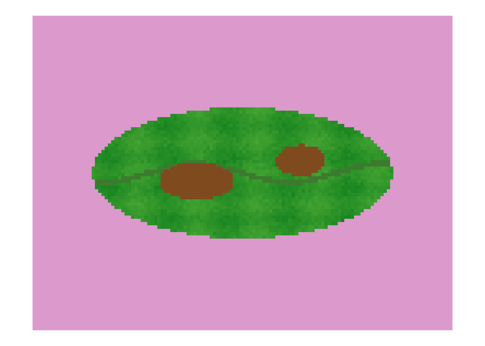
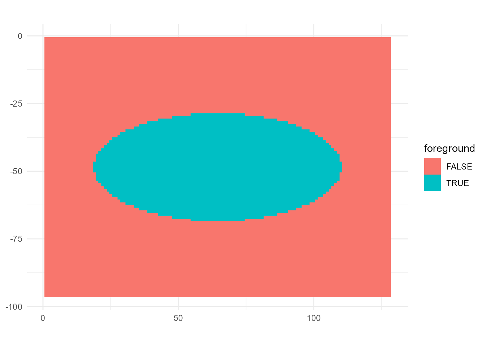

# OmniPhenoR Leaf Health Workflow: Segmentation, Morphometry, Disease, and Texture

## 1. Purpose

This vignette demonstrates an integrated leaf-health workflow while
keeping each processing decision inspectable. It combines image QC, RGB
indices, segmentation, morphometry, disease severity, texture,
validation, provenance, and reporting.

`pliman` remains an important specialized R ecosystem for plant-image
analysis and disease severity ([Olivoto 2022](#ref-Olivoto2022)).
OmniPhenoR 0.1.0 contributes a stable integrator grammar and native
reference implementations rather than claiming to replace every
specialized routine.

## 2. Teaching image and known truth

``` r

img <- pheno_data("leaf_rgb")
truth_leaf <- pheno_data("leaf_mask")
truth_lesion <- pheno_data("lesion_mask")
pheno_qc(img)
#> # A tibble: 1 × 12
#>   height width finite_fraction missing_fraction    min   max dynamic_range  mean
#>    <int> <int>           <dbl>            <dbl>  <dbl> <dbl>         <dbl> <dbl>
#> 1     96   128               1                0 0.0769  0.86         0.783 0.649
#> # ℹ 4 more variables: sd <dbl>, low_saturation_fraction <dbl>,
#> #   high_saturation_fraction <dbl>, gradient_energy <dbl>
```

## 3. Create a project object

``` r

project <- pheno_project(
  "leaf_health_demo",
  metadata=list(crop="teaching leaf",sensor="RGB",acquisition="controlled synthetic example"),
  design=data.frame(plant_id="PL01",leaf_id="L01",treatment="demo")
)
project
#> <pheno_project> leaf_health_demo 
#>   design rows: 1 
#>   metadata: 3 fields
#>   results: 0 objects
```

Phenotypes belong to experimental units, not anonymous image files.

## 4. Inspect candidate RGB traits

``` r

pheno_rgb_summary(img,c("ExG","NGRDI","GLI","VARI","TGI"),mask=truth_leaf)
#> # A tibble: 5 × 7
#>   index     n   mean     sd median     q05    q95
#>   <chr> <int>  <dbl>  <dbl>  <dbl>   <dbl>  <dbl>
#> 1 ExG    2872  0.781  0.306  0.873 -0.0440  1.03 
#> 2 NGRDI  2872  0.435  0.257  0.513 -0.266   0.634
#> 3 GLI    2872  0.478  0.187  0.538 -0.0333  0.615
#> 4 VARI   2872  0.554  0.317  0.650 -0.313   0.799
#> 5 TGI    2872 34.6   11.5   39.1    2.85   39.6
```

RGB indices summarize color behavior. They are not interchangeable with
disease severity because lesion classification still requires a tissue
mask and symptom rule.

## 5. Segment the leaf

``` r

mask <- pheno_segment(img,index="ExG",threshold="otsu",min_size=50)
mask
#> <pheno_mask> 96 x 128 
#>   foreground pixels: 2872 ( 23.37 %)
#>   index: ExG  threshold: -0.045772 
#>   engine: native
```

Compare the estimate with the known synthetic truth.

``` r

i <- sum(mask & truth_leaf)
u <- sum(mask | truth_leaf)
c(IoU=i/u,Dice=2*i/(sum(mask)+sum(truth_leaf)))
#>  IoU Dice 
#>    1    1
```

A real project should perform this comparison against independent expert
annotation over the intended deployment domain.

## 6. Measure morphology

``` r

shape <- pheno_morphology(mask)
shape
#> # A tibble: 1 × 13
#>   object_id area_px perimeter_px centroid_x centroid_y bbox_width_px
#>       <int>   <int>        <int>      <dbl>      <dbl>         <dbl>
#> 1         1    2872          264       64.5       48.5            92
#> # ℹ 7 more variables: bbox_height_px <dbl>, equivalent_diameter_px <dbl>,
#> #   circularity <dbl>, aspect_ratio <dbl>, eccentricity <dbl>,
#> #   major_axis_px <dbl>, minor_axis_px <dbl>
```

Propagate a physical scale when a valid reference is available.

``` r

sc <- pheno_calibrate_scale(200,50,"mm")
pheno_morphology(mask,scale=sc)[,c("area_px","perimeter_px","area","perimeter")]
#> # A tibble: 1 × 4
#>   area_px perimeter_px  area perimeter
#>     <int>        <int> <dbl>     <dbl>
#> 1    2872          264  180.        66
```

Pixel area and physical area are not interchangeable.

## 7. Disease severity from explicit masks

``` r

truth <- pheno_disease(leaf_mask=truth_leaf,lesion_mask=truth_lesion)
truth$summary
#> # A tibble: 1 × 4
#>   leaf_area_px lesion_area_px healthy_area_px severity_percent
#>          <int>          <int>           <int>            <dbl>
#> 1         2872            317            2555             11.0
```

This is the cleanest validation reference because the denominator and
lesion pixels are explicit.

## 8. Candidate image-derived lesion classification

``` r

est <- pheno_disease(
  x=img,
  leaf_mask=mask,
  lesion_index="ExR",
  lesion_threshold=.15,
  lesion_direction="above"
)
est$summary
#> # A tibble: 1 × 4
#>   leaf_area_px lesion_area_px healthy_area_px severity_percent
#>          <int>          <int>           <int>            <dbl>
#> 1         2872            317            2555             11.0
```

A mismatch can arise from leaf-mask error, lesion threshold, veins,
symptom heterogeneity, color overlap, or illumination. Investigate the
processing stage rather than labeling every discrepancy as one generic
model error.

## 9. Compare explicit and estimated severity

``` r

data.frame(
  source=c("truth mask","image rule"),
  severity=c(truth$summary$severity_percent,est$summary$severity_percent)
)
#>       source severity
#> 1 truth mask  11.0376
#> 2 image rule  11.0376
```

A research project should repeat this over annotated images spanning
symptom type, severity, genotype, date, and acquisition conditions.

## 10. Add texture inside the leaf

``` r

tex <- pheno_texture(
  pheno_data("leaf_gray"),
  methods=c("first_order","glcm","lbp","gabor","dwt"),
  mask=mask,
  levels=16,
  distances=c(1,2),
  angles=c(0,90),
  wavelengths=c(4,8),
  dwt_levels=2
)
tex
#> <pheno_texture>
#>   methods: first_order, glcm, lbp, gabor, dwt
```

Texture can complement color by describing organization rather than only
average channel balance. It should not be added solely to increase the
number of candidate predictors.

## 11. Inspect the built-in workflow

``` r

wf <- pheno_workflow("leaf_health")
wf
#> <pheno_workflow> leaf_health 
#>   steps: segment -> rgb -> disease -> texture 
#>   version: 0.2.0
```

``` r

p <- pheno_pipeline(img,"leaf_health")
p
#> <pheno_pipeline> leaf_health 
#>   results: rgb, mask, cover_fraction, disease, texture
names(p$results)
#> [1] "rgb"            "mask"           "cover_fraction" "disease"       
#> [5] "texture"
```

The preset is inspectable. It is a reproducible starting point, not a
claim of universal optimality.

## 12. Override the preset explicitly

``` r

p2 <- pheno_pipeline(
  img,
  "leaf_health",
  overrides=list(
    segment=list(index="GLI",min_size=100),
    rgb=list(indices=c("ExG","GLI","VARI","TGI")),
    texture=list(methods=c("first_order","glcm"),levels=16)
  )
)
p2$settings
#> $segment
#> $segment$index
#> [1] "GLI"
#> 
#> $segment$threshold
#> [1] "otsu"
#> 
#> $segment$min_size
#> [1] 100
#> 
#> 
#> $rgb
#> $rgb$indices
#> [1] "ExG"  "GLI"  "VARI" "TGI" 
#> 
#> 
#> $disease
#> $disease$lesion_index
#> [1] "ExR"
#> 
#> 
#> $texture
#> $texture$methods
#> [1] "first_order" "glcm"       
#> 
#> $texture$levels
#> [1] 16
```

Every override remains visible in the pipeline object.

## 13. Sensitivity to segmentation threshold

``` r

base <- attr(pheno_segment(img,"ExG"),"threshold")
th <- base + seq(-.08,.08,length.out=9)
sens <- data.frame(
 threshold=th,
 leaf_fraction=vapply(th,function(z)mean(pheno_segment(img,"ExG",threshold=z,min_size=50)),numeric(1))
)
sens
#>      threshold leaf_fraction
#> 1 -0.125771764     0.2337240
#> 2 -0.105771764     0.2337240
#> 3 -0.085771764     0.2337240
#> 4 -0.065771764     0.2337240
#> 5 -0.045771764     0.2337240
#> 6 -0.025771764     0.2079264
#> 7 -0.005771764     0.2079264
#> 8  0.014228236     0.2079264
#> 9  0.034228236     0.2079264
```

If morphology or severity changes strongly across a narrow defensible
range, report the sensitivity. Do not select a threshold because it
maximizes a treatment p-value.

## 14. QC before accepting a phenotype

``` r

pheno_qc(img)
#> # A tibble: 1 × 12
#>   height width finite_fraction missing_fraction    min   max dynamic_range  mean
#>    <int> <int>           <dbl>            <dbl>  <dbl> <dbl>         <dbl> <dbl>
#> 1     96   128               1                0 0.0769  0.86         0.783 0.649
#> # ℹ 4 more variables: sd <dbl>, low_saturation_fraction <dbl>,
#> #   high_saturation_fraction <dbl>, gradient_energy <dbl>
pheno_qc(mask)
#> # A tibble: 1 × 12
#>   height width finite_fraction missing_fraction   min   max dynamic_range  mean
#>    <int> <int>           <dbl>            <dbl> <dbl> <dbl>         <dbl> <dbl>
#> 1     96   128               1                0     0     1             1 0.234
#> # ℹ 4 more variables: sd <dbl>, low_saturation_fraction <dbl>,
#> #   high_saturation_fraction <dbl>, gradient_energy <dbl>
```

QC metrics are screening diagnostics. Exclusion thresholds must be
calibrated to the acquisition protocol and not chosen because they
remove inconvenient biological observations.

## 15. Validate numerical truths

``` r

pheno_validate("all")
#> # A tibble: 21 × 6
#>    domain     check                      estimate target tolerance pass 
#>    <chr>      <chr>                         <dbl>  <dbl>     <dbl> <lgl>
#>  1 rgb        NGRDI scale invariance         0.5     0.5     1e-12 TRUE 
#>  2 rgb        GLI scale invariance           0.6     0.6     1e-12 TRUE 
#>  3 rgb        ExG scale invariance           1       1       1e-12 TRUE 
#>  4 morphology square area                  100     100       0     TRUE 
#>  5 morphology square perimeter              40      40       0     TRUE 
#>  6 morphology frozen rectangle area       1200    1200       0     TRUE 
#>  7 disease    known 20 percent severity     20      20       0     TRUE 
#>  8 disease    frozen severity 5 percent      5.00    5       5e- 2 TRUE 
#>  9 disease    frozen severity 10 percent    10.0    10       5e- 2 TRUE 
#> 10 disease    frozen severity 25 percent    25.0    25       5e- 2 TRUE 
#> # ℹ 11 more rows
```

Known-shape and known-severity checks verify numerical behavior
separately from biological generalization.

## 16. Freeze provenance

``` r

a <- pheno_audit(p)
a$R
#> [1] "R version 4.6.0 (2026-04-24 ucrt)"
a$package
#> [1] "1.0.0"
a$settings
#> $segment
#> $segment$index
#> [1] "ExG"
#> 
#> $segment$threshold
#> [1] "otsu"
#> 
#> $segment$min_size
#> [1] 50
#> 
#> 
#> $rgb
#> $rgb$indices
#> [1] "ExG"   "NGRDI" "GLI"   "VARI"  "TGI"  
#> 
#> 
#> $disease
#> $disease$lesion_index
#> [1] "ExR"
#> 
#> 
#> $texture
#> $texture$methods
#> [1] "first_order" "glcm"        "lbp"
```

For file-based projects, add source-image hashes so the analysis can be
tied to immutable inputs.

## 17. Diagnostic figures

``` r

pheno_plot(img,"image")
pheno_plot(mask,"mask")
pheno_plot(img,"index",index="ExG")
```



A methods figure should show enough intermediate layers to reveal how
the phenotype was obtained.

## 18. Report skeleton

``` r

pheno_report(p,"leaf_health_report.md","Leaf health phenotyping")
```

## 19. Validation design for disease studies

A credible workflow should include independent leaf and lesion
annotation, a broad severity range, multiple symptom phenotypes where
relevant, repeated acquisition, validation across dates/genotypes,
agreement metrics rather than correlation alone, threshold sensitivity,
explicit rules for chlorosis/necrosis/veins/senescence, and a frozen
processing rule before confirmatory treatment inference.

## 20. Minimal integrated script

``` r

img <- pheno_data("leaf_rgb")
mask <- pheno_segment(img,"ExG","otsu",min_size=50)
shape <- pheno_morphology(mask)
disease <- pheno_disease(img,leaf_mask=mask,lesion_index="ExR",lesion_threshold=.15)
texture <- pheno_texture(pheno_data("leaf_gray"),c("first_order","glcm","lbp"),mask=mask,levels=16)
list(shape=shape,disease=disease$summary,texture=texture$results)
#> $shape
#> # A tibble: 1 × 13
#>   object_id area_px perimeter_px centroid_x centroid_y bbox_width_px
#>       <int>   <int>        <int>      <dbl>      <dbl>         <dbl>
#> 1         1    2872          264       64.5       48.5            92
#> # ℹ 7 more variables: bbox_height_px <dbl>, equivalent_diameter_px <dbl>,
#> #   circularity <dbl>, aspect_ratio <dbl>, eccentricity <dbl>,
#> #   major_axis_px <dbl>, minor_axis_px <dbl>
#> 
#> $disease
#> # A tibble: 1 × 4
#>   leaf_area_px lesion_area_px healthy_area_px severity_percent
#>          <int>          <int>           <int>            <dbl>
#> 1         2872            317            2555             11.0
#> 
#> $texture
#> $texture$first_order
#> # A tibble: 1 × 18
#>       n   min   q05   q25 median   q75   q95   max  mean     sd variance    cv
#>   <int> <dbl> <dbl> <dbl>  <dbl> <dbl> <dbl> <dbl> <dbl>  <dbl>    <dbl> <dbl>
#> 1  2872 0.322 0.322 0.428  0.456 0.480 0.508 0.539 0.446 0.0521  0.00271 0.117
#> # ℹ 6 more variables: skewness <dbl>, kurtosis_excess <dbl>, entropy <dbl>,
#> #   uniformity <dbl>, iqr <dbl>, mad <dbl>
#> 
#> $texture$glcm
#> # A tibble: 4 × 12
#>   distance angle contrast dissimilarity homogeneity    ASM energy entropy
#>      <int> <dbl>    <dbl>         <dbl>       <dbl>  <dbl>  <dbl>   <dbl>
#> 1        1     0     1.44         0.737       0.689 0.0537  0.232    3.19
#> 2        1    45     2.56         0.965       0.640 0.0476  0.218    3.36
#> 3        1    90     2.35         0.923       0.648 0.0490  0.221    3.32
#> 4        1   135     2.61         0.981       0.636 0.0475  0.218    3.37
#> # ℹ 4 more variables: correlation <dbl>, max_probability <dbl>, mean_i <dbl>,
#> #   variance_i <dbl>
#> 
#> $texture$lbp
#> $texture$lbp$summary
#> # A tibble: 1 × 5
#>       n entropy uniformity uniform_pattern_probability dominant_code
#>   <int>   <dbl>      <dbl>                       <dbl>         <int>
#> 1  2612    4.40     0.0530                       0.713           255
#> 
#> $texture$lbp$histogram
#> # A tibble: 256 × 3
#>     code count probability
#>    <int> <int>       <dbl>
#>  1     0   160     0.0613 
#>  2     1    27     0.0103 
#>  3     2    26     0.00995
#>  4     3    18     0.00689
#>  5     4    40     0.0153 
#>  6     5    10     0.00383
#>  7     6    17     0.00651
#>  8     7    19     0.00727
#>  9     8    25     0.00957
#> 10     9     6     0.00230
#> # ℹ 246 more rows
#> 
#> $texture$lbp$codes
#>       [,1] [,2] [,3] [,4] [,5] [,6] [,7] [,8] [,9] [,10] [,11] [,12] [,13]
#>  [1,]   NA   NA   NA   NA   NA   NA   NA   NA   NA    NA    NA    NA    NA
#>  [2,]   NA   NA   NA   NA   NA   NA   NA   NA   NA    NA    NA    NA    NA
#>  [3,]   NA   NA   NA   NA   NA   NA   NA   NA   NA    NA    NA    NA    NA
#>  [4,]   NA   NA   NA   NA   NA   NA   NA   NA   NA    NA    NA    NA    NA
#>  [5,]   NA   NA   NA   NA   NA   NA   NA   NA   NA    NA    NA    NA    NA
#>  [6,]   NA   NA   NA   NA   NA   NA   NA   NA   NA    NA    NA    NA    NA
#>  [7,]   NA   NA   NA   NA   NA   NA   NA   NA   NA    NA    NA    NA    NA
#>  [8,]   NA   NA   NA   NA   NA   NA   NA   NA   NA    NA    NA    NA    NA
#>  [9,]   NA   NA   NA   NA   NA   NA   NA   NA   NA    NA    NA    NA    NA
#> [10,]   NA   NA   NA   NA   NA   NA   NA   NA   NA    NA    NA    NA    NA
#> [11,]   NA   NA   NA   NA   NA   NA   NA   NA   NA    NA    NA    NA    NA
#> [12,]   NA   NA   NA   NA   NA   NA   NA   NA   NA    NA    NA    NA    NA
#> [13,]   NA   NA   NA   NA   NA   NA   NA   NA   NA    NA    NA    NA    NA
#> [14,]   NA   NA   NA   NA   NA   NA   NA   NA   NA    NA    NA    NA    NA
#> [15,]   NA   NA   NA   NA   NA   NA   NA   NA   NA    NA    NA    NA    NA
#> [16,]   NA   NA   NA   NA   NA   NA   NA   NA   NA    NA    NA    NA    NA
#> [17,]   NA   NA   NA   NA   NA   NA   NA   NA   NA    NA    NA    NA    NA
#> [18,]   NA   NA   NA   NA   NA   NA   NA   NA   NA    NA    NA    NA    NA
#> [19,]   NA   NA   NA   NA   NA   NA   NA   NA   NA    NA    NA    NA    NA
#> [20,]   NA   NA   NA   NA   NA   NA   NA   NA   NA    NA    NA    NA    NA
#> [21,]   NA   NA   NA   NA   NA   NA   NA   NA   NA    NA    NA    NA    NA
#> [22,]   NA   NA   NA   NA   NA   NA   NA   NA   NA    NA    NA    NA    NA
#> [23,]   NA   NA   NA   NA   NA   NA   NA   NA   NA    NA    NA    NA    NA
#> [24,]   NA   NA   NA   NA   NA   NA   NA   NA   NA    NA    NA    NA    NA
#> [25,]   NA   NA   NA   NA   NA   NA   NA   NA   NA    NA    NA    NA    NA
#> [26,]   NA   NA   NA   NA   NA   NA   NA   NA   NA    NA    NA    NA    NA
#> [27,]   NA   NA   NA   NA   NA   NA   NA   NA   NA    NA    NA    NA    NA
#> [28,]   NA   NA   NA   NA   NA   NA   NA   NA   NA    NA    NA    NA    NA
#> [29,]   NA   NA   NA   NA   NA   NA   NA   NA   NA    NA    NA    NA    NA
#> [30,]   NA   NA   NA   NA   NA   NA   NA   NA   NA    NA    NA    NA    NA
#> [31,]   NA   NA   NA   NA   NA   NA   NA   NA   NA    NA    NA    NA    NA
#> [32,]   NA   NA   NA   NA   NA   NA   NA   NA   NA    NA    NA    NA    NA
#> [33,]   NA   NA   NA   NA   NA   NA   NA   NA   NA    NA    NA    NA    NA
#> [34,]   NA   NA   NA   NA   NA   NA   NA   NA   NA    NA    NA    NA    NA
#> [35,]   NA   NA   NA   NA   NA   NA   NA   NA   NA    NA    NA    NA    NA
#> [36,]   NA   NA   NA   NA   NA   NA   NA   NA   NA    NA    NA    NA    NA
#> [37,]   NA   NA   NA   NA   NA   NA   NA   NA   NA    NA    NA    NA    NA
#> [38,]   NA   NA   NA   NA   NA   NA   NA   NA   NA    NA    NA    NA    NA
#> [39,]   NA   NA   NA   NA   NA   NA   NA   NA   NA    NA    NA    NA    NA
#> [40,]   NA   NA   NA   NA   NA   NA   NA   NA   NA    NA    NA    NA    NA
#> [41,]   NA   NA   NA   NA   NA   NA   NA   NA   NA    NA    NA    NA    NA
#> [42,]   NA   NA   NA   NA   NA   NA   NA   NA   NA    NA    NA    NA    NA
#> [43,]   NA   NA   NA   NA   NA   NA   NA   NA   NA    NA    NA    NA    NA
#> [44,]   NA   NA   NA   NA   NA   NA   NA   NA   NA    NA    NA    NA    NA
#> [45,]   NA   NA   NA   NA   NA   NA   NA   NA   NA    NA    NA    NA    NA
#> [46,]   NA   NA   NA   NA   NA   NA   NA   NA   NA    NA    NA    NA    NA
#> [47,]   NA   NA   NA   NA   NA   NA   NA   NA   NA    NA    NA    NA    NA
#> [48,]   NA   NA   NA   NA   NA   NA   NA   NA   NA    NA    NA    NA    NA
#> [49,]   NA   NA   NA   NA   NA   NA   NA   NA   NA    NA    NA    NA    NA
#> [50,]   NA   NA   NA   NA   NA   NA   NA   NA   NA    NA    NA    NA    NA
#> [51,]   NA   NA   NA   NA   NA   NA   NA   NA   NA    NA    NA    NA    NA
#> [52,]   NA   NA   NA   NA   NA   NA   NA   NA   NA    NA    NA    NA    NA
#> [53,]   NA   NA   NA   NA   NA   NA   NA   NA   NA    NA    NA    NA    NA
#> [54,]   NA   NA   NA   NA   NA   NA   NA   NA   NA    NA    NA    NA    NA
#> [55,]   NA   NA   NA   NA   NA   NA   NA   NA   NA    NA    NA    NA    NA
#> [56,]   NA   NA   NA   NA   NA   NA   NA   NA   NA    NA    NA    NA    NA
#> [57,]   NA   NA   NA   NA   NA   NA   NA   NA   NA    NA    NA    NA    NA
#> [58,]   NA   NA   NA   NA   NA   NA   NA   NA   NA    NA    NA    NA    NA
#> [59,]   NA   NA   NA   NA   NA   NA   NA   NA   NA    NA    NA    NA    NA
#> [60,]   NA   NA   NA   NA   NA   NA   NA   NA   NA    NA    NA    NA    NA
#> [61,]   NA   NA   NA   NA   NA   NA   NA   NA   NA    NA    NA    NA    NA
#> [62,]   NA   NA   NA   NA   NA   NA   NA   NA   NA    NA    NA    NA    NA
#> [63,]   NA   NA   NA   NA   NA   NA   NA   NA   NA    NA    NA    NA    NA
#> [64,]   NA   NA   NA   NA   NA   NA   NA   NA   NA    NA    NA    NA    NA
#> [65,]   NA   NA   NA   NA   NA   NA   NA   NA   NA    NA    NA    NA    NA
#> [66,]   NA   NA   NA   NA   NA   NA   NA   NA   NA    NA    NA    NA    NA
#> [67,]   NA   NA   NA   NA   NA   NA   NA   NA   NA    NA    NA    NA    NA
#> [68,]   NA   NA   NA   NA   NA   NA   NA   NA   NA    NA    NA    NA    NA
#> [69,]   NA   NA   NA   NA   NA   NA   NA   NA   NA    NA    NA    NA    NA
#> [70,]   NA   NA   NA   NA   NA   NA   NA   NA   NA    NA    NA    NA    NA
#> [71,]   NA   NA   NA   NA   NA   NA   NA   NA   NA    NA    NA    NA    NA
#> [72,]   NA   NA   NA   NA   NA   NA   NA   NA   NA    NA    NA    NA    NA
#> [73,]   NA   NA   NA   NA   NA   NA   NA   NA   NA    NA    NA    NA    NA
#> [74,]   NA   NA   NA   NA   NA   NA   NA   NA   NA    NA    NA    NA    NA
#> [75,]   NA   NA   NA   NA   NA   NA   NA   NA   NA    NA    NA    NA    NA
#> [76,]   NA   NA   NA   NA   NA   NA   NA   NA   NA    NA    NA    NA    NA
#> [77,]   NA   NA   NA   NA   NA   NA   NA   NA   NA    NA    NA    NA    NA
#> [78,]   NA   NA   NA   NA   NA   NA   NA   NA   NA    NA    NA    NA    NA
#> [79,]   NA   NA   NA   NA   NA   NA   NA   NA   NA    NA    NA    NA    NA
#> [80,]   NA   NA   NA   NA   NA   NA   NA   NA   NA    NA    NA    NA    NA
#> [81,]   NA   NA   NA   NA   NA   NA   NA   NA   NA    NA    NA    NA    NA
#> [82,]   NA   NA   NA   NA   NA   NA   NA   NA   NA    NA    NA    NA    NA
#> [83,]   NA   NA   NA   NA   NA   NA   NA   NA   NA    NA    NA    NA    NA
#> [84,]   NA   NA   NA   NA   NA   NA   NA   NA   NA    NA    NA    NA    NA
#> [85,]   NA   NA   NA   NA   NA   NA   NA   NA   NA    NA    NA    NA    NA
#> [86,]   NA   NA   NA   NA   NA   NA   NA   NA   NA    NA    NA    NA    NA
#> [87,]   NA   NA   NA   NA   NA   NA   NA   NA   NA    NA    NA    NA    NA
#> [88,]   NA   NA   NA   NA   NA   NA   NA   NA   NA    NA    NA    NA    NA
#> [89,]   NA   NA   NA   NA   NA   NA   NA   NA   NA    NA    NA    NA    NA
#> [90,]   NA   NA   NA   NA   NA   NA   NA   NA   NA    NA    NA    NA    NA
#> [91,]   NA   NA   NA   NA   NA   NA   NA   NA   NA    NA    NA    NA    NA
#> [92,]   NA   NA   NA   NA   NA   NA   NA   NA   NA    NA    NA    NA    NA
#> [93,]   NA   NA   NA   NA   NA   NA   NA   NA   NA    NA    NA    NA    NA
#> [94,]   NA   NA   NA   NA   NA   NA   NA   NA   NA    NA    NA    NA    NA
#> [95,]   NA   NA   NA   NA   NA   NA   NA   NA   NA    NA    NA    NA    NA
#> [96,]   NA   NA   NA   NA   NA   NA   NA   NA   NA    NA    NA    NA    NA
#>       [,14] [,15] [,16] [,17] [,18] [,19] [,20] [,21] [,22] [,23] [,24] [,25]
#>  [1,]    NA    NA    NA    NA    NA    NA    NA    NA    NA    NA    NA    NA
#>  [2,]    NA    NA    NA    NA    NA    NA    NA    NA    NA    NA    NA    NA
#>  [3,]    NA    NA    NA    NA    NA    NA    NA    NA    NA    NA    NA    NA
#>  [4,]    NA    NA    NA    NA    NA    NA    NA    NA    NA    NA    NA    NA
#>  [5,]    NA    NA    NA    NA    NA    NA    NA    NA    NA    NA    NA    NA
#>  [6,]    NA    NA    NA    NA    NA    NA    NA    NA    NA    NA    NA    NA
#>  [7,]    NA    NA    NA    NA    NA    NA    NA    NA    NA    NA    NA    NA
#>  [8,]    NA    NA    NA    NA    NA    NA    NA    NA    NA    NA    NA    NA
#>  [9,]    NA    NA    NA    NA    NA    NA    NA    NA    NA    NA    NA    NA
#> [10,]    NA    NA    NA    NA    NA    NA    NA    NA    NA    NA    NA    NA
#> [11,]    NA    NA    NA    NA    NA    NA    NA    NA    NA    NA    NA    NA
#> [12,]    NA    NA    NA    NA    NA    NA    NA    NA    NA    NA    NA    NA
#> [13,]    NA    NA    NA    NA    NA    NA    NA    NA    NA    NA    NA    NA
#> [14,]    NA    NA    NA    NA    NA    NA    NA    NA    NA    NA    NA    NA
#> [15,]    NA    NA    NA    NA    NA    NA    NA    NA    NA    NA    NA    NA
#> [16,]    NA    NA    NA    NA    NA    NA    NA    NA    NA    NA    NA    NA
#> [17,]    NA    NA    NA    NA    NA    NA    NA    NA    NA    NA    NA    NA
#> [18,]    NA    NA    NA    NA    NA    NA    NA    NA    NA    NA    NA    NA
#> [19,]    NA    NA    NA    NA    NA    NA    NA    NA    NA    NA    NA    NA
#> [20,]    NA    NA    NA    NA    NA    NA    NA    NA    NA    NA    NA    NA
#> [21,]    NA    NA    NA    NA    NA    NA    NA    NA    NA    NA    NA    NA
#> [22,]    NA    NA    NA    NA    NA    NA    NA    NA    NA    NA    NA    NA
#> [23,]    NA    NA    NA    NA    NA    NA    NA    NA    NA    NA    NA    NA
#> [24,]    NA    NA    NA    NA    NA    NA    NA    NA    NA    NA    NA    NA
#> [25,]    NA    NA    NA    NA    NA    NA    NA    NA    NA    NA    NA    NA
#> [26,]    NA    NA    NA    NA    NA    NA    NA    NA    NA    NA    NA    NA
#> [27,]    NA    NA    NA    NA    NA    NA    NA    NA    NA    NA    NA    NA
#> [28,]    NA    NA    NA    NA    NA    NA    NA    NA    NA    NA    NA    NA
#> [29,]    NA    NA    NA    NA    NA    NA    NA    NA    NA    NA    NA    NA
#> [30,]    NA    NA    NA    NA    NA    NA    NA    NA    NA    NA    NA    NA
#> [31,]    NA    NA    NA    NA    NA    NA    NA    NA    NA    NA    NA    NA
#> [32,]    NA    NA    NA    NA    NA    NA    NA    NA    NA    NA    NA    NA
#> [33,]    NA    NA    NA    NA    NA    NA    NA    NA    NA    NA    NA    NA
#> [34,]    NA    NA    NA    NA    NA    NA    NA    NA    NA    NA    NA    NA
#> [35,]    NA    NA    NA    NA    NA    NA    NA    NA    NA    NA    NA    NA
#> [36,]    NA    NA    NA    NA    NA    NA    NA    NA    NA    NA    NA    NA
#> [37,]    NA    NA    NA    NA    NA    NA    NA    NA    NA    NA    NA    NA
#> [38,]    NA    NA    NA    NA    NA    NA    NA    NA    NA    NA    NA    NA
#> [39,]    NA    NA    NA    NA    NA    NA    NA    NA    NA    NA    NA    NA
#> [40,]    NA    NA    NA    NA    NA    NA    NA    NA    NA    NA    NA    NA
#> [41,]    NA    NA    NA    NA    NA    NA    NA    NA    NA    NA    NA    11
#> [42,]    NA    NA    NA    NA    NA    NA    NA    NA    NA    NA    31    55
#> [43,]    NA    NA    NA    NA    NA    NA    NA    NA    NA   197   254     0
#> [44,]    NA    NA    NA    NA    NA    NA    NA    NA   211   187    77    14
#> [45,]    NA    NA    NA    NA    NA    NA    NA    96   255    96   246   255
#> [46,]    NA    NA    NA    NA    NA    NA    NA   224   209   160   217    56
#> [47,]    NA    NA    NA    NA    NA    NA    NA   128   255    96   255   124
#> [48,]    NA    NA    NA    NA    NA    NA   255   107    73     0   177   248
#> [49,]    NA    NA    NA    NA    NA    NA   193   192   135   255     9     0
#> [50,]    NA    NA    NA    NA    NA    NA    NA   135   131   141     6   135
#> [51,]    NA    NA    NA    NA    NA    NA    NA   255   255   255   255   255
#> [52,]    NA    NA    NA    NA    NA    NA    NA   255   255   239   223   175
#> [53,]    NA    NA    NA    NA    NA    NA    NA    NA   248    96   255   116
#> [54,]    NA    NA    NA    NA    NA    NA    NA    NA    NA    96   201    16
#> [55,]    NA    NA    NA    NA    NA    NA    NA    NA    NA    NA   247   255
#> [56,]    NA    NA    NA    NA    NA    NA    NA    NA    NA    NA    NA   104
#> [57,]    NA    NA    NA    NA    NA    NA    NA    NA    NA    NA    NA    NA
#> [58,]    NA    NA    NA    NA    NA    NA    NA    NA    NA    NA    NA    NA
#> [59,]    NA    NA    NA    NA    NA    NA    NA    NA    NA    NA    NA    NA
#> [60,]    NA    NA    NA    NA    NA    NA    NA    NA    NA    NA    NA    NA
#> [61,]    NA    NA    NA    NA    NA    NA    NA    NA    NA    NA    NA    NA
#> [62,]    NA    NA    NA    NA    NA    NA    NA    NA    NA    NA    NA    NA
#> [63,]    NA    NA    NA    NA    NA    NA    NA    NA    NA    NA    NA    NA
#> [64,]    NA    NA    NA    NA    NA    NA    NA    NA    NA    NA    NA    NA
#> [65,]    NA    NA    NA    NA    NA    NA    NA    NA    NA    NA    NA    NA
#> [66,]    NA    NA    NA    NA    NA    NA    NA    NA    NA    NA    NA    NA
#> [67,]    NA    NA    NA    NA    NA    NA    NA    NA    NA    NA    NA    NA
#> [68,]    NA    NA    NA    NA    NA    NA    NA    NA    NA    NA    NA    NA
#> [69,]    NA    NA    NA    NA    NA    NA    NA    NA    NA    NA    NA    NA
#> [70,]    NA    NA    NA    NA    NA    NA    NA    NA    NA    NA    NA    NA
#> [71,]    NA    NA    NA    NA    NA    NA    NA    NA    NA    NA    NA    NA
#> [72,]    NA    NA    NA    NA    NA    NA    NA    NA    NA    NA    NA    NA
#> [73,]    NA    NA    NA    NA    NA    NA    NA    NA    NA    NA    NA    NA
#> [74,]    NA    NA    NA    NA    NA    NA    NA    NA    NA    NA    NA    NA
#> [75,]    NA    NA    NA    NA    NA    NA    NA    NA    NA    NA    NA    NA
#> [76,]    NA    NA    NA    NA    NA    NA    NA    NA    NA    NA    NA    NA
#> [77,]    NA    NA    NA    NA    NA    NA    NA    NA    NA    NA    NA    NA
#> [78,]    NA    NA    NA    NA    NA    NA    NA    NA    NA    NA    NA    NA
#> [79,]    NA    NA    NA    NA    NA    NA    NA    NA    NA    NA    NA    NA
#> [80,]    NA    NA    NA    NA    NA    NA    NA    NA    NA    NA    NA    NA
#> [81,]    NA    NA    NA    NA    NA    NA    NA    NA    NA    NA    NA    NA
#> [82,]    NA    NA    NA    NA    NA    NA    NA    NA    NA    NA    NA    NA
#> [83,]    NA    NA    NA    NA    NA    NA    NA    NA    NA    NA    NA    NA
#> [84,]    NA    NA    NA    NA    NA    NA    NA    NA    NA    NA    NA    NA
#> [85,]    NA    NA    NA    NA    NA    NA    NA    NA    NA    NA    NA    NA
#> [86,]    NA    NA    NA    NA    NA    NA    NA    NA    NA    NA    NA    NA
#> [87,]    NA    NA    NA    NA    NA    NA    NA    NA    NA    NA    NA    NA
#> [88,]    NA    NA    NA    NA    NA    NA    NA    NA    NA    NA    NA    NA
#> [89,]    NA    NA    NA    NA    NA    NA    NA    NA    NA    NA    NA    NA
#> [90,]    NA    NA    NA    NA    NA    NA    NA    NA    NA    NA    NA    NA
#> [91,]    NA    NA    NA    NA    NA    NA    NA    NA    NA    NA    NA    NA
#> [92,]    NA    NA    NA    NA    NA    NA    NA    NA    NA    NA    NA    NA
#> [93,]    NA    NA    NA    NA    NA    NA    NA    NA    NA    NA    NA    NA
#> [94,]    NA    NA    NA    NA    NA    NA    NA    NA    NA    NA    NA    NA
#> [95,]    NA    NA    NA    NA    NA    NA    NA    NA    NA    NA    NA    NA
#> [96,]    NA    NA    NA    NA    NA    NA    NA    NA    NA    NA    NA    NA
#>       [,26] [,27] [,28] [,29] [,30] [,31] [,32] [,33] [,34] [,35] [,36] [,37]
#>  [1,]    NA    NA    NA    NA    NA    NA    NA    NA    NA    NA    NA    NA
#>  [2,]    NA    NA    NA    NA    NA    NA    NA    NA    NA    NA    NA    NA
#>  [3,]    NA    NA    NA    NA    NA    NA    NA    NA    NA    NA    NA    NA
#>  [4,]    NA    NA    NA    NA    NA    NA    NA    NA    NA    NA    NA    NA
#>  [5,]    NA    NA    NA    NA    NA    NA    NA    NA    NA    NA    NA    NA
#>  [6,]    NA    NA    NA    NA    NA    NA    NA    NA    NA    NA    NA    NA
#>  [7,]    NA    NA    NA    NA    NA    NA    NA    NA    NA    NA    NA    NA
#>  [8,]    NA    NA    NA    NA    NA    NA    NA    NA    NA    NA    NA    NA
#>  [9,]    NA    NA    NA    NA    NA    NA    NA    NA    NA    NA    NA    NA
#> [10,]    NA    NA    NA    NA    NA    NA    NA    NA    NA    NA    NA    NA
#> [11,]    NA    NA    NA    NA    NA    NA    NA    NA    NA    NA    NA    NA
#> [12,]    NA    NA    NA    NA    NA    NA    NA    NA    NA    NA    NA    NA
#> [13,]    NA    NA    NA    NA    NA    NA    NA    NA    NA    NA    NA    NA
#> [14,]    NA    NA    NA    NA    NA    NA    NA    NA    NA    NA    NA    NA
#> [15,]    NA    NA    NA    NA    NA    NA    NA    NA    NA    NA    NA    NA
#> [16,]    NA    NA    NA    NA    NA    NA    NA    NA    NA    NA    NA    NA
#> [17,]    NA    NA    NA    NA    NA    NA    NA    NA    NA    NA    NA    NA
#> [18,]    NA    NA    NA    NA    NA    NA    NA    NA    NA    NA    NA    NA
#> [19,]    NA    NA    NA    NA    NA    NA    NA    NA    NA    NA    NA    NA
#> [20,]    NA    NA    NA    NA    NA    NA    NA    NA    NA    NA    NA    NA
#> [21,]    NA    NA    NA    NA    NA    NA    NA    NA    NA    NA    NA    NA
#> [22,]    NA    NA    NA    NA    NA    NA    NA    NA    NA    NA    NA    NA
#> [23,]    NA    NA    NA    NA    NA    NA    NA    NA    NA    NA    NA    NA
#> [24,]    NA    NA    NA    NA    NA    NA    NA    NA    NA    NA    NA    NA
#> [25,]    NA    NA    NA    NA    NA    NA    NA    NA    NA    NA    NA    NA
#> [26,]    NA    NA    NA    NA    NA    NA    NA    NA    NA    NA    NA    NA
#> [27,]    NA    NA    NA    NA    NA    NA    NA    NA    NA    NA    NA    NA
#> [28,]    NA    NA    NA    NA    NA    NA    NA    NA    NA    NA    NA    NA
#> [29,]    NA    NA    NA    NA    NA    NA    NA    NA    NA    NA    NA    NA
#> [30,]    NA    NA    NA    NA    NA    NA    NA    NA    NA    NA    NA    NA
#> [31,]    NA    NA    NA    NA    NA    NA    NA    NA    NA    NA    NA    NA
#> [32,]    NA    NA    NA    NA    NA    NA    NA    NA    NA    NA    NA    NA
#> [33,]    NA    NA    NA    NA    NA    NA    NA    NA    NA    NA    NA    NA
#> [34,]    NA    NA    NA    NA    NA    NA    NA    NA    NA    NA    NA   163
#> [35,]    NA    NA    NA    NA    NA    NA    NA    NA    NA   247   239    64
#> [36,]    NA    NA    NA    NA    NA    NA   116   254    33   193   128   247
#> [37,]    NA    NA    NA    NA    24    32   200    12     0   247   251    97
#> [38,]    NA    NA    NA   188   126    16   191   103   219    17   224   240
#> [39,]    NA   157    46    24    52   254     8     0   255    10     0   225
#> [40,]   255    63     4   255     8    20   174    67   133   134   131   129
#> [41,]    29     4   154    45     6   159     0   231   207     7   135   247
#> [42,]   255     6   255     4   135   191    10     1   199   239     3   129
#> [43,]   132   146   189   126   127    53   238    83   179   229   255    47
#> [44,]    23   191    56    16   188    72     0   239    80   160   253    32
#> [45,]   127   124    92    62     0   254   123   113   255    64   253   112
#> [46,]    24    48   254    52   250   121     0   144   240   234    81   224
#> [47,]   126    16   188     8    16   188   110    11     0   128   139     0
#> [48,]   100   206    28    62   111     0   132   143     7   255   255   255
#> [49,]   144   167   207     0   132   135   255   255   255   255   255   255
#> [50,]   143     0   255   255   255   255   255   255    96   200     0   236
#> [51,]   255   255   255   255   255     0   136     0   128   199   235    65
#> [52,]     8    24     0   144   252    22   175    79     3   147   161   231
#> [53,]   255    63    70   155    60    62    32   239    71   143     0   129
#> [54,]   188     0   254   127   124   108     0   161   231   247   255    99
#> [55,]   124   122    89    56     0   132   223    49   241   249    88    32
#> [56,]    16   176   254   124   126   115   255    64   216    32   254     0
#> [57,]   255    16   184   120   120    64   240   242   255     0   221    50
#> [58,]    NA   254    72     8     0   130   137     0   228   226   223    32
#> [59,]    NA    NA    NA    31    15     7   143    11     1   129   223     0
#> [60,]    NA    NA    NA    NA    30     7   159    39   239     3   239     2
#> [61,]    NA    NA    NA    NA    NA    NA   175     0   165   195   133   239
#> [62,]    NA    NA    NA    NA    NA    NA    NA    NA    NA   255    67   197
#> [63,]    NA    NA    NA    NA    NA    NA    NA    NA    NA    NA    NA   227
#> [64,]    NA    NA    NA    NA    NA    NA    NA    NA    NA    NA    NA    NA
#> [65,]    NA    NA    NA    NA    NA    NA    NA    NA    NA    NA    NA    NA
#> [66,]    NA    NA    NA    NA    NA    NA    NA    NA    NA    NA    NA    NA
#> [67,]    NA    NA    NA    NA    NA    NA    NA    NA    NA    NA    NA    NA
#> [68,]    NA    NA    NA    NA    NA    NA    NA    NA    NA    NA    NA    NA
#> [69,]    NA    NA    NA    NA    NA    NA    NA    NA    NA    NA    NA    NA
#> [70,]    NA    NA    NA    NA    NA    NA    NA    NA    NA    NA    NA    NA
#> [71,]    NA    NA    NA    NA    NA    NA    NA    NA    NA    NA    NA    NA
#> [72,]    NA    NA    NA    NA    NA    NA    NA    NA    NA    NA    NA    NA
#> [73,]    NA    NA    NA    NA    NA    NA    NA    NA    NA    NA    NA    NA
#> [74,]    NA    NA    NA    NA    NA    NA    NA    NA    NA    NA    NA    NA
#> [75,]    NA    NA    NA    NA    NA    NA    NA    NA    NA    NA    NA    NA
#> [76,]    NA    NA    NA    NA    NA    NA    NA    NA    NA    NA    NA    NA
#> [77,]    NA    NA    NA    NA    NA    NA    NA    NA    NA    NA    NA    NA
#> [78,]    NA    NA    NA    NA    NA    NA    NA    NA    NA    NA    NA    NA
#> [79,]    NA    NA    NA    NA    NA    NA    NA    NA    NA    NA    NA    NA
#> [80,]    NA    NA    NA    NA    NA    NA    NA    NA    NA    NA    NA    NA
#> [81,]    NA    NA    NA    NA    NA    NA    NA    NA    NA    NA    NA    NA
#> [82,]    NA    NA    NA    NA    NA    NA    NA    NA    NA    NA    NA    NA
#> [83,]    NA    NA    NA    NA    NA    NA    NA    NA    NA    NA    NA    NA
#> [84,]    NA    NA    NA    NA    NA    NA    NA    NA    NA    NA    NA    NA
#> [85,]    NA    NA    NA    NA    NA    NA    NA    NA    NA    NA    NA    NA
#> [86,]    NA    NA    NA    NA    NA    NA    NA    NA    NA    NA    NA    NA
#> [87,]    NA    NA    NA    NA    NA    NA    NA    NA    NA    NA    NA    NA
#> [88,]    NA    NA    NA    NA    NA    NA    NA    NA    NA    NA    NA    NA
#> [89,]    NA    NA    NA    NA    NA    NA    NA    NA    NA    NA    NA    NA
#> [90,]    NA    NA    NA    NA    NA    NA    NA    NA    NA    NA    NA    NA
#> [91,]    NA    NA    NA    NA    NA    NA    NA    NA    NA    NA    NA    NA
#> [92,]    NA    NA    NA    NA    NA    NA    NA    NA    NA    NA    NA    NA
#> [93,]    NA    NA    NA    NA    NA    NA    NA    NA    NA    NA    NA    NA
#> [94,]    NA    NA    NA    NA    NA    NA    NA    NA    NA    NA    NA    NA
#> [95,]    NA    NA    NA    NA    NA    NA    NA    NA    NA    NA    NA    NA
#> [96,]    NA    NA    NA    NA    NA    NA    NA    NA    NA    NA    NA    NA
#>       [,38] [,39] [,40] [,41] [,42] [,43] [,44] [,45] [,46] [,47] [,48] [,49]
#>  [1,]    NA    NA    NA    NA    NA    NA    NA    NA    NA    NA    NA    NA
#>  [2,]    NA    NA    NA    NA    NA    NA    NA    NA    NA    NA    NA    NA
#>  [3,]    NA    NA    NA    NA    NA    NA    NA    NA    NA    NA    NA    NA
#>  [4,]    NA    NA    NA    NA    NA    NA    NA    NA    NA    NA    NA    NA
#>  [5,]    NA    NA    NA    NA    NA    NA    NA    NA    NA    NA    NA    NA
#>  [6,]    NA    NA    NA    NA    NA    NA    NA    NA    NA    NA    NA    NA
#>  [7,]    NA    NA    NA    NA    NA    NA    NA    NA    NA    NA    NA    NA
#>  [8,]    NA    NA    NA    NA    NA    NA    NA    NA    NA    NA    NA    NA
#>  [9,]    NA    NA    NA    NA    NA    NA    NA    NA    NA    NA    NA    NA
#> [10,]    NA    NA    NA    NA    NA    NA    NA    NA    NA    NA    NA    NA
#> [11,]    NA    NA    NA    NA    NA    NA    NA    NA    NA    NA    NA    NA
#> [12,]    NA    NA    NA    NA    NA    NA    NA    NA    NA    NA    NA    NA
#> [13,]    NA    NA    NA    NA    NA    NA    NA    NA    NA    NA    NA    NA
#> [14,]    NA    NA    NA    NA    NA    NA    NA    NA    NA    NA    NA    NA
#> [15,]    NA    NA    NA    NA    NA    NA    NA    NA    NA    NA    NA    NA
#> [16,]    NA    NA    NA    NA    NA    NA    NA    NA    NA    NA    NA    NA
#> [17,]    NA    NA    NA    NA    NA    NA    NA    NA    NA    NA    NA    NA
#> [18,]    NA    NA    NA    NA    NA    NA    NA    NA    NA    NA    NA    NA
#> [19,]    NA    NA    NA    NA    NA    NA    NA    NA    NA    NA    NA    NA
#> [20,]    NA    NA    NA    NA    NA    NA    NA    NA    NA    NA    NA    NA
#> [21,]    NA    NA    NA    NA    NA    NA    NA    NA    NA    NA    NA    NA
#> [22,]    NA    NA    NA    NA    NA    NA    NA    NA    NA    NA    NA    NA
#> [23,]    NA    NA    NA    NA    NA    NA    NA    NA    NA    NA    NA    NA
#> [24,]    NA    NA    NA    NA    NA    NA    NA    NA    NA    NA    NA    NA
#> [25,]    NA    NA    NA    NA    NA    NA    NA    NA    NA    NA    NA    NA
#> [26,]    NA    NA    NA    NA    NA    NA    NA    NA    NA    NA    NA    NA
#> [27,]    NA    NA    NA    NA    NA    NA    NA    NA    NA    NA    NA    NA
#> [28,]    NA    NA    NA    NA    NA    NA    NA    NA    NA    NA    NA    NA
#> [29,]    NA    NA    NA    NA    NA    NA    NA    NA    NA    NA    NA    NA
#> [30,]    NA    NA    NA    NA    NA    NA    NA    NA    NA    NA    NA    NA
#> [31,]    NA    NA    NA    NA    NA    NA    NA    NA    NA    NA    NA   175
#> [32,]    NA    NA    NA    NA    NA    NA   255    46    15     6   159     5
#> [33,]    NA    NA   129   223     4   139    29     4   215   191    63    46
#> [34,]   231   207     3   255    62    47    79    18   191    60    28    52
#> [35,]   129   247   251   125   124    16   247   255    60    52   254    48
#> [36,]   251   105     0   144   252   122    16   188   124    80   252    56
#> [37,]   248   116   247   251    96   212   254    24    16   250    60   112
#> [38,]   249   104    72    16   176   251   124   126   122   124    40     0
#> [39,]   192   128   151   239     0   152    16   184    40    76     4   223
#> [40,]   135   135   139     4   151   191    14    12     0   143    19   175
#> [41,]   231   231   223    39   239     4   174    95    31    23   191     4
#> [42,]   128   193   159    16   229   255     1   255    46    14    12     2
#> [43,]    67   255    95    26     0   205     2   189     4   159    31    47
#> [44,]   227   241   254    78     2   231   255    45    70   143    14     4
#> [45,]   241   249    64   206     3   129   237     0   135   143   143   143
#> [46,]   224   192   130   135   239   203   133   255   255   255   255   255
#> [47,]   129   255   239   207   135   255   255   255   255   255   255   255
#> [48,]   255   239   199   255   255   255   255   255   255   255   255   255
#> [49,]     0   192   255   255   255   255   255   255   255   255   255   255
#> [50,]    66   227   255   255   255   255   255   255   255   255   255   255
#> [51,]   131   129   255   255   255   255   255   255   255   255   255   255
#> [52,]   199   131   255   255   255   255   255   255   255   255   255   255
#> [53,]   255   115   255   255   255   255   255   255   255   255   255   255
#> [54,]   249   112   240   255   255   255   255   255   255   255   255   255
#> [55,]   249    96   224   200    16   255   255   255   255   255   255   255
#> [56,]   241   224   193   255    59     8    16   176   255   255   255   255
#> [57,]   225   192   243   253    20   166   223    48   248   120     0   184
#> [58,]   192   235    81   228   254    16   255     0   152    36   254    21
#> [59,]   203     1   203    16   189    74     4   150   191     0   189    62
#> [60,]   167   195   223    31     0   142    15    31    60    62    45     4
#> [61,]     1   131   255    14     6   135   159    15    12    12     4   135
#> [62,]   223    35   229   198   199   223    63    54   255    31     7   255
#> [63,]   255     0   193   147   243   255   124    88    60    62    58   125
#> [64,]    NA    NA   223    59    16   248    32   254    28    60   120    60
#> [65,]    NA    NA    NA    NA    NA    NA    16   189   126     0   188    56
#> [66,]    NA    NA    NA    NA    NA    NA    NA    NA    NA    NA    NA    48
#> [67,]    NA    NA    NA    NA    NA    NA    NA    NA    NA    NA    NA    NA
#> [68,]    NA    NA    NA    NA    NA    NA    NA    NA    NA    NA    NA    NA
#> [69,]    NA    NA    NA    NA    NA    NA    NA    NA    NA    NA    NA    NA
#> [70,]    NA    NA    NA    NA    NA    NA    NA    NA    NA    NA    NA    NA
#> [71,]    NA    NA    NA    NA    NA    NA    NA    NA    NA    NA    NA    NA
#> [72,]    NA    NA    NA    NA    NA    NA    NA    NA    NA    NA    NA    NA
#> [73,]    NA    NA    NA    NA    NA    NA    NA    NA    NA    NA    NA    NA
#> [74,]    NA    NA    NA    NA    NA    NA    NA    NA    NA    NA    NA    NA
#> [75,]    NA    NA    NA    NA    NA    NA    NA    NA    NA    NA    NA    NA
#> [76,]    NA    NA    NA    NA    NA    NA    NA    NA    NA    NA    NA    NA
#> [77,]    NA    NA    NA    NA    NA    NA    NA    NA    NA    NA    NA    NA
#> [78,]    NA    NA    NA    NA    NA    NA    NA    NA    NA    NA    NA    NA
#> [79,]    NA    NA    NA    NA    NA    NA    NA    NA    NA    NA    NA    NA
#> [80,]    NA    NA    NA    NA    NA    NA    NA    NA    NA    NA    NA    NA
#> [81,]    NA    NA    NA    NA    NA    NA    NA    NA    NA    NA    NA    NA
#> [82,]    NA    NA    NA    NA    NA    NA    NA    NA    NA    NA    NA    NA
#> [83,]    NA    NA    NA    NA    NA    NA    NA    NA    NA    NA    NA    NA
#> [84,]    NA    NA    NA    NA    NA    NA    NA    NA    NA    NA    NA    NA
#> [85,]    NA    NA    NA    NA    NA    NA    NA    NA    NA    NA    NA    NA
#> [86,]    NA    NA    NA    NA    NA    NA    NA    NA    NA    NA    NA    NA
#> [87,]    NA    NA    NA    NA    NA    NA    NA    NA    NA    NA    NA    NA
#> [88,]    NA    NA    NA    NA    NA    NA    NA    NA    NA    NA    NA    NA
#> [89,]    NA    NA    NA    NA    NA    NA    NA    NA    NA    NA    NA    NA
#> [90,]    NA    NA    NA    NA    NA    NA    NA    NA    NA    NA    NA    NA
#> [91,]    NA    NA    NA    NA    NA    NA    NA    NA    NA    NA    NA    NA
#> [92,]    NA    NA    NA    NA    NA    NA    NA    NA    NA    NA    NA    NA
#> [93,]    NA    NA    NA    NA    NA    NA    NA    NA    NA    NA    NA    NA
#> [94,]    NA    NA    NA    NA    NA    NA    NA    NA    NA    NA    NA    NA
#> [95,]    NA    NA    NA    NA    NA    NA    NA    NA    NA    NA    NA    NA
#> [96,]    NA    NA    NA    NA    NA    NA    NA    NA    NA    NA    NA    NA
#>       [,50] [,51] [,52] [,53] [,54] [,55] [,56] [,57] [,58] [,59] [,60] [,61]
#>  [1,]    NA    NA    NA    NA    NA    NA    NA    NA    NA    NA    NA    NA
#>  [2,]    NA    NA    NA    NA    NA    NA    NA    NA    NA    NA    NA    NA
#>  [3,]    NA    NA    NA    NA    NA    NA    NA    NA    NA    NA    NA    NA
#>  [4,]    NA    NA    NA    NA    NA    NA    NA    NA    NA    NA    NA    NA
#>  [5,]    NA    NA    NA    NA    NA    NA    NA    NA    NA    NA    NA    NA
#>  [6,]    NA    NA    NA    NA    NA    NA    NA    NA    NA    NA    NA    NA
#>  [7,]    NA    NA    NA    NA    NA    NA    NA    NA    NA    NA    NA    NA
#>  [8,]    NA    NA    NA    NA    NA    NA    NA    NA    NA    NA    NA    NA
#>  [9,]    NA    NA    NA    NA    NA    NA    NA    NA    NA    NA    NA    NA
#> [10,]    NA    NA    NA    NA    NA    NA    NA    NA    NA    NA    NA    NA
#> [11,]    NA    NA    NA    NA    NA    NA    NA    NA    NA    NA    NA    NA
#> [12,]    NA    NA    NA    NA    NA    NA    NA    NA    NA    NA    NA    NA
#> [13,]    NA    NA    NA    NA    NA    NA    NA    NA    NA    NA    NA    NA
#> [14,]    NA    NA    NA    NA    NA    NA    NA    NA    NA    NA    NA    NA
#> [15,]    NA    NA    NA    NA    NA    NA    NA    NA    NA    NA    NA    NA
#> [16,]    NA    NA    NA    NA    NA    NA    NA    NA    NA    NA    NA    NA
#> [17,]    NA    NA    NA    NA    NA    NA    NA    NA    NA    NA    NA    NA
#> [18,]    NA    NA    NA    NA    NA    NA    NA    NA    NA    NA    NA    NA
#> [19,]    NA    NA    NA    NA    NA    NA    NA    NA    NA    NA    NA    NA
#> [20,]    NA    NA    NA    NA    NA    NA    NA    NA    NA    NA    NA    NA
#> [21,]    NA    NA    NA    NA    NA    NA    NA    NA    NA    NA    NA    NA
#> [22,]    NA    NA    NA    NA    NA    NA    NA    NA    NA    NA    NA    NA
#> [23,]    NA    NA    NA    NA    NA    NA    NA    NA    NA    NA    NA    NA
#> [24,]    NA    NA    NA    NA    NA    NA    NA    NA    NA    NA    NA    NA
#> [25,]    NA    NA    NA    NA    NA    NA    NA    NA    NA    NA    NA    NA
#> [26,]    NA    NA    NA    NA    NA    NA    NA    NA    NA    NA    NA    NA
#> [27,]    NA    NA    NA    NA    NA    NA    NA    NA    NA    NA    NA    NA
#> [28,]    NA    NA    NA    NA    NA    NA    NA    NA    NA    NA    NA    NA
#> [29,]    NA    NA    NA    NA    NA    NA    NA    NA    NA    NA    NA    NA
#> [30,]    NA    NA    NA    NA    NA    NA     0   128   139     0   191   125
#> [31,]    13     2   131   181   235    69   207     7   199   159     9     0
#> [32,]   191     7   207     9     0   195   239     3   159    47     6   159
#> [33,]    13     2   255     7   195   131   245   255   111     4   191    47
#> [34,]   255    91    53   226   239    83   161   240   228   255    13     0
#> [35,]   240   254    96   192   241   255   112   233    80   253    86   255
#> [36,]    64   216    16   243   249    80   168    64   251   112   250    64
#> [37,]   242   255    90     0   240   238    64   251   105     0   240   242
#> [38,]   168     0   238     2   129   240   251   113   228   251   105    24
#> [39,]     5   203     5   255    19   169    64   128   128   169    68   255
#> [40,]     2   135   147   173    94     0   199   199   143     1   171    93
#> [41,]   223    23   239    64   255     2   131   239    71   159     1   255
#> [42,]   191    58    32   251     5   238    67   193   247   239     2   141
#> [43,]    29    28    32   197   146   225   227   251    89    52   239    71
#> [44,]   143    14     0   151   171    64   161   193   142     0   144   227
#> [45,]   143   143   143   143     0   143     1   191     7   255   123   112
#> [46,]   255   255   255   255   255   255   255    13   154     9     0   136
#> [47,]   255   255   255   255   255   255   255   255   255    15   159   191
#> [48,]   255   255   255   255   255   255   255   255   255   255   255    31
#> [49,]   255   255   255   255   255   255   255   255   255   255   255   255
#> [50,]   255   255   255   255   255   255   255   255   255   255   255   255
#> [51,]   255   255   255   255   255   255   255   255   255   255   255   255
#> [52,]   255   255   255   255   255   255   255   255   255   255   255   255
#> [53,]   255   255   255   255   255   255   255   255   255   255   255   255
#> [54,]   255   255   255   255   255   255   255   255   255   255   255   124
#> [55,]   255   255   255   255   255   255   255   255   255   120    64   144
#> [56,]   255   255   255   255   255   255   120   112   248    64   254   123
#> [57,]     8     0   240   248    88    48   240   248   112   226   201    28
#> [58,]   166   243   249    64   222     0   192   128   176   240   255   127
#> [59,]     0   201     0   162   239     2   183   239    73     0   136     4
#> [60,]   130   159    15     1   197   207     1   128   223     7   223    47
#> [61,]   135   159     6   131   227   255    39   227   207     2   143     0
#> [62,]    55   255     6   131   129   237     0   129   135   183   255    67
#> [63,]    48   244   254   103   195   133   199   231   239     1   128   162
#> [64,]   120    96   240   224   247   243   243   225   229   255   127   113
#> [65,]    72    16   225   192   249   112   240   240   241   249    64   240
#> [66,]   254   123    48   243   241   224   192   128   232     0   146   249
#> [67,]    NA    NA    NA    NA    NA    NA   255    99   197   223    59    56
#> [68,]    NA    NA    NA    NA    NA    NA    NA    NA    NA    NA    NA    NA
#> [69,]    NA    NA    NA    NA    NA    NA    NA    NA    NA    NA    NA    NA
#> [70,]    NA    NA    NA    NA    NA    NA    NA    NA    NA    NA    NA    NA
#> [71,]    NA    NA    NA    NA    NA    NA    NA    NA    NA    NA    NA    NA
#> [72,]    NA    NA    NA    NA    NA    NA    NA    NA    NA    NA    NA    NA
#> [73,]    NA    NA    NA    NA    NA    NA    NA    NA    NA    NA    NA    NA
#> [74,]    NA    NA    NA    NA    NA    NA    NA    NA    NA    NA    NA    NA
#> [75,]    NA    NA    NA    NA    NA    NA    NA    NA    NA    NA    NA    NA
#> [76,]    NA    NA    NA    NA    NA    NA    NA    NA    NA    NA    NA    NA
#> [77,]    NA    NA    NA    NA    NA    NA    NA    NA    NA    NA    NA    NA
#> [78,]    NA    NA    NA    NA    NA    NA    NA    NA    NA    NA    NA    NA
#> [79,]    NA    NA    NA    NA    NA    NA    NA    NA    NA    NA    NA    NA
#> [80,]    NA    NA    NA    NA    NA    NA    NA    NA    NA    NA    NA    NA
#> [81,]    NA    NA    NA    NA    NA    NA    NA    NA    NA    NA    NA    NA
#> [82,]    NA    NA    NA    NA    NA    NA    NA    NA    NA    NA    NA    NA
#> [83,]    NA    NA    NA    NA    NA    NA    NA    NA    NA    NA    NA    NA
#> [84,]    NA    NA    NA    NA    NA    NA    NA    NA    NA    NA    NA    NA
#> [85,]    NA    NA    NA    NA    NA    NA    NA    NA    NA    NA    NA    NA
#> [86,]    NA    NA    NA    NA    NA    NA    NA    NA    NA    NA    NA    NA
#> [87,]    NA    NA    NA    NA    NA    NA    NA    NA    NA    NA    NA    NA
#> [88,]    NA    NA    NA    NA    NA    NA    NA    NA    NA    NA    NA    NA
#> [89,]    NA    NA    NA    NA    NA    NA    NA    NA    NA    NA    NA    NA
#> [90,]    NA    NA    NA    NA    NA    NA    NA    NA    NA    NA    NA    NA
#> [91,]    NA    NA    NA    NA    NA    NA    NA    NA    NA    NA    NA    NA
#> [92,]    NA    NA    NA    NA    NA    NA    NA    NA    NA    NA    NA    NA
#> [93,]    NA    NA    NA    NA    NA    NA    NA    NA    NA    NA    NA    NA
#> [94,]    NA    NA    NA    NA    NA    NA    NA    NA    NA    NA    NA    NA
#> [95,]    NA    NA    NA    NA    NA    NA    NA    NA    NA    NA    NA    NA
#> [96,]    NA    NA    NA    NA    NA    NA    NA    NA    NA    NA    NA    NA
#>       [,62] [,63] [,64] [,65] [,66] [,67] [,68] [,69] [,70] [,71] [,72] [,73]
#>  [1,]    NA    NA    NA    NA    NA    NA    NA    NA    NA    NA    NA    NA
#>  [2,]    NA    NA    NA    NA    NA    NA    NA    NA    NA    NA    NA    NA
#>  [3,]    NA    NA    NA    NA    NA    NA    NA    NA    NA    NA    NA    NA
#>  [4,]    NA    NA    NA    NA    NA    NA    NA    NA    NA    NA    NA    NA
#>  [5,]    NA    NA    NA    NA    NA    NA    NA    NA    NA    NA    NA    NA
#>  [6,]    NA    NA    NA    NA    NA    NA    NA    NA    NA    NA    NA    NA
#>  [7,]    NA    NA    NA    NA    NA    NA    NA    NA    NA    NA    NA    NA
#>  [8,]    NA    NA    NA    NA    NA    NA    NA    NA    NA    NA    NA    NA
#>  [9,]    NA    NA    NA    NA    NA    NA    NA    NA    NA    NA    NA    NA
#> [10,]    NA    NA    NA    NA    NA    NA    NA    NA    NA    NA    NA    NA
#> [11,]    NA    NA    NA    NA    NA    NA    NA    NA    NA    NA    NA    NA
#> [12,]    NA    NA    NA    NA    NA    NA    NA    NA    NA    NA    NA    NA
#> [13,]    NA    NA    NA    NA    NA    NA    NA    NA    NA    NA    NA    NA
#> [14,]    NA    NA    NA    NA    NA    NA    NA    NA    NA    NA    NA    NA
#> [15,]    NA    NA    NA    NA    NA    NA    NA    NA    NA    NA    NA    NA
#> [16,]    NA    NA    NA    NA    NA    NA    NA    NA    NA    NA    NA    NA
#> [17,]    NA    NA    NA    NA    NA    NA    NA    NA    NA    NA    NA    NA
#> [18,]    NA    NA    NA    NA    NA    NA    NA    NA    NA    NA    NA    NA
#> [19,]    NA    NA    NA    NA    NA    NA    NA    NA    NA    NA    NA    NA
#> [20,]    NA    NA    NA    NA    NA    NA    NA    NA    NA    NA    NA    NA
#> [21,]    NA    NA    NA    NA    NA    NA    NA    NA    NA    NA    NA    NA
#> [22,]    NA    NA    NA    NA    NA    NA    NA    NA    NA    NA    NA    NA
#> [23,]    NA    NA    NA    NA    NA    NA    NA    NA    NA    NA    NA    NA
#> [24,]    NA    NA    NA    NA    NA    NA    NA    NA    NA    NA    NA    NA
#> [25,]    NA    NA    NA    NA    NA    NA    NA    NA    NA    NA    NA    NA
#> [26,]    NA    NA    NA    NA    NA    NA    NA    NA    NA    NA    NA    NA
#> [27,]    NA    NA    NA    NA    NA    NA    NA    NA    NA    NA    NA    NA
#> [28,]    NA    NA    NA    NA    NA    NA    NA    NA    NA    NA    NA    NA
#> [29,]    NA    NA    NA    NA    NA    NA    NA    NA    NA    NA    NA    NA
#> [30,]    66   157     0   190     0   140     4   135   207     1   195   129
#> [31,]   158    63    62     5   158    47    15     3   191     3   239    71
#> [32,]    15    28     4   142    31     4   239    15    13     2   129   247
#> [33,]    86   191    54   255   111     2   133   255   127    15     3   129
#> [34,]   191    28     8     8    20   255    91    41    84   182   231   255
#> [35,]    85   254    54   255    91     0   254   112   255   112   224   253
#> [36,]   218    60     8    16   190   114   249    56   120     0   240   249
#> [37,]   255    76    30    63    24    48   252    32   212   178   249    96
#> [38,]     0   254    63    52   254    16   188    32   255     8     0   224
#> [39,]    50   253   124     0   220    46    12     0   229   206    11     1
#> [40,]     8    24    44    66   255     4   191     3   225   207     7   215
#> [41,]     6   175     0   171    77    14    13     2   129   199   243   235
#> [42,]    30    37   255     1   191    15     7   151   163   203     9     4
#> [43,]   255     0   141    14     5   150   191   127    64   255    39   211
#> [44,]   253    62   127   127   127    47     8     0   130   237    16   251
#> [45,]   253    96   216    48   252   116   255   127   115   245   251     0
#> [46,]     8     0   255    32   216    56    72     8     0   128   164   210
#> [47,]   255    11    13    16   191     0   246   255   119   255   113   251
#> [48,]   191   255   255   255    12    10     1   152    48   232     0   168
#> [49,]    24     0   255   255   255   255   255    15     0   132   143     5
#> [50,]    30     2   153    24     0   255   255   255   255   255   255   255
#> [51,]    46    14    15    14     2   185     0   128   128   255   255   255
#> [52,]     4   255    55   255    63    45    94     7   195   153     0   200
#> [53,]    50   253    16   188    28    32   255    34   255    47     2   231
#> [54,]    72     4   158    60   126     0   253    16   253   116   251    65
#> [55,]   246   255   127    24    60    90    53   250    96   208   160   242
#> [56,]    48   240   252   126    48   254     0   232    16   255    96   241
#> [57,]    32   216    56    92    24    52   242   229   251     8     0   169
#> [58,]     0   159     0   254    30     0   184     0   229   246   239    65
#> [59,]   182   255    10    21   190    30    13     2   129   233    16   239
#> [60,]    73     4   190    95    12    14     6   159     3   133   171     0
#> [61,]   207    15    17   190   110    87   191   111     6   207     5   131
#> [62,]   223    63    47     8     0   255     8     4   131   231   247   247
#> [63,]   255    28    20   255    27    37   230   223    51   241   249   112
#> [64,]   229   254    58   116   254    32   241   255   104    64   232    72
#> [65,]   240   253    56   120    92    16   249   120   112   243   225   255
#> [66,]   112   252    16   176   254    90     0   248    48   248    64   241
#> [67,]    96   252    62     8    16   190    82   189    40    64   162   241
#> [68,]    NA    NA    NA    NA    NA    NA    NA    NA    NA    NA    NA    NA
#> [69,]    NA    NA    NA    NA    NA    NA    NA    NA    NA    NA    NA    NA
#> [70,]    NA    NA    NA    NA    NA    NA    NA    NA    NA    NA    NA    NA
#> [71,]    NA    NA    NA    NA    NA    NA    NA    NA    NA    NA    NA    NA
#> [72,]    NA    NA    NA    NA    NA    NA    NA    NA    NA    NA    NA    NA
#> [73,]    NA    NA    NA    NA    NA    NA    NA    NA    NA    NA    NA    NA
#> [74,]    NA    NA    NA    NA    NA    NA    NA    NA    NA    NA    NA    NA
#> [75,]    NA    NA    NA    NA    NA    NA    NA    NA    NA    NA    NA    NA
#> [76,]    NA    NA    NA    NA    NA    NA    NA    NA    NA    NA    NA    NA
#> [77,]    NA    NA    NA    NA    NA    NA    NA    NA    NA    NA    NA    NA
#> [78,]    NA    NA    NA    NA    NA    NA    NA    NA    NA    NA    NA    NA
#> [79,]    NA    NA    NA    NA    NA    NA    NA    NA    NA    NA    NA    NA
#> [80,]    NA    NA    NA    NA    NA    NA    NA    NA    NA    NA    NA    NA
#> [81,]    NA    NA    NA    NA    NA    NA    NA    NA    NA    NA    NA    NA
#> [82,]    NA    NA    NA    NA    NA    NA    NA    NA    NA    NA    NA    NA
#> [83,]    NA    NA    NA    NA    NA    NA    NA    NA    NA    NA    NA    NA
#> [84,]    NA    NA    NA    NA    NA    NA    NA    NA    NA    NA    NA    NA
#> [85,]    NA    NA    NA    NA    NA    NA    NA    NA    NA    NA    NA    NA
#> [86,]    NA    NA    NA    NA    NA    NA    NA    NA    NA    NA    NA    NA
#> [87,]    NA    NA    NA    NA    NA    NA    NA    NA    NA    NA    NA    NA
#> [88,]    NA    NA    NA    NA    NA    NA    NA    NA    NA    NA    NA    NA
#> [89,]    NA    NA    NA    NA    NA    NA    NA    NA    NA    NA    NA    NA
#> [90,]    NA    NA    NA    NA    NA    NA    NA    NA    NA    NA    NA    NA
#> [91,]    NA    NA    NA    NA    NA    NA    NA    NA    NA    NA    NA    NA
#> [92,]    NA    NA    NA    NA    NA    NA    NA    NA    NA    NA    NA    NA
#> [93,]    NA    NA    NA    NA    NA    NA    NA    NA    NA    NA    NA    NA
#> [94,]    NA    NA    NA    NA    NA    NA    NA    NA    NA    NA    NA    NA
#> [95,]    NA    NA    NA    NA    NA    NA    NA    NA    NA    NA    NA    NA
#> [96,]    NA    NA    NA    NA    NA    NA    NA    NA    NA    NA    NA    NA
#>       [,74] [,75] [,76] [,77] [,78] [,79] [,80] [,81] [,82] [,83] [,84] [,85]
#>  [1,]    NA    NA    NA    NA    NA    NA    NA    NA    NA    NA    NA    NA
#>  [2,]    NA    NA    NA    NA    NA    NA    NA    NA    NA    NA    NA    NA
#>  [3,]    NA    NA    NA    NA    NA    NA    NA    NA    NA    NA    NA    NA
#>  [4,]    NA    NA    NA    NA    NA    NA    NA    NA    NA    NA    NA    NA
#>  [5,]    NA    NA    NA    NA    NA    NA    NA    NA    NA    NA    NA    NA
#>  [6,]    NA    NA    NA    NA    NA    NA    NA    NA    NA    NA    NA    NA
#>  [7,]    NA    NA    NA    NA    NA    NA    NA    NA    NA    NA    NA    NA
#>  [8,]    NA    NA    NA    NA    NA    NA    NA    NA    NA    NA    NA    NA
#>  [9,]    NA    NA    NA    NA    NA    NA    NA    NA    NA    NA    NA    NA
#> [10,]    NA    NA    NA    NA    NA    NA    NA    NA    NA    NA    NA    NA
#> [11,]    NA    NA    NA    NA    NA    NA    NA    NA    NA    NA    NA    NA
#> [12,]    NA    NA    NA    NA    NA    NA    NA    NA    NA    NA    NA    NA
#> [13,]    NA    NA    NA    NA    NA    NA    NA    NA    NA    NA    NA    NA
#> [14,]    NA    NA    NA    NA    NA    NA    NA    NA    NA    NA    NA    NA
#> [15,]    NA    NA    NA    NA    NA    NA    NA    NA    NA    NA    NA    NA
#> [16,]    NA    NA    NA    NA    NA    NA    NA    NA    NA    NA    NA    NA
#> [17,]    NA    NA    NA    NA    NA    NA    NA    NA    NA    NA    NA    NA
#> [18,]    NA    NA    NA    NA    NA    NA    NA    NA    NA    NA    NA    NA
#> [19,]    NA    NA    NA    NA    NA    NA    NA    NA    NA    NA    NA    NA
#> [20,]    NA    NA    NA    NA    NA    NA    NA    NA    NA    NA    NA    NA
#> [21,]    NA    NA    NA    NA    NA    NA    NA    NA    NA    NA    NA    NA
#> [22,]    NA    NA    NA    NA    NA    NA    NA    NA    NA    NA    NA    NA
#> [23,]    NA    NA    NA    NA    NA    NA    NA    NA    NA    NA    NA    NA
#> [24,]    NA    NA    NA    NA    NA    NA    NA    NA    NA    NA    NA    NA
#> [25,]    NA    NA    NA    NA    NA    NA    NA    NA    NA    NA    NA    NA
#> [26,]    NA    NA    NA    NA    NA    NA    NA    NA    NA    NA    NA    NA
#> [27,]    NA    NA    NA    NA    NA    NA    NA    NA    NA    NA    NA    NA
#> [28,]    NA    NA    NA    NA    NA    NA    NA    NA    NA    NA    NA    NA
#> [29,]    NA    NA    NA    NA    NA    NA    NA    NA    NA    NA    NA    NA
#> [30,]    NA    NA    NA    NA    NA    NA    NA    NA    NA    NA    NA    NA
#> [31,]   135   131   209   173     8     0   255    NA    NA    NA    NA    NA
#> [32,]   239    67   255     4   175    27    57    44     6   255    23   191
#> [33,]   128   219    37   206    21   191    12    20   187    29    62     0
#> [34,]    35   207     0   255   111     4   150   255    20   174    92    54
#> [35,]   112   231   219    33   244   255   123   124   126    96   255    56
#> [36,]    64   128   255     0   249   120     0   152    56   112   253    56
#> [37,]   230   227   197   154    17   180   254    95     0   184    60    56
#> [38,]   225   225   215   255   126   120     0   222    30    61   124   124
#> [39,]   129   145   251    72     0   140    18   239    78    24    56    92
#> [40,]   247   251    64   134   135   143    11     0   255   255     0   142
#> [41,]     0   128   134   199   255   255   255   255   255   255   255   255
#> [42,]   199   239     3   255   255   255   255   255   255   255   255   255
#> [43,]   227   197   255   255   255   255   255   255   255   255   255   255
#> [44,]    96   255   255   255   255   255   255   255   255   255   255   255
#> [45,]   192   255   255   255   255   255   255   255   255   255   255   255
#> [46,]   243   255   255   255   255   255   255   255   255   255   255   255
#> [47,]   112   240   255   255   255   255   255   255   255   255   255   255
#> [48,]     0   224   192   255   255   255   255   255   255   255   255   255
#> [49,]   139     1   163   249   104    64   255   255   255   255   255   255
#> [50,]     7   143     1   129   128   139     9     0   136     0   128   252
#> [51,]   255   255   255   255   255   255   255   255   255   255   255   255
#> [52,]     0   224   239   223   191   255   255   255   255   120     0   248
#> [53,]   251    33   241   255    64   248     0   184    40    92    34   213
#> [54,]   253     0   233     0   186   101   222    29     0   255    32   255
#> [55,]   245   242   245   255   105     0   255    46    90    61     0   221
#> [56,]   224   208   160   216    36   251    61    16   255   108    82   191
#> [57,]    64   255     0   223     0   253    36   250    56     0   255    32
#> [58,]   187   117   226   255    98   205     0   189    12     2   157     0
#> [59,]    65   136     0   201     0   215   255    13    22   191    63     2
#> [60,]   231   239     3   135   131   155    20   254    63    76    12    30
#> [61,]   129   133   143     7   159    15    10    28     0   134   167   255
#> [62,]   231   199   135   255    31    54   255   111    30    63     1   157
#> [63,]   240   255   115   253   126     0   232    84   255     4   158    63
#> [64,]     0   128   144   248   124    10    17   251    52   246   255   116
#> [65,]   103   247   251   112   236    86   251    60   104    80   184     0
#> [66,]   240   249    96   192   128   251   124    NA    NA    NA    NA    NA
#> [67,]    NA    NA    NA    NA    NA    NA    NA    NA    NA    NA    NA    NA
#> [68,]    NA    NA    NA    NA    NA    NA    NA    NA    NA    NA    NA    NA
#> [69,]    NA    NA    NA    NA    NA    NA    NA    NA    NA    NA    NA    NA
#> [70,]    NA    NA    NA    NA    NA    NA    NA    NA    NA    NA    NA    NA
#> [71,]    NA    NA    NA    NA    NA    NA    NA    NA    NA    NA    NA    NA
#> [72,]    NA    NA    NA    NA    NA    NA    NA    NA    NA    NA    NA    NA
#> [73,]    NA    NA    NA    NA    NA    NA    NA    NA    NA    NA    NA    NA
#> [74,]    NA    NA    NA    NA    NA    NA    NA    NA    NA    NA    NA    NA
#> [75,]    NA    NA    NA    NA    NA    NA    NA    NA    NA    NA    NA    NA
#> [76,]    NA    NA    NA    NA    NA    NA    NA    NA    NA    NA    NA    NA
#> [77,]    NA    NA    NA    NA    NA    NA    NA    NA    NA    NA    NA    NA
#> [78,]    NA    NA    NA    NA    NA    NA    NA    NA    NA    NA    NA    NA
#> [79,]    NA    NA    NA    NA    NA    NA    NA    NA    NA    NA    NA    NA
#> [80,]    NA    NA    NA    NA    NA    NA    NA    NA    NA    NA    NA    NA
#> [81,]    NA    NA    NA    NA    NA    NA    NA    NA    NA    NA    NA    NA
#> [82,]    NA    NA    NA    NA    NA    NA    NA    NA    NA    NA    NA    NA
#> [83,]    NA    NA    NA    NA    NA    NA    NA    NA    NA    NA    NA    NA
#> [84,]    NA    NA    NA    NA    NA    NA    NA    NA    NA    NA    NA    NA
#> [85,]    NA    NA    NA    NA    NA    NA    NA    NA    NA    NA    NA    NA
#> [86,]    NA    NA    NA    NA    NA    NA    NA    NA    NA    NA    NA    NA
#> [87,]    NA    NA    NA    NA    NA    NA    NA    NA    NA    NA    NA    NA
#> [88,]    NA    NA    NA    NA    NA    NA    NA    NA    NA    NA    NA    NA
#> [89,]    NA    NA    NA    NA    NA    NA    NA    NA    NA    NA    NA    NA
#> [90,]    NA    NA    NA    NA    NA    NA    NA    NA    NA    NA    NA    NA
#> [91,]    NA    NA    NA    NA    NA    NA    NA    NA    NA    NA    NA    NA
#> [92,]    NA    NA    NA    NA    NA    NA    NA    NA    NA    NA    NA    NA
#> [93,]    NA    NA    NA    NA    NA    NA    NA    NA    NA    NA    NA    NA
#> [94,]    NA    NA    NA    NA    NA    NA    NA    NA    NA    NA    NA    NA
#> [95,]    NA    NA    NA    NA    NA    NA    NA    NA    NA    NA    NA    NA
#> [96,]    NA    NA    NA    NA    NA    NA    NA    NA    NA    NA    NA    NA
#>       [,86] [,87] [,88] [,89] [,90] [,91] [,92] [,93] [,94] [,95] [,96] [,97]
#>  [1,]    NA    NA    NA    NA    NA    NA    NA    NA    NA    NA    NA    NA
#>  [2,]    NA    NA    NA    NA    NA    NA    NA    NA    NA    NA    NA    NA
#>  [3,]    NA    NA    NA    NA    NA    NA    NA    NA    NA    NA    NA    NA
#>  [4,]    NA    NA    NA    NA    NA    NA    NA    NA    NA    NA    NA    NA
#>  [5,]    NA    NA    NA    NA    NA    NA    NA    NA    NA    NA    NA    NA
#>  [6,]    NA    NA    NA    NA    NA    NA    NA    NA    NA    NA    NA    NA
#>  [7,]    NA    NA    NA    NA    NA    NA    NA    NA    NA    NA    NA    NA
#>  [8,]    NA    NA    NA    NA    NA    NA    NA    NA    NA    NA    NA    NA
#>  [9,]    NA    NA    NA    NA    NA    NA    NA    NA    NA    NA    NA    NA
#> [10,]    NA    NA    NA    NA    NA    NA    NA    NA    NA    NA    NA    NA
#> [11,]    NA    NA    NA    NA    NA    NA    NA    NA    NA    NA    NA    NA
#> [12,]    NA    NA    NA    NA    NA    NA    NA    NA    NA    NA    NA    NA
#> [13,]    NA    NA    NA    NA    NA    NA    NA    NA    NA    NA    NA    NA
#> [14,]    NA    NA    NA    NA    NA    NA    NA    NA    NA    NA    NA    NA
#> [15,]    NA    NA    NA    NA    NA    NA    NA    NA    NA    NA    NA    NA
#> [16,]    NA    NA    NA    NA    NA    NA    NA    NA    NA    NA    NA    NA
#> [17,]    NA    NA    NA    NA    NA    NA    NA    NA    NA    NA    NA    NA
#> [18,]    NA    NA    NA    NA    NA    NA    NA    NA    NA    NA    NA    NA
#> [19,]    NA    NA    NA    NA    NA    NA    NA    NA    NA    NA    NA    NA
#> [20,]    NA    NA    NA    NA    NA    NA    NA    NA    NA    NA    NA    NA
#> [21,]    NA    NA    NA    NA    NA    NA    NA    NA    NA    NA    NA    NA
#> [22,]    NA    NA    NA    NA    NA    NA    NA    NA    NA    NA    NA    NA
#> [23,]    NA    NA    NA    NA    NA    NA    NA    NA    NA    NA    NA    NA
#> [24,]    NA    NA    NA    NA    NA    NA    NA    NA    NA    NA    NA    NA
#> [25,]    NA    NA    NA    NA    NA    NA    NA    NA    NA    NA    NA    NA
#> [26,]    NA    NA    NA    NA    NA    NA    NA    NA    NA    NA    NA    NA
#> [27,]    NA    NA    NA    NA    NA    NA    NA    NA    NA    NA    NA    NA
#> [28,]    NA    NA    NA    NA    NA    NA    NA    NA    NA    NA    NA    NA
#> [29,]    NA    NA    NA    NA    NA    NA    NA    NA    NA    NA    NA    NA
#> [30,]    NA    NA    NA    NA    NA    NA    NA    NA    NA    NA    NA    NA
#> [31,]    NA    NA    NA    NA    NA    NA    NA    NA    NA    NA    NA    NA
#> [32,]    NA    NA    NA    NA    NA    NA    NA    NA    NA    NA    NA    NA
#> [33,]   154     0   247   231    NA    NA    NA    NA    NA    NA    NA    NA
#> [34,]   255     2   129   224   255     0   233    NA    NA    NA    NA    NA
#> [35,]   124   110    83   161   253    98   245   243   251    NA    NA    NA
#> [36,]   120    96   255    48   225   208   225   192   248     0   255    91
#> [37,]    40    80   253   104    64   251    64   243   253   122    97   254
#> [38,]     0   251    40    64   251     1   242   225   232    88    48   253
#> [39,]    50   237     0   251    69   202     1   128   129   239     0   128
#> [40,]     8     4   131   129   178   247   255   111    67   133   135   191
#> [41,]   255   255    15    15     1   136     0   128   239    71   207    29
#> [42,]   255   255   255     7   191    39   199   171     1   195   255    47
#> [43,]   255   255   255   255    45    64   191   101   195   195   221     4
#> [44,]   255   255   255   255    32   239    65   128   131   243   255   114
#> [45,]   255   255   255   255    32   225   255   127   123    97   216    48
#> [46,]   255   255   255   255   112   225   241   232     0   128   207     0
#> [47,]   255   255   255    48   232    64   193   132   143     3   255   255
#> [48,]   255   255   108    72     0   131   255   255   255   255   255   255
#> [49,]     8     0   128   255   255   255   255   255   255     0   128   156
#> [50,]   254   255   255   255   255    72     0   200     4   198   215   191
#> [51,]   255   255     0   200     0   230   195   135   147   227   223     4
#> [52,]    24    28     2   135   131   129   231   255    43     0   191     6
#> [53,]   190    46    78     7   215   243   225   253    68   255    21   190
#> [54,]    28    16   255   115   235    64   128   209   162   197   222     0
#> [55,]    62   122    64   248   112   255   115   239    64   243   255   122
#> [56,]   120    32   250    81   224   208   160   240   251   121    64   252
#> [57,]   236     0   177   250    96   239    64   177   232    64   162   217
#> [58,]   245   255     1   144   160   225   255    65   128   223    33   255
#> [59,]   129   204     6   239     0   129   129   150   163   207     0   141
#> [60,]     3   199   203     5   247   231   247   255     0   215   175     7
#> [61,]     2   131   143    11     1   128   169    76     2   207     4   139
#> [62,]    38   215   183   231   239    95     1   255    99    NA    NA    NA
#> [63,]    16   255    80   160   209   239    66    NA    NA    NA    NA    NA
#> [64,]   250    64   190     0    NA    NA    NA    NA    NA    NA    NA    NA
#> [65,]    NA    NA    NA    NA    NA    NA    NA    NA    NA    NA    NA    NA
#> [66,]    NA    NA    NA    NA    NA    NA    NA    NA    NA    NA    NA    NA
#> [67,]    NA    NA    NA    NA    NA    NA    NA    NA    NA    NA    NA    NA
#> [68,]    NA    NA    NA    NA    NA    NA    NA    NA    NA    NA    NA    NA
#> [69,]    NA    NA    NA    NA    NA    NA    NA    NA    NA    NA    NA    NA
#> [70,]    NA    NA    NA    NA    NA    NA    NA    NA    NA    NA    NA    NA
#> [71,]    NA    NA    NA    NA    NA    NA    NA    NA    NA    NA    NA    NA
#> [72,]    NA    NA    NA    NA    NA    NA    NA    NA    NA    NA    NA    NA
#> [73,]    NA    NA    NA    NA    NA    NA    NA    NA    NA    NA    NA    NA
#> [74,]    NA    NA    NA    NA    NA    NA    NA    NA    NA    NA    NA    NA
#> [75,]    NA    NA    NA    NA    NA    NA    NA    NA    NA    NA    NA    NA
#> [76,]    NA    NA    NA    NA    NA    NA    NA    NA    NA    NA    NA    NA
#> [77,]    NA    NA    NA    NA    NA    NA    NA    NA    NA    NA    NA    NA
#> [78,]    NA    NA    NA    NA    NA    NA    NA    NA    NA    NA    NA    NA
#> [79,]    NA    NA    NA    NA    NA    NA    NA    NA    NA    NA    NA    NA
#> [80,]    NA    NA    NA    NA    NA    NA    NA    NA    NA    NA    NA    NA
#> [81,]    NA    NA    NA    NA    NA    NA    NA    NA    NA    NA    NA    NA
#> [82,]    NA    NA    NA    NA    NA    NA    NA    NA    NA    NA    NA    NA
#> [83,]    NA    NA    NA    NA    NA    NA    NA    NA    NA    NA    NA    NA
#> [84,]    NA    NA    NA    NA    NA    NA    NA    NA    NA    NA    NA    NA
#> [85,]    NA    NA    NA    NA    NA    NA    NA    NA    NA    NA    NA    NA
#> [86,]    NA    NA    NA    NA    NA    NA    NA    NA    NA    NA    NA    NA
#> [87,]    NA    NA    NA    NA    NA    NA    NA    NA    NA    NA    NA    NA
#> [88,]    NA    NA    NA    NA    NA    NA    NA    NA    NA    NA    NA    NA
#> [89,]    NA    NA    NA    NA    NA    NA    NA    NA    NA    NA    NA    NA
#> [90,]    NA    NA    NA    NA    NA    NA    NA    NA    NA    NA    NA    NA
#> [91,]    NA    NA    NA    NA    NA    NA    NA    NA    NA    NA    NA    NA
#> [92,]    NA    NA    NA    NA    NA    NA    NA    NA    NA    NA    NA    NA
#> [93,]    NA    NA    NA    NA    NA    NA    NA    NA    NA    NA    NA    NA
#> [94,]    NA    NA    NA    NA    NA    NA    NA    NA    NA    NA    NA    NA
#> [95,]    NA    NA    NA    NA    NA    NA    NA    NA    NA    NA    NA    NA
#> [96,]    NA    NA    NA    NA    NA    NA    NA    NA    NA    NA    NA    NA
#>       [,98] [,99] [,100] [,101] [,102] [,103] [,104] [,105] [,106] [,107]
#>  [1,]    NA    NA     NA     NA     NA     NA     NA     NA     NA     NA
#>  [2,]    NA    NA     NA     NA     NA     NA     NA     NA     NA     NA
#>  [3,]    NA    NA     NA     NA     NA     NA     NA     NA     NA     NA
#>  [4,]    NA    NA     NA     NA     NA     NA     NA     NA     NA     NA
#>  [5,]    NA    NA     NA     NA     NA     NA     NA     NA     NA     NA
#>  [6,]    NA    NA     NA     NA     NA     NA     NA     NA     NA     NA
#>  [7,]    NA    NA     NA     NA     NA     NA     NA     NA     NA     NA
#>  [8,]    NA    NA     NA     NA     NA     NA     NA     NA     NA     NA
#>  [9,]    NA    NA     NA     NA     NA     NA     NA     NA     NA     NA
#> [10,]    NA    NA     NA     NA     NA     NA     NA     NA     NA     NA
#> [11,]    NA    NA     NA     NA     NA     NA     NA     NA     NA     NA
#> [12,]    NA    NA     NA     NA     NA     NA     NA     NA     NA     NA
#> [13,]    NA    NA     NA     NA     NA     NA     NA     NA     NA     NA
#> [14,]    NA    NA     NA     NA     NA     NA     NA     NA     NA     NA
#> [15,]    NA    NA     NA     NA     NA     NA     NA     NA     NA     NA
#> [16,]    NA    NA     NA     NA     NA     NA     NA     NA     NA     NA
#> [17,]    NA    NA     NA     NA     NA     NA     NA     NA     NA     NA
#> [18,]    NA    NA     NA     NA     NA     NA     NA     NA     NA     NA
#> [19,]    NA    NA     NA     NA     NA     NA     NA     NA     NA     NA
#> [20,]    NA    NA     NA     NA     NA     NA     NA     NA     NA     NA
#> [21,]    NA    NA     NA     NA     NA     NA     NA     NA     NA     NA
#> [22,]    NA    NA     NA     NA     NA     NA     NA     NA     NA     NA
#> [23,]    NA    NA     NA     NA     NA     NA     NA     NA     NA     NA
#> [24,]    NA    NA     NA     NA     NA     NA     NA     NA     NA     NA
#> [25,]    NA    NA     NA     NA     NA     NA     NA     NA     NA     NA
#> [26,]    NA    NA     NA     NA     NA     NA     NA     NA     NA     NA
#> [27,]    NA    NA     NA     NA     NA     NA     NA     NA     NA     NA
#> [28,]    NA    NA     NA     NA     NA     NA     NA     NA     NA     NA
#> [29,]    NA    NA     NA     NA     NA     NA     NA     NA     NA     NA
#> [30,]    NA    NA     NA     NA     NA     NA     NA     NA     NA     NA
#> [31,]    NA    NA     NA     NA     NA     NA     NA     NA     NA     NA
#> [32,]    NA    NA     NA     NA     NA     NA     NA     NA     NA     NA
#> [33,]    NA    NA     NA     NA     NA     NA     NA     NA     NA     NA
#> [34,]    NA    NA     NA     NA     NA     NA     NA     NA     NA     NA
#> [35,]    NA    NA     NA     NA     NA     NA     NA     NA     NA     NA
#> [36,]    NA    NA     NA     NA     NA     NA     NA     NA     NA     NA
#> [37,]    56    52     NA     NA     NA     NA     NA     NA     NA     NA
#> [38,]    92    16    184     NA     NA     NA     NA     NA     NA     NA
#> [39,]   190    62     28     60    122     NA     NA     NA     NA     NA
#> [40,]    29     4    158      8      4    150     NA     NA     NA     NA
#> [41,]    46    22    175      6    135    191      4     NA     NA     NA
#> [42,]     4   143      4    191    127     13      6    135     NA     NA
#> [43,]   223    63     63     17    188    102    223     63     65     NA
#> [44,]   255   124    124     46      0    128    207      0    138      1
#> [45,]   232     0    140      4    143      3    255    255    255    255
#> [46,]   132   255    255    255    255    255    255    255    255    255
#> [47,]   255   255    255    255     56     40     80    176    248      0
#> [48,]    32   200     24     28     12      0    191      0    132    206
#> [49,]     0   255     95     62     62    127      5    142      3    199
#> [50,]     2   145    174     12     24     60     86    191    115    243
#> [51,]   142    31      4    159     63      0    142      0    136      0
#> [52,]   175    79      6    191     28     30     47     79      7    135
#> [53,]    65   255    127     61     62     46     80    255     71    143
#> [54,]   250   121    124    124    124      0    251     48    254     NA
#> [55,]    49   248    120    112    252    122     93     32     NA     NA
#> [56,]   120   120     16    248    120     48    254     NA     NA     NA
#> [57,]    40    28     10      8     28     16     NA     NA     NA     NA
#> [58,]    36   255     62    111     95     NA     NA     NA     NA     NA
#> [59,]    16   189      8     NA     NA     NA     NA     NA     NA     NA
#> [60,]   255    28     NA     NA     NA     NA     NA     NA     NA     NA
#> [61,]    NA    NA     NA     NA     NA     NA     NA     NA     NA     NA
#> [62,]    NA    NA     NA     NA     NA     NA     NA     NA     NA     NA
#> [63,]    NA    NA     NA     NA     NA     NA     NA     NA     NA     NA
#> [64,]    NA    NA     NA     NA     NA     NA     NA     NA     NA     NA
#> [65,]    NA    NA     NA     NA     NA     NA     NA     NA     NA     NA
#> [66,]    NA    NA     NA     NA     NA     NA     NA     NA     NA     NA
#> [67,]    NA    NA     NA     NA     NA     NA     NA     NA     NA     NA
#> [68,]    NA    NA     NA     NA     NA     NA     NA     NA     NA     NA
#> [69,]    NA    NA     NA     NA     NA     NA     NA     NA     NA     NA
#> [70,]    NA    NA     NA     NA     NA     NA     NA     NA     NA     NA
#> [71,]    NA    NA     NA     NA     NA     NA     NA     NA     NA     NA
#> [72,]    NA    NA     NA     NA     NA     NA     NA     NA     NA     NA
#> [73,]    NA    NA     NA     NA     NA     NA     NA     NA     NA     NA
#> [74,]    NA    NA     NA     NA     NA     NA     NA     NA     NA     NA
#> [75,]    NA    NA     NA     NA     NA     NA     NA     NA     NA     NA
#> [76,]    NA    NA     NA     NA     NA     NA     NA     NA     NA     NA
#> [77,]    NA    NA     NA     NA     NA     NA     NA     NA     NA     NA
#> [78,]    NA    NA     NA     NA     NA     NA     NA     NA     NA     NA
#> [79,]    NA    NA     NA     NA     NA     NA     NA     NA     NA     NA
#> [80,]    NA    NA     NA     NA     NA     NA     NA     NA     NA     NA
#> [81,]    NA    NA     NA     NA     NA     NA     NA     NA     NA     NA
#> [82,]    NA    NA     NA     NA     NA     NA     NA     NA     NA     NA
#> [83,]    NA    NA     NA     NA     NA     NA     NA     NA     NA     NA
#> [84,]    NA    NA     NA     NA     NA     NA     NA     NA     NA     NA
#> [85,]    NA    NA     NA     NA     NA     NA     NA     NA     NA     NA
#> [86,]    NA    NA     NA     NA     NA     NA     NA     NA     NA     NA
#> [87,]    NA    NA     NA     NA     NA     NA     NA     NA     NA     NA
#> [88,]    NA    NA     NA     NA     NA     NA     NA     NA     NA     NA
#> [89,]    NA    NA     NA     NA     NA     NA     NA     NA     NA     NA
#> [90,]    NA    NA     NA     NA     NA     NA     NA     NA     NA     NA
#> [91,]    NA    NA     NA     NA     NA     NA     NA     NA     NA     NA
#> [92,]    NA    NA     NA     NA     NA     NA     NA     NA     NA     NA
#> [93,]    NA    NA     NA     NA     NA     NA     NA     NA     NA     NA
#> [94,]    NA    NA     NA     NA     NA     NA     NA     NA     NA     NA
#> [95,]    NA    NA     NA     NA     NA     NA     NA     NA     NA     NA
#> [96,]    NA    NA     NA     NA     NA     NA     NA     NA     NA     NA
#>       [,108] [,109] [,110] [,111] [,112] [,113] [,114] [,115] [,116] [,117]
#>  [1,]     NA     NA     NA     NA     NA     NA     NA     NA     NA     NA
#>  [2,]     NA     NA     NA     NA     NA     NA     NA     NA     NA     NA
#>  [3,]     NA     NA     NA     NA     NA     NA     NA     NA     NA     NA
#>  [4,]     NA     NA     NA     NA     NA     NA     NA     NA     NA     NA
#>  [5,]     NA     NA     NA     NA     NA     NA     NA     NA     NA     NA
#>  [6,]     NA     NA     NA     NA     NA     NA     NA     NA     NA     NA
#>  [7,]     NA     NA     NA     NA     NA     NA     NA     NA     NA     NA
#>  [8,]     NA     NA     NA     NA     NA     NA     NA     NA     NA     NA
#>  [9,]     NA     NA     NA     NA     NA     NA     NA     NA     NA     NA
#> [10,]     NA     NA     NA     NA     NA     NA     NA     NA     NA     NA
#> [11,]     NA     NA     NA     NA     NA     NA     NA     NA     NA     NA
#> [12,]     NA     NA     NA     NA     NA     NA     NA     NA     NA     NA
#> [13,]     NA     NA     NA     NA     NA     NA     NA     NA     NA     NA
#> [14,]     NA     NA     NA     NA     NA     NA     NA     NA     NA     NA
#> [15,]     NA     NA     NA     NA     NA     NA     NA     NA     NA     NA
#> [16,]     NA     NA     NA     NA     NA     NA     NA     NA     NA     NA
#> [17,]     NA     NA     NA     NA     NA     NA     NA     NA     NA     NA
#> [18,]     NA     NA     NA     NA     NA     NA     NA     NA     NA     NA
#> [19,]     NA     NA     NA     NA     NA     NA     NA     NA     NA     NA
#> [20,]     NA     NA     NA     NA     NA     NA     NA     NA     NA     NA
#> [21,]     NA     NA     NA     NA     NA     NA     NA     NA     NA     NA
#> [22,]     NA     NA     NA     NA     NA     NA     NA     NA     NA     NA
#> [23,]     NA     NA     NA     NA     NA     NA     NA     NA     NA     NA
#> [24,]     NA     NA     NA     NA     NA     NA     NA     NA     NA     NA
#> [25,]     NA     NA     NA     NA     NA     NA     NA     NA     NA     NA
#> [26,]     NA     NA     NA     NA     NA     NA     NA     NA     NA     NA
#> [27,]     NA     NA     NA     NA     NA     NA     NA     NA     NA     NA
#> [28,]     NA     NA     NA     NA     NA     NA     NA     NA     NA     NA
#> [29,]     NA     NA     NA     NA     NA     NA     NA     NA     NA     NA
#> [30,]     NA     NA     NA     NA     NA     NA     NA     NA     NA     NA
#> [31,]     NA     NA     NA     NA     NA     NA     NA     NA     NA     NA
#> [32,]     NA     NA     NA     NA     NA     NA     NA     NA     NA     NA
#> [33,]     NA     NA     NA     NA     NA     NA     NA     NA     NA     NA
#> [34,]     NA     NA     NA     NA     NA     NA     NA     NA     NA     NA
#> [35,]     NA     NA     NA     NA     NA     NA     NA     NA     NA     NA
#> [36,]     NA     NA     NA     NA     NA     NA     NA     NA     NA     NA
#> [37,]     NA     NA     NA     NA     NA     NA     NA     NA     NA     NA
#> [38,]     NA     NA     NA     NA     NA     NA     NA     NA     NA     NA
#> [39,]     NA     NA     NA     NA     NA     NA     NA     NA     NA     NA
#> [40,]     NA     NA     NA     NA     NA     NA     NA     NA     NA     NA
#> [41,]     NA     NA     NA     NA     NA     NA     NA     NA     NA     NA
#> [42,]     NA     NA     NA     NA     NA     NA     NA     NA     NA     NA
#> [43,]     NA     NA     NA     NA     NA     NA     NA     NA     NA     NA
#> [44,]     NA     NA     NA     NA     NA     NA     NA     NA     NA     NA
#> [45,]    255     NA     NA     NA     NA     NA     NA     NA     NA     NA
#> [46,]    255     NA     NA     NA     NA     NA     NA     NA     NA     NA
#> [47,]    128     NA     NA     NA     NA     NA     NA     NA     NA     NA
#> [48,]      3    227     NA     NA     NA     NA     NA     NA     NA     NA
#> [49,]    251      1     NA     NA     NA     NA     NA     NA     NA     NA
#> [50,]    253     NA     NA     NA     NA     NA     NA     NA     NA     NA
#> [51,]    136     NA     NA     NA     NA     NA     NA     NA     NA     NA
#> [52,]    135     NA     NA     NA     NA     NA     NA     NA     NA     NA
#> [53,]     NA     NA     NA     NA     NA     NA     NA     NA     NA     NA
#> [54,]     NA     NA     NA     NA     NA     NA     NA     NA     NA     NA
#> [55,]     NA     NA     NA     NA     NA     NA     NA     NA     NA     NA
#> [56,]     NA     NA     NA     NA     NA     NA     NA     NA     NA     NA
#> [57,]     NA     NA     NA     NA     NA     NA     NA     NA     NA     NA
#> [58,]     NA     NA     NA     NA     NA     NA     NA     NA     NA     NA
#> [59,]     NA     NA     NA     NA     NA     NA     NA     NA     NA     NA
#> [60,]     NA     NA     NA     NA     NA     NA     NA     NA     NA     NA
#> [61,]     NA     NA     NA     NA     NA     NA     NA     NA     NA     NA
#> [62,]     NA     NA     NA     NA     NA     NA     NA     NA     NA     NA
#> [63,]     NA     NA     NA     NA     NA     NA     NA     NA     NA     NA
#> [64,]     NA     NA     NA     NA     NA     NA     NA     NA     NA     NA
#> [65,]     NA     NA     NA     NA     NA     NA     NA     NA     NA     NA
#> [66,]     NA     NA     NA     NA     NA     NA     NA     NA     NA     NA
#> [67,]     NA     NA     NA     NA     NA     NA     NA     NA     NA     NA
#> [68,]     NA     NA     NA     NA     NA     NA     NA     NA     NA     NA
#> [69,]     NA     NA     NA     NA     NA     NA     NA     NA     NA     NA
#> [70,]     NA     NA     NA     NA     NA     NA     NA     NA     NA     NA
#> [71,]     NA     NA     NA     NA     NA     NA     NA     NA     NA     NA
#> [72,]     NA     NA     NA     NA     NA     NA     NA     NA     NA     NA
#> [73,]     NA     NA     NA     NA     NA     NA     NA     NA     NA     NA
#> [74,]     NA     NA     NA     NA     NA     NA     NA     NA     NA     NA
#> [75,]     NA     NA     NA     NA     NA     NA     NA     NA     NA     NA
#> [76,]     NA     NA     NA     NA     NA     NA     NA     NA     NA     NA
#> [77,]     NA     NA     NA     NA     NA     NA     NA     NA     NA     NA
#> [78,]     NA     NA     NA     NA     NA     NA     NA     NA     NA     NA
#> [79,]     NA     NA     NA     NA     NA     NA     NA     NA     NA     NA
#> [80,]     NA     NA     NA     NA     NA     NA     NA     NA     NA     NA
#> [81,]     NA     NA     NA     NA     NA     NA     NA     NA     NA     NA
#> [82,]     NA     NA     NA     NA     NA     NA     NA     NA     NA     NA
#> [83,]     NA     NA     NA     NA     NA     NA     NA     NA     NA     NA
#> [84,]     NA     NA     NA     NA     NA     NA     NA     NA     NA     NA
#> [85,]     NA     NA     NA     NA     NA     NA     NA     NA     NA     NA
#> [86,]     NA     NA     NA     NA     NA     NA     NA     NA     NA     NA
#> [87,]     NA     NA     NA     NA     NA     NA     NA     NA     NA     NA
#> [88,]     NA     NA     NA     NA     NA     NA     NA     NA     NA     NA
#> [89,]     NA     NA     NA     NA     NA     NA     NA     NA     NA     NA
#> [90,]     NA     NA     NA     NA     NA     NA     NA     NA     NA     NA
#> [91,]     NA     NA     NA     NA     NA     NA     NA     NA     NA     NA
#> [92,]     NA     NA     NA     NA     NA     NA     NA     NA     NA     NA
#> [93,]     NA     NA     NA     NA     NA     NA     NA     NA     NA     NA
#> [94,]     NA     NA     NA     NA     NA     NA     NA     NA     NA     NA
#> [95,]     NA     NA     NA     NA     NA     NA     NA     NA     NA     NA
#> [96,]     NA     NA     NA     NA     NA     NA     NA     NA     NA     NA
#>       [,118] [,119] [,120] [,121] [,122] [,123] [,124] [,125] [,126] [,127]
#>  [1,]     NA     NA     NA     NA     NA     NA     NA     NA     NA     NA
#>  [2,]     NA     NA     NA     NA     NA     NA     NA     NA     NA     NA
#>  [3,]     NA     NA     NA     NA     NA     NA     NA     NA     NA     NA
#>  [4,]     NA     NA     NA     NA     NA     NA     NA     NA     NA     NA
#>  [5,]     NA     NA     NA     NA     NA     NA     NA     NA     NA     NA
#>  [6,]     NA     NA     NA     NA     NA     NA     NA     NA     NA     NA
#>  [7,]     NA     NA     NA     NA     NA     NA     NA     NA     NA     NA
#>  [8,]     NA     NA     NA     NA     NA     NA     NA     NA     NA     NA
#>  [9,]     NA     NA     NA     NA     NA     NA     NA     NA     NA     NA
#> [10,]     NA     NA     NA     NA     NA     NA     NA     NA     NA     NA
#> [11,]     NA     NA     NA     NA     NA     NA     NA     NA     NA     NA
#> [12,]     NA     NA     NA     NA     NA     NA     NA     NA     NA     NA
#> [13,]     NA     NA     NA     NA     NA     NA     NA     NA     NA     NA
#> [14,]     NA     NA     NA     NA     NA     NA     NA     NA     NA     NA
#> [15,]     NA     NA     NA     NA     NA     NA     NA     NA     NA     NA
#> [16,]     NA     NA     NA     NA     NA     NA     NA     NA     NA     NA
#> [17,]     NA     NA     NA     NA     NA     NA     NA     NA     NA     NA
#> [18,]     NA     NA     NA     NA     NA     NA     NA     NA     NA     NA
#> [19,]     NA     NA     NA     NA     NA     NA     NA     NA     NA     NA
#> [20,]     NA     NA     NA     NA     NA     NA     NA     NA     NA     NA
#> [21,]     NA     NA     NA     NA     NA     NA     NA     NA     NA     NA
#> [22,]     NA     NA     NA     NA     NA     NA     NA     NA     NA     NA
#> [23,]     NA     NA     NA     NA     NA     NA     NA     NA     NA     NA
#> [24,]     NA     NA     NA     NA     NA     NA     NA     NA     NA     NA
#> [25,]     NA     NA     NA     NA     NA     NA     NA     NA     NA     NA
#> [26,]     NA     NA     NA     NA     NA     NA     NA     NA     NA     NA
#> [27,]     NA     NA     NA     NA     NA     NA     NA     NA     NA     NA
#> [28,]     NA     NA     NA     NA     NA     NA     NA     NA     NA     NA
#> [29,]     NA     NA     NA     NA     NA     NA     NA     NA     NA     NA
#> [30,]     NA     NA     NA     NA     NA     NA     NA     NA     NA     NA
#> [31,]     NA     NA     NA     NA     NA     NA     NA     NA     NA     NA
#> [32,]     NA     NA     NA     NA     NA     NA     NA     NA     NA     NA
#> [33,]     NA     NA     NA     NA     NA     NA     NA     NA     NA     NA
#> [34,]     NA     NA     NA     NA     NA     NA     NA     NA     NA     NA
#> [35,]     NA     NA     NA     NA     NA     NA     NA     NA     NA     NA
#> [36,]     NA     NA     NA     NA     NA     NA     NA     NA     NA     NA
#> [37,]     NA     NA     NA     NA     NA     NA     NA     NA     NA     NA
#> [38,]     NA     NA     NA     NA     NA     NA     NA     NA     NA     NA
#> [39,]     NA     NA     NA     NA     NA     NA     NA     NA     NA     NA
#> [40,]     NA     NA     NA     NA     NA     NA     NA     NA     NA     NA
#> [41,]     NA     NA     NA     NA     NA     NA     NA     NA     NA     NA
#> [42,]     NA     NA     NA     NA     NA     NA     NA     NA     NA     NA
#> [43,]     NA     NA     NA     NA     NA     NA     NA     NA     NA     NA
#> [44,]     NA     NA     NA     NA     NA     NA     NA     NA     NA     NA
#> [45,]     NA     NA     NA     NA     NA     NA     NA     NA     NA     NA
#> [46,]     NA     NA     NA     NA     NA     NA     NA     NA     NA     NA
#> [47,]     NA     NA     NA     NA     NA     NA     NA     NA     NA     NA
#> [48,]     NA     NA     NA     NA     NA     NA     NA     NA     NA     NA
#> [49,]     NA     NA     NA     NA     NA     NA     NA     NA     NA     NA
#> [50,]     NA     NA     NA     NA     NA     NA     NA     NA     NA     NA
#> [51,]     NA     NA     NA     NA     NA     NA     NA     NA     NA     NA
#> [52,]     NA     NA     NA     NA     NA     NA     NA     NA     NA     NA
#> [53,]     NA     NA     NA     NA     NA     NA     NA     NA     NA     NA
#> [54,]     NA     NA     NA     NA     NA     NA     NA     NA     NA     NA
#> [55,]     NA     NA     NA     NA     NA     NA     NA     NA     NA     NA
#> [56,]     NA     NA     NA     NA     NA     NA     NA     NA     NA     NA
#> [57,]     NA     NA     NA     NA     NA     NA     NA     NA     NA     NA
#> [58,]     NA     NA     NA     NA     NA     NA     NA     NA     NA     NA
#> [59,]     NA     NA     NA     NA     NA     NA     NA     NA     NA     NA
#> [60,]     NA     NA     NA     NA     NA     NA     NA     NA     NA     NA
#> [61,]     NA     NA     NA     NA     NA     NA     NA     NA     NA     NA
#> [62,]     NA     NA     NA     NA     NA     NA     NA     NA     NA     NA
#> [63,]     NA     NA     NA     NA     NA     NA     NA     NA     NA     NA
#> [64,]     NA     NA     NA     NA     NA     NA     NA     NA     NA     NA
#> [65,]     NA     NA     NA     NA     NA     NA     NA     NA     NA     NA
#> [66,]     NA     NA     NA     NA     NA     NA     NA     NA     NA     NA
#> [67,]     NA     NA     NA     NA     NA     NA     NA     NA     NA     NA
#> [68,]     NA     NA     NA     NA     NA     NA     NA     NA     NA     NA
#> [69,]     NA     NA     NA     NA     NA     NA     NA     NA     NA     NA
#> [70,]     NA     NA     NA     NA     NA     NA     NA     NA     NA     NA
#> [71,]     NA     NA     NA     NA     NA     NA     NA     NA     NA     NA
#> [72,]     NA     NA     NA     NA     NA     NA     NA     NA     NA     NA
#> [73,]     NA     NA     NA     NA     NA     NA     NA     NA     NA     NA
#> [74,]     NA     NA     NA     NA     NA     NA     NA     NA     NA     NA
#> [75,]     NA     NA     NA     NA     NA     NA     NA     NA     NA     NA
#> [76,]     NA     NA     NA     NA     NA     NA     NA     NA     NA     NA
#> [77,]     NA     NA     NA     NA     NA     NA     NA     NA     NA     NA
#> [78,]     NA     NA     NA     NA     NA     NA     NA     NA     NA     NA
#> [79,]     NA     NA     NA     NA     NA     NA     NA     NA     NA     NA
#> [80,]     NA     NA     NA     NA     NA     NA     NA     NA     NA     NA
#> [81,]     NA     NA     NA     NA     NA     NA     NA     NA     NA     NA
#> [82,]     NA     NA     NA     NA     NA     NA     NA     NA     NA     NA
#> [83,]     NA     NA     NA     NA     NA     NA     NA     NA     NA     NA
#> [84,]     NA     NA     NA     NA     NA     NA     NA     NA     NA     NA
#> [85,]     NA     NA     NA     NA     NA     NA     NA     NA     NA     NA
#> [86,]     NA     NA     NA     NA     NA     NA     NA     NA     NA     NA
#> [87,]     NA     NA     NA     NA     NA     NA     NA     NA     NA     NA
#> [88,]     NA     NA     NA     NA     NA     NA     NA     NA     NA     NA
#> [89,]     NA     NA     NA     NA     NA     NA     NA     NA     NA     NA
#> [90,]     NA     NA     NA     NA     NA     NA     NA     NA     NA     NA
#> [91,]     NA     NA     NA     NA     NA     NA     NA     NA     NA     NA
#> [92,]     NA     NA     NA     NA     NA     NA     NA     NA     NA     NA
#> [93,]     NA     NA     NA     NA     NA     NA     NA     NA     NA     NA
#> [94,]     NA     NA     NA     NA     NA     NA     NA     NA     NA     NA
#> [95,]     NA     NA     NA     NA     NA     NA     NA     NA     NA     NA
#> [96,]     NA     NA     NA     NA     NA     NA     NA     NA     NA     NA
#>       [,128]
#>  [1,]     NA
#>  [2,]     NA
#>  [3,]     NA
#>  [4,]     NA
#>  [5,]     NA
#>  [6,]     NA
#>  [7,]     NA
#>  [8,]     NA
#>  [9,]     NA
#> [10,]     NA
#> [11,]     NA
#> [12,]     NA
#> [13,]     NA
#> [14,]     NA
#> [15,]     NA
#> [16,]     NA
#> [17,]     NA
#> [18,]     NA
#> [19,]     NA
#> [20,]     NA
#> [21,]     NA
#> [22,]     NA
#> [23,]     NA
#> [24,]     NA
#> [25,]     NA
#> [26,]     NA
#> [27,]     NA
#> [28,]     NA
#> [29,]     NA
#> [30,]     NA
#> [31,]     NA
#> [32,]     NA
#> [33,]     NA
#> [34,]     NA
#> [35,]     NA
#> [36,]     NA
#> [37,]     NA
#> [38,]     NA
#> [39,]     NA
#> [40,]     NA
#> [41,]     NA
#> [42,]     NA
#> [43,]     NA
#> [44,]     NA
#> [45,]     NA
#> [46,]     NA
#> [47,]     NA
#> [48,]     NA
#> [49,]     NA
#> [50,]     NA
#> [51,]     NA
#> [52,]     NA
#> [53,]     NA
#> [54,]     NA
#> [55,]     NA
#> [56,]     NA
#> [57,]     NA
#> [58,]     NA
#> [59,]     NA
#> [60,]     NA
#> [61,]     NA
#> [62,]     NA
#> [63,]     NA
#> [64,]     NA
#> [65,]     NA
#> [66,]     NA
#> [67,]     NA
#> [68,]     NA
#> [69,]     NA
#> [70,]     NA
#> [71,]     NA
#> [72,]     NA
#> [73,]     NA
#> [74,]     NA
#> [75,]     NA
#> [76,]     NA
#> [77,]     NA
#> [78,]     NA
#> [79,]     NA
#> [80,]     NA
#> [81,]     NA
#> [82,]     NA
#> [83,]     NA
#> [84,]     NA
#> [85,]     NA
#> [86,]     NA
#> [87,]     NA
#> [88,]     NA
#> [89,]     NA
#> [90,]     NA
#> [91,]     NA
#> [92,]     NA
#> [93,]     NA
#> [94,]     NA
#> [95,]     NA
#> [96,]     NA
#> 
#> $texture$lbp$settings
#> $texture$lbp$settings$rotation_invariant
#> [1] FALSE
```

## 21. Interpretation boundary

The synthetic output demonstrates software behavior. A biological
statement such as “treatment increased disease severity” requires
experimental data, independent units, and statistical analysis
appropriate to the design. Image processing creates measurements; it
does not replace experimental inference.

## References

Olivoto, Tiago. 2022. “Lights, Camera, Pliman! An r Package for Plant
Image Analysis.” *Methods in Ecology and Evolution* 13 (4): 789–98.
<https://doi.org/10.1111/2041-210X.13803>.
