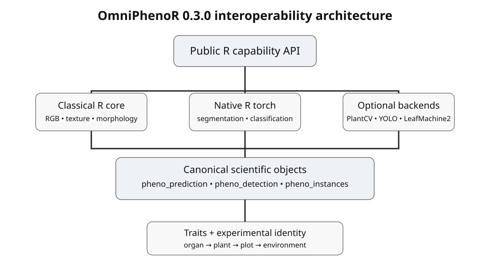

# OmniPhenoR Python Backends: Capability Discovery Without Mandatory Python

## Purpose

OmniPhenoR 0.3.0 introduces Python as an **optional capability layer**,
not as a package-wide dependency. The design goal is to let an R
workflow discover, validate, and use specialized computer-vision
backends without making ordinary installation, core analyses, or
documentation depend on Python.



The distinction between *interface availability* and *scientific
validity* is essential. A successful Python import proves only that
software can be reached. It does not prove that a model is appropriate
for a crop, camera, organ, disease, growth stage, or deployment domain.

## Learning objectives

After this vignette, the reader should be able to:

- inspect Python and backend status without initializing Python;
- understand when
  [`reticulate::py_require()`](https://rstudio.github.io/reticulate/reference/py_require.html)
  is appropriate;
- distinguish environment resolution from backend validation;
- avoid silent package installation during checks and vignettes;
- register custom adapters that return canonical OmniPhenoR objects;
- record enough environment metadata to reproduce a result later.

## 1. Read-only environment inspection

The default status call is deliberately non-initializing.

``` r

pheno_python_status()
#> # A tibble: 6 × 5
#>   capability  available version executable initialized
#>   <chr>       <lgl>     <chr>   <chr>      <lgl>      
#> 1 reticulate  TRUE      1.46.0  NA         FALSE      
#> 2 python      FALSE     NA      NA         FALSE      
#> 3 plantcv     NA        NA      NA         FALSE      
#> 4 ultralytics NA        NA      NA         FALSE      
#> 5 cv2         NA        NA      NA         FALSE      
#> 6 torch       NA        NA      NA         FALSE
pheno_python_packages(c("plantcv", "ultralytics"), initialize = FALSE)
#> # A tibble: 2 × 5
#>   capability  available version executable initialized
#>   <chr>       <lgl>     <chr>   <chr>      <lgl>      
#> 1 plantcv     NA        NA      NA         FALSE      
#> 2 ultralytics NA        NA      NA         FALSE
```

When `initialize = FALSE`, module availability may remain unknown. This
is preferable to unexpectedly initializing an environment during package
load or documentation rendering.

A deliberate backend session can request initialization:

``` r

pheno_python_status(initialize = TRUE)
```

Use this only when the environment should actually be touched.

## 2. Requirements are declarations, not hidden installation hooks

Current `reticulate` guidance favors `py_require()` for declaring Python
requirements. OmniPhenoR exposes that capability only through an
explicit action. Calling the default route is read-only:

``` r

pheno_python_require("plantcv", action = "check")
#> $backend
#> [1] "plantcv"
#> 
#> $packages
#> [1] "plantcv>=4.11,<5"
#> 
#> $python_version
#> [1] ">=3.11,<3.14"
#> 
#> $reticulate_available
#> [1] TRUE
#> 
#> $action
#> [1] "check"
pheno_python_require("yolo", action = "check")
#> $backend
#> [1] "yolo"
#> 
#> $packages
#> [1] "ultralytics>=8"
#> 
#> $python_version
#> [1] ">=3.8"
#> 
#> $reticulate_available
#> [1] TRUE
#> 
#> $action
#> [1] "check"
```

Declaring requirements is explicit:

``` r

pheno_python_require("plantcv", action = "declare")
```

No `.onLoad()` hook silently calls `py_require()`. This choice keeps the
package predictable in offline, CRAN, institutional, and teaching
environments. The user retains control over whether Python should be
managed by `reticulate`, a project virtual environment, conda, or an
externally maintained installation.

## 3. Backend registry

``` r

pheno_backend_registry()
#> # A tibble: 9 × 8
#>   backend_id        language package      task       output_class license status
#>   <chr>             <chr>    <chr>        <chr>      <chr>        <chr>   <chr> 
#> 1 native            R        NA           classical… pheno_mask/… MIT (O… recom…
#> 2 torch             R/C++    torch        segmentat… pheno_predi… BSD-st… tested
#> 3 plantcv           Python   plantcv      plant ima… pheno_predi… MPL-2.0 exper…
#> 4 ultralytics_yolo  Python   ultralytics  detection… pheno_detec… AGPL-3… exper…
#> 5 leafmachine2      Python   LeafMachine2 herbarium… pheno_detec… GPL-3.0 exper…
#> 6 maskrcnn_external external NA           instance … pheno_insta… backen… exper…
#> 7 python_function   R/Python reticulate   custom ad… canonical    adapte… tested
#> 8 coco              format   jsonlite     dataset i… pheno_detec… format  tested
#> 9 yolo_format       format   NA           dataset i… pheno_detec… format  tested
#> # ℹ 1 more variable: install_automatic <lgl>
pheno_backend_info("plantcv")
#> # A tibble: 1 × 8
#>   backend_id language package task                 output_class   license status
#>   <chr>      <chr>    <chr>   <chr>                <chr>          <chr>   <chr> 
#> 1 plantcv    Python   plantcv plant image analysis pheno_predict… MPL-2.0 exper…
#> # ℹ 1 more variable: install_automatic <lgl>
pheno_backend_info("ultralytics_yolo")
#> # A tibble: 1 × 8
#>   backend_id       language package     task         output_class license status
#>   <chr>            <chr>    <chr>       <chr>        <chr>        <chr>   <chr> 
#> 1 ultralytics_yolo Python   ultralytics detection/i… pheno_detec… AGPL-3… exper…
#> # ℹ 1 more variable: install_automatic <lgl>
```

A backend record carries the conceptual task, expected canonical output,
software language, package, implementation status, and licensing note. A
backend may be `experimental` even when its software imports correctly.

### Interpretation

- `recommended` means a core OmniPhenoR route with strong package-level
  support.
- `tested` means interface behavior is represented in automated tests.
- `experimental` means the adapter exists, but users should validate it
  in their own deployment domain.
- `available` never means biologically validated.

## 4. Why automatic installation is intentionally avoided

A package that silently resolves Python during installation can fail for
reasons unrelated to the R code: compiler availability, CUDA drivers,
conflicting PyTorch builds, operating-system restrictions, institutional
proxies, or model licensing. OmniPhenoR therefore separates four stages:

| Stage | Responsibility | Network allowed? |
|----|----|---:|
| R package installation | install R package and precompiled documentation | no requirement |
| backend declaration | state intended Python requirements | only if user chooses |
| backend validation | import and inspect versions | optional |
| scientific workflow | run actual model | explicit |

This architecture follows the current `reticulate` model in which
`py_require()` can declare session requirements while environment
resolution is deferred until Python is actually initialized.

## 5. Custom adapter pattern

A backend does not need first-class package support to participate in an
OmniPhenoR workflow. The minimum requirement is a function that returns
a canonical or convertible result.

``` r

adapter <- pheno_python_model(
  predict = function(x) {
    data.frame(
      class = "leaf",
      confidence = 0.94,
      xmin = 20,
      ymin = 15,
      xmax = 105,
      ymax = 90
    )
  },
  task = "object_detection",
  metadata = list(source = "teaching adapter")
)

pred <- pheno_detect(pheno_data("leaf_rgb"), adapter)
pred
#> <pheno_detection>
#>   objects: 1 
#>   engine: function 
#>   classes: leaf
```

This mechanism is also useful for adapters implemented with
`reticulate`, command-line programs, REST-free local services, or
institution-specific models.

## 6. Environment reporting

``` r

env <- pheno_environment_report()
names(env)
#> [1] "timestamp"    "R"            "platform"     "OmniPhenoR"   "python"      
#> [6] "capabilities"
```

For a manuscript supplement or computational archive:

``` r

f <- tempfile(fileext = ".md")
pheno_environment_report(f)
readLines(f, n = 8)
#> [1] "# OmniPhenoR environment report"       
#> [2] ""                                      
#> [3] "- Generated: 2026-08-25 01:06:55 UTC"  
#> [4] "- R: R version 4.6.0 (2026-04-24 ucrt)"
#> [5] "- Platform: x86_64-w64-mingw32"        
#> [6] "- OmniPhenoR: 1.0.0"                   
#> [7] ""                                      
#> [8] "## Python status"
unlink(f)
```

A Python-backed result should record, when applicable, the R version,
OmniPhenoR version, `reticulate` version, Python executable, Python
version, backend version, model identifier, weights hash, seed, input
hash, and important processing arguments.

## 7. Common mistakes

### Mistake: treating `reticulate` availability as PlantCV availability

`reticulate` being installed only means that the bridge exists. It says
nothing about the selected Python interpreter or its packages.

### Mistake: initializing Python in every vignette

This makes documentation slow and machine-dependent. Precompiled
documentation should use frozen results or mock adapters for heavy
optional workflows.

### Mistake: hiding the executable

Two analyses can both report “Python 3.12” while actually using
different environments. Record the executable path when a real backend
is initialized.

### Mistake: allowing a package load to mutate environments

Installation and package attachment should remain side-effect-light.
Dependency resolution belongs to an explicit user or developer
operation.

## 8. Recommended reporting language

A methods section can state that OmniPhenoR was used as the R
orchestration layer, Python backends were optional and externally
resolved, and backend versions plus model hashes were recorded in the
analysis provenance. Avoid statements suggesting that a successful
import constitutes model validation.

## 9. Minimal reusable pattern

``` r

pheno_backend_registry("detection|segmentation")
#> # A tibble: 6 × 8
#>   backend_id        language package      task       output_class license status
#>   <chr>             <chr>    <chr>        <chr>      <chr>        <chr>   <chr> 
#> 1 torch             R/C++    torch        segmentat… pheno_predi… BSD-st… tested
#> 2 ultralytics_yolo  Python   ultralytics  detection… pheno_detec… AGPL-3… exper…
#> 3 leafmachine2      Python   LeafMachine2 herbarium… pheno_detec… GPL-3.0 exper…
#> 4 maskrcnn_external external NA           instance … pheno_insta… backen… exper…
#> 5 coco              format   jsonlite     dataset i… pheno_detec… format  tested
#> 6 yolo_format       format   NA           dataset i… pheno_detec… format  tested
#> # ℹ 1 more variable: install_automatic <lgl>
pheno_python_require("plantcv", action = "check")
#> $backend
#> [1] "plantcv"
#> 
#> $packages
#> [1] "plantcv>=4.11,<5"
#> 
#> $python_version
#> [1] ">=3.11,<3.14"
#> 
#> $reticulate_available
#> [1] TRUE
#> 
#> $action
#> [1] "check"

# Only when the backend is intentionally used:
# pheno_python_status(initialize = TRUE)
# pheno_backend_validate("plantcv", initialize_python = TRUE)
```

## Final perspective

The Python layer is a boundary, not a takeover. The public scientific
grammar remains R-first, while specialized engines are treated as
optional capabilities whose installation, licensing, execution, and
validation remain explicit.
