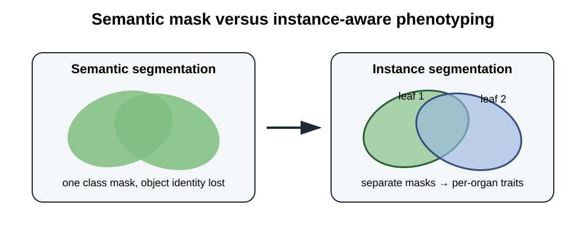

# OmniPhenoR Instance Segmentation: Individual Organs, Masks, and Traits

## Purpose

Semantic segmentation labels pixels by class but does not necessarily
preserve object identity. Instance segmentation provides a separate mask
for each object. This is essential when the phenotype depends on
individual leaves, fruits, seeds, lesions, or overlapping organs. Mask
R-CNN is a canonical instance-segmentation framework that couples object
detection with an object-specific mask branch ([He et al.
2017](#ref-He2017_MaskRCNN)).



## 1. Build instances from known masks

``` r

m1 <- matrix(FALSE, 60, 80)
m1[8:35, 10:40] <- TRUE
m2 <- matrix(FALSE, 60, 80)
m2[25:55, 45:72] <- TRUE

inst <- pheno_instances(
  list(m1, m2),
  classes = c("leaf", "leaf"),
  confidence = c(.98, .94),
  image_id = "plant_A"
)
inst
#> <pheno_instances>
#>   instances: 2 
#>   engine: native 
#>   image: 60 x 80
```

The canonical object contains a metadata table and a list of masks with
common dimensions.

## 2. Reuse morphology instead of creating a second API

``` r

pheno_morphology(inst)
#> # A tibble: 2 × 16
#>   instance_id class confidence object_id area_px perimeter_px centroid_x
#>         <int> <chr>      <dbl>     <int>   <int>        <int>      <dbl>
#> 1           1 leaf        0.98         1     868          118       25  
#> 2           2 leaf        0.94         1     868          118       58.5
#> # ℹ 9 more variables: centroid_y <dbl>, bbox_width_px <dbl>,
#> #   bbox_height_px <dbl>, equivalent_diameter_px <dbl>, circularity <dbl>,
#> #   aspect_ratio <dbl>, eccentricity <dbl>, major_axis_px <dbl>,
#> #   minor_axis_px <dbl>
```

This is an important design choice. Morphological definitions should
remain stable when the mask source changes. A native threshold mask, an
R `torch` prediction, or an external instance model can therefore be
measured by the same downstream implementation.

## 3. Function adapter

``` r

mock_instance_model <- function(img) {
  a <- matrix(FALSE, 64, 64)
  b <- matrix(FALSE, 64, 64)
  a[8:32, 5:30] <- TRUE
  b[28:58, 35:60] <- TRUE
  list(
    masks = list(a, b),
    classes = c("leaf", "leaf"),
    confidence = c(.93, .87)
  )
}

pred <- pheno_segment_instances(
  matrix(0, 64, 64),
  model = mock_instance_model,
  image_id = "plant_B"
)
pred
#> <pheno_instances>
#>   instances: 2 
#>   engine: function 
#>   image: 64 x 64
```

The same adapter interface can wrap a Python model, a local executable,
or another R package.

## 4. Overlapping predictions

Two tiles or two ensemble members may detect the same organ.

``` r

pheno_merge_instances(pred, pred, iou_threshold=.8)
#> <pheno_instances>
#>   instances: 2 
#>   engine: merged 
#>   image: 64 x 64
```

Instance merging uses mask IoU, which is more informative than box IoU
when masks are available.

## 5. Leaf-specific disease severity

A plant-level severity can hide strong within-plant heterogeneity.
Instance segmentation allows disease to be quantified per organ.

``` r

leaf <- matrix(FALSE, 50, 50)
leaf[5:45, 5:45] <- TRUE
lesion <- matrix(FALSE, 50, 50)
lesion[15:25, 18:30] <- TRUE

leaf_i <- pheno_instances(list(leaf), "leaf", 1)
lesion_i <- pheno_instances(list(lesion), "lesion", 1)

pheno_disease_instances(leaf_i, lesion_i)
#> # A tibble: 1 × 5
#>   object_id class leaf_area_px lesion_area_px severity_percent
#>       <int> <chr>        <int>          <int>            <dbl>
#> 1         1 leaf          1681            143             8.51
```

The output distinguishes leaf area from lesion area and reports severity
as a percentage of each leaf mask.

## 6. Object identity and pseudo-replication

If ten leaves are measured from one plant, those ten rows are not
automatically ten independent experimental replicates. The object
hierarchy should remain explicit:

``` text
study
└── environment
    └── plot
        └── plant
            └── leaf
                └── lesion
```

Object-level data can be valuable for within-plant variability, but
treatment inference normally needs the design’s experimental unit.

## 7. Aggregating to plant level

``` r

traits <- pheno_morphology(inst)
traits$plant_id <- "plant_A"

pheno_aggregate_traits(
  traits,
  by = "plant_id",
  traits = c("area_px", "circularity"),
  functions = c("mean", "median", "sum")
)
#> # A tibble: 1 × 8
#>   plant_id n_objects area_px_mean area_px_median area_px_sum circularity_mean
#>   <chr>        <int>        <dbl>          <dbl>       <dbl>            <dbl>
#> 1 plant_A          2          868            868        1736            0.783
#> # ℹ 2 more variables: circularity_median <dbl>, circularity_sum <dbl>
```

For `circularity`, a sum is usually not scientifically meaningful; this
example deliberately illustrates why aggregation functions must be
selected trait by trait rather than automatically.

## 8. Failure modes

### Touching leaves

A segmentation model may merge two leaves into one mask. Detection
metrics can still look good if the bounding box is approximately
correct, while leaf count and individual area are wrong.

### Fragmentation

One leaf can be split into several masks, inflating counts and changing
the area distribution.

### Occlusion

A visible leaf area is not necessarily total biological leaf area.
Decide whether the phenotype is visible area or reconstructed full area.

### Partial image borders

Objects cut by the frame should be flagged or excluded according to a
prespecified rule.

## 9. Validation targets

For instance phenotyping, validate at several levels:

1.  object detection recall;
2.  one-to-one object matching;
3.  mask IoU/Dice;
4.  count bias;
5.  individual trait bias;
6.  plant-level aggregated trait bias.

An improvement at one level does not guarantee an improvement at
another.

## 10. Reporting language

State whether morphology was calculated on visible masks or
reconstructed masks, how duplicate instances were merged, what
confidence threshold was used, how partial objects were treated, and how
object-level measurements were aggregated to the experimental unit.

## Final perspective

Instance segmentation is the bridge between modern computer vision and
organ-level phenotyping. OmniPhenoR makes that bridge explicit by
preserving one mask per object and reusing common morphology, disease,
identity, and validation tools.

He, Kaiming, Georgia Gkioxari, Piotr Dollar, and Ross Girshick. 2017.
“Mask r-CNN.” *2017 IEEE International Conference on Computer Vision
(ICCV)*, 2961–69. <https://doi.org/10.1109/ICCV.2017.322>.
