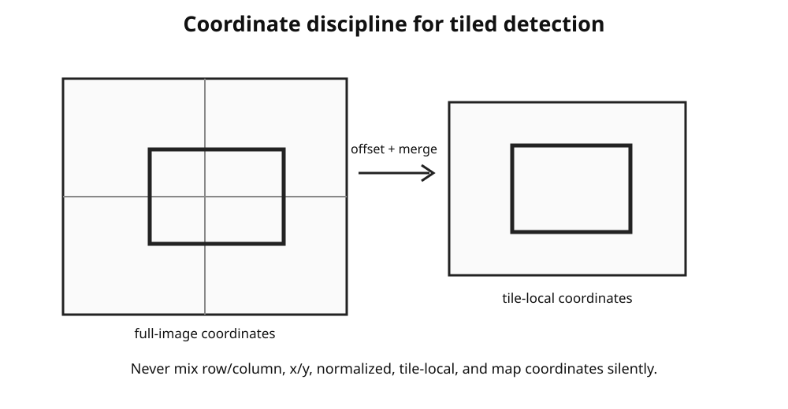

# OmniPhenoR YOLO Workflows: Detection, Segmentation, Tiling, and Licensing

## Purpose

OmniPhenoR can use an externally installed Ultralytics YOLO backend for
object detection and instance segmentation. The integration is
intentionally opt-in: no Ultralytics package or weights are bundled,
downloaded, or initialized during ordinary package installation. The
original YOLO paper is cited for the object-detection concept ([Redmon
et al. 2016](#ref-Redmon2016_YOLO)); current Ultralytics implementations
are treated as third-party software whose model architecture and
licensing must be verified for the specific deployment.

## 1. Licensing is part of the workflow

The backend registry records the current integration caution:

``` r

pheno_backend_info("ultralytics_yolo")
#> # A tibble: 1 × 8
#>   backend_id       language package     task         output_class license status
#>   <chr>            <chr>    <chr>       <chr>        <chr>        <chr>   <chr> 
#> 1 ultralytics_yolo Python   ultralytics detection/i… pheno_detec… AGPL-3… exper…
#> # ℹ 1 more variable: install_automatic <lgl>
```

OmniPhenoR does not make a legal determination for the user. The purpose
of the registry is to prevent licensing from becoming invisible
metadata. Before a real deployment, inspect the current upstream terms
and record which licensing path applies.

## 2. Preflight without installation

``` r

pheno_python_require("yolo", action="check")
#> $backend
#> [1] "yolo"
#> 
#> $packages
#> [1] "ultralytics>=8"
#> 
#> $python_version
#> [1] ">=3.8"
#> 
#> $reticulate_available
#> [1] TRUE
#> 
#> $action
#> [1] "check"
pheno_backend_validate("ultralytics_yolo", initialize_python=FALSE)
#> # A tibble: 1 × 6
#>   backend_id       available version status       license                  note 
#>   <chr>            <lgl>     <chr>   <chr>        <chr>                    <chr>
#> 1 ultralytics_yolo FALSE     NA      experimental AGPL-3.0 or Ultralytics… Ultr…
```

A real session can be validated explicitly:

``` r

pheno_python_require("yolo", action="declare")
pheno_backend_validate("ultralytics_yolo", initialize_python=TRUE)
```

## 3. Detection

``` r

det <- pheno_detect(
  "images/plant_001.jpg",
  model = "models/leaf_detector.pt",
  engine = "yolo",
  confidence = .35,
  iou = .50,
  classes = c("leaf", "flower"),
  image_id = "plant_001"
)
```

The current adapter accepts a file path for the real Ultralytics route.
This keeps conversion predictable and avoids hidden array layout changes
across the R/Python boundary.

## 4. Instance segmentation

``` r

inst <- pheno_segment_instances(
  "images/plant_001.jpg",
  model = "models/leaf_segmentation.pt",
  engine = "yolo",
  confidence = .30,
  iou = .50,
  image_id = "plant_001"
)

pheno_morphology(inst)
```

The returned masks enter the same canonical morphology path used by
other engines.

## 5. Tiling large images



For an orthomosaic or large canopy image:

``` r

tiles <- pheno_tile(
  image,
  tile_size = c(1024, 1024),
  overlap = c(128, 128)
)

# Run detection per tile with the external model.
# Then convert tile-local coordinates to full-image coordinates
# before duplicate suppression.
```

The critical scientific rule is to correct coordinates **before**
counting or spatial aggregation.

## 6. Duplicate suppression

``` r

a <- pheno_detection(data.frame(
  class="flower", confidence=.94,
  xmin=100, ymin=80, xmax=150, ymax=140
))
b <- pheno_detection(data.frame(
  class="flower", confidence=.83,
  xmin=103, ymin=82, xmax=152, ymax=141
))

pheno_merge_detections(a, b, iou_threshold=.5)
#> <pheno_detection>
#>   objects: 1 
#>   engine: merged 
#>   classes: flower
```

For tiled studies, preserve the source tile in provenance before
merging. That helps diagnose edge effects.

## 7. Confidence thresholds should be externally justified

A lower confidence threshold increases recall but can increase false
positives and memory use. A higher threshold does the opposite. Do not
select the threshold solely because it maximizes a treatment difference.

A defensible workflow uses an independent validation set:

``` text
training set
    ↓
model fitting
    ↓
validation set
    ↓
confidence + NMS selection
    ↓
locked settings
    ↓
test/deployment images
```

## 8. Agronomic example: flower count

The final phenotype may be count per plant rather than detector mAP.

``` r

pheno_count_metrics(
  truth = c(12, 18, 20, 9, 16, 14),
  prediction = c(12, 17, 22, 8, 15, 14)
)
#> # A tibble: 1 × 6
#>       n   bias   mae  rmse relative_error correlation
#>   <int>  <dbl> <dbl> <dbl>          <dbl>       <dbl>
#> 1     6 -0.167 0.833  1.08         0.0549       0.977
```

A detector with slightly lower localization IoU can still be preferable
if it produces lower count bias and more stable performance across
phenological stages.

## 9. Frozen documentation result

The installed vignette uses a compact frozen example rather than
executing YOLO.

``` r

pheno_example_result("mock_yolo_leaf_detection")
#>    image_id object_id  class confidence xmin ymin xmax ymax    engine
#> 1 plant_001         1   leaf       0.96   18   14   72   93 mock_yolo
#> 2 plant_001         2   leaf       0.89   78   19  126   98 mock_yolo
#> 3 plant_001         3 flower       0.84   52    8   70   27 mock_yolo
#>                model_id
#> 1 frozen_teaching_model
#> 2 frozen_teaching_model
#> 3 frozen_teaching_model
```

The corresponding reproduction architecture is documented in
`PRECOMPILED_VIGNETTES.md`. This prevents GitHub installation from
creating Python environments or downloading models.

## 10. Recommended provenance

Record at least:

- upstream package version;
- Python executable/version;
- model file name;
- model SHA-256;
- training dataset version;
- confidence threshold;
- NMS IoU;
- image size;
- device;
- tile geometry and overlap;
- class map;
- license note;
- input image hashes.

## 11. Common mistakes

- Using a model name that triggers an implicit upstream weight download
  during a supposedly frozen workflow.
- Mixing YOLO normalized label coordinates with pixel coordinates.
- Counting duplicate objects from overlapping tiles.
- Comparing models with different confidence thresholds but calling the
  comparison “architecture performance.”
- Treating a pretrained natural-image model as validated for plant
  organs.

## Final perspective

YOLO integration is valuable because it gives OmniPhenoR access to fast
object detection and segmentation while preserving a stable R-side
object model. The backend remains external and explicit; the scientific
phenotype remains auditable.

Redmon, Joseph, Santosh Divvala, Ross Girshick, and Ali Farhadi. 2016.
“You Only Look Once: Unified, Real-Time Object Detection.” *2016 IEEE
Conference on Computer Vision and Pattern Recognition (CVPR)*, 779–88.
<https://doi.org/10.1109/CVPR.2016.91>.
