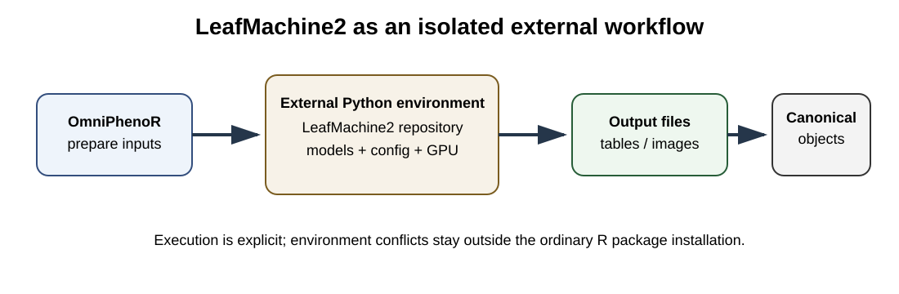

# OmniPhenoR LeafMachine2 Integration: External Herbarium Workflows

## Purpose

LeafMachine2 is a modular computer-vision system designed for automated
extraction of morphological information from digitized herbarium
specimens ([Weaver and Smith 2023](#ref-Weaver2023_LeafMachine2)). Its
installation, models, configuration files, and GPU dependencies form a
substantial external system. OmniPhenoR therefore treats LeafMachine2 as
an **external executable workflow**, not as an ordinary lightweight
Python import.



## 1. Why an external-process adapter

LeafMachine2 may depend on a specific Python/PyTorch/CUDA combination
and a repository-local configuration. Running it in a separate
environment reduces conflicts with R `torch`, other Python packages, and
unrelated project environments.

``` r

pheno_leafmachine_status()
#> # A tibble: 1 × 4
#>   available path  version note                                                  
#>   <lgl>     <chr> <chr>   <chr>                                                 
#> 1 FALSE     NA    NA      Set path or option OmniPhenoR.leafmachine2 to a LeafM…
```

A repository can be specified explicitly:

``` r

pheno_leafmachine_status("D:/tools/LeafMachine2")
```

## 2. Dry-run first

The runner is deliberately non-executing by default.

``` r

pheno_leafmachine_run(
  path = tempdir(),
  python = "python",
  execute = FALSE
)
#> $program
#> [1] "python"
#> 
#> $args
#> [1] "C:/Users/wep69/AppData/Local/Temp/Rtmp4apJpP/LeafMachine2.py"
#> 
#> $working_directory
#> [1] "C:/Users/wep69/AppData/Local/Temp/Rtmp4apJpP"
#> 
#> $config
#> NULL
#> 
#> $execute
#> [1] FALSE
```

For a real installation, inspect the returned command plan before
setting `execute = TRUE`.

``` r

run <- pheno_leafmachine_run(
  path = "D:/tools/LeafMachine2",
  python = "D:/tools/LeafMachine2/.venv_LM2/Scripts/python.exe",
  execute = TRUE
)
```

## 3. Configuration discipline

LeafMachine2 configurations should be treated as scientific inputs. Save
the exact YAML used for each batch and compute a file hash. If the
upstream program expects a repository-local configuration filename,
preserve that behavior rather than inventing an undocumented
command-line override.

A recommended project structure is:

``` text
analysis/
├── leafmachine/
│   ├── configs/
│   │   └── herbarium_batch_2026.yaml
│   ├── input_manifest.csv
│   ├── environment_report.md
│   └── output/
└── R/
    └── import_leafmachine.R
```

## 4. Importing outputs

The importer searches CSV results and attempts to normalize recognizable
box columns.

``` r

f <- tempfile(fileext = ".csv")
utils::write.csv(
  data.frame(
    class="leaf",
    confidence=.94,
    xmin=10, ymin=20, xmax=100, ymax=160
  ),
  f,
  row.names=FALSE
)

out <- pheno_leafmachine_import(f)
out
#> <pheno_detection>
#>   objects: 1 
#>   engine: leafmachine2 
#>   classes: leaf
unlink(f)
```

If a recognized detection table is found, the result becomes a
`pheno_detection`. Otherwise the importer returns the tabular outputs so
the researcher can build a project-specific normalization layer.

## 5. Do not over-normalize

LeafMachine2 can produce measurements that have no direct equivalent in
a simple bounding-box schema. Those results should remain available
rather than being discarded merely to force every field into a canonical
object.

The adapter therefore follows a hierarchy:

1.  normalize when semantics are clear;
2.  preserve original fields when semantics are backend-specific;
3.  attach provenance linking the normalized result to the original
    output file.

## 6. Herbarium measurement workflow

``` text
specimen image
    ↓
LeafMachine2 external environment
    ↓
component detections / segmentations / scale
    ↓
raw LeafMachine2 tables
    ↓
pheno_leafmachine_import()
    ↓
canonical objects + preserved backend measurements
    ↓
experimental/taxonomic identity
```

## 7. Scale and physical units

Herbarium images often include rulers or scale information. Do not mix
pixel morphology from OmniPhenoR with physical measurements from
LeafMachine2 unless the scale transformation is explicit and verified.

If a conversion factor is imported, record:

- source ruler;
- units;
- pixels per unit;
- measurement method;
- confidence/QC state.

## 8. Resource planning

Large herbarium batches can be RAM- and GPU-intensive. This is another
reason not to execute LeafMachine2 during package checks or vignette
rendering. Documentation uses frozen compact outputs; full reproduction
is a developer/research operation.

## 9. Validation strategy

A defensible study should include manually measured or independently
annotated specimens covering:

- small and large leaves;
- overlapping leaves;
- fragmented specimens;
- labels or archival objects near leaves;
- different ruler styles;
- different institutions/scanners;
- damaged or folded specimens.

Validation should target the final trait, not only component detection.

## 10. Common mistakes

- Assuming a detected repository implies a working CUDA/PyTorch
  environment.
- Updating LeafMachine2 without freezing the configuration and model
  state used for a study.
- Dropping backend-specific measurements during import.
- Mixing measurements from different scale-calibration routes without
  audit.
- Running a large external pipeline automatically as part of vignette
  generation.

## Final perspective

The LeafMachine2 integration is deliberately conservative. OmniPhenoR
coordinates execution, import, normalization, identity, and provenance
while leaving the specialist herbarium pipeline in its own environment.

Weaver, William N., and Stephen A. Smith. 2023. “From Leaves to Labels:
Building Modular Machine Learning Networks for Rapid Herbarium Specimen
Analysis with LeafMachine2.” *Applications in Plant Sciences* 11 (5):
e11548. <https://doi.org/10.1002/aps3.11548>.
