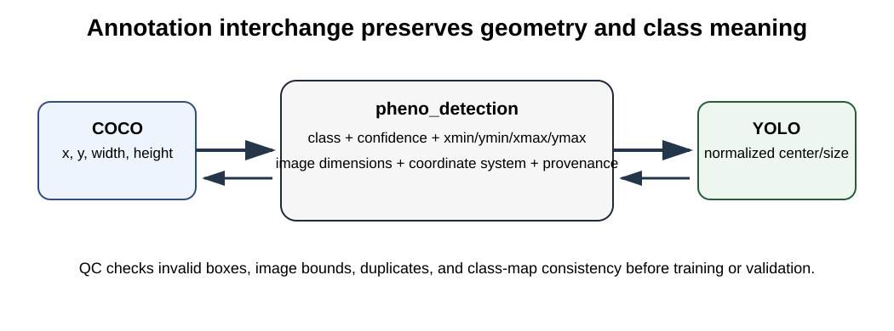

# OmniPhenoR Annotation Interchange: COCO, YOLO, and Quality Control

## Purpose

Training and validating computer-vision models requires annotation
interchange. OmniPhenoR 0.3.0 adds compact COCO-style and YOLO
bounding-box converters so that annotation geometry can move between R,
training tools, and external models without losing class definitions or
image dimensions. The Microsoft COCO data model is a widely used
reference for instance-oriented annotations ([Lin et al.
2014](#ref-Lin2014_COCO)).



## 1. YOLO export

``` r

d <- pheno_detection(data.frame(
  class=c("leaf","flower"),
  confidence=c(1,1),
  xmin=c(10,70), ymin=c(20,30),
  xmax=c(50,95), ymax=c(80,60)
))

labels <- pheno_to_yolo(
  d,
  image_width=120,
  image_height=100,
  class_map=c("leaf","flower")
)
labels
#> [1] "0 0.25000000 0.50000000 0.33333333 0.60000000"
#> [2] "1 0.68750000 0.45000000 0.20833333 0.30000000"
```

YOLO coordinates are normalized center-x, center-y, width, height. They
cannot be interpreted without the image dimensions and class map.

## 2. YOLO import and round trip

``` r

back <- pheno_from_yolo(
  labels,
  image_width=120,
  image_height=100,
  class_map=c("leaf","flower")
)
back
#> <pheno_detection>
#>   objects: 2 
#>   engine: yolo_format 
#>   classes: flower, leaf
```

Round-trip tests are included in the package test suite because
coordinate-format errors are easy to make and can silently damage a
training dataset.

## 3. COCO-style export

``` r

co <- pheno_to_coco(
  d,
  image_id=1,
  image_width=120,
  image_height=100
)
names(co)
#> [1] "images"      "categories"  "annotations"
co$annotations[[1]]
#> $id
#> [1] 1
#> 
#> $image_id
#> [1] 1
#> 
#> $category_id
#> [1] 2
#> 
#> $bbox
#> [1] 10 20 40 60
#> 
#> $area
#> [1] 2400
#> 
#> $iscrowd
#> [1] 0
#> 
#> $score
#> [1] 1
```

Writing JSON requires the optional `jsonlite` package:

``` r

pheno_to_coco(
  d,
  image_id=1,
  image_width=120,
  image_height=100,
  file="annotations.json"
)
```

## 4. COCO import

``` r

pheno_from_coco(co)
#> <pheno_detection>
#>   objects: 2 
#>   engine: coco 
#>   image: 1 
#>   classes: flower, leaf
```

The 0.3.0 implementation focuses on bounding-box detection interchange.
Rich polygon/RLE segmentation should be added only with tests that
preserve topology and category semantics.

## 5. Annotation QC

``` r

bad <- pheno_detection(data.frame(
  class=c("leaf","leaf"),
  confidence=c(1,1),
  xmin=c(-5,0), ymin=c(0,0),
  xmax=c(105,100), ymax=c(100,100)
))

pheno_annotation_qc(
  bad,
  image_width=100,
  image_height=100
)
#> # A tibble: 1 × 3
#>   object_id issue           detail                 
#>       <int> <chr>           <chr>                  
#> 1         1 x_out_of_bounds box exceeds image width
```

Current checks include out-of-bounds boxes, tiny/invalid objects, and
probable duplicate boxes.

## 6. Annotation identity

An annotation file should not become disconnected from the biological
sample. Maintain an external manifest such as:

| image_id | plot_id | plant_id | organ  | date       | annotator |
|----------|---------|----------|--------|------------|-----------|
| img001   | P01     | plant07  | canopy | 2026-06-12 | A         |
| img002   | P01     | plant08  | canopy | 2026-06-12 | B         |

The annotation format is only one layer of the scientific dataset.

## 7. Class-map versioning

Changing class order in YOLO data can silently relabel all annotations.
Keep the class map under version control and include a hash in dataset
metadata.

For example:

``` text
0 leaf
1 flower
2 fruit
```

is not equivalent to:

``` text
0 flower
1 leaf
2 fruit
```

Even though the label files remain syntactically valid.

## 8. Leakage control

When creating train/validation/test splits, split at the correct
biological level. Repeated images of the same plant should not be
allowed to cross partitions merely because annotation files have unique
filenames.

A recommended manifest contains at least:

``` text
image_id
plant_id
plot_id
environment_id
treatment
acquisition_session
```

Then use the group-aware split infrastructure introduced in 0.2.0.

## 9. Common mistakes

- Forgetting image dimensions when converting normalized coordinates.
- Using one-based class IDs in a zero-based YOLO file.
- Reordering the class map after labels have been generated.
- Treating JSON validity as annotation validity.
- Splitting images rather than biological groups.
- Ignoring duplicate annotations near tile boundaries.

## 10. Dataset release checklist

Before a dataset is frozen:

1.  run annotation QC;
2.  verify all images have expected labels;
3.  verify class-map consistency;
4.  check image dimensions;
5.  inspect a random visual sample;
6.  freeze the biological split manifest;
7.  hash annotation files;
8.  record annotation software and version;
9.  record exclusion rules;
10. preserve the original annotation export.

## Final perspective

Interchange formats should simplify collaboration, not erase scientific
identity. OmniPhenoR treats COCO and YOLO as transport layers around
canonical objects whose classes, dimensions, provenance, and biological
grouping remain explicit.

Lin, Tsung-Yi, Michael Maire, Serge J. Belongie, et al. 2014. “Microsoft
COCO: Common Objects in Context.” *Computer Vision – ECCV 2014* 8693:
740–55. <https://doi.org/10.1007/978-3-319-10602-1_48>.
