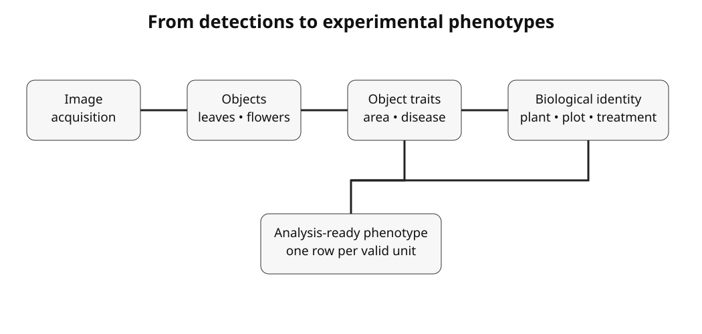

# OmniPhenoR Object-to-Plant Phenotypes: Identity, Aggregation, and Experimental Units

## Purpose

Modern computer vision can produce hundreds of objects from a single
image. Statistical analysis, however, depends on the experimental
design. OmniPhenoR 0.3.0 therefore adds explicit identity and
aggregation helpers so that leaves, flowers, lesions, and fruits can be
summarized to plant, plot, or environment without accidental
pseudo-replication.



## 1. Build biological identity

``` r

id <- pheno_identity(
  image_id = c("img01","img02","img03"),
  study_id = "nitrogen_2026",
  environment_id = "field_A",
  plot_id = c("P01","P01","P02"),
  plant_id = c("P01_01","P01_02","P02_01")
)
id
#> # A tibble: 3 × 6
#>   study_id      environment_id plot_id plant_id organ_id image_id
#>   <chr>         <chr>          <chr>   <chr>    <chr>    <chr>   
#> 1 nitrogen_2026 field_A        P01     P01_01   NA       img01   
#> 2 nitrogen_2026 field_A        P01     P01_02   NA       img02   
#> 3 nitrogen_2026 field_A        P02     P02_01   NA       img03
```

The `image_id` is required to be unique in this table. This prevents
one-to-many joins from silently multiplying object rows.

## 2. Link objects

``` r

det <- pheno_detection(
  data.frame(
    class=c("flower","flower"), confidence=c(.95,.90),
    xmin=c(10,40), ymin=c(10,12),
    xmax=c(25,55), ymax=c(35,38)
  ),
  image_id="img01"
)

pheno_link_objects(det, id)
#> # A tibble: 2 × 18
#>   image_id class  confidence  xmin  ymin  xmax  ymax object_id centroid_x
#>   <chr>    <chr>       <dbl> <dbl> <dbl> <dbl> <dbl>     <int>      <dbl>
#> 1 img01    flower       0.95    10    10    25    35         1       17.5
#> 2 img01    flower       0.9     40    12    55    38         2       47.5
#> # ℹ 9 more variables: centroid_y <dbl>, bbox_width <dbl>, bbox_height <dbl>,
#> #   bbox_area <dbl>, study_id <chr>, environment_id <chr>, plot_id <chr>,
#> #   plant_id <chr>, organ_id <chr>
```

## 3. Why object rows are not experimental replicates

Suppose four treatment plots each contain five sampled plants and each
plant has 15 detected leaves. The dataset may contain 300 leaf rows, but
the number of independent experimental units remains determined by the
design. A model that treats all leaves as independent can greatly
understate uncertainty.

Object-level measurements can still be modeled hierarchically, but the
nesting structure must be represented explicitly.

## 4. Plant-level aggregation

``` r

objects <- data.frame(
  plant_id=c("A","A","A","B","B"),
  leaf_area=c(18,22,20,25,27),
  severity=c(2,4,1,7,6)
)

pheno_aggregate_traits(
  objects,
  by="plant_id",
  traits=c("leaf_area","severity"),
  functions=c("mean","median","sum")
)
#> # A tibble: 2 × 8
#>   plant_id n_objects leaf_area_mean leaf_area_median leaf_area_sum severity_mean
#>   <chr>        <int>          <dbl>            <dbl>         <dbl>         <dbl>
#> 1 A                3             20               20            60          2.33
#> 2 B                2             26               26            52          6.5 
#> # ℹ 2 more variables: severity_median <dbl>, severity_sum <dbl>
```

Not every function is meaningful for every trait. Total leaf area may
justify a sum. Summed circularity or summed severity percentages usually
does not.

## 5. Useful plant-level traits

Possible derived features include:

- object count;
- total visible leaf area;
- mean and median leaf area;
- largest leaf area;
- total lesion area;
- area-weighted severity;
- coefficient of variation among leaves;
- flower or fruit count;
- proportion of organs affected.

The definition should be frozen before treatment inference.

## 6. Area-weighted disease severity

A simple mean of leaf percentages weights a tiny leaf and a large leaf
equally. A plant-level area-weighted severity can instead be defined as
total lesion area divided by total leaf area.

``` r

leaf_level <- data.frame(
  plant_id="A",
  leaf_area_px=c(1000, 500, 250),
  lesion_area_px=c(100, 100, 50)
)

with(leaf_level, 100 * sum(lesion_area_px) / sum(leaf_area_px))
#> [1] 14.28571
```

This value differs from the unweighted mean of the three leaf
percentages. The scientifically correct summary depends on the intended
phenotype.

## 7. Multiple images per plant

If the same plant is photographed repeatedly, image identity and plant
identity must remain distinct. Repeated time points are not duplicate
rows; they form a longitudinal structure that should be analyzed
explicitly in later time-series workflows.

## 8. Trait validation after aggregation

A model may have object-level errors that cancel after aggregation, or
small object-level biases that accumulate strongly. Validate both scales
when possible:

``` r

pheno_trait_metrics(
  truth=c(210, 180, 250, 225),
  prediction=c(205, 190, 243, 231)
)
#> # A tibble: 1 × 7
#>       n  bias   mae  rmse relative_bias correlation   ccc
#>   <int> <dbl> <dbl> <dbl>         <dbl>       <dbl> <dbl>
#> 1     4     1     7  7.25       0.00462       0.970 0.952
```

For count traits:

``` r

pheno_count_metrics(
  truth=c(12,9,18,15),
  prediction=c(11,10,18,14)
)
#> # A tibble: 1 × 6
#>       n  bias   mae  rmse relative_error correlation
#>   <int> <dbl> <dbl> <dbl>          <dbl>       <dbl>
#> 1     4 -0.25  0.75 0.866         0.0653       0.970
```

## 9. Recommended data layers

Keep at least three tables conceptually distinct:

1.  **image manifest**: acquisition and biological identity;
2.  **object table**: one row per detected/segmented object;
3.  **analysis table**: one row per statistical unit or observation
    required by the model.

Do not overwrite the object table when creating the analysis table.
Retaining both supports auditing and alternative summaries.

## 10. Common mistakes

- Treating every detected leaf as an independent replicate.
- Losing plant IDs after tiling.
- Aggregating percentages by simple mean without considering
  denominators.
- Combining repeated acquisitions with independent plants.
- Filtering objects after seeing treatment effects.
- Using object count as a phenotype without validating detection recall.

## Final perspective

The object-to-plant layer is what turns computer-vision output into
experimental phenotyping data. Its central responsibility is not merely
aggregation but preservation of the design from pixels to the final
statistical table.
