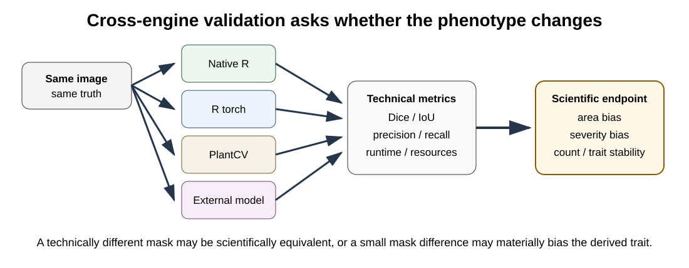

# OmniPhenoR Cross-Engine Validation: Classical R, Torch, PlantCV, and External Models

## Purpose

A package that supports several engines should not imply that they are
interchangeable. OmniPhenoR 0.3.0 makes cross-engine comparison explicit
so that a researcher can evaluate whether different defensible
processing methods lead to materially different phenotypes.



## 1. Segmentation comparison

``` r

truth <- pheno_data("leaf_mask")
img <- pheno_data("leaf_rgb")

native <- pheno_segment(img, "ExG")
perfect <- truth

pheno_cross_engine_validate(
  truth,
  native=native,
  reference=perfect,
  type="segmentation"
)
#> # A tibble: 2 × 14
#>   engine     tp    tn    fp    fn   iou  dice precision recall specificity    f1
#>   <chr>   <int> <int> <int> <int> <dbl> <dbl>     <dbl>  <dbl>       <dbl> <dbl>
#> 1 native   2872  9416     0     0     1     1         1      1           1     1
#> 2 refere…  2872  9416     0     0     1     1         1      1           1     1
#> # ℹ 3 more variables: balanced_accuracy <dbl>, area_bias <dbl>,
#> #   boundary_disagreement <dbl>
```

The point is not to force agreement. Disagreement can reveal sensitivity
to background, color, boundary definition, or model assumptions.

## 2. Detection comparison

``` r

truth_d <- pheno_detection(data.frame(
  class="flower",confidence=1,
  xmin=10,ymin=10,xmax=40,ymax=45
))

model_a <- pheno_detection(data.frame(
  class="flower",confidence=.9,
  xmin=11,ymin=11,xmax=41,ymax=44
))

model_b <- pheno_detection(data.frame(
  class="flower",confidence=.8,
  xmin=8,ymin=9,xmax=38,ymax=46
))

pheno_cross_engine_validate(
  truth_d,
  A=model_a,
  B=model_b,
  type="detection"
)
#> # A tibble: 2 × 9
#>   engine    tp    fp    fn precision recall    f1 mean_iou count_bias
#>   <chr>  <int> <int> <int>     <dbl>  <dbl> <dbl>    <dbl>      <int>
#> 1 A          1     0     0         1      1     1    0.884          0
#> 2 B          1     0     0         1      1     1    0.831          0
```

## 3. Different questions require different metrics

| Scientific endpoint   | High-priority validation                |
|-----------------------|-----------------------------------------|
| leaf area             | area bias, repeatability, mask boundary |
| disease severity      | lesion area bias, severity bias         |
| flower count          | count bias, recall, false positives     |
| leaf shape            | contour fidelity, shape metrics         |
| spatial location      | centroid/coordinate error               |
| per-organ variability | one-to-one instance matching            |

Dice or IoU alone is rarely sufficient for every endpoint.

## 4. Compare final traits

``` r

pheno_trait_metrics(
  truth=c(100,120,90,135,110),
  prediction=c(98,123,88,132,111)
)
#> # A tibble: 1 × 7
#>       n  bias   mae  rmse relative_bias correlation   ccc
#>   <int> <dbl> <dbl> <dbl>         <dbl>       <dbl> <dbl>
#> 1     5  -0.6   2.2  2.32      -0.00541       0.990 0.989
```

If two engines have similar segmentation metrics but one has much
smaller trait bias, the latter may be scientifically preferable.

## 5. Benchmark computation separately

Accuracy and runtime are different dimensions.

``` r

img <- pheno_data("leaf_rgb")
pheno_benchmark(
  img,
  methods=list(
    native=function(z) pheno_segment(z,"ExG"),
    rgb=function(z) pheno_rgb_indices(z,c("ExG","GLI"))
  ),
  repetitions=1
)
#> # A tibble: 2 × 8
#>   method repetition elapsed_sec output_mb memory_delta_mb gpu_memory_mb
#>   <chr>       <int>       <dbl>     <dbl>           <dbl>         <dbl>
#> 1 native          1      0.0200    0.0486          0.100             NA
#> 2 rgb             1      0.0200    0.188           0.1000            NA
#> # ℹ 2 more variables: input_dimensions <chr>, device <chr>
```

Heavy GPU benchmarks should be run separately and frozen as release
artifacts. Do not make every package installation repeat them.

## 6. Ensemble as a sensitivity tool

``` r

m <- pheno_data("leaf_mask")
consensus <- pheno_ensemble(m, m, threshold=.5)
consensus
#> <pheno_prediction>
#>   engine: ensemble  device: cpu 
#>   mask dimensions: 96 x 128
```

An ensemble can be used to quantify agreement rather than blindly
replacing a validated primary method. For example, the fraction of
pixels where methods disagree can become a QC indicator.

## 7. Frozen example

``` r

pheno_example_result("cross_engine_demo")
#>            engine dice  iou area_bias runtime_sec                   note
#> 1      native_exg 0.94 0.89    -0.012       0.018 frozen teaching result
#> 2      torch_unet 0.97 0.94    -0.004       0.052 frozen teaching result
#> 3 plantcv_adapter 0.95 0.91     0.008       0.074  frozen adapter result
```

This compact table is distributed with the package. A heavy real-backend
benchmark can be regenerated separately by the developer.

## 8. Avoid unfair comparisons

Common sources of unfair comparison include:

- different image resizing;
- different test sets;
- different confidence thresholds;
- tuning one model on the test data;
- comparing CPU runtime to GPU runtime without reporting hardware;
- using different class definitions;
- including preprocessing time for one engine but not another.

A benchmark table should state exactly what was timed.

## 9. Sensitivity analysis without treatment-driven tuning

Processing choices should be selected using independent annotation,
repeatability, physical references, or prespecified sensitivity
analyses. They should not be optimized to maximize downstream
significance.

A useful strategy is to freeze a small set of defensible alternatives
and ask whether the scientific conclusion changes materially.

## 10. Reporting cross-engine results

A concise report should state:

- primary engine and why it was chosen;
- alternative engines used for sensitivity analysis;
- validation set and annotation procedure;
- accuracy metrics;
- phenotype bias metrics;
- hardware/runtime conditions;
- model hashes and versions;
- whether scientific conclusions were stable.

## Final perspective

Cross-engine validation turns backend diversity from a software feature
into a scientific diagnostic. The objective is not to crown a
universally best engine but to understand whether the phenotype is
stable under reasonable analytical alternatives.
