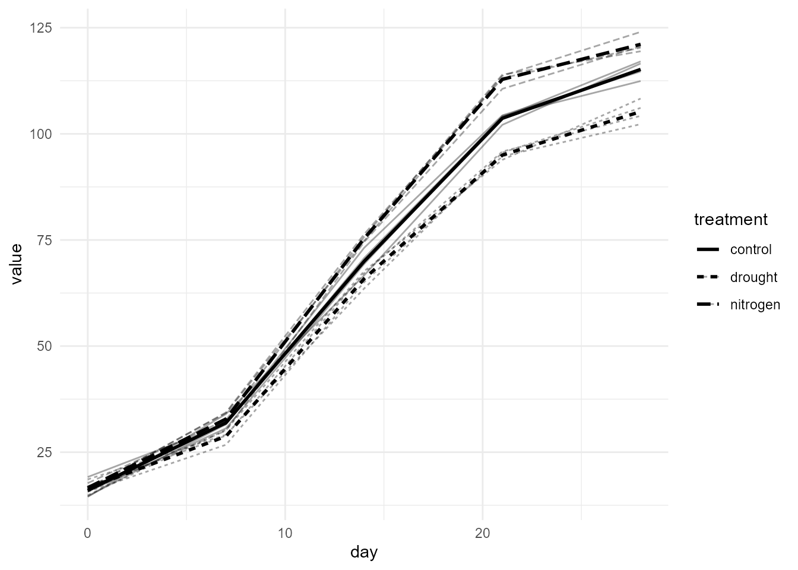

# OmniPhenoR Longitudinal Phenotyping: From Repeated Images to Dynamic Traits

## Purpose

Version 0.4.0 extends OmniPhenoR from a pipeline that produces
phenotypes from individual images into a framework that preserves
**biological identity through time**. This distinction is fundamental.
Repeated images of the same plant are not independent experimental
units, and a longitudinal workflow must preserve study, plot, plant,
organ, acquisition, time, trait, source, and quality information before
statistical modeling. High-throughput phenotyping increasingly depends
on converting repeated sensor observations into interpretable biological
trajectories rather than isolated measurements ([Tardieu et al.
2017](#ref-Tardieu2017_Phenomics); [Araus and Cairns
2014](#ref-Araus2014_FieldHTP)).


## 1. The canonical `pheno_series`

The 0.4.0 temporal grammar begins with a long-form table. One row is an
observation of one trait on one biological unit at one time.

``` r

d <- pheno_data("growth_series")
s <- pheno_series(
  d,
  id = "plant_id",
  time = "day",
  trait = "trait",
  value = "value",
  group = c("treatment", "block", "environment")
)
s
#> <pheno_series>
#>   rows: 120 
#>   subjects: 12 
#>   traits: 2 
#>   time range: 0 to 28
```

The same object can retain calendar dates while using day after
emergence as the analytical clock.

``` r

s_date <- pheno_series(
  d,
  id = "plant_id",
  time = "date",
  trait = "trait",
  value = "value",
  group = c("treatment", "block")
)
s_date
#> <pheno_series>
#>   rows: 120 
#>   subjects: 12 
#>   traits: 2 
#>   time range: 2026-05-01 to 2026-05-29
```

**Interpretation.** The `id` field identifies the repeated biological
subject. Treatment and block are attributes of that subject, not
substitutes for subject identity.

## 2. Validate before modeling

``` r

validation <- pheno_series_validate(s)
validation
#> # A tibble: 4 × 3
#>   check                        pass  detail
#>   <chr>                        <lgl> <chr> 
#> 1 duplicate subject-time-trait TRUE  FALSE 
#> 2 complete identity            TRUE  FALSE 
#> 3 finite numeric values        TRUE  TRUE  
#> 4 within-series order          TRUE  TRUE
stopifnot(all(validation$pass))
```

The validator checks duplicate subject-time-trait records, missing
identity, numerical values, and within-series ordering. A duplicated
acquisition should not be silently averaged unless the scientific
protocol explicitly defines that operation.

``` r

qc <- pheno_series_qc(s)
table(qc$quality_flag)
#> 
#>  OK 
#> 120
```

Quality flags are retained rather than deleting observations. This is
especially important when a failed segmentation, missing acquisition,
occlusion, or plant death have different biological meanings.

## 3. Time origin is part of the phenotype definition

A trajectory can be indexed by planting date, emergence, treatment
application, inoculation, flowering, or thermal time. These clocks are
not interchangeable.

``` r

s2 <- pheno_set_time_origin(
  s,
  origin = 14,
  new_time = "days_after_treatment"
)
head(s2[c("plant_id", "day", "days_after_treatment")])
#> <pheno_series>
#>   rows: 6
```

Do not overwrite the original time column. Keeping both absolute and
relative time makes the transformation auditable.

## 4. Align irregular or incomplete acquisitions

Plants may be photographed on slightly different schedules. Alignment
should therefore be explicit.

``` r

small <- s[s$plant_id %in% c("P01", "P02") & s$trait == "leaf_area", ]
aligned <- pheno_time_align(
  small,
  grid = seq(0, 28, by = 2),
  method = "linear"
)
aligned
#> <pheno_series>
#>   rows: 30 
#>   subjects: 2 
#>   traits: 1 
#>   time range: 0 to 28
```

A nearest-time alignment is more defensible when interpolation would
create an artificial biological measurement.

``` r

nearest <- pheno_time_align(
  small,
  grid = c(0, 5, 12, 19, 26),
  method = "nearest"
)
nearest
#> <pheno_series>
#>   rows: 10 
#>   subjects: 2 
#>   traits: 1 
#>   time range: 0 to 26
```

Use `method = "exact"` when observations should only be compared if they
occurred at the same recorded time.

## 5. Raw trajectories should remain visible

``` r

leaf <- subset(d, trait == "leaf_area")
pheno_plot_series(
  leaf,
  time = "day",
  value = "value",
  subject = "plant_id",
  group = "treatment",
  show_individual = TRUE,
  summary = TRUE
)
```



A group mean alone can hide heterogeneity, failed plants, delayed
development, and treatment-specific variance. Individual trajectories
should be inspected before choosing a model.

## 6. Smoothing is a transformation, not ground truth

``` r

p1 <- subset(leaf, plant_id == "P01")
lo <- pheno_smooth(p1, "day", "value", method = "loess")
#> Warning in simpleLoess(y, x, w, span, degree = degree, parametric = parametric,
#> : span too small.  fewer data values than degrees of freedom.
#> Warning in simpleLoess(y, x, w, span, degree = degree, parametric = parametric,
#> : pseudoinverse used at 0
#> Warning in simpleLoess(y, x, w, span, degree = degree, parametric = parametric,
#> : neighborhood radius 14
#> Warning in simpleLoess(y, x, w, span, degree = degree, parametric = parametric,
#> : reciprocal condition number 0
#> Warning in simpleLoess(y, x, w, span, degree = degree, parametric = parametric,
#> : There are other near singularities as well. 49
#> Warning in predLoess(object$y, object$x, newx = if (is.null(newdata)) object$x
#> else if (is.data.frame(newdata))
#> as.matrix(model.frame(delete.response(terms(object)), : span too small.  fewer
#> data values than degrees of freedom.
#> Warning in predLoess(object$y, object$x, newx = if (is.null(newdata)) object$x
#> else if (is.data.frame(newdata))
#> as.matrix(model.frame(delete.response(terms(object)), : pseudoinverse used at 0
#> Warning in predLoess(object$y, object$x, newx = if (is.null(newdata)) object$x
#> else if (is.data.frame(newdata))
#> as.matrix(model.frame(delete.response(terms(object)), : neighborhood radius 14
#> Warning in predLoess(object$y, object$x, newx = if (is.null(newdata)) object$x
#> else if (is.data.frame(newdata))
#> as.matrix(model.frame(delete.response(terms(object)), : reciprocal condition
#> number 0
#> Warning in predLoess(object$y, object$x, newx = if (is.null(newdata)) object$x
#> else if (is.data.frame(newdata))
#> as.matrix(model.frame(delete.response(terms(object)), : There are other near
#> singularities as well. 49
sp <- pheno_smooth(p1, "day", "value", method = "spline")
head(lo)
#> # A tibble: 5 × 4
#>    time   raw smoothed method
#>   <dbl> <dbl>    <dbl> <chr> 
#> 1     0  14.5     14.5 loess 
#> 2     7  34.0     34.0 loess 
#> 3    14  66.7     66.7 loess 
#> 4    21 102.     102.  loess 
#> 5    28 117.     117.  loess
head(sp)
#> # A tibble: 5 × 4
#>    time   raw smoothed method
#>   <dbl> <dbl>    <dbl> <chr> 
#> 1     0  14.5     14.5 spline
#> 2     7  34.0     34.0 spline
#> 3    14  66.7     66.7 spline
#> 4    21 102.     102.  spline
#> 5    28 117.     117.  spline
```

Smoothing can improve derivative estimation, but excessive smoothing can
shift phenological transitions or attenuate stress responses. The method
and parameters therefore belong in the provenance. The package also
supports a transparent moving-average option for short exploratory
series.

## 7. From series to dynamic traits

``` r

traits <- pheno_tidy(
  d,
  subject = "plant_id",
  time = "day",
  value = "value",
  trait = "trait"
)
traits
#> # A tibble: 12 × 7
#>    subject green_fraction_auc green_fraction_maximum green_fraction_max_slope
#>    <chr>                <dbl>                  <dbl>                    <dbl>
#>  1 P01                   23.9                  0.884                0.000394 
#>  2 P02                   24.0                  0.895                0.00299  
#>  3 P03                   24.0                  0.887                0.00150  
#>  4 P04                   24.3                  0.903                0.00306  
#>  5 P05                   23.9                  0.887                0.00179  
#>  6 P06                   24.1                  0.894                0.00359  
#>  7 P07                   24.2                  0.894                0.00201  
#>  8 P08                   23.9                  0.887                0.00135  
#>  9 P09                   23.5                  0.889                0.00151  
#> 10 P10                   23.6                  0.893                0.000353 
#> 11 P11                   23.7                  0.891                0.00291  
#> 12 P12                   23.7                  0.893                0.0000690
#> # ℹ 3 more variables: leaf_area_auc <dbl>, leaf_area_maximum <dbl>,
#> #   leaf_area_max_slope <dbl>
```

This converts repeated measurements into one row per experimental
subject with dynamic summaries such as AUC, maximum value, and maximum
observed slope. These summaries can then be exported to mixed models,
multivariate analysis, breeding pipelines, or other statistical
packages.

## 8. Avoid pseudo-replication

Suppose 12 plants are imaged on five dates for two traits. The table has
120 rows, but it still contains only 12 plant-level repeated subjects. A
standard analysis that treats all 120 rows as independent observations
inflates the apparent sample size.

The repeated-measures layer introduced in 0.4.0 therefore always asks
for a subject identifier. When the experimental unit is the plot rather
than the plant, the subject should be the plot or an appropriate nested
identity.

## 9. Missing observations require semantic interpretation

A missing value may represent:

- no image acquired;
- image acquired but failed QC;
- plant hidden by occlusion;
- segmentation failure;
- organ absent because of phenological stage;
- dead plant;
- intentional skipped acquisition.

Only the first four are measurement failures. The last two can be
biological information. Store the cause whenever it is known.

## 10. Minimal integrated workflow

``` r

d <- pheno_data("growth_series")
s <- pheno_series(d, "plant_id", "day", "trait", "value",
                  group = c("treatment", "block", "environment"))
stopifnot(all(pheno_series_validate(s)$pass))

leaf <- s[s$trait == "leaf_area", ]
growth <- pheno_growth(
  leaf,
  time = "day",
  value = "value",
  model = "spline",
  group = "plant_id"
)

dynamic <- pheno_growth_traits(growth)
dynamic
#> # A tibble: 12 × 11
#>    series status error minimum maximum   auc max_growth_rate time_max_growth
#>    <chr>  <chr>  <chr>   <dbl>   <dbl> <dbl>           <dbl>           <dbl>
#>  1 P01    ok     NA       14.5    117. 1883.            5.59            15.4
#>  2 P02    ok     NA       15.7    112. 1882.            6.21            13.2
#>  3 P03    ok     NA       14.6    115. 1919.            6.45            11.9
#>  4 P04    ok     NA       19.2    117. 1919.            6.22            12.5
#>  5 P05    ok     NA       15.9    121. 1985.            7.04            12.3
#>  6 P06    ok     NA       16.5    124. 2056.            6.59            14  
#>  7 P07    ok     NA       16.4    120. 2052.            6.65            13.0
#>  8 P08    ok     NA       17.7    120. 2042.            6.96            13.2
#>  9 P09    ok     NA       18.6    106. 1754.            5.60            13.2
#> 10 P10    ok     NA       14.9    108. 1772.            5.78            11.5
#> 11 P11    ok     NA       15.7    102. 1719.            6.07            12.2
#> 12 P12    ok     NA       17.0    104. 1768.            6.02            11.9
#> # ℹ 3 more variables: t25 <dbl>, t50 <dbl>, t75 <dbl>
```

## Reporting checklist

Report the biological subject, acquisition schedule, time origin,
missingness meaning, alignment/interpolation method, smoothing method,
units, image-derived trait definition, quality-control flags, and
whether derived dynamic traits were estimated per subject before
treatment-level inference.

## Final perspective

The central principle of longitudinal phenotyping is simple: **time adds
observations, not independent biological replicates**. OmniPhenoR 0.4.0
keeps identity, acquisition time, image-derived traits, temporal
processing, and downstream inference connected in one auditable
workflow.

## Extended interpretation: identity before analysis

A repeated-image dataset can be perfectly tidy and still be
scientifically wrong if the identifier represents an image file rather
than the biological subject. Before fitting any trajectory, trace at
least one row back to its study, environment, plot, plant or organ and
acquisition. Then verify that repeated images from the same unit share
the same subject identifier.

The same principle applies after object detection. If several leaves are
summarized within a plant, decide whether the longitudinal unit is the
leaf, the plant, or the plot. A leaf identifier that disappears because
of occlusion should not silently be replaced by a newly detected leaf
while pretending that one organ was followed continuously. When organ
tracking is uncertain, aggregate to the plant level or mark tracking
uncertainty explicitly.

A useful release check is to deliberately introduce one duplicate
subject-time-trait row and one missing subject identifier into a copy of
the teaching data.
[`pheno_series_validate()`](https://wep69.github.io/OmniPhenoR/reference/pheno_series_validate.md)
should expose both conditions. Such adversarial examples are more
informative than checking only well-formed data.

Araus, Jose Luis, and Jill E. Cairns. 2014. “Field High-Throughput
Phenotyping: The New Crop Breeding Frontier.” *Trends in Plant Science*
19 (1): 52–61. <https://doi.org/10.1016/j.tplants.2013.09.008>.

Tardieu, Francois, Llorenc Cabrera-Bosquet, Tony Pridmore, and Malcolm
Bennett. 2017. “Plant Phenomics, from Sensors to Knowledge.” *Current
Biology* 27 (15): R770–83. <https://doi.org/10.1016/j.cub.2017.05.055>.
