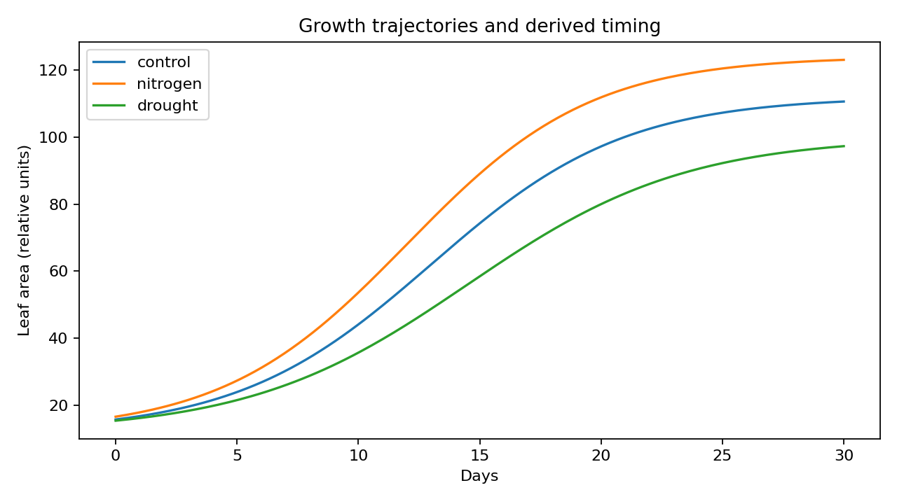

# OmniPhenoR Growth Curves: Models, Rates, and Dynamic Plant Traits

## Purpose

Growth curves compress repeated measurements into biologically
interpretable dynamic traits. Nonlinear plant growth models are useful
because final size, timing, and growth rate can respond differently to
treatment or genotype. Paine et al. provide a practical framework for
fitting nonlinear growth functions and calculating absolute and relative
growth rates ([Paine et al. 2012](#ref-Paine2012_Growth)), while the
Richards family supplies a flexible empirical growth form ([Richards
1959](#ref-Richards1959_Growth)).



## 1. Start with one biological trajectory

``` r

d <- subset(pheno_data("growth_series"),
            plant_id == "P01" & trait == "leaf_area")
d
#>          plant_id treatment block environment day       date     trait
#> control       P01   control     1          E1   0 2026-05-01 leaf_area
#> control1      P01   control     1          E1   7 2026-05-08 leaf_area
#> control2      P01   control     1          E1  14 2026-05-15 leaf_area
#> control3      P01   control     1          E1  21 2026-05-22 leaf_area
#> control4      P01   control     1          E1  28 2026-05-29 leaf_area
#>              value
#> control   14.49367
#> control1  34.00204
#> control2  66.66465
#> control3 102.12377
#> control4 116.55959
```

The first diagnostic is the raw trajectory. A nonlinear curve should not
be selected merely because it has more parameters.

## 2. Logistic growth

``` r

g_log <- pheno_growth(
  d,
  time = "day",
  value = "value",
  model = "logistic"
)
g_log
#> <pheno_growth> logistic 
#>   fitted series: 1 / 1
pheno_growth_traits(g_log)
#> # A tibble: 1 × 11
#>   series status error minimum maximum   auc max_growth_rate time_max_growth
#>   <chr>  <chr>  <chr>   <dbl>   <dbl> <dbl>           <dbl>           <dbl>
#> 1 series ok     NA       13.3    118. 1876.            5.23            13.3
#> # ℹ 3 more variables: t25 <dbl>, t50 <dbl>, t75 <dbl>
```

The derived table includes minimum, maximum, AUC, maximum numerical
growth rate, time of maximum growth, and threshold-crossing times such
as `t25`, `t50`, and `t75`.

## 3. Gompertz growth

``` r

g_gom <- pheno_growth(
  d,
  "day",
  "value",
  model = "gompertz"
)
pheno_growth_traits(g_gom)
#> # A tibble: 1 × 11
#>   series status error minimum maximum   auc max_growth_rate time_max_growth
#>   <chr>  <chr>  <chr>   <dbl>   <dbl> <dbl>           <dbl>           <dbl>
#> 1 series ok     NA       11.4    119. 1873.            4.70            11.3
#> # ℹ 3 more variables: t25 <dbl>, t50 <dbl>, t75 <dbl>
```

Logistic and Gompertz curves differ in symmetry around their inflection
region. A model should be justified by the observed trajectory and
diagnostics rather than chosen after inspecting treatment significance.

## 4. Richards growth

``` r

g_rich <- pheno_growth(
  d,
  "day",
  "value",
  model = "richards"
)
g_rich
#> <pheno_growth> richards 
#>   fitted series: 1 / 1
```

Richards’ additional shape parameter increases flexibility but can also
make fitting less stable. If the fit fails, the returned object records
failure instead of fabricating a result.

## 5. Spline as a descriptive alternative

``` r

g_sp <- pheno_growth(d, "day", "value", model = "spline")
pheno_growth_traits(g_sp, grid_points = 301)
#> # A tibble: 1 × 11
#>   series status error minimum maximum   auc max_growth_rate time_max_growth
#>   <chr>  <chr>  <chr>   <dbl>   <dbl> <dbl>           <dbl>           <dbl>
#> 1 series ok     NA       14.5    117. 1883.            5.59            15.4
#> # ℹ 3 more variables: t25 <dbl>, t50 <dbl>, t75 <dbl>
```

A spline is useful when the goal is a smooth empirical trajectory rather
than interpretation of a particular nonlinear equation. It can also be
valuable for derivative-based summaries.

## 6. Fit multiple plants independently

Dynamic traits should generally be estimated at the biological-subject
level before treatment-level inference.

``` r

leaf <- subset(pheno_data("growth_series"), trait == "leaf_area")
g_all <- pheno_growth(
  leaf,
  "day",
  "value",
  model = "spline",
  group = "plant_id"
)
traits <- pheno_growth_traits(g_all)
traits
#> # A tibble: 12 × 11
#>    series status error minimum maximum   auc max_growth_rate time_max_growth
#>    <chr>  <chr>  <chr>   <dbl>   <dbl> <dbl>           <dbl>           <dbl>
#>  1 P01    ok     NA       14.5    117. 1883.            5.59            15.4
#>  2 P02    ok     NA       15.7    112. 1882.            6.21            13.2
#>  3 P03    ok     NA       14.6    115. 1919.            6.45            11.9
#>  4 P04    ok     NA       19.2    117. 1919.            6.22            12.5
#>  5 P05    ok     NA       15.9    121. 1985.            7.04            12.3
#>  6 P06    ok     NA       16.5    124. 2056.            6.59            14  
#>  7 P07    ok     NA       16.4    120. 2052.            6.65            13.0
#>  8 P08    ok     NA       17.7    120. 2042.            6.96            13.2
#>  9 P09    ok     NA       18.6    106. 1754.            5.60            13.2
#> 10 P10    ok     NA       14.9    108. 1772.            5.78            11.5
#> 11 P11    ok     NA       15.7    102. 1719.            6.07            12.2
#> 12 P12    ok     NA       17.0    104. 1768.            6.02            11.9
#> # ℹ 3 more variables: t25 <dbl>, t50 <dbl>, t75 <dbl>
```

Joining `traits` back to the plant-level design creates a statistically
appropriate table for treatment comparisons.

## 7. Absolute growth rate

``` r

agr <- pheno_agr(d, "day", "value")
agr
#> # A tibble: 4 × 3
#>   time_start time_end   agr
#>        <dbl>    <dbl> <dbl>
#> 1          0        7  2.79
#> 2          7       14  4.67
#> 3         14       21  5.07
#> 4         21       28  2.06
```

AGR is the change in phenotype per unit time. It depends on the
measurement scale. A plant with a larger absolute leaf area can have a
larger AGR without having a larger proportional growth rate.

## 8. Relative growth rate

``` r

rgr <- pheno_rgr(d, "day", "value")
rgr
#> # A tibble: 4 × 3
#>   time_start time_end    rgr
#>        <dbl>    <dbl>  <dbl>
#> 1          0        7 0.122 
#> 2          7       14 0.0962
#> 3         14       21 0.0609
#> 4         21       28 0.0189
```

RGR is calculated from changes in the logarithm of positive trait
values. It should not be used indiscriminately for traits that can
legitimately be zero or negative.

## 9. AUC as an integrative dynamic trait

``` r

pheno_auc(d, "day", "value")
#> [1] 1878.22
pheno_auc(d, "day", "value", standardized = TRUE)
#> [1] 67.07927
pheno_auc(d, "day", "value", from = 7, to = 21)
#> [1] 943.0929
```

Total AUC captures cumulative exposure to a phenotype. Standardized AUC
divides by duration, making studies with the same biological
interpretation but slightly different observation windows easier to
compare.

## 10. Derivative-based timing

``` r

d1 <- pheno_derivative(d, "day", "value", smooth = "spline")
d1
#> # A tibble: 5 × 5
#>    time value derivative order smoothing
#>   <dbl> <dbl>      <dbl> <int> <chr>    
#> 1     0  14.5       2.79     1 spline   
#> 2     7  34.0       3.73     1 spline   
#> 3    14  66.7       4.87     1 spline   
#> 4    21 102.        3.56     1 spline   
#> 5    28 117.        2.06     1 spline
```

The maximum first derivative is an empirical estimate of maximum growth
velocity. A second derivative can identify acceleration/deceleration
patterns, but derivative estimates are especially sensitive to noise and
acquisition frequency.

## 11. Compare treatment trajectories without pseudo-replication

``` r

summary_by_plant <- pheno_curve_compare(
  leaf,
  response = "value",
  time = "day",
  treatment = "treatment",
  subject = "plant_id"
)
summary_by_plant
#> # A tibble: 12 × 5
#>    series         auc  peak time_peak max_slope
#>    <chr>        <dbl> <dbl>     <dbl>     <dbl>
#>  1 control.P01  1878.  117.        28      5.07
#>  2 control.P02  1878.  112.        28      5.53
#>  3 control.P03  1916.  115.        28      5.94
#>  4 control.P04  1921.  117.        28      5.59
#>  5 drought.P09  1754.  106.        28      4.92
#>  6 drought.P10  1774.  108.        28      5.34
#>  7 drought.P11  1719.  102.        28      5.47
#>  8 drought.P12  1768.  104.        28      5.47
#>  9 nitrogen.P05 1984.  121.        28      6.35
#> 10 nitrogen.P06 2051.  124.        28      5.80
#> 11 nitrogen.P07 2045.  120.        28      6.00
#> 12 nitrogen.P08 2036.  119.        28      6.16
```

This produces one set of dynamic summaries per plant. Treatment
comparisons should then use the actual experimental structure rather
than the image count as the sample size.

## 12. Model diagnostics

``` r

pheno_model_diagnostics(g_log)
#> # A tibble: 1 × 2
#>   series ok   
#>   <chr>  <lgl>
#> 1 series TRUE
```

For nonlinear models, inspect convergence and sensitivity to starting
values. For spline/GAM models, inspect effective flexibility and whether
biologically relevant transitions are preserved.

## Common mistakes

1.  Fitting a treatment-level mean curve and treating its parameters as
    replicated estimates.
2.  Selecting the nonlinear model that gives the smallest p-value
    downstream.
3.  Comparing parameters from different model families as if they had
    identical biological meanings.
4.  Ignoring the acquisition window when interpreting maximum growth
    rate.
5.  Reporting `t50` without stating what the 50% threshold is relative
    to.

## Final perspective

Growth analysis is most useful when the workflow separates **curve
description**, **subject-level dynamic trait extraction**, and
**treatment-level inference**. OmniPhenoR keeps these stages explicit
and auditable.

## Model choice is part of the phenotype definition

A growth parameter is not independent of the curve used to define it.
Logistic, Gompertz and Richards models can produce different estimates
of asymptote, inflection time and maximum rate when the observed window
does not contain both early growth and the plateau. For that reason,
[`pheno_growth()`](https://wep69.github.io/OmniPhenoR/reference/pheno_growth.md)
returns the fitted object and status rather than only a compact table of
derived traits.

A useful analysis sequence is to first fit a transparent flexible curve
and then compare biologically interpretable nonlinear alternatives only
when the sampling window supports them. A failed nonlinear fit is
informative: it can indicate insufficient temporal coverage, poor
starting values, a trajectory inconsistent with the assumed family, or a
genuine non-monotonic response.

``` r

d <- subset(pheno_data("growth_series"), plant_id == "P01" & trait == "leaf_area")
f_lin <- pheno_growth(d, "day", "value", model = "linear")
f_quad <- pheno_growth(d, "day", "value", model = "quadratic")
f_spl <- pheno_growth(d, "day", "value", model = "spline")
rbind(
  linear = pheno_growth_traits(f_lin)[1, c("auc", "max_growth_rate", "time_max_growth")],
  quadratic = pheno_growth_traits(f_quad)[1, c("auc", "max_growth_rate", "time_max_growth")],
  spline = pheno_growth_traits(f_spl)[1, c("auc", "max_growth_rate", "time_max_growth")]
)
#> # A tibble: 3 × 3
#>     auc max_growth_rate time_max_growth
#> * <dbl>           <dbl>           <dbl>
#> 1 1870.            3.89           13.7 
#> 2 1879.            4.19            0.14
#> 3 1883.            5.59           15.4
```

The purpose of this comparison is sensitivity analysis, not automatic
selection of whichever model gives the most favorable treatment result.

## Common interpretation errors

- Calling the fitted asymptote a physiological maximum when the
  experiment ended before a plateau was observed.
- Reporting `t50` without defining the lower and upper fitted states
  used to construct the 50% threshold.
- Comparing RGR and AGR as if they were expressed on the same scale.
- Estimating maximum derivative from a curve with too few dates to
  resolve the peak.
- Ignoring the experimental unit after deriving one or more growth
  traits per plant.

## Reporting checklist

Report the time scale, acquisition interval, model family, convergence
status, smoothing choices, model comparison criterion if any, definition
of derived thresholds, uncertainty method, and whether the observed
window covered the estimated asymptote. Retain the original plant-level
trajectories alongside the derived-trait table.

Paine, C. E. Timothy, Toby R. Marthews, Deborah R. Vogt, et al. 2012.
“How to Fit Nonlinear Plant Growth Models and Calculate Growth Rates: An
Update for Ecologists.” *Methods in Ecology and Evolution* 3 (2):
245–56. <https://doi.org/10.1111/j.2041-210X.2011.00155.x>.

Richards, F. J. 1959. “A Flexible Growth Function for Empirical Use.”
*Journal of Experimental Botany* 10 (2): 290–301.
<https://doi.org/10.1093/jxb/10.2.290>.
