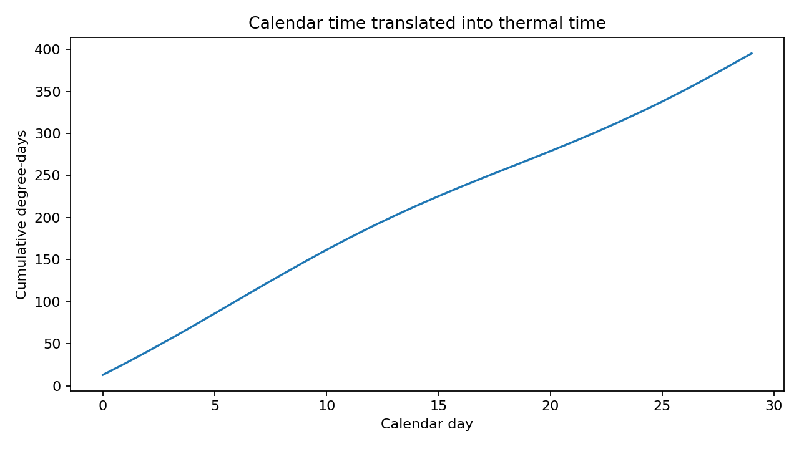

# OmniPhenoR Thermal Time: Aligning Plant Development Beyond Calendar Days

## Purpose

Calendar days are often an imperfect developmental clock because plant
development responds strongly to temperature. Growing degree-days (GDD)
provide a simple thermal-time representation, but the exact calculation
convention matters. McMaster and Wilhelm demonstrated that two common
interpretations of the same nominal equation can yield materially
different accumulations and therefore should be reported explicitly
([McMaster and Wilhelm 1997](#ref-McMaster1997_GDD)).



## 1. Teaching weather data

``` r

w <- pheno_data("weather_series")
head(w)
#>   environment day       date     tmin     tmax    tmean     rain      vpd
#> 1          E1   0 2026-05-01 18.00000 30.00000 24.00000 0.000000 1.200000
#> 2          E1   1 2026-05-02 18.68404 30.68404 24.68404 5.142301 1.405212
#> 3          E1   2 2026-05-03 19.28558 31.28558 25.28558 7.878462 1.585673
#> 4          E1   3 2026-05-04 19.73205 31.73205 25.73205 6.928203 1.719615
#> 5          E1   4 2026-05-05 19.96962 31.96962 25.96962 2.736161 1.790885
#> 6          E1   5 2026-05-06 19.96962 31.96962 25.96962 0.000000 1.790885
#>   soil_moisture
#> 1     0.2800000
#> 2     0.3037115
#> 3     0.3153923
#> 4     0.3086410
#> 5     0.2856808
#> 6     0.2700000
```

The synthetic data contain two environments, daily minimum and maximum
temperature, mean temperature, rainfall, VPD, and soil moisture.

## 2. Mean-clamp GDD

``` r

tt1 <- pheno_thermal_time(
  w,
  tmin = "tmin",
  tmax = "tmax",
  base = 10,
  method = "mean_clamp",
  by = "environment"
)
head(tt1)
#>   environment day       date     tmin     tmax    tmean     rain      vpd
#> 1          E1   0 2026-05-01 18.00000 30.00000 24.00000 0.000000 1.200000
#> 2          E1   1 2026-05-02 18.68404 30.68404 24.68404 5.142301 1.405212
#> 3          E1   2 2026-05-03 19.28558 31.28558 25.28558 7.878462 1.585673
#> 4          E1   3 2026-05-04 19.73205 31.73205 25.73205 6.928203 1.719615
#> 5          E1   4 2026-05-05 19.96962 31.96962 25.96962 2.736161 1.790885
#> 6          E1   5 2026-05-06 19.96962 31.96962 25.96962 0.000000 1.790885
#>   soil_moisture      gdd thermal_time
#> 1     0.2800000 14.00000     14.00000
#> 2     0.3037115 14.68404     28.68404
#> 3     0.3153923 15.28558     43.96962
#> 4     0.3086410 15.73205     59.70167
#> 5     0.2856808 15.96962     75.67128
#> 6     0.2700000 15.96962     91.64090
```

This computes daily mean temperature, subtracts the base, and clamps
negative GDD to zero.

## 3. Clamp Tmin and Tmax before averaging

``` r

tt2 <- pheno_thermal_time(
  w,
  "tmin",
  "tmax",
  base = 10,
  method = "minmax_clamp",
  by = "environment"
)
```

This alternative first clamps the minimum and maximum temperatures to
the base before averaging. It is not mathematically identical to the
previous convention.

## 4. Upper threshold

``` r

tt3 <- pheno_thermal_time(
  w,
  "tmin",
  "tmax",
  base = 10,
  upper = 30,
  method = "minmax_clamp",
  by = "environment"
)
```

An upper threshold can be appropriate for some crop-development
applications, but it must be scientifically justified for the crop,
stage, and process being modeled.

## 5. Join thermal time to phenotypes

``` r

leaf <- subset(pheno_data("growth_series"), trait == "leaf_area")
leaf_tt <- pheno_weather_join(
  leaf,
  tt1,
  pheno_time = "day",
  weather_time = "day",
  by = "environment"
)
head(leaf_tt[c("plant_id", "day", "thermal_time", "value")])
#>   plant_id day thermal_time    value
#> 1      P01   0           14 14.49367
#> 2      P09   0           14 18.59801
#> 3      P04   0           14 19.16524
#> 4      P12   0           14 16.97905
#> 5      P07   0           14 16.36706
#> 6      P02   0           14 15.71294
```

The phenotype can now be modeled against `thermal_time` rather than
`day`.

## 6. Calendar versus thermal growth curves

``` r

g_calendar <- pheno_growth(
  subset(leaf, plant_id == "P01"), "day", "value", "spline"
)

g_thermal <- pheno_growth(
  subset(leaf_tt, plant_id == "P01"), "thermal_time", "value", "spline"
)
```

These fits answer related but different questions. Calendar time
describes elapsed experimental time; thermal time describes accumulated
temperature exposure under the selected convention.

## 7. Multiple time origins

``` r

s <- pheno_series(leaf, "plant_id", "day", "trait", "value")
s <- pheno_set_time_origin(s, 7, "days_after_treatment")
head(s[c("day", "days_after_treatment")])
#> <pheno_series>
#>   rows: 6
```

A complete experimental table can contain calendar date, days after
planting, days after treatment, and thermal time simultaneously.

## 8. Missing temperatures

Do not silently interpolate long periods of missing weather data. The
required action depends on whether the gap is one hour, one day, or a
long station outage. Record the weather source, aggregation rule,
gap-filling method, and whether the same station/sensor was used for all
environments.

## 9. Environmental windows versus thermal time

Thermal time accumulates temperature exposure. Environmental windows
summarize recent conditions such as rainfall, VPD, or soil moisture.
They answer different questions and should not be substituted for one
another.

``` r

win <- pheno_environment_window(
  w,
  time = "day",
  variables = c("rain", "vpd", "soil_moisture"),
  window = 7,
  by = "environment",
  functions = c("mean", "sum", "max")
)
head(win)
#>   environment day       date     tmin     tmax    tmean     rain      vpd
#> 1          E1   0 2026-05-01 18.00000 30.00000 24.00000 0.000000 1.200000
#> 2          E1   1 2026-05-02 18.68404 30.68404 24.68404 5.142301 1.405212
#> 3          E1   2 2026-05-03 19.28558 31.28558 25.28558 7.878462 1.585673
#> 4          E1   3 2026-05-04 19.73205 31.73205 25.73205 6.928203 1.719615
#> 5          E1   4 2026-05-05 19.96962 31.96962 25.96962 2.736161 1.790885
#> 6          E1   5 2026-05-06 19.96962 31.96962 25.96962 0.000000 1.790885
#>   soil_moisture rain_mean_w7 rain_sum_w7 rain_max_w7 vpd_mean_w7 vpd_sum_w7
#> 1     0.2800000     0.000000    0.000000    0.000000    1.200000   1.200000
#> 2     0.3037115     2.571150    5.142301    5.142301    1.302606   2.605212
#> 3     0.3153923     4.340254   13.020763    7.878462    1.396962   4.190885
#> 4     0.3086410     4.987242   19.948966    7.878462    1.477625   5.910500
#> 5     0.2856808     4.537025   22.685127    7.878462    1.540277   7.701385
#> 6     0.2700000     3.780855   22.685127    7.878462    1.582045   9.492269
#>   vpd_max_w7 soil_moisture_mean_w7 soil_moisture_sum_w7 soil_moisture_max_w7
#> 1   1.200000             0.2800000            0.2800000            0.2800000
#> 2   1.405212             0.2918558            0.5837115            0.3037115
#> 3   1.585673             0.2997013            0.8991038            0.3153923
#> 4   1.719615             0.3019362            1.2077448            0.3153923
#> 5   1.790885             0.2986851            1.4934256            0.3153923
#> 6   1.790885             0.2939043            1.7634256            0.3153923
```

## Reporting checklist

Report base temperature, upper threshold, exact GDD convention, source
and temporal resolution of temperature, missing-data handling,
accumulation start date/stage, environmental grouping, and whether
thermal time was used for alignment, modeling, or merely descriptive
visualization.

## Final perspective

Thermal time is powerful precisely because it is a **defined
transformation of weather**, not an intrinsic universal clock.
OmniPhenoR records the calculation rule so that developmental timing
remains reproducible.

## Extended worked interpretation

Thermal time can improve comparability when development is temperature
driven, but it does not remove all environmental effects. Water deficit,
radiation, photoperiod and genotype may change growth even when
accumulated degree days are equal. Therefore, a trajectory expressed in
GDD should not automatically be described as developmentally normalized.

For multi-environment experiments, calculate cumulative thermal time
within each environment or weather station. Pooling temperatures before
accumulation would create a clock that belongs to no actual plant. If a
treatment itself changes canopy temperature, distinguish air-temperature
GDD from organ-temperature measurements rather than mixing the two
concepts.

When joining thermal time to phenotype observations, inspect the mapping
around missing weather dates. A plausible-looking cumulative curve can
hide a long gap if missing daily GDD was replaced by zero. For release
examples, small deterministic weather series are preferable because
expected cumulative values can be checked exactly.

McMaster, Gregory S., and Wallace W. Wilhelm. 1997. “Growing
Degree-Days: One Equation, Two Interpretations.” *Agricultural and
Forest Meteorology* 87 (4): 291–300.
<https://doi.org/10.1016/S0168-1923(97)00027-0>.
