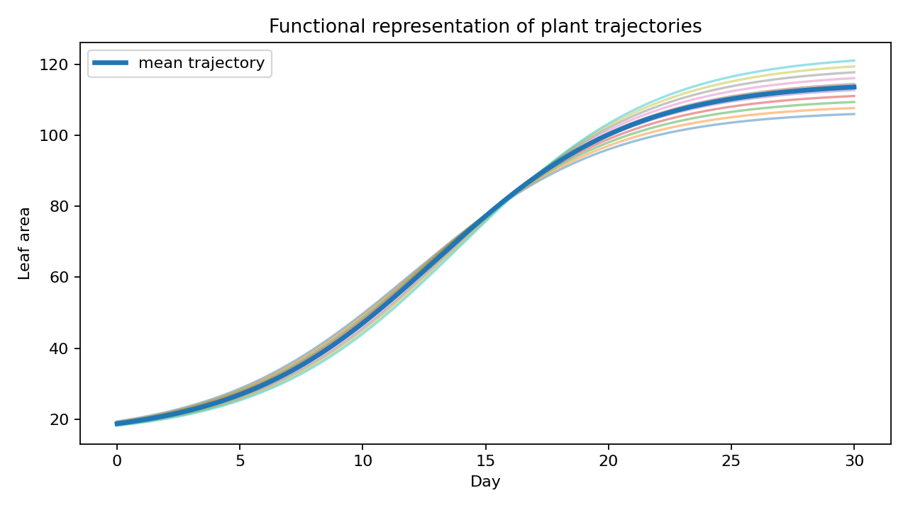

# OmniPhenoR Functional Data Analysis: Treating Plant Trajectories as Phenotypes

## Purpose

Functional data analysis (FDA) treats each complete trajectory as an
object rather than treating each time point as an unrelated variable.
This is useful for growth, disease, senescence, canopy cover, and
stress-recovery phenotypes. Ramsay and Silverman provide the broad
functional-data framework ([Ramsay and Silverman
2005](#ref-Ramsay2005_FDA)), and Yao, Müller, and Wang developed
functional PCA methods for sparse irregular longitudinal data ([Yao et
al. 2005](#ref-Yao2005_FPCA)). OmniPhenoR 0.4.0 provides a lightweight
R-first functional representation and FPCA entry point.



## 1. Build a common functional grid

``` r

d <- subset(pheno_data("growth_series"), trait == "leaf_area")
f <- pheno_functional(
  d,
  id = "plant_id",
  time = "day",
  value = "value"
)
f
#> <pheno_functional>
#>   subjects: 12 
#>   grid points: 5
```

Rows are plants and columns are times. This representation makes the
statistical unit explicit.

## 2. Use a denser grid when interpolation is defensible

``` r

f_dense <- pheno_functional(
  d,
  "plant_id",
  "day",
  "value",
  grid = seq(0, 28, by = 2),
  method = "linear"
)
dim(f_dense$matrix)
#> [1] 12 15
```

A denser grid does not create additional biological information. It
creates a smoother numerical representation of the observed
trajectories.

## 3. Nearest alignment when interpolation is questionable

``` r

f_near <- pheno_functional(
  d,
  "plant_id",
  "day",
  "value",
  grid = seq(0, 28, by = 4),
  method = "nearest"
)
```

This may be preferable for stage-like phenotypes or when linear
interpolation between sparse observations has no meaningful
interpretation.

## 4. Functional PCA

``` r

fp <- pheno_fpca(f, ncomp = 3)
fp$explained
#> [1] 0.91838625 0.04260655 0.02001472
head(fp$scores)
#> # A tibble: 6 × 4
#>   id       PC1    PC2    PC3
#>   <chr>  <dbl>  <dbl>  <dbl>
#> 1 P01   -0.376 -5.70   0.198
#> 2 P02   -1.10   0.657 -0.256
#> 3 P03    1.95   0.637  2.74 
#> 4 P04    2.30  -1.62  -1.92 
#> 5 P05   10.1    0.988  0.429
#> 6 P06   15.0   -1.44  -0.507
```

FPCA scores can become derived phenotypes. A first component may capture
overall size, while subsequent components may capture timing or
curvature. Interpretation must be based on the loadings/trajectory
perturbations rather than assumed from component number.

## 5. Treatment interpretation through scores

``` r

scores <- as.data.frame(fp$scores)
design <- unique(d[c("plant_id", "treatment", "block")])
score_design <- merge(scores, design, by.x = "id", by.y = "plant_id")
score_design
#>     id         PC1        PC2         PC3 treatment block
#> 1  P01  -0.3763896 -5.6960161  0.19757820   control     1
#> 2  P02  -1.0986192  0.6566636 -0.25588728   control     2
#> 3  P03   1.9480772  0.6374460  2.73546127   control     3
#> 4  P04   2.2982821 -1.6158186 -1.92061651   control     4
#> 5  P05  10.0721551  0.9884652  0.42894022  nitrogen     1
#> 6  P06  15.0496020 -1.4358884 -0.50731086  nitrogen     2
#> 7  P07  12.9879967  1.3425246  0.66817446  nitrogen     3
#> 8  P08  12.4973641  2.8438394 -1.13996243  nitrogen     4
#> 9  P09 -13.1722858 -0.7512060 -3.04776738   drought     1
#> 10 P10 -11.3045695 -1.7932560  2.73282613   drought     2
#> 11 P11 -16.0039357  2.6503671  0.02935672   drought     3
#> 12 P12 -12.8976774  2.1728792  0.07920745   drought     4
```

Statistical tests of FPCA scores should use the original experimental
design. PCA does not make repeated plants independent or remove
blocking.

## 6. Trajectory clustering

``` r

clusters <- pheno_trajectory_cluster(
  f,
  centers = 3,
  representation = "fpca",
  ncomp = 2,
  seed = 123
)
clusters
#> # A tibble: 12 × 2
#>    id    cluster
#>    <chr>   <int>
#>  1 P01         1
#>  2 P02         1
#>  3 P03         1
#>  4 P04         1
#>  5 P05         1
#>  6 P06         1
#>  7 P07         1
#>  8 P08         1
#>  9 P09         3
#> 10 P10         3
#> 11 P11         2
#> 12 P12         2
```

Clusters are descriptive patterns, not automatically biological classes.
Stability across seeds, acquisition subsets, and environments should be
evaluated before attaching biological labels.

## 7. Multitrait trajectories

OmniPhenoR keeps traits in long form before functional transformation.
For example, leaf area and green fraction should usually be represented
separately first, because they have different units and biological
meanings.

``` r

all_d <- pheno_data("growth_series")
area_fun <- pheno_functional(subset(all_d, trait=="leaf_area"),
                             "plant_id","day","value")
green_fun <- pheno_functional(subset(all_d, trait=="green_fraction"),
                              "plant_id","day","value")
```

Scores from the two functional analyses can then be combined at the
plant level if a multivariate analysis is desired.

## 8. Derivatives as functional traits

``` r

p1 <- subset(d, plant_id == "P01")
dv <- pheno_derivative(p1, "day", "value", smooth = "spline")
dv
#> # A tibble: 5 × 5
#>    time value derivative order smoothing
#>   <dbl> <dbl>      <dbl> <int> <chr>    
#> 1     0  14.5       2.79     1 spline   
#> 2     7  34.0       3.73     1 spline   
#> 3    14  66.7       4.87     1 spline   
#> 4    21 102.        3.56     1 spline   
#> 5    28 117.        2.06     1 spline
```

The derivative curve can capture growth velocity. Second derivatives can
capture acceleration, but they are highly sensitive to noise and
smoothing.

## 9. Sparse sampling and sensitivity

``` r

pheno_sampling_sensitivity(
  d,
  time = "day",
  value = "value",
  subject = "plant_id",
  every = c(2,3),
  metric = "auc"
)
#> # A tibble: 24 × 6
#>    series every metric  full thinned relative_error
#>    <chr>  <dbl> <chr>  <dbl>   <dbl>          <dbl>
#>  1 P01        2 auc    1878.   1851.       -0.0147 
#>  2 P01        3 auc    1878.   1224.       -0.348  
#>  3 P02        2 auc    1878.   1868.       -0.00536
#>  4 P02        3 auc    1878.   1259.       -0.329  
#>  5 P03        2 auc    1916.   1929.        0.00685
#>  6 P03        3 auc    1916.   1249.       -0.348  
#>  7 P04        2 auc    1921.   1944.        0.0120 
#>  8 P04        3 auc    1921.   1293.       -0.327  
#>  9 P05        2 auc    1984.   1999.        0.00727
#> 10 P05        3 auc    1984.   1328.       -0.331  
#> # ℹ 14 more rows
```

If FPCA patterns change dramatically after removing one acquisition, the
functional phenotype may be less stable than the smooth plot suggests.

## 10. FDA versus nonlinear growth models

A nonlinear growth model estimates a small set of equation-specific
parameters. FDA makes fewer assumptions about curve shape and focuses on
variation among complete functions. These are complementary approaches.

Use nonlinear models when the model parameters themselves have clear
scientific meaning and fits are adequate. Use FDA when trajectory shape
is the phenotype and a fixed parametric equation would be unnecessarily
restrictive.

## Reporting checklist

Report grid definition, interpolation/smoothing, missing-data strategy,
scaling, number of components, variance explained, how component scores
were interpreted, cluster algorithm if used, experimental-unit analysis
of scores, and sensitivity to time-grid choices.

## Final perspective

Functional analysis shifts the question from “at which date are
treatments different?” to “how do complete biological trajectories
differ?” OmniPhenoR provides this representation while preserving the
original subject identity and raw observations.

## Extended worked interpretation

Functional PCA is especially useful when individual trajectories differ
in coordinated ways that are difficult to summarize with one nonlinear
parameter. For example, one component may represent overall canopy size
while another separates early from late expansion. Such patterns should
be interpreted from the eigenfunctions and reconstructed trajectories,
not from component names alone.

Before clustering, inspect whether FPCA scores are dominated by
treatment means, acquisition gaps or scale differences among traits. If
several traits are combined, their units can dominate Euclidean
distances unless an explicit scaling decision is made. OmniPhenoR keeps
the first 0.4.0 functional layer intentionally transparent rather than
hiding these choices behind a large automatic pipeline.

A practical sensitivity analysis is to repeat FPCA after modestly
thinning the time grid. If the leading temporal patterns change
completely, the apparent functional structure may be driven more by
interpolation than by measured plant dynamics.

Ramsay, J. O., and B. W. Silverman. 2005. *Functional Data Analysis*.
2nd ed. Springer. <https://doi.org/10.1007/b98888>.

Yao, Fang, Hans-Georg Muller, and Jane-Ling Wang. 2005. “Functional Data
Analysis for Sparse Longitudinal Data.” *Journal of the American
Statistical Association* 100 (470): 577–90.
<https://doi.org/10.1198/016214504000001745>.
