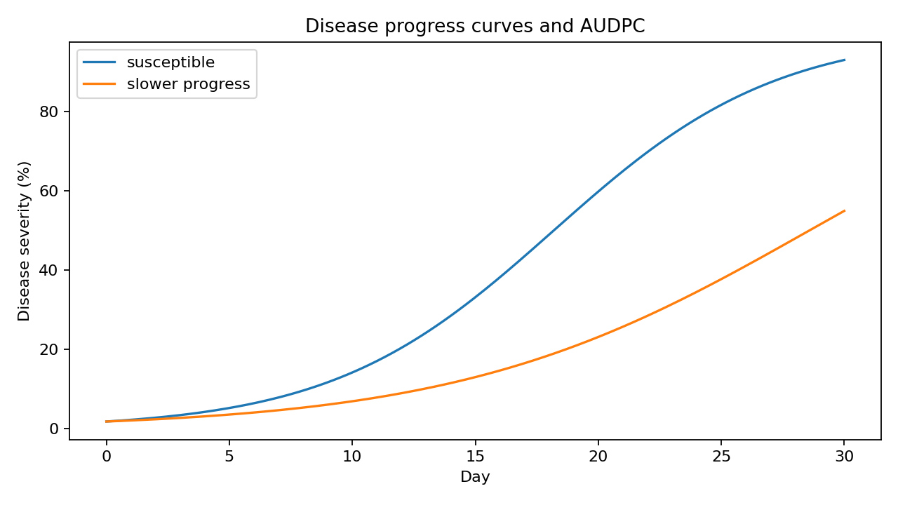

# OmniPhenoR Disease Progress: From Lesion Segmentation to AUDPC

## Purpose

Earlier OmniPhenoR versions quantify lesion masks and disease severity
at a single acquisition. Version 0.4.0 connects those repeated severity
estimates into disease-progress trajectories. The area under the disease
progress curve (AUDPC) has a long history as an integrated measure of
disease intensity through time; Shaner and Finney’s wheat study is a
classic use of this approach ([Shaner and Finney
1977](#ref-Shaner1977_AUDPC)).



## 1. Teaching disease series

``` r

d <- pheno_data("disease_series")
head(d)
#>   plant_id genotype day    severity
#> 1      D01       G1   0  0.08784219
#> 2      D01       G1   7  8.67952324
#> 3      D01       G1  14 31.91261730
#> 4      D01       G1  21 64.58844573
#> 5      D01       G1  28 84.42330166
#> 6      D02       G1   0  1.86219238
```

The table contains repeated severity measurements for two genotypes.

## 2. Disease progress per plant

``` r

p <- pheno_disease_progress(
  d,
  time = "day",
  severity = "severity",
  group = "plant_id"
)
p
#> # A tibble: 12 × 6
#>    series audpc standardized_audpc max_severity onset max_rate
#>    <chr>  <dbl>              <dbl>        <dbl> <dbl>    <dbl>
#>  1 D01    1032.               36.9         84.4     7     4.67
#>  2 D02    1007.               35.9         88.2     7     5.87
#>  3 D03     999.               35.7         87.6    14     5.39
#>  4 D04    1004.               35.8         86.9     7     4.96
#>  5 D05    1038.               37.1         92.2     7     5.05
#>  6 D06    1014.               36.2         88.1     7     5.52
#>  7 D07     475.               17.0         47.7     0     3.09
#>  8 D08     519.               18.5         47.8     0     2.73
#>  9 D09     425.               15.2         46.8    14     3.38
#> 10 D10     442.               15.8         45.2    14     3.09
#> 11 D11     504.               18.0         47.1     7     2.91
#> 12 D12     504.               18.0         47.4     7     2.82
```

The output contains AUDPC, standardized AUDPC, maximum severity,
threshold-defined onset, and maximum observed rate.

## 3. Preserve genotype and plant identity

``` r

p2 <- pheno_disease_progress(
  d,
  "day",
  "severity",
  group = c("genotype", "plant_id"),
  onset_threshold = 10
)
p2
#> # A tibble: 12 × 6
#>    series audpc standardized_audpc max_severity onset max_rate
#>    <chr>  <dbl>              <dbl>        <dbl> <dbl>    <dbl>
#>  1 G1.D01 1032.               36.9         84.4    14     4.67
#>  2 G1.D02 1007.               35.9         88.2    14     5.87
#>  3 G1.D03  999.               35.7         87.6    14     5.39
#>  4 G1.D04 1004.               35.8         86.9    14     4.96
#>  5 G1.D05 1038.               37.1         92.2    14     5.05
#>  6 G1.D06 1014.               36.2         88.1    14     5.52
#>  7 G2.D07  475.               17.0         47.7    14     3.09
#>  8 G2.D08  519.               18.5         47.8    14     2.73
#>  9 G2.D09  425.               15.2         46.8    21     3.38
#> 10 G2.D10  442.               15.8         45.2    14     3.09
#> 11 G2.D11  504.               18.0         47.1    14     2.91
#> 12 G2.D12  504.               18.0         47.4    14     2.82
```

The genotype label is not the replicate identifier. Plant-level
summaries should be generated first and then compared between genotypes
using the experimental design.

## 4. AUDPC directly from one plant

``` r

d1 <- subset(d, plant_id == "D01")
pheno_auc(d1, "day", "severity")
#> [1] 1032.053
pheno_auc(d1, "day", "severity", standardized = TRUE)
#> [1] 36.85904
```

The trapezoidal rule integrates severity over time. Standardized AUDPC
divides by the observation duration and can help when windows differ
slightly, but only when the biological interpretation remains
comparable.

## 5. Partial AUDPC

``` r

pheno_auc(
  d1,
  "day",
  "severity",
  from = 7,
  to = 21
)
#> [1] 479.8262
```

Partial AUC can focus on an epidemiologically relevant stage. The window
should be defined before inspecting treatment effects.

## 6. Disease onset

The `onset_threshold` is a measurement definition, not a universal
epidemiological constant.

``` r

pheno_disease_progress(
  d,
  "day",
  "severity",
  group = "plant_id",
  onset_threshold = 5
)
#> # A tibble: 12 × 6
#>    series audpc standardized_audpc max_severity onset max_rate
#>    <chr>  <dbl>              <dbl>        <dbl> <dbl>    <dbl>
#>  1 D01    1032.               36.9         84.4     7     4.67
#>  2 D02    1007.               35.9         88.2     7     5.87
#>  3 D03     999.               35.7         87.6    14     5.39
#>  4 D04    1004.               35.8         86.9     7     4.96
#>  5 D05    1038.               37.1         92.2     7     5.05
#>  6 D06    1014.               36.2         88.1     7     5.52
#>  7 D07     475.               17.0         47.7     0     3.09
#>  8 D08     519.               18.5         47.8     0     2.73
#>  9 D09     425.               15.2         46.8    14     3.38
#> 10 D10     442.               15.8         45.2    14     3.09
#> 11 D11     504.               18.0         47.1     7     2.91
#> 12 D12     504.               18.0         47.4     7     2.82
```

A threshold should be selected from the measurement sensitivity and
biological objective. If the imaging system cannot reliably distinguish
1% severity from background, a 1% onset threshold is not defensible.

## 7. Smooth trajectory and derivative

``` r

sm <- pheno_smooth(d1, "day", "severity", method = "spline")
rate <- pheno_derivative(d1, "day", "severity", smooth = "spline")
sm
#> # A tibble: 5 × 4
#>    time     raw smoothed method
#>   <dbl>   <dbl>    <dbl> <chr> 
#> 1     0  0.0878   0.0878 spline
#> 2     7  8.68     8.68   spline
#> 3    14 31.9     31.9    spline
#> 4    21 64.6     64.6    spline
#> 5    28 84.4     84.4    spline
rate
#> # A tibble: 5 × 5
#>    time   value derivative order smoothing
#>   <dbl>   <dbl>      <dbl> <int> <chr>    
#> 1     0  0.0878       1.23     1 spline   
#> 2     7  8.68         2.27     1 spline   
#> 3    14 31.9          3.99     1 spline   
#> 4    21 64.6          3.75     1 spline   
#> 5    28 84.4          2.83     1 spline
```

The derivative approximates the instantaneous increase in severity, but
its reliability depends on acquisition frequency and segmentation
repeatability.

## 8. Detect acceleration/change

``` r

pheno_changepoints(
  d1,
  "day",
  "severity",
  method = "slope",
  min_segment = 2
)
#> # A tibble: 1 × 4
#>   index  time score method
#>   <int> <dbl> <dbl> <chr> 
#> 1     2     7  27.5 slope
```

For sparse disease assessments, a single changepoint is descriptive
rather than definitive evidence of a biological transition.

## 9. Image-level severity belongs upstream

A complete workflow can be:

``` text
RGB image
 → leaf segmentation
 → lesion segmentation
 → severity (%)
 → plant × date table
 → pheno_disease_progress()
 → plant-level AUDPC/onset/rate
 → treatment/genotype analysis
```

Uncertainty in segmentation can propagate into disease-progress traits.
If possible, validate severity against independent annotations across
the full severity range rather than only low-disease images.

## 10. Irregular observation intervals

AUDPC naturally uses the actual time differences. This is preferable to
pretending that intervals were equal. However, missing an acquisition
near the period of fastest increase can still bias curve features and
should be assessed with sensitivity analyses.

## Reporting checklist

Report lesion/leaf segmentation method, severity definition, temporal
scale, acquisition dates, AUDPC window, standardized versus raw AUDPC,
onset threshold, smoothing if used, missing acquisition handling,
subject identity, and the statistical model used to compare plant-level
dynamic traits.

## Final perspective

Disease-progress phenotyping is not just repeated image segmentation.
The scientific endpoint is the **trajectory of disease on a defined
biological unit**, with image-processing uncertainty, observation
timing, and experimental replication preserved.

## Extended worked interpretation

Two genotypes can have the same final severity but very different
disease histories. One may develop symptoms early and plateau, while
another remains healthy longer and accelerates late. AUDPC captures part
of this cumulative difference, whereas onset and maximum rate describe
complementary epidemic features. Reporting several predeclared dynamic
traits can therefore be more informative than final severity alone.

When lesions are detected automatically, false positives near senescent
tissue can create an artificial late epidemic acceleration. Compare
representative masks over time and, when possible, validate severity
across early, intermediate and late stages. A segmentation model
validated only at high severity may be unsuitable for estimating onset.

Acquisition timing matters strongly for epidemic rate. If the true
acceleration occurs between widely spaced observations, the largest
interval slope underestimates the peak. Use that limitation in
interpretation rather than presenting the interval rate as an
instantaneous biological constant.

Shaner, Gregory, and Robert E. Finney. 1977. “The Effect of Nitrogen
Fertilization on the Expression of Slow-Mildewing Resistance in Knox
Wheat.” *Phytopathology* 67 (8): 1051–56.
<https://doi.org/10.1094/Phyto-67-1051>.
