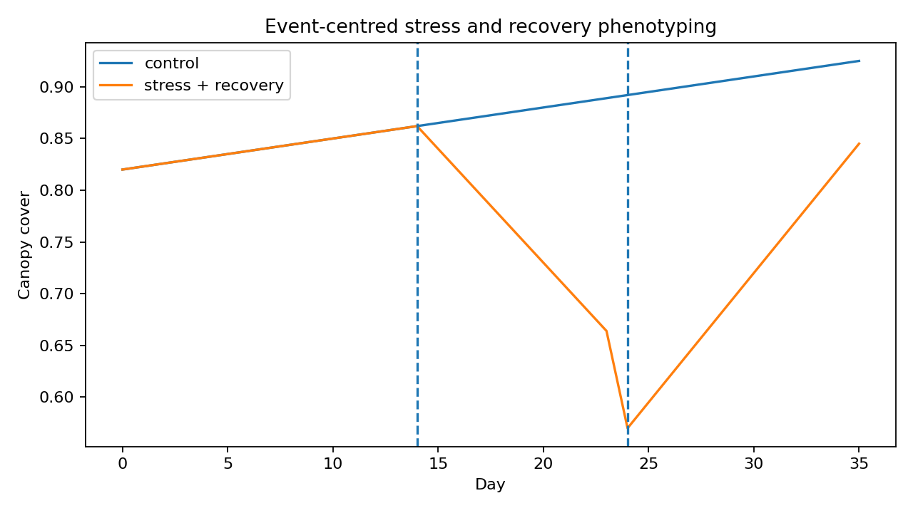

# OmniPhenoR Stress and Recovery: Event-Centred Dynamic Phenotypes

## Purpose

Stress experiments often contain explicit interventions: irrigation
stop, heat exposure, inoculation, herbicide application, nutrient
withdrawal, or rewatering. Version 0.4.0 represents those events
explicitly and derives response and recovery traits without discarding
the original trajectory.



## 1. Teaching drought-recovery series

``` r

d <- pheno_data("drought_recovery")
head(d)
#>   plant_id treatment day canopy_cover green_fraction
#> 1      R01   control   0    0.8123965      0.8735933
#> 2      R01   control   1    0.8381859      0.8710737
#> 3      R01   control   2    0.8027260      0.8762825
#> 4      R01   control   3    0.8164137      0.8693282
#> 5      R01   control   4    0.8425185      0.8756920
#> 6      R01   control   5    0.8338993      0.8708855
```

The stress treatment begins at day 14 and recovery begins at day 24.

## 2. Record the events

``` r

events <- pheno_event(
  event = c("irrigation_stop", "rewatering"),
  time = c(14,24),
  type = c("stress", "recovery")
)
events
#>             event time   id     type
#> 1 irrigation_stop   14 <NA>   stress
#> 2      rewatering   24 <NA> recovery
```

An event table can be stored with the project metadata so the same event
definitions are reused across traits.

## 3. Event-centred response

``` r

r <- pheno_event_response(
  d,
  time = "day",
  value = "canopy_cover",
  event_time = 14,
  group = "plant_id",
  pre = 7,
  post = 14
)
r
#> # A tibble: 10 × 6
#>    series baseline response extreme_time extreme_value recovery
#>    <chr>     <dbl>    <dbl>        <dbl>         <dbl>    <dbl>
#>  1 R01       0.848   0.0677           28         0.915   0.0677
#>  2 R02       0.854   0.0586           28         0.913   0.0586
#>  3 R03       0.854   0.0521           28         0.906   0.0521
#>  4 R04       0.851   0.0641           26         0.915   0.0556
#>  5 R05       0.850   0.0586           28         0.909   0.0586
#>  6 R06       0.853  -0.284            24         0.569  -0.193 
#>  7 R07       0.849  -0.274            24         0.575  -0.176 
#>  8 R08       0.851  -0.281            24         0.570  -0.178 
#>  9 R09       0.849  -0.263            24         0.586  -0.172 
#> 10 R10       0.850  -0.271            24         0.579  -0.181
```

The baseline is estimated from the pre-event window. The response is the
largest absolute deviation from baseline in the post-event window.

## 4. Preserve treatment identity

``` r

r2 <- pheno_event_response(
  d,
  "day",
  "green_fraction",
  event_time = 14,
  group = c("treatment", "plant_id")
)
r2
#> # A tibble: 10 × 6
#>    series      baseline response extreme_time extreme_value recovery
#>    <chr>          <dbl>    <dbl>        <dbl>         <dbl>    <dbl>
#>  1 control.R01    0.899   0.0509           25         0.95    0.0509
#>  2 control.R02    0.901   0.0489           26         0.95    0.0489
#>  3 control.R03    0.903   0.0470           25         0.95    0.0470
#>  4 control.R04    0.905   0.0447           25         0.95    0.0447
#>  5 control.R05    0.901   0.0490           26         0.95    0.0490
#>  6 stress.R06     0.894  -0.282            24         0.612  -0.175 
#>  7 stress.R07     0.899  -0.276            24         0.622  -0.182 
#>  8 stress.R08     0.895  -0.284            24         0.612  -0.157 
#>  9 stress.R09     0.899  -0.292            24         0.607  -0.197 
#> 10 stress.R10     0.904  -0.275            24         0.629  -0.189
```

Again, treatment is not the subject. Plant identity remains explicit.

## 5. Stress and recovery traits

``` r

stress <- subset(d, treatment == "stress")
sr <- pheno_stress_response(
  stress,
  time = "day",
  value = "canopy_cover",
  stress_start = 14,
  recovery_start = 24,
  group = "plant_id"
)
sr
#> # A tibble: 5 × 6
#>   series baseline stress_extreme response recovery_fraction resilience
#>   <chr>     <dbl>          <dbl>    <dbl>             <dbl>      <dbl>
#> 1 R06       0.838          0.674   -0.164             1.09       0.839
#> 2 R07       0.838          0.668   -0.170             1.01       0.849
#> 3 R08       0.839          0.669   -0.169             0.982      0.843
#> 4 R09       0.838          0.666   -0.172             1.17       0.852
#> 5 R10       0.839          0.675   -0.164             1.02       0.849
```

The output includes baseline, stress extreme, response magnitude,
recovery fraction, and a resilience-like trajectory index. The formula
is intentionally recorded by the function implementation and should be
reported rather than referred to only as a generic “resilience index.”

## 6. Different traits can show different response timing

``` r

cover <- pheno_stress_response(stress,"day","canopy_cover",14,24,"plant_id")
green <- pheno_stress_response(stress,"day","green_fraction",14,24,"plant_id")
cover
#> # A tibble: 5 × 6
#>   series baseline stress_extreme response recovery_fraction resilience
#>   <chr>     <dbl>          <dbl>    <dbl>             <dbl>      <dbl>
#> 1 R06       0.838          0.674   -0.164             1.09       0.839
#> 2 R07       0.838          0.668   -0.170             1.01       0.849
#> 3 R08       0.839          0.669   -0.169             0.982      0.843
#> 4 R09       0.838          0.666   -0.172             1.17       0.852
#> 5 R10       0.839          0.675   -0.164             1.02       0.849
green
#> # A tibble: 5 × 6
#>   series baseline stress_extreme response recovery_fraction resilience
#>   <chr>     <dbl>          <dbl>    <dbl>             <dbl>      <dbl>
#> 1 R06       0.888          0.692   -0.195             1.08       0.853
#> 2 R07       0.892          0.714   -0.178             1.12       0.847
#> 3 R08       0.889          0.713   -0.176             0.980      0.853
#> 4 R09       0.890          0.701   -0.189             1.08       0.857
#> 5 R10       0.893          0.715   -0.179             0.928      0.850
```

Canopy closure and greenness may respond at different rates because they
represent different biological processes.

## 7. Derivative of recovery

``` r

p <- subset(stress, plant_id == "R06")
pheno_derivative(
  p[p$day >= 24, ],
  "day",
  "canopy_cover",
  smooth = "spline"
)
#> # A tibble: 12 × 5
#>     time value derivative order smoothing
#>    <dbl> <dbl>      <dbl> <int> <chr>    
#>  1    24 0.564     0.0255     1 spline   
#>  2    25 0.590     0.0255     1 spline   
#>  3    26 0.615     0.0255     1 spline   
#>  4    27 0.641     0.0255     1 spline   
#>  5    28 0.666     0.0255     1 spline   
#>  6    29 0.692     0.0255     1 spline   
#>  7    30 0.717     0.0255     1 spline   
#>  8    31 0.743     0.0255     1 spline   
#>  9    32 0.768     0.0255     1 spline   
#> 10    33 0.794     0.0255     1 spline   
#> 11    34 0.819     0.0255     1 spline   
#> 12    35 0.845     0.0255     1 spline
```

The derivative after rewatering can quantify recovery velocity.
Acquisition frequency must be adequate for the derivative to be
scientifically stable.

## 8. Environmental context

A stress event should be interpreted with environmental records. An
irrigation stop during low VPD is not equivalent to the same duration
under high VPD.

``` r

w <- subset(pheno_data("weather_series"), environment == "E1")
win <- pheno_environment_window(
  w,
  "day",
  c("vpd", "rain", "soil_moisture"),
  window = 5,
  functions = c("mean", "sum", "min")
)
head(win)
#>   environment day       date     tmin     tmax    tmean     rain      vpd
#> 1          E1   0 2026-05-01 18.00000 30.00000 24.00000 0.000000 1.200000
#> 2          E1   1 2026-05-02 18.68404 30.68404 24.68404 5.142301 1.405212
#> 3          E1   2 2026-05-03 19.28558 31.28558 25.28558 7.878462 1.585673
#> 4          E1   3 2026-05-04 19.73205 31.73205 25.73205 6.928203 1.719615
#> 5          E1   4 2026-05-05 19.96962 31.96962 25.96962 2.736161 1.790885
#> 6          E1   5 2026-05-06 19.96962 31.96962 25.96962 0.000000 1.790885
#>   soil_moisture vpd_mean_w5 vpd_sum_w5 vpd_min_w5 rain_mean_w5 rain_sum_w5
#> 1     0.2800000    1.200000   1.200000        1.2     0.000000    0.000000
#> 2     0.3037115    1.302606   2.605212        1.2     2.571150    5.142301
#> 3     0.3153923    1.396962   4.190885        1.2     4.340254   13.020763
#> 4     0.3086410    1.477625   5.910500        1.2     4.987242   19.948966
#> 5     0.2856808    1.540277   7.701385        1.2     4.537025   22.685127
#> 6     0.2700000    1.582045   9.492269        1.2     3.780855   22.685127
#>   rain_min_w5 soil_moisture_mean_w5 soil_moisture_sum_w5 soil_moisture_min_w5
#> 1           0             0.2800000            0.2800000                 0.28
#> 2           0             0.2918558            0.5837115                 0.28
#> 3           0             0.2997013            0.8991038                 0.28
#> 4           0             0.3019362            1.2077448                 0.28
#> 5           0             0.2986851            1.4934256                 0.28
#> 6           0             0.2939043            1.7634256                 0.27
```

## 9. Baseline definition matters

Possible baselines include a single pre-event measurement, mean of
several measurements, model-predicted counterfactual trajectory, or
paired control. OmniPhenoR’s simple event response uses a pre-event
window and is transparent about that choice.

## 10. Recovery is not always return to baseline

A plant can resume growth without returning to the absolute pre-stress
canopy value. Therefore distinguish:

- recovery of the measured trait;
- recovery of growth rate;
- return to control trajectory;
- final yield recovery.

These are different endpoints.

## Reporting checklist

Report event timing, baseline window, stress/recovery phase definitions,
phenotype, subject identity, acquisition frequency, environmental
conditions, response direction, recovery formula, treatment assignment,
missing data, and whether recovery was evaluated relative to baseline or
controls.

## Final perspective

Explicit event-centered phenotyping turns stress experiments from a
collection of before/after images into a reproducible dynamic analysis
of baseline, response magnitude, timing, and recovery.

## Extended worked interpretation

Stress experiments often contain three scientifically distinct phases:
baseline, perturbation and recovery. A single treatment mean across the
entire experiment can hide whether genotypes differ in initial
sensitivity, time to the stress extreme or capacity to recover.
Event-relative traits make those components explicit.

The direction of the response must also be considered. A
drought-sensitive canopy trait may decline, while a stress-related color
or thermal index may increase. The implementation uses deviation from
baseline so both directions can be represented, but interpretation must
retain the original trait meaning.

Recovery should not be inferred from the final observation alone when
the trajectory oscillates after rewatering. Inspect the complete
recovery phase and, for important studies, complement endpoint recovery
fractions with integrated loss or a fitted recovery rate.
