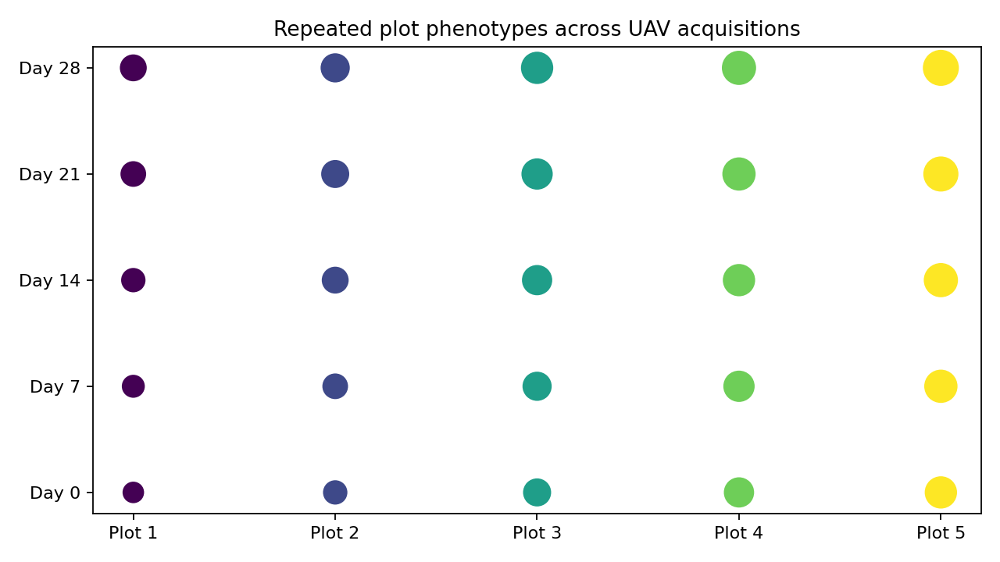

# OmniPhenoR UAV Time Series: Plot Identity Across Repeated Flights

## Purpose

Repeated UAV acquisitions can provide canopy cover, spectral indices,
texture, height, disease, and stress traits at the plot level. The main
longitudinal challenge is not only image processing. It is ensuring that
the same experimental plot is linked correctly across acquisition dates
while coordinate systems, orthomosaic boundaries, and image quality can
change. Field high-throughput phenotyping requires integration of
sensing with experimental and environmental information ([Araus and
Cairns 2014](#ref-Araus2014_FieldHTP)).



## 1. Canonical plot-level table

A recommended post-extraction table has one row per plot × acquisition ×
trait:

``` r

uav_long <- data.frame(
  plot_id = rep(sprintf("plot_%02d", 1:20), times = 5),
  day = rep(c(0,7,14,21,28), each = 20),
  trait = "canopy_cover",
  value = runif(100, .2, .9),
  block = rep(rep(1:4, each=5), times=5)
)
```

The raster itself is not the statistical unit. Plot identity is.

## 2. Build a plot `pheno_series`

``` r

d <- subset(pheno_data("growth_series"), trait == "leaf_area")
# teaching substitute: treat plant_id as plot_id
s <- pheno_series(
  d,
  id = "plant_id",
  time = "day",
  trait = "trait",
  value = "value",
  group = c("block", "treatment")
)
s
#> <pheno_series>
#>   rows: 60 
#>   subjects: 12 
#>   traits: 1 
#>   time range: 0 to 28
```

The same grammar applies to plants in a chamber and plots in an
orthomosaic.

## 3. Validate plot identity before temporal modeling

``` r

pheno_series_validate(s)
#> # A tibble: 4 × 3
#>   check                        pass  detail
#>   <chr>                        <lgl> <chr> 
#> 1 duplicate subject-time-trait TRUE  FALSE 
#> 2 complete identity            TRUE  FALSE 
#> 3 finite numeric values        TRUE  TRUE  
#> 4 within-series order          TRUE  TRUE
```

For real UAV workflows, also verify CRS, plot-polygon uniqueness,
acquisition date, and whether plot geometries were reused or
regenerated.

## 4. Align acquisitions

``` r

pheno_time_align(
  s,
  grid = seq(0,28,by=7),
  method = "exact"
)
#> <pheno_series>
#>   rows: 60 
#>   subjects: 12 
#>   traits: 1 
#>   time range: 0 to 28
```

Exact alignment is preferred when the experiment has coordinated flight
dates. Interpolation should not compensate for incorrect plot matching.

## 5. Environmental linkage

``` r

w <- pheno_data("weather_series")
joined <- pheno_weather_join(
  d,
  w,
  pheno_time = "day",
  weather_time = "day",
  by = "environment"
)
head(joined)
#>   environment day plant_id treatment block     date.x     trait    value
#> 1          E1   0      P01   control     1 2026-05-01 leaf_area 14.49367
#> 2          E1   0      P09   drought     1 2026-05-01 leaf_area 18.59801
#> 3          E1   0      P04   control     4 2026-05-01 leaf_area 19.16524
#> 4          E1   0      P12   drought     4 2026-05-01 leaf_area 16.97905
#> 5          E1   0      P07  nitrogen     3 2026-05-01 leaf_area 16.36706
#> 6          E1   0      P02   control     2 2026-05-01 leaf_area 15.71294
#>       date.y tmin tmax tmean rain vpd soil_moisture
#> 1 2026-05-01   18   30    24    0 1.2          0.28
#> 2 2026-05-01   18   30    24    0 1.2          0.28
#> 3 2026-05-01   18   30    24    0 1.2          0.28
#> 4 2026-05-01   18   30    24    0 1.2          0.28
#> 5 2026-05-01   18   30    24    0 1.2          0.28
#> 6 2026-05-01   18   30    24    0 1.2          0.28
```

Weather can explain trajectory differences that would otherwise be
attributed only to genotype or treatment.

## 6. Dynamic plot traits

``` r

pheno_tidy(
  d,
  subject = "plant_id",
  time = "day",
  value = "value"
)
#> # A tibble: 12 × 5
#>    subject   auc minimum maximum max_slope
#>    <chr>   <dbl>   <dbl>   <dbl>     <dbl>
#>  1 P01     1878.    14.5    117.      5.07
#>  2 P02     1878.    15.7    112.      5.53
#>  3 P03     1916.    14.6    115.      5.94
#>  4 P04     1921.    19.2    117.      5.59
#>  5 P05     1984.    15.9    121.      6.35
#>  6 P06     2051.    16.5    124.      5.80
#>  7 P07     2045.    16.4    120.      6.00
#>  8 P08     2036.    17.7    119.      6.16
#>  9 P09     1754.    18.6    106.      4.92
#> 10 P10     1774.    14.9    108.      5.34
#> 11 P11     1719.    15.7    102.      5.47
#> 12 P12     1768.    17.0    104.      5.47
```

For canopy cover, useful summaries can include cumulative cover AUC,
maximum cover, maximum expansion rate, and time to canopy closure.

## 7. Functional plot trajectories

``` r

f <- pheno_functional(d,"plant_id","day","value")
fp <- pheno_fpca(f,2)
head(fp$scores)
#> # A tibble: 6 × 3
#>   id       PC1    PC2
#>   <chr>  <dbl>  <dbl>
#> 1 P01   -0.376 -5.70 
#> 2 P02   -1.10   0.657
#> 3 P03    1.95   0.637
#> 4 P04    2.30  -1.62 
#> 5 P05   10.1    0.988
#> 6 P06   15.0   -1.44
```

Functional scores can summarize complex trajectory shape, but spatial
field structure still belongs in the downstream experimental model.

## 8. Flight-quality effects

Repeated UAV phenotypes can be affected by:

- illumination;
- cloud/shadow;
- wind-induced canopy movement;
- flight altitude;
- ground sampling distance;
- orthomosaic reconstruction quality;
- radiometric calibration;
- plot boundary misregistration.

These factors should be QC variables rather than silently absorbed into
biological variation.

## 9. Missing plots versus missing flights

A missing entire flight is a date-level gap. A missing plot on one
orthomosaic is a plot-level extraction failure. They have different
statistical implications. Record the reason for missingness if known.

## 10. Repeated-measures inference

``` r

m <- pheno_repeated(
  d,
  response = "value",
  time = "day",
  treatment = "treatment",
  subject = "plant_id",
  block = "block",
  engine = "lm"
)
m
#> <pheno_repeated_fit> lm 
#>   correlation: independence 
#>   response: value  time: day  subject: plant_id
```

For real UAV field trials, more complex spatial or genotype ×
environment models may be appropriate and can remain downstream of
OmniPhenoR’s standardized longitudinal table.

## Reporting checklist

Report sensor/platform, flight dates/times, GSD, calibration,
orthomosaic software, plot geometry source, CRS, plot matching strategy,
QC exclusions, image-derived trait algorithm, time scale, weather
linkage, missing flights/plots, dynamic trait derivation, and
statistical experimental unit.

## Final perspective

The scientific value of UAV time series comes from maintaining a stable
bridge between **pixels, plots, acquisition dates, environment, and
experimental design**. OmniPhenoR’s 0.4.0 temporal objects are designed
to preserve that bridge.

## Extended worked interpretation

Temporal UAV phenotyping combines measurement uncertainty with
geospatial registration uncertainty. If a plot polygon shifts by only a
few pixels between orthomosaics, edge soil or neighboring canopy can
enter the extracted region and mimic biological change. Stable plot
geometry and coordinate reference systems are therefore part of
longitudinal QC, not merely GIS housekeeping.

Repeated flights can also differ in illumination, altitude, camera
settings or mosaicking behavior. Traits based on geometry may tolerate
some radiometric variation, whereas RGB color indices can be strongly
affected. Calibration choices should be recorded alongside the time
series and tested with stable reference targets where possible.

When one flight is missing, interpolation may be acceptable for
visualization but not automatically for every inferential model.
Preserve an acquisition-status flag so the final dynamic trait can be
traced back to observed versus reconstructed dates.

Araus, Jose Luis, and Jill E. Cairns. 2014. “Field High-Throughput
Phenotyping: The New Crop Breeding Frontier.” *Trends in Plant Science*
19 (1): 52–61. <https://doi.org/10.1016/j.tplants.2013.09.008>.
