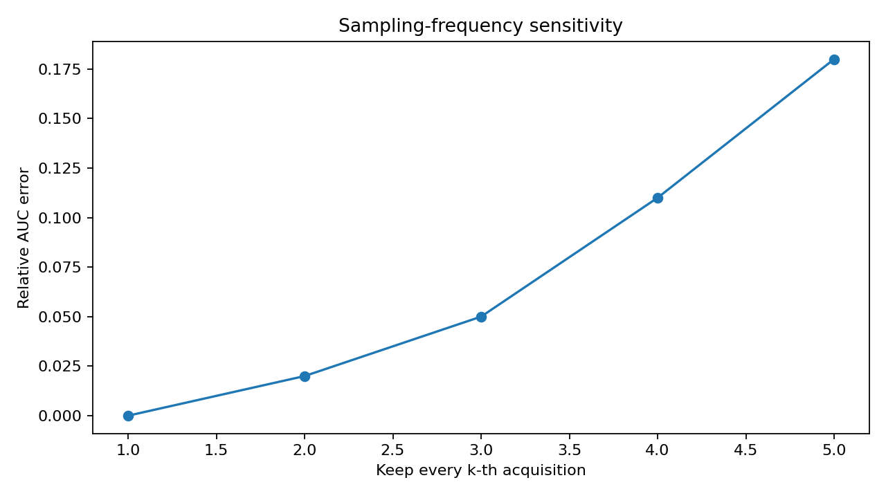

# OmniPhenoR Temporal Validation: Missing Dates, Bootstrap, and Acquisition Sensitivity

## Purpose

A smooth trajectory can look convincing even when its derived traits
depend strongly on one acquisition. Version 0.4.0 therefore treats
temporal validation as a separate scientific layer. Important questions
include: How stable is AUC if dates are removed? Does maximum growth
rate depend on acquisition frequency? Are confidence intervals
resampling biological subjects rather than time points? Changepoint
methods and smoothing algorithms also require sensitivity to sampling
design ([Killick et al. 2012](#ref-Killick2012_Changepoint); [Savitzky
and Golay 1964](#ref-Savitzky1964_Smoothing)).



## 1. Validate the raw series first

``` r

d <- pheno_data("growth_series")
s <- pheno_series(d,"plant_id","day","trait","value")
pheno_series_validate(s)
#> # A tibble: 4 × 3
#>   check                        pass  detail
#>   <chr>                        <lgl> <chr> 
#> 1 duplicate subject-time-trait TRUE  FALSE 
#> 2 complete identity            TRUE  FALSE 
#> 3 finite numeric values        TRUE  TRUE  
#> 4 within-series order          TRUE  TRUE
```

Temporal validation cannot rescue unidentified duplicates or incorrect
experimental identity.

## 2. Inspect quality flags

``` r

q <- pheno_series_qc(s)
table(q$quality_flag)
#> 
#>  OK 
#> 120
```

In real projects, add acquisition-specific flags for blur, shadow,
occlusion, segmentation failure, and sensor/calibration issues.

## 3. Outlier detection marks rather than deletes

``` r

p1 <- subset(d, plant_id == "P01" & trait == "leaf_area")
pheno_time_outliers(
  p1,
  "day",
  "value",
  method = "local_mad"
)
#> # A tibble: 5 × 5
#>    time value score outlier method   
#>   <dbl> <dbl> <dbl> <lgl>   <chr>    
#> 1     0  14.5 1     FALSE   local_mad
#> 2     7  34.0 0.626 FALSE   local_mad
#> 3    14  66.7 0     FALSE   local_mad
#> 4    21 102.  0.711 FALSE   local_mad
#> 5    28 117.  1     FALSE   local_mad
```

A large deviation may be a measurement error or a real biological event.
Removal should require investigation.

## 4. Smoothing sensitivity

``` r

lo <- pheno_smooth(p1,"day","value",method="loess")
#> Warning in simpleLoess(y, x, w, span, degree = degree, parametric = parametric,
#> : span too small.  fewer data values than degrees of freedom.
#> Warning in simpleLoess(y, x, w, span, degree = degree, parametric = parametric,
#> : pseudoinverse used at 0
#> Warning in simpleLoess(y, x, w, span, degree = degree, parametric = parametric,
#> : neighborhood radius 14
#> Warning in simpleLoess(y, x, w, span, degree = degree, parametric = parametric,
#> : reciprocal condition number 0
#> Warning in simpleLoess(y, x, w, span, degree = degree, parametric = parametric,
#> : There are other near singularities as well. 49
#> Warning in predLoess(object$y, object$x, newx = if (is.null(newdata)) object$x
#> else if (is.data.frame(newdata))
#> as.matrix(model.frame(delete.response(terms(object)), : span too small.  fewer
#> data values than degrees of freedom.
#> Warning in predLoess(object$y, object$x, newx = if (is.null(newdata)) object$x
#> else if (is.data.frame(newdata))
#> as.matrix(model.frame(delete.response(terms(object)), : pseudoinverse used at 0
#> Warning in predLoess(object$y, object$x, newx = if (is.null(newdata)) object$x
#> else if (is.data.frame(newdata))
#> as.matrix(model.frame(delete.response(terms(object)), : neighborhood radius 14
#> Warning in predLoess(object$y, object$x, newx = if (is.null(newdata)) object$x
#> else if (is.data.frame(newdata))
#> as.matrix(model.frame(delete.response(terms(object)), : reciprocal condition
#> number 0
#> Warning in predLoess(object$y, object$x, newx = if (is.null(newdata)) object$x
#> else if (is.data.frame(newdata))
#> as.matrix(model.frame(delete.response(terms(object)), : There are other near
#> singularities as well. 49
sp <- pheno_smooth(p1,"day","value",method="spline")
ma <- pheno_smooth(p1,"day","value",method="moving_average",window=3)
```

If phenological landmarks move substantially among reasonable smoothers,
report that instability.

## 5. Acquisition-frequency sensitivity

``` r

leaf <- subset(d, trait == "leaf_area")
sens_auc <- pheno_sampling_sensitivity(
  leaf,
  time = "day",
  value = "value",
  subject = "plant_id",
  every = c(2,3),
  metric = "auc"
)
sens_auc
#> # A tibble: 24 × 6
#>    series every metric  full thinned relative_error
#>    <chr>  <dbl> <chr>  <dbl>   <dbl>          <dbl>
#>  1 P01        2 auc    1878.   1851.       -0.0147 
#>  2 P01        3 auc    1878.   1224.       -0.348  
#>  3 P02        2 auc    1878.   1868.       -0.00536
#>  4 P02        3 auc    1878.   1259.       -0.329  
#>  5 P03        2 auc    1916.   1929.        0.00685
#>  6 P03        3 auc    1916.   1249.       -0.348  
#>  7 P04        2 auc    1921.   1944.        0.0120 
#>  8 P04        3 auc    1921.   1293.       -0.327  
#>  9 P05        2 auc    1984.   1999.        0.00727
#> 10 P05        3 auc    1984.   1328.       -0.331  
#> # ℹ 14 more rows
```

Repeat with `metric = "max_slope"` because derivative traits often
require denser temporal sampling than AUC.

``` r

pheno_sampling_sensitivity(
  leaf,"day","value","plant_id",
  every = c(2,3),
  metric = "max_slope"
)
#> # A tibble: 24 × 6
#>    series every metric     full thinned relative_error
#>    <chr>  <dbl> <chr>     <dbl>   <dbl>          <dbl>
#>  1 P01        2 max_slope  5.07    3.73         -0.264
#>  2 P01        3 max_slope  5.07    4.17         -0.176
#>  3 P02        2 max_slope  5.53    3.83         -0.307
#>  4 P02        3 max_slope  5.53    4.21         -0.238
#>  5 P03        2 max_slope  5.94    4.18         -0.296
#>  6 P03        3 max_slope  5.94    4.27         -0.281
#>  7 P04        2 max_slope  5.59    3.68         -0.341
#>  8 P04        3 max_slope  5.59    4.04         -0.278
#>  9 P05        2 max_slope  6.35    4.19         -0.340
#> 10 P05        3 max_slope  6.35    4.51         -0.289
#> # ℹ 14 more rows
```

## 6. Clustered bootstrap

``` r

stat <- function(z) {
  avg <- aggregate(value ~ day, z, mean)
  c(mean_auc = pheno_auc(avg,"day","value"),
    maximum = max(avg$value))
}

boot <- pheno_time_bootstrap(
  leaf,
  subject = "plant_id",
  statistic = stat,
  R = 50,
  seed = 123
)
boot$interval
#> # A tibble: 2 × 3
#>   statistic lower upper
#>   <chr>     <dbl> <dbl>
#> 1 mean_auc  1841. 1957.
#> 2 maximum    111.  118.
```

The resampling unit is the plant, not the individual measurement. This
preserves the within-plant temporal dependence.

## 7. Change-point sensitivity

``` r

pheno_changepoints(p1,"day","value",method="slope",min_segment=2)
#> # A tibble: 1 × 4
#>   index  time score method
#>   <int> <dbl> <dbl> <chr> 
#> 1     3    14  28.8 slope
```

For short series, a detected split is a descriptive candidate. A
changepoint is not automatically a physiological stage transition.

## 8. Functional stability

``` r

f <- pheno_functional(leaf,"plant_id","day","value")
fp <- pheno_fpca(f,2)
fp$explained
#> [1] 0.91838625 0.04260655
```

Repeat FPCA after removing one date or using a coarser grid. Large
component changes indicate that trajectory summaries depend on
acquisition design.

## 9. Repeated model sensitivity

``` r

a <- pheno_repeated(leaf,"value","day","treatment","plant_id",engine="lm")
pheno_model_diagnostics(a)
#> $summary
#> # A tibble: 1 × 4
#>       n mean_residual sd_residual cor_fitted_residual
#>   <int>         <dbl>       <dbl>               <dbl>
#> 1    60     -2.97e-17        7.29            3.70e-17
#> 
#> $residuals
#> # A tibble: 60 × 2
#>    fitted residual
#>     <dbl>    <dbl>
#>  1   12.8    1.74 
#>  2   39.8   -5.76 
#>  3   66.8   -0.104
#>  4   93.8    8.35 
#>  5  121.    -4.22 
#>  6   12.4    3.26 
#>  7   39.5   -8.83 
#>  8   66.5    2.87 
#>  9   93.5   10.7  
#> 10  120.    -8.05 
#> # ℹ 50 more rows
```

When `nlme` is available, compare scientifically plausible
residual-correlation structures using ML for fixed-effect-consistent
comparisons, then refit the selected structure with REML where
appropriate.

## 10. Validation hierarchy

A recommended hierarchy is:

1.  **measurement validation**: image-derived trait versus independent
    reference;
2.  **temporal consistency**: repeated observations and QC;
3.  **sampling sensitivity**: missing dates/coarser intervals;
4.  **model sensitivity**: curve family, smoother, correlation
    structure;
5.  **biological resampling**: bootstrap at plant/plot level;
6.  **deployment validation**: new genotype, environment, season, or
    sensor domain.

## 11. Do not use treatment significance as a tuning criterion

Choosing smoothing span, segmentation threshold, time window, or growth
model because it maximizes treatment separation creates circular
analysis. Processing choices should be validated independently or
pre-specified.

## Reporting checklist

Report number and timing of acquisitions, missingness, QC rules, outlier
policy, smoothing, model alternatives, sampling-sensitivity results,
bootstrap resampling unit, random seed, changepoint method, validation
domain, and any parameter chosen from data.

## Final perspective

Temporal resolution is part of the measurement system. A dynamic
phenotype is credible when it remains interpretable under defensible
changes to acquisition schedule, processing, and model specification.

## Extended worked interpretation

Validation of a dynamic trait should target the final scientific
quantity. A smoothing algorithm may reproduce individual observations
well but still shift estimated t50 or maximum growth rate. Conversely,
modest pointwise differences may have little effect on AUC. Evaluate
both the trajectory and the derived trait.

Missingness experiments should include structured gaps, not only random
removal of individual dates. Field phenotyping often loses an entire
flight or imaging day because of weather, which affects every treatment
simultaneously. A second scenario should remove selected subjects or
plots to evaluate dependence on biological replication.

For cross-environment deployment, hold out complete environments or
seasons when feasible. Randomly splitting rows from the same plant
across training and validation is especially misleading because
neighboring dates share both biological identity and temporal
information.

Killick, Rebecca, Paul Fearnhead, and Idris A. Eckley. 2012. “Optimal
Detection of Changepoints with a Linear Computational Cost.” *Journal of
the American Statistical Association* 107 (500): 1590–98.
<https://doi.org/10.1080/01621459.2012.737745>.

Savitzky, Abraham, and Marcel J. E. Golay. 1964. “Smoothing and
Differentiation of Data by Simplified Least Squares Procedures.”
*Analytical Chemistry* 36 (8): 1627–39.
<https://doi.org/10.1021/ac60214a047>.
