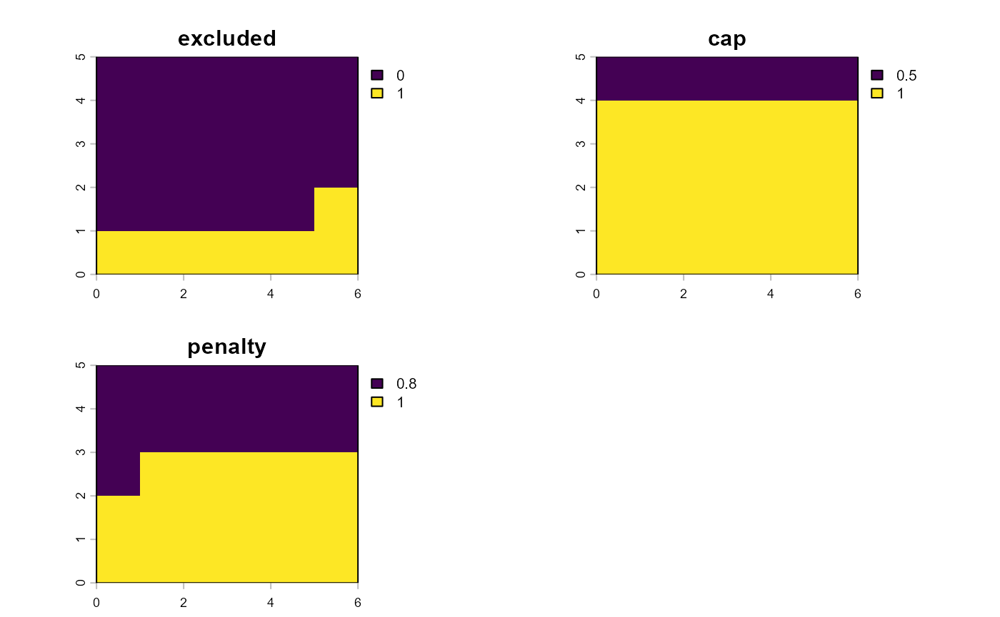

# Soil, terrain, water, and explicit constraints

``` r

knitr::opts_chunk$set(collapse = TRUE, comment = "#>")
library(agriLandSuit)
library(terra)
```

    ## Warning: package 'terra' was built under R version 4.6.1

    ## terra 1.9.46

## Purpose

Version 0.3.0 separates two concepts that should not be conflated in
land-suitability analysis:

1.  **Agronomic criteria**, which produce degrees of suitability between
    0 and 1.
2.  **Constraints**, which express exclusion, an upper suitability cap,
    or a multiplicative penalty.

The examples below use synthetic thresholds for software demonstration
only.

## Synthetic land layers

``` r

r <- rast(ncols=6,nrows=5,xmin=0,xmax=6,ymin=0,ymax=5,crs="EPSG:31985")
soil_depth <- setValues(r, seq(20,120,length.out=ncell(r))); names(soil_depth) <- "depth_cm"
slope <- setValues(r, seq(0,45,length.out=ncell(r))); names(slope) <- "slope_pct"
water_rel <- setValues(r, seq(.4,1,length.out=ncell(r))); names(water_rel) <- "reliability"

land <- land_data(
  soil=soil_depth,
  terrain=slope,
  water=water_rel,
  units=c("soil.depth_cm"="cm","terrain.slope_pct"="percent","water.reliability"="dimensionless")
)
```

## Domain-specific crop requirements

``` r

r_depth <- crop_requirement("depth_cm","soil","cm","increasing",c(30,80),source="synthetic",source_id="demo")
r_slope <- crop_requirement("slope_pct","terrain","percent","decreasing",c(5,30),source="synthetic",source_id="demo")
r_water <- crop_requirement("reliability","water","dimensionless","increasing",c(.4,.8),source="synthetic",source_id="demo")

crop <- crop_profile("demo_crop","Demo species",requirements=list(r_depth,r_slope,r_water))
soil_criteria(land,crop)
#> <agri_domain_criteria> demo_crop 
#>  domain : soil 
#>  scored : 1 criterion/criteria
#>  missing: none
terrain_criteria(land,crop)
#> <agri_domain_criteria> demo_crop 
#>  domain : terrain 
#>  scored : 1 criterion/criteria
#>  missing: none
water_criteria(land,crop)
#> <agri_domain_criteria> demo_crop 
#>  domain : water 
#>  scored : 1 criterion/criteria
#>  missing: none
```

## Explicit restrictions

``` r

c1 <- land_constraint("very_steep","terrain.slope_pct","exclude","gt",threshold=35,unit="percent")
c2 <- land_constraint("shallow","soil.depth_cm","cap","lt",threshold=40,cap=.5,unit="cm")
c3 <- land_constraint("water_limit","water.reliability","penalty","lt",threshold=.65,penalty=.8,unit="dimensionless")

cs <- constraint_set(c1,c2,c3,id="demo_rules")
ev <- constraint_evaluate(land,cs)
ef <- constraint_effects(ev)
constraint_summary(ev)
#>                  name    type            source n_active n_valid  fraction
#> n_active   very_steep exclude terrain.slope_pct        7      30 0.2333333
#> n_active1     shallow     cap     soil.depth_cm        6      30 0.2000000
#> n_active2 water_limit penalty water.reliability       13      30 0.4333333
plot(ef)
```



## Applying restrictions to one score

``` r

soil_score <- soil_criteria(land,crop)$criteria$depth_cm
constrained <- apply_constraints(soil_score,ef)
summary(constrained)
#>   criterion domain engine  n min      mean max
#> 1  depth_cm   soil      r 30   0 0.5091454   1
```

This operation does not aggregate the soil, terrain, and water criteria.
Composite land suitability begins in version 0.4.0.
